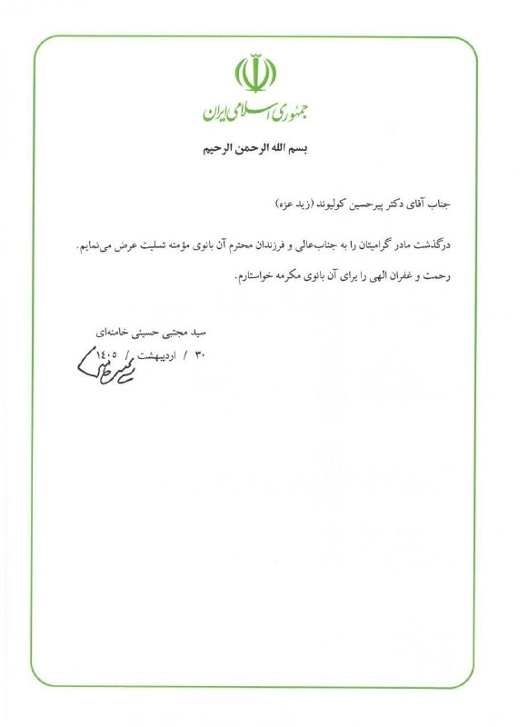
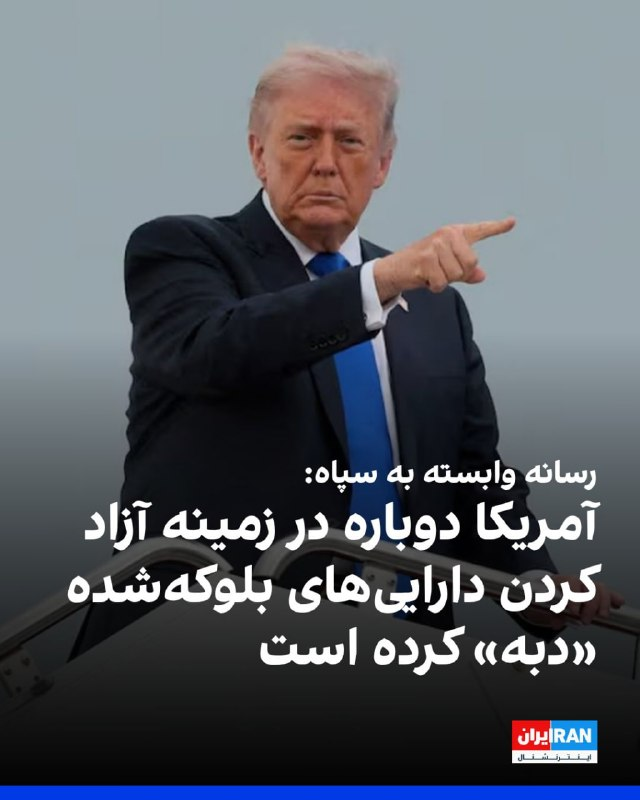
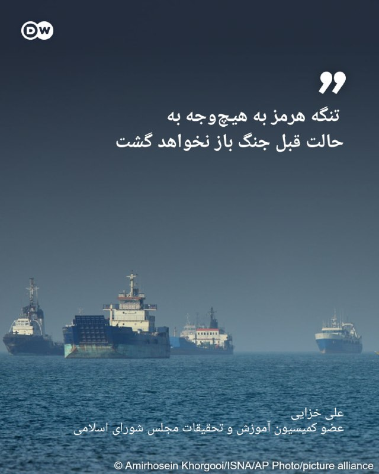
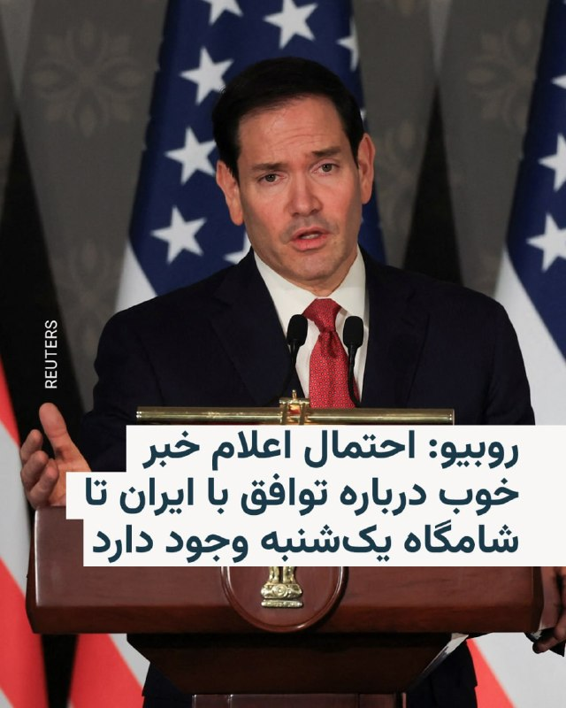
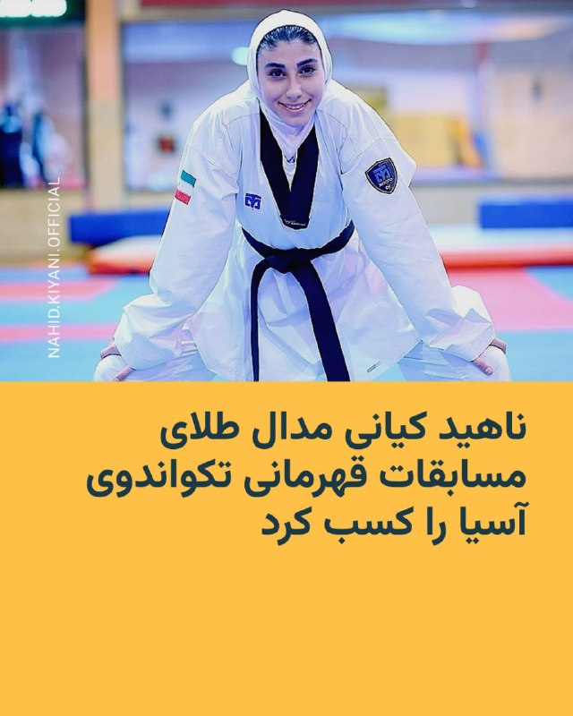

# خواننده تلگرام

<!-- TOP_NAV START -->

<a href="https://github.com/drsploit/aio-DL/blob/main/telegram/content/archive_1.md" style="display:inline-block; padding:6px 12px; margin:0 4px; background-color:#2ea44f; color:white; text-decoration:none; border-radius:4px; font-weight:bold;">صفحه بعد</a>

<!-- TOP_NAV END -->

<!-- MSG START -->

---
📅 بروزرسانی: 1405/03/03 14:00
---

## VahidOOnLine — post 241913

  

وای‌نت به نقل از یک منبع نوشت که نتانیاهو در تماس با ترامپ تاکید کرد، اسرائیل آزادی عمل خود را برای مقابله با تهدیدها در همه جبهه‌ها از جمله لبنان، حفظ خواهد کرد.

بر اساس این گزارش، ترامپ نیز حمایت خود را از این موضوع اعلام کرد.

وای‌نت نوشت که ترامپ در تماس تلفنی با نتانیاهو تاکید کرده در مذاکرات بر خواسته همیشگی خود برای برچیدن برنامه هسته‌ای و خارج کردن همه ذخایر اورانیوم غنی‌شده از خاک ایران پافشاری خواهد کرد.

همچنین کانال ۱۴ اسرائیل به نقل از یک مقام ارشد سیاسی نوشت که اسرائیل به آمریکا اعلام کرده، چه توافقی با جمهوری اسلامی حاصل شود و چه نشود، این کشور آزادی عمل خود برای عملیات در همه بخش‌ها، از جمله در لبنان را حفظ می‌کند.
iranintl
‌🏁 🇬🇧 IranintlTV

🤖 @VahidOOnLine

## VahidOOnLine — post 241912

🗣روایت شما از احتمال توافق میان آمریکا و جمهوری اسلامی- یکشنبه ۳ خرداد

🔹دیگه امیدی به ترامپ نداریم. ما ۴۰ هزار کشته ندادیم که با این حکومت مماشات کنیم. کشورهای دیگه هم به خاطر منافع خودشون از این حکومت حمایت کردن. خودمون کار رو تموم می‌کنیم. مردم عزیز این آخرین نبرده.

🔹ما مردم ایران توافق و آتش‌بس ۶۰ روزه نمی‌خوایم. منتظریم دوباره صدای جنگنده‌ها رو در آسمون ایران بشنویم.

🔹نباید تصمیمات ترامپ برامون مهم باشه. خودمون از داخل کشور باید این رژیم رو زمین بزنیم. ناامید نشو هموطن.

🔹منتظر فراخوان مجدد شاهزاده هستیم تا کار جمهوری اسلامی رو تموم کنیم. زنده بودن در ایران دیگه غیرممکن شده.

🔹داریم زیر بار گرونی کمر خم می‌کنیم و کاری از دستمون برنمیاد. اگه ترامپ توافق کنه بزرگ‌ترین خیانت رو در حق مردم ایران کرده. امیدواریم پایان این شب سیه، سپید باشه.

🔹کدوم توافق؟ هر روز با استرس خبر اعدامی‌ها، افسردگی و فقر و هزار تا بدبختی دیگه که ترامپ و جمهوری اسلامی بهمون تحمیل کردن دست‌وپنجه نرم می‌کنیم.

🔹با خبرهایی که از توافق داره میاد، مشخصه که ما مردم، قربانی سیاست شدیم.

🔹ترامپ خواهشا با این جانیان و قاتلان ملت که در دو روز ۴۰ هزار نفر رو کشتن و تیر خلاص زدن، توافق نکن. این حکومت خون ما رو در شیشه کرده و نمی‌گذاره آزادانه راهپیمایی کنیم و خواسته خودمون رو طلب کنیم. اینا ۴۷ ساله فقط مرگ بر آمریکا و اسرائیل گفتن.
‌🏁 🇬🇧 IranintlTV

🤖 @VahidOOnLine

## VahidOOnLine — post 241911

♦️مارکو روبیو، وزیر خارجه آمریکا، روز یکشنبه در جریان نشست خبری مشترک با سابرامانیام جایشانکار، وزیر خارجه هند، در دهلی‌نو اعلام کرد که طی ۴۸ ساعت گذشته «پیشرفت قابل‌توجهی» در مذاکرات و رایزنی‌های مرتبط با بحران تنگه هرمز و پرونده ایران حاصل شده و احتمال دارد تا ساعاتی دیگر اخبار مهم‌تری در این زمینه منتشر شود. او بدون ارائه جزئیات کامل، گفت هنوز توافق نهایی شکل نگرفته اما مسیر مذاکرات نسبت به روزهای گذشته امیدوارکننده‌تر شده است.
روبیو در ادامه گفت هرگونه توافق احتمالی نیازمند پذیرش کامل ایران و اجرای عملی تعهدات خواهد بود و مذاکرات درباره جزئیات فنی برنامه هسته‌ای، روندی پیچیده و زمان‌بر دارد. او افزود هنوز نمی‌توان درباره موفقیت نهایی مذاکرات با قطعیت صحبت کرد، اما «نشانه‌هایی از پیشرفت واقعی» دیده می‌شود و ممکن است جهان در ساعات آینده خبرهای مثبتی درباره تنگه هرمز و روند مذاکرات دریافت کند.
‌🇸🇦 Indypersian

🤖 @VahidOOnLine

## VahidOOnLine — post 241910

  <a href="telegram/content/VahidOOnLine_241910_1779618623.mp4" target="_blank">🎬 Download video</a>

نت‌بلاکس اعلام کرد انسداد اینترنت در ایران وارد هشتادوششمین روز شده و مردم پس از بیش از دو هزار و ۴۰ ساعت، همچنان در «تاریکی دیجیتال» به سر می‌برند.

این نهاد ناظر بر اینترنت نوشت دسترسی به اینترنت جهانی در ایران، همزمان با ادامه گفت‌وگوهای صلح، همچنان به‌طور گسترده قطع است.

به گفته نت‌بلاکس، در حالی که بخش بزرگی از مردم از دسترسی آزاد به اینترنت محرومند، گروهی از کاربران گزینش‌شده و دارای دسترسی سفید، تصویری ساختگی و کنترل‌شده از زندگی در ایران را به جهان بیرون نشان می‌دهند.
‌🏁 🇬🇧 ManotoTV

🤖 @VahidOOnLine

## VahidOOnLine — post 241909

  

اورزولا فون در لاین، رییس کمیسیون اروپا، از پیشرفت آمریکا و جمهوری اسلامی به سمت توافق استقبال کرد و افزود: «جمهوری اسلامی باید اقدامات بی‌ثبات‌کننده در منطقه را چه به‌صورت مستقیم و چه از طریق نیروهای نیابتی، و همچنین حملات مکرر و بی‌دلیل به همسایگانش را متوقف کند.»

او ادامه داد: «بازگشایی تنگه هرمز اهمیت دارد و به توافقی نیاز داریم که واقعا به کاهش تنش‌ها منجر شود، تنگه هرمز را بازگشایی و آزادی کامل کشتیرانی را بدون دریافت عوارض و بدون محدودیت تضمین کند.»
iranintl
‌🏁 🇬🇧 IranintlTV

🤖 @VahidOOnLine

## VahidOOnLine — post 241908

  

خبرگزاری فارس، وابسته به سپاه پاسداران نوشت تازه‌ترین پیگیری‌ها نشان می‌دهد آمریکا دوباره در زمینه آزاد کردن دارایی‌های بلوکه‌شده «دبه» کرده و تلاش دارد این منابع را نسیه و حواله به آینده کند، اما مسئولین جمهوری اسلامی می‌گویند از این خط قرمز کوتاه نمی‌آیند.

این خبرگزاری افزود: «جمهوری اسلامی تنها در شرایطی حاضر به مذاکره با واشینگتن می‌شود که منافع ملموس اقتصادی به همراه داشته باشد و در این راستا، یکی از محوری‌ترین این منافع، آزادسازی دارایی‌های بلوکه‌شده است.»
iranintl
‌🏁 🇬🇧 IranintlTV

🤖 @VahidOOnLine

## VahidOOnLine — post 241907

♦️گروهی از ایرانیان مقیم هلند شنبه دوم خرداد در شهر لاهه علیه جمهوری اسلامی تجمع اعتراضی برگزار کردند. آنها در این تجمع با در دست داشتن پرچم سه رنگ شیروخورشید نشان ایران در خیابان‌های لاهه راهپیمایی کردند و شعارهایی علیه جمهوری اسلامی سر دادند.
‌🇸🇦 Indypersian

🤖 @VahidOOnLine

## VahidOOnLine — post 241906

  <a href="telegram/content/VahidOOnLine_241906_1779618625.mp4" target="_blank">🎬 Download video</a>

مارکو روبیو، وزیر خارجه آمریکا، در سخنانی در دهلی گفت در پرونده ایران «پیشرفت قابل توجهی» حاصل شده، اما هنوز توافقی نهایی نشده است.

او گفت احتمالا تا ساعاتی دیگر اخبار بیشتری منتشر خواهد شد و افزود هدف اصلی واشینگتن جلوگیری از دستیابی جمهوری اسلامی به سلاح هسته‌ای است.

روبیو همچنین تنگه هرمز را یک آبراه بین‌المللی خواند و گفت جمهوری اسلامی مالک آن نیست. او تهدید کشتی‌های تجاری در این مسیر را غیرقانونی دانست و گفت دولت ترامپ طی ۴۸ ساعت گذشته با شرکای منطقه‌ای برای باز نگه داشتن کامل این آبراه کار کرده است.

وزیر خارجه آمریکا اضافه کرد ترجیح ترامپ حل مسئله از راه دیپلماسی است، اما افزود که این موضوع «به هر شکل» حل خواهد شد.
‌🏁 🇬🇧 ManotoTV

🤖 @VahidOOnLine

## VahidOOnLine — post 241905

  

محمدرسول شیخی‌زاده، دبیر اول کمیسیون بهداشت و درمان مجلس به سایت دیده‌بان‌ایران گفت: «افزایش قیمت دارو به گونه‌ای است که بیمه هم پاسخگو نیست. این در حالی است که دارو جزو کالاهای استراتژیک و حیاتی برای مردم است؛ چه در شرایط جنگی و چه در شرایط عادی و غیرجنگی.»

او افزود: «ما باید حداقل تا شش ماه ذخایر دارویی داشته باشیم. اصلا اگر هیچ جنگی هم اتفاق نمی‌افتاد، وزارت بهداشت، مخصوصا سازمان غذا و دارو، باید نسبت به اجرای این قانون اهتمام بورزد.»
‌🏁 🇬🇧 IranintlTV

🤖 @VahidOOnLine

## VahidOOnLine — post 241904

  

نت‌بلاکس، نهاد ناظر بر اختلال‌های اینترنتی در جهان، گزارش داد قطعی اینترنت در ایران اکنون وارد هشتادوششمین روز خود شده و مردم پس از بیش از دو هزار و ۴۰ ساعت همچنان در تاریکی دیجیتال به سر می‌برند.

بنا بر این گزارش، در حالی که دسترسی به اینترنت جهانی در طول مذاکرات تا حد زیادی قطع است، کاربران نزدیک به حکومت، تصویری مصنوعی از زندگی ایرانیان به جهان خارج ارائه می‌دهند.
iranintl
‌🏁 🇬🇧 IranintlTV

🤖 @VahidOOnLine

## VahidOOnLine — post 241903

  

♦️مارکو روبیو، وزیر خارجه آمریکا روز یکشنبه سوم خرداد در نشست خبری با وزیر خارجه هند گفت: «ممکن است طی ساعات آینده خبرهای خوبی، دست‌کم درباره تنگه هرمز منتشر شود.»

به گزارش رویترز، روبیو که به هند سفر کرده است روز یکشنبه با اشاره به توافق احتمالی ایران و آمریکا گفت: «طی ۴۸ ساعت گذشته با همکاری شرکای خود در منطقه روی چارچوبی کار کرده‌ایم که در صورت موفقیت، نه تنها به باز ماندن کامل تنگه هرمز بدون عوارض منجر می‌شود بلکه به برخی مسائل اساسی مرتبط با جاه‌طلبی‌های هسته‌ای جمهوری اسلامی نیز خواهد پرداخت.»

او با تاکید بر اینکه آزادی ناوبری و کشتیرانی باید تضمین شود،‌ گفت: «تنگه هرمز یک آبراه بین‌المللی است و جمهوری اسلامی مالک آن نیست.»

وزیر خارجه آمریکا همچنین با بیان اینکه این کشور به هدف خود برای کاهش قابل توجه توان موشکی جمهوری اسلامی دست یافته است،‌ گفت: «در مذاکرات با جمهوری اسلامی پیشرفت قابل توجهی حاصل شده اما پیشرفت نهایی هنوز حاصل نشده است.»
‌🇸🇦 Indypersian

🤖 @VahidOOnLine

## VahidOOnLine — post 241902

  

⭕️ رییس بنیاد حفظ آثار و نشر ارزش‌های دفاع مقدس:
تنگه‌های هرمز دیگری هم داریم

♦️بهمن کارگر، رییس بنیاد حفظ آثار و نشر ارزش‌های دفاع مقدس، با اشاره به جنگ چهل روزه و تنش‌های اخیر میان جمهوری اسلامی و آمریکا گفت: «این را بدانید که نیروهای مسلح جمهوری اسلامی محکم ایستاده‌اند، اگر دشمن دست از پا خطا کند، ضربه محکمی خواهد خورد و ما تنگه‌های هرمز دیگری هم داریم که در زمان خود، استفاده خواهد شد.»
او مشخص نکرد منظورش از «تنگه‌های هرمز دیگر» چیست و این مناطق در کجا قرار دارند.
کارگر همچنین با اشاره به اظهارات مقام‌های آمریکایی افزود: «رییس‌جمهور قمارباز و متوهم آمریکا می‌گوید که توان موشکی، دریایی، هوایی و پدافند ما را از بین برده، اگر از بین رفته پس چرا نگران است؟ اگر از بین رفته که پس چرا نمی‌توانند از تنگه هرمز عبور کنند؟»
‌🇸🇦 Indypersian

🤖 @VahidOOnLine

## VahidOOnLine — post 241901

  

♦️مسعود پزشکیان، رئیس‌جمهوری اسلامی ایران روز یکشنبه سوم خرداد در نشستی با مدیران سازمان صداوسیما گفت: «هیچ تصمیمی خارج از چارچوب شورای‌عالی امنیت ملی و بدون هماهنگی و اذن مجتبی خامنه‌ای اتخاذ نخواهد شد.»

پزشکیان افزود: «هنگامی که تصمیمی در حوزه دیپلماسی اتخاذ می‌شود، همه دستگاه‌ها، تریبون‌ها و جریان‌ها باید از آن حمایت کنند.نمی‌توان هر فرد یا جریانی صرفاً بر مبنای سلیقۀ شخصی خود، نسخه‌ای متفاوت برای کشور ارائه دهد؛ چراکه ادارۀ کشور مستلزم تصمیم واحد و تبعیت جمعی است.»

او بر تبعیت خود از رهبری نظام تاکید کرد و گفت: «همواره تلاش کرده‌ام سخنی بر خلاف نظر رهبری بیان نشود و یا موضعی اتخاذ نگردد که به اختلاف میان ارکان حاکمیت دامن بزند و دشمن از آن سوءاستفاده کند.»

رئیس‌جمهوری اسلامی ایران همچنین چاره حل مشکلات کشور را «مساجد» دانست و گفت: «اگر بتوانیم مساجد را به جایگاه واقعی و تاریخی خود بازگردانیم و به پایگاه حل مسائل اجتماعی و مردمی تبدیل کنیم، بسیاری از مشکلات کشور با اتکای به ظرفیت مردم قابل حل خواهد بود.»
‌🇸🇦 Indypersian

🤖 @VahidOOnLine

## WithYashar — post 12316

## WithYashar — post 12315

ما عمر نوح نداریم انقدر صبر کنیم !
@withyashar

## WithYashar — post 12314

Pishro (instagram.com/yashar) – Sonnat Shekan (t.me/withyashar)

## WithYashar — post 12313

نتانیاهو:
خوشحالم که رئیس‌جمهور دونالد ترامپ، بهترین دوستی که اسرائیل تا حالا در کاخ سفید داشته، در امانه و مهاجم قبل از اینکه بتونه آسیب بیشتری بزنه خنثی شده.

خشونت سیاسی، از جمله تلاش‌های مکرر برای ترور ترامپ، باید بدون هیچ ابهامی و با قاطعیت کامل از طرف همه محکوم بشه
@withyashar

## WithYashar — post 12312

## WithYashar — post 12311

عجب سکوتی …

## WithYashar — post 12310

  <a href="telegram/content/WithYashar_12310_1779618631.mp4" target="_blank">🎬 Download video</a>

@withyashar 🤣 بی بی عشقه

## WithYashar — post 12309

کانال ۱۴ اسرائیل: نتانیاهو به وزرا دستور داده است از بحث در مورد توافق قریب الوقوع بین تهران و واشنگتن خودداری کنند
@withyashar

## WithYashar — post 12308

## WithYashar — post 12307

تسنیم: اختلاف بر سر یک یا دو بند در یادداشت تفاهم ادامه دارد. اگر آمریکا به ایجاد موانع ادامه دهد، امکان رسیدن به تفاهم وجود نخواهد داشت
@withyashar

## WithYashar — post 12306

رویترز به‌نقل از یک منبع ارشد ایرانی: ایران تحویل ذخایر اورانیوم خود را نپذیرفته و موضوع هسته‌ای بخشی از توافق اولیه نیست
@withyashar

## mwarmonitor — post 9626

  

🚢یک تانکر LNG ثبت‌شده در بریتانیا به نام FUWAIRIT تلاش کرد از تنگه هرمز عبور کند، اما در جنوب جزیره لارَک متوقف شد.

«حتما عوارض پرداخت نکرده بود؟»

@mwarmonitor

## mwarmonitor — post 9625

🔴ترامپ در سوشال تروث 🔸از سرویس مخفی عالی و نیروهای مجری قانونِ ما برای اقدام سریع و حرفه‌ای امشبِ آن‌ها در برابر فرد مسلحی که در نزدیکی کاخ سفید حضور داشت، سپاسگزارم؛ فردی که سابقه رفتارهای خشونت‌آمیز داشته و احتمالاً به ارزشمندترین بنای کشور ما (کاخ سفید)…

## mwarmonitor — post 9624

  

🛩جت «ARTEMIS II» امروز بر فراز گرجستان در حال پرواز دایره‌ای بوده و احتمالاً حسگرهای خود را به سمت جنوب، یعنی ارمنستان و/یا حتی شمال ایران متمرکز کرده است.

🔸این یک پرواز نادر محسوب می‌شود، زیرا این جت تجاریِ جمع‌آوری اطلاعات سیگنال که متعلق به یک پیمانکار و تحت عملیات ارتش آمریکا است، معمولاً بر فراز اروپای شرقی و همچنین در نزدیکی سواحل لیبی پروازهای مداری انجام می‌دهد.

@mwarmonitor

## mwarmonitor — post 9623

🔴گزارش یک منبع سیاسی: کانال ۱۲ اسرائیل

🔸ایالات متحده در حال به‌روزرسانی اسرائیل درباره مذاکرات مربوط به یک تفاهم‌نامه است که هدف آن بازگشایی تنگه هرمز و پیشبرد مذاکرات برای دستیابی به یک توافق نهایی درباره مسائل مورد اختلاف باقی‌مانده است.

🔹در تماس شب گذشته، نخست‌وزیر به رئیس‌جمهور ترامپ گفت که اسرائیل آزادی کامل اقدام در برابر تهدیدها در همه جبهه‌ها، از جمله لبنان، را حفظ خواهد کرد. ترامپ نیز بار دیگر حمایت خود را از این اصل تأکید کرد.

🔹ترامپ همچنین تأکید کرد که بر برچیده شدن برنامه هسته‌ای ایران و خارج شدن تمام اورانیوم غنی‌شده از خاک این کشور اصرار خواهد داشت و بدون تحقق این شروط، هیچ توافق نهایی را امضا نخواهد کرد.

🔹نخست‌وزیر از ترامپ به خاطر تداوم تعهدش به امنیت اسرائیل تشکر کرد.

@mwarmonitor

## mwarmonitor — post 9622

📌نتانیاهو طی هفته‌های گذشته چندین بار درخواست کرده است با ترامپ صحبت کند، اما طبق گزارش روزنامه «معاریو» به نقل از منابع، تنها دستیاران ترامپ به این درخواست‌ها پاسخ داده‌اند.

@mwarmonitor

## mwarmonitor — post 9621

🔴ایران از ارسال ذخایر اورانیوم بسیار غنی‌شده خود به خارج از کشور خودداری کرده است و تهران تأکید دارد که مذاکرات هسته‌ای خارج از چارچوب فعلیِ در حال بررسی با واشنگتن قرار ندارد. رویترز

@mwarmonitor

## pm_afshaa — post 91375

بچه ها حتما تو چنل زاپاسمون جوین شین ما رو گم نکنین

https://t.me/Pm_Zapas
https://t.me/Pm_Zapas

## pm_afshaa — post 91374

  <a href="telegram/content/pm_afshaa_91374_1779618634.webm" target="_blank">🎬 Download video</a>

🔴نتانیاهو:
خوشحالم که رئیس‌جمهور دونالد ترامپ، بهترین دوستی که اسرائیل تا حالا در کاخ سفید داشته، در امانه و مهاجم قبل از اینکه بتونه آسیب بیشتری بزنه خنثی شده.

خشونت سیاسی، از جمله تلاش‌های مکرر برای ترور ترامپ، باید بدون هیچ ابهامی و با قاطعیت کامل از طرف همه محکوم بشه

💧 Rainbet.com the #1 Non-KYC Crypto Casino & Sportsbook @rainbetcom

😁 @Pm_Afshaa

## pm_afshaa — post 91373

  <a href="telegram/content/pm_afshaa_91373_1779618634.webm" target="_blank">🎬 Download video</a>

🔴شبکه 14 اسرائیل:
نتانیاهو به وزرا دستور داد که در مورد توافق نزدیک ایران و آمریکا صحبت نکنن.

💧 Rainbet.com the #1 Non-KYC Crypto Casino & Sportsbook @rainbetcom

😁 @Pm_Afshaa

## DEJradio — post 4910

⭕️ اردوی تیم ملی فوتبال در جام جهانی به‌جای آریزونا در مکزیک برگزار می‌شود

مهدی تاج، رئیس فدراسیون فوتبال جمهوری اسلامی اعلام کرد تیم ملی در جریان جام جهانی ۲۰۲۶ در شهر تیخوانا در مکزیک مستقر می‌شود.
او گفت فیفا با درخواست جمهوری اسلامی برای انتقال محل اردو از ایالت آریزونا آمریکا موافقت کرد.
بنا بر ادعای تاج، این جابه‌جایی می‌تواند مشکلات مربوط به دریافت ویزا را کاهش دهد. همچنین اعضای تیم می‌توانند با پرواز مستقیم ایران‌ایر به مکزیک سفر کنند.
تیم فوتبال جمهوری اسلامی ایران در حالی برای حضور در جام جهانی آماده می‌شود که هنوز ویزای آمریکا برای بخشی از بازیکنان و اعضای کادر فنی صادر نشده است.
از سویی بنا بر برخی گزارش‌ها، فیفا قصد دارد مانع ورود پرچم‌ شیر و خورشید به ورزشگاه‌ها در هنگام برگزاری جام جهانی بشود.

#فوتبال #جام_جهانی
@DEJradio

## DEJradio — post 4909

⭕️ قوۀ قضائیه از اعدام یک شهروند به اتهام همکاری با آمریکا و اسرائیل خبر داد

قوۀ قضائیۀ جمهوری اسلامی اعلام کرد شهروندی به نام مجتبا کیان را با اتهام «ارسال اطلاعات مراکز صنایع دفاعی» به آمریکا و اسرائیل اعدام کرده است.
به گزارش خبرگزاری میزان، وابسته به دستگاه قضائی مدعی شد مجتبا کیان در دوران جنگ اخیر اطلاعات مربوط به واحدهای صنایع دفاعی را به خارج ارسال کرده بود.
میزان مدعی شد که از دیگر موارد اتهامی مجتبا کیان، ارسال پیام‌ برای «شبکه‌های معاند» بوده است.
قوۀ قضائیه هیچ توضیحی درمورد شغل یا شیوۀ دسترسی او به اطلاعات صنایع دفاعی ارائه نکرد.
در ماه‌های اخیر جمهوری اسلامی بارها شهروندانی را به اتهام ارسال تصاویر و اطلاعات برای رسانه‌های خارج از کشور، بازداشت کرد.
رویۀ اتهام‌زنی، بازداشت، شکنجه و اعدام شهروندان، در همۀ سال‌های اخیر توسط حکومت ادامه داشته است.
حکومت از شکنجه و اعدام مخالفان به عنوان ابزاری برای ترساندن و عقب‌راندن مخالفان استفاده می‌کند.

#اعدام #زندانیان_سیاسی
@DEJradio

## DEJradio — post 4908

⭕️ فرماندۀ سپاه تهدید آمریکا و اسرائیل را ازسر گرفت

در حالی که رسانه‌های نزدیک به سپاه از نزدیک شدن تهران و واشینگتن به یک «تفاهم اولیه» خبر دادند، فرماندۀ سپاه پاسداران دربارۀ هرگونه حملۀ دوباره هشدار داد.
احمد وحیدی تهدید کرد که در صورت حمله، نیروهای مسلح جمهوری اسلامی، واکنشس «ویرانگر و جهنمی» در ابعاد منطقه‌ای و فرامنطقه‌ای انجام می‌دهند.
ادعاهای فرماندۀ سپاه در حالی است که در دوران جنگ چهل روزه، شمار بسیاری از فرماندهان ارشد و میانی این نیرو و همچنین پایگاه‌های موشکی و پهپادی جمهوری اسلامی نابود شده است.
#سپاه_تروریستی_پاسداران
@DEJradio

## DEJradio — post 4907

⭕️چهره‌های جمهوری‌خواه از توافق احتمالی ترامپ با ایران انتقاد کردند

همزمان با گزارش‌ها دربارۀ توافق احتمالی میان دولت دونالد ترامپ و جمهوری اسلامی، چند چهرۀ برجسته جمهوری‌خواه از این روند انتقاد کردند.
لیندزی گراهام، سناتور جمهوری‌خواه گفت توافقی که به جمهوری اسلامی اجازۀ حفظ قدرت منطقه‌ای را بدهد، در بلندمدت «کابوسی برای اسرائیل» می‌شود.
مایک پمپئو، وزیر امور خارجۀ نخستین دولت ترامپ گفت توافق احتمالی به هیچ وجه در راستای شعار «اول آمریکا» نیست.
پمپئو توافق احتمالی را به توافق هسته‌ای {برجام} در زمان دولت باراک اوباما شبیه دانست.
تد کروز، سناتور جمهوری‌خواه، نیز هشدار داد اگر نتیجۀ جنگ این باشد که جمهوری اسلامی همچنان توان غنی‌سازی اورانیوم و کنترل موثر بر تنگۀ هرمز را حفظ کند، این «اشتباهی فاجعه‌بار» است.
مورگان اورتگاس، نمایندۀ پیشین دولت ترامپ در امور خاورمیانه، هم هشدار داد جمهوری اسلامی ممکن است از مذاکرات برای «خرید زمان» و کاهش فشارها استفاده کند.

#تفاهم #مذاکرات #لیندسی_گراهام
@DEJradio

## DEJradio — post 4906

⭕️ اکسیوس: تهران و واشینگتن به تفاهم‌نامۀ ۶۰ روزه نزدیک شدند

وبسایت خبری اکسیوس به نقل از منابع آگاه گزارش داد جمهوری اسلامی و آمریکا به امضای یک «یادداشت تفاهم ۶۰ روزه» نزدیک شده‌اند.
بر اساس این گزارش، این تفاهم‌نامه توافق نهایی محسوب نمی‌شود، اما می‌تواند آتش‌بس را تمدید کند، به بازگشایی تنگۀ هرمز بینجامد و زمینۀ مذاکرات تازۀ هسته‌ای را فراهم کند.
به گزارش اکسیوس، جمهوری اسلامی در چارچوب این تفاهم متعهد می‌شود تنگۀ هرمز را بدون دریافت عوارض باز نگه دارد و مین‌های کارگذاشته شدۀ احتمالی را جمع‌آوری کند.
اکسیوس نوشت دولت آمریکا نیز محاصرۀ بنادر ایران را متوقف و بخشی از تحریم‌ها را تعلیق می‌کند.
بنا بر این گزارش، تهران اجازه می‌یابد موقتا بخشی از نفت خود را به فروش برساند.
به نوشتۀ اکسیوس، در دورۀ شصت روزه مسائل هسته‌ای حل نمی‌شود.
اکسیوس به نقل از منابع آگاه گفت در دو ماه پیش رو، مذاکراتی دربارۀ توقف غنی‌سازی، انتقال ذخایر اورانیوم و تعهد جمهوری اسلامی به نرفتن به سمت سلاح هسته‌ای انجام می‌شود.

#مذاکرات #برنامه_اتمی
@DEJradio

## DEJradio — post 4905

⭕️ پاکستان برای میزبانی دور تازۀ مذاکرات جمهوری اسلامی و آمریکا ابراز امیدواری کرد

پس از پیام دونالد ترامپ درمورد نزدیک بودن توافق با جمهوری اسلامی، شهباز شریف، نخست‌وزیر پاکستان، ابراز امیدواری کرد دور تازۀ مذاکرۀ تهران و واشینگتن «در آینده‌ای بسیار نزدیک» در اسلام‌آباد برگزار شود.
از سویی خبرگزاری حکومتی فارس، نزدیک به سپاه پاسداران، پیام‌های ترامپ را «تبلیغاتی و برای مصرف داخلی آمریکا» عنوان کرد.
در سوی دیگر، وبسایت اکسیوس گزارش داد پیش‌نویس تفاهم‌نامه‌ای در حال آماده شدن است که ترامپ «در شرف امضای آن» قرار دارد.
بر اساس گزارش اکسیوس، جمهوری اسلامی از طریق میانجی‌ها به‌صورت شفاهی تعهد داده هرگز به‌دنبال سلاح هسته‌ای نرود و درباره تعلیق غنی‌سازی و انتقال ذخایر اورانیوم مذاکره کند.
خبرگزاری حکومتی فارس مدعی شد «هیچ تعهدی از سوی تهران داده نشده» است.
به ادعای این خبرگزاری نزدیک به سپاه، پروندۀ هسته‌ای در این مرحله از مذاکرات «مورد بحث قرار نگرفته است.»

#مذاکرات #تفاهم #پاکستان
@DEJradio

## DEJradio — post 4904

⭕️ رسانۀ اسرائیلی: برخی مشاوران ترامپ او را به سوی توافقی ناخوشایند با تهران می‌برند

شبکه ۱۳ اسرائیل گزارش داد مقام‌های این کشور بر این باورند که تهران و واشینگتن به توافق احتمالی نزدیک‌تر شده‌اند.
به گزارش شبکۀ ۱۳ اسرائیل، مقام‌های این کشور گفته‌اند فشار برخی مشاوران دونالد ترامپ بر او برای توافق با تهران، در روزهای اخیر افزایش یافته است.
اسرائیل پیش‌تر تصور می‌کرد اختلاف بر سر مسائل کلیدی مانع توافق می‌شود، اما اکنون برخی مقام‌های این کشور فکر می‌کنند روند مذاکرات به‌خلاف ارزیابی‌های قبلی به پیش می‌رود.
بر اساس این گزارش، بخشی از نهاد امنیتی اسرائیل از روند مذاکرات ناخشنود است.

#مذاکرات #تفاهم #اسرائیل
@DEJradio

## DEJradio — post 4903

  <a href="telegram/content/DEJradio_4903_1779618635.mp4" target="_blank">🎬 Download video</a>

🎤
⭕️ یک میلیون شغل پودر شد و بیش از سه هزار واحد صنعتی به خاکستر تبدیل گشت! این کارنامه تکان‌دهنده شوک پس از جنگ بر بازار کار ایران است.
آمارهای رسمی از بیکاری مستقیم و غیرمستقیم دو میلیون نفر خبر می‌دهند. از قزوین و کرمان تا اصفهان، غول‌های تولید دست به تعدیل‌های بی‌سابقه زده‌اند،تا جایی که در صنعت خودرو، تولید به یک‌سوم سقوط کرده ودر فولاد مبارکه، از ۲۷ هزار کارگر فقط دو هزار نفر سر کار برگشته‌اند! کارگران باقی‌مانده نیز میان دوراهی اخراج یا کاربا نصف حقوق و بدون مزایاگرفتار شده‌اند؛ آن هم در حالی که صندوق‌های حمایتی دولت کاملاً خالی است.
عطا حسینیان گزارش می‌دهد.

#گزارش #اقتصاد
@DEJradio

## DEJradio — post 4902

⭕️
⭕️ روبیو گفت احتمال دارد خبری در مورد توافق با جمهوری اسلامی تا شامگاه یک‌شنبه اعلام شود

مارکو روبیو، وزیر امور خارجۀ آمریکا، گفت ممکن است تا شامگاه یک‌شنبه خبری درمورد توافقی با تهران اعلام شود که می‌تواند رسما به جنگ خاورمیانه پایان بدهد.
روبیو در جمع خبرنگاران در دهلی‌نو گفت: شاید در چند ساعت آینده دنیا «خبرهای خوبی» دریافت کند.
او افزود توافق در حال شکل‌گیری به نگرانی‌های آمریکا درباره تنگۀ هرمز می‌پردازد.
به گفتۀ وزیر امور خارجۀ آمریکا، این توافق می‌تواند روندی را آغاز کند که در پایان به هدف دونالد ترامپ یعنی رفع نگرانی دربارۀ برنامه هسته‌ای تهران منجر شود.

#تفاهم #تنگه_هرمز
@DEJradio

## DEJradio — post 4901

  <a href="telegram/content/DEJradio_4901_1779618638.mp4" target="_blank">🎬 Download video</a>

👑🎥 پرفورمنس های ایرانیان در نقاط مختلف دنیا در حمایت از مردم ایران، انقلاب شیر و خورشید و زندانیان سیاسی

#همبستگی
@DEJradio

## DEJradio — post 4900

📢🎥 یک شهروند با ارسال ویدیویی با اشاره به گرانی شدید مواد خوراکی، می‌گوید حبوبات انقدر گران شده که داره به لیست آرزوها اضافه میشه".

#صدای_شما #گرانی
@DEJradio

## DEJradio — post 4897

🔸📷 تصاویر ماهواره‌ای نشان می‌دهد در جنگ ۴۰ روزه پایگاه یکم دریایی ارتش در بندرعباس به طور کامل تخریب شده است. این پایگاه به عنوان، مرکز اورهال و ساخت ناو، اهمیت بسیاری داشت.
بالا ترین داک خشک، ۳ ناو البرز (۷۲) از کلاس الوند، یک ناو از کلاس هنگام و یک ناو دیگر از کلاس کمان/سینا (احتمالی) در حال اورهال بودند که بمباران شدند.
منابع غیررسمی داخلی گزارش دادند در داک مسقف، یک زیردریایی کلاس کیلو که از سال ۹۷ در حال اورهال بوده، نیز مورد اصابت قرار گرفته اما آسیب به زیردریایی مشخص نیست. اشاره شده که این زیردریایی از قبل جنگ ۴۰ روزه وضعیت بدی داشته است.
در داک شناور نیز یک ناو از کلاس هنگام در حال اورهال بود که هدف قرار گرفته است.
براساس تصاویر ماهواره‌ای لاشه ناو زاگرس نیز در اسکله قابل مشاهده است.

#جنگ_چهل_روزه #بندرعباس
@DEJradio

## DEJradio — post 4895

🔸
⭕️ صاحبان نانوایی‌ها در استان کرمانشاه در اعتراض به گرانی آرد و هزینه‌ها و مالیات‌های سنگین روز یکشنبه سوم خرداد ۱۴۰۵ اعتصاب کردند و در مقابل استانداری دست به اعتراض زدند.
گرانی آرد، سبب افزایش قیمت نان می‌شود و شهروندانی هستند که حتی برایشان خرید نان به عنوان اولیه‌ترین غذا برای سیر کردن شکم دشوار است.

#اعتصابات #نانوایی
@DEJradio

## DEJradio — post 4894

  <a href="telegram/content/DEJradio_4894_1779618641.webm" target="_blank">🎬 Download video</a>

🔸
🔺 روزنامه «نیویورک‌تایمز» در گزارشی با اشاره به اینکه هنوز جزییات دقیق توافق احتمالی آمریکا و جمهوری اسلامی روشن نیست، به‌نقل از مقام‌های آمریکایی گزارش داد که حکومت با واگذاری اورانیوم غنی‌شده موافقت کرده است.
اشاره این روزنامه به حدود ۴۴۰ کیلوگرم اورانیوم ۶۰ درصدی است که گفته می‌شود در تأسیسات اصفهان مدفون شده است.
دو مقام آمریکایی به نیویورک‌تایمز گفتند یکی از عناصر کلیدی توافق پیشنهادی میان حکومت ایران و ایالات متحده، تعهد ظاهری تهران به واگذاری ذخایر اورانیوم با غنای بالا است.
*باید در نظر گرفت روزنامه «نیویورک تایمز» و نویسندگان آن از جمله فرناز فصیحی سوابق طولانی در تولید فیک‌نیوز و همسویی با حکومت دارند.
*دو روز پیش از اعلام توافق احتمالی، دو منبع ارشد ایرانی به رویترز گفته‌ بودند که مجتبی خامنه‌ای، رهبر جدید جمهوری اسلامی، دستور داده است که اورانیوم غنی‌شده این کشور نباید به خارج منتقل شود. به گفته این منابع، این دستور می‌تواند باعث نارضایتی بیشتر ترامپ شده و مذاکرات برای پایان جنگ را پیچیده‌تر کند.
*پیش‌تر پوتین نیز پیشنهاد داده بود اورانیوم‌ها به روسیه منتقل شوند اما سـ.ـپاه اساسا با خارج کردن این اروانیوم‌ها مخالف است و گزینه رقیق‌سازی را پیشنهاد شده بود.

#تفاهم #ترامپ #جمهوری_اسلامی
@DEJradio

## DEJradio — post 4893

  <a href="telegram/content/DEJradio_4893_1779618642.webm" target="_blank">🎬 Download video</a>

🔸
🔺 دونالد ترامپ رئیس جمهور آمریکا در «تروث سوشال» اعلام کرد که گفت‌وگوهای «بسیار خوبی» با شماری از رهبران منطقه داشته است و تنها نهایی‌سازی متن توافق باقی مانده است و تنگه هرمز هم باز می‌شود.
او افزود که به‌طور جداگانه با بنیامین نتانیاهو، نخست‌وزیر اسرائیل، نیز گفت‌وگو کرده و این تماس هم «بسیار خوب» بوده است.
در واکنش به این اظهارات خبرگزاری فارس، وابسته به سـ.ـپاه، اظهارات ترامپ مبنی بر نزدیک شدن به توافق با ایران و بازگشایی تنگه هرمز را رد کرد ونوشت: «این ادعا نیز با واقعیت‌ها فاصله دارد».
فارس در ادامه نوشت: «بر اساس آخرین متن ردوبدل‌شده، در صورت توافق احتمالی، تنگه هرمز کماکان تحت مدیریت ایران خواهد بود و اگرچه ایران موافقت کرده اجازه دهد تعداد کشتی‌های عبوری به میزان قبل از جنگ بازگردد، اما این به‌هیچ‌عنوان به معنای تردد آزاد به وضعیت قبل از جنگ نیست و مدیریت تنگه، تعیین مسیر، زمان، نحوه عبور و صدور مجوز، کماکان در انحصار و با تدبیر جمهوری اسلامی ایران خواهد بود.»
خبرگزاری سپاه در ادامه مدعی شد که برخلاف شروط پیشین ترامپ مبنی بر گنجاندن برنامه هسته‌ای در توافق، «هیچ تعهدی از سوی ایران داده نشده و پرونده هسته‌ای اساسا در این مرحله مورد بحث قرار نگرفته است.»
فارس همچنین ادعا کرد که «مقامات آمریکایی در پیغام‌های متعدد به ایران اذعان داشته‌اند که توییت‌های ترامپ عمدتا جنبه تبلیغاتی و مصرف رسانه‌ای در داخل آمریکا دارد و توصیه کرده‌اند که به این اظهارات توجهی نشود».

#ترامپ #مذاکرات #تفاهم
@DEJradio

## DEJradio — post 4892

🎤
⭕️ آنچه امروز میان جمهوری اسلامی و غرب جریان دارد، بیشتر «مدیریت بحران» است تا یک توافق واقعی؛ بازی پیچیده‌ای از تهدید، بازدارندگی و تلاش برای جلوگیری از انفجار بزرگ در خاورمیانه. پژمان گلچین دانش‌آموخته فلسفه در گفتگو با دژ به چرایی و سرانجام این مذاکره پرداخته است.

#گفتگو
@DEJradio

## mamlekate — post 103576

📝 ایران و آمریکا به تفاهم اولیه نزدیک شدند؛ جزئیات گزارش‌شده از تفاهم‌نامه

وب‌سایت اکسیوس به نقل از منابع خود گزارش داده است که آمریکا و جمهوری اسلامی ایران به امضای یک یادداشت تفاهم ۶۰ روزه نزدیک شده‌اند؛ تفاهمی که در صورت نهایی شدن می‌تواند آتش‌بس را تمدید کند، تنگه هرمز را بازگشاید، فشار بر بازار جهانی نفت را کاهش دهد و زمینه‌ساز دور تازه‌ای از مذاکرات هسته‌ای شود.

بر اساس این گزارش، تفاهم‌نامه پیشنهادی ۶۰ روز اعتبار خواهد داشت و با توافق دو طرف می‌تواند تمدید شود. در این دوره، ایران متعهد می‌شود تنگه هرمز را بدون دریافت عوارض باز کند و مین‌هایی را که احتمالا در این مسیر کار گذاشته شده، جمع‌آوری کند تا کشتی‌ها بتوانند آزادانه عبور کنند.

در مقابل، دولت ترامپ محاصره بنادر ایران را لغو خواهد کرد و برخی معافیت‌های تحریمی را صادر می‌کند تا ایران بتواند نفت خود را در بازار جهانی بفروشد. یک مقام آمریکایی گفته است این اقدام برای ایران «منفعت اقتصادی بزرگی» خواهد داشت، اما همزمان به کاهش فشار بر بازار جهانی نفت نیز کمک می‌کند.

اکسیوس تأکید کرده که مسائل هسته‌ای در این دوره ۶۰ روزه حل نخواهد شد، بلکه دو طرف دربارهٔ تعلیق غنی‌سازی اورانیوم، انتقال ذخایر اورانیوم غنی‌شده و تعهد ایران به دنبال نکردن سلاح هسته‌ای مذاکره خواهند کرد.

بر اساس این گزارش، رفع تحریم‌ها و آزادسازی دارایی‌های مسدودشده ایران نیز در این دوره بررسی می‌شود، اما اجرای آن منوط به توافق نهایی و قابل راستی‌آزمایی خواهد بود.

اکسیوس همچنین نوشته است که پیش‌نویس تفاهم‌نامه شامل پایان جنگ اسرائیل و حزب‌الله در لبنان نیز هست، موضوعی که بنیامین نتانیاهو در تماس با دونالد ترامپ نسبت به آن ابراز نگرانی کرده است.

@mamlekate

## kianmeli1 — post 87626

🔴یکی از همسایگان بیت خامنه ای میگفت از بالای پشت بام به بیت که نگاه میکنیم صاف شده حتی یک آجر سالم نمانده

سوال: چگونه مجتبی زنده مانده

دو حالت دارد:
۱-مجتبی آنجا نبوده
۲-اگر بوده کشته شده

بنظر ما مجتبی آنجا نبوده و مطلع بوده از حمله
https://t.me/kianmeli1

## kianmeli1 — post 87625

  

🔴چندروز پیش ۳۰ اردیبهشت مجتبی خامنه ای پیام تسلیتی را امضا کرده که جالبه
دست خطش این مدلیه یا واقعا نمیتونه امضا کنه در بستریه!

شبیه دست خط نهضت سوادآموزیه
https://t.me/kianmeli1

## kianmeli1 — post 87624

  

🔴هشدار شدید پمپئو به ترامپ:

‏به نظر می‌رسد توافقی که با ایران در حال انجام است، به‌طور مستقیم از روی نقشه وندی شرمن-رابرت مالی-بن رودز بیرون آمده: به سپاه پاسداران پول بدهید تا یک برنامه سلاح‌های کشتار جمعی بسازد و جهان را ترور کند.
‏این اصلا ربطی به شعار «اول آمریکا» ندارد.
‏موضوع خیلی ساده است:
‏تنگه را باز کنید.
‏دسترسی ایران به پول را قطع کنید.
‏و آن‌قدر توانایی‌های ایران را هدف قرار دهید که دیگر نتواند متحدان ما در منطقه را تهدید کند.
‏خیلی دیر شده.
‏وقتشه اقدام کنند.
https://t.me/kianmeli1

## kianmeli1 — post 87623

  

🔴اساسا چرا باید حمله کند! اگر بناست به براندازی٫ کار بزرگ را کردند تا قبل کشتن خامنه ای ، همه میگفتند با حذف خامنه ای کار تمام میشود حال می گویند منتظریم خامنه ای دوم حذف شود کار را تمام میکنیم به این حضرات که ۲۴ ساعت در تلویزیون ها نشسته اند تحت عناوین…

## IranIntlTV — post 338739

  

🔻سایت اتلتیک در گزارشی درباره تغییر کمپ تیم ملی از آریزونای آمریکا به تیخوانا در مکزیک، که به گفته مهدی تاج، رییس فدراسیون فوتبال، برای حل مشکل ویزای اعضای تیم انجام شده است، نوشت با وجود این اقدام، تیم ملی برای هر بازی باید ویزا بگیرد: «تمامی بازیکنان و اعضای کادر همچنان برای ورود به ایالات متحده جهت برگزاری مسابقات نیاز به ویزا خواهند داشت.»

🔹اتلتیک اشاره می‌کند که با این تغییر، «اگر برخی اعضای غیرضروری در روز مسابقه برای دریافت ویزای آمریکا با مشکل مواجه باشند، انتقال کمپ به مکزیک می‌تواند به آن‌ها اجازه دهد در کنار تیم بمانند، اما برای مسابقات سفر نکنند.»

🔹یک ماه پیش، مارکو روبیو، وزیر خارجه آمریکا، درباره ورود همراهان تیم ملی به ایالات متحده گفت: «آن‌ها نمی‌توانند یک مشت تروریست عضو سپاه را به عنوان روزنامه‌نگار یا مربی ورزشی وارد کشور ما کنند.»

🔹اتلتیک نوشته است این تغییر کمپ تیم فوتبال ایران در حالی رخ داده که مقام‌های آریزونا برای استقبال از این تیم آماده می‌شدند.

جزییات بیشتر را در سایت بخوانید.

@iranintltvsport

## IranIntlTV — post 338738

  <a href="telegram/content/IranIntlTV_338738_1779618646.mp4" target="_blank">🎬 Download video</a>

وزیر دفاع پیشین اسرائیل از مطرح شدن لبنان به‌عنوان بخشی از توافق میان واشینگتن و تهران انتقاد کرد. اردوغان نیز در تماس با ترامپ، بر حل اختلافات از راه دیپلماسی تاکید کرد و از مذاکرات با جمهوری اسلامی حمایت کرد.

گزارش اشکان صفایی و نرگس هورخش، خبرنگاران ایران‌اینترنشنال

@iranintltv

## IranIntlTV — post 338737

  <a href="telegram/content/IranIntlTV_338737_1779618648.mp4" target="_blank">🎬 Download video</a>

رسانه‌های پاکستان گزارش دادند در حمله انتحاری به قطار مسافربری در شهر کویته، دست‌کم ۲۴ نفر کشته و حدود ۵۰ نفر زخمی شدند. به گفته این رسانه‌ها، بخشی از واگن‌ها حامل نظامیان پاکستانی بود. ارتش آزادی‌بخش بلوچستان مسئولیت این حمله را بر عهده گرفت.
گفت‌وگو با وحید پیمان، روزنامه‌نگار
@iranintltv

## IranIntlTV — post 338736

  

وای‌نت به نقل از یک منبع نوشت که نتانیاهو در تماس با ترامپ تاکید کرد، اسرائیل آزادی عمل خود را برای مقابله با تهدیدها در همه جبهه‌ها از جمله لبنان، حفظ خواهد کرد.

بر اساس این گزارش، ترامپ نیز حمایت خود را از این موضوع اعلام کرد.

وای‌نت نوشت که ترامپ در تماس تلفنی با نتانیاهو تاکید کرده در مذاکرات بر خواسته همیشگی خود برای برچیدن برنامه هسته‌ای و خارج کردن همه ذخایر اورانیوم غنی‌شده از خاک ایران پافشاری خواهد کرد.

همچنین کانال ۱۴ اسرائیل به نقل از یک مقام ارشد سیاسی نوشت که اسرائیل به آمریکا اعلام کرده، چه توافقی با جمهوری اسلامی حاصل شود و چه نشود، این کشور آزادی عمل خود برای عملیات در همه بخش‌ها، از جمله در لبنان را حفظ می‌کند.
iranintl.com/202605249125

## IranIntlTV — post 338735

🗣روایت شما از احتمال توافق میان آمریکا و جمهوری اسلامی- یکشنبه ۳ خرداد

🔹دیگه امیدی به ترامپ نداریم. ما ۴۰ هزار کشته ندادیم که با این حکومت مماشات کنیم. کشورهای دیگه هم به خاطر منافع خودشون از این حکومت حمایت کردن. خودمون کار رو تموم می‌کنیم. مردم عزیز این آخرین نبرده.

🔹ما مردم ایران توافق و آتش‌بس ۶۰ روزه نمی‌خوایم. منتظریم دوباره صدای جنگنده‌ها رو در آسمون ایران بشنویم.

🔹نباید تصمیمات ترامپ برامون مهم باشه. خودمون از داخل کشور باید این رژیم رو زمین بزنیم. ناامید نشو هموطن.

🔹منتظر فراخوان مجدد شاهزاده هستیم تا کار جمهوری اسلامی رو تموم کنیم. زنده بودن در ایران دیگه غیرممکن شده.

🔹داریم زیر بار گرونی کمر خم می‌کنیم و کاری از دستمون برنمیاد. اگه ترامپ توافق کنه بزرگ‌ترین خیانت رو در حق مردم ایران کرده. امیدواریم پایان این شب سیه، سپید باشه.

🔹کدوم توافق؟ هر روز با استرس خبر اعدامی‌ها، افسردگی و فقر و هزار تا بدبختی دیگه که ترامپ و جمهوری اسلامی بهمون تحمیل کردن دست‌وپنجه نرم می‌کنیم.

🔹با خبرهایی که از توافق داره میاد، مشخصه که ما مردم، قربانی سیاست شدیم.

🔹ترامپ خواهشا با این جانیان و قاتلان ملت که در دو روز ۴۰ هزار نفر رو کشتن و تیر خلاص زدن، توافق نکن. این حکومت خون ما رو در شیشه کرده و نمی‌گذاره آزادانه راهپیمایی کنیم و خواسته خودمون رو طلب کنیم. اینا ۴۷ ساله فقط مرگ بر آمریکا و اسرائیل گفتن.

## IranIntlTV — post 338734

  

اورزولا فون در لاین، رییس کمیسیون اروپا، از پیشرفت آمریکا و جمهوری اسلامی به سمت توافق استقبال کرد و افزود: «جمهوری اسلامی باید اقدامات بی‌ثبات‌کننده در منطقه را چه به‌صورت مستقیم و چه از طریق نیروهای نیابتی، و همچنین حملات مکرر و بی‌دلیل به همسایگانش را متوقف کند.»

او ادامه داد: «بازگشایی تنگه هرمز اهمیت دارد و به توافقی نیاز داریم که واقعا به کاهش تنش‌ها منجر شود، تنگه هرمز را بازگشایی و آزادی کامل کشتیرانی را بدون دریافت عوارض و بدون محدودیت تضمین کند.»
iranintl.com/202605242210

## IranIntlTV — post 338733

  <a href="telegram/content/IranIntlTV_338733_1779618651.mp4" target="_blank">🎬 Download video</a>

مارکو روبیو، وزیر خارجه آمریکا، در نشست خبری با همتای هندی خود گفت هدف نهایی واشینگتن جلوگیری از دستیابی جمهوری اسلامی به سلاح هسته‌ای است. روبیو گفت پیشرفت‌هایی در روند توافق با جمهوری اسلامی حاصل شده اما هنوز نهایی نشده است.
@iranintltv

## IranIntlTV — post 338732

  

خبرگزاری فارس، وابسته به سپاه پاسداران نوشت تازه‌ترین پیگیری‌ها نشان می‌دهد آمریکا دوباره در زمینه آزاد کردن دارایی‌های بلوکه‌شده «دبه» کرده و تلاش دارد این منابع را نسیه و حواله به آینده کند، اما مسئولین جمهوری اسلامی می‌گویند از این خط قرمز کوتاه نمی‌آیند.

این خبرگزاری افزود: «جمهوری اسلامی تنها در شرایطی حاضر به مذاکره با واشینگتن می‌شود که منافع ملموس اقتصادی به همراه داشته باشد و در این راستا، یکی از محوری‌ترین این منافع، آزادسازی دارایی‌های بلوکه‌شده است.»
iranintl.com/202605249983

## IranIntlTV — post 338731

  <a href="telegram/content/IranIntlTV_338731_1779618654.mp4" target="_blank">🎬 Download video</a>

یک شهروند با ارسال پیامی به ایران‌اینترنشنال می‌گوید: «باید متحد و یکپارچه منتظر فراخوان شاهزاده باشیم. در این دنیا هرکس دلش برای خودش و کشورش می‌سوزد. کار را ما باید تمام کنیم نه آمریکا. اتحاد ما از هر بمبی خطرناکتر است و می‌‌توانیم کشورمان رو پس بگیریم.»

## IranIntlTV — post 338730

  

محمدرسول شیخی‌زاده، دبیر اول کمیسیون بهداشت و درمان مجلس به سایت دیده‌بان‌ایران گفت: «افزایش قیمت دارو به گونه‌ای است که بیمه هم پاسخگو نیست. این در حالی است که دارو جزو کالاهای استراتژیک و حیاتی برای مردم است؛ چه در شرایط جنگی و چه در شرایط عادی و غیرجنگی.»

او افزود: «ما باید حداقل تا شش ماه ذخایر دارویی داشته باشیم. اصلا اگر هیچ جنگی هم اتفاق نمی‌افتاد، وزارت بهداشت، مخصوصا سازمان غذا و دارو، باید نسبت به اجرای این قانون اهتمام بورزد.»
https://iranintl.com/202605246981

## IranIntlTV — post 338729

  

نت‌بلاکس، نهاد ناظر بر اختلال‌های اینترنتی در جهان، گزارش داد قطعی اینترنت در ایران اکنون وارد هشتادوششمین روز خود شده و مردم پس از بیش از دو هزار و ۴۰ ساعت همچنان در تاریکی دیجیتال به سر می‌برند.

بنا بر این گزارش، در حالی که دسترسی به اینترنت جهانی در طول مذاکرات تا حد زیادی قطع است، کاربران نزدیک به حکومت، تصویری مصنوعی از زندگی ایرانیان به جهان خارج ارائه می‌دهند.
iranintl.com/202605247794

## IranIntlTV — post 338728

  <a href="telegram/content/IranIntlTV_338728_1779618658.mp4" target="_blank">🎬 Download video</a>

همزمان با انتشار خبرهایی درباره احتمال توافق میان آمریکا و جمهوری اسلامی، شهروندان به آن واکنش نشان دادند.

مهدی تاجیک، عضو تحریریه ایران‌اینترنشنال، از پیام‌های ارسالی مخاطبان به ایران‌اینترنشنال می‌گوید

@iranintltv

## IranIntlTV — post 338727

ابهام در توافق احتمالی؛ جمهوری اسلامی واگذاری ذخایر اورانیوم غنی‌شده را رد کرد

یک منبع ارشد ایرانی به رویترز گفت تهران با انتقال ذخایر اورانیوم با غنای بالا موافقت نکرده و موضوع هسته‌ای بخشی از تفاهم اولیه با آمریکا نیست؛ اظهاراتی که روایت‌های منتشرشده درباره توافق قریب‌الوقوع میان دو کشور را زیر سوال می‌برد.

یک منبع ارشد ایرانی به خبرگزاری رویترز گفته است جمهوری اسلامی با انتقال ذخایر اورانیوم با غنای بالا به خارج از کشور موافقت نکرده و مساله هسته‌ای هنوز بخشی از تفاهم اولیه میان تهران و واشینگتن نیست.

این منبع که نامش فاش نشده، به رویترز گفت: «موضوع هسته‌ای در مذاکرات برای توافق نهایی بررسی خواهد شد و بخشی از تفاهم فعلی نیست. هیچ توافقی درباره خروج ذخایر اورانیوم غنی‌شده ایران از کشور حاصل نشده است.»

اظهارات این منبع در حالی مطرح می‌شود که طی ساعت‌های گذشته گزارش‌هایی از رسانه‌های آمریکایی، از جمله اکسیوس و نیویورک‌تایمز منتشر شده بود مبنی بر اینکه توافق احتمالی میان جمهوری اسلامی و آمریکا می‌تواند شامل محدودیت‌هایی بر برنامه هسته‌ای ایران، تمدید آتش‌بس و بازگشایی تنگه هرمز باشد.

وب‌سایت اکسیوس پیش‌تر گزارش داده بود توافقی که تهران و واشینگتن در آستانه دستیابی به آن هستند، احتمالاً شامل یک یادداشت تفاهم ۶۰ روزه خواهد بود که طی آن تنگه هرمز بدون دریافت عوارض باز می‌شود، ایران پاکسازی مین‌های دریایی را آغاز می‌کند و دو طرف مذاکرات درباره برنامه هسته‌ای را ادامه می‌دهند.

براساس این گزارش، آمریکا در مقابل برخی محدودیت‌های مربوط به فروش نفت ایران را کاهش داده و محاصره دریایی را تعدیل خواهد کرد. اکسیوس همچنین به نقل از منابع خود نوشته بود جمهوری اسلامی تعهدات شفاهی درباره توقف غنی‌سازی و کنار گذاشتن ذخایر اورانیوم با غنای بالا ارائه کرده است.

هم‌زمان، خبرگزاری تسنیم، وابسته به نهادهای امنیتی جمهوری اسلامی، نیز گزارش داد حتی در صورت دستیابی به تفاهم اولیه، وضعیت تنگه هرمز به شرایط پیش از جنگ بازنخواهد گشت. به نوشته تسنیم، تفاهم احتمالی تنها می‌تواند بازگشت تدریجی تعداد کشتی‌های عبوری به سطح پیش از جنگ را در برگیرد، نه بازگشت کامل وضعیت سابق.

براساس این گزارش، تهران همچنان بر «اعمال حق حاکمیت» خود بر تنگه هرمز تاکید دارد و هرگونه تغییر در عبور و مرور کشتی‌ها را به اجرای سایر تعهدات آمریکا، از جمله رفع کامل محاصره دریایی، مشروط کرده است.

در همین رابطه، مارکو روبیو، وزیر خارجه آمریکا نیز یکشنبه سوم خرداد در نشست خبری با وزیر خارجه هند گفت که آزادی ناوبری و کشتیرانی باید تضمین شود و تنگه هرمز یک آبراه بین‌المللی است و جمهوری اسلامی مالک آن نیست.

روبیو گفت که در مذاکرات با جمهوری اسلامی پیشرفت قابل توجهی حاصل شده اما پیشرفت نهایی حاصل نشده است.

در اسرائیل نیز نگرانی‌ها درباره چارچوب احتمالی توافق افزایش یافته است. یک مقام اسرائیلی به کانال ۱۲ این کشور گفته چارچوب در حال شکل‌گیری توافق «بد» است و به تهران نشان می‌دهد می‌تواند از تنگه هرمز به‌عنوان اهرمی راهبردی، با اثری مشابه یک سلاح هسته‌ای، استفاده کند.

هم‌زمان، رسانه‌های اسرائیلی گزارش داده‌اند توافق احتمالی میان آمریکا و حکومت ایران ممکن است شامل لبنان نیز شود و به کاهش یا پایان درگیری‌ها میان اسرائیل و حزب‌الله بینجامد؛ موضوعی که با مخالفت برخی مقام‌های اسرائیلی روبه‌رو شده است.

بنی گانتس، وزیر دفاع پیشین اسرائیل، هشدار داده پذیرش توقف درگیری‌ها در لبنان به‌عنوان بخشی از توافق با [حکومت] ایران، «اشتباهی راهبردی» خواهد بود که اسرائیل سال‌ها هزینه آن را خواهد پرداخت.

در همین حال، اسحاق دار، وزیر امور خارجه پاکستان، از تماس تلفنی ترامپ با رهبران کشورهای منطقه از جمله عربستان سعودی، قطر، مصر، ترکیه، امارات و پاکستان تقدیر کرد و آن را گامی مهم برای نزدیک شدن به توافق و ثبات منطقه‌ای توصیف کرده است. او همچنین از نقش پاکستان و فرمانده ارتش این کشور در روند میانجی‌گری میان تهران و واشینگتن قدردانی کرد.

با وجود نشانه‌های فزاینده از نزدیک شدن به یک تفاهم موقت، اختلاف بر سر موضوعات کلیدی از جمله سرنوشت ذخایر اورانیوم غنی‌شده، آینده برنامه هسته‌ای ایران، وضعیت تنگه هرمز و دامنه کاهش تحریم‌ها، همچنان ابهام درباره توافق نهایی را حفظ کرده است. گزارش رویترز نشان می‌دهد تهران دست‌کم در مرحله کنونی، یکی از مهم‌ترین خواسته‌های واشینگتن یعنی واگذاری ذخایر اورانیوم غنی‌شده را نپذیرفته است.

🔗متن کامل گزارش را اینجا بخوانید
@iranintltv

## Shin_Persian — post 6195

Shin ✓ @hey_itsmyturn
Sun, 24 May 2026 10:20:32 UTC

3 Iraqi Counter-Terrorism Service personnel killed, 4 wounded by ISIS IED in Hadhr desert, southwest Nineveh Province, #Iraq 🇮🇶

فارسی

۳ تن از پرسنل سرویس ضد تروریسم عراق کشته و ۴ تن دیگر در پی انفجار بمب کنار جاده‌ای داعش در بیابان الحضر، واقع در جنوب غربی استان نینوا، زخمی شدند. #Iraq 🇮🇶

𝕏 · @shin_persian

## ManotoTV — post 105799

  <a href="telegram/content/ManotoTV_105799_1779618659.mp4" target="_blank">🎬 Download video</a>

نت‌بلاکس اعلام کرد انسداد اینترنت در ایران وارد هشتادوششمین روز شده و مردم پس از بیش از دو هزار و ۴۰ ساعت، همچنان در «تاریکی دیجیتال» به سر می‌برند.

این نهاد ناظر بر اینترنت نوشت دسترسی به اینترنت جهانی در ایران، همزمان با ادامه گفت‌وگوهای صلح، همچنان به‌طور گسترده قطع است.

به گفته نت‌بلاکس، در حالی که بخش بزرگی از مردم از دسترسی آزاد به اینترنت محرومند، گروهی از کاربران گزینش‌شده و دارای دسترسی سفید، تصویری ساختگی و کنترل‌شده از زندگی در ایران را به جهان بیرون نشان می‌دهند.

## ManotoTV — post 105798

  <a href="telegram/content/ManotoTV_105798_1779618660.mp4" target="_blank">🎬 Download video</a>

مارکو روبیو، وزیر خارجه آمریکا، در سخنانی در دهلی گفت در پرونده ایران «پیشرفت قابل توجهی» حاصل شده، اما هنوز توافقی نهایی نشده است.

او گفت احتمالا تا ساعاتی دیگر اخبار بیشتری منتشر خواهد شد و افزود هدف اصلی واشینگتن جلوگیری از دستیابی جمهوری اسلامی به سلاح هسته‌ای است.

روبیو همچنین تنگه هرمز را یک آبراه بین‌المللی خواند و گفت جمهوری اسلامی مالک آن نیست. او تهدید کشتی‌های تجاری در این مسیر را غیرقانونی دانست و گفت دولت ترامپ طی ۴۸ ساعت گذشته با شرکای منطقه‌ای برای باز نگه داشتن کامل این آبراه کار کرده است.

وزیر خارجه آمریکا اضافه کرد ترجیح ترامپ حل مسئله از راه دیپلماسی است، اما افزود که این موضوع «به هر شکل» حل خواهد شد.

## FarsiVOA — post 218506

  <a href="telegram/content/FarsiVOA_218506_1779618663.mp4" target="_blank">🎬 Download video</a>

اسرائیل از انهدام چند انبار تسلیحات حماس خبر داد؛

ارتش اسرائیل اعلام کرد در روزهای اخیر چند انبار تسلیحات سازمان تروریستی حماس را هدف قرار داده و نابود کرده است.

نیروهای ارتش اسرائیل در طول ۲۴ ساعت گذشته، سه انبار تسلیحات حماس را در مرکز نوار غزه هدف قرار داده و نابود کردند. از جمله تسلیحات موجود در این انبارها که در نتیجه حملات نابود شدند، راکت‌های ضد تانک، سلاح‌های بلند، آرپی‌جی، جلیقه‌های ضدگلوله و تجهیزات جنگی دیگر بودند.

در رویدادی دیگر در روز چهارشنبه، نیروهای ارتش اسرائیل یک انبار تسلیحات دیگر شامل مواد منفجره، پرتاب‌کننده‌های آرپی‌جی، نارنجک‌های دستی و خشاب‌های سازمان تروریستی حماس را در مرکز نوار غزه هدف قرار داده و نابود کردند.

ارتش اسرائیل می‌گوید که این تسلیحات برای آسیب رساندن به نیروهایش که در منطقه خط زرد فعالیت می‌کنند و همچنین شهروندان اسرائیلی طراحی شده بودند و به منظور رفع تهدید نابود شدند.

پس از حملات، انفجارهای ثانویه‌ای مشاهده شد که نشان‌دهنده وجود تسلیحات در انبارها بود.
@FarsiVOA

## FarsiVOA — post 218505

  

کی‌یر استارمر، نخست‌وزیر بریتانیا، از «پیشرفت به سوی توافق» میان آمریکا و جمهوری اسلامی برای پایان دادن به جنگ استقبال کرد.

استارمر در پیامی در شبکه ایکس نوشت بریتانیا با شرکای بین‌المللی خود همکاری خواهد کرد تا از این فرصت برای دستیابی به یک «راه‌حل دیپلماتیک بلندمدت» استفاده شود.

این موضع پس از آن مطرح شد که مقام‌های آمریکایی گفتند ممکن است اعلام توافق در همین روز انجام شود. هنوز جزئیات نهایی توافق احتمالی منتشر نشده است.

سخنان نخست‌وزیر بریتانیا در حالی بیان می‌شود که تماس‌های دیپلماتیک میان آمریکا، جمهوری اسلامی و کشورهای منطقه در روزهای اخیر افزایش یافته و چند کشور، از جمله قطر، پاکستان و ترکیه، برای کاهش تنش و رسیدن به توافق نقش فعال‌تری گرفته‌اند.
@FarsiVOA

## FarsiVOA — post 218504

🔺وزیر خارجه آمریکا: احتمال خبرهای خوب درباره تنگه هرمز وجود دارد

▪️مارکو روبیو، وزیر خارجه آمریکا، اعلام کرد که «احتمال خبرهای خوب در چند ساعت آینده درباره تنگه [هرمز] وجود دارد.»

▪️آقای روبیو روز یکشنبه در یک کنفرانس مشترک با وزیر خارجه هند، درباره پرونده مذاکرات با تهران گفت: «در ۴۸ ساعت گذشته پیشرفت‌هایی در چارچوبی که می‌تواند وضعیت تنگه هرمز را حل‌وفصل کند حاصل شده است.»

▪️در حالی که پیشتر کشتی‌هایی در منطقه خلیج فارس هدف حملات قرار گرفتند، وزیر خارجه آمریکا تأکید کرد که حملات به کشتی‌های تجاری «کاملاً غیرقانونی» است و همچنین جمهوری اسلامی هرگز «نباید به سلاح هسته‌ای» دست پیدا کند.

▪️او افزود که اخبار بیشتری درباره وضعیت ایران ممکن است در طول روز یکشنبه منتشر شود.

⬇️ بیشتر بخوانید:
https://ir.voanews.com/a/8153269.html

## FarsiVOA — post 218503

  <a href="telegram/content/FarsiVOA_218503_1779618666.mp4" target="_blank">🎬 Download video</a>

ویدیوی خبرنگار شبکه اِی‌بی‌سی از لحظه وقوع تیراندازی در نزدیکی کاخ سفید؛

شنبه عصر، یک تیراندازی در حوالی کاخ سفید روی داد که طی آن دو نفر از جمله یک عابر و فرد مظنون تیر خوردند.

سرویس مخفی ایالات متحده اعلام کرد که کمی پس از ساعت ۶ عصر روز شنبه، فردی در محدوده خیابان ۱۷ و خیابان پنسیلوانیا، سلاحی را از کیف خود خارج کرد و شروع به تیراندازی کرد.

پلیس سرویس مخفی به تیراندازی او پاسخ داد و به مظنون شلیک کرد. مظنون به یک بیمارستان محلی منتقل شد، اما در آنجا اعلام شد که جان باخته است. به گفته این نهاد امنیی، در جریان این تیراندازی، یک عابر نیز مورد اصابت گلوله قرار گرفت و هیچ‌یک از مأموران آسیب ندیدند.

در پی این تیراندازی، نیروهای سرویس مخفی آمریکا خبرنگاران و اعضای رسانه‌ها را به داخل کاخ سفید هدایت کردند.

خبرنگار شبکه ای‌بی‌سی، سلینا ونگ، ویدیویی از لحظه وقوع حادثه حین گزارش خود منتشر کرد.
@FarsiVOA

## FarsiVOA — post 218502

🔺حصر دیجیتال ۸۵ روزه شد؛ اینترنت طبقاتی از بحران امنیتی تا شکاف اجتماعی

▪️قطع اینترنت در ایران وارد هشتاد و ششمین روز شده و مردم پس از ۲۰۴۰ ساعت «تاریکی دیجیتال» همچنان از دسترسی آزاد به اینترنت جهانی محروم‌اند.

▪️نت‌بلاکس در این باره می‌گوید در حالی که دسترسی عمومی به شبکه جهانی عمدتاً قطع مانده، گروهی از کاربران سفیدفهرست‌شده تصویری مصنوعی از زندگی عادی در ایران را به بیرون منتقل می‌کنند.

▪️به این ترتیب، بحران اینترنت در ایران وارد مرحله‌ای فراتر از قطع ارتباط شده است. مسئله امروز فقط نبود دسترسی نیست؛ شکل‌گیری دو جامعه موازی است. گروهی محدود با اینترنت سفیدفهرست‌شده و اکثریتی که از اطلاعات، فرصت، بازار کار، آموزش و ارتباط جهانی جدا شده‌اند.

⬇️ بیشتر بخوانید:
https://ir.voanews.com/a/8153268.html

## DW_Farsi — post 125076

  

🔶 مقام اسرائیلی: توافق احتمالی نشان می‌دهد تهران می‌تواند تنگه هرمز را به سلاح تبدیل کند

یک مقام اسرائیلی که نخواست نامش فاش شود، در مصاحبه‌ای با کانال ۱۲ اسرائیل نسبت به توافق پیشنهادی احتمالی میان آمریکا و ایران ابراز نگرانی کرده و آن را "توافقی بد" خواند. این مقام اسرائیلی به این شبکه خبری گفت چارچوب این توافق درحال شکل‌گیری به تهران نشان می‌دهد که دارای سلاح دیگری به نام تنگه هرمز است که اثربخشی آن از یک سلاح هسته‌ای کمتر نیست.

به گفته او، دونالد ترامپ معتقد است که این توافق مبنای اقتصادی خواهد داشت و امکان بازگشایی تنگه هرمز را بدون آنگه پیشرفتی وابسته به امتیازدهی در برنامه هسته‌ای ایران باشد، فراهم می‌کند.

این مقام اسرائیلی به کانال ۱۲ اسرائیل گفته است که سرنوشت این توافق بعد از مرحله اول مبهم باقی می‌ماند.

در همین حال شبکه کان اسرائیل نیز خبر داد بنیامین نتانیاهو، نخست‌وزیر این کشور، نگرانی خود را در مورد دو بخش خاص از توافق احتمالی میان آمریکا و ایران که تعویق رسیدگی به پرونده هسته‌ای و پیوند زدن توافق آتش‌بس در لبنان با تفاهمات با ایران را شامل می‌شود، ابراز نگرانی کرده است.

رسانه‌های اسرائیلی گزارش کرده‌اند که نتانیاهو عصر روز یکشنبه جلسه محدودی را با کابینه امنیتی با موضوع بحث و بررسی توافق احتمالی تهران و واشنگتن برگزار خواهد کرد.

دستیار یکی از وزرای حاضر در این جلسه به "تایمز اسرائیل" گفته است که هنوز زمان تشکیل این نشست تعیین نشده است.

@dw_farsi

## DW_Farsi — post 125075

🔶 تیراندازی در نزدیکی کاخ سفید؛ مهاجم کشته شد

رسانه‌های آمریکایی پس از تیراندازی در نزدیکی کاخ سفید در واشنگتن در روز شنبه ۲۳ مه (دوم خرداد) به وقت محلی، از کشته شدن عامل احتمالی تیراندازی خبر داده‌اند.

بر اساس بیانیه سرویس مخفی آمریکا که رسانه‌های این کشور به آن استناد کرده‌اند، پس از آنکه این مرد به سوی مأموران سرویس مخفی مسئول حفاظت از رئیس جمهوری آمریکا آتش گشود، در جریان تیراندازی متقابل زخمی شد و سپس از شدت جراحات درگذشت.

طبق این گزارش، این فرد در یکی از ایست‌های بازرسی نزدیک کاخ سفید به سوی مأموران شلیک کرده بود. رسانه‌های آمریکایی به نقل از بیانیه سرویس مخفی نوشته‌اند: «مأموران سرویس مخفی پلیس به تیراندازی پاسخ دادند، مظنون را هدف قرار دادند و او به یکی از بیمارستان‌های منطقه منتقل شد، و بعداً درگذشت.»

@dw_farsi

## DW_Farsi — post 125074

  

🔶 نماینده مجلس: تنگه هرمز به هیچ‌وجه به حالت قبل جنگ باز نخواهد گشت

در پی اعلام دونالد ترامپ، رئیس جمهور آمریکا، مبنی بر بازگشایی تنگه هرمز در چارچوب توافق احتمالی با ایران، شماری از رسانه‌ها و مقامات جمهوری اسلامی به اظهارات او واکنش نشان دادند.

علی خزایی، عضو کمیسیون آموزش و تحقیقات مجلس شورای اسلامی، تأکید کرد که تنگه هرمز "به هیچ‌وجه و تحت هیچ شرایطی" به وضعیت پیش از جنگ بازنخواهد گشت. او با اشاره به اینکه حدود تردد دریایی در این آبراه کلیدی توسط سپاه پاسداران مشخص شده، گفت هر کشتی تجاری یا غیرتجاری باید برای عبور، از ایران مجوز بگیرد.

خزایی هشدار داد جمهوری اسلامی "اگر صلاح بداند، از امکان و اقتدار خود در تنگه‌های دیگر مثل باب‌المندب نیز برای سرجای خود نشاندن دشمن بهره خواهد برد".

حسین شریعتمداری، مدیر مسئول روزنامه کیهان، نیز در یادداشتی نسبت به بازگشت تنگه هرمز به وضعیت قبل هشدار داده و تأکید کرد ایران باید بابت عبور هر بشکه نفت از این آبراه عوارض دریافت کند.

او همچنین مزیت تنگه هرمز را فراتر از دریافت عوارض و کسب درآمد چندین میلیارد دلاری از کشتی‌ها و شناورها دانسته و نوشت این آبراه یک "اهرم قدرتمند استراتژیک" است که می‌توان از آن "برای مقابله جدی با تحریم‌ها، نقش‌آفرینی در روند جهانی اقتصاد، افزایش هزینه فشار‌های اقتصادی و نظامی علیه ایران اسلامی، کنترل بازار جهانی انرژی، کنترل و دریافت هزینه عبور کابل‌های اینترنتی زیر آب در خلیج‌فارس" بهره برد.

مارکو روبیو، وزیر خارجه آمریکا، پیش‌تر با اشاره به "پیشرفت‌هایی" در مذاکرات با ایران، تأکید کرده بود تنگه هرمز "باید بدون وضع هیچ‌گونه عوارضی باز بماند".

@dw_farsi

## DW_Farsi — post 125073

  

📸 عکس روز: بایرن مونیخ قهرمان جام حذفی

تیم فوتبال بایرن مونیخ با هت‌تریک هری کین موفق به کسب نتیجه سه بر صفر مقابل تیم فوتبال اشتوتگارت شد و جام حذفی فوتبال آلمان را از آن خود کرد. بایرن مونیخ آخرین بار در سال ۲۰۲۰ قهرمان جام حذفی آلمان شده بود. این تیم محبوب، ۳۵ قهرمانی در لیگ آلمان و ۲۱ قهرمانی در جام حذفی در کارنامه خود دارد.

@dw_farsi

## Persian_Trend_Official — post 14843

⭕️ تسنیم:

ایران تاکید کرده است که بدون آزادسازی بخش مشخصی از اموال بلوکه شده ایران در همین گام اول و مشخص بودن سازوکار روشن برای ادامه‌ی تضمین‌شده آزادسازی همه اموال بلوکه شده، تفاهمی در کار نخواهد بود.

📝 Nick

📌 @persian_trend_official
پرشین ترند | متفاوت‌ترین کانال نظامی

## Persian_Trend_Official — post 14842

  <a href="telegram/content/Persian_Trend_Official_14842_1779618670.webm" target="_blank">🎬 Download video</a>

⭕️ کانال ۱۴ اسرائیل:

نتانیاهو به وزرا دستور داده است که از بحث در مورد توافق قریب‌الوقوع بین تهران و واشنگتن خودداری کنند.

📝 Nick

📌 @persian_trend_official
پرشین ترند | متفاوت‌ترین کانال نظامی

## Persian_Trend_Official — post 14841

  <a href="telegram/content/Persian_Trend_Official_14841_1779618671.webm" target="_blank">🎬 Download video</a>

⭕️ بنیامین نتانیاهو:

خوشحالم که رئیس‌جمهور realDonaldTrump، بهترین دوستی که اسرائیل تاکنون در کاخ سفید داشته، سالم است و مهاجم پیش از آنکه بتواند آسیب بیشتری بزند، خنثی شد.

خشونت سیاسی، از جمله تلاش‌های مکرر برای ترور رئیس‌جمهور ترامپ، باید بدون هیچ تردیدی و با قاطعیت از سوی همه محکوم شود.

📝 Nick

📌 @persian_trend_official
پرشین ترند | متفاوت‌ترین کانال نظامی

## RadioFarda — post 157514

🔸در یکی از بزرگ‌ترین حمله‌های سال‌های اخیر به پایتخت اوکراین، روسیه جدیدترین موشک هایپرسونیک خود را به همراه صدها پهپاد و موشک دیگر به سمت شهری در منطقۀ کی‌یف پرتاب کرد.

🔸بر پایۀ گزارش‌ها، دست‌کم چهار نفر جان باخته‌اند و پیش‌بینی می‌شود آمار جان‌باختگان افزایش یابد.

🔸ولودیمیر زلنسکی، رئیس‌جمهور اوکراین، اظهار داشت که روسیه با استفاده از جدیدترین موشک فراصوت خود به نام اورِشنیک، شهر بیلا تسرکوا در ۸۰ کیلومتری جنوب کی‌یف را هدف قرار داده که در جریان آن «تأسیسات آب‌رسانی، بازار شهر، ده‌ها ساختمان مسکونی و چندین مدرسه» آسیب دیده‌اند. در مجموع، نزدیک به ۶۰۰ پهپاد و ۹۰ موشک در این تهاجم به کار گرفته شد.

🔸این سومین بار است که روسیه موشک اورشنیک را بر ضد اهداف اوکراینی به کار می‌گیرد و نخستین باری است که آن را به سوی منطقۀ کی‌یف پرتاب می‌کند.

🔸این حمله تنها دو روز پس از سخنرانی به شدت ستیزه‌جویانۀ ولادیمیر پوتین، رئیس‌جمهور روسیه، انجام گرفت؛ سخنرانیِ که یادآور لحن و ادبیات او در آستانۀ تهاجم فوریه ۲۰۲۲ بود.

@RadioFarda

## RadioFarda — post 157513

  

🔸هیئت داوران جشنواره کن در فرانسه روز شنبه، دوم خردادماه، کریستیان مونجیو، کارگردان رومانیایی، را به عنوان برنده جایزه نخل طلای کن انتخاب کرد.

🔸مونجیو اولین بار ۱۹ سال پیش این جایزه را برای فیلم «چهار ماه،‌ سه هفته،‌ دو روز» برده بود و این بار نخل طلا را برای فیلم «فیورد» [آب‌دره] از آنِ خود کرد.

🔸در فیورد که اولین فیلم انگلیسی‌زبان مونجیو نیز هست، رناته رِینسوِه، هنرپیشه نروژی، و سباستین استن،‌ ستاره هالیوود، نقش پدر و مادری رومانیایی و مهاجر به نروژ و مذهبی را بازی می‌کنند که در این کشور به آزار و اذیت کودکان متهم می‌شوند.

🔸کریستیان مونجیوی ۵۸ ساله با بردن دوباره نخل طلا روز شنبه گذشته به کارگردانانی چون فرانسیس فورد کوپولا، میشاییل هانِکِه، بیل آگوست، شوهه‌ای ایمامورا و امیر کوستوریتسا پیوست که همگی دو بار این جایزه را برده‌اند.

🔸در این دوره از جشنواره که پارک چان ووک، کارگردان برجسته کره‌ای،‌ ریاست هیئت داوران آن را بر عهده داشت، جایزه بزرگ که دومین جایزه مهم این جشنواره است به فیلم «مینوتور» ساخته آندری زِویاگینتسِف رسید، هجویه‌ای درباره زندگی اجتماعی در روسیه امروز.

@RadioFarda

## RadioFarda — post 157512

  

🔸مارکو روبیو، وزیر خارجه آمریکا، گفت ممکن است تا شامگاه یک‌شنبه سوم خرداد خبری دربارهٔ توافقی با ایران اعلام شود که می‌تواند به‌طور رسمی به جنگ خاورمیانه پایان دهد.

🔸روبیو در جمع خبرنگاران در دهلی نو گفت: «فکر می‌کنم شاید این امکان وجود داشته باشد که در چند ساعت آینده جهان خبرهای خوبی دریافت کند.»

🔸روبیو، که در نخستین سفر خود به هند به‌سر می‌بَرد، گفت توافق در حال شکل‌گیری به نگرانی‌های آمریکا دربارهٔ تنگه هرمز خواهد پرداخت؛ تنگه‌ای که ایران در واکنش به حمله آمریکا و اسرائیل تا حد زیادی مسدود کرده است.

🔸او افزود این توافق همچنین روندی را آغاز خواهد کرد که «در نهایت می‌تواند ما را به جایی برساند که رئیس‌جمهور می‌خواهد، یعنی جهانی که دیگر ناچار نباشد از سلاح هسته‌ای ایران بترسد یا نگران آن باشد.»

🔸سخنان او پس از آن بیان شد که دونالد ترامپ، رئیس‌جمهور آمریکا، گفت پیشنهادی که شامل بازگشایی تنگه هرمز است، «تا حد زیادی مذاکره شده است».

@RadioFarda

## RadioFarda — post 157511

  

🔸ناهید کیانی آخرین شانس تکواندوی زنان ایران در مسابقات قهرمانی آسیا ۲۰۲۶ مغولستان با کسب مدال طلا بر‌بام آسیا ایستاد.

🔸ناهید کیانی آخرین شانس تکواندوی زنان ایران در مسابقات قهرمانی آسیا ۲۰۲۶ مغولستان با کسب مدال طلا بر‌بام آسیا ایستاد.

🔸 کیانی در دیدار فینال وزن -۵۷ کیلوگرم رقابتهای قهرمانی آسیا، با برتری ۲ بر صفر مقابل حریف ازبکستانی خود صاحب مدال طلا شد.

🔸او در حالی طلای تکواندوی زنان ایران در جهان را کسب کرد که در روزهای گذشته تیم ملی تکواندوی زنان نتوانسته بود هیچ مدالی در مسابقات قهرمانی آسیا از آن‌ خود کند.

🔸ناهید کیانی در المپیک ۲۰۲۴ پاریس اولین زن برنده مدال نقره شد.

@RadioFarda

## IranianMinds — post 20662

  

🔴 نتانیاهو:

«خوشحالم که رئیس‌جمهور دونالد ترامپ، بهترین دوستی که اسرائیل تاکنون در کاخ سفید داشته، در امنیت است و مهاجم پیش از آنکه بتواند آسیب بیشتری وارد کند، خنثی شد.

خشونت سیاسی، از جمله تلاش‌های مکرر برای ترور رئیس‌جمهور ترامپ، باید به‌طور قاطع و شدید از سوی همه محکوم شود.»

@IranianMinds

## IranianMinds — post 20661

🔄 اگر هنوز ۵۰۰ هزارتومان رو نگرفتی همین الان عضو شو‌ و جایزتو بگیر

✅نیازی هم به واریز نیست

🟢 تنها سایت مورد #تایید ما با بونوس های واقعی

🌐 Winro.io

## IranianMinds — post 20660

  

⭕️ تا حالا بدون واریزی روی فوتبال ها شرط بستی؟!

🎉 500 هزارتومن بونوس رایگان فقط با ثبت نام بدون هیچگونه واریزی!

😮 تنها سایتی که با عضویت بدون واریز 500,000 تومان شارژ بی قیدو شرط میده #وینرو هست
💰

👑 #معتبرترین سایت ایرانی 
⬇️

🌐 Winro.io

🌐 Winro.io

📱کانال اخبار و هدایا r3 
🎁

📱 @winro_io

## IranianMinds — post 20659

  

🔴 آلمان در حال بررسی پرداخت پاداش ۸۰۰۰ یورویی برای پناهجویان سوری است که داوطلبانه آلمان را ترک کنند

بیش از ۹۰۰ هزار سوریه ای بدون تابعیت آلمانی در آلمان زندگی می‌کنند!

@IranianMinds

## BBCPersian — post 281947

  

🔻وزیر خارجه آمریکا گفت: «فکر می‌کنم شاید این احتمال وجود داشته باشد که در چند ساعت آینده دنیا خبرهای خوبی بشنود.»

مارکو روبیو که به هند سفر کرده است در کنفرانس خبری با همتای هندی خود افزود: «ممکن است اواخر روز یکشنبه بیانیه‌ای در مورد توافق با ایران منتشر شود که می‌تواند رسما به جنگ خاورمیانه پایان دهد.»

او گفت که در این توافق احتمالی نگرانی‌های ایالات متحده در مورد تنگه هرمز را «تا حد زیادی» برطرف خواهد کرد.

وزیر خارجه آمریکا همچنین گفت این توافق «فرآیندی را آغاز می‌کند که در نهایت می‌تواند ما را به جایی که رئیس‌جمهور می‌خواهد برساند، دنیایی که دیگر لازم نیست از سلاح هسته‌ای ایران بترسد یا نگرانش باشد.»

📸Getty Images
@BBCPersian

## BBCPersian — post 281946

🔻استارمر: توافق باید به جنگ پایان دهد و تنگه هرمز باز شود

نخست‌وزیر بریتانیا از پیشرفت‌ گفت‌گوهای آمریکا و ایران استقبال کرد.

کی‌یر استارمر گفت: «ما باید شاهد توافقی باشیم که به درگیری پایان دهد و تنگه هرمز را با آزادی بی‌قید و شرط و نامحدود برای دریانوردی بازگشایی کند.»

نخست‌وزیر بریتانیا در عین حال تاکید کرده «بسیار مهم است که هرگز به ایران اجازه توسعه سلاح هسته‌ای داده نشود.»

آقای استارمر در شبکه اجتماعی ایکس نوشت که بریتانیا آماده همکاری با شرکای بین‌المللی خود است «تا از این فرصت استفاده کنیم و به یک توافق دیپلماتیک بلندمدت دست یابیم.»

https://bbc.in/4nOuCnR
@BBCPersian

## BBCPersian — post 281938

🖊 دیزی استفنز، بی‌بی‌سی

🔻 برج کج پیزا یکی از شاخص‌ترین نمادهای ایتالیا است.

اما این تنها سازه‌ای نیست که به یک سمت متمایل شده است. از خانه‌های رقصان در هلند گرفته تا پاگودای تپه ببر در چین، بناهای کج در گوشه‌وکنار جهان وجود دارند.

اما چرا این ساختمان‌ها کج می‌شوند؟ و چرا این موضوع لزوما به معنای فرو ریختن آن‌ها نیست؟

بیشتر بخوانید:

https://bbc.in/4dqGSau
📸Getty Images
@BBCPersian

## Hranews — post 113131

با اتمام مراحل بازجویی؛ فروزان نوجوان به زندان ارومیه منتقل شد

❗️
❗️
❗️
❗️
❗️– فروزان نوجوان (اسلامی)، مدرس زبان انگلیسی و اهل ارومیه، با اتمام مراحل بازجویی از یکی از بازداشتگاه‌های امنیتی ارومیه به بند زنان زندان این شهر منتقل شد.

ادامه مطلب

#فروزان_نوجوان
#فروزان_اسلامی

↘️
@hranews_bot تماس ✉️ -  @Hranews  کانال هرانا 🆑

## Hranews — post 113130

امروز یکشنبه ۳ خردادماه، شماری از بازنشستگان تامین اجتماعی در مقابل ساختمان این سازمان در شوش دست به #تجمع اعتراضی زدند.

این تجمع در اعتراض به تاخیر در اعمال افزایش حقوق سالانه موضوع ماده ۹۶، بی‌توجهی به تعیین و ابلاغ حق مسکن و همچنین اجرا نشدن قانون الزام در بخش درمان صورت گرفته است.

↘️
@hranews_bot تماس ✉️ -  @Hranews  کانال هرانا 🆑

## Hranews — post 113129

تهران؛ یک زن توسط همسرش به قتل رسید

❗️
❗️
❗️
❗️
❗️ – روز جمعه ۱ خردادماه، مردی در تهران، همسر خود را به دلیل اختلافات خانوادگی به قتل رساند. متهم توسط پلیس بازداشت شد.

ادامه مطلب

#زن_کشی

↘️
@hranews_bot تماس ✉️ -  @Hranews  کانال هرانا 🆑

## Hranews — post 113128

رسول یادیار از زندان بوکان آزاد شد

❗️
❗️
❗️
❗️
❗️ – رسول یادیار، شهروند اهل بوکان، با تودیع وثیقه از زندان این شهرستان آزاد شد.

ادامه مطلب

#رسول_یادیار

↘️
@hranews_bot تماس ✉️ -  @Hranews  کانال هرانا 🆑

## manototv — post 105799

  <a href="telegram/content/manototv_105799_1779618677.mp4" target="_blank">🎬 Download video</a>

نت‌بلاکس اعلام کرد انسداد اینترنت در ایران وارد هشتادوششمین روز شده و مردم پس از بیش از دو هزار و ۴۰ ساعت، همچنان در «تاریکی دیجیتال» به سر می‌برند.

این نهاد ناظر بر اینترنت نوشت دسترسی به اینترنت جهانی در ایران، همزمان با ادامه گفت‌وگوهای صلح، همچنان به‌طور گسترده قطع است.

به گفته نت‌بلاکس، در حالی که بخش بزرگی از مردم از دسترسی آزاد به اینترنت محرومند، گروهی از کاربران گزینش‌شده و دارای دسترسی سفید، تصویری ساختگی و کنترل‌شده از زندگی در ایران را به جهان بیرون نشان می‌دهند.

## manototv — post 105798

  <a href="telegram/content/manototv_105798_1779618677.mp4" target="_blank">🎬 Download video</a>

مارکو روبیو، وزیر خارجه آمریکا، در سخنانی در دهلی گفت در پرونده ایران «پیشرفت قابل توجهی» حاصل شده، اما هنوز توافقی نهایی نشده است.

او گفت احتمالا تا ساعاتی دیگر اخبار بیشتری منتشر خواهد شد و افزود هدف اصلی واشینگتن جلوگیری از دستیابی جمهوری اسلامی به سلاح هسته‌ای است.

روبیو همچنین تنگه هرمز را یک آبراه بین‌المللی خواند و گفت جمهوری اسلامی مالک آن نیست. او تهدید کشتی‌های تجاری در این مسیر را غیرقانونی دانست و گفت دولت ترامپ طی ۴۸ ساعت گذشته با شرکای منطقه‌ای برای باز نگه داشتن کامل این آبراه کار کرده است.

وزیر خارجه آمریکا اضافه کرد ترجیح ترامپ حل مسئله از راه دیپلماسی است، اما افزود که این موضوع «به هر شکل» حل خواهد شد.

## alonews — post 122292

  <a href="telegram/content/alonews_122292_1779618679.webm" target="_blank">🎬 Download video</a>

👈کانال ۱۲ عبری به نقل از یک مقام ارشد اسرائیلی: توافق احتمالی ایران و امریکا بد است، زیرا این پیام را به ایرانیان می‌دهد که آنها سلاحی دارند که به اندازه سلاح هسته‌ای مؤثر است، و آن تنگه هرمز است

✅ @AloNews خبر جنگ

## alonews — post 122291

  <a href="telegram/content/alonews_122291_1779618680.webm" target="_blank">🎬 Download video</a>

👈وزارت دفاع روسیه : مراکز فرماندهی نیروهای زمینی و ریاست اطلاعات اوکراین رو هدف قرار دادیم

✅ @AloNews خبر جنگ

## alonews — post 122290

  <a href="telegram/content/alonews_122290_1779618680.webm" target="_blank">🎬 Download video</a>

👈قبرس به طور رسمی علاقه‌مندی خود را برای خرید پهپادهای هندی و مهمات پرنده آزمایش‌شده در عملیات سیندور اعلام کرد.

🔴 مقامات قبرسی به طور خاص نام سیستم‌های مهمات پرنده ناگاسترا-۱ و اسکای استرایکر را به عنوان سیستم‌هایی که می‌خواهند به دست آورند، ذکر کردند.

✅ @AloNews خبر جنگ

## alonews — post 122289

  <a href="telegram/content/alonews_122289_1779618680.webm" target="_blank">🎬 Download video</a>

👈تسنیم به نقل از منبع آگاه: آمریکایی ها درحال کارشکنی هستند و مسئله پول های بلوکه شده باعث شده فعلا توافقی نهایی نشود!

✅ @AloNews خبر جنگ

## alonews — post 122288

  <a href="telegram/content/alonews_122288_1779618680.mp4" target="_blank">🎬 Download video</a>

👈فیلم نزدیک از حمله موشکی بالستیک میان‌برد اورشنیک در طول شب به بیلا تسروکا، منطقه کیف.

✅ @AloNews خبر جنگ

## alonews — post 122287

  <a href="telegram/content/alonews_122287_1779618683.webm" target="_blank">🎬 Download video</a>

👈کان نیوز: ایالات متحده به طور مداوم اسرائیل را در جریان مذاکرات یادداشت تفاهم با ایران قرار می‌دهد که هدف آن بازگشایی تنگه هرمز و آغاز گفتگوها درباره مسائل حل‌نشده برای رسیدن به توافق نهایی است

🔴در تماس تلفنی با رئیس‌جمهور ترامپ دیشب، نخست‌وزیر تأکید کرد که اسرائیل آزادی عمل خود را در برابر تهدیدات در تمام جبهه‌ها، از جمله لبنان، حفظ خواهد کرد و ترامپ از این موضع حمایت کرد.

🔴ترامپ همچنین مجدداً تأکید کرد که خواستار حفظ درخواست خود برای برچیدن برنامه هسته‌ای ایران و حذف تمام اورانیوم غنی‌شده از خاک ایران است و گفت بدون این شرایط هیچ توافق نهایی امضا نخواهد شد.

✅ @AloNews خبر جنگ

## alonews — post 122286

  <a href="telegram/content/alonews_122286_1779618683.webm" target="_blank">🎬 Download video</a>

👈جروزالم پست: جنگ، ایران را فرو نپاشید. کنترل آن بر هرمز را تثبیت کرد، اتحادهایش را از نو ساخت و همان نهادهایی را که ایالات متحده هدف قرار داده بود، تقویت کرد

✅ @AloNews خبر جنگ

## alonews — post 122285

  <a href="telegram/content/alonews_122285_1779618683.webm" target="_blank">🎬 Download video</a>

👈نشریه عبری معاریو به نقل از منابع آگاه:
نتانیاهو در هفته‌های گذشته چندین بار درخواست گفت‌وگو با ترامپ را داده، اما پاسخ از سوی مشاوران ترامپ داده می‌شده است

✅ @AloNews خبر جنگ

## alonews — post 122284

  <a href="telegram/content/alonews_122284_1779618684.webm" target="_blank">🎬 Download video</a>

👈مقام اسرائیلی: رئیس جمهور ترامپ به نخست وزیر نتانیاهو روشن کرد که در مذاکرات بر سر خواسته دیرینه خود مبنی بر برچیدن برنامه هسته ای ایران و خروج تمام اورانیوم غنی شده از خاک ایران، قاطع خواهد ماند. او اظهار داشت که تا زمانی که این شرایط برآورده نشود، توافق نهایی را امضا نخواهد کرد.

🔴 اما توافق چارچوبی برای پایان جنگ - قطعاً ممکن است

✅ @AloNews خبر جنگ

## alonews — post 122283

  <a href="telegram/content/alonews_122283_1779618684.webm" target="_blank">🎬 Download video</a>

👈خنثی‌سازی مهمات عمل نکرده در اطراف نیروگاه اتمی بوشهر

✅ @AloNews خبر جنگ

## alonews — post 122282

  <a href="telegram/content/alonews_122282_1779618684.webm" target="_blank">🎬 Download video</a>

👈 ترامپ از طریق Truth Social:
از سرویس مخفی بزرگ و نیروهای انتظامی ما برای اقدام سریع و حرفه‌ای امشب در برابر یک تیرانداز نزدیک کاخ سفید که سابقه خشونت‌آمیز و احتمالاً وسواس نسبت به محترم‌ترین سازه کشور ما داشت، تشکر می‌کنم.

🔴تیرانداز پس از تبادل آتش با مأموران سرویس مخفی در نزدیکی دروازه‌های کاخ سفید کشته شد. این رویداد یک ماه پس از تیراندازی در شام خبرنگاران کاخ سفید رخ داده است و نشان می‌دهد چقدر مهم است که برای همه رؤسای جمهور آینده، امن‌ترین و مطمئن‌ترین فضایی از نوع خود که تاکنون در واشنگتن دی.سی ساخته شده، فراهم شود. امنیت ملی کشور ما این را می‌طلبد!

✅ @AloNews خبر جنگ

## alonews — post 122281

  <a href="telegram/content/alonews_122281_1779618684.webm" target="_blank">🎬 Download video</a>

👈رئیس کمیسیون اروپا: به همکاری با شرکای بین المللی برای دستیابی به راه حل دیپلماتیک پایدار در مورد ایران ادامه خواهیم داد

🔴بر اهمیت باز کردن تنگه هرمز و لزوم جلوگیری از ساخت سلاح هسته‌ای توسط ایران تاکید می‌کنیم

✅ @AloNews خبر جنگ

## alonews — post 122279

  <a href="telegram/content/alonews_122279_1779618685.webm" target="_blank">🎬 Download video</a>

👈این حرکت علی کریمی خیلی حاشیه درست کرده؛ عکس اصلی که یه نفر تصویر رضا پهلوی رو برده بالا استوری کرده، اما رضا پهلوی رو سانسور کرده و جای عکس پهلوی نوشته «ایران»!

✅ @AloNews خبر جنگ

## alonews — post 122278

  <a href="telegram/content/alonews_122278_1779618685.webm" target="_blank">🎬 Download video</a>

👈سفیر آذربایجان در تهران تایید کرد که رامیل عمران اف، کنسول سرکنسولگری جمهوری آذربایجان در تبریز، روز شنبه در یک تصادف درگذشته است. 
✅ @AloNews خبر جنگ

## alonews — post 122277

  <a href="telegram/content/alonews_122277_1779618685.webm" target="_blank">🎬 Download video</a>

👈سفیر آذربایجان در تهران تایید کرد که رامیل عمران اف، کنسول سرکنسولگری جمهوری آذربایجان در تبریز، روز شنبه در یک تصادف درگذشته است.

✅ @AloNews خبر جنگ

## alonews — post 122276

  <a href="telegram/content/alonews_122276_1779618685.webm" target="_blank">🎬 Download video</a>

👈قالیباف، نقدعلی و سالاری کاندیدای ریاست مجلس در سال سوم شدند

✅ @AloNews خبر جنگ

## alonews — post 122275

  <a href="telegram/content/alonews_122275_1779618685.webm" target="_blank">🎬 Download video</a>

👈نتنياهو شلیک‌های دیروز شب در واشنگتن را محکوم کرد و از ترامپ به عنوان «بهترین دوستی که اسرائیل تاکنون در کاخ سفید داشته» یاد کرد.

✅ @AloNews خبر جنگ

## alonews — post 122274

  <a href="telegram/content/alonews_122274_1779618686.webm" target="_blank">🎬 Download video</a>

👈 وزیر امور خارجه هند: ما طرفدار دیپلماسی برای حل منازعات و تجارت دریایی امن هستیم

🔴سوبرامانیام جایشانکار: ما طرفدار گفت‌وگو و دیپلماسی برای حل منازعات هستیم.

🔴از تجارت دریایی امن و بدون مانع حمایت می‌کنیم.

🔴ما خواستار رعایت دقیق قوانین بین‌الملل هستیم.

✅ @AloNews خبر جنگ

## alonews — post 122273

  <a href="telegram/content/alonews_122273_1779618686.mp4" target="_blank">🎬 Download video</a>

👈 وزیر امور خارجه هند: ما با ایران و آمریکا و اسرائیل روابط خوبی داریم و چندجانبه گرایی هدف ماست

🔴سوبرامانیام جایشانکار: هند، به‌خاطر رشد منافعش، با تمام طرف‌های درگیر ارتباط دارد.

🔴ما به دنبال صلح و ثبات در منطقه هستیم.

✅ @AloNews خبر جنگ

<!-- MSG END -->

<!-- NAV START -->

<a href="https://github.com/drsploit/aio-DL/blob/main/telegram/content/archive_1.md" style="display:inline-block; padding:6px 12px; margin:0 4px; background-color:#2ea44f; color:white; text-decoration:none; border-radius:4px; font-weight:bold;">صفحه بعد</a>

<!-- NAV END -->
