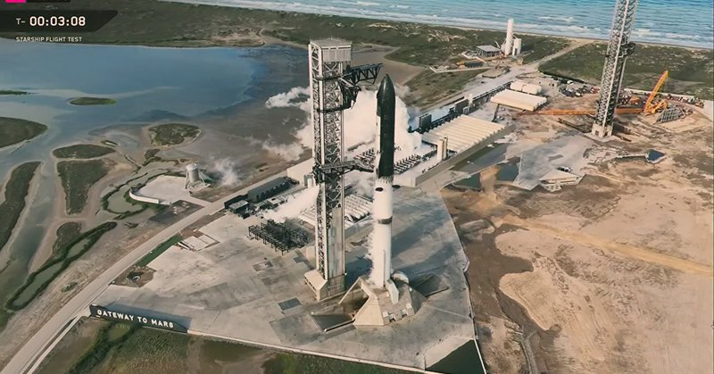

# خواننده تلگرام

<!-- TOP_NAV START -->

<a href="https://github.com/drsploit/aio-DL/blob/main/telegram/content/archive_1.md" style="display:inline-block; padding:6px 12px; margin:0 4px; background-color:#2ea44f; color:white; text-decoration:none; border-radius:4px; font-weight:bold;">صفحه بعد</a>

<!-- TOP_NAV END -->

<!-- MSG START -->

---
📅 بروزرسانی: 1405/03/01 03:53
---

## VahidOOnLine — post 241445

  

وبسایت خبری «ددلاین» گزارش داد شرکت فیلمسازی «یونیورسال پیکچرز» با همراهی مایکل بی، کارگردان آمریکایی، در حال تهیه یک فیلم سینمایی درباره نجات دو خلبان آمریکایی است که پس از سرنگونی جنگنده «اف۱۵-ای» در عملیات «خشم حماسی» در داخل خاک ایران گرفتار شده بودند.
بر اساس این گزارش، این فیلم بر پایه کتابی در دست انتشار از «میچل زوکاف» ساخته می‌شود که انتشارات «هارپرکالینز» قرار است آن را در سال ۲۰۲۷ منتشر کند.
این پروژه در حال حاضر در مرحله توسعه قرار دارد و جزئیات بیشتری از زمان تولید یا گروه بازیگران آن اعلام نشده است.

‌🏁 🇬🇧 IranintlTV

🤖 @VahidOOnLine

## VahidOOnLine — post 241444

  

وبسایت خبری «ددلاین» گزارش داد شرکت فیلمسازی «یونیورسال پیکچرز» با همراهی مایکل بی، کارگردان آمریکایی، در حال تهیه یک فیلم سینمایی درباره نجات دو خلبان آمریکایی است که پس از سرنگونی جنگنده «اف۱۵-ای» در عملیات «خشم حماسی» در داخل خاک ایران گرفتار شده بودند.
بر اساس این گزارش، این فیلم بر پایه کتابی در دست انتشار از «میچل زوکاف» ساخته می‌شود که انتشارات «هارپرکالینز» قرار است آن را در سال ۲۰۲۷ منتشر کند.
این پروژه در حال حاضر در مرحله توسعه قرار دارد و جزئیات بیشتری از زمان تولید یا گروه بازیگران آن اعلام نشده است.

‌🏁 🇬🇧 IranintlTV

🤖 @VahidOOnLine

## VahidOOnLine — post 241436

این نام‌ها فقط بخشی از یک فهرست نیستند؛
هرکدام دنیایی بودند پر از صدا، خنده، کار، عشق و امید. یکی تازه ازدواج کرده بود، یکی برای آینده‌اش برنامه مهاجرت داشت، یکی مغازه کوچکش را می‌چرخاند و یکی برای نجات جان دیگری دوید. اما خیابان‌های آن روزها، میان رویا و مرگ فاصله‌ای نگذاشتند.
جاویدنامان انقلاب ملی ایرانیان:
سپهر شکری، احمد شاهعلی، امیرمحمد (آرش) یزدانی همت‌آبادی، عرشیا حضوری، علی بهروز، علیرضا جواهری‌پی، مجید استیر و محمد بهروزی
روایت این جوانان کوتاه است، اما زخمی که بر حافظه ایران گذاشتند، کوتاه نخواهد شد.
#جاویدنامان_انقلاب_ملی_ایرانیان
‌🏁 🇬🇧 IranintlTV

🤖 @VahidOOnLine

## VahidOOnLine — post 241429

## VahidOOnLine — post 241420

این نام‌ها فقط بخشی از یک فهرست نیستند؛
هرکدام دنیایی بودند پر از صدا، خنده، کار، عشق و امید. یکی تازه ازدواج کرده بود، یکی برای آینده‌اش برنامه مهاجرت داشت، یکی مغازه کوچکش را می‌چرخاند و یکی برای نجات جان دیگری دوید. اما خیابان‌های آن روزها، میان رویا و مرگ فاصله‌ای نگذاشتند.
جاویدنامان انقلاب ملی ایرانیان:
سپهر شکری، احمد شاهعلی، امیرمحمد (آرش) یزدانی همت‌آبادی، عرشیا حضوری، علی بهروز، علیرضا جواهری‌پی، مجید استیر و محمد بهروزی
روایت این جوانان کوتاه است، اما زخمی که بر حافظه ایران گذاشتند، کوتاه نخواهد شد.
#جاویدنامان_انقلاب_ملی_ایرانیان
‌🏁 🇬🇧 IranintlTV

🤖 @VahidOOnLine

## WithYashar — post 11909

## WithYashar — post 11908

اتاق جنگ با یاشار : آمریکا حتماً داره آخرین اولتیماتوم رو میده….
@withyashar

## WithYashar — post 11907

اتاق جنگ با شما : سیریک جنگنده اومد ارتفاع پاین تو شهر مانور داد الان
@withyashar

## WithYashar — post 11906

درود ياشار جان
سيريك الان نزديك صبحه و يهو صدا جنگنده اومد،رسما ا بالا سرمون رد شد،و چند ديقه بعد پنجره ها لرزيد

## WithYashar — post 11905

  <a href="telegram/content/WithYashar_11905_1779409420.mp4" target="_blank">🎬 Download video</a>

اتاق جنگ با یاشار : یه خبرایی هست …
@withyashar

## WithYashar — post 11903

Martik (t.me/withyashar) – Parandeh (IG @yashar)

## WithYashar — post 11902

  <a href="https://t.me/withyashar/11902" target="_blank">📎 Download file</a>

🌐 @withyashar

🌐 instagram.com/yashar

## FoxNewsTwitter — post 342082

  

Fox News (Twitter/X)

WATCH LIVE: SpaceX launches its massive, next-generation Starship V3 rocket from Starbase, Texas https://twitter.com/i/broadcasts/1qJVmQdOpXDGB

## FoxNewsTwitter — post 342081

  <a href="telegram/content/FoxNewsTwitter_342081_1779409424.mp4" target="_blank">🎬 Download video</a>

Fox News (Twitter/X)

FOX NEWS REPORT: The White House says it won't ease pressure on Iran's nuclear program, and President Trump is rejecting any Iranian effort to impose tolls in the Strait of Hormuz.

Travelers from countries impacted by the Ebola outbreak will now be routed through Dulles Airport in Virginia for enhanced health screenings.

@BillMelugin_ has the latest.

## VahidOnline — post 75603

  <a href="telegram/content/VahidOnline_75603_1779409427.mp4" target="_blank">🎬 Download video</a>

تصویرسازی از مجتبی خامنه‌ای

وزارت جنگ آمریکا روز پنجشنبه ۳۱ اردیبهشت، با انتشار ویدیویی بر ضرورت افزایش بودجه دفاعی کشور تاکید کرد.

در این ویدیو که ترکیبی از صحنه‌های واقعی، گفته‌های پیت هگست، وزیر جنگ آمریکا و تصاویر کارتونی است، تصویری از مجتبی خامنه‌ای، رهبر جدید جمهوری اسلامی نیز در کنار یک سامانه موشکی دیده می‌آشود در حالی که یک پایش قطع شده است.
@VahidOOnLine

📡 @VahidOnline

## IranIntlTV — post 338337

  

وبسایت خبری «ددلاین» گزارش داد شرکت فیلمسازی «یونیورسال پیکچرز» با همراهی مایکل بی، کارگردان آمریکایی، در حال تهیه یک فیلم سینمایی درباره نجات دو خلبان آمریکایی است که پس از سرنگونی جنگنده «اف۱۵-ای» در عملیات «خشم حماسی» در داخل خاک ایران گرفتار شده بودند.
بر اساس این گزارش، این فیلم بر پایه کتابی در دست انتشار از «میچل زوکاف» ساخته می‌شود که انتشارات «هارپرکالینز» قرار است آن را در سال ۲۰۲۷ منتشر کند.
این پروژه در حال حاضر در مرحله توسعه قرار دارد و جزئیات بیشتری از زمان تولید یا گروه بازیگران آن اعلام نشده است.

https://iranintl.com/202605221100

## IranIntlTV — post 338336

  

وبسایت خبری «ددلاین» گزارش داد شرکت فیلمسازی «یونیورسال پیکچرز» با همراهی مایکل بی، کارگردان آمریکایی، در حال تهیه یک فیلم سینمایی درباره نجات دو خلبان آمریکایی است که پس از سرنگونی جنگنده «اف۱۵-ای» در عملیات «خشم حماسی» در داخل خاک ایران گرفتار شده بودند.
بر اساس این گزارش، این فیلم بر پایه کتابی در دست انتشار از «میچل زوکاف» ساخته می‌شود که انتشارات «هارپرکالینز» قرار است آن را در سال ۲۰۲۷ منتشر کند.
این پروژه در حال حاضر در مرحله توسعه قرار دارد و جزئیات بیشتری از زمان تولید یا گروه بازیگران آن اعلام نشده است.

https://iranintl.com/202605221100

## IranIntlTV — post 338328

این نام‌ها فقط بخشی از یک فهرست نیستند؛
هرکدام دنیایی بودند پر از صدا، خنده، کار، عشق و امید. یکی تازه ازدواج کرده بود، یکی برای آینده‌اش برنامه مهاجرت داشت، یکی مغازه کوچکش را می‌چرخاند و یکی برای نجات جان دیگری دوید. اما خیابان‌های آن روزها، میان رویا و مرگ فاصله‌ای نگذاشتند.
جاویدنامان انقلاب ملی ایرانیان:
سپهر شکری، احمد شاهعلی، امیرمحمد (آرش) یزدانی همت‌آبادی، عرشیا حضوری، علی بهروز، علیرضا جواهری‌پی، مجید استیر و محمد بهروزی
روایت این جوانان کوتاه است، اما زخمی که بر حافظه ایران گذاشتند، کوتاه نخواهد شد.
#جاویدنامان_انقلاب_ملی_ایرانیان

## IranIntlTV — post 338321

## IranIntlTV — post 338312

این نام‌ها فقط بخشی از یک فهرست نیستند؛
هرکدام دنیایی بودند پر از صدا، خنده، کار، عشق و امید. یکی تازه ازدواج کرده بود، یکی برای آینده‌اش برنامه مهاجرت داشت، یکی مغازه کوچکش را می‌چرخاند و یکی برای نجات جان دیگری دوید. اما خیابان‌های آن روزها، میان رویا و مرگ فاصله‌ای نگذاشتند.
جاویدنامان انقلاب ملی ایرانیان:
سپهر شکری، احمد شاهعلی، امیرمحمد (آرش) یزدانی همت‌آبادی، عرشیا حضوری، علی بهروز، علیرضا جواهری‌پی، مجید استیر و محمد بهروزی
روایت این جوانان کوتاه است، اما زخمی که بر حافظه ایران گذاشتند، کوتاه نخواهد شد.
#جاویدنامان_انقلاب_ملی_ایرانیان

## FarsiVOA — post 218339

🔺جمهوری‌خواهان رأی‌گیری بر سر اختیارات جنگی ترامپ علیه جمهوری اسلامی را لغو کردند

▪️رهبران جمهوری‌خواه مجلس نمایندگان آمریکا، روز پنجشنبه ۳۱ اردیبهشت، رأی‌گیری برنامه‌ریزی‌شده در مورد قطعنامه‌ای را که قرار بود اختیارات دونالد ترامپ، رئیس‌جمهوری آمریکا برای اقدام نظامی علیه جمهوری اسلامی را بدون تأیید کنگره محدود کند، لغو کردند.

⬇️ بیشتر بخوانید:
https://ir.voanews.com/a/8152513.html
@FarsiVOA

## FarsiVOA — post 218338

⚡️دونالد ترامپ: جمهوری اسلامی اورانیوم غنی شده را در چارچوب هر توافقی در اختیار نخواهد داشت
@FarsiVOA

## FarsiVOA — post 218337

⚡️طعنه‌ وزارت جنگ آمریکا به مجتبی خامنه‌ای
وزارت جنگ آمریکا ویدیویی از توضیحات پیت هگست، وزیر جنگ منتشر کرد که در آن او به اقدامات وزارت جنگ برای مدرن‌سازی، استفاده از فناوری‌های پیشرفته هوش مصنوعی، و تکنولوژی‌های فضایی اشاره می‌کند. این ویدیو طعنه‌هایی تصویری نیز به جمهوری اسلامی و مجتبی خامنه‌ای دارد.
@FariVOA

## FarsiVOA — post 218336

⚡️آیا پاکستان می‌تواند میانجی موفقی باشد؟
@FarsiVOA

## IranianMinds — post 20510

  

🔴حساب احمد وحیدی، فرمانده سپاه تروریستی پاسداران بسته شد.

@IranianMinds

## BBCPersian — post 281736

  

‌🔸سه هفته مانده به آغاز جام جهانی فوتبال که به طور مشترک در آمریکا، کانادا و مکزیک برگزار می‌شود، تیم ملی فوتبال ایران به تمرینات خود در آنتالیا ترکیه ادامه می‌دهد.

در تازه‌ترین اخبار مربوط به این تیم، شهریار مغانلو، مهاجم شاغل در لیگ امارات، به اردوی تیم ایران اضافه خواهد شد و روزبه چشمی که گزارش شده از ناحیه همسترینگ مصدوم شده، برای آغاز درمان از اردوی تیم ملی جدا خواهد شد.

پیوستن شهریار مغانلو به جمع مهاجمان تیم ملی ایران در حالی است که خط خوردن نام سردار آزمون، فوق ستاره این تیم، همچنان یکی از حواشی اصلی تیم ایران است.

در تحولی دیگر،‌ همزمان با مراجعه اعضای تیم ایران برای درخواست ویزا از کنسولگری‌های آمریکا و کانادا در آنتالیا، یک عضو هیات رئیسه فدراسیون فوتبال ایران از سفر به آمریکا انصراف داده است.

به گزارش خبرگزاری ایرنا، محمدرحمان سالاری، عضو هیات رئیسه فدراسیون فوتبال، با ارسال نامه‌ای به مهدی تاج، رئیس فدراسیون فوتبال، از سفر به آمریکا و حضور در جام‌جهانی «انصراف داده است».

لینک خبر:
https://bbc.in/49eO8DO

📷DeFodi Images via Getty Images
@BBCPersian

<!-- MSG END -->

<!-- NAV START -->

<a href="https://github.com/drsploit/aio-DL/blob/main/telegram/content/archive_1.md" style="display:inline-block; padding:6px 12px; margin:0 4px; background-color:#2ea44f; color:white; text-decoration:none; border-radius:4px; font-weight:bold;">صفحه بعد</a>

<!-- NAV END -->
