# خواننده تلگرام

<!-- TOP_NAV START -->

<a href="https://github.com/drsploit/aio-DL/blob/main/telegram/content/archive_1.md" style="display:inline-block; padding:6px 12px; margin:0 4px; background-color:#2ea44f; color:white; text-decoration:none; border-radius:4px; font-weight:bold;">صفحه بعد</a>

<!-- TOP_NAV END -->

<!-- MSG START -->

---
📅 بروزرسانی: 1405/03/05 11:38
---

## VahidOOnLine — post 242239

  

روابط عمومی سپاه پاسداران در اطلاعیه‌ای اعلام کرد یگان‌های پدافندی سپاه پس از «پایش‌های اطلاعاتی دقیق»، یک پهپاد ام‌کیو-۹ آمریکا را در منطقه خلیج فارس شناسایی، رهگیری و ساقط کرده‌اند.

در این اطلاعیه آمده است یک پهپاد آرکیو-۴ و یک جنگنده اف-۳۵ نیز پس از شلیک پدافند سپاه، مجبور به فرار و خروج از حریم سرزمینی ایران شدند.

سپاه همچنین نسبت به هرگونه نقض آتش‌بس از سوی ارتش آمریکا هشدار داد و اعلام کرد حق پاسخ متقابل را برای خود «مشروع و قطعی» می‌داند.
‌🏁 🇬🇧 IranintlTV

🤖 @VahidOOnLine

## VahidOOnLine — post 242238

  

مسعود پزشکیان در نشست با فرماندهان و مدیران وزارت دفاع گفت که توان تهاجمی نیروهای مسلح باعث غافلگیری دشمن شده است.
او گفت که توان دفاعی کشور نتیجه آمادگی و فعالیت نیروهای مسلح است و افزود: «دولت رسیدگی به معیشت و مسکن این نیروها را در اولویت قرار داده است.

پزشکیان افزود: «صنعت دفاعی باید سریع‌تر به سمت فناوری‌های نوین حرکت کند.»
‌🏁 🇬🇧 IranintlTV

🤖 @VahidOOnLine

## VahidOOnLine — post 242237

  <a href="telegram/content/VahidOOnLine_242237_1779782937.mp4" target="_blank">🎬 Download video</a>

ویدیوهای منتشرشده، تصاویری از جاویدنام فاطمه عباسی و مزار گلباران‌شده او را نشان می‌دهند. عباسی، ۳۱ ساله و دانشجوی دانشگاه هنر اصفهان، ۱۹ دی‌ در بلوار کشاورز اصفهان هنگامی‌ که در حال کمک و پناه دادن به مجروحین بود با اصابت گلوله به گردنش مجروح و دچار قطع نخاع شد. او ۲۱ اسفند در بیمارستان جان باخت.
‌🏁 🇬🇧 IranintlTV

🤖 @VahidOOnLine

## VahidOOnLine — post 242236

🗣روایت شما از بحران اقتصادی و زندگی در آتش‌بس- سه‌شنبه ۵ خرداد:

🔹مملکت ببی در و پیکر شده؛ پلیس به خاطر ندادن پول، مرا به کلانتری ۱۱۶ مولوی (پارک هرندی) برد، کتک زد و به خانواده‌ام فحش داد. قصدش گرفتن ۵ میلیون رشوه بود، اما نهایتاً ۲ میلیون گرفتند و آزاد کردند.

🔹حداقل بیمه تامین اجتماعی اجباری ۷ میلیون و ۴۰ هزار تومان و اختیاری ۵ میلیون و ۵۰۰ هزار تومان شده. در عادی‌ترین بیماری مثل آنفولانزا، قیمت ویزیت ۳۰۰ هزار تومان، دارو ۷۰۰ هزار تومان تا یک میلیون تومان و قیمت تزریقات از ۴۰۰ هزار تومان به بالاست.

🔹گرانی بیداد می‌کنه و دزدی‌ها شدت گرفته. در روستای کوچک ما، یک نیسان قرمز یک بشکه گازوئیل از ما دزدید.

🔹در هفته جاری خیلی از سیم‌کارت‌های شهروندان را با عنوان «مدیریت خاص» دو طرفه مسدود کردند. معلوم نیست از طرف کدام ارگان قطع شده‌ایم.

🔹یک ورق داروی استانبنوفن ساده شده ۲۷ هزار تومان. قبلا ۲ هزار تومان هم نبود.

🔹مرغ شده کیلویی ۴۶۵ هزار تومان، سینه مرغ کیلویی حدود ۸۰۰ هزار تومان. خیلی‌ها دیگر توانایی خرید ندارند.

🔹ما آنلاین‌شاپ‌ها که بیشتر از امارات خرید می‌کردیم، بیش از ۳ ماه است که بیکاریم. وضعیت اینترنت هم ما را به خاک سیاه نشانده است.

🔹شرکت کروز تهران از فروردین تا اردیبهشت ماه حقوق و پاداش کار کارگران را نداده است. نه تنها افزایش حقوق نداشتیم، بلکه از سال پیش حقوقمان کمتر هم شده است.
‌🏁 🇬🇧 IranintlTV

🤖 @VahidOOnLine

## VahidOOnLine — post 242235

  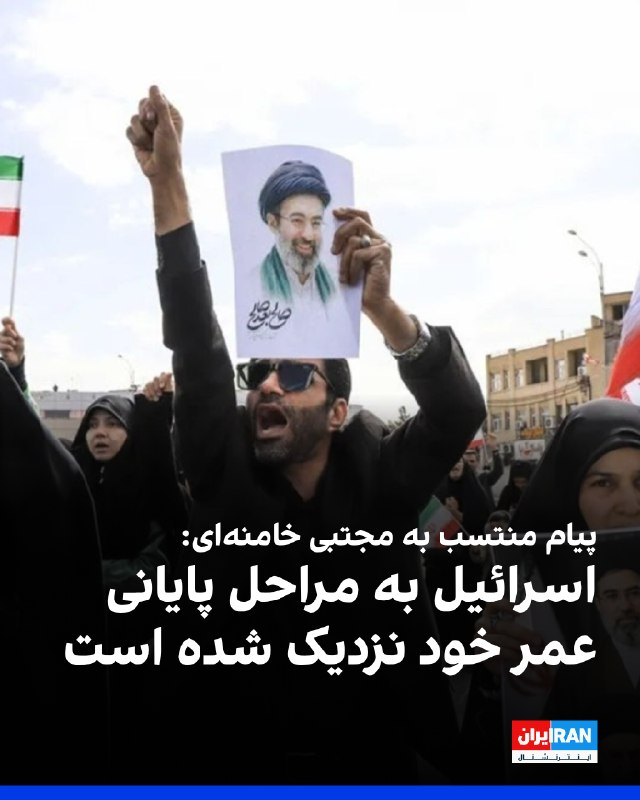

در پیامی منتسب به مجتبی خامنه‌ای که رسانه‌های ایران منتشر کردند، نوشته شده که اسرائیل «به مراحل پایانی عمر منحوس خود نزدیک شده است.»

در این پیام به وعده علی خامنه‌ای در سال ۱۳۹۴ اشاره و تاکید شده که اسرائیل «۲۵ سال بعد از آن تاریخ را نخواهد دید.»

علی خامنه ای، رهبر کشته‌شده جمهوری اسلامی، ۱۸ شهریور ۱۳۹۴ گفته بود که اسرائیل، «۲۵ سال آینده را نخواهد دید.»

در بخشی از این پیام آمده است: «امسال مسئله برائت از مشرکان اهمیتی مضاعف دارد و عمق و گستره‌ی برائت از آمریکا و اسرائیل، فراتر از آیین برائت در موسم و میقات حج است و در نقاط مختلف ایران و جهان پس از این ایام مبارک، مرگ بر آمریکا و مرگ بر اسرائیل، شعار رایج امت اسلامی و مظلومان عالم خصوصا جوانان خواهد بود.»
‌🏁 🇬🇧 IranintlTV

🤖 @VahidOOnLine

## VahidOOnLine — post 242234

  <a href="telegram/content/VahidOOnLine_242234_1779782939.mp4" target="_blank">🎬 Download video</a>

⭕️عبور شهاب‌سنگ از آسمان فیلیپین بر فراز آتشفشان «مایون» ثبت شد

♦️مؤسسه آتشفشان‌شناسی و لرزه‌نگاری فیلیپین اعلام کرد یک شهاب‌سنگ شامگاه پنجم خرداد، بر فراز آتشفشان «مایون» در آسمان این کشور مشاهده و ثبت شده است.

تصاویر منتشرشده، عبور جسم نورانی را در آسمان شب و بر فراز یکی از فعال‌ترین آتشفشان‌های فیلیپین نشان می‌دهد.
آتشفشان مایون به‌دلیل شکل مخروطی منظم خود، یکی از شناخته‌شده‌ترین آتشفشان‌های جهان به شمار می‌رود.
‌🇸🇦 Indypersian

🤖 @VahidOOnLine

## VahidOOnLine — post 242233

  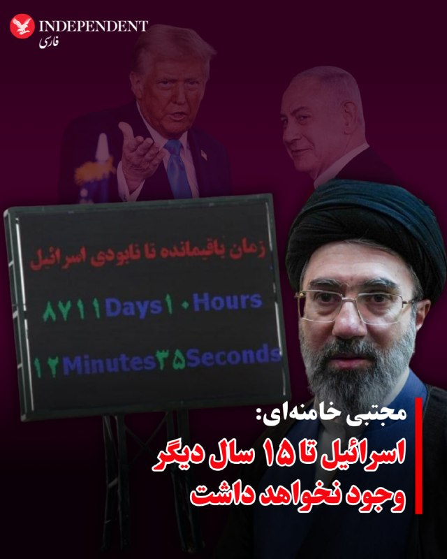

♦️مجتبی خامنه‌ای، سومین رهبر جمهوری اسلامی روز سه‌شنبه پنجم خرداد با انتشار پیامی به مناسبت حج نوشت که اسرائیل تا ۱۵ سال دیگر وجود نخواهد داشت.

از زمان انتصاب مجتبی خامنه‌ای به رهبری جمهوری اسلامی، هیچ صدا یا تصویری از او منتشر نشده است.
در پیام منتسب به مجتبی خامنه‌ای با اشاره به گفته‌های ۱۰ سال پیش علی خامنه‌ای، رهبر کشته شده جمهوری اسلامی، اسرائیل «رژیم متزلزل صهیونی و غده سرطانی» توصیف شده و آمده است: «اسرائیل به مراحل پایانی عمر منحوس خود نزدیک شده و به فضل الهی و مطابق با سخن قاطع و آینده‌نگرِ ده سال قبل رهبر عظیم‌الشأن شهید قدس‌الله‌نفسه‌الزکیه، ۲۵ سال بعد از آن تاریخ را نخواهد دید، ان‌شاءالله.»

این سخنان در حالی عنوان می‌شود که اسرائیل و آمریکا در یک سال گذشته در جریان دو جنگ، مقام‌های عالی‌رتبه  سیاسی و نظامی حکومت ازجمله علی خامنه‌ای، رهبر پیشین جمهوری اسلامی، را کشتند، بخش بزرگی از برنامه هسته‌ای جمهوری اسلامی را نابود و تاسیسات و زیرساخت‌های نظامی و اقتصادی ایران را به‌شدت تضعیف کرده‌اند.
‌🇸🇦 Indypersian

🤖 @VahidOOnLine

## VahidOOnLine — post 242232

  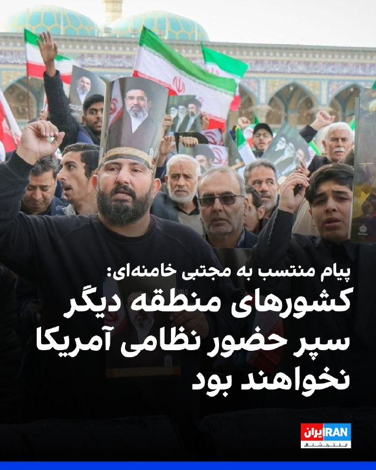

رسانه‌های ایران پیامی منتسب به مجتبی خامنه‌ای به مناسبت حج منتشر کردند که در بخشی از آن نوشته شده: «با اتکا به توان موشکی و پهپادی در زمین، هوا و دریا، آمریکا و اسرائیل هدف قرار گرفتند و کشورهای منطقه دیگر سپر حضور نظامی آمریکا نخواهند بود.»

در این پیام آمده است: «کشورهای منطقه ظرفیت‌ها و منافع مشترکی دارند که می‌تواند زمینه‌ساز شکل‌گیری نظم تازه‌ای در منطقه و جهان باشد.»

در ادامه این پیام آمده است شعار «مرگ بر آمریکا» و «مرگ بر اسرائیل» همچنان شعار امت اسلامی و به ویژه جوانان خواهد بود.

همچنین در این پیام نوشته شده: «شرایط منطقه به گذشته بازنمی‌گردد و واشینگتن جای امنی برای استقرار پایگاه نظامی در منطقه نخواهد داشت.»

این پیام در حالی منتشر شده که از زمان آغاز جنگ در اسفند سال گذشته، هیچ تصویر یا فایل صوتی از او منتشر نشده است.
‌🏁 🇬🇧 IranintlTV

🤖 @VahidOOnLine

## VahidOOnLine — post 242231

  

امیرحسین ثابتی، نماینده تهران در مجلس، با انتقاد از سخنان مسعود پزشکیان که گفته بود «اگر مذاکره نکنیم، چه کنیم»، گفت: مگر دفعات قبل وسط میز مذاکره جنگ نشد؟ پس بازهم دوست دارید مذاکره کنید تا جنگ شود و رهبر جدیدمان هم ترور شود؟ »

او افزود: «اگر امروز اکثر ملت ایران با مذاکره با آمریکا مخالفند، علتش این است که عقل دارند و از تاریخ عبرت گرفته‌اند.»

ثابتی ادامه داد: «از این مسیر تکراری اتفاقی به نفع ایران در نمی‌آید و راه اداره کشور نیز مبارزه با فساد و ریخت و پاش‌هاست نه رها کردن ۱۹۹ کشور دیگر و دخیل بستن به آمریکا.»
‌🏁 🇬🇧 IranintlTV

🤖 @VahidOOnLine

## VahidOOnLine — post 242230

  

♦️همزمان با ادامه قطعی اینترنت در ایران، داده‌های منتشر شده در پایگاه‌های بررسی وضعیت اینترنت نشان می‌دهد که بیشتر کاربرانی که به اینترنت معروف به «پرو» دسترسی دارند، از آیفون استفاده می‌کنند.

به گزارش خبرآنلاین، آمارهای تازه پایگاه بین‌المللی «Statcounter» از بازار سیستم‌عامل‌های موبایل در ایران، وجود شکاف طبقاتی دیجیتال و حذف تدریجی کاربران کم‌درآمد از فضای آنلاین را تقویت کرده است؛ آماری که نشانگر جهش ناگهانی ترافیک آیفون و همزمان سقوط قابل‌ توجه اندروید است.

بر اساس داده‌های این سایت، در فاصله بهمن ۱۴۰۴ تا فروردین ۱۴۰۵ ، سهم ترافیک گوشی‌های آیفون (iOS) در ایران به‌صورت بی‌سابقه‌ای از حدود ۱۳ درصد به نزدیک ۳۰ درصد افزایش یافته است. همزمان، سهم اندروید ۲۵ درصد کاهش یافته است.

براساس این تحلیل داده‌ها، کاهش سهم اندروید در سه ماه گذشته می‌تواند نشانه خروج میلیون‌ها کاربر طبقه متوسط و کم‌درآمد از اینترنت باشد؛ کاربرانی که به‌دلیل هزینه‌های فزاینده دسترسی آزاد به اینترنت، دیگر توان حضور در فضای آنلاین را ندارند.
‌🇸🇦 Indypersian

🤖 @VahidOOnLine

## VahidOOnLine — post 242229

  

اسماعیل سقاب اصفهانی، معاون مسعود پزشکیان گفت: «این تفکری که حسن نیت با آمریکا حسن نیت می‌آورد را باید کنار بگذاریم، آمریکا فقط زبان زور و قدرت را می‌فهمد.»
او با اشاره به حملات به کشورهای منطقه در طول جنگ ۴۰ روزه، گفت: «آمریکا ترسید، چنان پاسخ کوبنده‌ای دادیم که عقب نشست.»
‌🏁 🇬🇧 IranintlTV

🤖 @VahidOOnLine

## VahidOOnLine — post 242228

  

مصطفی پور رمضان، ۴۴ ساله، شامگاه جمعه ۱۹ دی در شهرک جهان‌نما کرج با شلیک گلوله کشته شد. او که  پدر سه فرزند بود، بر اثر اصابت تیر جنگی از پشت به ناحیه سر و گردن جان باخت.

بر اساس اطلاعات رسیده به ایران‌اینترنشنال، او حدود ساعت ۷:۳۰ شب و پس از شنیدن صدای اعتراضات از خانه خارج شد و به خانواده گفت که بازمی‌گردد، اما به دست ماموران کشته شد.

به گفته شاهدان، مصطفی پور رمضان با تیر جنگی از پشت سر هدف قرار گرفت و بر زمین افتاد. شدت تیراندازی اجازه کمک‌رسانی به او را نداد و به مدت یک‌ساعت و نیم در محل حادثه رها شد. مصطفی در نهایت به درمانگاه منتقل شد اما به دلیل خون‌ریزی شدید جان خود را از دست داد.

 بنا به گزارش‌ها، پیکر او ابتدا در سردخانه بیمارستان امام علی نگهداری شد و خانواده پس از دو تا سه روز پیگیری توانستند آن را تحویل بگیرند. محل دفن مصطفی پوررمضان در گلزار شهدای کلاک بالای کرج تعیین و در همان محل به خاک سپرده شد.

حاضران در محل خبر دادند فضای آرامستان امنیتی بود و ماموران مسلح و لباس شخصی در محل حضور داشتند. این ماموران با ایجاد فضای رعب تلاش می‌کردند مانع سر دادن شعارهای اعتراضی از سوی خانواده‌ها شوند.
h
‌🏁 🇬🇧 IranintlTV

🤖 @VahidOOnLine

## VahidOOnLine — post 242227

  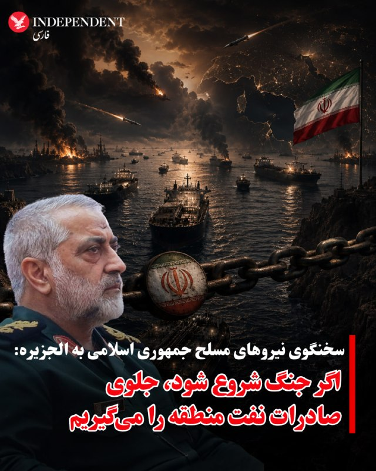

♦️ابوالفضل شکارچی، سخنگوی ارشد نیروهای مسلح جمهوری اسلامی روز سه‌شنبه پنجم خرداد و در گفتگو با الجزیره تهدید کرد که در صورت شروع دوباره جنگ و جلوگیری از صادرات نفت ایران، نیروهای مسلح جلوی صادرات نفت منطقه را می‌گیرند.

در حالیکه با وجود تائید خبر حمله نیروهای سنتکام به اهداف نظامی جمهوری اسلامی در منطقه خلیج فارس، هنوز از واکنش مقام‌های سیاسی یا نیروهای مسلح خبری نیست، شکارچی بار دیگر هشدار داد که در صورت «تجاوز جدید و از سرگرفته شدن جنگ، پاسخ ایران فرامنطقه‌ای خواهد بود.»

این مقام ارشد سپاه پاسداران گفت: «جمهوری اسلامی ایران برای جنگ آماده است و در صورت حمله جدید آمریکا و رژیم صهیونی [اسرائیل]، بانک اهدافش را شناسایی کرده است. پاسخ به هرگونه تجاوز جدید با آنچه قبلا بوده متفاوت خواهد بود، دشمنان قطعا با غافلگیری‌ها و تاکتیک‌های جدید روبرو خواهند شد و حملات ایران، در صورت ورود منطقه به دور دیگری از جنگ فراتر از مرزهای منطقه خواهد رفت و بسیار شدیدتر، سنگین‌تر، خشونت‌آمیزتر و قوی‌تر از دو جنگ قبلی خواهد بود.»
‌🇸🇦 Indypersian

🤖 @VahidOOnLine

## VahidOOnLine — post 242226

  

احمد بخشایش اردستانی، عضو کمیسیون امنیت ملی مجلس با اشاره به عملیات نجات خلبان‌های آمریکایی در ایران در جریان جنگ ۴۰ روزه، به خبرگزاری ایلنا گفت: «دو خلبان آمده بودند که گفته شده جمهوری اسلامی آن‌ها را دستگیر کرده است.»

او در پاسخ به این‌که آیا جمهوری اسلامی خلبانان آمریکایی را دستگیر کرده، گفت: «بله، مثل این که دستگیر شده‌اند.»

اردستانی با اشاره سخنان ترامپ درباره نجات خلبانان، گفت که او می‌خواست شکست خودش را پنهان کند.
‌🏁 🇬🇧 IranintlTV

🤖 @VahidOOnLine

## VahidOOnLine — post 242225

  

ابوالفضل شکارچی، سخنگوی ارشد نیروهای مسلح جمهوری اسلامی در گفت‌وگو با شبکه الجزیره گفت: «در صورت هرگونه حمله، واکنش تهران شدیدتر از گذشته خواهد بود و دامنه درگیری می‌تواند از منطقه فراتر برود.»

او افزود: «جمهوری اسلامی برای جنگ آماده است و در صورت حمله دوباره آمریکا یا اسرائیل، اهداف مورد نظر را از پیش شناسایی کرده است.»

شکارچی ادامه داد: «حملات احتمالی تهران با حملات قبلی تفاوت خواهد داشت و شامل غافلگیری و تاکتیک‌های جدید می‌شود و اگر در جریان جنگ مانع صادرات نفت شوند، جمهوری اسلامی از خروج نفت از منطقه جلوگیری خواهد کرد.»
‌🏁 🇬🇧 IranintlTV

🤖 @VahidOOnLine

## VahidOOnLine — post 242224

  

♦️دونالد ترامپ، رئیس جمهوری آمریکا بامداد سه‌شنبه پنجم خرداد و ساعاتی پس از انتشار خبر حمله سنتکام به قایق‌های تندروی  سپاه و پایگاه‌های نظامی در نزدیکی تنگه هرمز، با انتشار کاریکاتوری در تروث سوشال، از پرداخت میلیون‌ها دلار پول در جریان برجام، انتقاد کرد.

ترامپ در این پیام تصویری یک پالت دلار و دیگری از مقابله ناوشکن آمریکایی با پرتابه‌های جمهوری اسلامی را منتشر و بر تفاوت سیاست خودش و اوباما تاکید کرد.
‌🇸🇦 Indypersian

🤖 @VahidOOnLine

## VahidOOnLine — post 242223

  

ابراهیم عزیزی، رییس کمیسیون امنیت ملی مجلس، با اشاره به مذاکرات با آمریکا، گفت: «تا زمانی که منافع کامل جمهوری اسلامی تامین نشود، هیچ اقدامی انجام نخواهد شد و مجلس مسائل را با حساسیت دنبال می‌کند.»

او افزود: «مردم نگران نباشند، مسئولان با دقت در حال رصد و بررسی همه موضوعات هستند.»

این نماینده مجلس ادامه داد: «روند فعلی ادامه دارد و اگر اقدامات اعتمادساز آمریکا نتایج ملموس داشته باشد، ممکن است زمینه برای گام‌های بعدی فراهم شود.»
‌🏁 🇬🇧 IranintlTV

🤖 @VahidOOnLine

## VahidOOnLine — post 242222

  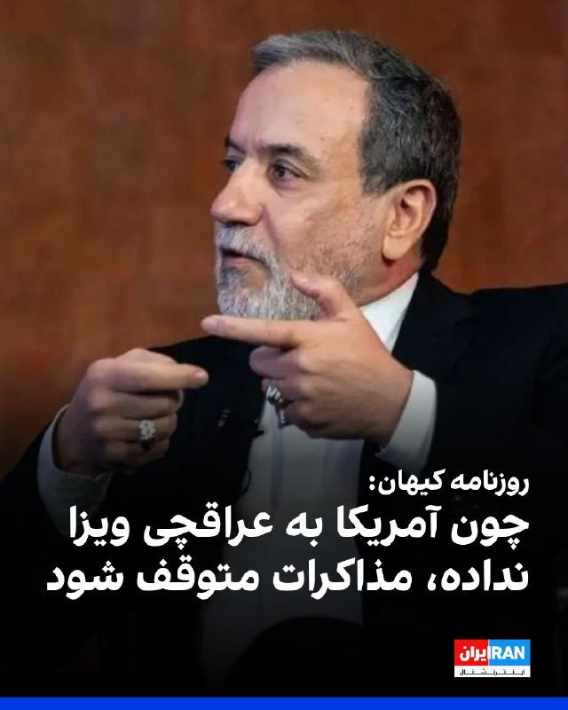

روزنامه کیهان در مطلبی با اشاره به‌عدم صدور ویزا برای عباس عراقچی جهت سفر به نیویورک، نوشت: «برای پایان‌دادن به نمایش مضحک ترامپ، تنبیه و تادیب آمریکا و در پاسخ به‌عدم صدور ویزا، باید توقف مذاکرات اعلام شود تا ضمن حفظ عزت و احترام، شاهد اقدام مشابه در آینده نباشیم.»

این روزنامه اضافه کرد: «تناقض رفتاری و گفتاری میان ترامپ و مقامات دولت او یک امر رایج است و این موضوع از عدم صدور ویزا برای عراقچی و ادعای اشتیاق برای توافق با جمهوری اسلامی قابل استناد است.»
‌🏁 🇬🇧 IranintlTV

🤖 @VahidOOnLine

## VahidOOnLine — post 242221

  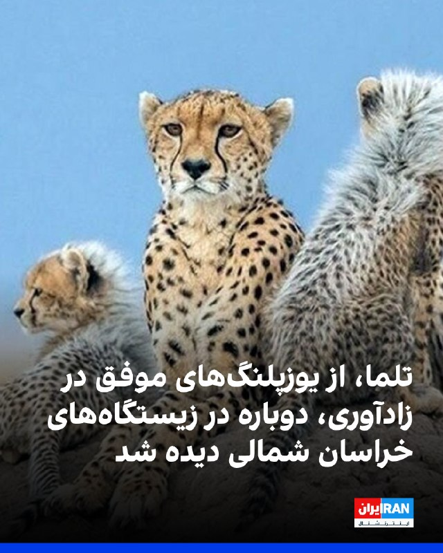

به گزارش رسانه‌های ایران، «تلما» که از یوزپلنگ‌های شناخته‌شده و موفق در زادآوری در زیستگاه‌های کشور به شمار می‌رود، دوباره در زیستگاه‌های طبیعی استان خراسان شمالی مشاهده شد. این یوزپلنگ هفت‌ساله در سال ۱۴۰۱ با ثبت چهار توله، نقش مهمی در پویایی جمعیت یوزپلنگ آسیایی ایفا کرده بود.
‌🏁 🇬🇧 IranintlTV

🤖 @VahidOOnLine

## VahidOOnLine — post 242220

  

♦️به گزارش گلف‌نیوز، عربستان سعودی به‌طور فزاینده‌ای از هوش مصنوعی و فناوری پهپاد در مراسم حج استفاده می‌کند.
براساس این گزارش، سازمان هواپیمایی کشوری عربستان سعودی نخستین مجوز عملیاتی این کشور را برای تحویل دارو و تجهیزات پزشکی با استفاده از پهپاد در نقاط مختلف مکه در موسم حج ۲۰۲۶ صادر کرد.
این سازمان اعلام کرد این اقدام بخشی از تلاش‌های گسترده‌تر برای گسترش استفاده از فناوری‌های پیشرفته و راهکارهای نوآورانه هوانوردی است؛ راهکارهایی که با هدف افزایش کارایی عملیاتی و تسریع خدمات پزشکی و لجستیکی در جریان حج به کار گرفته می‌شوند.
بر اساس این مجوز، پهپادها اجازه خواهند داشت در چارچوب ضوابط نظارتی و عملیاتی مشخص‌شده و مطابق با استانداردهای ایمنی، کیفیت و بهره‌وری، در محدوده اماکن مقدس فعالیت کنند.
مقام‌های سعودی گفتند این طرح بر پایه عملیات آزمایشی سال گذشته بنا شده است؛ زمانی که پهپادها برای انتقال تجهیزات پزشکی و خدمات لجستیکی در مناطق حج آزمایش شدند.
‌🇸🇦 Indypersian

🤖 @VahidOOnLine

## WithYashar — post 12519

  

نت‌بلاکس آپدیت جدیدی از وضعیت اینترنت بین‌الملل ایران منتشر کرد
اینترنت ایران اکنون از ۱٪ وصل به ۳٪ افزایش پیدا کرده … داره یه چیزایی میشه…
@withyashar

## WithYashar — post 12517

  <a href="telegram/content/WithYashar_12517_1779782950.mp4" target="_blank">🎬 Download video</a>

«تجمعات بابل» اخطار ! دیدن این ویدیو ممکن است باعث بی اختیاری‌ادرار شود ⚠️😂
@withyashar

## WithYashar — post 12516

فاکس نیوز گزارش می‌دهد بعید است حادثه دیشب تاثیر بالای بر روی روند مذاکرات داشته باشد و در صورت نزدیک بودن توافقی هر دو طرف بر سر یک برخورد معامله را بر هم نمی‌زنند
@withyashar

## WithYashar — post 12515

شبکه «سی‌ان‌ان»: برای نخستین باز از زمان آغاز جنگ ایران و آمریکا، یک نفت‌کش ژاپنی از تنگه هرمز عبور کرد.
@withyashar

## WithYashar — post 12514

کانال 12 اسراییل: مجتبی خامنه‌ای هنوز توافقات شکل‌گرفته را تایید نکرده
@withyashar

## WithYashar — post 12513

  

صفحه اینترنت پرو از سایت همراه اول حذف کردن
گویا این پروژه شکست خورده
@withyashar

## WithYashar — post 12512

  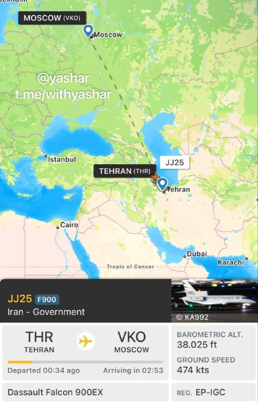

بامداد امروز، یک هواپیما دولت حامل مقامات عالی‌رتبه به مسکو رفت!
@withyashar

## WithYashar — post 12511

یک منبع آگاه اسرائیلی روز سه‌شنبه اعلام کرد که ارتش اسرائیل در روزهای آینده خود را برای گسترش عملیات‌ها و حملات هوایی در لبنان آماده می‌کند.
سی‌ان‌ان : این منبع تأکید کرد تحرکات نظامی اسرائیلی قریب‌الوقوع «با هماهنگی ایالات متحده» انجام می‌شود.
@withyashar

## WithYashar — post 12510

  

پست ترامپ در تروث سوشال:
سیاست اوباما: بسته های پول میده
سیاست ترامپ : موشک میزنه
@withyashar

## WithYashar — post 12509

رویترز : پاکستان بلافاصله پیشنهاد ترامپ مبنی بر اینکه توافق با ایران باید به عادی‌سازی روابط با اسرائیل گره بخورد را رد کرد و گفت که این دو موضوع «به هم مرتبط نیستند و نمی‌توان آن‌ها را به هم گره زد».
@withyashar

## mwarmonitor — post 9730

📝 واقعاً آدم دلش برای این پیرمرد مو نارنجی کباب می‌شود؛ طفلکی هر چه بیشتر تلاش می‌کند تا ادای یک غول بی‌شاخ‌ودمِ تحریم‌کننده را درآورد، بیشتر شبیه پدربزرگ مهربان و باگذشتی می‌شود که مأموریتش در زندگی فقط «نه نگفتن» به خواسته‌های تهران است. اصلاً این حجم از…

## mwarmonitor — post 9729

🔴رسانه‌های اسرائیلی: اسرائیل بسیج اضطراری نیروهای ذخیره را آغاز کرده است؛ از جمله یگان‌های توپخانه‌ای که به‌تازگی از خدمت ترخیص شده بودند. این اقدام در چارچوب افزایش آمادگی‌ها برای عملیات دفاعی گسترده در لبنان و در پی ادامه حملات حزب‌الله و نقض آتش‌بس انجام می‌شود.

@mwarmonitor

## pm_afshaa — post 91517

کانال 13 اسرائیل: جلسه کابینه داخلی امروز در پی تشدید تنش‌ها در لبنان و توافق احتمالی با ایران برگزار می‌شود

💧 Rainbet.com the #1 Non-KYC Crypto Casino & Sportsbook @rainbetcom

😁 @Pm_Afshaa

## pm_afshaa — post 91516

سیتنا: آزاد سازی اینترنت به تعویق افتاد

💧 Rainbet.com the #1 Non-KYC Crypto Casino & Sportsbook @rainbetcom

😁 @Pm_Afshaa

## pm_afshaa — post 91515

کانال 12 اسراییل: مجتبی خامنه‌ای هنوز توافقات شکل‌گرفته را تایید نکرده

💧 Rainbet.com the #1 Non-KYC Crypto Casino & Sportsbook @rainbetcom

😁 @Pm_Afshaa

## pm_afshaa — post 91514

از سپاه فقط یه پا مونده که اونم رو هواست هر کی میاد میکنه توش میره😂

## pm_afshaa — post 91513

شاهزاده رضا پهلوی : یکی از اعضای پارلمان حتی به من گفت فکر نمی‌کنه ایرانی‌ها آماده دموکراسی باشن

- ایرانی‌ها فقط آماده دموکراسی نیستن 40 هزار نفر جونشونو برای اون دادن و نمی‌ذارم این فداکاری بی‌نتیجه بمونه
- چه اروپا کنار ما باشه چه رسانه‌هاتون کارشون رو درست انجام بدن چه سیاستمداراتون شجاعت نشون بدن من برای مردم و کشورم می‌جنگم
- حتی اگه مجبور باشیم تنها باشیم تا وقتی ایران آزاد بشه می‌جنگیم

💧Rainbet.com the #1 Non-KYC Crypto Casino & Sportsbook @rainbetcom

😁 @Pm_Afshaa

## iaghapour — post 2631

اینترنت بین‌الملل وصل بشه یجوری از اینترنت استفاده میکنم اختلال بخوره دوباره قطع بشه.🫠

گوشی باید آپدیت بشه.
ویندوز باید آپدیت بشه.
لینوکس باید آپدیت بشه.
برنامه ها باید آپدیت بشه.
و...

حس میکنم شما هم با من هم نظر هستید 🫣😁

## DEJradio — post 4964

  

🛩️
🔥 بامداد سه‌شنبه ۵ خرداد ۱۴۰۵؛ پدافند تهران و قم فعال شدند. کانال تلگرامی نزدیک به سـ.ـپاه قدس نوشت، «شاید باند فرودگاه خمینی را هدف قرار بدهند.»

*تصویر آرشیوی

#جنگ #فرودگاه_خمینی
@DEJradio

## DEJradio — post 4963

  <a href="telegram/content/DEJradio_4963_1779782953.webm" target="_blank">🎬 Download video</a>

🚨📢 جنگنده‌‌های آمریکایی بامداد سه‌شنبه پنجم خرداد ۱۴۰۵ چند قایق تندرو سـ.ـپاه پاسداران را تنگه هرمز در جنوب جزیره لارک مورد هدف قرار دادند. در این حملات دستکم ۴ پاسدار کشته شدند.

برخی منابع غیررسمی گزارش دادند این قایق‌ها شب قبل هدف قرار گرفتند اما برای اینکه روند مذاکرات با آمریکا مختل نشود، سانسور شده بود.

*تصویر آرشیوی

#جنگ #تنگه_هرمز
@DEJradio

## DEJradio — post 4962

  

🛩️
🔥 به گزارش منابع خبری داخلی نیمه شب دوشنبه چهارم خرداد ۱۴۰۵ باند فرودگاه بندرعباس مورد اصابت موشک قرار گرفت.
چند هواپیما و پهپاد در آسمان جنوب ایران به پرواز درآمدند.

کانال‌های تلگرامی نزدیک به ســ.ـپاه پاسداران با تایید مانور جنگنده‌ها پیش‌بینی کردند احتمالا هواپیماها متعلق به آمریکا هستند.

#جنگ #فرودگاه_بندرعباس
@DEJradio

## VahidOnline — post 75721

با وجود حملات اخیر آمریکا به سامانه‌های موشکی و قایق‌های ایران در خلیج فارس که وضعیت آتش‌بس شکننده را متزلزل‌تر کرده است،‌ مارکو روبیو، وزیر خارجه آمریکا روز سه‌شنبه گفت که توافق با ایران «همچنان امکان‌پذیر است.»

او در هند به خبرنگاران گفت: «امروز مذاکراتی در قطر در جریان بود،‌ و باید دید آیا می‌توانیم شاهد پیشرفتی باشیم یا خیر. فکر می‌کنم بخش زیادی از زمان صرف دقت در کلمات و واژه‌های به کار گرفته در متن اسناد می‌شود، بنابراین چند روز طول خواهد کشید.»

آقای روبیو افزود: «رئیس‌جمهور تمایل خود را برای انجام این کار ابراز کرده است. او یا به یک توافق خوب دست خواهد یافت یا هیچ توافقی نخواهد کرد.»

آقای روبیو به خبرنگاران گفت که تنگه هرمز باید باز باشد.

او گفت که آنها به هر حال این مسیر را باز خواهند کرد و افزود: «آنچه در آنجا اتفاق میافتد،‌ غیرقانونی است و باعث بی‌ثباتی برای جهان و غیرقابل قبول است.»
@VahidHeadline

📡 @VahidOnline

## IranIntlTV — post 339047

  

روابط عمومی سپاه پاسداران در اطلاعیه‌ای اعلام کرد یگان‌های پدافندی سپاه پس از «پایش‌های اطلاعاتی دقیق»، یک پهپاد ام‌کیو-۹ آمریکا را در منطقه خلیج فارس شناسایی، رهگیری و ساقط کرده‌اند.

در این اطلاعیه آمده است یک پهپاد آرکیو-۴ و یک جنگنده اف-۳۵ نیز پس از شلیک پدافند سپاه، مجبور به فرار و خروج از حریم سرزمینی ایران شدند.

سپاه همچنین نسبت به هرگونه نقض آتش‌بس از سوی ارتش آمریکا هشدار داد و اعلام کرد حق پاسخ متقابل را برای خود «مشروع و قطعی» می‌داند.
https://iranintl.com/202605266773

## IranIntlTV — post 339046

  <a href="telegram/content/IranIntlTV_339046_1779782954.mp4" target="_blank">🎬 Download video</a>

دونالد ترامپ در شبکه اجتماعی تروث‌سوشال نوشت اورانیوم غنی‌شده ایران باید فورا به آمریکا منتقل و نابود شود. او همچنین افزود ممکن است این مواد با همکاری جمهوری اسلامی، در داخل ایران یا در مکانی مورد توافق از بین برود.

گفت‌وگو با احمد صمدی، خبرنگار ایران‌اینترنشنال
@iranintltv

## IranIntlTV — post 339045

  

مسعود پزشکیان در نشست با فرماندهان و مدیران وزارت دفاع گفت که توان تهاجمی نیروهای مسلح باعث غافلگیری دشمن شده است.
او گفت که توان دفاعی کشور نتیجه آمادگی و فعالیت نیروهای مسلح است و افزود: «دولت رسیدگی به معیشت و مسکن این نیروها را در اولویت قرار داده است.

پزشکیان افزود: «صنعت دفاعی باید سریع‌تر به سمت فناوری‌های نوین حرکت کند.»
https://iranintl.com/202605269810

## IranIntlTV — post 339044

  <a href="telegram/content/IranIntlTV_339044_1779782957.mp4" target="_blank">🎬 Download video</a>

ویدیوهای منتشرشده، تصاویری از جاویدنام فاطمه عباسی و مزار گلباران‌شده او را نشان می‌دهند. عباسی، ۳۱ ساله و دانشجوی دانشگاه هنر اصفهان، ۱۹ دی‌ در بلوار کشاورز اصفهان هنگامی‌ که در حال کمک و پناه دادن به مجروحین بود با اصابت گلوله به گردنش مجروح و دچار قطع نخاع شد. او ۲۱ اسفند در بیمارستان جان باخت.

## IranIntlTV — post 339043

🗣روایت شما از بحران اقتصادی و زندگی در آتش‌بس- سه‌شنبه ۵ خرداد:

🔹مملکت ببی در و پیکر شده؛ پلیس به خاطر ندادن پول، مرا به کلانتری ۱۱۶ مولوی (پارک هرندی) برد، کتک زد و به خانواده‌ام فحش داد. قصدش گرفتن ۵ میلیون رشوه بود، اما نهایتاً ۲ میلیون گرفتند و آزاد کردند.

🔹حداقل بیمه تامین اجتماعی اجباری ۷ میلیون و ۴۰ هزار تومان و اختیاری ۵ میلیون و ۵۰۰ هزار تومان شده. در عادی‌ترین بیماری مثل آنفولانزا، قیمت ویزیت ۳۰۰ هزار تومان، دارو ۷۰۰ هزار تومان تا یک میلیون تومان و قیمت تزریقات از ۴۰۰ هزار تومان به بالاست.

🔹گرانی بیداد می‌کنه و دزدی‌ها شدت گرفته. در روستای کوچک ما، یک نیسان قرمز یک بشکه گازوئیل از ما دزدید.

🔹در هفته جاری خیلی از سیم‌کارت‌های شهروندان را با عنوان «مدیریت خاص» دو طرفه مسدود کردند. معلوم نیست از طرف کدام ارگان قطع شده‌ایم.

🔹یک ورق داروی استانبنوفن ساده شده ۲۷ هزار تومان. قبلا ۲ هزار تومان هم نبود.

🔹مرغ شده کیلویی ۴۶۵ هزار تومان، سینه مرغ کیلویی حدود ۸۰۰ هزار تومان. خیلی‌ها دیگر توانایی خرید ندارند.

🔹ما آنلاین‌شاپ‌ها که بیشتر از امارات خرید می‌کردیم، بیش از ۳ ماه است که بیکاریم. وضعیت اینترنت هم ما را به خاک سیاه نشانده است.

🔹شرکت کروز تهران از فروردین تا اردیبهشت ماه حقوق و پاداش کار کارگران را نداده است. نه تنها افزایش حقوق نداشتیم، بلکه از سال پیش حقوقمان کمتر هم شده است.

## IranIntlTV — post 339042

  

در پیامی منتسب به مجتبی خامنه‌ای که رسانه‌های ایران منتشر کردند، نوشته شده که اسرائیل «به مراحل پایانی عمر منحوس خود نزدیک شده است.»

در این پیام به وعده علی خامنه‌ای در سال ۱۳۹۴ اشاره و تاکید شده که اسرائیل «۲۵ سال بعد از آن تاریخ را نخواهد دید.»

علی خامنه ای، رهبر کشته‌شده جمهوری اسلامی، ۱۸ شهریور ۱۳۹۴ گفته بود که اسرائیل، «۲۵ سال آینده را نخواهد دید.»

در بخشی از این پیام آمده است: «امسال مسئله برائت از مشرکان اهمیتی مضاعف دارد و عمق و گستره‌ی برائت از آمریکا و اسرائیل، فراتر از آیین برائت در موسم و میقات حج است و در نقاط مختلف ایران و جهان پس از این ایام مبارک، مرگ بر آمریکا و مرگ بر اسرائیل، شعار رایج امت اسلامی و مظلومان عالم خصوصا جوانان خواهد بود.»
https://iranintl.com/202605261409

## IranIntlTV — post 339041

  

رسانه‌های ایران پیامی منتسب به مجتبی خامنه‌ای به مناسبت حج منتشر کردند که در بخشی از آن نوشته شده: «با اتکا به توان موشکی و پهپادی در زمین، هوا و دریا، آمریکا و اسرائیل هدف قرار گرفتند و کشورهای منطقه دیگر سپر حضور نظامی آمریکا نخواهند بود.»

در این پیام آمده است: «کشورهای منطقه ظرفیت‌ها و منافع مشترکی دارند که می‌تواند زمینه‌ساز شکل‌گیری نظم تازه‌ای در منطقه و جهان باشد.»

در ادامه این پیام آمده است شعار «مرگ بر آمریکا» و «مرگ بر اسرائیل» همچنان شعار امت اسلامی و به ویژه جوانان خواهد بود.

همچنین در این پیام نوشته شده: «شرایط منطقه به گذشته بازنمی‌گردد و واشینگتن جای امنی برای استقرار پایگاه نظامی در منطقه نخواهد داشت.»

این پیام در حالی منتشر شده که از زمان آغاز جنگ در اسفند سال گذشته، هیچ تصویر یا فایل صوتی از او منتشر نشده است.
https://iranintl.com/202605269157

## IranIntlTV — post 339040

  

امیرحسین ثابتی، نماینده تهران در مجلس، با انتقاد از سخنان مسعود پزشکیان که گفته بود «اگر مذاکره نکنیم، چه کنیم»، گفت: «مگر دفعات قبل وسط میز مذاکره جنگ نشد؟ پس بازهم دوست دارید مذاکره کنید تا جنگ شود و رهبر جدیدمان هم ترور شود؟»

او افزود: «اگر امروز اکثر ملت ایران با مذاکره با آمریکا مخالفند، علتش این است که عقل دارند و از تاریخ عبرت گرفته‌اند.»

ثابتی ادامه داد: «از این مسیر تکراری اتفاقی به نفع ایران در نمی‌آید و راه اداره کشور نیز مبارزه با فساد و ریخت و پاش‌هاست نه رها کردن ۱۹۹ کشور دیگر و دخیل بستن به آمریکا.»
https://iranintl.com/202605269775

## IranIntlTV — post 339039

  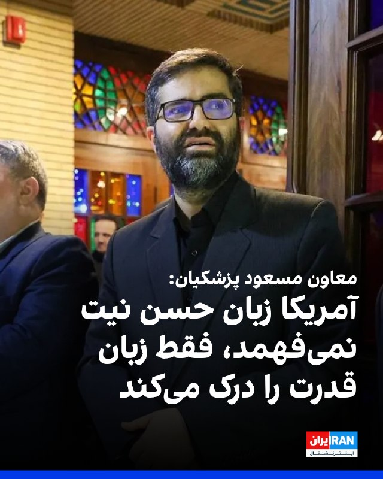

اسماعیل سقاب اصفهانی، معاون مسعود پزشکیان گفت: «این تفکری که حسن نیت با آمریکا حسن نیت می‌آورد را باید کنار بگذاریم، آمریکا فقط زبان زور و قدرت را می‌فهمد.»
او با اشاره به حملات به کشورهای منطقه در طول جنگ ۴۰ روزه، گفت: «آمریکا ترسید، چنان پاسخ کوبنده‌ای دادیم که عقب نشست.»
https://iranintl.com/202605265798

## IranIntlTV — post 339038

  

مصطفی پور رمضان، ۴۴ ساله، شامگاه جمعه ۱۹ دی در شهرک جهان‌نما کرج با شلیک گلوله کشته شد. او که  پدر سه فرزند بود، بر اثر اصابت تیر جنگی از پشت به ناحیه سر و گردن جان باخت.

بر اساس اطلاعات رسیده به ایران‌اینترنشنال، او حدود ساعت ۷:۳۰ شب و پس از شنیدن صدای اعتراضات از خانه خارج شد و به خانواده گفت که بازمی‌گردد، اما به دست ماموران کشته شد.

به گفته شاهدان، مصطفی پور رمضان با تیر جنگی از پشت سر هدف قرار گرفت و بر زمین افتاد. شدت تیراندازی اجازه کمک‌رسانی به او را نداد و به مدت یک‌ساعت و نیم در محل حادثه رها شد. مصطفی در نهایت به درمانگاه منتقل شد اما به دلیل خون‌ریزی شدید جان خود را از دست داد.

 بنا به گزارش‌ها، پیکر او ابتدا در سردخانه بیمارستان امام علی نگهداری شد و خانواده پس از دو تا سه روز پیگیری توانستند آن را تحویل بگیرند. محل دفن مصطفی پوررمضان در گلزار شهدای کلاک بالای کرج تعیین و در همان محل به خاک سپرده شد.

حاضران در محل خبر دادند فضای آرامستان امنیتی بود و ماموران مسلح و لباس شخصی در محل حضور داشتند. این ماموران با ایجاد فضای رعب تلاش می‌کردند مانع سر دادن شعارهای اعتراضی از سوی خانواده‌ها شوند.
h

## IranIntlTV — post 339037

  

احمد بخشایش اردستانی، عضو کمیسیون امنیت ملی مجلس با اشاره به عملیات نجات خلبان‌های آمریکایی در ایران در جریان جنگ ۴۰ روزه، به خبرگزاری ایلنا گفت: «دو خلبان آمده بودند که گفته شده جمهوری اسلامی آن‌ها را دستگیر کرده است.»

او در پاسخ به این‌که آیا جمهوری اسلامی خلبانان آمریکایی را دستگیر کرده، گفت: «بله، مثل این که دستگیر شده‌اند.»

اردستانی با اشاره سخنان ترامپ درباره نجات خلبانان، گفت که او می‌خواست شکست خودش را پنهان کند.
https://iranintl.com/202605260798

## IranIntlTV — post 339036

  <a href="telegram/content/IranIntlTV_339036_1779782961.mp4" target="_blank">🎬 Download video</a>

شهباز شریف، نخست‌وزیر پاکستان، با شی جین‌پینگ، رییس‌جمهوری چین، دیدار و درباره راه‌های پایان دادن به جنگ ایران گفت‌وگو کرد.

توماج طاهباز، خبرنگار ایران‌اینترنشنال، گزارش می‌دهد
@iranintltv

## IranIntlTV — post 339035

  

ابوالفضل شکارچی، سخنگوی ارشد نیروهای مسلح جمهوری اسلامی در گفت‌وگو با شبکه الجزیره گفت: «در صورت هرگونه حمله، واکنش تهران شدیدتر از گذشته خواهد بود و دامنه درگیری می‌تواند از منطقه فراتر برود.»

او افزود: «جمهوری اسلامی برای جنگ آماده است و در صورت حمله دوباره آمریکا یا اسرائیل، اهداف مورد نظر را از پیش شناسایی کرده است.»

شکارچی ادامه داد: «حملات احتمالی تهران با حملات قبلی تفاوت خواهد داشت و شامل غافلگیری و تاکتیک‌های جدید می‌شود و اگر در جریان جنگ مانع صادرات نفت شوند، جمهوری اسلامی از خروج نفت از منطقه جلوگیری خواهد کرد.»
https://iranintl.com/202605261837

## IranIntlTV — post 339034

  <a href="telegram/content/IranIntlTV_339034_1779782963.mp4" target="_blank">🎬 Download video</a>

در پی حملات گسترده ارتش روسیه به کی‌یف، پایتخت اوکراین، و مناطق اطراف آن، دست‌کم چهار نفر کشته و ده‌ها نفر زخمی شدند.

علی حسن‌پور، خبرنگار ایران‌اینترنشنال، گزارش می‌دهد
@iranintltv

## IranIntlTV — post 339033

  

ابراهیم عزیزی، رییس کمیسیون امنیت ملی مجلس، با اشاره به مذاکرات با آمریکا، گفت: «تا زمانی که منافع کامل جمهوری اسلامی تامین نشود، هیچ اقدامی انجام نخواهد شد و مجلس مسائل را با حساسیت دنبال می‌کند.»

او افزود: «مردم نگران نباشند، مسئولان با دقت در حال رصد و بررسی همه موضوعات هستند.»

این نماینده مجلس ادامه داد: «روند فعلی ادامه دارد و اگر اقدامات اعتمادساز آمریکا نتایج ملموس داشته باشد، ممکن است زمینه برای گام‌های بعدی فراهم شود.»
https://iranintl.com/202605264082

## IranIntlTV — post 339032

  <a href="https://t.me/IranintlTV/339032" target="_blank">📎 Download file</a>

🎧نسخه صوتی اخبار بامدادی | سه‌شنبه ۵ خرداد
@iranintlTV

## IranIntlTV — post 339028

  <a href="https://t.me/IranintlTV/339028" target="_blank">📎 Download file</a>

🎧نسخه صوتی سیاست با مرد ویسی: امان‌نامه موقت ترامپ به فرماندهان سپاه
@iranintlTV

## IranIntlTV — post 339027

  <a href="telegram/content/IranIntlTV_339027_1779782966.mp4" target="_blank">🎬 Download video</a>

جمعی از دانشجویان ایرانی ساکن میلان در تجمعی اعتراضی خواستار توجه و حمایت دولت ایتالیا از شهروندان و دانشجویان ایرانی شدند. شرکت‌کنندگان در این تجمع نسبت به نقض حقوق بشر و سرکوب معترضان در ایران ابراز نگرانی کردند.

گزارش صدف باغبانی، روزنامه‌نگار
@iranintltv

## IranIntlTV — post 339026

  

روزنامه کیهان در مطلبی با اشاره به‌عدم صدور ویزا برای عباس عراقچی جهت سفر به نیویورک، نوشت: «برای پایان‌دادن به نمایش مضحک ترامپ، تنبیه و تادیب آمریکا و در پاسخ به‌عدم صدور ویزا، باید توقف مذاکرات اعلام شود تا ضمن حفظ عزت و احترام، شاهد اقدام مشابه در آینده نباشیم.»

این روزنامه اضافه کرد: «تناقض رفتاری و گفتاری میان ترامپ و مقامات دولت او یک امر رایج است و این موضوع از عدم صدور ویزا برای عراقچی و ادعای اشتیاق برای توافق با جمهوری اسلامی قابل استناد است.»
https://iranintl.com/202605265646

## IranIntlTV — post 339025

  <a href="telegram/content/IranIntlTV_339025_1779782967.mp4" target="_blank">🎬 Download video</a>

سازمان حقوق بشر ایران اعلام کرد قوه قضاییه جمهوری اسلامی از ۲۷ اسفند تاکنون دست‌کم ۳۸ معترض و زندانی سیاسی را اعدام کرده است.

گفت‌وگو با نیلوفر رستمی، خبرنگار ایران‌اینترنشنال
@iranintltv

## FarsiVOA — post 218679

  

خبرگزاری فارس، وابسته به سپاه پاسداران، اذعان کرد که غلامرضا خانی شکراب که به اتهام «جاسوسی» در خطر اعدام قرار دارد، در خارج از کشور ربوده و به ایران منتقل شد.

فارس نوشت که این زندانی سیاسی که به «جاسوسی» متهم است، «در خارج از کشور حضور داشت و طی یک عملیات پیچیده و با استفاده از ترفند فریب اطلاعاتی، غافلگیر و به داخل کشور منتقل شد».

این خبرگزاری زمان و مکان دقیق ربایش این شهروند را اعلام نکرد اما افزود که همزمان چند نفر دیگر «در یک اقدام هماهنگ در چند استان ایران دستگیر شدند». برخی منابع پیشتر گزارش کرده‌اند که او ساکن ترکیه بوده و در سفری به عراق بازداشت و به ایران منتقل شده است.

پیشتر سازمان حقوق بشر ایران اعلام کرده بود که خانی‌شکرآب روز ۱۷ اردیبهشت ۱۴۰۵ از زندان اوین به سلول‌انفرادی زندان قزل‌حصار منتقل شد و این انتقال نگرانی‌های جدی درباره قریب‌الوقوع بودن اعدام او را افزایش داد.

بر اساس گزارش این سازمان، خانی شکرآب در دوم مهرماه ۱۴۰۴ بازداشت و در شعبه یک دادسرای امنیت (۳۳ مقدس) محاکمه و به اعدام محکوم شد.
@FarsiVOA

## FarsiVOA — post 218678

  

وزرای خارجه ایالات متحده و هند یک توافق همکاری برای تقویت همکاری در زمینه زنجیره‌های تأمین مواد معدنی حیاتی و عناصر نادر خاکی امضا کردند.

مارکو روبیو، وزیر خارجه آمریکا، سه‌شنبه در جریان امضای این توافق در دهلی‌نو گفت هر دو کشور در کاهش وابستگی به تأمین‌کنندگان تک‌منبعی و حفاظت از دسترسی به مواد کلیدی منافع مشترک دارند.

سوبرامانیام جایشانکار، وزیر خارجه هند، نیز گفت این توافق همکاری در تمام مراحل از استخراج تا فرآوری و بازیافت را گسترش می‌دهد و به ایجاد زنجیره‌های تأمین مقاوم‌تر و متنوع‌تر کمک می‌کند.

این مراسم امضا پس از نشست و بیانیه مشترک مجمع چهارجانبه امنیتی شامل آمریکا، هند، استرالیا و ژاپن انجام شد.

مارکو روبیو پس از نشست وزرای خارجه این مجمع در روز سه‌شنبه اعلام کرد که این کشورها توافق کردند ابتکاری درباره امنیت انرژی در منطقه هند-آرام و همچنین یک چارچوب تأمین مواد معدنی حیاتی را آغاز کنند.
@FarsiVOA

## FarsiVOA — post 218677

  

با گذشت نزدیک به سه ماه از کشته شدن علی خامنه‌ای، رهبر وقت جمهوری اسلامی، در عملیات مشترک آمریکا و اسرائیل، مقامات حکومت ایران زمان و مکان دفن او را بار دیگر به تعویق انداختند.

محسن محمودی، رئیس شورای هماهنگی تبلیغات اسلامی استان تهران، گفت: «تا این لحظه هیچ زمان مشخصی برای این موضوع تعیین نشده است». او ادعا کرد که اکنون «ثبت‌نام و اعلام آمادگی از کشورهای دیگر مانند عراق» برای حضور در این مراسم صورت گرفته است.

مقامات جمهوری اسلامی از زمان کشته شدن خامنه‌ای تاکنون هیچ اطلاعاتی درباره چگونگی نگهداری از بقایای احتمالی جسد او منتشر نکرده‌اند.

دونالد ترامپ، رئیس‌جمهوری آمریکا پیشتر درباره کشته شدن علی خامنه‌ای، او را «فرد دیوانه» توصیف کرد. ترامپ همچنین او را «مرد شرور و پلیدی» خواند که «خون صدها و حتی هزاران آمریکایی را بر دست داشت و مسئول کشتار هزاران انسان بی‌گناه در کشورهای مختلف بود.»
@FarsiVOA

## FarsiVOA — post 218676

🔺افزایش نرخ بهره اروپا حتی با توافق صلح؛ جنگ از بازار انرژی به تورم و وام‌های اضطراری رسید

▪️عضو هیئت اجرایی بانک مرکزی اروپا، می‌گوید این بانک باید در نشست ژوئن نرخ بهره را افزایش دهد؛ حتی اگر مذاکرات صلح با تهران به توافق برسد.

▪️بانک مرکزی اروپا در یک سال گذشته نرخ‌ها را ثابت نگه داشته بود، اما ماه گذشته، پس از بالا رفتن شدید هزینه انرژی و عبور تورم از هدف دو درصدی، درباره افزایش نرخ بهره بحث کرده بود.

▪️پیش از آغاز جنگ در ۲۸ فوریه، چشم‌انداز اروپا آرام‌تر بود؛ رشد متوسط، تورم رو به کاهش و انتظار بازگشت تدریجی ثبات. اما کمیسیون اروپا حالا پیش‌بینی رشد منطقه یورو در سال ۲۰۲۶ را به ۰.۹ درصد کاهش داده، در حالی که تورم بالاتر از هدف بانک مرکزی مانده است.

⬇️ بیشتر بخوانید:
https://ir.voanews.com/a/8153987.html

## FarsiVOA — post 218675

  

رسانه‌های اسرائیلی گزارش دادند داوید زینی، رئیس شاباک سازمان امنیت داخلی اسرائیل، در سفری اخیر به امارات متحده عربی با محمد دحلان، رئیس پیشین امنیتی تشکیلات خودگردان فلسطینی در غزه، دیدار کرده است.

تایمز اسرائیل به نقل از شبکه کان نوشت این دیدار بر اساس گفته منابع اسرائیلی و منطقه‌ای انجام شده، اما شین‌بت در پاسخ به پرسش این شبکه گفته درباره برنامه سفر زینی اظهار نظر نمی‌کند.

دحلان از سال ۲۰۱۱، پس از اختلاف شدید با محمود عباس، از کرانه باختری رانده شد و به ابوظبی رفت؛ جایی که به یکی از چهره‌های نزدیک به محمد بن زاید، رئیس امارات، تبدیل شد.

رویترز پیش‌تر گزارش داده بود امارات با آمریکا و اسرائیل درباره نقش احتمالی در اداره موقت، امنیت و بازسازی غزه پس از جنگ گفت‌وگو کرده است؛ طرحی که از نگاه ابوظبی باید با اصلاح تشکیلات خودگردان و مسیر معتبر به سوی دولت فلسطینی همراه باشد.

این دیدار نشانه‌ای مهم از تلاش اسرائیل و امارات برای بررسی گزینه‌های «روز بعد از جنگ» در غزه است؛ گزینه‌ای که در آن دحلان می‌تواند به‌عنوان چهره‌ای ضدحماس، اما جدا از ساختار فعلی محمود عباس، دوباره به معادلات فلسطینی بازگردد.
@FarsiVOA

## FarsiVOA — post 218674

🔺تأکید روبیو بر مقابله جمعی با مشکلات جهانی در «مجمع چهارجانبه امنیتی»

▪️وزیر خارجه آمریکا، در ابتدای مجمع چهارجانبه امنیتی در دهلی‌نو با حضور ایالات متحده، هند، استرالیا و ژاپن گفت: «این مجمع به‌طور فزاینده‌ای در حال تبدیل به بستری است که در آن باید اقدام کنیم.»

▪️مارکو روبیو افزود: این اقدامات می‌تواند «پاسخ بشردوستانه، امنیت انرژی، آزادی ناوبری، نیاز به متنوع‌سازی منابع تأمین‌مان، نه فقط در حوزه انرژی، بلکه در مواد معدنی حیاتی و زنجیره‌های تأمین باشد.»

▪️نشست اخیر وزرای خارجه کشورهای عضو مجمع چهارجانبه امنیتی، سومین نشست مشابه از سپتامبر ۲۰۲۴ تاکنون است.

⬇️ بیشتر بخوانید:
https://ir.voanews.com/a/8153986.html

## FarsiVOA — post 218673

  

شامگاه دوشنبه مواضع حزب آزادی کردستان (پاک)، در نزدیکی اربیل هدف حملات موشکی و پهپادی جمهوری اسلامی قرار گرفت.

این حمله حوالی ساعت ۲۱:۵۵ به وقت اقلیم کردستان عراق در اربیل انجام شده و تصاویر منتشرشده، بقایای موشک‌های استفاده‌شده در این حملات را نشان می‌دهد.

بر اساس گزارش‌ها، در این حمله ۹ پیشمرگه پارت آزادی کردستان زخمی شده‌اند و حال چهار نفر از آنان وخیم اعلام شده است.
@FarsiVOA

## FarsiVOA — post 218672

🔺قطر پرداخت ۱۲ میلیارد دلار به تهران برای تضمین توافق را تکذیب کرد

▪️سخنگوی وزارت خارجه قطر اعلام کرد که گزارش‌ها مبنی بر این که این کشور «برای تضمین دستیابی به یک توافق، ۱۲ میلیارد دلار به ایران پیشنهاد کرده»، حقیقت ندارد.

▪️همزمان خبرگزاری تسنیم، وابسته به سپاه پاسداران، نوشت که سفر محمدباقر قالیباف به همراه وزیر خارجه و رئیس بانک مرکزی جمهوری اسلامی به قطر «در جهت آزادسازی بخشی از پول‌های بلوکه شده در مرحله اول اجرایی شدن یادداشت تفاهم احتمالی است.»

▪️دونالد ترامپ اعلام کرده که اگر با رژیم ایران توافقی انجام دهد، توافقی خوب و مناسب خواهد بود، «نه مانند توافقی که اوباما انجام داد و به [رژیم] ایران مقادیر زیادی پول نقد و مسیری روشن و باز به سوی سلاح هسته‌ای داد.»

⬇️ بیشتر بخوانید:
https://ir.voanews.com/a/8153985.html

## FarsiVOA — post 218671

  

رویترز گزارش داد هم‌زمان با ادامه گفت‌وگوهای ایران و آمریکا در دوحه، حملات تازه نیروهای آمریکا در جنوب ایران امید بازارها به توافق سریع را کاهش داد و باعث نوسان در بازارهای جهانی شد.

بر اساس این گزارش، بهای نفت برنت در معاملات آسیایی بیش از یک درصد افزایش یافت و به ۹۷ دلار و ۳۲ سنت برای هر بشکه رسید. نفت وست‌تگزاس اینترمدیت آمریکا نسبت به آخرین معامله دوشنبه اندکی بالا بود، اما همچنان نسبت به پایان معاملات جمعه ۵.۵ درصد پایین‌تر قرار داشت.

در بازار سهام، شاخص گسترده سهام آسیا-اقیانوسیه خارج از ژاپن ۰.۸ درصد رشد کرد، اما نیکی ژاپن ۰.۲ درصد افت داشت. معاملات آتی نزدک ۰.۹ درصد و اس‌اندپی ۵۰۰ ۰.۶۸ درصد بالا رفتند. در اروپا، یورواستاکس ۰.۳۶ درصد و دکس آلمان ۰.۴۳ درصد افت کردند، اما فوتسی بریتانیا ۰.۴ درصد رشد داشت.

طلای نقدی نیز ۰.۵ درصد کاهش یافت و به ۴۵۴۵ دلار و ۹۰ سنت در هر اونس رسید.
@FarsiVOA

## DW_Farsi — post 125150

  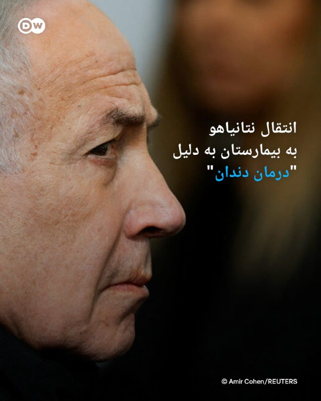

🔶 انتقال نتانیاهو به بیمارستان به دلیل "درمان دندان‌"

بنا بر گزارش‌ها نخست‌وزیر اسرائیل دوشنبه چهارم خرداد (۲۵ مه) به بیمارستان منتقل شده است. طبق گزارش رسانه‌های اسرائیلی به نقل از دفتر بنیامین نتانیاهو، او اواخر شب به یک بیمارستان در اورشلیم (بیت‌المقدس) منتقل شده تا تحت یک "درمان دندان‌پزشکی" قرار گیرد. جزئیات دقیق این درمان اعلام نشده است.

نتانیاهو که ۷۶ سال دارد، حدود یک ماه پیش با انتشار متنی در شبکه‌های اجتماعی برای نخستین بار از پرتودرمانی موفقیت‌آمیز خود برای یک تومور بدخیم پروستات خبر داده و اعلام کرده بود که در حال حاضر سالم است. او گفته بود انتشار گزارش مربوط به وضعیت سلامتی‌اش را به تأخیر انداخته تا از بهره‌برداری تبلیغاتی جمهوری اسلامی از این موضوع در جریان جنگ جلوگیری کند.

اعلام این موضوع از سوی نتانیاهو همراه با انتشار گزارش سالانه سلامت او و همچنین سندی جداگانه درباره تشخیص و درمان سرطانش صورت گرفت. با این حال به نوشته "تایمز اسرائیل"، این گزارش تنها نیم‌ صفحه و شامل پنج نکته کلی و مبهم بود که حتی مشخص نمی‌کرد این اطلاعات مربوط به چه سالی است. روی هیچ‌یک از این اسناد نشان بیمارستان درج نشده بود و هیچ نشانه‌ای مبنی بر رسمی بودن آنها به عنوان گزارش پزشکی مشاهده نمی‌شد.

@dw_farsi

## DW_Farsi — post 125149

  

🔶 نفتکش ژاپنی که از تنگه هرمز عبور کرده بود، به ژاپن رسید

بیش از ۱۲ هفته پس از آغاز جنگ ایران، اولین نفتکش ژاپنی که پس از بسته شدن تنگه هرمز از آن عبور کرده بود، به ژاپن رسید. این نفتکش با نام "ایدمیتسو مارو" با پرچم پاناما روز دوشنبه در اسکله‌ای در نزدیکی شهر چیتا، در جزیره هونشو، پهلو گرفت.

مینورو کیهارا، دبیر ارشد کابینه ژاپن در یک نشست خبری گفت که ورود این کشتی به کشور‌، "از نظر تضمین تأمین پایدار انرژی، خبر خوشایندی است".

ژاپن وابستگی زیادی به نفت خلیج فارس دارد و در ماه‌های اخیر برای کاهش فشار ناشی از افزایش قیمت نفت، میزان بی‌سابقه‌ای از ذخایر راهبردی اضطراری نفت خود را آزاد کرده است.

کیهارا افزود که همچنان ۳۹ کشتی مرتبط با ژاپن در خلیج فارس گرفتار هستند که یکی از آن‌ها خدمه ژاپنی دارد. او تأکید کرد توکیو فعالانه تمام تلاش‌های دیپلماتیک لازم را انجام می‌دهد تا این کشتی‌ها بتوانند از تنگه هرمز عبور کنند.

به گزارش شبکه دولتی ژاپنی "ان‌اچ‌کی" سه خدمه ژاپنی کشتی ایدمیتسو مارو در وضعیت جسمانی خوبی بسر می‌برند.

این نفتکش که توسط یکی از زیرمجموعه‌های شرکت بزرگ پالایش نفت "ایدمیتسو کوسان" اداره می‌شود، حامل حدود دو میلیون بشکه نفت خام عربستان سعودی است که به استان آیچی، قطب صنعتی ژاپن، منتقل می‌شوند تا به فراورده‌های نفتی تبدیل شوند.

اوایل ماه مه یک نفتکش ژاپنی دیگر نیز از تنگه هرمز عبور کرد که احتمالا اوایل ژوئن به ژاپن می‌رسد.

@dw_farsi

## DW_Farsi — post 125148

  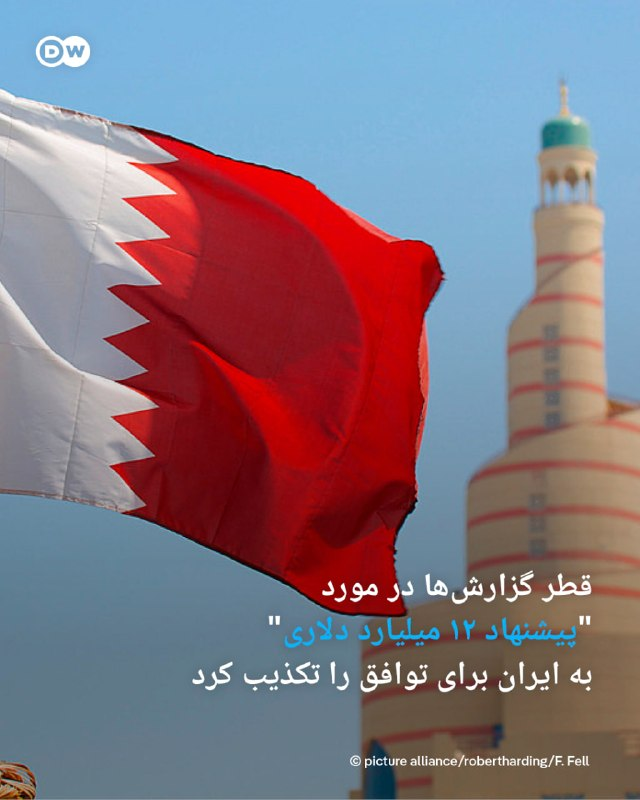

🔶 قطر گزارش‌ها در مورد "پیشنهاد ۱۲ میلیارد دلاری" به ایران برای توافق را تکذیب کرد

ماجد محمد الانصاری، سخنگوی وزارت خارجه قطر، با انتشاری پستی در شبکه ایکس گزارش‌ها در مورد "پیشنهاد ۱۲ میلیارد دلاری" قطر به ایران برای تضمین یک توافق را رد کرد.

او نوشت: «گزارش‌هایی که ادعا می‌کنند قطر برای تضمین یک توافق، ۱۲ میلیارد دلار به ایران "پیشنهاد" داده است، کاملاً نادرست هستند و توسط طرف‌هایی منتشر می‌شوند که تلاش دارند این توافق را تخریب کرده و تلاش‌های دیپلماتیک جاری برای کاهش تنش و ثبات منطقه‌ای را تضعیف کنند.»

سخنگوی وزارت خارجه قطر با اشاره به "نقش دیپلماتیک" این کشور افزود این موضوع "در هماهنگی با شرکای منطقه‌ای کاملا شناخته‌شده و به طور عمومی مستند شده است و چنین روایت‌هایی چیزی جز تلاش‌های ناامیدانه برای خدشه‌دار کردن اعتبار قطر به عنوان یک میانجی قابل اعتماد بین‌المللی برای صلح نیست".

یک هیئت نمایندگی از ایران روز دوشنبه چهارم خرداد به سرپرستی محمدباقر قالیباف، رئیس مجلس شورای اسلامی، در سفری غیرمنتظره به قطر رفت. پیش‌تر یک هیئت قطری در روز جمعه در هماهنگی با آمریکا به تهران سفر کرده بود. یک منبع مطلع به رویترز گفته بود که هدف از سفر این هیئت، تلاش برای دستیابی به توافقی برای پایان دادن جنگ و حل مسائل باقی‌مانده است.

دوحه که پیش‌تر در جریان جنگ غزه و دیگر بحران‌های بین‌المللی نقش میانجی را ایفا کرده بود، پس از حملات موشکی و پهپادی ایران به این کشور در جریان جنگ ۴۰ روزه، تا کنون از ورود مستقیم به میانجی‌گری در جنگ ایران خودداری کرده است.

در حالی که پاکستان از آغاز جنگ رسما نقش میانجی را بر عهده داشته و میزبان تنها دور مذاکره مستقیم ایران و آمریکا بوده است، بازگشت قطر به روند تعاملات نشان‌دهنده نقش دیرینه این کشور به‌عنوان متحد آمریکا در منطقه و کانال ارتباطی قابل اعتماد میان واشنگتن و تهران است.

قطر یکی از متحدان اصلی ایالات متحده در منطقه و میزبان پایگاه هوایی العدید، بزرگترین تأسیسات نظامی ایالات متحده در خاورمیانه، است.

@dw_farsi

## DW_Farsi — post 125147

  

🔶 روبیو: توافق با ایران هنوز امکان‌پذیر است

مارکو روبیو، وزیر خارجه آمریکا، روز سه‌شنبه پنجم خرداد (۲۶ مه) گفت که مذاکرات برای دستیابی به توافق با ایران به دلیل اختلاف‌ها بر سر متن و نحوه نگارش توافق‌نامه با تأخیر مواجه شده است. روبیو در جریان سفرش به هند در گفت‌وگو با خبرنگاران اظهار داشت: «چند روزی طول می‌کشد تا این اختلاف‌ها حل‌وفصل شود… فقط بر سر یک کلمه یا یک جمله.»

او در تأیید اظهارات پیشین مقام‌های آمریکایی افزود: «باید این مسائل را مرحله‌به‌مرحله برطرف کنیم.»

او گفت به رغم حملات جدید آمریکا به جنوب ایران که تردیدهایی را درباره شکننده بودن آتش‌بس ایجاد کرده، همچنان امکان دستیابی به توافق با ایران وجود دارد. روبیو با اشاره به ادامه مذاکرات در قطر در روز دوشنبه گفت: «امروز گفت‌وگوهایی در قطر در جریان بود، بنابراین خواهیم دید که آیا می‌توانیم پیشرفتی حاصل کنیم یا نه. فکر می‌‌کنم چانه‌زنی‌های زیادی درباره عبارات مشخص در متن اولیه سند وجود دارد، بنابراین چند روز زمان خواهد برد.»

او افزود که دونالد ترامپ تمایل خود را برای امضای یک توافق ابراز کرده و رئیس‌ جمهور آمریکا "یا یک توافق خوب بدست می‌آورد یا اصلا توافقی در کار نخواهد بود".

@dw_farsi

## DW_Farsi — post 125146

  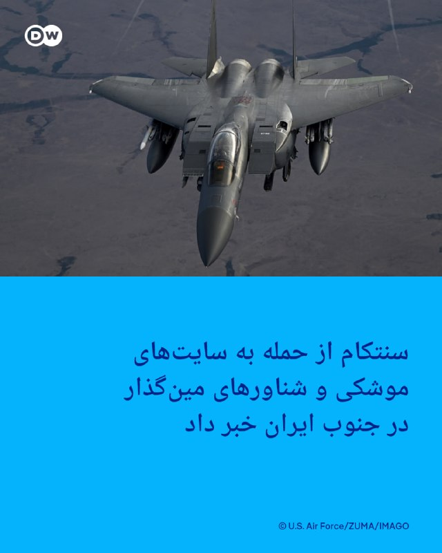

🔶 سنتکام از حمله به سایت‌های موشکی و شناورهای مین‌گذار در جنوب ایران خبر داد

فرماندهی مرکزی ایالات متحده آمریکا، سنتکام، در بیانیه‌ای اعلام کرد ارتش آمریکا در جنوب ایران عملیاتی را "برای دفاع از خود" انجام داده و مواضع پرتاب موشک و شناورهای ایرانی را که "در حال تلاش برای کارگذاری مین بودند" هدف قرار داده است.

تیم هاوکینز، سخنگوی سنتکام در این بیانیه گفته است: «نیروهای آمریکایی امروز [سه‌شنبه ۲۶ مه] در جنوب ایران حملات دفاع از خود انجام دادند تا از نیروهای ما در برابر تهدیدهای ناشی از نیروهای ایرانی محافظت شود.»

به گفته سخنگوی سنتکام اهداف این حملات "شامل سایت‌های پرتاب موشک و قایق‌های ایرانی بودند که در تلاش برای مین‌گذاری بودند".

هاوکینز افزوده است که ارتش آمریکا در طول آتش‌بس جاری ضمن اعمال خویشتنداری، همچنان به دفاع از نیروهای خود ادامه خواهد داد.

در همین حال یک مقام ارشد آمریکایی به شبکه خبری "فاکس نیوز" گفته است که دو قایق ایرانی در تنگه هرمز در حال مین‌گذاری مشاهده شدند و همچنین نیروهای آمریکایی پس از آنکه یک پایگاه موشکی [ایران]، هواپیماهای جنگی آمریکا را هدف قرار داد، واکنش نشان دادند. به گفته این مقام آمریکایی ارتش ایالات متحده هر دو شناور سپاه پاسداران را منهدم کرد و همچنین به سایت‌های پرتاب موشک‌های زمین به هوا در بندرعباس حمله کرد. او به فاکس نیوز گفت این حملات "دفاعی" بوده‌اند.

@dw_farsi

## Persian_Trend_Official — post 15042

  

صفحه اینترنت پرو از سایت همراه اول حذف شد.

👩‍💻@PhantomDirective

🆔@persian_trend_official
پرشین ترند | متفاوت‌ترین کانال نظامی

## Persian_Trend_Official — post 15041

  <a href="telegram/content/Persian_Trend_Official_15041_1779782975.webm" target="_blank">🎬 Download video</a>

دقایقی قبل نت‌بلاکس آپدیت جدیدی از وضعیت اینترنت بین‌الملل ایران منتشر کرد.

👩‍💻@PhantomDirective

🆔@persian_trend_official
پرشین ترند | متفاوت‌ترین کانال نظامی

## Persian_Trend_Official — post 15040

  <a href="telegram/content/Persian_Trend_Official_15040_1779782975.webm" target="_blank">🎬 Download video</a>

🇮🇷بیانیه منتشر شده از سوی روابط‌عمومی سپاه

هشدار سپاه در برابر هرگونه نقض آتش بس از سوی ارتش متجاوز آمریکا:
حق پاسخ متقابل را برای خود مشروع و قطعی می‌دانیم

در اطلاعیه روابط عمومی سپاه پاسداران انقلاب اسلامی آمده است:
🔹ارتش تروریستی آمریکا در ادامه ماجراجویی‌های مداخله گرایانه در منطقه و رفتارهای متجاوزانه، در منطقه خلیج فارس وارد حریم هوایی ایران شد و یگان های پدافندی سپاه پاسداران در راستای دفاع از حریم سرزمینی کشورمان پس از پایش های اطلاعاتی دقیق، یک فروند پهپاد MQ9 را شناسایی و ساقط کرد.
🔹همچنین با شلیک به یک فروند پهپاد RQ4 و جنگنده متجاوز F35 آنان را وادار به فرار و خروج از حریم سرزمینی کرد.
🔹سپاه پاسداران نسبت به هرگونه نقض آتش بس از سوی ارتش متجاوز آمریکا هشدار داده و حق پاسخ متقابل را برای خود مشروع و قطعی می داند.

👩‍💻@PhantomDirective

🆔@persian_trend_official
پرشین ترند | متفاوت‌ترین کانال نظامی

## Persian_Trend_Official — post 15039

  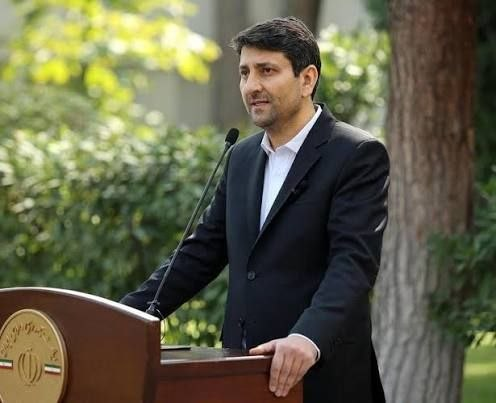

✉️ دسترسی برخی کاربران سیتنا به #جیمیل 🔹 بر اساس گزارشات اعلامی از سوی برخی کاربران سیتنا، امکان دسترسی به جیمیل برای برخی کاربران بر روی برخی #اپراتورها میسر شده است./ #سیتنا مشخص نیست این دسترسی موقتی و تست است و یا دسترسی کامل به جیمیل برای تمام کاربران…

## Persian_Trend_Official — post 15038

  <a href="telegram/content/Persian_Trend_Official_15038_1779782976.mp4" target="_blank">🎬 Download video</a>

استاد خوش چشم : می‌شود بمب هسته‌ای برای بازدارندگی ساخت، تو جمعیت نزد و توی پایگاه های نظامی زد...

👩‍💻@PhantomDirective

🆔@persian_trend_official
پرشین ترند | متفاوت‌ترین کانال نظامی

## Persian_Trend_Official — post 15037

  <a href="telegram/content/Persian_Trend_Official_15037_1779782978.mp4" target="_blank">🎬 Download video</a>

مهاجرانی: رئیس‌جمهور مصوبه بازگشایی اینترنت بین‌الملل را ابلاغ کرد/ امیدواریم ظرف روزهای آتی بتوانیم این حقوق حقه مردم را به آنها برگردانیم

👩‍💻@PhantomDirective

🆔@persian_trend_official
پرشین ترند | متفاوت‌ترین کانال نظامی

## Persian_Trend_Official — post 15036

  <a href="telegram/content/Persian_Trend_Official_15036_1779782978.webm" target="_blank">🎬 Download video</a>

طبق گفته کاربران بعد از جیمیل آپ گوگل پلی هم دردسترس قرار گرفت.

👩‍💻@PhantomDirective

🆔@persian_trend_official
پرشین ترند | متفاوت‌ترین کانال نظامی

## Persian_Trend_Official — post 15035

  

✉️ دسترسی برخی کاربران سیتنا به #جیمیل

🔹 بر اساس گزارشات اعلامی از سوی برخی کاربران سیتنا، امکان دسترسی به جیمیل برای برخی کاربران بر روی برخی #اپراتورها میسر شده است./ #سیتنا

مشخص نیست این دسترسی موقتی و تست است و یا دسترسی کامل به جیمیل برای تمام کاربران در راه است.

برای مشاهده جزئیات کلیک کنید

💬 CitnaNewsAgeny

🎞 CitnaNews

📷 Citna.ir

🌐 @Citna94

## Persian_Trend_Official — post 15032

بولتن خبری۲۴ ساعت گذشته
آرشیو تحریریه پرشین ترند.

۵ خرداد ۱۴۰۵

🇮🇷ایران

😂مصوبه بازگشت اینترنت به وضعیت پیش از دی‌ماه ۱۴۰۴ توسط رئیس‌جمهور پزشکیان ابلاغ شد.

😂محمدباقر قالیباف مجدداً به ریاست مجلس شورای اسلامی ابقا شد.

🇮🇷محمدباقر ذوالقدر (دبیر شورای عالی امنیت ملی) تأکید کرد: «عقب‌نشینی در کار نخواهد بود» و بر وحدت ملی تأکید داشت.

وزیر نفت اعلام کرد قیمت بنزین افزایش نمی‌یابد و تلاش برای تعمیر تأسیسات ادامه دارد.

محمدرضا عارف سیاست قطع اینترنت را انتقاد کرد و آن را با بستن کل اتوبان به دلیل تخلف یک راننده مقایسه کرد.

🇮🇷
🇺🇸-گزارش‌های متعدد از پیشرفت در تهیه یادداشت تفاهم ۶۰ روزه بین ایران و آمریکا حکایت دارد. محورهای کلیدی شامل بازگشایی تنگه هرمز (با پاکسازی مین‌ها توسط ایران)، رفع محاصره دریایی، معافیت‌های موقت تحریمی برای صادرات نفت، آزادسازی مرحله‌ای دارایی‌های بلوکه‌شده (شامل حدود ۱۲ میلیارد دلار اولیه) و آغاز مذاکرات هسته‌ای در دوره ۶۰ روزه است
.
دونالد ترامپ صراحتاً مذاکرات با ایران را به گسترش توافق‌های ابراهیم گره زده و از عربستان سعودی، قطر، پاکستان، ترکیه، مصر و اردن خواسته است که همزمان با هر توافق احتمالی با ایران، روابط خود با اسرائیل را عادی‌سازی کنند. این موضع پیچیدگی دیپلماتیک قابل توجهی ایجاد کرده است.

گره زدن مذاکرات ایران به گسترش توافق‌های ابراهیم توسط ترامپ و تأکید ایران بر عدم وجود توافق نهایی هسته‌ای، نشان‌دهنده پیچیدگی‌های عمیق دیپلماتیک است. گزارش‌ها حاکی از وجود اختلافات باقی‌مانده بر سر مسائل هسته‌ای، مدیریت تنگه هرمز و تضمین‌های امنیتی است.

🇺🇸 ترامپ اعلام کرده اورانیوم غنی‌شده ایران باید یا به آمریکا منتقل و نابود شود یا با نظارت در مکانی مورد توافق نابود گردد.

- مقامات ایرانی رسماً اعلام کرده‌اند که توافق هسته‌ای قریب‌الوقوع نیست و هنوز بر سر جزئیات مهم اختلاف وجود دارد. تهران تأکید کرده که هنوز به هیچ توافق نهایی نرسیده‌اند و سند فعلی فقط چارچوبی برای مذاکرات آینده است.

😂
😂هیئت ایرانی به ریاست محمدباقر قالیباف و حضور عباس عراقچی به دوحه سفر کرده است.
- عاصم منیر (فرمانده ارتش پاکستان) توافق را نزدیک به نهایی شدن دانست.

- گزارش‌هایی از شنیده شدن انفجار در مناطق بندرعباس، جاسک، سیرک و جزیره خارگ منتشر شده است.

فرماندهی مرکزی آمریکا (سنتکام) اعلام کرد حملات «دفاعی» به سایت‌های پرتاب موشک و قایق‌های ایرانی انجام داده است.

🇮🇷ایران از فعال‌سازی پدافند هوایی و سرنگونی یک پهپاد متخاصم با سامانه «کمان آرش» خبر داده است.

- دو مورد آتش‌سوزی در جزیره خارگ (پایانه اصلی صادرات نفت) گزارش شده است.

🇮🇷۳۲ کشتی با مجوز نیروی دریایی سپاه از تنگه هرمز عبور کرده‌اند.

🇮🇱اسرائیل و خاورمیانه

🇱🇧
🇮🇱 آتش‌بس عملاً پایان یافته و ارتش اسرائیل عملیات «پیکان‌های آتش» را آغاز کرده است.
- بیش از ۷۰ هدف مرتبط با حزب‌الله در جنوب لبنان، بقاع شرقی و مناطق دیگر مورد حمله قرار گرفته است.

🇮🇱
🇮🇱 نتانیاهو بر تشدید عملیات تأکید کرده است. گزارش‌هایی از تخلیه گسترده ضاحیه جنوبی بیروت و تعطیلی مدارس شمال اسرائیل وجود دارد.

🇱🇧 گزارش‌هایی از تلاش ناموفق برای ترور نعیم قاسم وجود دارد.
- درگیری‌ها از مارس ۲۰۲۶ شدت گرفته و تا کنون هزاران کشته و زخمی داشته است.

🇺🇸
🇺🇸 فرد مسلح به نام نصیر بست (Nasire Best)، ۲۱ ساله اهل مریلند (Dundalk)، مقابل کاخ سفید تیراندازی کرد. مأموران سرویس مخفی او را کشتند. در این حادثه یک شهروند غیرنظامی نیز مجروح شد.
- مقامات رسمی تأیید کرده‌اند که مظنون سابقه اختلال روانی شدید، برخوردهای قبلی با سرویس مخفی و نقض حکم قضایی منع接近 به کاخ سفید داشته است. او قبلاً ادعا کرده بود که «عیسی مسیح» است.

سناتور لیندزی گراهام نسبت به هر توافقی که موقعیت ایران را تقویت کند، هشدار داد.

📰- نظرسنجی وال‌استریت ژورنال از کاهش حمایت قاطع جمهوری‌خواهان از ترامپ (از ۷۲٪ به ۵۷٪) خبر داد.

🇸🇦 عربستان سعودی عادی‌سازی روابط با اسرائیل را مشروط به «مسیر غیرقابل بازگشت» تشکیل کشور فلسطین دانست.

🇷🇺🇺🇦روسیه با موشک اورشنیک به کی‌یف حمله کرد و از اتباع خارجی خواست فوراً کی‌یف را ترک کنند.

👩‍💻@PhantomDirective

🆔@persian_trend_official
پرشین ترند | متفاوت‌ترین کانال نظامی

## Persian_Trend_Official — post 15031

  <a href="telegram/content/Persian_Trend_Official_15031_1779782979.mp4" target="_blank">🎬 Download video</a>

پاسخ معاون رئیس جمهور به میزان خسارت به بخش انرژِی و زیرساخت در عملیات خشم حماسی

## Persian_Trend_Official — post 15030

عصبانیت رسانه شهرداری تهران از مصوبه‌ای که اینترنت را برای همه مردم می‌خواهد

روزنامه همشهری نوشت:
🔹اولاً اصل تشکیل این ستاد ویژه فضای مجازی محل اشکال جدی است؛ چراکه با احکام صریح امام شهید و دیگر قوانین بالادستی، ازجمله قانون اساسی، مصوبات مجلس، شورای‌عالی امنیت ملی و شورای‌عالی فضای مجازی مغایرت دارد.
🔹رهبر شهید انقلاب صراحتاً در سال۱۳۹۰ فرمودند مرجع «سیاستگذاری، تصمیم‌گیری، مدیریت و هماهنگی» در فضای مجازی، شورای‌عالی فضای مجازی است. در سال ۱۳۹۴ نیز مجدداً تأکید کردند شوراها و ساختارهای موازی با شورای‌عالی فضای مجازی باید منحل شوند، نه اینکه ساختار موازی جدید ایجاد شود.
🔹تصمیم دیروز درباره تعیین زمان برای بازشدن اینترنت، بدعتی دیگر بر همان بدعت است. این تصمیم، خلاف صریح مصوبه شورای‌عالی امنیت ملی است و از جهت محتوایی نیز بسیار نادرست است؛ موجب اخلال در فرماندهی واحد در شرایط جنگی می‌شود، مردم را دچار تشویش و سردرگمی می‌کند و به دشمن پیام اختلاف و چندصدایی در مدیریت بحران می‌دهد.
🔹فراموش نکنیم محدودیت اینترنت، تصمیمی امنیتی در شرایط جنگی برای صیانت از مردم است. مردم به اندازه کافی در تنگنای شرایط جنگی هستند. نباید با تصمیم‌های نادرست، فشار روانی و سردرگمی را بیشتر کرد. امروز زمان همدلی با مردم، وحدت فرماندهی و اقدام هماهنگ در سطح حکمرانی است؛ نه چندصدایی و تصمیمات موازی.

🌐 @IT_Fouri

پ.ن : زاکانی حرومزاده میخواد از مردم‌صیانت کنه !

## Persian_Trend_Official — post 15029

  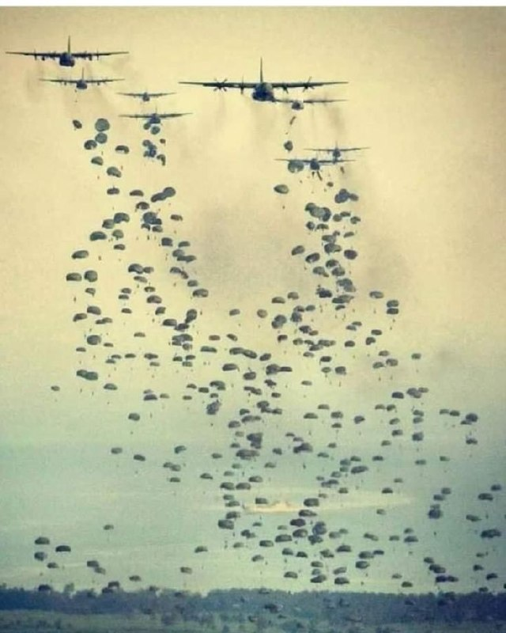

⭕️ترامپ: «اورانیوم غنی‌شده (غبار هسته‌ای!) فوراً به ایالات متحده تحویل داده خواهد شد تا به کشور بازگردانده شده و نابود شود، یا بهتر از آن، با همکاری و هماهنگی با جمهوری اسلامی ایران، در همان محل یا در مکانی قابل قبول دیگر نابود گردد؛ آن هم با حضور و نظارت…

## RadioFarda — post 157562

  

🔸رسانه‌های ایران روز سه‌شنبه پنجم خرداد پیامی منسوب به مجتبی خامنه‌ای، رهبر جمهوری اسلامی، را به‌مناسبت برگزاری مراسم حج منتشر کردند که در آن می‌گوید آمریکا از این پس «نقطه امنی برای استقرار پایگاه نظامی در منطقه نخواهد داشت».

🔸او در این پیام توضیحی دربارهٔ پایگاه‌های آمریکایی مستقر در کشورهای خلیج فارس نکرد اما هشدار داد که «سرزمین‌های منطقه دیگر سپر پایگاه‌های آمریکایی نخواهد بود».

🔸مجتبی خامنه‌ای همچنین با یادآوری ادعای ۱۰ سال پیش پدرش علی خامنه‌ای درباره اسرائیل، مدعی شد این کشور نیز «به مراحل پایانی عمر» خود نزدیک شده و «۲۵ سال بعد از آن تاریخ را نخواهد دید».

🔸رهبر پیشین جمهوری اسلامی در سال ۱۳۹۴ و پس از امضای توافق هسته‌ای موسوم به برجام وعدهٔ نابودی اسرائیل را داده و گفته بود «اسرائیل ۲۵ سال آینده را نخواهد دید».

🔸از زمان اعلام نام مجتبی خامنه‌ای، به عنوان سومین رهبر جمهوری اسلامی، تصویر یا صدایی از او منتشر نشده و رسانه‌های ایران فقط پیام‌های کتبی را از او منتشر می‌کنند.

@RadioFarda

## RadioFarda — post 157561

  

🔸سخنگوی وزارت خارجه قطر می‌گوید گزارش‌هایی که ادعا می‌کنند دولت این کشور برای تضمین نهایی‌شدن توافق با ایران، ۱۲ میلیارد دلار به جمهوری اسلامی «پیشنهاد» داده، «کاملاً بی‌اساس» است.

🔸ماجد الانصاری سه‌شنبه پنجم خرداد در شبکه ایکس نوشته که این گزارش‌ها «توسط طرف‌هایی منتشر می‌شوند که به دنبال برهم زدن توافق و تضعیف تلاش‌های دیپلماتیک با هدف کاهش تنش‌ها و تقویت ثبات در منطقه‌اند.»

🔸او افزوده که تلاش‌های دیپلماتیک قطر که با «هماهنگی» شرکای منطقه‌ای انجام می‌شود، «شناخته‌شده و شفاف است».

🔸ماجد الانصاری انتشار این دست روایت‌ها را «تلاش‌های مذبوحانه برای خدشه‌دار کردن اعتبار» دولت قطر نامیده که به گفته او به‌عنوان «یک بازیگر بین‌المللی قابل اعتماد در مسیر دستیابی به صلح» است.

🔸این موضع‌گیری اندکی پس از آن اعلام می‌شود که روز دوشنبه، چهارم خرداد، هیئت نمایندگی ایران به ریاست محمدباقر قالیباف، رئیس مجلس، و با همراهی عباس عراقچی، وزیر خارجه، در سفری غیرمنتظره وارد قطر شد.

🔸قطر در جریان جنگ ایران، بارها توسط جمهوری اسلامی مورد حملات موشکی و پهپادی قرار گرفته بود.

@RadioFarda

## RadioFarda — post 157559

🔸توماج صالحی، خواننده معترض، در واکنش به صدور حکم اعدام برای چهار معترض پرونده «اکباتان»، این حکم را «ناعادلانه» و «ضدبشری» نامید.

🔸آقای صالحی که خود چندبار بازداشت شده و به زندان افتاده، این پست را بعد از ماه‌ها سکوت، در شبکه اجتماعی ایکس منتشر کرده است.

🔸او تأکید کرده که این متن را در حالی می‌نویسد که «ماه‌هاست آزادی ‌بیان و آزادی رسانه «گرچه هرگز نداشته‌ایم» به بهانه‌ جنگ، به شدید‌ترین شکلِ ممکن سرکوب شده، و فقر نیز از زمین و آسمان بر سر مردم می‌بارد.»

🔸این خواننده معترض با بیان اینکه «بعد از شرافت، هیچ چیز با ارزش‌تر از جان انسان‌ها نیست»، اضافه کرده که هنوز بازماندگانی از «جنبش باشکوه و سربلند زن زندگی آزادی» در زندان‌ها به سر می‌برند.

🔸صالحی به صدور احکام اعدام برای میلاد آرمون، نوید نجاران، مهدی ایمانی و محمدمهدی حسینی، از بازداشت‌شدگان این پرونده اشاره کرده و نوشته: «شرافتِ ما حکم می‌کند در مقابل این بی‌عدالتی بایستیم.»

🔸ابوالقاسم صلواتی، رئیس شعبهٔ ۱۵ دادگاه انقلاب به این چهار متهم پرونده موسوم به «شهرک اکباتان» مربوط به اعتراضات «زن، زندگی، آزادی» در تهران حکم اعدام داده است.

@RadioFarda

## RadioFarda — post 157558

  

🔸ستاد فرماندهی مرکزی آمریکا، سنتکام، اعلام کرد که ارتش ایالات متحده روز دوشنبه در جنوب ایران حملاتی را علیه اهدافی «از جمله قایق‌هایی که در تلاش برای کارگذاری مین بودند و همچنین سایت‌های پرتاب موشک» انجام داده است.

🔸در بیانیه این ستاد، این حملات، « اقدامی دفاعی» توصیف شده است.

🔸سنتکام اعلام کرده که این حملات با هدف حفاظت از نیروهای آمریکا «در برابر تهدیدهای ناشی از نیروهای ایرانی» انجام شده است.

🔸به‌نوشته رویترز، کاپیتان تیم هاوکینز، سخنگوی سنتکام، گفت: «فرماندهی مرکزی ایالات متحده همزمان با حفظ خویشتنداری در جریان آتش‌بس، همچنان از نیروهای خود دفاع می‌کند.»

🔸بامداد دوشنبه چهارم خرداد برخی شهروندان سواحل خلیج فارس، به‌ویژه در شهرهای بندرعباس، سیریک و جاسک، از شنیده‌شدن چند انفجار و فعالیت پدافند ضدهوایی خبر داده بودند.

🔸رسانه‌های ایران بامداد سه‌شنبه گزارش دادند که «جنگنده‌های آمریکایی چند شناور ایرانی را در جنوب جزیره لارک هدف قرار دادند.

🔸پایگاه خبری تابناک در تهران نیز خبر داد «دو قایق تندرو سپاه هدف حمله هوایی قرار گرفته و بر اثر آن چهار نفر کشته شدند».

@RadioFarda

## RadioFarda — post 157557

  

🔸دونالد ترامپ، رئیس‌جمهور آمریکا، می‌گوید اورانيوم غنی‌شده ایران «يا فوری به ايالات متحده تحويل داده خواهد شد تا به آمريکا منتقل و نابود شود، يا ترجيحاً با همکاری و هماهنگی جمهوری اسلامی ايران، در همان محل يا در مکانی ديگر که مورد توافق باشد، نابود خواهد شد».

🔸ترامپ در شبکه اجتماعی خود، تروث‌سوشال، نوشت که این اقدام «با نظارت آژانس انرژی اتمی يا نهاد معادل آن به‌عنوان ناظر بر اين روند و اين رويداد انجام می‌شود.»

🔸باراک راوید، گزارشگر نشریه اکسیوس، این پست رئیس‌جمهور آمریکا را «عقب‌نشینی» آمریکا از تقاضای قبلی خود و نزدیک ‌شدن به آن چیزی عنوان کرده که جمهوری اسلامی دنبال آن بوده است.

🔸بنیامین نتانیاهو، نخست‌وزیر اسرائیل، در روزهای اخیر گفته بود بدون خروج ذخایر اورانیوم غنی‌شده از ایران، جنگ پایان نمی‌یابد.

@RadioFarda

## RadioFarda — post 157556

  

🔸ستاد فرماندهی مرکزی آمریکا، سنتکام روز سه‌شنبه پنجم خرداد اعلام کرد که نیروهای آمریکایی در جنوب ایران در پاسخ به آنچه تهدید نیروهای جمهوری اسلامی خوانده شده، عملیات دفاعی انجام داد.

🔸بنا بر اعلام سنتکام اهداف این عملیات شامل سایتهای پرتاب موشک و قایق‌هایی بوده که در تلاش برای مین گذاری دریایی بودند.

🔸 یک مقام ارشد آمریکایی به فاکس نیوز گفت دو شناور سپاه پاسداران که در حال مین گذاری در تنگه هرمز شناسایی شده بودند توسط ارتش آمریکا منهدم شدند.

🔸به گفته مقام‌های آمریکایی همچنین یک سامانه موشکی زمین به هوادر بندرعباس که جنگنده ههای آمریکایی را هدف قرار داده بود مورد حمله قرار گرفت.

🔸واشینگتن تاکید کرده است که این حملات ماهیت دفاعی داشته و به معنای پایان آتش بس جاری نیست.

🔸پیشتر رسانه‌ها در ایران از شنیده شدن صدای انفجار در بندرعباس و چند شهر دیگر خبر داده بودند.

@RadioFarda

## RadioFarda — post 157555

  

🔸ساعتی پس از خبر خبرگزاری سپاه پاسداران درباره حمله پهپادی به نقطه‌ای در نزدیکی اربیل، خبرگزاری رویترز تأیید کرد که «مقر یک گروه اپوزیسیون» جمهوری اسلامی در شمال اربیل در کردستان عراق هدف قرار گرفته است.

🔸به نوشته رویترز به نقل از «منابع امنیتی»، این حمله راکتی بوده و دو عضو این گروه را زخمی کرده است.

🔸خبرگزاری تسنیم وابسته به سپاه پاسداران نوشته است که این حمله به «مراکز تسلیحاتی گروهک تجزیه‌طلب» در اربیل انجام شده است.

🔸در ادبیات مقامات جمهوری اسلامی، «گروهک تجزیه‌طلب» اشاره به گروه‌های کرد مخالف حکومت ایران دارد.

@RadioFarda

## IranianMinds — post 20776

🔴 سپاه :

دیشب به سمت یک پهپاد RQ-4 و یک جنگنده F-35 را که در حال حمله به منطقه ما بودند، شلیک کردیم.

@IranianMinds

## IranianMinds — post 20775

🔴 هاشمی، وزیر ارتباطات: بازگشایی اینترنت به وضعیت قبل دی ماه در حال اجرا هست @IranianMinds

## IranianMinds — post 20774

🔴 هاشمی، وزیر ارتباطات:

بازگشایی اینترنت به وضعیت قبل دی ماه در حال اجرا هست

@IranianMinds

## BBCPersian — post 282083

🔻جولیا تینتی و کاساندرا مدیسون شباهت‌های زیادی داشتند و خیلی زود، پس از آشنایی در محل کار مشترک‌شان در یک بار، به دوستان صمیمی تبدیل شدند، بی‌آن‌که بدانند در واقع چقدر به هم نزدیک‌اند.

تینتی و مدیسون هر دو در دهه ۱۹۹۰ و در کنتیکت آمریکا بزرگ شده‌اند. هرچند آنها در دوران کودکی همدیگر را نمی‌شناختند اما در فاصله ۱۵ دقیقه‌ای از همدیگر زندگی می‌کردند و هر دو آنها به فرزندی دو خانواده پذیرفته شده بودند.

📸 Julia Tinetti/ Cassandra Madison and Julia Tinetti/

https://bbc.in/3PBOfCT
@BBCPersian

## BBCPersian — post 282082

🔻آغاز خنثی‌سازی مهمات منفجرنشده در محدوده نیروگاه اتمی بوشهر

محمد مظفری، فرماندار بوشهر گفته است که پنجمین دور عملیات خنثی‌سازی مهمات عمل‌نکرده در این استان آغاز شده است و امروز (سه‌شنبه) انفجارهای کنترل‌شده‌ای انجام خواهد شد.

آقای مظفری در گفت‌وگو با ایرنا درباره خنثی‌سازی مهمات عمل‌نکرده مربوط حملات آمریکا و اسرائیل در محدوده نیروگاه اتمی بوشهر گفت که این عملیات از ساعت ۹ صبح تا ساعت ۳ بعد از ظهر به وقت محلی انجام می‌شود و انفجارها در این بازه زمانی کنترل‌شده بوده و جای نگرانی ندارد.

او اضافه کرد: «با توجه به ضرورت پاک‌سازی و تأمین ایمنی اطراف نیروگاه اتمی، عملیات تخصصی خنثی‌سازی و انهدام تعدادی از مهمات عمل‌نکرده در دستور کار تیم‌های خنثی‌سازی قرار گرفته است.»

https://bbc.in/4u071Sq
@BBCPersian

## BBCPersian — post 282080

🔻شرکت خودروسازی ایتالیایی «فراری» از نخستین خودرو تمام‌برقی خود با نام «لوچه» رونمایی کرد.
قیمت این خودرو لوکس ۶۴۰ هزار دلار است.

این مدل جدید، برخلاف طراحی همیشگی فراری، نخستین خودروی پنج‌نفره تاریخ این شرکت ایتالیایی است و با همکاری شرکت طراحی «لاوفرام» متعلق به جانی آیو، طراح پیشین شرکت اپل، ساخته شده است.

واکنش‌ها در شبکه‌های اجتماعی به این خودرو متفاوت بوده است. برخی گفته که «باید مستقیم راهی اوراقی شود» و برخی دیگر از آن به‌عنوان «شاهکار مطلق طراحی» یاد کرده‌اند.

رقبای فراری مانند «لامبورگینی» و «پورشه» به‌دلیل کاهش تقاضا و رقابت شدید با برندهای چینی، برنامه‌های توسعه خودروهای برقی خود را محدود کرده‌اند.

بندتو وینیا، مدیرعامل فراری، در رم گفت توسعه «لوچه» که در زبان ایتالیایی به‌معنای «نور» است، پنج سال زمان برده است.

فراری پیش‌تر تولید خودروی تمام‌برقی را رد کرده بود و گفت ترجیح می‌دهد خودروهای «دوگانه‌سوز برقی ـ بنزینی» تولید کند.

«لوچه» به یک موتور برقی ساخت فراری روی هر چرخ مجهز شده و می‌تواند ظرف حدود ۲/۵ ثانیه از حالت سکون به سرعت ۹۶ کیلومتر در ساعت برسد.

📸 Ferrari

@BBCPersian

## BBCPersian — post 282079

🔻زلنسکی: به دلیل جنگ ایران، سامانه دفاع هوایی در سطح جهانی کمیاب شده است

ولودیمیر زلنسکی، رئیس‌جمهور اوکراین با انتشار ویدیویی گفت: « به‌دلیل جنگ ایران، سامانه‌های رهگیری موشک‌های بالستیک اکنون در جهان با کمبود روبه‌رو است، اما باید راه‌حلی پیدا کنیم.»

او افزود: «ما با همه شرکای خود برای تقویت پدافند هوایی اوکراین همکاری می‌کنیم و این اولویت اصلی ماست.»

رئیس‌جمهور اوکراین با تاکید بر این که گفت‌وگو با آمریکا درباره امکان حمایت بیشتر از اوکراین ادامه خواهد داشت، اضافه کرد که اوکراین تلاش می‌کند روند تولید سامانه‌های رهگیری موشک‌های بالستیک را سرعت دهد تا اروپا بتواند به اندازه کافی از توان دفاعی خود برخوردار شود..

آقای زلنسکی در ادامه تصریح کرد: «اروپا از نظر مالی به ما کمک می‌کند، اما رهبری قوی آمریکا برای افزایش تولید سامانه‌های رهگیری موشک‌های بالستیک نیز فوری و ضروری است.»

https://bbc.in/4u071Sq
@BBCPersian

## BBCPersian — post 282078

  

🔻ماجد محمد انصاری، سخنگوی وزارت خارجه قطر در شبکه ایکس نوشته است: «گزارش‌هايی که ادعا می‌کنند قطر برای تضمين دستيابی به توافق، ۱۲ ميليارد دلار به ايران پيشنهاد کرده، به هيچ وجه صحت ندارد.»او اضافه کرده است که این گزارش‌ها «از سوی طرف‌هايی منتشر می شود که تلاش دارند اين توافق را تخريب کرده و روند جاری ديپلماتيک برای کاهش تنش و ثبات منطقه‌ای را تضعيف کنند.»

آقای انصاری در شبکه ایکس نوشت: «نقش ديپلماتيک قطر، در هماهنگی با شرکای منطقه‌ای، کاملا شناخته شده و به صورت عمومی مستند شده است و چنين روايت هايی چيزی جز تلاش های نااميدانه برای خدشه‌دار کردن اعتبار قطر به عنوان يک ميانجی قابل اعتماد صلح در عرصه بين المللی نيست.»

روز گذشته (دوشنبه) هیئت نمایندگی ایران به ریاست محمدباقر قالیباف، رئیس مجلس، در سفری غیرمنتظره وارد قطر شد. عباس عراقچی، وزیر خارجه، هم او را همراهی می‌کند.

📸 Getty

https://bbc.in/4u071Sq
@BBCPersian

## BBCPersian — post 282076

🔻شهرداری تهران: ۹۷ درصد از خانه‌هایی که از جنگ آسیب جزئی دیده بودند، بازسازی شدند

عبدالمطهر محمدخانی، سخنگوی شهرداری تهران گفته است ۹۷ درصد از ۳۹ هزار و ۶۵۰ واحد مسکونی که در جریان حملات آمریکا و اسرائیل به تهران آسیب‌های جزئی دیده بودند تعمیر شده‌اند.

این مقام شهرداری تهران آسیب جزیی را شامل «شیشه‌های شکسته و در و پنجره‌های آسیب دیده» تعریف کرده و همچنین از آمار ۷۵ درصدی بازسازی خانه‌هایی که سطح آسیب آنها «متوسط» ارزیابی شده خبر داده است.

https://bbc.in/4u071Sq
@BBCPersian

## BBCPersian — post 282075

🔻زمان و مکان مراسم تشییع علی خامنه‌ای «هنوز مشخص نشده است»

محسن محمودی، رئیس شورای هماهنگی تبلیغات اسلامی استان تهران، به خبرنگاران گفته است این نهاد به دنبال ترتیب دادن تشریفات مراسم تشییع علی خامنه‌ای، رهبر پیشین جمهوری اسلامی است و از نظر او این «یک مراسم جهانی خواهد بود که در تاریخ جهان اسلام و ایران ثبت می‌شود.»او اضافه کرده است: «هم‌اکنون شاهد ثبت‌نام و اعلام آمادگی از کشورهای دیگر مانند عراق برای حضور در این مراسم هستیم. قطعاً سران کشورهای اسلامی و غیراسلامی و رهبران جبهه مقاومت برای حضور در این تشییع تاریخی ابراز تمایل خواهند کرد.»

آقای محمودی گفته است که سازمان‌ها و نهادهای مختلف در حال هماهنگی و برنامه‌ریزی برای برگزاری این رویدادند با این حال: «تا این لحظه هیچ زمان مشخصی برای این موضوع تعیین نشده است.»

علی خامنه‌ای در نخستین ساعات آغاز حملات آمریکا و اسرائیل، حدود سه ماه پیش و در جریان بمباران سنگین مجموعه کاری و اقامتی‌اش (بیت رهبری) کشته شد.

https://bbc.in/4u071Sq
@BBCPersian

## BBCPersian — post 282065

🖌سباستین آشر, خبرنگار امور بین‌الملل، بی‌بی‌سی:

🔻پادشاهان مستبد، روزگاری بازتاب شکوه و جلال خود را در ویرانه‌های پروژه‌های عظیمی به یادگار می‌گذاشتند که در اوج قدرت بلامنازع خود دستور ساختشان را داده بودند. ردپای آن بناهای عظیم هنوز در دشت‌های حاصلخیز، دامنه کوه‌ها و بیابان‌های خاورمیانه دیده می‌شود. اما یکی از برجسته‌ترین نمونه‌های امروزی این فرمانروایان، شاید در نهایت تنها ردپایی دیجیتال از جاه‌طلبانه‌ترین طرح‌هایش به جا بگذارد.

حدود یک دهه پیش، محمد بن سلمان، ولیعهد عربستان سعودی، طرحی برای بازآفرینی کشورش ارائه کرد که بیشتر به داستان‌های علمی‌تخیلی شباهت داشت. این طرح، «چشم‌انداز ۲۰۳۰» نام گرفت. قرار بود سازه‌های عظیم و خارق‌العاده، زمینه‌ساز فناوری‌هایی نوین شوند؛ آن هم نه فقط برای عربستان، بلکه برای جهان.

📸GettyImages/ Reuters/ Bloomberg via Getty Images/ AFP via Getty Images

https://bbc.in/4nLRVhP
@BBCPersian

## Dirty_Kids — post 390213

  <a href="telegram/content/Dirty_Kids_390213_1779782984.mp4" target="_blank">🎬 Download video</a>

میگه پرچم رو به دخترهاى بى حجاب نميدم پرچم نجس ميشه، به بچم ياد دادم شعار بده مرگ بر ترامپ و آمريكا بچه با خجالت شعار ميده
بدون تعارف و بی ریا بگو بچت رو هم دارى خای ه مال بار ميارى و از اونورم جانى.

@Dirty_Kids 👻

## Dirty_Kids — post 390212

  

‏کاش این فصل تموم نشه واقعا تو این وضعیت اقتصادی و شرایط کشور فقط طبیعت می‌تونه یکم حالمونو خوب کنه
طبیعت هورامان

@Dirty_Kids 👻

## Dirty_Kids — post 390211

  <a href="telegram/content/Dirty_Kids_390211_1779782986.mp4" target="_blank">🎬 Download video</a>

رسما کاباره‌ باز کردن

@Dirty_Kids 👻

## Dirty_Kids — post 390210

  <a href="telegram/content/Dirty_Kids_390210_1779782987.mp4" target="_blank">🎬 Download video</a>

این ویدیو واسه سال ۲۰۱۰عه
خیلی دوست دارم بدونم این دخترا الان کجان چیکار میکنن...

@Dirty_Kids 👻

## Hranews — post 113168

  

عدم رسیدگی پزشکی؛ تداوم بازداشت سارا سپهری، شهروند بهائی در زندان عادل آباد

❗️
❗️
❗️
❗️
❗️– سارا سپهری، شهروند بهائی ساکن شیراز علیرغم گذشت بیش از یک ماه از زمان دستگیری، کماکان به صورت بلاتکلیف در زندان عادل آباد این شهر به‌سر می برد. همچنین وی دچار مشکلات جسمانی بوده و از دریافت رسیدگی مناسب پزشکی محروم مانده است.

به گزارش خبرگزاری هرانا، ارگان خبری مجموعه فعالان حقوق بشر در ایران، سارا سپهری، شهروند #بهائی در زندان عادل آباد شیراز در بازداشت و بلاتکلیفی بهسر می برد.

یک منبع مطلع نزدیک به خانواده این شهروند بهائی، ضمن تایید این خبر به هرانا گفت: “سارا سپهری ۴۷ روز است که در زندان عادل‌آباد شیراز به‌صورت بلاتکلیف نگهداری می‌شود. او در طول بازداشت دچار خونریزی معده شده و فشار ناشی از بازجویی‌های طولانی‌مدت، بیماری چشمی‌اش را تشدید کرده است. همچنین، عدم دسترسی به دارو و درمان مناسب در هفته‌های اخیر، به وخامت وضعیت جسمی و روحی وی انجامیده و او نیازمند رسیدگی تخصصی پزشکی و اعزام به مراکز درمانی خارج از زندان است.”

ادامه مطلب

#سارا_سپهری

↘️
@hranews_bot تماس ✉️ -  @Hranews  کانال هرانا 🆑

احسان چیت‌ساز، معاون سیاست‌گذاری و...

## Hranews — post 113167

  

احسان چیت‌ساز، معاون سیاست‌گذاری و برنامه‌ریزی توسعه فاوا و اقتصاد دیجیتال وزارت ارتباطات، اعلام کرد که مصوبه بازگشت #اینترنت کشور به وضعیت پیش از دی‌ماه ۱۴۰۴، توسط رییس‌جمهور تایید و برای اجرا به وزارت ارتباطات ابلاغ شده است.

روز گذشته، ستاد راهبری و ساماندهی فضای مجازی، بازگشت اینترنت به وضعیت پیش از دی‌ماه ۱۴۰۴ را تصویب و برای تایید به رییس‌جمهور ارسال کرده بود.

↘️
@hranews_bot تماس ✉️ -  @Hranews  کانال هرانا 🆑

## Hranews — post 113166

  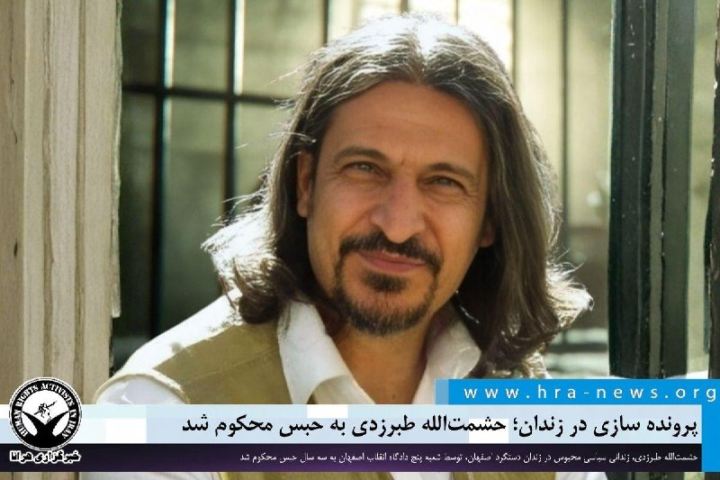

پرونده سازی در زندان؛ حشمت‌الله طبرزدی به ۳ سال حبس محکوم شد

❗️
❗️
❗️
❗️
❗️– حشمت‌الله طبرزدی، زندانی سیاسی محبوس در زندان دستگرد اصفهان، در خصوص پرونده ای که در طول دوران حبس علیه وی گشوده شده است، توسط شعبه پنج دادگاه انقلاب اصفهان به سه سال حبس محکوم شد.

به گزارش خبرگزاری هرانا، ارگان خبری مجموعه فعالان حقوق بشر در ایران، حشمت‌الله طبرزدی به حبس محکوم شد.

بر اساس حکمی که توسط شعبه پنج دادگاه انقلاب اصفهان به ریاست قاضی شاهینی صادر و روز شنبه ۲ خردادماه به آقای طبرزدی ابلاغ شده، وی از بابت اتهامات تبلیغ علیه نظام و توهین به رهبری مجموعا به سه سال حبس محکوم شده است. این شعبه او را از اتهام تشویش و تحریک به خشونت و کشتار تبرئه کرده است.

ادامه مطلب

#حشمت‌الله_طبرزدی

↘️
@hranews_bot تماس ✉️ -  @Hranews  کانال هرانا 🆑

## alonews — post 122739

  <a href="telegram/content/alonews_122739_1779782990.webm" target="_blank">🎬 Download video</a>

👈نت‌بلاکس آپدیت جدیدی از وضعیت اینترنت بین‌الملل ایران منتشر کرد 
✅ @AloNews خبر جنگ

## alonews — post 122738

  <a href="telegram/content/alonews_122738_1779782990.webm" target="_blank">🎬 Download video</a>

👈سپاه اصفهان: تا ساعت ۱۳ امروز احتمال شنیده‌شدن صدای انفجارهای کنترل‌شده در محدودهٔ جنوب شهر اصفهان وجود دارد.

✅ @AloNews خبر جنگ

## alonews — post 122737

  <a href="telegram/content/alonews_122737_1779782990.webm" target="_blank">🎬 Download video</a>

👈واکنش سخنگوی دولت به پلمب برخی هتل‌ها و کافه به دلیل مساله حجاب: رویکرد دولت، رویکرد پذیرش همه مردم است؛ همان‌گونه که در طول این ۹۰ روز این اتفاق افتاده است. مردم ایران می‌دانند که دولت قصد حذف یا کنار گذاشتن هیچ گروهی را ندارد،‌ موضوع در دست بررسی است.

✅ @AloNews خبر جنگ

## alonews — post 122736

  <a href="telegram/content/alonews_122736_1779782990.webm" target="_blank">🎬 Download video</a>

👈 مارکو روبیو در مورد تنگه هرمز: «روس‌ها با سیستم عوارضی موافق نیستند، چینی‌ها هم با سیستم عوارضی موافق نیستند. منظورم این است که هیچ کشوری در جهان از سیستم عوارضی حمایت نمی‌کند، به جز ایران.

🔴بنابراین، این غیرقابل قبول است. یعنی چنین چیزی نمی‌تواند اتفاق بیفتد. تنگه باید باز، بدون مانع و بدون عوارض باشد، و بدیهی است که این کار باید بلافاصله، به محض توافق بر سر هر چیزی، انجام شود.»

✅ @AloNews خبر جنگ

## alonews — post 122735

  <a href="telegram/content/alonews_122735_1779782991.webm" target="_blank">🎬 Download video</a>

👈نت‌بلاکس آپدیت جدیدی از وضعیت اینترنت بین‌الملل ایران منتشر کرد

✅ @AloNews خبر جنگ

## alonews — post 122734

  <a href="telegram/content/alonews_122734_1779782991.webm" target="_blank">🎬 Download video</a>

👈 سپاه : دیروز یک پهپاد آمریکایی MQ9 را پس از رصد دقیق اطلاعاتی ساقط کردیم.

🔴 با شلیک به پهپاد RQ4 و جنگنده F35 متجاوز، دشمن رو فراری دادیم و از حریم ایران بیرون کردیم.

🔴حق پاسخ به حمله دیشب امریکایی رو برای خود محفوظ نگه میداریم

✅ @AloNews خبر جنگ

## alonews — post 122733

  <a href="telegram/content/alonews_122733_1779782991.webm" target="_blank">🎬 Download video</a>

👈وزیر ارتباطات: با دستور رئیس‌جمهوری و پس از برگزاری ۳ جلسه فشرده کارشناسی، فرایند بازگرداندن اینترنت کشور به وضعیت قبل از دی‌ماه ۱۴۰۴ آغاز شده است

✅ @AloNews خبر جنگ

## alonews — post 122732

  <a href="telegram/content/alonews_122732_1779782991.webm" target="_blank">🎬 Download video</a>

👈رویترز: استرالیا، هند، ژاپن و ایالات متحده با وضع عوارض ترانزیت در آب‌های بین‌المللی مخالفند

✅ @AloNews خبر جنگ

## alonews — post 122731

  <a href="telegram/content/alonews_122731_1779782991.webm" target="_blank">🎬 Download video</a>

👈سخنگوی دولت: بازگشایی اینترنت توسط رئیس جمهور به وزارت ارتباطات ابلاغ شد

✅ @AloNews خبر جنگ

## alonews — post 122730

  <a href="telegram/content/alonews_122730_1779782991.webm" target="_blank">🎬 Download video</a>

👈مارکو روبیو درباره ایران: فکر می‌کنم هماهنگی و توافق قوی درباره اینکه پیش‌نویس اولیه باید چگونه باشد وجود دارد.

🔴فکر می‌کنم، مانند هر چیز دیگری با چنین موضوعی، چند روز طول می‌کشد تا همه چیز تثبیت شود، حتی تا حد اختلاف نظر بر سر یک کلمه یا یک جمله.

🔴یا این یک توافق خوب خواهد بود یا اصلاً توافقی صورت نخواهد گرفت

✅ @AloNews خبر جنگ

## alonews — post 122729

  <a href="telegram/content/alonews_122729_1779782992.webm" target="_blank">🎬 Download video</a>

👈پزشکیان: هر تصمیمی که برای کشور اتخاذ می‌شود باید مبتنی بر شرایط واقعی جامعه و در نظر گرفتن وضعیت معیشتی و روانی مردم باشد.

🔴اگر جبهه داخلی تضعیف شود و مردم در سیاست‌گذاری‌ها مورد توجه قرار نگیرند، تحقق اهداف ملی در شرایط جنگی نیز با دشواری مواجه خواهد شد؛ چراکه این مردم هستند که ستون اصلی پایداری کشور را تشکیل می‌دهند.

🔴وحدت و انسجام داخلی مهم‌تر از هر موضوع دیگری است که باید بر روی آن کار شود و معنای وحدت نیز صرفاً در شعار خلاصه نمی‌شود، بلکه مستلزم تحمل دیدگاه‌های مختلف، شنیدن صدای جامعه، در نظر گرفتن مطالبات اقشار مختلف و تلاش برای بازگرداندن مردم به شرایط عادی زندگی، کسب‌وکار و معیشت عزتمندانه است.

🔴یکی از اصلی‌ترین اهداف دشمن، ایجاد شکاف میان مسئولان و تضعیف انسجام مدیریتی کشور است و دولت تلاش دارد از هرگونه دوقطبی‌سازی و انتقال پیام اختلاف و تقابل جلوگیری کند.

🔴از نیروهای مسلح به دلیل پایبندی به مأموریت‌های حرفه‌ای و پرهیز از ورود به مسائل سیاسی و جناحی قدردانی می‌کنم

🔴 این رویکرد حرفه‌ای، مسئولانه و مبتنی بر مصالح ملی، سرمایه‌ای ارزشمند برای کشور و نظام محسوب می‌شود

✅ @AloNews خبر جنگ

## alonews — post 122728

  <a href="telegram/content/alonews_122728_1779782992.webm" target="_blank">🎬 Download video</a>

👈مقامات آمریکا به الجزیره : ایرانی‌ها تو ۲۴ ساعت گذشته چندین بار تلاش کردن به نیروهای آمریکایی حمله کنن

✅ @AloNews خبر جنگ

## alonews — post 122727

  <a href="telegram/content/alonews_122727_1779782992.webm" target="_blank">🎬 Download video</a>

👈هاشمی؛وزیر قطع ارتباطات: بازگشایی اینترنت به وضعیت قبل دی ماه در حال اجرا هست

✅ @AloNews خبر جنگ

## alonews — post 122726

  <a href="telegram/content/alonews_122726_1779782992.webm" target="_blank">🎬 Download video</a>

👈گویا ساعاتی است جیمیل در دسترس کاربران ایران قرار گرفته

✅ @AloNews خبر جنگ

## alonews — post 122725

  <a href="telegram/content/alonews_122725_1779782992.webm" target="_blank">🎬 Download video</a>

👈سیتنا: آزاد سازی اینترنت به تعویق افتاد

✅ @AloNews خبر جنگ

## alonews — post 122724

  <a href="telegram/content/alonews_122724_1779782992.webm" target="_blank">🎬 Download video</a>

👈 سردار شکارچی: اگر از صادرات ایران جلوگیری شود، جمهوری اسلامی ایران از خروج نفت از منطقه جلوگیری خواهد کرد

✅ @AloNews خبر جنگ

## alonews — post 122723

  <a href="telegram/content/alonews_122723_1779782992.webm" target="_blank">🎬 Download video</a>

👈وزارت خارجه پاکستان: چین از تلاش‌های پاکستان در تسهیل آتش‌بس بین واشنگتن و تهران قدردانی می‌کند.

🔴چین و پاکستان بر اجرای ابتکار پنج ماده‌ای برای بازگرداندن ثبات در خاورمیانه تأکید کردند.

🔴چین و پاکستان آمادگی خود را برای مشارکت مثبت مشترک به منظور بازگرداندن صلح در منطقه اعلام نمودند.

✅ @AloNews خبر جنگ

## alonews — post 122722

  <a href="telegram/content/alonews_122722_1779782993.webm" target="_blank">🎬 Download video</a>

👈کانال ۱۳ اسرائیل: جلسه کابینه داخلی امروز در پی تشدید تنش‌ها در لبنان و توافق احتمالی با ایران برگزار می‌شود.

✅ @AloNews خبر جنگ

## alonews — post 122721

  <a href="telegram/content/alonews_122721_1779782993.webm" target="_blank">🎬 Download video</a>

👈العربی الجديد به نقل از منبع نزدیک به حزب‌الله لبنان: تهدیدات اسرائیل ما را به عقب‌نشینی وادار نخواهد کرد و موقعیت ما دفاعی باقی خواهد ماند

🔴 هرگونه تشدید نظامی با پاسخ مناسب مواجه خواهد شد

🔴 تشدید اسرائیل و نادیده گرفتن همه توافقات، دولت لبنان را ملزم به عقب‌نشینی از مذاکره مستقیم می‌کند

🔴 ما تحت هیچ شرایط آمریکایی یا اسرائیلی تسلیم نخواهیم شد

✅ @AloNews خبر جنگ

## alonews — post 122720

  <a href="telegram/content/alonews_122720_1779782993.webm" target="_blank">🎬 Download video</a>

👈شاخص کل بورس تهران پس از ۱۰۲ روز به کانال ۴ میلیون واحد بازگشت

✅ @AloNews خبر جنگ

---
📅 بروزرسانی: 1405/03/05 07:38
---

## VahidOOnLine — post 242218

  

گروه جهانی بی‌تی‌اس در مراسم امسال جوایز موسیقی آمریکا در لاس‌وگاس، برنده جایزه هنرمند سال شد. این گروه برای کسب عنوان هنرمند سال با هنرمندان مطرحی چون بد بانی، برونو مارس، تیلور سوییفت، هری استایلز، لیدی گاگا، جاستین بیبر، کندریک لامار، مورگان والن و سابرینا کارپنتر رقابت کرد.
این دومین بار است که بی‌تی‌اس این جایزه را دریافت می‌کند. آن‌ها نخستین بار در سال ۲۰۲۱ برنده این جایزه شدند و این اولین باری بود که هنرمندان آسیایی در این مراسم که بر اساس رای هواداران برگزار می‌شود، برنده می‌شد.
اعضای گروه شامل آر‌ام، جین، شوگا، جی‌هوپ، جیمین، وی و جونگ کوک همگی برای دریافت جایزه در مراسم حضور داشتند. آن‌ها به‌تازگی دومین اجرای خود از چهار شب کنسرت پیاپی و کاملا فروخته‌شده در ورزشگاه الیجنت در لاس‌وگاس را به پایان رسانده بودند.
این گروه از هواداران خود که با نام «آرمی» شناخته می‌شوند، قدردانی کرد. آر‌ام در سخنرانی خود به جمعیت تشویق‌کننده گفت: «افتخار بزرگی است که پس از پایان خدمت نظامی همه اعضا، بار دیگر این جایزه ارزشمند را دریافت می‌کنیم.»

‌🏁 🇬🇧 IranintlTV

🤖 @VahidOOnLine

## VahidOOnLine — post 242217

  

♦️به گزارش خبرگزاری فرانسه، مارکو روبیو، وزیر امور خارجه ایالات متحده، روز سه‌شنبه با تاکید بر بازگشایی تنگه هرمز که در حال حاضر تحت محاصره است، اعلام کرد که این آبراه حیاتی «به هر طریقی» باز خواهد شد. این اظهارات در حالی مطرح می‌شود که درگیری دوشنبه‌شب واشنگتن و تهران، توافق احتمالی برای پایان دادن به جنگ خاورمیانه را در هاله‌ای از ابهام قرار داده است.
روبیو در جریان سفر رسمی خود به شهر جایپور هند، در گفتگو با خبرنگاران گفت: «تنگه باید باز شود؛ این اتفاق به هر طریقی رخ خواهد داد، بنابراین آن باید بازگشایی شود.» او در ادامه افزود: «آنچه در آنجا رخ می‌دهد غیرقانونی، نامشروع و برای جهان غیرقابل تحمل و غیرقابل قبول است.»
‌🇸🇦 Indypersian

🤖 @VahidOOnLine

## VahidOOnLine — post 242216

  

♦️خبرگزاری تسنیم گزارش داد هیات‌رییسه فدراسیون فوتبال روز دوشنبه چهار خرداد، پرداخت ۲۵۰ میلیارد تومان پاداش برای بازیکنان، مربیان و سایر اعضای تیم ملی فوتبال ایران بابت صعود به جام جهانی ۲۰۲۶ را تصویب کرده است.

بر اساس این گزارش، این مبلغ میان تمامی اعضای تیم ملی تقسیم خواهد شد و قرار است از محل مطالبات فدراسیون فوتبال از فیفا تامین شود.

تسنیم نوشت در جلسه هیات‌رییسه، ابتدا رقم بالاتری برای پاداش صعود به جام جهانی مطرح شده بود، اما در نهایت اعضا با پرداخت ۲۵۰ میلیارد تومان موافقت کردند.
‌🇸🇦 Indypersian

🤖 @VahidOOnLine

## VahidOOnLine — post 242215

  

♦️به دنبال افزایش دوباره قیمت لبنیات، قیمت مصوب شیر بطری به ۹۸ هزار تومان و قیمت ماست دبه‌ای (۲ کیلویی) به دست‌کم ۲۲۸ هزار و ۷۰۰ تومان رسیده است. این در حالی است که در فروشگاه‌‌های آنلاین و سوپر‌ها، قیمت لبنیات بسیار بیشتر است. برای مثال شیر پرچرب یک لیتری میهن در فروشگاه‌های آنلاین دست‌کم ۱۳۰ هزار تومان فروخته می‌شود و پنیر نیم کیلویی روزانه ۲۸۳ هزار تومان قیمت دارد.کره ۱۰۰ گرمی دامداران ۹۲ هزار و ۶۰۰ تومان و بستنی وانیلی دومینو (۲ لیتری) ۴۷۵ هزار تومان به فروش می‌رسد. قیمت ماست ۹۰۰ گرمی کاله نیز در فروشگاه‌های آنلاین ۲۴۸ هزار تومان است. افزایش شدید قیمت‌ها به حذف با محدودیت مصرف لبنیات در بین خانوارهای ایرانی منجر شده است که تاثیرات آن بر سلامتی مردم به ویژه کودکان و نوجوانان در سال‌های پیش‌رو نمایان خواهد شد. این در حالی است که گوشت نیز برای بسیار از خانواده‌ها دست نیافتنی شده است.
‌🇸🇦 Indypersian

🤖 @VahidOOnLine

## VahidOOnLine — post 242214

  

مارکو روبیو، وزیر خارجه آمریکا، در واکنش به حمله روز دوشنبه ایالات‌متحده به اهداف ایرانی گفت: «تنگه‌ها باید باز بمانند و به هر شکلی باز خواهند ماند.» او درباره مذاکرات حکومت ایران در قطر گفت چانه‌زنی بر سر متن اولیه توافق ادامه دارد و نهایی‌کردن زبان توافق ممکن است چند روز طول بکشد.
‌🏁 🇬🇧 IranintlTV

🤖 @VahidOOnLine

## VahidOOnLine — post 242213

  <a href="telegram/content/VahidOOnLine_242213_1779768531.mp4" target="_blank">🎬 Download video</a>

♦️امیره حشوی، ملکه زیبایی لبنانی‌تبار اهل دیربورن‌ هایتس ایالت میشیگان که در تاریخ ۱۰ اوت ۲۰۲۵ با کسب عنوان «ملکه زیبایی شهرستان وین» (Miss Wayne County) در ایالت میشیگان، به عنوان نخستین زن محجبه در تاریخ مسابقات سازمان «دوشیزه آمریکا» تاج بر سر گذاشت در رژه صد‌مین سالگرد روز یادبود در شهر دیربورن شرکت کرد. او در این ویدیو تاج ملکه زیبایی را روی روسری گذاشته است. دیربورن یکی از بالاترین تمرکزهای جمعیت عرب‌ و مسلمان در آمریکا را دارد و در برخی برآوردها جمعیت عرب‌تبار این منطقه حدود ۴۰ درصد کل جمعیت برآورد می‌شود. به‌طور کلی ایالت میشیگان نیز یکی از بزرگترین و قدیمی‌ترین جمعیت‌های مسلمان و عرب را در آمریکا دارد.
‌🇸🇦 Indypersian

🤖 @VahidOOnLine

## VahidOOnLine — post 242212

  

♦️مشاهده‌های میدانی در سواحل بوشهر و هرمزگان نشان می‌دهد افزایش گردشگری و تخریب زیستگاه‌های حساس، به‌ویژه در جزیره هنگام، لاک‌پشت پوزه‌عقابی را که در فهرست گونه‌های «به‌شدت در معرض انقراض» قرار دارد، با تهدیدهای جدی روبه‌رو کرده است.

لاک‌پشت پوزه‌عقابی، از گونه‌های ارزشمند و در حال انقراض دریایی جهان، سواحل جنوبی ایران را به‌عنوان یکی از زیستگاه‌های اصلی تخم‌گذاری و زادآوری انتخاب کرده، اما توسعه بی‌ضابطه گردشگری، تخریب زیستگاه‌ها و آلودگی نوری، چرخه زادآوری این گونه را با خطر روبه‌رو کرده است.
مجید عسگری، مسئول پروژه حفاظت از لاک‌پشت پوزه‌عقابی در بوشهر و هرمزگان، به «همشهری‌آنلاین» گفت روند پایش این گونه در بوشهر از سال ۱۳۹۴ به‌طور مستمر انجام شده، اما در هرمزگان پایش‌ها مقطعی و محدود بوده است.

او با اشاره به نتایج ثبت‌شده در جزیره هنگام گفت تعداد لاک‌پشت‌های ثبت‌شده از ۷۱ مورد در سال ۱۳۹۹ به ۴۳ مورد در سال ۱۴۰۴ کاهش یافته است. به گفته عسگری، افزایش حضور گردشگران در فصل تخم‌گذاری، کمپ‌زدن در سواحل حساس، تخریب زیستگاه‌ها و کاهش نظارت اجرایی از مهم‌ترین دلایل این کاهش است.

عسگری گفت در برخی سال‌ها لاک‌پشت‌ها چندین بار به ساحل بازگشتند، اما به‌دلیل فرسایش سواحل و نبود عمق مناسب شن، موفق به لانه‌سازی و تخم‌گذاری نشدند.

او جزیره شیب‌دراز در قشم را نمونه موفق گردشگری کنترل‌شده دانست و گفت مدیریت متمرکز و مشارکت جامعه محلی باعث شده آسیب کمتری به زیستگاه‌های تخم‌گذاری وارد شود.

به گفته مسئول پروژه حفاظت از لاک‌پشت پوزه‌عقابی، در استان بوشهر روند تخم‌گذاری این گونه در سال‌های اخیر افزایش ملایمی داشته و در سال ۱۴۰۴ حدود ۳۴۷ لاک‌پشت در سواحل این استان ثبت شده‌اند.

عسگری همچنین گفت به‌دلیل محدودیت‌های مالی و اجرایی، پایش مستمر در برخی جزایر هرمزگان از جمله کیش، سیری، ابوموسی و فارور انجام نشده و همین موضوع ارائه آمار دقیق از جمعیت این گونه را دشوار کرده است.

او تاکید کرد حفاظت از سواحل شنی، کنترل گردشگری بی‌ضابطه، کاهش آلودگی نوری و مشارکت جوامع محلی، مهم‌ترین راهکارهای حفظ زیستگاه‌های لاک‌پشت پوزه‌عقابی در سواحل جنوبی ایران است.
‌🇸🇦 Indypersian

🤖 @VahidOOnLine

## VahidOOnLine — post 242211

  

سخنگوی وزارت خارجه قطر گزارش‌ها درباره پیشنهاد دوحه برای آزادسازی ۱۲ میلیارد دلار دارایی‌های تهران در راستای دستیابی به توافق با آمریکا را تکذیب و این ادعاها را تلاشی برای تخریب دیپلماسی کنونی توصیف کرد.
ماجد الانصاری، سخنگوی وزارت خارجه قطر، در ایکس نوشت: «گزارش‌هایی که می‌گویند قطر ۱۲ میلیارد دلار به ایران پیشنهاد داده تا توافقی را تضمین کند، درست نیست.»
او گفت این ادعاها از سوی طرف‌هایی منتشر می‌شود که در پی تضعیف «تلاش‌های دیپلماتیک کنونی برای ثبات و کاهش تنش منطقه‌ای» هستند.
الانصاری افزود نقش میانجی‌گری قطر در کنار شرکای منطقه‌ای «به‌خوبی تثبیت شده و به‌صورت عمومی مستند شده است» و این گزارش‌ها تلاشی برای آسیب زدن به اعتبار دوحه به‌عنوان «تسهیل‌کننده مورد اعتماد بین‌المللی صلح» است.

‌🏁 🇬🇧 IranintlTV

🤖 @VahidOOnLine

## VahidOOnLine — post 242202

بعضی خانه‌ها بعد از ۱۸ و ۱۹ دی دیگر شبیه قبل نشدند.
یک صندلی خالی ماند، یک تلفن دیگر جواب داده نشد و خانواده‌هایی ماندند با تصویری که آخرین‌بار از عزیزشان دیده بودند.<
میلاد حاجیوند عبداللهی، ساسان کشوری، محمد رفیعی، بنیامین علیزاده، امید احمدی، احمدرضا خیری‌زاد، فاطمه علی‌محمدی و سعید صادقی حسنوند؛
جوانانی با زندگی‌های معمولی، با کار، دانشگاه، ورزش، عشق و هزار برنامه برای ادامه راه.<
اما خیابان‌های آن روزها، برای بسیاری به آخر زندگی تبدیل شد؛ با گلوله جنگی، خونریزی، ضرب‌وجرح و پیکرهایی که بعضی خانواده‌ها با تهدید و فشار تحویل گرفتند.<
این روایت‌ها کوتاه نوشته می‌شوند تا نام‌ها در حافظه‌مان بماند و فراموش نشود چه بر جوانان ایران گذشت.<
#جاویدنامان_انقلاب_ملی_ایرانیان
‌🏁 🇬🇧 IranintlTV

🤖 @VahidOOnLine

## VahidOOnLine — post 242201

♦️موسسه آتشفشان‌شناسی و لرزه‌نگاری فیلیپین اعلام کرد یک شهاب‌سنگ دوشنبه‌شب چهارم خرداد، هم‌زمان با فوران آتشفشان «مایون» در استان آلبای فیلیپین از کنار این آتشفشان عبور کرده و آسمان منطقه را روشن کرده است.

ویدیوی منتشرشده از سوی این موسسه نشان می‌دهد شی نورانی در حالی از نزدیکی آتشفشان مایون، یکی از فعال‌ترین آتشفشان‌های فیلیپین، عبور می‌کند.
بر اساس این گزارش، این رویداد ساعت ۲۲:۳۳ به وقت محلی ثبت شده و دوربین «لیگنون هیل» آن را ضبط کرده است.

این موسسه ابتدا اعلام کرده بود شهاب‌سنگ به دامنه شمالی آتشفشان برخورد کرده، اما بعدتر با استناد به داده‌های لرزه‌ای، امواج فروصوت و تصاویر دوربین‌های دیگر، توضیح داد این جرم هنگام ورود به جو متلاشی شده و به آتشفشان برخورد نکرده است.
‌🇸🇦 Indypersian

🤖 @VahidOOnLine

## FoxNewsTwitter — post 342256

  <a href="telegram/content/FoxNewsTwitter_342256_1779768534.mp4" target="_blank">🎬 Download video</a>

Fox News (Twitter/X)

At one of America’s most sacred places, Gretchen Wilson delivered a Memorial Day performance that brought the crowd to a standstill.

Wilson sang “God Bless America” during Freedom 250’s ceremony at Arlington National Cemetery, with veterans and military families gathered in tribute.

The emotional performance served as a reminder of the sacrifice behind the holiday.

## FoxNewsTwitter — post 342255

  

Fox News (Twitter/X)

WATCH LIVE: Freedom 250 hosts candlelight Memorial Day observance at Arlington National Cemetery https://twitter.com/i/broadcasts/1oJMvvNNppkxQ

## mamlekate — post 103585

📝 مارکو روبیو درباره مذاکرات با جمهوری اسلامی: امروز گفت‌وگوهایی در قطر جریان داشت

مارکو روبیو، وزیر امورخارجه آمریکا، روز سه‌شنبه در جریان سفر رسمی خود به هند به خبرنگاران گفت: «امروز گفت‌وگوهایی در قطر در جریان بود، بنابراین خواهیم دید که آیا می‌توانیم پیشرفتی داشته باشیم یا خیر.»

📝 واشنگتن در پی فرمولی برای حذف ذخایر اورانیوم ایران بدون انتقال به آمریکا

به گزارش نیویورک پست، مقام‌های آمریکایی در حال بررسی روش‌هایی هستند که ایران بتواند ذخایر اورانیوم با غنای بالا را بدون تحویل مستقیم به واشنگتن از بین ببرد.

📝 چارچوب سه‌مرحله‌ای توافق: بازگشایی هرمز، نابودی اورانیوم، کاهش محاصره و سپس مذاکره بر سر شرایط مذاکره صلح

@mamlekate

## mamlekate — post 103584

📝 سنتکام: به چند سایت پرتاب موشک و قایق در جنوب ایران حمله کردیم

ارتش آمريکا اعلام کرد حملات تازه‌ای را به جنوب ايران انجام داده و سايت‌های موشکی ايران و قايق‌هايی را که «در تلاش برای مين‌گذاری» بودند، هدف قرار داده است.

@mamlekate

## VahidOnline — post 75720

  

وزارت خارجه آمریکا اواخر دوشنبه به وقت واشنگتن گفت مارکو روبیو وزیر امور خارجه، به در خواست همتای روس خود سرگئی لاوروف، با او صحبت کرد. در این تماس تلفنی، دو وزیر درباره جنگ روسیه و اوکراین، روابط دوجانبه و اوضاع ایران صحبت کردند.
@VahidHeadline

📡 @VahidOnline

## VahidOnline — post 75719

  

realDonaldTrump

📡 @VahidOnline

## kianmeli1 — post 87670

  

🔴گزارش‌هایی که حاکی از «پیشنهاد» ۱۲ میلیارد دلاری قطر به ایران برای تضمین یک توافق است، به هیچ وجه صحت ندارند و توسط طرف‌هایی منتشر می‌شوند که سعی در تخریب توافق و تضعیف تلاش‌های دیپلماتیک جاری برای کاهش تنش و ثبات منطقه‌ای دارند.

نقش دیپلماتیک قطر، در هماهنگی با شرکای منطقه‌ای، به خوبی تثبیت شده و به طور عمومی مستند شده است و چنین روایت‌هایی چیزی بیش از تلاش‌های ناامیدانه برای خدشه‌دار کردن اعتبار قطر به عنوان یک تسهیل‌کننده صلح بین‌المللی مورد اعتماد نیست.
https://t.me/kianmeli1

## IranIntlTV — post 339019

  

گروه جهانی بی‌تی‌اس در مراسم امسال جوایز موسیقی آمریکا در لاس‌وگاس، برنده جایزه هنرمند سال شد. این گروه برای کسب عنوان هنرمند سال با هنرمندان مطرحی چون بد بانی، برونو مارس، تیلور سوییفت، هری استایلز، لیدی گاگا، جاستین بیبر، کندریک لامار، مورگان والن و سابرینا کارپنتر رقابت کرد.
این دومین بار است که بی‌تی‌اس این جایزه را دریافت می‌کند. آن‌ها نخستین بار در سال ۲۰۲۱ برنده این جایزه شدند و این اولین باری بود که هنرمندان آسیایی در این مراسم که بر اساس رای هواداران برگزار می‌شود، برنده می‌شد.
اعضای گروه شامل آر‌ام، جین، شوگا، جی‌هوپ، جیمین، وی و جونگ کوک همگی برای دریافت جایزه در مراسم حضور داشتند. آن‌ها به‌تازگی دومین اجرای خود از چهار شب کنسرت پیاپی و کاملا فروخته‌شده در ورزشگاه الیجنت در لاس‌وگاس را به پایان رسانده بودند.
این گروه از هواداران خود که با نام «آرمی» شناخته می‌شوند، قدردانی کرد. آر‌ام در سخنرانی خود به جمعیت تشویق‌کننده گفت: «افتخار بزرگی است که پس از پایان خدمت نظامی همه اعضا، بار دیگر این جایزه ارزشمند را دریافت می‌کنیم.»

https://iranintl.com/202605266357

## IranIntlTV — post 339018

  

مارکو روبیو، وزیر خارجه آمریکا، در واکنش به حمله روز دوشنبه ایالات‌متحده به اهداف ایرانی گفت: «تنگه‌ها باید باز بمانند و به هر شکلی باز خواهند ماند.» او درباره مذاکرات حکومت ایران در قطر گفت چانه‌زنی بر سر متن اولیه توافق ادامه دارد و نهایی‌کردن زبان توافق ممکن است چند روز طول بکشد.
https://iranintl.com/202605261875

## IranIntlTV — post 339017

  

سخنگوی وزارت خارجه قطر گزارش‌ها درباره پیشنهاد دوحه برای آزادسازی ۱۲ میلیارد دلار دارایی‌های تهران در راستای دستیابی به توافق با آمریکا را تکذیب و این ادعاها را تلاشی برای تخریب دیپلماسی کنونی توصیف کرد.
ماجد الانصاری، سخنگوی وزارت خارجه قطر، در ایکس نوشت: «گزارش‌هایی که می‌گویند قطر ۱۲ میلیارد دلار به ایران پیشنهاد داده تا توافقی را تضمین کند، درست نیست.»
او گفت این ادعاها از سوی طرف‌هایی منتشر می‌شود که در پی تضعیف «تلاش‌های دیپلماتیک کنونی برای ثبات و کاهش تنش منطقه‌ای» هستند.
الانصاری افزود نقش میانجی‌گری قطر در کنار شرکای منطقه‌ای «به‌خوبی تثبیت شده و به‌صورت عمومی مستند شده است» و این گزارش‌ها تلاشی برای آسیب زدن به اعتبار دوحه به‌عنوان «تسهیل‌کننده مورد اعتماد بین‌المللی صلح» است.

https://iranintl.com/202605269986

## IranIntlTV — post 339016

  <a href="telegram/content/IranIntlTV_339016_1779768539.mp4" target="_blank">🎬 Download video</a>

یک شهروند در ویدیویی که در شبکه‌های اجتماعی منتشر شده، به وضعیت شغلی خود اشاره کرده و از اقدامات و تصمیمات حکومت انتقاد می‌کند. او می‌گوید: «جمهوری اسلامی دائم از توافق و آتش‌بس سخن می‌گوید، اما درباره تعطیلی کارخانه‌ها حرفی نمی‌زند.»

گزارش‌های منتشر‌شده نشان می‌دهد فشار اقتصادی و ناامنی شغلی شهروندان تشدید شده است.
@iranintltv

## IranIntlTV — post 339007

بعضی خانه‌ها بعد از ۱۸ و ۱۹ دی دیگر شبیه قبل نشدند.
یک صندلی خالی ماند، یک تلفن دیگر جواب داده نشد و خانواده‌هایی ماندند با تصویری که آخرین‌بار از عزیزشان دیده بودند.
میلاد حاجیوند عبداللهی، ساسان کشوری، محمد رفیعی، بنیامین علیزاده، امید احمدی، احمدرضا خیری‌زاد، فاطمه علی‌محمدی و سعید صادقی حسنوند؛
جوانانی با زندگی‌های معمولی، با کار، دانشگاه، ورزش، عشق و هزار برنامه برای ادامه راه.
اما خیابان‌های آن روزها، برای بسیاری به آخر زندگی تبدیل شد؛ با گلوله جنگی، خونریزی، ضرب‌وجرح و پیکرهایی که بعضی خانواده‌ها با تهدید و فشار تحویل گرفتند.
این روایت‌ها کوتاه نوشته می‌شوند تا نام‌ها در حافظه‌مان بماند و فراموش نشود چه بر جوانان ایران گذشت.
#جاویدنامان_انقلاب_ملی_ایرانیان

## FarsiVOA — post 218670

🔺مارکو روبیو درباره مذاکرات با جمهوری اسلامی: امروز گفت‌وگوهایی در قطر جریان داشت

▪️مارکو روبیو، وزیر امورخارجه آمریکا، روز سه‌شنبه ۵ خرداد در جریان سفر رسمی خود به هند به خبرنگاران گفت: «امروز گفت‌وگوهایی در قطر در جریان بود، بنابراین خواهیم دید که آیا می‌توانیم پیشرفتی داشته باشیم یا خیر.»

⬇️ بیشتر بخوانید:
https://ir.voanews.com/a/8153982.html
@FarsiVOA

## FarsiVOA — post 218669

  

⚡️وزارت خارجه آمریکا اواخر دوشنبه به وقت واشنگتن گفت مارکو روبیو وزیر امور خارجه، به در خواست همتای روس خود سرگئی لاوروف، با او صحبت کرد. در این تماس تلفنی، دو وزیر درباره جنگ روسیه و اوکراین، روابط دوجانبه و اوضاع ایران صحبت کردند.

@FarsiVOA

## FarsiVOA — post 218668

🔺اسرائيل به بیش از ۷۰ زیرساخت حزب‌الله در لبنان حمله کرد و شماری از اعضای آن را کشت

▪️ارتش اسرائيل روز دوشنبه ۴ خرداد اعلام کرد که در چندین رشته عملیات در سراسر لبنان، بیش از ۷۰ موضع زیرساختی گروه تروریستی حزب‌الله را هدف قرار گرفت.

⬇️ بیشتر بخوانید:
https://ir.voanews.com/a/8153978.html
@FarsiVOA

## FarsiVOA — post 218667

⚡️صدای موافقان و منتقدان کنگره آمریکا در سایه احتمال توافق با جمهوری اسلامی
@FarsiVOA

## FarsiVOA — post 218666

⚡️تنگه هرمز و بحران کمک‌های غذایی و تجارت افغانستان زیر فشار جنگ و گرانی
@FarsiVOA

## FarsiVOA — post 218665

  

⚡️دونالد ترامپ، رئيس جمهوری آمریکا با انتشار این گرافیک اقدام نظامی خود علیه جمهوری اسلامی را با سیاست باراک اوباما، رئیس جمهوری سابق آمریکا مقایسه کرد که در این تصویر فرستادن پول نقد است.
@FarsiVOA

## FarsiVOA — post 218664

⚡️آخرین تحولات عراق؛ بغداد اعضای بازداشت‌شده داعش با تابعیت ترکیه را به آنکارا تحویل می‌دهد
@FarsiVOA

## FarsiVOA — post 218663

⚡️کارزار سرکوب در سایه قطع اینترنت در ایران؛ هر ۴۸ ساعت یک چوبه دار
@FarsiVOA

## FarsiVOA — post 218662

⚡️نگاهی به جهان‌بینی کریستیان مونجیو، فیلمساز رومانیایی که با فیورد در کن ۲۰۲۶ برای دومین بارپس از نخل تاریخی چهار ماه، سه هفته و دو روز در سال ۲۰۰۷، نخل طلا گرفت
@FarsiVOA

## FarsiVOA — post 218661

⚡️آیا ابولا می‌تواند به آمریکا برسد؟ مقام‌های بهداشتی می‌گویند خطر فعلاً پایین است، اما غربالگری مسافران در برخی فرودگاه‌ها گسترش یافته است. کارشناسان هشدار می‌دهند که ضعف در کنترل بیماری‌ها در هر نقطه از جهان می‌تواند پیامدهای جهانی داشته باشد.
@FarsiVOA

## Persian_Trend_Official — post 15028

  

صبحتون بخیر ☕️🤍

📝 Nick
📌 @persian_trend_official
پرشین ترند | متفاوت‌ترین کانال نظامی

## Persian_Trend_Official — post 15027

  

⭕️پست جدید دونالد ترامپ

پ ن: آیا هنوز عقیده دارید ترامپ پولی به جمهوری اسلامی پرداخت خواهد داد؟

🫆:Tony

📌 @persian_trend_official
پرشین ترند | متفاوت‌ترین کانال نظامی

## Persian_Trend_Official — post 15026

  <a href="telegram/content/Persian_Trend_Official_15026_1779768540.webm" target="_blank">🎬 Download video</a>

🔴 مقام آمریکایی: حملات در ایران «دفاعی» بوده است

▪️ یک مقام آمریکایی اعلام کرده حملات اخیر در ایران جنبه دفاعی داشته و به معنای پایان آتش‌بس نیست
▪️ به گفته او، یک سایت سام (پدافند موشکی زمین به هوا) در بندرعباس هدف قرار گرفته است
▪️ این مقام مدعی شده این اقدام پس از تهدید یا هدف قرار گرفتن جنگنده‌های آمریکایی انجام شده است

▪️ تاکنون هیچ تأیید مستقلی از سوی ایران درباره این ادعاها منتشر نشده است
▪️ وضعیت منطقه همچنان در سطح بالای تنش و ابهام قرار دارد

🫆:Tony

📌 @persian_trend_official
پرشین ترند | متفاوت‌ترین کانال نظامی

## Persian_Trend_Official — post 15025

  

⭕️روبیو به ارمنستان می رود

▪️سفارت آمریکا در ایروان اعلام کرد که مارکو روبیو روز سه‌شنبه برای دیدارهایی با محوریت دیپلماسی و روابط دوجانبه به ارمنستان سفر خواهد کرد.

🫆:Tony

📌 @persian_trend_official
پرشین ترند | متفاوت‌ترین کانال نظامی

## RadioFarda — post 157554

  <a href="https://t.me/radiofarda/157554" target="_blank">📎 Download file</a>

📻بشنوید: سرخط خبرها با رادیوفردا، پنجم خرداد ۱۴۰۵‌

@RadioFarda

## BBCPersian — post 282064

  

‌
با وجود حملات اخیر آمریکا به سامانه‌های موشکی و قایق‌های ایران در خلیج فارس که وضعیت آتش‌بس شکننده را متزلزل‌تر کرده است،‌ مارکو روبیو، وزیر خارجه آمریکا روز سه‌شنبه گفت که توافق با ایران «همچنان امکان‌پذیر است.»

او در هند به
خبرنگاران گفت: «امروز مذاکراتی در قطر در جریان بود،‌ و باید دید آیا می‌توانیم شاهد پیشرفتی باشیم یا خیر. فکر می‌کنم بخش زیادی از زمان صرف دقت در کلمات و واژه‌های به کار گرفته در متن اسناد می‌شود، بنابراین چند روز طول خواهد کشید.»

آقای روبیو افزود: «رئیس‌جمهور تمایل خود را برای انجام این کار ابراز کرده است. او یا به یک توافق خوب دست خواهد یافت یا هیچ توافقی نخواهد کرد.»

آقای روبیو به خبرنگاران گفت که تنگه هرمز باید باز باشد.

او گفت که آنها به هر حال این مسیر را باز خواهند کرد و افزود: «آنچه در آنجا اتفاق میافتد،‌ غیرقانونی است و باعث بی‌ثباتی برای جهان و غیرقابل قبول است.»

از سوی دیگر، دونالد ترامپ هم در شبکه اجتماعی خود، با انتشار دو تصویر گرافیکی کنار هم، بار دیگر تلاش کرد از توافق دولت اوباما با ایران انتقاد کند.

📷 AFP via Getty Images
@BBCPersian

## BBCPersian — post 282063

با وجود تاکید دونالد ترامپ بر پیوستن عربستان و قطر به پیمان ابراهیم و برقراری روابط علنی و رسمی با اسرائیل در صورت توافق میان ایران و آمریکا، يک منبع سعودی به سی‌ان‌ان و چند رسانه دیگر گفته است «عربستان سعودی تنها زمانی روابط خود با اسرائيل را عادی سازی خواهد کرد که «مسيری غيرقابل بازگشت» برای تشکيل کشور فلسطينی ايجاد شود.»

این درخواست ریاض در چند سال گذشته مانع اصلی برقراری روابط علنی میان عربستان و اسرائیل بوده است.

روز دوشنبه همچنین گزارش شد که پاکستان هم از تلاش ترغیب‌کننده دونالد ترامپ برای عادی سازی روابط با اسرائیل «استقبال نکرده است».

https://bbc.in/4wQu3Oj
@BBCPersian

## BBCPersian — post 282056

‌
لانا پانتینگ ناخواسته به یکی از افراد شرکت‌کننده در آزمایش‌های محرمانه سیا موسوم به «ام‌کی-اولترا» تبدیل شد. این پروژه در جریان جنگ سرد، تاثیر مواد روان‌گردانی مانند ال‌اس‌دی، شوک الکتریکی و روش‌های شست‌وشوی مغزی را بر انسان‌ها، بدون رضایت آن‌ها، آزمایش می‌کرد.

بیش از ۱۰۰ موسسه، از جمله چندین بیمارستان، زندان و مدرسه در آمریکا و کانادا، در این برنامه دخیل بودند.

واقعیت تلخ مربوط به آزمایش‌های ام‌کی-اولترا در دهه ۱۹۷۰ برملا شد. از آن زمان، شماری از قربانیان تلاش کرده‌اند علیه دولت‌های آمریکا و کانادا طرح دعوی کنند. در آمریکا این پرونده‌ها بیشتر بی‌نتیجه مانده است، اما در سال ۱۹۸۸ دادگاهی در کانادا حکم داد دولت آمریکا به هر یک از ۹ قربانی ۶۷ هزار دلار بپردازد.

خانم پانتینگ می‌گوید نامش در میان دریافت‌کنندگان غرامت نبود چون آن موقع هنوز از قربانی بودن خود خبر نداشت.

📷Getty images/ SUBMITTED PHOTO

از لینک ⬇️ این مطلب را در سایت بی‌بی‌سی فارسی بخوانید.

https://bbc.in/3PCXt1K
@BBCPersian

## BBCPersian — post 282055

‌ توماج صالحی، یکی از سرشناس‌ترین رپرهای ایرانی که خود چند بار به زندان افتاده و حتی با حکم اعدام روبرو شده بود،‌ صدور حکم اعدام برای چهارتن از متهمان پرونده اکباتان را «ناعادلانه» و «ضدبشری» خواند و گفت: «شرافت ما حکم می‌کند در مقابل این بی‌عدالتی بایستیم.»…

## BBCPersian — post 282054

  

‌
توماج صالحی، یکی از سرشناس‌ترین رپرهای ایرانی که خود چند بار به زندان افتاده و حتی با حکم اعدام روبرو شده بود،‌ صدور حکم اعدام برای چهارتن از متهمان پرونده اکباتان را «ناعادلانه» و «ضدبشری» خواند و گفت: «شرافت ما حکم می‌کند در مقابل این بی‌عدالتی بایستیم.»

آقای صالحی پس از ماه‌ها سکوت در شبکه اجتماعی ایکس نوشت: «این متن را در حالی می‌نویسم که ماه‌هاست آزادی ‌بیان و آزادی رسانه «گرچه هرگز نداشته‌ایم» به بهانه‌ جنگ، به شدید‌ترین شکل ممکن سرکوب شده، و فقر نیز از زمین و آسمان بر سر مردم می‌بارد.»

او در یادداشت خود به جنبش اعتراضی سال ۱۴۰۱،‌ اشاره کرد و نوشت: «جنبش باشکوه و سربلند «زن زندگی آزادی» برای عدالت، آزادی و کرامت انسانی جنگید. حالا هنوز هم بازماندگانی از این جنبش در زندان هستند و چهار نفر از آنها به حکمِ ناعادلانه و ضدبشری اعدام محکوم شده‌اند.»

📷LightRocket via Getty Images
@BBCPersian

⬇️ادامه خبر

## BBCPersian — post 282053

  

‌
فرماندهی مرکزی نیروهای آمریکا - سنتکام - در بیانیه‌ای اعلام کرده است: «نيروهای آمريکا امروز (دوشنبه) در جنوب ايران حملات دفاعی از خود انجام دادند تا از نيروهای ما در برابر تهديدهای نيروهای ايرانی محافظت شود»

در بیانیه سنتکام آمده: «اهداف اين حملات شامل سايت های پرتاب موشک و قايق های ايرانی بود که تلاش می‌کردند مين‌گذاری کنند. فرماندهی مرکزی آمريکا ضمن خويشتن‌داری در طول آتش‌بس جاری، همچنان به دفاع از نيروهای خود ادامه می‌دهد.»

ایران هنوز واکنشی رسمی به این گزارش نشان نداده است، اما برخی از سایت‌های ایرانی از هدف قرار گرفتن دو قایق تندرو سپاه در نزدیکی سواحل خلیج فارس و کشته شدن چند نفر از سرنشینان این قایق‌ها خبر دادند.

نیمه شب دوشنبه به وقت ایران،‌ برخی از ساکنان بندرعباس و شهرهای حاشیه خلیج فارس، از شنیده شدن چند انفجار و فعالیت پدافند ضدهوایی خبر داده بودند.

رسانه‌های رسمی هم این گزارش‌ها را تایید کردند اما اعلام کرده بودند که علت این انفجارها مشخص نیست.

📷 the U.S. Navy via Getty Images

https://bbc.in/4wQu3Oj
@BBCPersian

## BBCPersian — post 282052

  

‌
دونالد ترامپ، رئیس جمهور آمریکا، در اظهارنظری تازه که به نوعی «عقب‌نشینی» از مواضع قبلی ارزیابی شده، گفته است: «اورانيوم غنی شده («غبار هسته ای!») يا بلافاصله به ايالات متحده تحويل داده خواهد شد تا به آمريکا منتقل و نابود شود، يا ترجيحا با همکاری و هماهنگی جمهوری اسلامی ايران، در همان محل يا در مکانی ديگر که مورد توافق باشد، نابود خواهد شد؛ اقدامی که با نظارت آژانس انرژی اتمی يا نهاد معادل آن به عنوان ناظر بر اين روند و اين رويداد انجام می‌شود.»

باراک راوید، گزارشگر نشریه اکسیوس که در چند هفته اخیر بارها از تماس نزدیک خود با آقای ترامپ و نظرات او درباره مذاکرات با ایران خبر داده، در شبکه ایکس نوشته این سخنان آقای ترامپ نشان از «عقب‌نشینی» آمریکا از تقاضای قبلی خود و نزدیک شدن به آن چیزی است که ایران به آن اشاره کرده بود.

بنیامین نتانیاهو، نخست‌وزیر اسرائیل، هم چند روز پیش گفته بود تا زمانی که ذخایر اورانیوم غنی‌شده ایران «خارج نشود»، نمی‌توان جنگ را پایان‌یافته دانست.

📷 EPA/Shutterstock
https://bbc.in/4f2VsGk
@BBCPersian

## alonews — post 122702

  <a href="telegram/content/alonews_122702_1779768544.webm" target="_blank">🎬 Download video</a>

👈وزیر امور خارجه آمریکا: ایالات متحده تلاش می‌کند از طریق مذاکره به جنگ پایان دهد

✅ @AloNews خبر جنگ

## alonews — post 122701

  <a href="telegram/content/alonews_122701_1779768544.webm" target="_blank">🎬 Download video</a>

👈رویترز به نقل از وزیر امور خارجه آمریکا: تدوین مفاد توافق با ایران ممکن است چند روز طول بکشد/ فکر می‌کنم در مورد عبارات خاص در سند اولیه، بحث‌های زیادی وجود دارد

روبیو، در مورد حملات اخیر آمریکا اظهار داشت:

🔴تنگه‌ها باید باز بمانند و به هر حال باز خواهند ماند.

🔴دیروز برخی مذاکرات در قطر انجام شد.

✅ @AloNews خبر جنگ

## alonews — post 122700

  <a href="telegram/content/alonews_122700_1779768544.webm" target="_blank">🎬 Download video</a>

👈آمریکا حملات جدیدش در جنوب ایران را تایید کرد فاکس نیوز به نقل از سخنگوی فرماندهی مرکزی ایالات متحده مدعی شد: 
🔴ما روز دوشنبه حملاتی را در جنوب ایران برای دفاع از خود انجام دادیم. 
🔴این حملات، سکوهای پرتاب موشک و قایق‌هایی را که سعی در مین‌گذاری داشتند، هدف…

## alonews — post 122699

  <a href="telegram/content/alonews_122699_1779768544.webm" target="_blank">🎬 Download video</a>

👈آمریکا حملات جدیدش در جنوب ایران را تایید کرد

فاکس نیوز به نقل از سخنگوی فرماندهی مرکزی ایالات متحده مدعی شد:

🔴ما روز دوشنبه حملاتی را در جنوب ایران برای دفاع از خود انجام دادیم.

🔴این حملات، سکوهای پرتاب موشک و قایق‌هایی را که سعی در مین‌گذاری داشتند، هدف قرار داد.

🔴ما در طول آتش‌بس با خویشتن‌داری به دفاع از نیروهای خود ادامه می‌دهیم.

✅ @AloNews خبر جنگ

---
📅 بروزرسانی: 1405/03/05 03:26
---

## VahidOOnLine — post 242200

  

♦️ شبکه فاکس‌نیوز به نقل از سخنگوی فرماندهی مرکزی ایالات متحده (سنتکام) گزارش داد نیروهای نظامی آمریکا «در دفاع از خود در جنوب ایران» به اهدافی حمله کرده‌اند.
این سخنگو توضیح داد که اهداف مورد حمله شامل محل‌های پرتاب موشک و قایق‌هایی بوده‌اند که تلاش می‌کردند مین‌گذاری کنند. در این بیانیه آمده است: ارتش ایالات متحده از نیروهای آمریکایی «در حالی که در جریان آتش‌بس جاری خویشتن‌داری نشان می‌دهند» دفاع خواهد کرد.
پیش‌تر، خبرگزاری مهر از وقوع انفجارهایی در بندری بندرعباس خبر داده بود. صدای انفجار و فعالیت پدافند در اصفهان، بابل و اندیمشک هم شنیده شده است.
‌🇸🇦 Indypersian

🤖 @VahidOOnLine

## VahidOOnLine — post 242199

  

♦️ماجد محمد الانصاری، مشاور نخست‌وزیر و سخنگوی وزارت خارجه قطر در پیامی در اکس نوشت: «گزارش‌هایی که ادعا می‌کنند قطر برای دستیابی به توافق، «پیشنهاد» ۱۲ میلیارد دلار به ایران داده، کاملا نادرست است و از سوی طرف‌هایی منتشر می‌شود که در تلاش‌اند توافق را تخریب کرده و تلاش‌های دیپلماتیک جاری برای کاهش تنش و ثبات منطقه‌ای را تضعیف کنند.
نقش دیپلماتیک قطر، در هماهنگی با شرکای منطقه‌ای، کاملا شناخته‌شده و به‌طور عمومی مستند است و این روایت‌ها چیزی جز تلاش‌ برای خدشه‌دار کردن اعتبار قطر به‌عنوان یک میانجی مورد اعتماد بین‌المللی برای صلح نیست.» این در حالی است که محمد مرندی که در مذاکرات اخیر هیات مذاکره‌کننده جمهوری اسلامی با آمریکا در اسلام آباد حضور داشت، می‌گوید که قطر پذیرفته قبل از نهایی شدن توافق، شش میلیارد دلار پول به جمهوری اسلامی بدهد.
‌🇸🇦 Indypersian

🤖 @VahidOOnLine

## VahidOOnLine — post 242198

  

♦️صابرین‌نیوز، کانال تلگرامی مشترک سپاه قدس و حشدالشعبی عراق، بامداد سه‌شنبه، از شنیده‌شدن صداهای انفجار و فعال شدن پدافند در اندیمشک، اصفهان، قم و بابلسر خبر داد. پیش از این نیز گزارش‌هایی از وقوع سه انفجار در بندرعباس و هدف قرار گرفتن فرودگاه این شهر و نیز شنیده شدن چند انفجار در حوالی سیریک و جاسک منتشر شده بود. به گزارش خبرگزاری دانشجو، چهار نیروی سپاه پاسداران در حمله جنگنده‌های آمریکا در جنوب جزیره لارک کشته شدند. انفجارها و حمله‌ها در جنوب ایران طی روزهای گذشته و در طول آتش‌بس به تکرار اتفاق افتاده است.
‌🇸🇦 Indypersian

🤖 @VahidOOnLine

## VahidOOnLine — post 242197

  

فاکس‌نیوز به نقل از سخنگوی ستاد فرماندهی مرکزی آمریکا، سنتکام، گزارش داد نیروهای آمریکا روز دوشنبه در جنوب ایران به اهدافی از جمله محل‌های پرتاب موشک و قایق‌های ایرانی که در تلاش برای مین‌گذاری بودند، حمله کردند.
‌🏁 🇬🇧 IranintlTV

🤖 @VahidOOnLine

## VahidOOnLine — post 242196

  <a href="telegram/content/VahidOOnLine_242196_1779753376.mp4" target="_blank">🎬 Download video</a>

♦️محمد مرندی، عضو سابق تیم مذاکره‌کننده هسته‌ای که در گفتگوهای اخیر در اسلام‌آباد حضور داشت، دوشنبه‌شب چهارم خرداد‌ماه، در گفتکو با صدا و سیما مدعی شد قطر پذیرفته است دارایی‌های مسدودشده جمهوری اسلامی را که حدود شش میلیارد دلار برآورد می‌شود، پیش از نهایی شدن توافق در اختیار تهران قرار دهد و سپس معادل این مبلغ را از آمریکا دریافت کند.
‌🇸🇦 Indypersian

🤖 @VahidOOnLine

## VahidOOnLine — post 242195

  

خبرگزاری دانشجو از حمله آمریکا و اسرائیل به جنوب جزیره لارک در سحرگاه گذشته به وقت محلی خبر داد. این گزارش به نقل از منابع محلی نوشت نام‌های سه نفر از کشته‌شدگان عباس اسلامی، قدرت زرنگاری و عبدالرضا گلزاری است، اما تعداد کشته‌شدگان هنوز مشخص نیست.
‌🏁 🇬🇧 IranintlTV

🤖 @VahidOOnLine

## WithYashar — post 12508

سخنگوی وزارت خارجه قطر:
اینکه گفتن قطر 12 میلیارد دلار از پول‌های بلوکه شده ایران رو قراره پرداخت کنه کاملا کذبه و از این خبرا نیست!
@withyashar

## WithYashar — post 12507

سخنگوی سنتکام به فاکس نیوز : نیرو های آمریکایی در جنوب ایران حملات دفاعی انجام دادند تا از نیرو های خود در برابر تهدیدات نیرو های ایرانی محافظت کنند. اهداف شامل سایت‌ های پرتاب موشک و قایق‌ های ایرانی بودند که در تلاش برای کاشت مین بودند فرماندهی مرکزی…

## WithYashar — post 12506

سخنگوی سنتکام به فاکس نیوز :

نیرو های آمریکایی در جنوب ایران حملات دفاعی انجام دادند تا از نیرو های خود در برابر تهدیدات نیرو های ایرانی محافظت کنند. اهداف شامل سایت‌ های پرتاب موشک و قایق‌ های ایرانی بودند که در تلاش برای کاشت مین بودند
فرماندهی مرکزی آمریکا همچنان از نیرو های خود دفاع میکند و در عین حال در طول آتش‌ بس جاری ، خویشتن‌ داری به خرج میدهد
@withyashar

## WithYashar — post 12505

نفت ۹۷$
@withyashar

## mwarmonitor — post 9728

  <a href="telegram/content/mwarmonitor_9728_1779753377.mp4" target="_blank">🎬 Download video</a>

📝 جذابیت سیاست مدرن به همینه؛ شما می‌تونی کل حیاط پشتی همسایه رو شخم بزنی، زیربنای نظامی‌ش رو بفرستی هوا، بعد دستت رو بزنی به کمرت و بگی: «سوءتفاهم نشه، این فقط یک حرکت کاملاً دفاعی و دوستانه در راستای تحکیم پایه‌های صلح پایدار بود!» طبق استاندارد جدید دیپلماتیک،…

## mwarmonitor — post 9727

🚨جزئیات بیشتر درباره حملات آمریکا علیه اهداف ایرانی امروز: خبرنگار فاکس نیوز 🚨یک مقام ارشد آمریکایی به من گفته است که دو قایق ایرانی در حال کارگذاری مین در تنگه هرمز شناسایی شدند. ارتش آمریکا هر دو شناور متعلق به نیروی دریایی سپاه (IRGC) را منهدم کرد و همچنین…

## mwarmonitor — post 9726

🔴سخنگوی سنتکام، کاپیتان تیم هاوکینز به فاکس گفت: 🔴«نیروهای آمریکایی امروز در جنوب ایران حملات دفاع از خود انجام دادند تا از نیروهای ما در برابر تهدیدهای ناشی از نیروهای ایرانی محافظت کنند. اهداف شامل سایت‌های پرتاب موشک و قایق‌های ایرانی بود که در حال تلاش…

## mwarmonitor — post 9725

🚨«درگیری‌هایی میان نیروی دریایی ایران و نیروهای آمریکایی رخ داده که در نتیجه آن تعدادی کشته شده‌اند، که عبارتند از: پاسدار عباس اسلامی پاسدار قدرت زرنگاری پاسدار عبدالرضا گلزاری پاسدار حسین ستوده» @mwarmonitor

## FoxNewsTwitter — post 342254

  

Fox News (Twitter/X)

WATCH LIVE: Sen. Bernie Sanders headlines campaign rally in Portland, Maine https://twitter.com/i/broadcasts/1AGRnnZnRkXGl

## FoxNewsTwitter — post 342253

  <a href="telegram/content/FoxNewsTwitter_342253_1779753380.mp4" target="_blank">🎬 Download video</a>

Fox News (Twitter/X)

FOX NEWS REPORT: Pope Leo is calling for robust regulations on artificial intelligence, warning the technology "hurts humanity." @BillMelugin_ reports.

## pm_afshaa — post 91512

  <a href="telegram/content/pm_afshaa_91512_1779753382.webm" target="_blank">🎬 Download video</a>

🔴الجزیره به نقل از یک مقام آمریکایی: ایران طی 24 ساعت گذشته تلاش کرد به نیروهای آمریکایی حمله کنه. 
💧 Rainbet.com the #1 Non-KYC Crypto Casino & Sportsbook @rainbetcom 
😁 @Pm_Afshaa

## pm_afshaa — post 91511

  <a href="telegram/content/pm_afshaa_91511_1779753382.webm" target="_blank">🎬 Download video</a>

🔴الجزیره به نقل از یک مقام آمریکایی:
ایران طی 24 ساعت گذشته تلاش کرد به نیروهای آمریکایی حمله کنه.

💧 Rainbet.com the #1 Non-KYC Crypto Casino & Sportsbook @rainbetcom

😁 @Pm_Afshaa

## pm_afshaa — post 91510

  <a href="telegram/content/pm_afshaa_91510_1779753383.webm" target="_blank">🎬 Download video</a>

🔴فوری از سنتکام: نیروهای ایالات متحده امروز حملات دفاعی خود را در جنوب ایران انجام دادن تا از نیروهای ما در برابر تهدیدات ناشی از نیروهای ایرانی محافظت کنند. اهداف شامل سایت‌های پرتاب موشک و قایق‌های ایرانی در تلاش برای استقرار مین بودن. فرماندهی مرکزی ایالت…

## pm_afshaa — post 91509

🔴فوری از سنتکام: نیروهای ایالات متحده امروز حملات دفاعی خود را در جنوب ایران انجام دادن تا از نیروهای ما در برابر تهدیدات ناشی از نیروهای ایرانی محافظت کنند. اهداف شامل سایت‌های پرتاب موشک و قایق‌های ایرانی در تلاش برای استقرار مین بودن. فرماندهی مرکزی ایالت…

## pm_afshaa — post 91508

🔴فوری از سنتکام: نیروهای ایالات متحده امروز حملات دفاعی خود را در جنوب ایران انجام دادن تا از نیروهای ما در برابر تهدیدات ناشی از نیروهای ایرانی محافظت کنند.

اهداف شامل سایت‌های پرتاب موشک و قایق‌های ایرانی در تلاش برای استقرار مین بودن. فرماندهی مرکزی ایالت متحده آمریکا همچنان به دفاع از نیروهای ما در حین حرکت ادامه می‌دهد.

💧 Rainbet.com the #1 Non-KYC Crypto Casino & Sportsbook @rainbetcom

😁 @Pm_Afshaa

## pm_afshaa — post 91507

  <a href="telegram/content/pm_afshaa_91507_1779753383.webm" target="_blank">🎬 Download video</a>

🔴سخنگوی وزارت خارجه قطر:
اینکه گفتن قطر 12 میلیارد دلار از پول‌های بلوکه شده ایران رو قراره پرداخت کنه کاملا کذبه و از این خبرا نیست!

💧 Rainbet.com the #1 Non-KYC Crypto Casino & Sportsbook @rainbetcom

😁 @Pm_Afshaa

## VahidOnline — post 75718

  

فاکس‌نیوز به نقل از سخنگوی ستاد فرماندهی مرکزی آمریکا، سنتکام، گزارش داد نیروهای آمریکا روز دوشنبه در جنوب ایران به اهدافی از جمله محل‌های پرتاب موشک و قایق‌های ایرانی که در تلاش برای مین‌گذاری بودند، حمله کردند.
@VahidOOnLine

📡 @VahidOnline

## kianmeli1 — post 87669

🔴سخنگوی سنتکام به فاکس نیوز:

نیروهای آمریکایی امروز برای محافظت از نیروهای خود در برابر تهدیدات نیروهای ایرانی، حملات دفاع از خود را در جنوب ایران انجام دادند.

اهداف شامل سایت‌های پرتاب موشک و قایق‌های ایرانی بود که سعی در مین‌گذاری داشتند.

فرماندهی مرکزی ایالات متحده همچنان در طول آتش‌بس جاری، ضمن خویشتن‌داری، از نیروهای خود دفاع می‌کند.
https://t.me/kianmeli1

## IranIntlTV — post 339006

  <a href="telegram/content/IranIntlTV_339006_1779753384.mp4" target="_blank">🎬 Download video</a>

صداوسیما در روزهای اخیر تصاویری پخش کرده که در آن، مجری‌ها مقابل دوربین اسلحه به دست گرفته‌اند، دربارهٔ تیراندازی حرف می‌زنند و حتی شلیک هم می‌کنند؛ تصاویری که در هر رسانهٔ جریان اصلی، به‌شدت حساس و محدود تلقی می‌شود.

نمایش و آموزش استفاده از سلاح در قالب برنامه‌های تلویزیونی، بخشی از روندی است که خشونت را به امری عادی و روزمره تبدیل می‌کند.

تجربهٔ بسیاری از کشورها نشان داده حکومت‌هایی که خشونت را وارد زبان و تصویر رسانه می‌کنند، در نهایت جامعه را به سمت ترس، افراطی‌گری و بحران بیشتر سوق می‌دهند.

کامبیز حسینی در «برنامه» به این موضوع می‌پردازد.

«یک ایران صدای شما را می‌شنود»
دوشنبه تا پنجشنبه ۱۱ شب تهران
از تلویزیون ایران اینترنشنال

تماشای نسخه کامل این قسمت از «برنامه» در یوتیوب:
https://youtu.be/eYsI3zfbVKA
@iranintltv

## IranIntlTV — post 339005

  <a href="telegram/content/IranIntlTV_339005_1779753386.mp4" target="_blank">🎬 Download video</a>

دانیال از آلمان: ما ایرانی‌ها تازه همدیگر را پیدا کرده‌ایم

«یک ایران صدای شما را می‌شنود»
دوشنبه تا پنجشنبه ۱۱ شب تهران
از تلویزیون ایران اینترنشنال

تماشای نسخه کامل این قسمت از «برنامه» در یوتیوب:
https://youtu.be/eYsI3zfbVKA
@iranintltv

## IranIntlTV — post 339004

  <a href="telegram/content/IranIntlTV_339004_1779753388.mp4" target="_blank">🎬 Download video</a>

محمد محمدی گلپایگانی، رییس دفتر علی خامنه‌ای، رهبر کشته‌شده جمهوری اسلامی، درباره زندگی او گفت: «خامنه‌ای با تجمل‌گرایی مخالف بود و زندگی او بسیار ساده‌ بود.»

گلپایگانی به نقل از او گفت که تمام وسایل زندگی شخصی‌اش به اندازه بار یک وانت، یا حتی کمتر، بود.
@iranintltv

## IranIntlTV — post 339003

  <a href="telegram/content/IranIntlTV_339003_1779753389.mp4" target="_blank">🎬 Download video</a>

فرزانه از هلند: جمهوری اسلامی باعث تفرقه بین مردم شده بود، ولی حالا همه یک‌صدا هستیم

«یک ایران صدای شما را می‌شنود»
دوشنبه تا پنجشنبه ۱۱ شب تهران
از تلویزیون ایران اینترنشنال

تماشای نسخه کامل این قسمت از «برنامه» در یوتیوب:
https://youtu.be/eYsI3zfbVKA
@iranintltv

## IranIntlTV — post 339002

  

فاکس‌نیوز به نقل از سخنگوی ستاد فرماندهی مرکزی آمریکا، سنتکام، گزارش داد نیروهای آمریکا روز دوشنبه در جنوب ایران به اهدافی از جمله محل‌های پرتاب موشک و قایق‌های ایرانی که در تلاش برای مین‌گذاری بودند، حمله کردند.
پیش‌تر خبرگزاری دانشجو از حمله آمریکا و اسرائیل به جنوب جزیره لارک در سحرگاه گذشته به وقت محلی خبر داده بود. این گزارش به نقل از منابع محلی نوشت نام‌های سه نفر از کشته‌شدگان عباس اسلامی، قدرت زرنگاری و عبدالرضا گلزاری است، اما تعداد کشته‌شدگان هنوز مشخص نیست.

https://iranintl.com/202605255929

## IranIntlTV — post 339001

  <a href="telegram/content/IranIntlTV_339001_1779753392.mp4" target="_blank">🎬 Download video</a>

رسانه‌ها در ایران از ابلاغ دستور مسعود پزشکیان به وزارت ارتباطات برای بازگشایی اینترنت بین‌الملل خبر دادند. ستاد راهبردی و ساماندهی فضای مجازی نیز اعلام کرد بازگشت اینترنت به وضعیت پیش از دی‌ماه ۱۴۰۴ تصویب شده است.

این در حالی است که نت‌بلاکس گزارش داد خاموشی اینترنت وارد هشتادوهفتمین روز خود شده است.

گفت‌وگو با علیرضا منافی، پژوهشگر دسترسی به اینترنت در سازمان اصل ۱۹
@iranintltv

## IranIntlTV — post 339000

  

خبرگزاری دانشجو از حمله آمریکا و اسرائیل به جنوب جزیره لارک در سحرگاه گذشته به وقت محلی خبر داد. این گزارش به نقل از منابع محلی نوشت نام‌های سه نفر از کشته‌شدگان عباس اسلامی، قدرت زرنگاری و عبدالرضا گلزاری است، اما تعداد کشته‌شدگان هنوز مشخص نیست.
https://iranintl.com/202605254753

## IranIntlTV — post 338999

  <a href="telegram/content/IranIntlTV_338999_1779753394.mp4" target="_blank">🎬 Download video</a>

رویترز گزارش داد محمدباقر قالیباف و عباس عراقچی برای دیدار با نخست‌وزیر قطر وارد دوحه شده‌اند.

به گزارش رویترز، این دیدار با هدف بررسی گزینه‌های دستیابی به توافق میان تهران و واشینگتن و پایان دادن به تنش‌ها، به‌ویژه درباره تنگه هرمز و اورانیوم با غنای بالا، انجام می‌شود.

گفت‌وگو با میثم مهرانی، تحلیل‌گر سیاسی
@iranintltv

## Shin_Persian — post 6235

Shin ✓ @hey_itsmyturn
Mon, 25 May 2026 23:36:47 UTC

Qatar offers extra all-inclusive, happy-ending-included spa vouchers for Araghchi and Ghalibaf to compensate the US strike on IRGC terror positions in southern Iran.

فارسی

قطر بن‌های تخفیف اضافی اسپا با خدمات کامل و «پایان خوش» را به عراقچی و قالیباف هدیه می‌دهد تا ضربه ایالات متحده به مواضع تروریستی سپاه پاسداران (IRGC) در جنوب ایران را جبران کند.

𝕏 · @shin_persian

## Shin_Persian — post 6234

Jennifer Griffin ✓ @JenGriffinFNC
Mon, 25 May 2026 22:54:25 UTC

CENTCOM spox Capt Tim Hawkins to Fox: “U.S. forces conducted self-defense strikes in southern Iran today to protect our troops from threats posed by Iranian forces. Targets included missile launch sites and Iranian boats attempting to emplace mines. U.S. Central Command continues to defend our forces while using restraint during the ongoing ceasefire.”

فارسی

کاپیتان تیم هاوکینز، سخنگوی سنتکام (فرماندهی مرکزی ایالات متحده) به فاکس‌نیوز گفت: «نیروهای آمریکایی امروز برای محافظت از نیروهایمان در برابر تهدیدات ناشی از نیروهای ایرانی، حملاتی را در قالب دفاع از خود در جنوب ایران انجام دادند. اهداف شامل سایت‌های پرتاب موشک و قایق‌های ایرانی بود که قصد مین‌گذاری داشتند. فرماندهی مرکزی ایالات متحده ضمن رعایت خویشتن‌داری در طول آتش‌بس جاری، به دفاع از نیروهای ما ادامه می‌دهد.»

𝕏 · @shin_persian

## Shin_Persian — post 6233

Shin ✓ @hey_itsmyturn
Mon, 25 May 2026 23:02:20 UTC

So it was US :))

فارسی

پس کار آمریکا بود :))

𝕏 · @shin_persian

## FarsiVOA — post 218660

⚡️واکنش‌های متفاوت در کنگره آمریکا به مفاد توافق احتمالی با جمهوری اسلامی
@FarsiVOA

## FarsiVOA — post 218659

🔺آمریکا از حمله به سایت‌های موشکی و قایق‌های جمهوری اسلامی که سرگرم مین‌گذاری دریایی بودند خبر داد

▪️جنیفر گریفین، خبرنگار فاکس نیوز دوشنبه شب به وقت واشنگتن در گزارشی گفت که تیم هاوکینز، سخنگوی ستاد فرماندهی مرکزی آمریکا، سنتکام، به این شبکه گفت: «نیروهای آمریکایی امروز در برابر تهدیدات نیروهای [جمهوری اسلامی] ایران، حملات دفاعی از خود را در جنوب ایران انجام دادند.»

⬇️ بیشتر بخوانید:
https://ir.voanews.com/a/8153759.html
@FarsiVOA

## Persian_Trend_Official — post 15024

⭕️سخنگوی فرماندهی مرکزی آمریکا به خبرگزاری فاکس نیوز

⭕️ «نیروهای آمریکایی امروز در جنوب ایران حملات دفاع در خود انجام دادند تا از نیروهای خود در برابر تهدیدات ناشی از نیروهای ایرانی محافظت کنند. اهداف شامل سایت‌های پرتاب موشک و کشتی‌های ایرانی بود که سعی می‌کردند مین‌ها را مستقر کنند.

♦️فرماندهی مرکزی آمریکا همچنان در حال دفاع از نیروهای خود است، در حالی که در طول آتش‌بس جاری از خودداری استفاده می‌کند.»

🫆:Tony

📌 @persian_trend_official
پرشین ترند | متفاوت‌ترین کانال نظامی

## IranianMinds — post 20773

🔴فاکس‌نیوز به نقل از سخنگوی ستاد فرماندهی مرکزی آمریکا(سنتکام) گزارش داد:

نیروهای آمریکایی روز دوشنبه در جنوب ایران به اهدافی از جمله محل‌های پرتاب موشک و قایق‌های ایرانی که در تلاش برای مین‌گذاری بودند ، حمله کردند.

@IranianMinds

## BBCPersian — post 282043

‌
جنگ آمریکا و اسرائیل با ایران، بار دیگر توجه‌ها را به موضوع سلاح‌های هسته‌ای و خطر گسترش آن‌ها جلب کرده است.

بر اساس برآوردهای «اتحادیه دانشمندان آمریکایی» و «انجمن بین‌المللی کنترل تسلیحات»، اکنون ۹ کشور دارای سلاح هسته‌ای هستند یا گمان می‌رود چنین تسلیحاتی در اختیار داشته باشند: آمریکا، روسیه، چین، فرانسه، بریتانیا، هند، پاکستان، کره شمالی و اسرائیل.

ایران سلاح هسته‌ای ندارد.

بمب هسته‌ای تنها دو بار در تاریخ استفاده شده است؛ زمانی که آمریکا در اوت ۱۹۴۵ دو بمب اتمی بر شهرهای هیروشیما و ناکازاکی ژاپن انداخت. تا پایان همان سال، حدود ۱۴۰ هزار نفر در هیروشیما و ۷۴ هزار نفر در ناکازاکی کشته شدند.

سلاح‌های هسته‌ای علاوه بر موج انفجار و حرارت شدید، تشعشعاتی آزاد می‌کنند که می‌تواند باعث بیماری‌های خطرناک و مسمومیت پرتویی (رادیواکتیو) شود و آثار آن فراتر از لحظه انفجار ادامه یابد.

اما پیش از آنکه اورانیوم به ماده اصلی ساخت سلاح هسته‌ای تبدیل شود، چگونه کشف شد و کاربردهای غیرنظامی آن چیست؟

📷 Getty images/ MAXAR

از لینک ⬇️ این مطلب را در سایت بی‌بی‌سی فارسی بخوانید:
https://bbc.in/42WhZxd
@BBCPersian

## Dirty_Kids — post 390207

  <a href="telegram/content/Dirty_Kids_390207_1779753396.webm" target="_blank">🎬 Download video</a>

☢️خفن ترین و‌ قدیمی ترین  انالیزور  ایران ینی دکتر بت 
👍 
🔴مسابقات جذاب جام جهانی به زودی شروع میشه بیا توی کانال دکتر بت و باهاش همراه شو و پول در بیار
💵 رایگان بهترین شرط هارو براتون میذاره حتی هزار تومن هم دریافت نمیکنه روزانه میتونی از پیش بینی فوتبال باهاش…

## Dirty_Kids — post 390206

  <a href="telegram/content/Dirty_Kids_390206_1779753397.webm" target="_blank">🎬 Download video</a>

☢️خفن ترین و‌ قدیمی ترین  انالیزور  ایران ینی دکتر بت 
👍

🔴مسابقات جذاب جام جهانی به زودی شروع میشه بیا توی کانال دکتر بت و باهاش همراه شو و پول در بیار
💵

رایگان بهترین شرط هارو براتون میذاره
حتی هزار تومن هم دریافت نمیکنه
روزانه میتونی از پیش بینی فوتبال باهاش پول در بیاری 👌
A4

🌟اگ اهل پیش بینی فوتبالی این کانال اصلا از دست ندین
👇

✅https://t.me/+4_ADqwB9e-QwYjlk

✅https://t.me/+4_ADqwB9e-QwYjlk

## Dirty_Kids — post 390205

  

#بخوابیم

@Dirty_Kids 👻

## Dirty_Kids — post 390204

  

جنیفر گریفین خبرنگار فاکس نیوز توئیت زده که:

«سخنگوی سنتکام کاپیتان تیم هاوکینز به فاکس نیوز گفته که نیروهای آمریکایی امروز در جنوب ایران در در حملاتی تدافعی در برابر تهدیدهای نیروهای ج.ا اهدافی رو شامل پایگاه‌های پرتاب آبگرمکن و قایق‌های روافض رو که در حال مین‌ریزی بودن رو هدف قرار دادن.»

@Dirty_Kids 👻

## Dirty_Kids — post 390203

  

بعضی از رسانه‌های حکومتی نوشتن که حمله به خارک دیروز انجام شده [۴خرداد] و رسانه‌های روافض تحت فشار بودند که این قضیه رو رسانه‌ای نکنن تا خللی در مذاكرات ایجاد نشه،

اگه حقیقت داشته باشه این داستان همزمان می‌شه با اون پست شیر AIبه‌باسن خدا در تروث‌سوشال که دیروز منتشر کرد و تصویری بود از حمله‌ی جنگنده‌ی آمریکا به قایق‌های تندروی روافض.

در عین حال این داستان دیشب کسپر شدن اون چهار رأس سپاهی تروریست، ربطی به صدای انفجارهای امشب در بندر عباس نداره که احتمالاً اینو هم گفتن رسانه‌ای نکنید که مذاکرات بگا نره.

در حکومت روافض همچنان و خوشبختانه سگ صاحبشو نمی‌شناسه.

@Dirty_Kids 👻

<!-- MSG END -->

<!-- NAV START -->

<a href="https://github.com/drsploit/aio-DL/blob/main/telegram/content/archive_1.md" style="display:inline-block; padding:6px 12px; margin:0 4px; background-color:#2ea44f; color:white; text-decoration:none; border-radius:4px; font-weight:bold;">صفحه بعد</a>

<!-- NAV END -->
