# خواننده تلگرام

<!-- TOP_NAV START -->

<a href="https://github.com/drsploit/aio-DL/blob/main/telegram/content/archive_1.md" style="display:inline-block; padding:6px 12px; margin:0 4px; background-color:#2ea44f; color:white; text-decoration:none; border-radius:4px; font-weight:bold;">صفحه بعد</a>

<!-- TOP_NAV END -->

<!-- MSG START -->

---
📅 بروزرسانی: 1405/03/04 09:48
---

## VahidOOnLine — post 242071

  

روزنامه کیهان با اشاره به احتمال تفاهم موقت میان جمهوری اسلامی و آمریکا، نوشت: «ملت ایران از مطالبه غرامت، خسارت، تنبیه متجاوز و رفع شر او و همچنین از حکمرانی بر تنگه هرمز به عنوان حاکمیت سرزمینی خود عقب نخواهد نشست.»

این روزنامه افزود: «توافق با عنصر عهدشکنی که تعهد دولت آمریکا در برجام را زیر پا گذاشت، مانند نقش زدن بر قالب یخ زیر آفتاب است.»

کیهان ادامه داد: «شرایط برخلاف تظاهر مذاکراتی دشمن، جنگی است و در برابر دشمن زخم‌خورده و مترصد، غفلت از آرایش دفاعی و تهاجمی و احتیاط ممکن نیست.»
‌🏁 🇬🇧 IranintlTV

🤖 @VahidOOnLine

## VahidOOnLine — post 242070

  

خبرگزاری ایسنا گزارش داد موجودی سدهای استان‌های تهران، مرکزی، خراسان رضوی، قم، اصفهان، زنجان و همدان در وضعیت نامطلوب است و تامین آب شرب شهرهایی از جمله تهران، کرج، مشهد، اراک، قم، اصفهان، یزد و همدان با محدودیت مواجه شده است.

بنا بر این گزارش حجم پرشدگی سدهای کشور به ۶۷ درصد رسیده، اما پنج سد مهم شامل لار، دوستی، پانزده خرداد، بارزو و ساوه همچنان کمتر از ۱۰ درصد آب دارند.
‌🏁 🇬🇧 IranintlTV

🤖 @VahidOOnLine

## VahidOOnLine — post 242069

  

خبرگزاری فارس، وابسته به سپاه پاسداران، نوشت بر اساس کسب اطلاعش از اتاق بازرگانی ایران و پاکستان، امارات متحده عربی برای جلوگیری از تبدیل بندر گوادر به رقیب دبی، در مسیر پیشرفت کریدور اقتصادی چین و پاکستان، موسوم به «سی‌پک»، کارشکنی می‌کند.

از آغاز جنگ میان جمهوری اسلامی با آمریکا و اسرائیل، امارات متحده عربی هدف بیشتری حملات جمهوری اسلامی قرار گرفت.
‌🏁 🇬🇧 IranintlTV

🤖 @VahidOOnLine

## VahidOOnLine — post 242068

  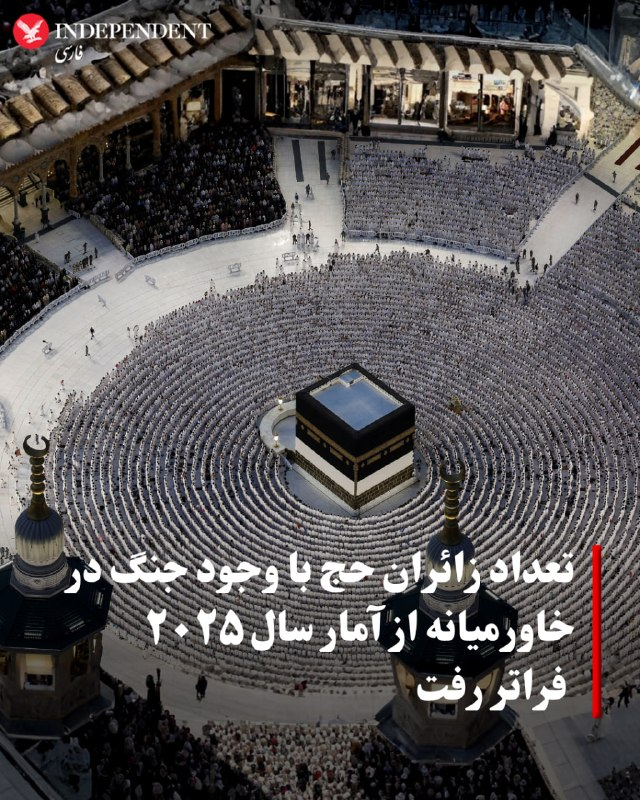

♦️یک مقام سعودی اعلام کرد بیش از ۱.۵ میلیون زائر از خارج از عربستان سعودی برای شرکت در مراسم حج وارد این کشور شده‌اند؛ رقمی که با وجود جنگ در خاورمیانه، از تعداد زائران خارجی سال گذشته بیشتر است.
در دوران جنگ تهران چندین موج حمله به اهدافی در عربستان سعودی و سراسر خلیج فارس انجام داد؛ حملاتی که اختلال گسترده در پروازها و افزایش شدید هزینه‌های سفر را به دنبال داشت.
به گزارش عرب نیوز،شرکت‌های بزرگ هواپیمایی خلیج فارس در امارات، قطر و بحرین پس از هفته‌ها بسته شدن حریم هوایی و لغو پروازها، تلاش کرده‌اند بخش زیادی از ظرفیت عملیاتی خود را دوباره احیا کنند.
این رسانه سعودی می نویسد، با وجود این مشکلات، زائران همچنان برای شرکت در حج امسال راهی عربستان شده‌اند.
صالح المربع، فرمانده نیروهای گذرنامه حج عربستان، در یک نشست خبری گفت: «تعداد کل زائرانی که از خارج کشور وارد شده‌اند، به یک میلیون و ۵۱۸ هزار و ۱۵۳ نفر رسیده است.»
انتظار می‌رود این آمار طی دو روز آینده نیز افزایش یابد، زیرا زائران همچنان پیش از آغاز رسمی مناسک حج در روز دوشنبه از خارج وارد عربستان می‌شوند.
‌🇸🇦 Indypersian

🤖 @VahidOOnLine

## VahidOOnLine — post 242067

  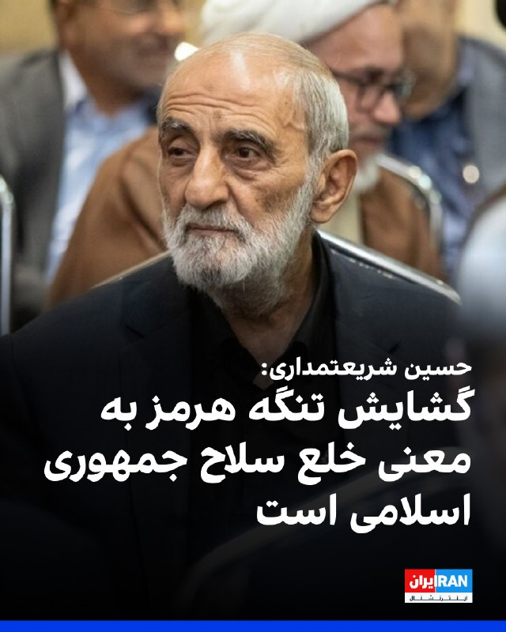

حسین شریعتمداری، نماینده رهبر جمهوری اسلامی در روزنامه کیهان، با اشاره به مذاکرات با آمریکا، نوشت: «ترجمه و معنای واقعی گشایش تنگه هرمز، خلع سلاح جمهوری اسلامی در مقابل تجاوز و حملات نظامی و اقتصادی و سیاسی دشمنان است.»

او افزود: «گشایش تنگه هرمز، حذف یکی از اصلی‌ترین موانع پیش‌روی دشمن برای حمله به کشور خواهد بود.»

او ادامه داد: «متاسفانه مسئولان و دست‌اندرکاران گفت‌وگو و تبادل پیام با آمریکا، از نتیجه گفت‌وگوهای انجام شده، گزارش دقیق و یا اطلاعات چندانی به افکار عمومی نمی‌دهند»
‌🏁 🇬🇧 IranintlTV

🤖 @VahidOOnLine

## VahidOOnLine — post 242066

  

♦️درحالی که دونالد ترامپ، رئیس‌جمهوری آمریکا همواره بر خارج کردن ذخایر اورانیوم غنی‌شده از ایران تاکید داشته است، در روایت سی‌ان‌ان از چارچوب توافق احتمالی با تهران آمده است که درباره چگونگی نابودی ذخایر اورانیوم غنی‌شده ایران در مرحله بعدی مذاکرات تصمیم‌گیری می‌شود. براساس این گزارش، در صورت توافق، بازه زمانی ۶۰ روزه برای به تفاهم رسیدن درباره جزئیات باقی مانده در نظر گرفته شده است. یکی از مقامات که مستقیما در جریان مذاکرات قرار دارد نیز به اسوشیتدپرس گفت: نحوه واگذاری اورانیوم از سوی ایران، در طول یک دوره ۶۰ روزه به مذاکرات بیشتر موکول خواهد شد. به گفته او، احتمالا بخشی از این مواد رقیق خواهد شد و بقیه به کشور ثالث منتقل می‌شود. روسیه پیشنهاد داده است این مواد را تحویل بگیرد.
بر اساس گزارش آژانس بین‌المللی انرژی اتمی، ایران ۴۴۰.۹ کیلوگرم اورانیوم با غنای تا ۶۰ درصد در اختیار دارد؛ سطحی که از نظر فنی تنها یک گام کوتاه تا غنای ۹۰ درصدی مورد نیاز برای ساخت سلاح هسته‌ای فاصله دارد.
‌🇸🇦 Indypersian

🤖 @VahidOOnLine

## VahidOOnLine — post 242065

  <a href="telegram/content/VahidOOnLine_242065_1779689884.mp4" target="_blank">🎬 Download video</a>

♦️به گزارش فاکس نیوز، مراسم فارغ‌التحصیلی دبیرستان سنتنیال در شهر فرانکلین ایالت تنسی با وجود بارش شدید باران و وقوع صاعقه، در فضای باز برگزار شد و موجی از انتقاد خانواده‌ها را به‌دنبال داشت.

مسئولان مدرسه با اجرای سیاست «باران یا آفتاب» تصمیم گرفتند برنامه از پیش تعیین‌شده را تغییر ندهند؛ با وجود آنکه از قبل از وضعیت آب‌وهوا اطلاع داشتند و حتی برای بارندگی برنامه جایگزین نیز در نظر گرفته بودند.

بر اساس گزارش‌ها، مسئولان امیدوار بودند مراسم پیش از آغاز بارندگی به پایان برسد و به همین دلیل آن را به سالن سرپوشیده منتقل نکردند. نگرانی درباره جا نشدن همه حاضران در سالن ورزشی نیز یکی از دلایل ادامه مراسم در فضای باز عنوان شده است.
‌🇸🇦 Indypersian

🤖 @VahidOOnLine

## VahidOOnLine — post 242064

♦️مارکو روبیو، وزیر خارجه آمریکا، روز دوشنبه در جریان سفر به هند گفت مذاکرات میان آمریکا و رژیم ایران «هنوز در حال پیشرفت و شکل‌گیری» است.
روبیو پیش از ترک دهلی‌نو برای بازدید از تاج‌محل در شهر آگرا، به خبرنگاران گفت: «فکر می‌کردیم شاید دیشب خبرهایی داشته باشیم. خیلی نباید در این مورد برداشت خاصی کرد. دریافت پاسخ کمی زمان می‌برد.»
او گفت درباره توانایی ایران برای باز نگه داشتن تنگه هرمز و ورود به «مذاکراتی واقعی، مهم و محدود از نظر زمانی درباره مسائل هسته‌ای»، «پیشنهاد نسبتا محکمی روی میز» قرار دارد. روبیو افزود که توافق احتمالی از حمایت گسترده کشورهای خلیج فارس و همچنین حمایت جهانی برخوردار است.
وزیر خارجه آمریکا همچنین تاکید کرد که دونالد ترامپ، رئیس‌جمهوری آمریکا، «عجله‌ای ندارد» و «قرار نیست توافق بدی امضا کند.»
روبیو گفت: «یا به یک توافق خوب می‌رسیم یا باید از راه دیگری با این مسئله برخورد کنیم.»
او در پاسخ به این پرسش که آیا لبنان بخشی از توافق خواهد بود یا نه، گفت گفت‌وگوها با اسرائیل و لبنان همچنان ادامه دارد.
‌🇸🇦 Indypersian

🤖 @VahidOOnLine

## VahidOOnLine — post 242063

  

روزنامه نیویورک‌پست به نقل از «یک مقام ارشد دولت آمریکا» نوشت که نهایی شدن توافق صلح با حکومت ایران برای بازگشایی تنگه هرمز ممکن است تا یک هفته طول بکشد، اما اگر تهران به شرایط دونالد ترامپ متعهد نشود، ممکن است رییس‌جمهوری ایالات متحده، از آن خارج شود.

یک مقام ارشد آمریکا گفت پس از آن‌که ترامپ اعلام کرد مذاکرات بر سر جنگ و برنامه هسته‌ای تهران در مرحله نهایی خود قرار دارد، وضعیت حکومت ایران باعث شده است که روند نهایی به کندی پیش برود.

این منبع اشاره کرد که ممکن است چند روز طول بکشد تا توافق نهایی به دست مجتبی خامنه‌ای، رهبر جمهوری اسلامی، برسد.

در همین ارتباط، شماری از رسانه‌ها گزارش داده‌اند که او درمکانی نامعلوم مخفی شده و امکان دسترسی به او برای مقام‌‌های حکومت ایران دشوار است.

به نوشته نیویورک‌پست، مقام ارشد آمریکایی گفت بازگشایی واقعی تنگه هرمز و پایان محاصره بنادر ایران توسط آمریکا حدود هفت روز طول خواهد کشید و ایالات متحده تنها زمانی تحریم‌ها را لغو خواهد کرد که ایران اورانیوم غنی‌شده خود را تحویل دهد.
‌🏁 🇬🇧 IranintlTV

🤖 @VahidOOnLine

## VahidOOnLine — post 242062

  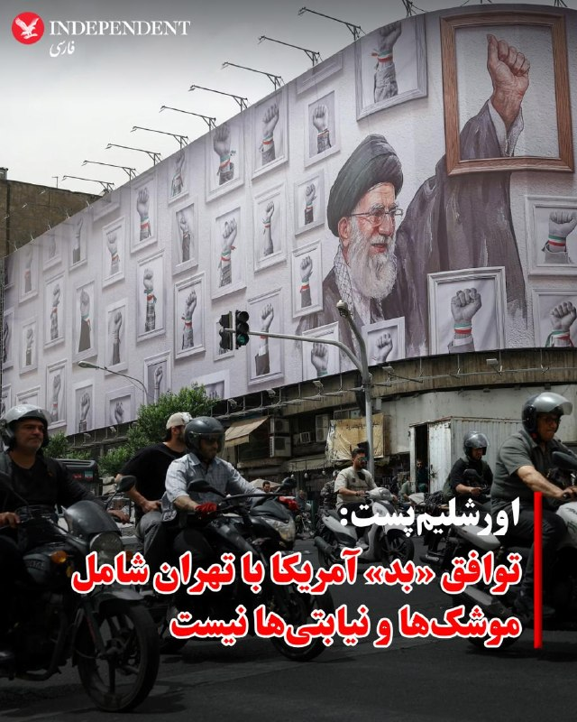

♦️مقام‌های اسرائیلی هشدار داده‌اند که توافق در حال شکل‌گیری میان رژیم ایران و ایالات متحده «توافقی بد» است، زیرا تهدیدهای اصلی جمهوری اسلامی فراتر از برنامه هسته‌ای را نادیده می‌گیرد.
یکی از این مقام‌ها به اورشلیم پست گفت: «توافق چارچوبی خوب نیست و حتی اگر توافق نهایی امضا شود و همه اورانیوم غنی‌شده از ایران خارج شود ــ که خود محل تردید جدی است ــ این توافق به برنامه موشکی ایران یا شبکه نیروهای نیابتی منطقه‌ای آن نمی‌پردازد.»
مقام‌های اسرائیلی همچنین نگران‌اند که این توافق آزادی عمل اسرائیل در لبنان را محدود کند و احتمالا توانایی این کشور برای اقدام علیه تهدیدهای جمهوری اسلامی در سراسر منطقه را کاهش دهد.
یک مقام اسرائیلی دیگر نیز گفت: «هنوز هیچ چیز نهایی نشده، اما این توافق می‌تواند بر اینکه آیا و چگونه قادر به اقدام خواهیم بود، تاثیر بگذارد.»
ارزیابی اسرائیل این است که دونالد ترامپ، رئیس‌جمهوری آمریکا، در حال حاضر خواهان دستیابی به توافق با ایران است و تنها فردی که ممکن است در نهایت مانع آن شود، مجتبی خامنه‌ای، رهبر جمهوری اسلامی، است.
یک مقام اسرائیلی گفت: «در نهایت، تصمیم به او بستگی دارد. همان‌طور که پدرش در آخرین لحظه در سال ۲۰۲۲ توافق جدید هسته‌ای را رد کرد، ممکن است او نیز همان مسیر را در پیش بگیرد.»
براساس این گزارش، فرض اصلی نهادهای امنیتی اسرائیل این است که حکومت کنونی ایران هرگز به‌طور کامل از برنامه هسته‌ای خود دست نخواهد کشید. به باور مقام‌های اسرائیلی، تهران به‌دنبال توافق‌هایی است که بتواند از آن‌ها برای خرید زمان و به تعویق انداختن رویارویی‌هایی استفاده کند که ممکن است توانایی‌هایش را تضعیف کند.
به گفته کارشناسان، اگر ایران با واگذاری ۴۶۰ کیلوگرم اورانیوم ۶۰ درصد غنی‌شده موافقت کند، انتقال این مواد به طرف ثالثی مانند آمریکا یا روسیه بخش ساده‌تر ماجرا خواهد بود. چالش بزرگ‌تر، ایجاد سازوکاری قابل اعتماد برای بازرسی و نظارت بر تاسیسات هسته‌ای ایران، به‌ویژه در زمینه بازسازی یا تولید سانتریفیوژها، خواهد بود.
همچنین هنوز مشخص نیست که با زیرساخت‌های هسته‌ای که در حملات ارتش اسرائیل و ارتش آمریکا آسیب جدی دیده‌اند چه خواهد شد.
در اسرائیل، هر توافقی که به ایران اجازه دهد زیرساخت هسته‌ای خود را تحت عنوان «پروژه غیرنظامی» حفظ کند، شکست این کارزار تلقی خواهد شد.
علاوه بر این، مقام‌های دفاعی به وب‌سایت «والا» تایید کردند که یکی از نقاط اختلاف در توافق، درخواست حکومت تهران برای گنجاندن حزب‌الله در توافق آتش‌بس و جلوگیری از ادامه عملیات نظامی اسرائیل است.
‌🇸🇦 Indypersian

🤖 @VahidOOnLine

## VahidOOnLine — post 242061

  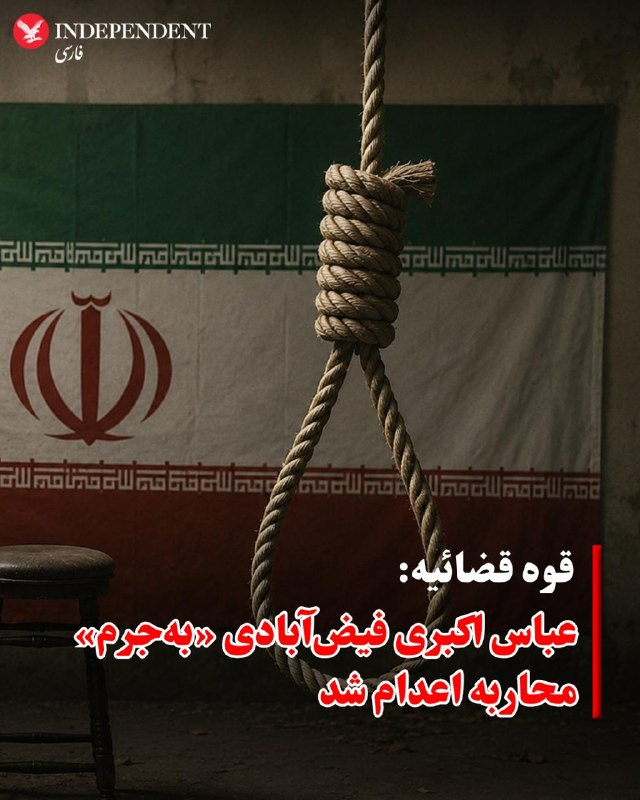

♦️قوه قضائیه جمهوری اسلامی روز دوشنبه چهارم خرداد اعلام کرد عباس اکبری فیض‌‌آبادی به‌اتهام «به اتهام محاربه، تخریب عمدی اموال عمومی به قصد مقابله با نظام مقدس جمهوری اسلامی ایران و اخلال در نظم و امنیت جامعه، اجتماع و تبانی برای ارتکاب جرم علیه امنیت داخلی کشور» محاکمه و اعدام شد.

میزان، خبرگزاری قوه قضائیه با اعلام این خبر نوشت: متهم «نقش مهمی در حمله به فرمانداری شهرستان و مراکز تامین امنیت و همچنین مراکز خدماتی» شهرستان نائین استان اصفهان داشت.

جمهوری اسلامی از زمان آغاز جنگ در اسفندماه سال گذشته دست‌کم ۲۵ نفر را به اتهام‌های سیاسی و امنیتی اعدام کرده است.
‌🇸🇦 Indypersian

🤖 @VahidOOnLine

## VahidOOnLine — post 242060

  

حکم اعدام عباس اکبری فیض‌آبادی، از بازداشت‌شدگان دی‌ماه در شهرستان نائین اصفهان، صبح دوشنبه، چهارم خرداد پس از تایید دیوان عالی کشور اجرا شد.

بر اساس گزارش خبرگزاری میزان، وابسته به قوه قضاییه جمهوری اسلامی، عباس اکبری فیض‌آبادی، فرزند علی، با اتهام‌هایی از جمله «محاربه»، «تخریب عمدی اموال عمومی به قصد مقابله با نظام جمهوری اسلامی»، «اخلال در نظم و امنیت جامعه» و «اجتماع و تبانی برای ارتکاب جرم علیه امنیت داخلی کشور» محاکمه شده بود.

در این گزارش آمده است که دادگاه پس از برگزاری جلسات رسیدگی و دریافت دفاعیات متهم و وکیل او، با استناد به آنچه «اقاریر متهم» درباره همراه داشتن کلت کمری جنگی، حضور در خیابان و تیراندازی عنوان شده، اتهام محاربه را محرز دانست.

قوه قضاییه همچنین اعلام کرد فیلمی از لحظه تیراندازی و گزارش مرجع انتظامی درباره کشف سلاح از منزل متهم، از جمله مستندات پرونده بوده است.

بر اساس این گزارش حکم اعدام عباس اکبری فیض‌آبادی در دیوان عالی کشور تایید و اعلام شد حکم صادرشده بر پایه مدارک، مستندات و اظهارات متهم بوده و ایرادی به آن وارد نیست.
‌🏁 🇬🇧 IranintlTV

🤖 @VahidOOnLine

## VahidOOnLine — post 242059

  

مارکو روبیو، وزیر خارجه ایالات متحده، صبح دوشنبه چهارم خرداد اعلام کرد که توافق آمریکا و حکومت ایران «همچنان پیش می‌رود.»

به‌گزارش خبرگزاری رویترز، او افزود که در مورد «توانایی ایران برای باز کردن» تنگه هرمز و «ورود به مذاکراتی واقعی، مهم و محدود از نظر زمانی درباره مسائل هسته‌ای»، پیشنهادی «نسبتا محکم» روی میز است.

روبیو اضافه کرد: «امیدواریم که بتوانیم آن را عملی کنیم. این طرح در خلیج فارس حمایت زیادی دارد. در سطح جهانی نیز از حمایت زیادی برخوردار است.»

او گفت که هر کشوری درک می‌کند که «این نه تنها بسیار منطقی است، بلکه کار درستی است که جهان باید انجام دهد.»

روبیو که در جریان سفر به هند با خبرنگاران گفت‌وگو می‌کرد، افزود که ترامپ عجله‌ای برای رسیدن به توافق ندارد.

او تاکید کرد: «قرار نیست که رییس‌جمهور توافق بدی انجام دهد. بنابراین بیایید ببینیم چه اتفاقی می‌افتد. ما قبل از بررسی گزینه‌ها، به دیپلماسی، فرصت موفقیت را می‌دهیم.»
‌🏁 🇬🇧 IranintlTV

🤖 @VahidOOnLine

## VahidOOnLine — post 242058

  

مقام‌های اسرائیلی هشدار دادند که توافق در حال شکل‌گیری بین حکومت ایران و ایالات متحده «یک توافق بد» است و می‌گویند که این توافق به تهدیدات کلیدی تهران فراتر از برنامه هسته‌ای‌اش نمی‌پردازد.

یک مقام اسرائیلی به روزنامه اورشلیم‌پست گفت: «چارچوب توافق خوب نیست و حتی اگر توافق نهایی امضا شود و تمام اورانیوم غنی‌شده از ایران خارج شود، که یک «اگر» بزرگ است، این توافق به موضوع برنامه موشکی ایران یا شبکه نیروهای نیابتی منطقه‌ای آن نمی‌پردازد.»

بر اساس این گزارش، مقام‌ها در اورشلیم همچنین نگرانند که این توافق بتواند آزادی عمل اسرائیل در لبنان را محدود کند و به‌طور بالقوه، توانایی آن را برای اقدام علیه تهدیدهای تهران در سراسر منطقه محدود کند.

یک مقام اسرائیلی به اورشلیم‌پست گفت: «هنوز هیچ چیز نهایی نیست، اما این توافقی است که می‌تواند بر توانایی و نحوه عملکرد ما تأثیر بگذارد.»

این گزارش حاکی از آن است که بنیامین نتانیاهو، نخست وزیر اسرائیل، عصر یکشنبه گروه کوچکی از وزرا و مقامات ارشد امنیتی را برای بحث در مورد توافق در حال شکل‌گیری تشکیل داد.
‌🏁 🇬🇧 IranintlTV

🤖 @VahidOOnLine

## VahidOOnLine — post 242057

♦️حسین انتظامی، سخنگوی سابق دبیرخانه شورای عالی امنیت ملی، در گفتگو با فارس، خبرگزاری وابسته به سپاه، درباره آخرین اقدام علی لاریجانی پیش از مرگ گفت: «کار بزرگی که او انجام داد این بود که درست ۲۴ ساعت قبل از مرگ، طرح صلح را در شورای عالی امنیت ملی به تصویب رساند. چهارچوبی که مسیر مذاکرات شامل آتش‌بس و صلح را به امضای تک‌تک اعضای این شورا رساند و برای رهبری فرستاد». علی لاریجانی بامداد ۲۶ اسفند ۱۴۰۴ در جریان حملات هوایی اسرائیل به تهران، به همراه فرزندش مرتضی و رئیس دفترش کشته شد.
‌🇸🇦 Indypersian

🤖 @VahidOOnLine

## VahidOOnLine — post 242056

♦️مارکو روبیو، وزیر خارجه آمریکا، روز یکشنبه در جریان سفر به هند، در مراسمی غافلگیرکننده در دهلی‌نو جشن تولد ۵۵ سالگی‌اش را برگزار کرد؛ مراسمی که با اجرای گروه موسیقی «ویلیج پیپل» همراه بود.

این مراسم در محوطه «بهارات ماندپام» و همزمان با جشن دویست‌وپنجاهمین سال استقلال آمریکا برگزار شد. سرجیو گور، سفیر آمریکا در هند، روبیو را به روی صحنه دعوت کرد و همزمان صفحه‌نمایشی بزرگ با پیام «تولدت مبارک مارکو روبیو» روشن شد.

در ادامه، یک کیک چهارطبقه برای وزیر خارجه آمریکا آورده شد و گروه «ویلیج پیپل» ترانه «تولدت مبارک» را برای او اجرا کرد. این گروه سپس اجرای خود را با ترانه مشهور «وای‌ام‌سی‌ای» ادامه داد.

سوبرامانیام جایشانکا، وزیر خارجه هند، و شماری دیگر از مقام‌های آمریکایی و هندی نیز در این مراسم حضور داشتند.

ترانه «وای‌ام‌سی‌ای» که از مشهورترین آثار موسیقی دیسکو به شمار می‌رود، در سال‌های اخیر بارها در مراسم و گردهمایی‌های دونالد ترامپ نیز پخش شده است.
‌🇸🇦 Indypersian

🤖 @VahidOOnLine

## VahidOOnLine — post 242055

  

شبکه خبری سی‌ان‌ان گزارش داد در چارچوب پیش‌نویس نوافق‌نامه آمریکا و حکومت ایران، ۶۰ روز برای نهایی‌کردن این توافق، فرصت داده شده و کاهش تحریم‌ها نیز به واگذاری ذخایر اورانیوم با غنای بالا از سوی تهران مشروط شده است.

یک مقام ارشد دولت دونالد ترامپ در گفت‌وگو با سی‌ان‌ان تاکید کرد: «بدون تحویل گردو غبار [اورانیوم]، پولی در کار نخواهد بود.»
‌🏁 🇬🇧 IranintlTV

🤖 @VahidOOnLine

## VahidOOnLine — post 242054

  

روزنامه دنیای اقتصاد گزارش داد: «بر اساس پیش‌بینی‌ها، درآمد‌های مالیاتی با عدم تحقق ۲۵ درصدی در بودجه سال جاری مواجه خواهد شد.»

این روزنامه اشاره کرد که این کاهش درآمد‌ها می‌تواند کسری بودجه را تشدید کند و افزود اقتصاد ایران در سال ۱۴۰۵ با مجموعه‌ای از نااطمینانی‌ها و فشار‌های همزمان مواجه شده است.

دنیای اقتصاد به «اختلال‌های گسترده اینترنت، کاهش دسترسی بسیاری از کسب‌وکار‌ها به بازار، افت فروش در بخش خدمات و تجارت آن‌لاین، افزایش هزینه‌های تولید، کاهش قدرت خرید خانوار‌ها و نگرانی‌های ناشی از تشدید تنش‌های منطقه‌ای» اشاره کرد؛ عواملی که بسیاری از بنگاه‌ها را در وضعیت نیمه‌تعطیل یا رکودی قرار داده‌اند.

بر اساس این گزارش، علی افضلی، مدیرکل دفتر سیاستگذاری بخش عمومی وزارت اقتصاد، در همایش «چشم‌انداز اقتصاد ایران ۱۴۰۵» گفته است احتمال دارد «حدود ۲۵ درصد از درآمد‌های مالیاتی امسال وصول نشود.»

دنیای اقتصاد نوشت اگر یک‌چهارم درآمد‌های مالیاتی محقق نشود، دولت یا باید هزینه‌ها را کاهش دهد، یا به سمت استقراض و چاپ پول برود، یا فشار مالیاتی بیشتری بر مؤدیان وارد کند؛ مسیرهایی که هر سه تبعات اقتصادی آسیب‌زا دارند.
ht
‌🏁 🇬🇧 IranintlTV

🤖 @VahidOOnLine

## VahidOOnLine — post 242053

  

♦️یک مقام ارشد دولت آمریکا روز یکشنبه به نیویورک پست گفت ممکن است نهایی شدن توافق تا یک هفته طول بکشد، اما دونالد ترامپ ممکن است در صورت نپذیرفتن شرایطش از سوی تهران، از این روند خارج شود.
یک‌مقام ارشد به این. روزنامه آمریکایی گفت، وضعیت حکومت تهران باعث شده روند نهایی شدن توافق کند پیش برود.
این منبع اعلام کرد ممکن است چند روز طول بکشد تا متن نهایی توافق به دست رهبر جمهوری اسلامی، مجتبی خامنه‌ای، برسد که از زمان آغاز جنگ در مخفیگاه به سر می‌برد و گفته می‌شود زخمی است.
او افزود، بازگشایی واقعی تنگه هرمز و پایان محاصره آمریکا علیه بنادر ایران حدود هفت روز زمان خواهد برد و آمریکا تنها زمانی تحریم‌ها را لغو می‌کند که ایران اورانیوم غنی‌شده خود را تحویل بدهد.
با وجود این نگاه مثبت، ترامپ گفته است عجله‌ای برای رسیدن به توافق ندارد و مذاکرات را تا زمان تعیین شرایط ایده‌آل ادامه خواهد داد.
‌🇸🇦 Indypersian

🤖 @VahidOOnLine

## VahidOOnLine — post 242052

  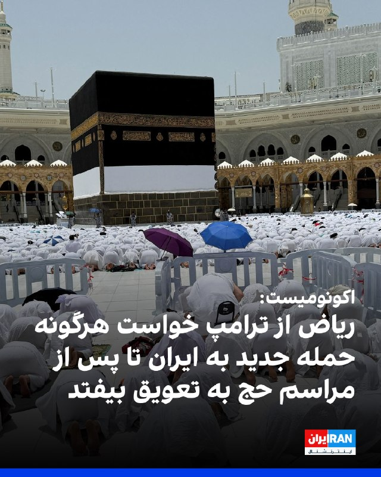

نشریه اکونومیست گزارش داد که ریاض از دونالد ترامپ خواسته است هرگونه حمله جدید به ایران را تا پس از مراسم سالانه حج به تعویق بیندازد.

به نوشته اکونومیست، این نگرانی وجود دارد که اگر درگیری دوباره آغاز و حریم هوایی منطقه بسته شود، زائران در عربستان سعودی گیر بیفتند.
‌🏁 🇬🇧 IranintlTV

🤖 @VahidOOnLine

## WithYashar — post 12389

۱۵۴۰ تا دایرکت نخونده دارم ، یه فرصت بدید شاید نتونم این سری لایک هم کنم والی همه رو یکم دیگه میخونم🥲🙌🏾

## WithYashar — post 12388

شبکه خبری سی‌بی‌اس به نقل از مقام‌های آمریکایی آگاه گزارش داد اطلاعات ایالات متحده نشان می‌دهد خامنه‌ای، رهبر جمهوری اسلامی، عملا در مکانی نامعلوم پنهان شده و دسترسی بسیار محدودی به دنیای خارج دارد. بر اساس این گزارش، مقام‌های حکومت ایران تنها از طریق شبکه‌ای…

## WithYashar — post 12387

اکونومیست: گزارش‌ها حاکی از آن است که عربستان سعودی از دونالد ترامپ درخواست کرده است هرگونه حمله جدید به ایران را تا پس از حج به تعویق بیندازد.
همچنان ترس وجود دارد که اگر درگیری دوباره آغاز شود، زائران در آنجا گیر خواهند افتاد.
@withyashar

## WithYashar — post 12386

فایننشال تایمز: عصبانیت رئیس‌جمهور چین از «افزایش توان نظامی ژاپن» در حضور همتای آمریکایی‌اش

پاسخ ترامپ: ژاپن به دلیل تهدیدات کره شمالی، به دفاع قوی‌تری نیاز دارد
@withyashar

## FoxNewsTwitter — post 342192

Fox News (Twitter/X)

An emotional night for NASCAR.

For the first time since Kyle Busch's death, his wife Samantha and son Brexton appeared publicly for a powerful remembrance of the late driver's life.

Then, on lap 8, the crowd stood as one — cheering, crying, and saluting the legacy "Rowdy" left behind.

The message was clear: Kyle Busch's impact on NASCAR will never be forgotten.

## pm_afshaa — post 91427

  

عباس اکبری فیض آبادی از معترضین دی ماه در اصفهان امروز با اذان صبح توسط جمهوری اسلامی اعدام شد

💧 Rainbet.com the #1 Non-KYC Crypto Casino & Sportsbook @rainbetcom

😁 @Pm_Afshaa

## pm_afshaa — post 91426

🔴یک مقام آمریکایی به شبکه «فاکس‌نیوز» گفت دونالد ترامپ، رئیس‌جمهوری آمریکا ممکن است به ایران هفت روز مهلت دهد تا به یک توافق «قابل‌قبول» برسن

💧 Rainbet.com the #1 Non-KYC Crypto Casino & Sportsbook @rainbetcom

😁 @Pm_Afshaa

## pm_afshaa — post 91425

  <a href="telegram/content/pm_afshaa_91425_1779689891.webm" target="_blank">🎬 Download video</a>

🔴قلهکی، فعال رسانه‌ای اصولگرا: دلیل اینکه تفاهم اسلام آباد هنوز امضا نشده اینه که نتانیاهو زنگ زده به ترامپ و پُرش کرده، آمريکا هم زده زیرش و گفته تا قبل اینکه 400 کیلو اورانیوم رو تحویل ندید، خبری از پول‌های بلوکه شده نیست! 
💧 Rainbet.com the #1 Non-KYC…

## mamlekate — post 103578

📝 سلام ساعت ۳ بامداد تاریخ ۴خرداد. قشم سوزا هستیم به فاصله ده دقیقه دوبار طوری زدن که تموم خونه لرزید نمیدونم کجا بود فکر کنم شروع شد دوباره

📝 جنوب از ساعت ۱۲ شب تا الان درگیری و سروصداست تا الان. من جزیره هنگامم.

@mamlekate

## VahidOnline — post 75695

  

وزیر خارجه ایالات متحده، روز دوشنبه چهارم خرداد گفت که واشینگتن در مذاکرات جاری خود با ایران، «هر فرصتی برای موفقیت» به دیپلماسی خواهد داد.

مارکو روبیو که اکنون در هند به‌سر می‌برد در جمع خبرنگاران گفت که مذاکرات با ایران همچنان «در حال پیشرفت» است و خوش‌بینی محتاطانه‌ای نسبت به توافق احتمالی برای بازگشایی مسیرهای کلیدی کشتیرانی و از سرگیری مذاکرات هسته‌ای ابراز کرد.

او که روز گذشته از احتمال توافق با ایران تا پایان روز یک‌شنبه خبر داده بود، گفت: «همه ما باید مطمئن باشیم که یا به یک توافق خوب خواهیم رسید، یا مجبور می‌شویم به شکل دیگری با این مسئله برخورد کنیم. ترجیح ما این است که یک توافق خوب داشته باشیم.»

دونالد ترامپ، رئیس‌جمهور آمریکا نیز شامگاه یک‌شنبه در دومین پیام خود درباره روند مذاکرات با ایران اطمینان داد که توافق احتمالی با ایران «خوب و درست» خواهد بود اما هیچ کس درباره محتوای آن اطلاع ندارد.
@VahidHeadline

📡 @VahidOnline

## VahidOnline — post 75694

  

خبرگزاری «میزان» رسانه قوه قضاییه جمهوری اسلامی اعلام کرد حکم اعدام «عباس اکبری فیض‌آبادی»، از متهمان پرونده اعتراضات دی‌۱۴۰۴ در شهرستان «نایین» اصفهان، صبح روز دوشنبه ۴خرداد۱۴۰۵ اجرا شده است.

«میزان» مدعی شده که عباس اکبری از «لیدرهای مسلح» اعتراضات در نایین بوده و در جریان حمله به فرمانداری این شهر و برخی مراکز حکومتی، به سوی ماموران امنیتی تیراندازی کرده است.
@VahidHeadline

📡 @VahidOnline

## IranIntlTV — post 338867

  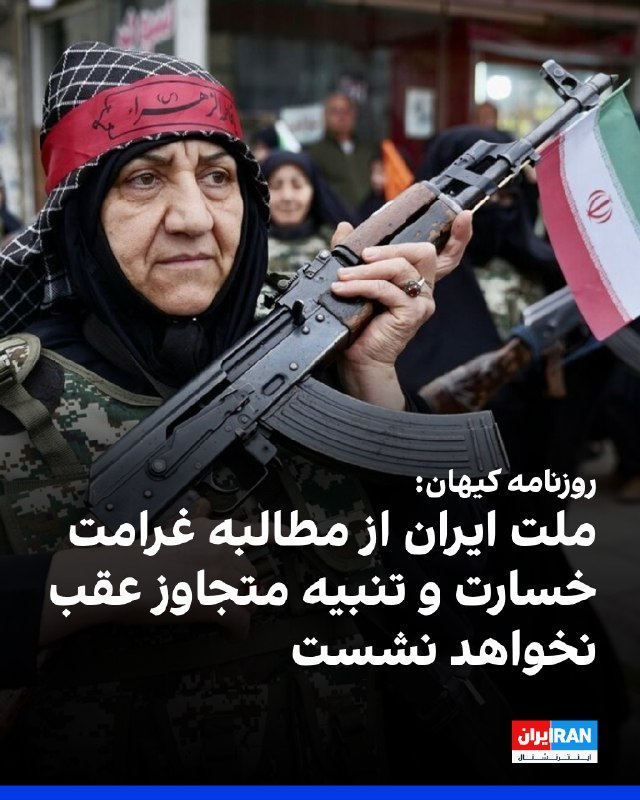

روزنامه کیهان با اشاره به احتمال تفاهم موقت میان جمهوری اسلامی و آمریکا، نوشت: «ملت ایران از مطالبه غرامت، خسارت، تنبیه متجاوز و رفع شر او و همچنین از حکمرانی بر تنگه هرمز به عنوان حاکمیت سرزمینی خود عقب نخواهد نشست.»

این روزنامه افزود: «توافق با عنصر عهدشکنی که تعهد دولت آمریکا در برجام را زیر پا گذاشت، مانند نقش زدن بر قالب یخ زیر آفتاب است.»

کیهان ادامه داد: «شرایط برخلاف تظاهر مذاکراتی دشمن، جنگی است و در برابر دشمن زخم‌خورده و مترصد، غفلت از آرایش دفاعی و تهاجمی و احتیاط ممکن نیست.»
https://iranintl.com/202605252293

## IranIntlTV — post 338866

  <a href="telegram/content/IranIntlTV_338866_1779689893.mp4" target="_blank">🎬 Download video</a>

محسن رضایی، مشاور نظامی مجتبی خامنه‌ای، هم‌زمان با ادامه گفت‌وگوها با آمریکا هشدار داد در صورت تداوم روند خصمانه، جمهوری اسلامی از معاهده «ان‌پی‌تی» خارج خواهد شد.

گفت‌وگو با شهرام خلدی، پژوهشگر تاریخ خاورمیانه و روابط بین‌الملل
@iranintltv

## IranIntlTV — post 338865

  

خبرگزاری ایسنا گزارش داد موجودی سدهای استان‌های تهران، مرکزی، خراسان رضوی، قم، اصفهان، زنجان و همدان در وضعیت نامطلوب است و تامین آب شرب شهرهایی از جمله تهران، کرج، مشهد، اراک، قم، اصفهان، یزد و همدان با محدودیت مواجه شده است.

بنا بر این گزارش حجم پرشدگی سدهای کشور به ۶۷ درصد رسیده، اما پنج سد مهم شامل لار، دوستی، پانزده خرداد، بارزو و ساوه همچنان کمتر از ۱۰ درصد آب دارند.
https://iranintl.com/202605252689

## IranIntlTV — post 338864

  <a href="telegram/content/IranIntlTV_338864_1779689895.mp4" target="_blank">🎬 Download video</a>

خبرگزاری میزان وابسته به قوه قضاییه جمهوری اسلامی نوشت دادگاه انقلاب تهران تعدادی از متهمان پرونده اکباتان را به «اشد مجازات» محکوم کرد.

گفت‌وگو با پگاه بنی‌هاشمی، پژوهشگر ارشد حقوق
@iranintltv

## IranIntlTV — post 338863

  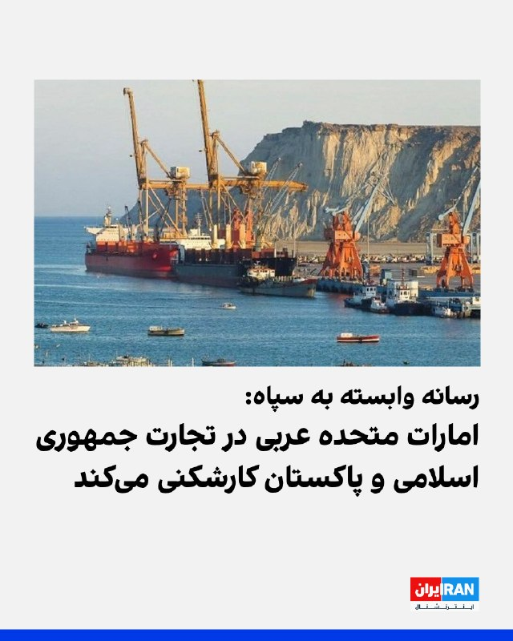

خبرگزاری فارس، وابسته به سپاه پاسداران، نوشت بر اساس کسب اطلاعش از اتاق بازرگانی ایران و پاکستان، امارات متحده عربی برای جلوگیری از تبدیل بندر گوادر به رقیب دبی، در مسیر پیشرفت کریدور اقتصادی چین و پاکستان، موسوم به «سی‌پک»، کارشکنی می‌کند.

از آغاز جنگ میان جمهوری اسلامی با آمریکا و اسرائیل، امارات متحده عربی هدف بیشتری حملات جمهوری اسلامی قرار گرفت.
https://iranintl.com/202605255252

## IranIntlTV — post 338862

  <a href="telegram/content/IranIntlTV_338862_1779689897.mp4" target="_blank">🎬 Download video</a>

در ادامه یکشنبه‌های اعتراضی، جمعی از ایرانیان در شهر ادمونتون در کانادا با برگزاری زنجیره انسانی به خیابان آمدند و از مردم ایران و شاهزاده رضا پهلوی حمایت کردند.

سپیدار ولیان، خبرنگار ایران‌اینترنشنال، گزارش می‌دهد
@iranintltv

## IranIntlTV — post 338861

  

حسین شریعتمداری، نماینده رهبر جمهوری اسلامی در روزنامه کیهان، با اشاره به مذاکرات با آمریکا، نوشت: «ترجمه و معنای واقعی گشایش تنگه هرمز، خلع سلاح جمهوری اسلامی در مقابل تجاوز و حملات نظامی و اقتصادی و سیاسی دشمنان است.»

او افزود: «گشایش تنگه هرمز، حذف یکی از اصلی‌ترین موانع پیش‌روی دشمن برای حمله به کشور خواهد بود.»

او ادامه داد: «متاسفانه مسئولان و دست‌اندرکاران گفت‌وگو و تبادل پیام با آمریکا، از نتیجه گفت‌وگوهای انجام شده، گزارش دقیق و یا اطلاعات چندانی به افکار عمومی نمی‌دهند»
https://iranintl.com/202605258963

## IranIntlTV — post 338860

  <a href="telegram/content/IranIntlTV_338860_1779689898.mp4" target="_blank">🎬 Download video</a>

جزییات توافق احتمالی میان جمهوری اسلامی و آمریکا
@iranintltv

## IranIntlTV — post 338859

  <a href="telegram/content/IranIntlTV_338859_1779689900.mp4" target="_blank">🎬 Download video</a>

سگ‌های خیابانی به یکی از چالش‌های جدی در کوزوو تبدیل شده‌اند. یک سازمان بین‌المللی تلاش می‌کند از طریق عقیم‌سازی، رشد جمعیت این حیوانات را کنترل کند، اما کارشناسان می‌گویند حل کامل این بحران ممکن است سال‌ها طول بکشد.

گزارش فرزیا ثابتی، خبرنگارایران‌اینترنشنال
@iranintltv

## IranIntlTV — post 338858

  <a href="telegram/content/IranIntlTV_338858_1779689901.mp4" target="_blank">🎬 Download video</a>

شبکه خبری سی‌بی‌اس در گزارشی نوشت مجتبی خامنه‌ای «عملا در مکانی نامعلوم با دسترسی محدود به دنیای خارج پنهان شده است» و مقام‌های حکومتی «تنها از طریق شبکه‌ای پیچیده از پیک‌ها و واسطه‌ها» با او در ارتباط هستند.

گفت‌وگو با کامیار بهرنگ، عضو تحریریه ایران‌اینترنشنال
@iranintltv

## IranIntlTV — post 338857

  <a href="telegram/content/IranIntlTV_338857_1779689903.mp4" target="_blank">🎬 Download video</a>

یک منبع آگاه به ایران‌اینترنشنال گفت مذاکره‌کنندگان جمهوری اسلامی آزادسازی فوری ۱۲ میلیارد دلار از دارایی‌های مسدودشده ایران در قطر را پیش‌شرط پیشبرد مذاکرات با ایالات متحده اعلام کردند.

گفت‌وگو با امیر گیتی، خبرنگار ایران‌اینترنشنال
@iranintltv

## IranIntlTV — post 338856

  <a href="telegram/content/IranIntlTV_338856_1779689904.mp4" target="_blank">🎬 Download video</a>

هم‌زمان با ادامه تجمع‌های اعتراضی ایرانیان در اروپا، گروهی از معترضان، یکشنبه مقابل سفارت جمهوری اسلامی در استکهلم تجمع کردند.

مهران عباسیان، خبرنگار ایران‌اینترنشنال، گزارش می‌دهد
@iranintltv

## IranIntlTV — post 338855

  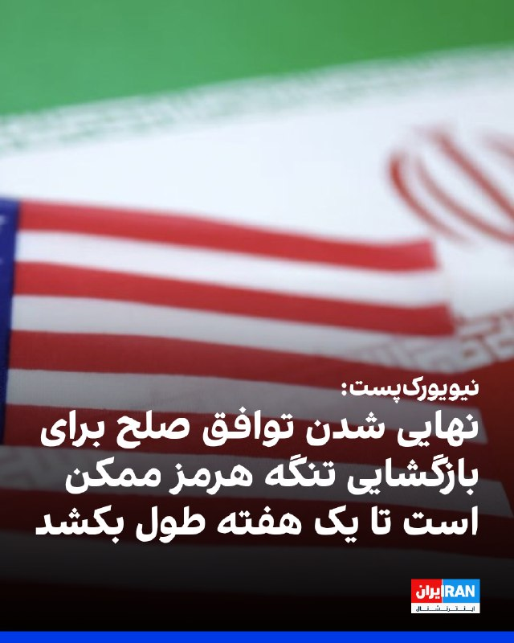

روزنامه نیویورک‌پست به نقل از «یک مقام ارشد دولت آمریکا» نوشت که نهایی شدن توافق صلح با حکومت ایران برای بازگشایی تنگه هرمز ممکن است تا یک هفته طول بکشد، اما اگر تهران به شرایط دونالد ترامپ متعهد نشود، ممکن است رییس‌جمهوری ایالات متحده، از آن خارج شود.

یک مقام ارشد آمریکا گفت پس از آن‌که ترامپ اعلام کرد مذاکرات بر سر جنگ و برنامه هسته‌ای تهران در مرحله نهایی خود قرار دارد، وضعیت حکومت ایران باعث شده است که روند نهایی به کندی پیش برود.

این منبع اشاره کرد که ممکن است چند روز طول بکشد تا توافق نهایی به دست مجتبی خامنه‌ای، رهبر جمهوری اسلامی، برسد.

در همین ارتباط، شماری از رسانه‌ها گزارش داده‌اند که او درمکانی نامعلوم مخفی شده و امکان دسترسی به او برای مقام‌‌های حکومت ایران دشوار است.

به نوشته نیویورک‌پست، مقام ارشد آمریکایی گفت بازگشایی واقعی تنگه هرمز و پایان محاصره بنادر ایران توسط آمریکا حدود هفت روز طول خواهد کشید و ایالات متحده تنها زمانی تحریم‌ها را لغو خواهد کرد که ایران اورانیوم غنی‌شده خود را تحویل دهد.
https://iranintl.com/202605246577

## IranIntlTV — post 338854

  <a href="telegram/content/IranIntlTV_338854_1779689906.mp4" target="_blank">🎬 Download video</a>

سرخط خبرهای دوشنبه ۴ خرداد
@iranintltv

## IranIntlTV — post 338853

  

حکم اعدام عباس اکبری فیض‌آبادی، از بازداشت‌شدگان دی‌ماه در شهرستان نائین اصفهان، صبح دوشنبه، چهارم خرداد پس از تایید دیوان عالی کشور اجرا شد.

بر اساس گزارش خبرگزاری میزان، وابسته به قوه قضاییه جمهوری اسلامی، عباس اکبری فیض‌آبادی، فرزند علی، با اتهام‌هایی از جمله «محاربه»، «تخریب عمدی اموال عمومی به قصد مقابله با نظام جمهوری اسلامی»، «اخلال در نظم و امنیت جامعه» و «اجتماع و تبانی برای ارتکاب جرم علیه امنیت داخلی کشور» محاکمه شده بود.

در این گزارش آمده است که دادگاه پس از برگزاری جلسات رسیدگی و دریافت دفاعیات متهم و وکیل او، با استناد به آنچه «اقاریر متهم» درباره همراه داشتن کلت کمری جنگی، حضور در خیابان و تیراندازی عنوان شده، اتهام محاربه را محرز دانست.

قوه قضاییه همچنین اعلام کرد فیلمی از لحظه تیراندازی و گزارش مرجع انتظامی درباره کشف سلاح از منزل متهم، از جمله مستندات پرونده بوده است.

بر اساس این گزارش حکم اعدام عباس اکبری فیض‌آبادی در دیوان عالی کشور تایید و اعلام شد حکم صادرشده بر پایه مدارک، مستندات و اظهارات متهم بوده و ایرادی به آن وارد نیست.
https://iranintl.com/202605255098

## IranIntlTV — post 338852

  <a href="telegram/content/IranIntlTV_338852_1779689907.mp4" target="_blank">🎬 Download video</a>

جاویدنامان انقلاب ملی ایرانیان
«کیان پورصفر دلشاد» در ۱۹ دی‌ماه در بندرانزلی بر اثر اصابت گلوله نیروهای سرکوب جمهوری اسلامی به شدت مجروح شد و پس از ۱۲ روز بستری، در اول بهمن‌ماه ۱۴۰۴ جان خود را از دست داد. نامش در حافظه‌ی این سرزمین می‌ماند و یادش چراغ راه آزادی‌خواهان است.
@iranintltv

## IranIntlTV — post 338851

  

مارکو روبیو، وزیر خارجه ایالات متحده، صبح دوشنبه چهارم خرداد اعلام کرد که توافق آمریکا و حکومت ایران «همچنان پیش می‌رود.»

به‌گزارش خبرگزاری رویترز، او افزود که در مورد «توانایی ایران برای باز کردن» تنگه هرمز و «ورود به مذاکراتی واقعی، مهم و محدود از نظر زمانی درباره مسائل هسته‌ای»، پیشنهادی «نسبتا محکم» روی میز است.

روبیو اضافه کرد: «امیدواریم که بتوانیم آن را عملی کنیم. این طرح در خلیج فارس حمایت زیادی دارد. در سطح جهانی نیز از حمایت زیادی برخوردار است.»

او گفت که هر کشوری درک می‌کند که «این نه تنها بسیار منطقی است، بلکه کار درستی است که جهان باید انجام دهد.»

روبیو که در جریان سفر به هند با خبرنگاران گفت‌وگو می‌کرد، افزود که ترامپ عجله‌ای برای رسیدن به توافق ندارد.

او تاکید کرد: «قرار نیست که رییس‌جمهور توافق بدی انجام دهد. بنابراین بیایید ببینیم چه اتفاقی می‌افتد. ما قبل از بررسی گزینه‌ها، به دیپلماسی، فرصت موفقیت را می‌دهیم.»
https://iranintl.com/202605252808

## IranIntlTV — post 338850

  

مقام‌های اسرائیلی هشدار دادند که توافق در حال شکل‌گیری بین حکومت ایران و ایالات متحده «یک توافق بد» است و می‌گویند که این توافق به تهدیدات کلیدی تهران فراتر از برنامه هسته‌ای‌اش نمی‌پردازد.

یک مقام اسرائیلی به روزنامه اورشلیم‌پست گفت: «چارچوب توافق خوب نیست و حتی اگر توافق نهایی امضا شود و تمام اورانیوم غنی‌شده از ایران خارج شود، که یک «اگر» بزرگ است، این توافق به موضوع برنامه موشکی ایران یا شبکه نیروهای نیابتی منطقه‌ای آن نمی‌پردازد.»

بر اساس این گزارش، مقام‌ها در اورشلیم همچنین نگرانند که این توافق بتواند آزادی عمل اسرائیل در لبنان را محدود کند و به‌طور بالقوه، توانایی آن را برای اقدام علیه تهدیدهای تهران در سراسر منطقه محدود کند.

یک مقام اسرائیلی به اورشلیم‌پست گفت: «هنوز هیچ چیز نهایی نیست، اما این توافقی است که می‌تواند بر توانایی و نحوه عملکرد ما تأثیر بگذارد.»

این گزارش حاکی از آن است که بنیامین نتانیاهو، نخست وزیر اسرائیل، عصر یکشنبه گروه کوچکی از وزرا و مقامات ارشد امنیتی را برای بحث در مورد توافق در حال شکل‌گیری تشکیل داد.
https://iranintl.com/202605256432

## IranIntlTV — post 338849

  

شبکه خبری سی‌ان‌ان گزارش داد در چارچوب پیش‌نویس نوافق‌نامه آمریکا و حکومت ایران، ۶۰ روز برای نهایی‌کردن این توافق، فرصت داده شده و کاهش تحریم‌ها نیز به واگذاری ذخایر اورانیوم با غنای بالا از سوی تهران مشروط شده است.

یک مقام ارشد دولت دونالد ترامپ در گفت‌وگو با سی‌ان‌ان تاکید کرد: «بدون تحویل گردو غبار [اورانیوم]، پولی در کار نخواهد بود.»
https://iranintl.com/202605257610

## IranIntlTV — post 338848

  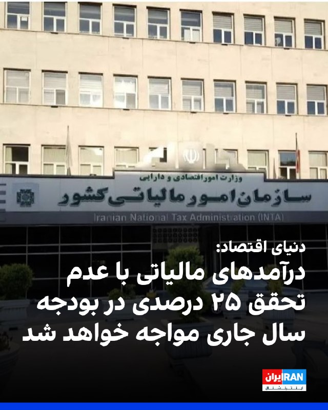

روزنامه دنیای اقتصاد گزارش داد: «بر اساس پیش‌بینی‌ها، درآمد‌های مالیاتی با عدم تحقق ۲۵ درصدی در بودجه سال جاری مواجه خواهد شد.»

این روزنامه اشاره کرد که این کاهش درآمد‌ها می‌تواند کسری بودجه را تشدید کند و افزود اقتصاد ایران در سال ۱۴۰۵ با مجموعه‌ای از نااطمینانی‌ها و فشار‌های همزمان مواجه شده است.

دنیای اقتصاد به «اختلال‌های گسترده اینترنت، کاهش دسترسی بسیاری از کسب‌وکار‌ها به بازار، افت فروش در بخش خدمات و تجارت آن‌لاین، افزایش هزینه‌های تولید، کاهش قدرت خرید خانوار‌ها و نگرانی‌های ناشی از تشدید تنش‌های منطقه‌ای» اشاره کرد؛ عواملی که بسیاری از بنگاه‌ها را در وضعیت نیمه‌تعطیل یا رکودی قرار داده‌اند.

بر اساس این گزارش، علی افضلی، مدیرکل دفتر سیاستگذاری بخش عمومی وزارت اقتصاد، در همایش «چشم‌انداز اقتصاد ایران ۱۴۰۵» گفته است احتمال دارد «حدود ۲۵ درصد از درآمد‌های مالیاتی امسال وصول نشود.»

دنیای اقتصاد نوشت اگر یک‌چهارم درآمد‌های مالیاتی محقق نشود، دولت یا باید هزینه‌ها را کاهش دهد، یا به سمت استقراض و چاپ پول برود، یا فشار مالیاتی بیشتری بر مؤدیان وارد کند؛ مسیرهایی که هر سه تبعات اقتصادی آسیب‌زا دارند.
ht

## FarsiVOA — post 218590

  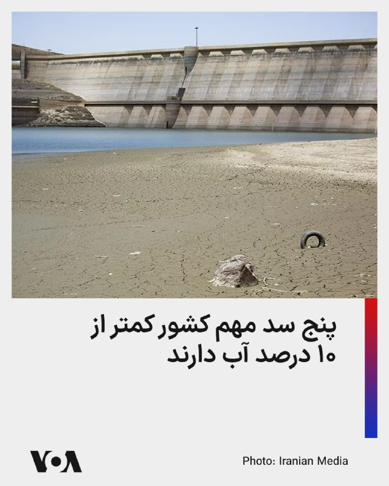

بر اساس آمار شرکت مدیریت منابع آب ایران، ‌هم‌اکنون میزان پرشدگی پنج صد مهم کشور از جمله «سدهای لار، دوستی، پانزدهم خرداد، بارزو و ساوه» کمتر از ۱۰ درصد است.

خبرگزاری ایسنا با تحلیل این آمار، اعلام کرد که علیرغم افزایش موجودی مخازن سدهای غربی، استان‌های تهران، مرکزی، خراسان رضوی، قم، اصفهان، زنجان و همدان در وضعیت نامطلوبی قرار دارند.

بر این اساس تامین آب شرب در شهرهای تهران، کرج، مشهد، اراک، قم، اصفهان، یزد، زنجان و همدان، با محدودیت مواجه است.

پیشتر علیرضا شریعت، دبیرکل فدراسیون صنعت آب ایران، هشدار داده بود که در صورت عدم کاهش مصرف، با بحران مهاجرت اجباری ۱۵ میلیون نفر در فلات مرکزی ایران مواجه خواهیم شد.

فلات مرکزی ایران شامل هفت استان کرمان، فارس، اصفهان، یزد، مرکزی، قم و سمنان می‌شود.
@FarsiVOA

## FarsiVOA — post 218589

🔺عبور محدود تانکرهای نفت و گاز از هرمز؛ قطر محموله‌های گاز را راهی پاکستان و چین کرد

◾️دو کشتی حامل گاز طبیعی مایع، ال‌ان‌جی، روز دوشنبه از تنگه هرمز خارج شده و به سوی پاکستان و چین در حرکت‌اند.

◾️همزمان، یک ابرنفتکش حامل نفت خام عراق نیز پس از نزدیک به سه ماه توقف در خلیج فارس، از هرمز عبور کرده و راهی چین شده است.

⬇️ بیشتر بخوانید:
https://ir.voanews.com/a/8153574.html

## FarsiVOA — post 218588

🔺روبیو: هیچ‌کس به اندازه ترامپ در مورد تهدید هسته‌ای ایران جدی نبوده است

◾️مارکو روبیو، وزیر خارجه آمریکا، اعلام کرد که واشنگتن با تهران به یک توافق خوب خواهد رسید یا به «شیوه‌ای دیگر» با جمهوری اسلامی برخورد خواهد کرد.

◾️روبیو تصریح کرد که هیچ کس به اندازه دونالد ترامپ، رئیس‌جمهوری آمریکا نسبت به تهدید هسته‌ای حکومت ایران جدی نبوده است.

◾️او همچنین پیش از ترک هند به خبرنگاران گفت که آمریکا پیش از بررسی «گزینه‌های جایگزین»، به دیپلماسی تمام فرصت برای موفقیت را خواهد داد.

⬇️ بیشتر بخوانید:
https://ir.voanews.com/a/8153575.html

## FarsiVOA — post 218587

  

مارکو روبیو، وزیر امور خارجه آمریکا، اعلام کرد که توافقی برای پایان دادن به جنگ علیه جمهوری اسلامی ممکن است «امروز» حاصل شود و افزود که اسرائیل حق دارد از خود در برابر حمله دفاع کند.

آقای روبیو که در پایان یک سفر رسمی، دهلی‌نو، پایتخت هند را ترک می‌کرد، به خبرنگاران گفت: «فکر می‌کردیم شاید دیشب خبری داشته باشیم، شاید امروز.»

او افزود: «ما چیزی را روی میز داریم که به نظر من، در مورد توانایی آن‌ها برای باز کردن تنگه‌ها و باز نگه داشتن تنگه‌ها، کاملا محکم است.»

روبیو همچنین ابراز اطمینان کرد که حکومت ایران «وارد یک مذاکره واقعی، مهم و زمان‌محدود درباره مسئله هسته‌ای خواهد شد.»

روز یکشنبه، دونالد ترامپ، رئیس‌جمهور آمریکا، اعلام کرد که به مذاکره‌کنندگان خود گفته است «عجله نکنند.»
@FarsiVOA

## FarsiVOA — post 218586

  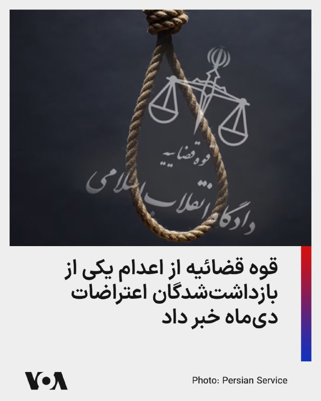

🔺اعدام یکی از بازداشت‌شدگان دی‌ماه، همزمان با هشدارها درباره موج تازه احکام امنیتی

◾️قوه قضائیه اعلام کرد حکم اعدام عباس اکبری فیض‌آبادی، از بازداشت‌شدگان رویدادهای دی ۱۴۰۴ در نائین، اجرا شده است.

◾️آقای اکبری به «محاربه، تخریب عمدی اموال عمومی، اخلال در نظم و امنیت جامعه و اجتماع و تبانی علیه امنیت داخلی» متهم و ادعا شده در جریان حمله به فرمانداری نائین، با کلت کمری به سوی مأموران شلیک کرده است.

◾️با این حال، جزئیات مستقلی درباره روند دادرسی، نحوه دسترسی به وکیل، امکان دفاع مؤثر، بررسی ادعای احتمالی فشار در بازجویی و راستی‌آزمایی مستقل ادله منتشر نشده است.

◾️همچنین روشن نیست فیلم، گزارش انتظامی و اقرارهای مورد استناد دادگاه، در روندی علنی و قابل بررسی ارزیابی شده‌اند یا نه.

⬇️ بیشتر بخوانید:
https://ir.voanews.com/a/8153572.html

## FarsiVOA — post 218585

🔺آمریکا با اشاره به اقدامات حکومت ایران از عدم اجماع در کنفرانس منع گسترش سلاح‌های هسته‌ای ابراز تأسف کرد

◾️ایالات متحده با ابراز تأسف از ناکامی «کنفرانس بررسی ۲۰۲۶ معاهده منع گسترش سلاح‌های هسته‌ای» در دستیابی به اجماع بر سر سند نهایی، اعلام کرد ناتوانی برخی کشورهای عضو در جدی گرفتن تهدید جمهوری اسلامی ایران علیه نظام جهانی منع اشاعه تسلیحات کشتار جمعی، در تعاملات آینده واشنگتن مورد توجه قرار خواهد گرفت.

⬇️ بیشتر بخوانید:
https://ir.voanews.com/a/8153571.html
@FarsiVOA

## FarsiVOA — post 218584

  

⚡️در پی خوش‌بینی‌های بازار نفت نسبت به نزدیک‌تر شدن ایالات متحده و جمهوری اسلامی به یک توافق صلح، قیمت نفت در معاملات روز دوشنبه (به وقت شرق آسیا) به پایین‌ترین سطح خود در دو هفته گذشته رسید. این کاهش قیمت در حالی است که دو طرف همچنان بر سر مسائل مهمی، از جمله وضعیت تنگه هرمز که همچنان عرضه نفت از خاورمیانه را مختل می‌کند، اختلاف دارند. به گزارش رویترز، قیمت نفت خام برنت تا ساعت ۲۲:۳۴ به وقت گرینویچ با کاهش ۴ دلار و ۷۱ سنتی (۴.۵۵ درصد) به ۹۸ دلار و ۸۳ سنت در هر بشکه رسید. نفت خام وست تگزاس اینترمدیت آمریکا نیز با ۴ دلار و ۵۷ سنت کاهش، معادل ۴.۷۳ درصد، به قیمت ۹۲ دلار و ۳ سنت در هر بشکه رسید.
@FarsiVOA

## DW_Farsi — post 125111

  

🔶 قوه قضائیه عباس اکبری را به اتهام "لیدری مسلحانه" اعتراضات دی‌ماه اعدام کرد

خبرگزاری میزان، وابسته به قوه قضائیه جمهوری اسلامی، از اعدام عباس اکبری فیض‌آبادی در بامداد دوشنبه چهارم خرداد (۲۵ مه) به اتهام "لیدری مسلحانه و تیراندازی به سوی نیروهای حافظ امنیت" خبر داد.

در این گزارش ادعا شده که عباس اکبری "یکی از لیدر‌های مسلح" اعتراضات در شهرستان نائین اصفهان بوده و "نقش مهمی در حمله به فرمانداری شهرستان و مراکز تأمین امنیت و همچنین مراکز خدماتی" داشته است.

میزان مدعی شده است که عباس اکبری "بر اساس اسناد و تصاویر موجود در پرونده، به‌صورت مسلح در خیابان حضور یافته و اقدام به تیراندازی به سمت ماموران حافظ امنیت" کرده است.

این خبرگزاری همچنین ویدیویی منتسب به عباس اکبری با عنوان "تصاویر دوربین مدار بسته از تیر اندازی، حمله و تخریب اماکن" منتشر کرده است.

جزئیات بیشتری درباره این پرونده و روند رسیدگی به آن منتشر نشده، اما "کشف اسلحه از منزل متهم و اقرارهای او" علت "محرز شدن بزهکاری او" عنوان شده است.

از عباس اکبری هیچ عکسی منتشر نشده است.
@dw_farsi

## DW_Farsi — post 125110

  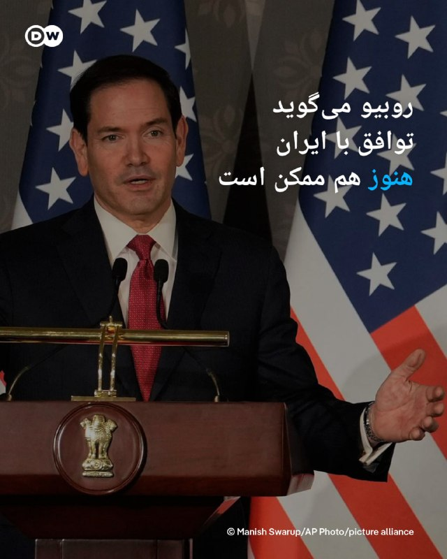

🔶 روبیو می‌گوید توافق با ایران هنوز هم ممکن است

مارکو روبیو، وزیر امور خارجه ایالات متحده، می‌گوید که توافق برای پایان دادن به جنگ با ایران می‌تواند "امروز" [دوشنبه] محقق شود. روبیو در دهلی نو با اشاره به توافق احتمالی گفت: «ما فکر می‌کردیم که دیشب، شاید امروز، خبری داشته باشیم، من زیاد در مورد آن نظر نمی‌دهم.»

او روز دوشنبه ۲۵ مه (۴ خرداد) هنگام ترک پایتخت هند در جریان یک سفر رسمی چهار روزه به این کشور به خبرنگاران گفت: «ما آن چیزی را که فکر می‌کنم برای باز کردن تنگه‌ روی میز مذاکره لازم است، داریم.»

«این [توافق] در خلیج فارس حمایت زیادی دارد... هر کشوری که ما با او [از این پروسه] عبور کرده‌ایم، می‌داند که این [توافق] نه تنها بسیار منطقی است، بلکه کار درستی است که جهان باید انجام دهد.»

روبیو همچنین ابراز اطمینان کرد که ایران "وارد یک مذاکره بسیار واقعی، مهم و با محدودیت زمانی در مورد موضوع هسته‌ای خواهد شد".

اظهارات روبیو پس از آن مطرح شد که دونالد ترامپ، رئیس جمهور آمریکا، انتظارات از یک توافق را تعدیل کرد و گفت که به مذاکره‌کنندگانش گفته است که "عجله نکنند".
@dw_farsi

## DW_Farsi — post 125109

  

🔶 دفاع ترامپ از توافق با ایران: توافق بد نمی‌کنم

دونالد ترامپ، رئیس جمهور آمریکا، شامگاه یکشنبه ۲۴ مه (۳ خرداد) در پستی در تروث سوشال، نوشت توافق برای پایان دادن به جنگ "هنوز به طور کامل مذاکره نشده است. "

او همچنین به افرادی که "از چیزی که هیچ چیز درباره آن نمی‌دانند، انتقاد می‌کنند" حمله کرد.

پس از انتشار خبر احتمال یک توافق با ایران، ترامپ با انتقاد دموکرات‌ها و همچنین اعضای حزب خود مواجه شد.

او با تاکید بر اینکه "توافق بد" نمی‌کند، نوشت: «اگر من با ایران توافقی انجام دهم، توافقی خوب و مناسب خواهد بود، نه مانند توافقی که اوباما انجام داد و به ایران مقادیر زیادی پول نقد و مسیری روشن و باز به سوی سلاح هسته‌ای داد. توافق ما دقیقاً برعکس است، اما هیچ کس آن را ندیده یا نمی‌داند چیست. هنوز حتی به طور کامل مذاکره نشده است. بنابراین به بازندگان گوش ندهید که از چیزی که هیچ چیز در مورد آن نمی‌دانند انتقاد می‌کنند.»
@dw_farsi

## Persian_Trend_Official — post 14906

  <a href="telegram/content/Persian_Trend_Official_14906_1779689914.mp4" target="_blank">🎬 Download video</a>

💢حزب‌الله فیلمی منتشر کرد که هدف قرار دادن یک تانک مرکاوا اسرائیلی در شهر طیبه، جنوب لبنان، توسط یک پهپاد ابابیل را نشان می‌دهد

🫆:Tony

📌 @persian_trend_official
پرشین ترند | متفاوت‌ترین کانال نظامی

## Persian_Trend_Official — post 14905

  

صبحتون بخیر ☕️🤍

📝 Nick
📌 @persian_trend_official
پرشین ترند | متفاوت‌ترین کانال نظامی

## Persian_Trend_Official — post 14904

  <a href="telegram/content/Persian_Trend_Official_14904_1779689915.mp4" target="_blank">🎬 Download video</a>

🔴ویدئویی از مقیاس ساخت فرودگاه اتیوپی، رسانه‌های اجتماعی را شوکه کرد

💢 انتظار می‌رود فرودگاه بیشوفتو، در حومه پایتخت اتیوپی، به یکی از بزرگترین قطب‌های لجستیک جهان تبدیل شود و سالانه 110 میلیون مسافر را جابجا کند.

💢 ساخت و ساز در ژانویه 2026 آغاز شد و انتظار می‌رود فاز اول آن تا سال 2030 تکمیل شود.

🫆:Tony

📌 @persian_trend_official
پرشین ترند | متفاوت‌ترین کانال نظامی

## Persian_Trend_Official — post 14903

  <a href="telegram/content/Persian_Trend_Official_14903_1779689916.webm" target="_blank">🎬 Download video</a>

🔴فاکس‌نیوز مدعی «پیشرفت ۹۵ درصدی تفاهم اولیه بین ایران و آمریکا» شد

♦️شبکه آمریکایی فاکس‌نیوز مدعی شد که تفاهم اولیه درباره حدود ۹۵ درصد مفاد یک توافق‌نامه حاصل شده است.

🫆:Tony

📌 @persian_trend_official
پرشین ترند | متفاوت‌ترین کانال نظامی

## RadioFarda — post 157529

  

🔸رسانه‌ها در ایران روز یک‌شنبه سوم خرداد خبر دادند که دادگاه انقلاب تهران برای چهار نفر از متهمان پرونده اکباتان حکم اعدام صادر کرده است.

🔸بر اساس گزارشی که به‌صورت یکسان در این رسانه‌ها منتشر شد، حکم جدید مربوط به «رسیدگی موازی» در دادگاه انقلاب تهران است و این دادگاه «با توجه به جمیع اوراق و محتویات پرونده، شکایت اولیای دم شهید، گزارش مرکز تشخیص هویت پلیس آگاهی تهران، نظریه پزشکی قانونی و اظهارات متهمان، متهمان ردیف اول تا چهارم پرونده را بابت اتهام افساد فی‌الارض به مجازات اعدام محکوم کرد.»

🔸در این گزارش‌ هم‌چنین آمده که «متهمان ردیف پنجم تا نهم نیز بابت اتهام اجتماع و تبانی برای ارتکاب جرم علیه امنیت داخلی کشور و اتهام فعالیت تبلیغی علیه نظام جمهوری اسلامی ایران به حبس از یک تا پنج سال و مجازات‌های تکمیلی محکوم شدند.»

🔸گفته شده که این حکم قابل فرجام خواهی و ارجاع به دیوان عالی کشور است.

@RadioFarda

## RadioFarda — post 157528

  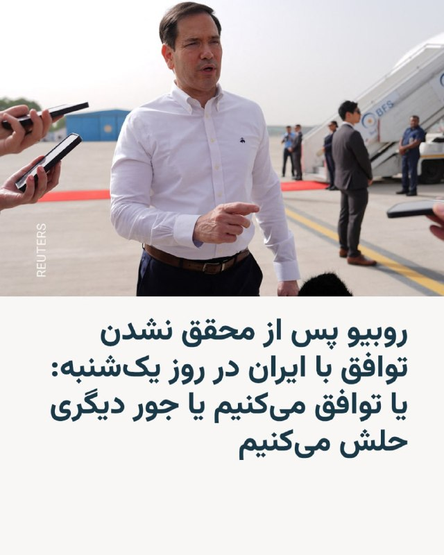

🔸وزیر خارجه ایالات متحده، روز دوشنبه چهارم خرداد گفت که واشینگتن در مذاکرات جاری خود با ایران، «هر فرصتی برای موفقیت» به دیپلماسی خواهد داد.

🔸مارکو روبیو که اکنون در هند به‌سر می‌برد در جمع خبرنگاران گفت که مذاکرات با ایران همچنان «در حال پیشرفت» است و خوش‌بینی محتاطانه‌ای نسبت به توافق احتمالی برای بازگشایی مسیرهای کلیدی کشتیرانی و از سرگیری مذاکرات هسته‌ای ابراز کرد.

🔸او که روز گذشته از احتمال توافق با ایران تا پایان روز یک‌شنبه خبر داده بود، گفت: «همه ما باید مطمئن باشیم که یا به یک توافق خوب خواهیم رسید، یا مجبور می‌شویم به شکل دیگری با این مسئله برخورد کنیم. ترجیح ما این است که یک توافق خوب داشته باشیم.»

🔸دونالد ترامپ، رئیس‌جمهور آمریکا نیز شامگاه یک‌شنبه در دومین پیام خود درباره روند مذاکرات با ایران اطمینان داد که توافق احتمالی با ایران «خوب و درست» خواهد بود اما هیچ کس درباره محتوای آن اطلاع ندارد.

@RadioFarda

## RadioFarda — post 157527

  

🔸خبرگزاری میزان، وابسته به قوه قضاییه، صبح روز دوشنبه چهارم خرداد از اعدام عباس اکبری، از بازداشت‌شدگان اعتراضات ۱۴۰۴ در اصفهان، خبر داد.

🔸در گزارش میزان این معترض با نام کامل «عباس اکبری فیض‌آبادی» و «یکی از لیدرهای مسلح» در اعتراضات شهرستان نائین معرفی و گفته شده که او «نقش مهمی در حمله به فرمانداری شهرستان و مراکز تأمین امنیت و همچنین مراکز خدماتی» داشته است.

🔸میزان اتهامات آقای اکبری را «محاربه، تخریب عمدی اموال عمومی به قصد مقابله با نظام و اخلال در نظم و امنیت جامعه، اجتماع و تبانی برای ارتکاب جرم علیه امنیت داخلی» اعلام کرده و مدعی شده که او با کلت کمری جنگی اقدام به تیراندازی در خیابان کرده است.

🔸ایران در ماه‌های اخیر با موج تازه‌ای از اعدام‌ها، بازداشت‌ها و صدور احکام سنگین روبه‌رو بوده است؛ موجی که به گفتهٔ نهادها و سازمان‌های حقوق بشری، در فضای جنگ، بحران امنیتی و اعتراضات، به‌عنوان ابزاری برای ایجاد ترس و کنترل جامعه عمل می‌کند.

@RadioFarda

## RadioFarda — post 157526

  <a href="https://t.me/radiofarda/157526" target="_blank">📎 Download file</a>

📻بشنوید: سرخط خبرها با رادیوفردا، چهارم خرداد ۱۴۰۵‌

@RadioFarda

## IranianMinds — post 20704

  

⚫️ جمهوری اسلامی یکی دیگه از هموطن هامونو هم امروز کشت. خبرگزاری قوه قضائیه جمهوری اسلامی اعلام کرد مجتبی کیان امروز صبح به دلیل ارسال پیام و دادن مختصات صنایع نظامی به شبکه های ماهواره ای معاند ( ایران اینترنشنال ) اعدام شد. @IranianMinds

## IranianMinds — post 20703

  

🔴 سی بی اس نیوز :

مجتبی خامنه ای ، رهبر‌ جمهوری اسلامی در مکانی نامعلوم پنهان شده و بر ارساس ارزیابی اطلاعاتی آمریکا دسترسی خیلی کمی به دنیای بیرون داره و‌ با افراد خیلی کمی هم در ارتباطه .

@IranianMinds

## BBCPersian — post 281984

  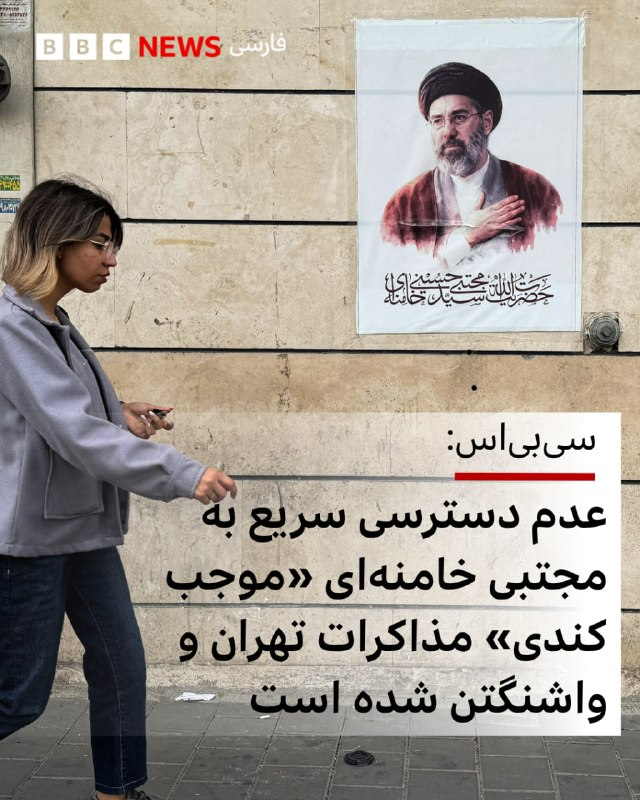

🔻شبکه خبری سی‌بی‌اس که شریک کاری بی‌بی‌سی در آمریکاست روز یکشنبه در گزارشی نوشت «اطلاعات دستگاه‌های اطلاعاتی آمريکا نشان می دهد رهبر جمهوری اسلامی ايران عملا در مکانی نامعلوم پنهان شده و دسترسی بسيار محدودی به دنيای خارج دارد و ارتباط با او تنها از طريق شبکه‌ای پيچيده از پيام‌رسان‌ها امکان پذير است.»

به گزارش سی‌بی‌اس، این دسترسی دشوار یکی از علل کندی نهایی شدن جزییات توافق احتمالی میان ایران و واشنگتن شده است.

با اين حال، سی‌بی‌اس نوشته يک مقام ارشد دولت آمريکا روز يکشنبه به این شبکه گفته مجتبی خامنه‌ای، رهبر جدید جمهوری اسلامی با چارچوب کلی پيش‌نويس توافق کنونی موافقت کرده است.

روز یکشنبه دونالد ترامپ نيز در پيامی در شبکه تروث سوشال نوشت انتظار دارد تصميم نهايی ظرف چند روز آينده اعلام شود.

📸AFP via Getty Images
https://bbc.in/4nKbM0O
@BBCPersian

## BBCPersian — post 281983

  

🔻مارکو روبیو، وزیر خارجه آمریکا، گفته است که توافق میان تهران و واشنگتن «هنوز در حال پیشرفت است» و دونالد ترامپ، رئیس‌جمهور آمریکا «عجله‌ای برای رسیدن به توافق ندارد.»

او پیش از ترک دهلی‌نو گفت در حال حاضر «یک پیشنهاد کاملا محکم» برای رسیدن به توافق داریم که با باز شدن تنگه هرمز می‌توانیم وارد «یک مذاکره بسیار واقعی، مهم و با محدودیت زمانی در مورد مسائل هسته‌ای» بشویم.

آقای روبیو گفت: «این طرح در خلیج فارس و در سطح جهانی نیز حمایت زیادی دارد» و هر کشوری که ما با آنها ارتباط داریم «می‌داند که این نه تنها بسیار منطقی است، بلکه کار درستی است که جهان باید انجام دهد.»

به گفته وزیر خارجه آمریکا، دونالد ترامپ «قرار نیست توافق بدی انجام دهد، بنابراین بیایید ببینیم چه اتفاقی می‌افتد. ما قبل از بررسی گزینه‌های دیگر، به دیپلماسی هر فرصتی برای موفقیت می‌دهیم.»

او تاکید کرد که «یا توافق خوبی خواهیم داشت، یا باید به روش دیگری با این مسئله برخورد کنیم و ما ترجیح می‌دهیم توافق خوبی داشته باشیم.»
ادامه مطلب⬇️

📸AFP via Getty Images
https://bbc.in/3S079Uz
@BBCPersian

## BBCPersian — post 281982

  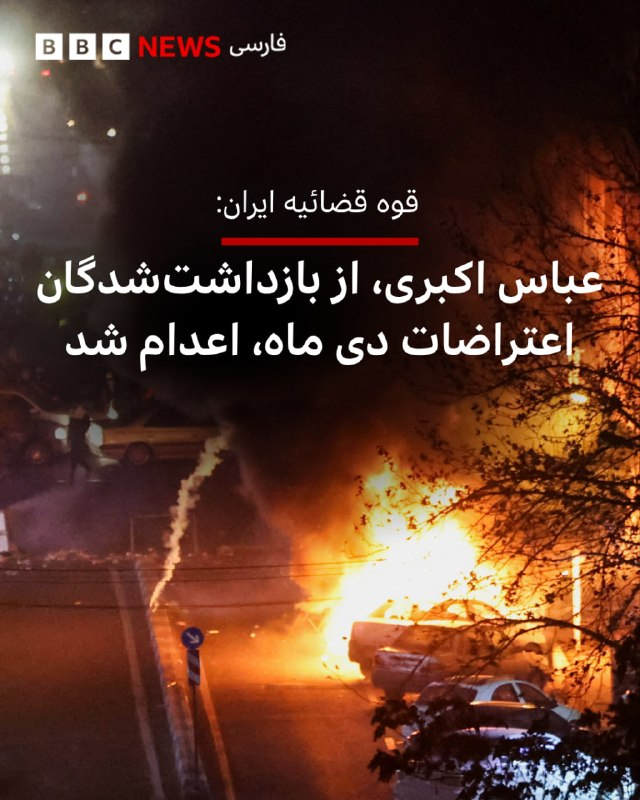

خبرگزاری‌های رسمی در ایران از اجرای حکم اعدام عباس اکبری در بامداد روز دوشنبه خبر دادند و از او به عنوان «لیدر مسلح کودتای دی» نام برده‌اند.
خبرگزاری میزان، رسانه رسمی قوه‌قضاییه ایران، صبح دوشنبه - ۴ خرداد نوشت: «عباس اکبری فیض‌آبادی یکی از لیدرهای مسلح اغتشاشات در شهرستان نائین اصفهان بود که نقش مهمی در حمله به فرمانداری شهرستان و مراکز تأمین امنیت و همچنین مراکز خدماتی داشت.»
این خبرگزاری به اتهام اصلی عباس اکبری در پرونده اشاره کرده و‌آن را «شلیک به سوی ماموران» عنوان کرده است اما جزییاتی از فرد یا افرادی که احتمالا قربانی یا مجروح این «تیراندازی» شده‌اند، منتشر نکرده است.

نهادهای حقوق بشر از دادرسی‌های ناعادلانه و نقض حقوق متهم و موج اعدام‌ بر اساس «اعترافات» زیر شکنجه و فشار ابراز نگرانی کرده‌اند.

از شروع جنگ آمریکا و اسرائیل با ایران، دستگاه قضائی ایران حدود ۳۰ نفر را با اتهام‌های مختلف اعدام کرده است.
📷Reuters

https://bbc.in/49liIfb
@BBCPersian

## BBCPersian — post 281981

قيمت نفت به شدت کاهش يافته و بازارهای سهام آسيايی در پی اميدها به توافقی که می‌تواند به جنگ ميان آمريکا، اسرائيل و ايران پايان دهد، صعود کرده‌اند.

دونالد ترامپ، رئيس جمهوری آمريکا، روز شنبه گفت توافق با تهران «تا حد زيادی مذاکره شده» و جزئيات آن به زودی اعلام خواهد شد، اما يک روز بعد از تيم مذاکره کننده خود خواست برای رسيدن به توافق عجله نکنند.

صبح دوشنبه در آسيا، نفت برنت، شاخص جهانی نفت، با کاهش ۵ درصدی به ۹۸ دلار و ۳۶ سنت رسيد، در حالی که نفت خام معامله شده در آمريکا با افت ۵/۳ درصدی به ۹۱ دلار و ۵۰ سنت کاهش يافت.

آقای ترامپ پيشتر گفته بود اين توافق شامل بازگشايی تنگه راهبردی هرمز خواهد بود، اما جزئيات بيشتری ارائه نکرد.

اين آبراه باريک که معمولا حدود يک پنجم نفت و گاز طبيعی مايع جهان از آن عبور می کند، از زمان آغاز درگيری ها در ۲۸ فوريه عملا بسته شده است.

شاخص نيکی ۲۲۵ ژاپن نيز با افزايش ۲.۵ درصدی برای نخستين بار از سطح ۶۵ هزار واحد عبور کرد؛ افزايشی که ناشی از اميدها به بازگشايی قريب الوقوع تنگه هرمز عنوان شده است.

ژاپن، مانند کره جنوبی، به دليل وابستگی شديد به انرژی وارداتی از خليج فارس، به طور ويژه از اين درگيری ها آسيب ديده است.

بازارهای انرژی و مالی بريتانيا و آمريکا روز دوشنبه به دليل تعطيلات رسمی بسته هستند.
https://bbc.in/3RrLdl7
@BBCPersian

## BBCPersian — post 281980

  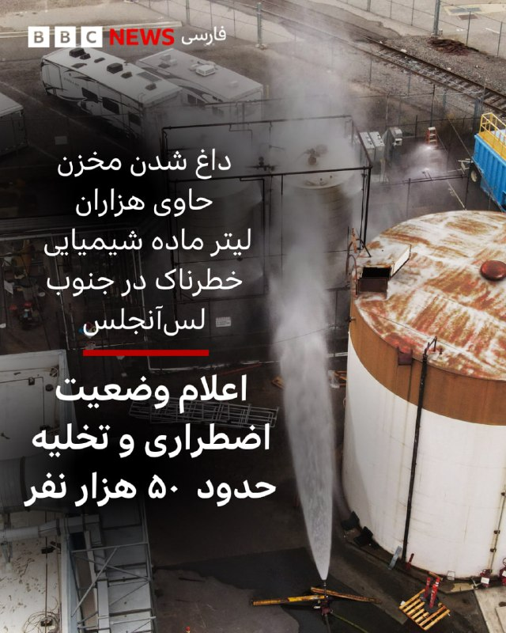

‌
در حالیکه ماموران آتش‌نشانی در منطقه اورنج کانتی در جنوب لس‌آنجلس با پاشیدن آب در تلاش برای خنک کردن یک مخزن حاوی مواد شیمیایی هستند، مسئولان از پیدا شدن یک شکاف در این مخزن خبر دادند. این مخزن در یک مرکز هوافضا قرار دارد و از چند روز پیش دمای آن به طرز غیرعادی رو به افزایش گذاشت.

گوین نیوسام، فرماندار کالیفرنیا وضعیت اضطراری اعلام کرده است.

از روز جمعه گزارش شد که این مخزن که حاوی بیش از ۲۶ هزار لیتر ماده متیل متا آکریلات است، به شدت در حال داغ شدن است. این ماده‌ بسیار فرار و قابل اشتعال که برای ساخت پلاستیک استفاده می‌شود،‌ در صورت انتشار در هوا می‌تواند مشکلات جدی تنفسی ایجاد کند.

در یک اقدام احتیاطی،‌ دستور تخلیه هزاران نفر از ساکنان شهر گاردن گروو صادر شده است و پس از اینکه مسئولان هشدار دادند که انفجار این مخزن می‌تواند باعث ایجاد یک توده سمی در هوا شود،‌ حدود ۵۰ هزار نفر مجبور به ترک خانه‌های خود شدند.

سخنگوی اداره آتش‌نشانی اورنج کانتی گفت که وجود این شکاف می‌تواند باعث کاهش فشار مخزن شود و خطر وقوع یک انفجار بزرگ را کمتر کند.

📷Reuters
@BBCPersian

## BBCPersian — post 281979

یک روز پس از آنکه شلیک چندین گلوله در نزدیکی کاخ‌سفید خبرساز و اعلام شد که مهاجم مسلح با شلیک ماموران مخفی کشته شده است، رسانه‌ها آمریکایی از هویت و تاریخچه مهاجم خبر دادند.

شبکه سی‌بی‌اس، شریک رسانه‌ای بی‌بی‌سی در آمریکا، مظنون تیراندازی را «ناصر بست» ۲۱ ساله معرفی کرد؛ فردی که برای نهادهای امنیتی شناخته‌شده بود و سابقه ثبت‌شده مشکلات سلامت روان داشت.

صدای تیراندازی اندکی پس از ساعت ۱۸ به وقت محلی (۲۳:۰۰ به وقت گرینویچ) روز شنبه - دوم خرداد - شنیده شد؛ به‌طوری که خبرنگارانی که بیرون کاخ سفید مشغول فیلم‌برداری بودند، خود را به زمین انداختند و برای در امان ماندن به داخل ساختمان پناه بردند.

ماموران سرویس مخفی آمریکا که در گوشه خیابان مستقر بودند، به تیراندازی پاسخ دادند و مهاجم را هدف قرار دادند.

فرد مهاجم سپس به بیمارستان منتقل شد، اما در آنجا مرگ او اعلام شد.

در این تیراندازی، یک رهگذر نیز زخمی شد، اما سرویس مخفی جزئیات بیشتری درباره وضعیت او ارائه نکرد. همچنین هیچ‌یک از ماموران در این حمله زخمی نشدند.

به گفته منابع آگاه، او در جریان تیراندازی از یک هفت‌تیر استفاده کرده بود.

یک منبع آگاه از روند تحقیقات به شبکه سی‌بی‌اس گفت ناصر بست پیش‌تر در ژوئیه ۲۰۲۵ تلاش کرده بود وارد کاخ سفید شود و پس از بازداشت توسط ماموران در نزدیکی این ساختمان، مدتی را در یک مرکز روان‌پزشکی سپری کرده بود.

بر اساس این گزارش، او طی ۱۸ ماه گذشته در واشینگتن دی‌سی زندگی می‌کرد.

https://bbc.in/3RrLdl7
@BBCPersian

## BBCPersian — post 281978

  

رسانه‌ها در ایران در خبری مبهم از صدور حکم دیگری برای متهمان پرونده قتل آرمان علی‌وردی، طلبه بسیجی، در جریان اعتراضات سال ۱۴۰۱ خبر داده‌اند که این بار در جریان یک «محاکمه موازی» در دادگاه انقلاب تهران روی داده است.

خبرگزاری‌های ایران روز یکشنبه نوشته‌اند این دادگاه برای ۴ نفر از متهمان این پرونده حکم اعدام صادر کرده و برای دیگر متهمان احکامی بین یک تا پنج سال زندان تعیین کرده است.
این در حالی است که چند روز پیش گزارش شد دادگاه تجدیدنظر در حکمی درباره متهمان این پرونده گفته است میلاد آرمون، علیرضا کفایی، امیرمحمد خوش اقبال به پنج سال حبس و پرداخت دیه محکوم شده‌اند.
همچنین حسین نعمتی به پرداخت دﯾﻪ ﺻﺪﻣﺎت به خانواده آرمان علی وردی محکوم شد اما به‌همراه نوید نجاران و علیرضا برمز پورناک از سایر اتهامات تبرئه شدند.

با این حال، روز یکشنبه - سوم خرداد - خبرگزاری‌های ایران در خبری با متن مشابه از صدور این حکم خبر دادند.

خبرگزاری‌های ایران از «رسیدگی موازی» این پرونده در دادگاه انقلاب تهران نوشتند.

آن‌طور که گزارش شده این حکم هم قابل فرجام خواهی است.
بیشتر بخوانید:

https://bbc.in/3RjDPZ8
@BBCPersian

## alonews — post 122468

  <a href="telegram/content/alonews_122468_1779689922.webm" target="_blank">🎬 Download video</a>

👈انتخابات هیئت رئیسه مجلس که از ساعت ۷:۳۰ صبح امروز آغاز شد، دقایقی پیش پایان یافت

🔴این انتخابات بصورت حضوری و با رای مستقیم نمایندگان برای انتخاب ۱۲ عضو هیئت رئیسه مجلس شامل یک رئیس، ۲ نایب رئیس، ۶ دبیر و ۳ ناظر بود.

✅ @AloNews خبر جنگ

## alonews — post 122467

  <a href="telegram/content/alonews_122467_1779689922.webm" target="_blank">🎬 Download video</a>

👈مارک لوین: ترامپ اعتقاد دارد که رژیم ایران را کاملا عوض کرده است

✅ @AloNews خبر جنگ

## alonews — post 122466

  <a href="telegram/content/alonews_122466_1779689922.webm" target="_blank">🎬 Download video</a>

👈عباس اکبری، یکی دیگر از معترضان بازداشت شده در دی ماه، امروز صبح اعدام شد

✅ @AloNews خبر جنگ

## alonews — post 122465

  <a href="telegram/content/alonews_122465_1779689922.webm" target="_blank">🎬 Download video</a>

👈ارتش اسرائیل: به ساکنان ۱۰ شهر در منطقه نبطیه، جنوب لبنان، هشدار تخلیه فوری داده شد

🔴اخطار شامل شهرک های نبطیه الطحطه، لویزه، سجد، عین قنا، حروف، کفارمان و زبدین است

✅ @AloNews خبر جنگ

## alonews — post 122464

  <a href="telegram/content/alonews_122464_1779689923.webm" target="_blank">🎬 Download video</a>

👈ارتش اسرائیل: یک هدف هوایی که از لبنان به سمت عرب العرمشه در جلیله شلیک شده بود، شناسایی، ارتباط قطع و حادثه پایان یافت

✅ @AloNews خبر جنگ

## alonews — post 122463

  <a href="telegram/content/alonews_122463_1779689923.webm" target="_blank">🎬 Download video</a>

👈 فایننشال تایمز: عصبانیت رئیس‌جمهور چین از «افزایش توان نظامی ژاپن» در حضور همتای آمریکایی‌اش

🔴 پاسخ ترامپ: ژاپن به دلیل تهدیدات کره شمالی، به دفاع قوی‌تری نیاز دارد

✅ @AloNews خبر جنگ

## alonews — post 122462

  <a href="telegram/content/alonews_122462_1779689923.webm" target="_blank">🎬 Download video</a>

👈علی قلهکی: تماسِ نتانیاهو با ترامپ کافی بود تا سیاستِ جدید آمریکا به «بدون گرد و غبار (خروجِ ۴۰۰کیلوگرم‌ اورانیوم)، بدونِ دلار (مُنتفی‌شدنِ آزادسازی اموال بلوکه شده ایران)» _No Dust, No Dollars_ بازگردد!

🔴آمریکا تصمیم گرفته دلاری از اموال بلوکه شده کشور را تا به «خواسته‌هایِ هسته ای آمریکا» تَن ندهیم، آزاد نکند!

✅ @AloNews خبر جنگ

## alonews — post 122461

  <a href="telegram/content/alonews_122461_1779689923.webm" target="_blank">🎬 Download video</a>

👈رویترز: رشد شاخص سهام در ژاپن در پی توافق احتمالی میان ایران و آمریکا، برای اولین بار از آستانه ۶۵ هزار واحد عبور کرد

✅ @AloNews خبر جنگ

## alonews — post 122460

  <a href="telegram/content/alonews_122460_1779689923.webm" target="_blank">🎬 Download video</a>

👈مدودف: اوکراین عامدانه به دنبال به راه انداختن حمله گسترده به اهدافی در کی‌یف است

✅ @AloNews خبر جنگ

## alonews — post 122459

  <a href="telegram/content/alonews_122459_1779689923.webm" target="_blank">🎬 Download video</a>

👈اکونومیست: گزارش‌ها حاکی از آن است که عربستان سعودی از دونالد ترامپ درخواست کرده است هرگونه حمله جدید به ایران را تا پس از حج به تعویق بیندازد.

🔴 همچنان ترس وجود دارد که اگر درگیری دوباره آغاز شود، زائران در آنجا گیر خواهند افتاد.

✅ @AloNews خبر جنگ

## alonews — post 122458

  <a href="telegram/content/alonews_122458_1779689923.mp4" target="_blank">🎬 Download video</a>

👈روبیو : باید به یک توافق خوب برسیم در غیر این صورت مجبور می‌شویم به شکل دیگری با ایران برخورد کنیم/ ما ترجیح می‌دهیم که توافق خوبی داشته باشیم

✅ @AloNews خبر جنگ

## alonews — post 122457

  <a href="telegram/content/alonews_122457_1779689925.webm" target="_blank">🎬 Download video</a>

👈رویترز مدعی شد: دو کشتی حامل نفت و گاز طبیعی، تنگه هرمز را به مقصد پاکستان و چین از طریق مسیری که ایران به کشتی‌ها دستور داده بود، ترک کردند

✅ @AloNews خبر جنگ

## alonews — post 122456

  <a href="telegram/content/alonews_122456_1779689925.webm" target="_blank">🎬 Download video</a>

👈 ادعای روبیو، وزیر خارجه آمریکا: امضای توافق با ایران روز دوشنبه همچنان امکان‌پذیر است

🔴پیش از اینکه گزینه‌های جایگزین را بررسی کنیم، هر فرصتی را به دیپلماسی خواهیم داد.

🔴 احتمال قوی برای ورود به مذاکرات زمان‌دار درباره پرونده هسته‌ای ایران وجود دارد.

✅ @AloNews خبر جنگ

## alonews — post 122455

  <a href="telegram/content/alonews_122455_1779689925.webm" target="_blank">🎬 Download video</a>

👈پاسخ رئیس کمیسیون امنیت ملی به تهدید اتمی ترامپ: قابلی نداشت!

✅ @AloNews خبر جنگ

---
📅 بروزرسانی: 1405/03/04 05:09
---

## VahidOOnLine — post 242045

  

♦️به گزارش دیلی‌میل، زمین های گلف دونالد ترامپ به عنوان پناهگاه او از فشارهای سیاسی واشنگتن عمل می‌کنند و بسیاری از تصمیم‌ها و ایده‌های غیرمنتظره او در همین فضا شکل می‌گیرند.
منابع می‌گویند برخی از طرح‌های مهم حتی در گفتگوهای غیررسمی روی زمین گلف به رئیس‌جمهور منتقل می‌شوند.
یکی از نمونه های اخیر، پیشنهاد تغییر نام اداره مهاجرت و گمرک آمریکا به نامی با عنوان «NICE» بود که گفته می شود یک حرفه ای گلف در جریان یک دور بازی با ترامپ مطرح کرد و او از آن خوشش آمد.
نمونه دیگر مربوط به یک جلسه غیررسمی در باشگاه گلف ترامپ بود که در آن طرحی درباره وام های ۵۰ ساله مسکن توسط یک مقام دولتی با استفاده از یک پوستر بزرگ به او ارائه شد.
گزارش می‌گوید ترامپ حدود ده دقیقه بعد تصویر آن را در شبکه اجتماعی خود منتشر کرد و این اقدام واکنش های منفی گسترده ای در حوزه مالی به همراه داشت.
به گفته منابع، افراد نزدیک به ترامپ و همراهان دائمی او در زمین گلف نقش مهمی در شکل گیری این گفتگوها دارند و زمان بندی و حالت روحی او در پذیرش ایده ها تاثیرگذار است.
گزارش همچنین به تجربه های پیشین رهبران خارجی مانند شینزو آبه اشاره می کند که از علاقه ترامپ به گلف برای پیشبرد گفتگوهای سیاسی و تجاری استفاده می کردند.
در مجموع، گزارش نتیجه می گیرد که زمین های گلف ترامپ نه تنها محل تفریح بلکه بخشی از فرآیند تصمیم گیری سیاسی او محسوب می شوند نیز به آن اشاره شد.
‌🇸🇦 Indypersian

🤖 @VahidOOnLine

## VahidOOnLine — post 242044

  

سناتور کریس مورفی، نماینده دموکرات مجلس سنای آمریکا، اعلام کرد اگر توافق با تهران واقعی باشد، از آن استقبال می‌کند.

او در شبکه اجتماعی ایکس عنوان کرد که با ادامه جنگ، «آمریکا ضعیف‌تر می‌شود» و نوشت: «پایان دادن به جنگ دراولویت است.»

مورفی با اشاره به گزارش‌های منتشر شده در مورد مفاد توافق احتمالی افزود: «ما میلیاردها دلار به ایران می‌دهیم تا به جایی که قبل از جنگ بودیم برگردیم. و گزارش‌ها حاکی از آن است که این توافق ممکن است حق ایران برای کنترل تنگه هرمز را تثبیت کند.»

او در مورد پرونده هسته‌ای جمهوری اسلامی نیز احتمال داد که تهران «تمام مسائل هسته‌ای را به تعویق می‌اندازد» و در خصوص احتمال لغو تحریم‌ها هم اضافه کرد که در این صورت،‌ «اهرم کمتری برای وادار کردن آن‌ها [جمهوری اسلامی] به دادن امتیاز بیشتر در مذاکرات آینده داریم.»

مورفی برخلاف سخنان دونالد ترامپ، رییس‌جمهوری آمریکا، در مورد نابودی توان نظامی جمهوری اسلامی، افزود: «ایران هنوز برنامه موشک‌های بالستیک و پهپاد خود را دارد. آنها هنوز نیروی دریایی دارند که می‌تواند تنگه هرمز را ببندد. یک رژیم تندرو هنوز در راس امور است.»
‌🏁 🇬🇧 IranintlTV

🤖 @VahidOOnLine

## VahidOOnLine — post 242043

  

♦️محمد سرافراز، رئیس پیشین سازمان صداوسیما و عضو کنونی شورای عالی فضای مجازی، یکشنبه سوم خردادماه در گفتگو با «روزنامه اینترنتی فراز» گفت بخشی از حاکمیت جمهوری اسلامی با الگوبرداری از مدل چین، به‌دنبال محدود کردن اینترنت جهانی برای عموم مردم و ارائه دسترسی کنترل‌شده فقط به گروه‌های خاص است.

سرافراز گفت تجهیزات لازم برای اجرای این مدل و «قطع دائمی اینترنت» از چین خریداری و وارد ایران شده است. او توضیح داد در الگوی مورد نظر برخی جریان‌ها، نیاز کاربران باید عمدتا از طریق شبکه‌ها و خدمات داخلی تامین شود و دسترسی به اینترنت جهانی به‌شدت محدود بماند.

او با اشاره به تجربه چین گفت در این کشور اینترنت جهانی برای عموم مردم عملا قطع یا به‌شدت کنترل می‌شود و تنها گروه‌های مشخصی به دسترسی گسترده‌تر دسترسی دارند. سرافراز همچنین از ساختاری با عنوان «سامانه نیکان» نام برد و گفت هدف چنین الگویی این است که «روایت حکومت» بر فضای اطلاع‌رسانی کشور حاکم شود.

عضو شورای عالی فضای مجازی همچنین برخی اپراتورهای حاضر در این شورا را از عوامل پشت پرده طرح موسوم به «اینترنت پرو» معرفی کرد و گفت ذی‌نفعان قطع اینترنت «یک روز فیلترشکن می‌فروشند و یک روز اینترنت پرو.»

همزمان، نت‌بلاکس اعلام کرد پس از ۸۶ روز قطعی اینترنت در ایران، در حالی‌که دسترسی عمومی به اینترنت جهانی در جریان مذاکرات صلح تا حد زیادی قطع شده، کاربران قرارگرفته در «فهرست سفید» تصویری مصنوعی از وضعیت زندگی در ایران به جهان خارج ارائه می‌کنند.
‌🇸🇦 Indypersian

🤖 @VahidOOnLine

## VahidOOnLine — post 242042

  

روزنامه نیویورک‌پست به نقل از «یک مقام ارشد دولت آمریکا» نوشت که نهایی شدن توافق صلح با حکومت ایران برای بازگشایی تنگه هرمز ممکن است تا یک هفته طول بکشد، اما اگر تهران به شرایط دونالد ترامپ متعهد نشود، ممکن است رییس‌جمهوری ایالات متحده، از آن خارج شود.

یک مقام ارشد آمریکا گفت پس از آن‌که ترامپ اعلام کرد مذاکرات بر سر جنگ و برنامه هسته‌ای تهران در مرحله نهایی خود قرار دارد، وضعیت حکومت ایران باعث شده است که روند نهایی به کندی پیش برود.

این منبع اشاره کرد که ممکن است چند روز طول بکشد تا توافق نهایی به دست مجتبی خامنه‌ای، رهبر جمهوری اسلامی، برسد.

در همین ارتباط، شماری از رسانه‌ها گزارش داده‌اند که او درمکانی نامعلوم مخفی شده و امکان دسترسی به او برای مقام‌‌های حکومت ایران دشوار است.

به نوشته نیویورک‌پست، مقام ارشد آمریکایی گفت بازگشایی واقعی تنگه هرمز و پایان محاصره بنادر ایران توسط آمریکا حدود هفت روز طول خواهد کشید و ایالات متحده تنها زمانی تحریم‌ها را لغو خواهد کرد که ایران اورانیوم غنی‌شده خود را تحویل دهد.
‌🏁 🇬🇧 IranintlTV

🤖 @VahidOOnLine

## VahidOOnLine — post 242041

  

وب‌سایت حقوق بشری هرانا گزارش داد که روح‌الله کرکی، زندانی سیاسی محبوس در زندان شیبان اهواز، به اعدام محکوم شد.

بر اساس این گزارش، چندی پیش، کیفرخواست پرونده کرکی بابت اتهامات «انتشار و افشای اسناد محرمانه»، «همکاری با سازمان مجاهدین خلق»، «جاسوسی برای اسرائیل و تبادل اطلاعات نظامی و امنیتی»، «توهین به مقدسات و مقامات» و «اقدام علیه امنیت ملی» صادر و به دادگاه کیفری دو اهواز ارجاع شده بود.

به نوشته هرانا، این زندانی سیاسی دهم مهر سال گذشته به زندان شیبان اهواز منتقل شد. او ۱۴ مرداد سال گذشته به دست نیروهای امنیتی در اندیمشک بازداشت شده بود.

این وب‌سایت اشاره کرد روح‌الله کرکی، برادر امین کرکی، از بازداشت‌شدگان اعتراضات سراسری دی‌ ۹۶ است، و افزود: «امین کرکی در فروردین ۹۷ پس از بازداشت مجدد، در شرایطی پرابهام درگذشت.»
‌🏁 🇬🇧 IranintlTV

🤖 @VahidOOnLine

## VahidOOnLine — post 242040

  <a href="telegram/content/VahidOOnLine_242040_1779673170.mp4" target="_blank">🎬 Download video</a>

♦️گارد ساحلی تایوان روز یکشنبه سوم‌ خردادماه، ویدیویی منتشر کرد که نشان می‌دهد یک کشتی گارد ساحلی چین پس از یک روز رویارویی پرتنش و دریافت هشدار رادیویی، آب‌های اطراف جزایر پراتاس را ترک کرده است.

در این ویدیو، شناور گشتی تایچونگ به کشتی چینی هشدار می‌دهد که «صلحی که چین تبلیغ می‌کند یک فریب است» و از آن می‌خواهد آب‌های اطراف جزایر پراتاس را ترک کند؛ در حالی که کشتی چینی مدعی است در حال انجام ماموریتی عادی بوده و پکن بر این جزایر حاکمیت دارد.

جزایر پراتاس میان جنوب تایوان و هنگ‌کنگ قرار دارند و به‌دلیل فاصله زیاد از خاک اصلی تایوان، از نگاه برخی کارشناسان امنیتی در برابر حمله احتمالی چین آسیب‌پذیر محسوب می‌شوند.
‌🇸🇦 Indypersian

🤖 @VahidOOnLine

## VahidOOnLine — post 242039

  

مسعود رسولی، دبیر انجمن صنعت بسته‌بندی گوشت و مواد پروتیینی، اعلام کرد که بازار تقاضا برای گوشت قرمز نسبت به سال گذشته حدود ۵۰ درصد کاهش یافته است.

او به دلایل این کاهش ۵۰ درصدی اشاره نکرد اما وب‌سایت اقتصاد آنلاین با اشاره به سخنان رسولی نوشت: «طی چند سال اخیر با کاهش قدرت خرید مردم سرانه مصرف گوشت کاهش یافته است.»

در همین ارتباط، برخی گزارش‌های منتشر شده در رسانه‌های ایران حاکی از افزایش بی‌سابقه اقلام خوراکی و مصرفی از آغاز سال تاکنون است.

مخاطبان ایران‌اینترنشنال نیز با ارسال پیام‌هایی نوشته‌اند نه‌تنها سفره‌ها کوچک شده، بلکه مردم از تامین ابتدایی‌ترین نیازهای زندگی‌شان درمانده‌اند.
‌🏁 🇬🇧 IranintlTV

🤖 @VahidOOnLine

## VahidOOnLine — post 242038

  

سایت «اویل پرایس» (قیمت نفت) گزارش داد که قیمت هر بشکه نفت خام «وست‌ تگزاس‌ اینترمیدیت» به ۹۱ دلار و ۶۹ سنت و قیمت هر بشکه نفت خام «برنت» به ۹۸ دلار و ۲۴ سنت کاهش یافته است.

این پایین‌ترین قیمت نفت طی دو هفته گذشته محسوب می‌شود.
‌🏁 🇬🇧 IranintlTV

🤖 @VahidOOnLine

## VahidOOnLine — post 242037

  

خبرگزاری رویترز گزارش داد که قیمت نفت به پایین ترین سطح خود در دو هفته اخیر رسید،‌ و نوشت خوش بینی‌ها نسبت به پیشرفت مذاکرات آمریکا و جمهوری اسلامی و احتمال بازگشایی تنگه هرمز باعث کاهش بیش از ۴ درصدی نفت برنت و نفت آمریکا شد.

به نوشته رویترز، با این حال تحلیلگران انتظار دارند که ماه ها طول بکشد تا جریان نفت از تنگه هرمز به حالت عادی برگردد و زیرساخت های آسیب دیده نفت و گاز ترمیم شوند.
‌🏁 🇬🇧 IranintlTV

🤖 @VahidOOnLine

## VahidOOnLine — post 242036

  

شبکه خبری العربیه گزارش داد مقام‌های دولت اقلیم کردستان عراق، از جمله مسرور بارزانی، نخست‌وزیر اقلیم، اعلام کردند که نمی‌دانند چه طرف‌هایی سلاح‌هایی را که از سوی ایالات متحده برای «مخالفان حکومت ایران» ارسال شده بود، دریافت کرده‌اند.

در این گزارش به نقل از مقام‌های اقلیم کردستان عراق آمده است: اقلیم کردستان ترجیح می‌دهد ایالات متحده یا دونالد ترامپ، رییس‌جمهوری آمریکا، مشخص کند این سلاح‌ها دقیقا به دست چه کسانی رسیده است.
‌🏁 🇬🇧 IranintlTV

🤖 @VahidOOnLine

## VahidOOnLine — post 242035

  <a href="telegram/content/VahidOOnLine_242035_1779673174.mp4" target="_blank">🎬 Download video</a>

بامداد یک‌شنبه سوم خرداد، روسیه حملات گسترده‌ای علیه اوکراین انجام داد و صدها پهپاد و ده‌ها موشک شلیک کرد.
ولودیمیر زلنسکی، رییس‌جمهوری اوکراین، از کشته شدن چهار نفر و زخمی شدن حدود ۱۰۰ نفر در این حملات به کی‌یف و مناطق اطراف آن خبر داد.
وزارت دفاع روسیه اعلام کرد در این حملات از موشک هایپرسونیک «اورشنیک» استفاده کرده است.
‌🏁 🇬🇧 IranintlTV

🤖 @VahidOOnLine

## VahidOOnLine — post 242034

  

شبکه خبری سی‌بی‌اس به نقل از مقام‌های آمریکایی گزارش داد هنگامی که ایالات متحده جزئیات پیشنهادی خود را برای تهران ارسال می‌کند، دشواری دسترسی به رهبر جمهوری اسلامی می‌تواند باعث شود واشینگتن با تأخیری قابل توجه پاسخ دریافت کند.

بنا بر این گزارش مقام‌های ایرانی که مجاز به همکاری با دولت ترامپ هستند، در برقراری ارتباط در درون ساختار حکومتی جمهوری اسلامی با مشکل مواجه شده‌اند؛ مسئله‌ای که به نوشته این شبکه، یکی از دلایل اصلی کندی در انتشار جزئیات توافق احتمالی با ایران و توافق‌های گذشته بوده است.

پیش‌تر یک مقام ارشد دولت آمریکا روز یکشنبه گفته بود مجتبی خامنه‌ای با کلیات پیش‌نویس توافق فعلی موافقت کرده است.

دونالد ترامپ، رییس‌جمهوری ایالات متحده، نیز در تروث‌سوشال اعلام کرد انتظار دارد نظر نهایی در چند روز آینده مشخص شود.

بر اساس گزارش سی‌بی‌اس، حتی مقام‌های ارشد حکومت ایران نیز از پیش نمی‌دانند خامنه‌ای کجاست و هیچ راه مستقیمی برای تماس با او ندارند.

در همین حال، سخنگوی کاخ سفید از اظهارنظر درباره اطلاعات مربوط به محل اقامت رهبر جمهوری اسلامی یا شیوه‌های ارتباطی حکومت ایران خودداری کرد.
https://iranintl
‌🏁 🇬🇧 IranintlTV

🤖 @VahidOOnLine

## VahidOOnLine — post 242033

  

♦️بلومبرگ به نقل از منابع اطلاعاتی آمریکا که نام آنها را اعلام نکرده گزارش داد که دشواری برقرای ارتباط با مجتبی خامنه‌ای، ممکن است اعلام توافق را به تاخیر بیاندازد. بر اساس این گزارش، رهبر سوم نظام که در سه ماه اخیر هیچ تصویر و حتی فایل صوتی از او منتشر نشده، در مکانی مخفی شده است که مذاکره‌کنندگان با آمریکا از‌ آن اطلاع ندارند و ارتباط با او فقط از طریق «پیک‌ها» ممکن است. پیش‌تر گفته شده بود که فقط احمد وحیدی، فرمانده سپاه با او در ارتباط است.
‌🇸🇦 Indypersian

🤖 @VahidOOnLine

## VahidOOnLine — post 242032

  

♦️به گزارش العربیه، گئورگیوس (جورج) دونیس، سرمربی تازه منصوب‌شده عربستان سعودی، فهرست اولیه ۳۰ نفره این کشور برای جام جهانی ۲۰۲۶ را اعلام کرد و قرار است ترکیب نهایی ۲۶ نفره «شاهین‌های سبز» اواخر هفته آینده تایید شود.
در صدر این فهرست، سالم الدوسری، کاپیتان تیم، سعود عبدالحمید مدافع مشغول بازی در فرانسه، و شماری از بازیکنان تیمی قرار دارند که در جام جهانی ۲۰۲۲ قطر به‌طور تاریخی آرژانتین را شکست داد.
الاهلی، قهرمان تازه لیگ قهرمانان آسیا، پنج بازیکن در این فهرست دارد و باشگاه‌هایی مانند القادسیه و نئوم اس‌سی نیز حضور پررنگ‌تری پیدا کرده‌اند؛ ترکیبی که به نوشته العربیه بیش از تغییرات ریشه‌ای، بر حفظ انسجام و تجربه بازیکنان لیگ حرفه‌ای عربستان تکیه دارد.
دونیس و بازیکنان عربستان پیش از آغاز مسابقات، اردوهای آماده‌سازی در نیویورک و تگزاس برگزار خواهند کرد و سپس در دیدارهای دوستانه مقابل اکوادور، پورتوریکو و سنگال به میدان می‌روند.
‌🇸🇦 Indypersian

🤖 @VahidOOnLine

## VahidOOnLine — post 242031

  

♦️به گزارش دیلی میل سناتورهای جمهوری‌خواه از جمله تد کروز و لیندزی گراهام در صدر فهرست جمهوری خواهانی قرار دارند که به شدت به توافق در حال شکل‌گیری دولت ترامپ با رژیم ایران انتقاد می کنند. آنها این توافق احتمالی را «اشتباه فاجعه‌بار» توصیف کردند و نسبت به امتیازدهی احتمالی به تهران هشدار دادند. این واکنش‌ها در حالی مطرح شد که دونالد ترامپ با مخالفت‌هایی در داخل حزب خود درباره چارچوب اولیه توافق مواجه شده است.
بر اساس گزارش‌ها، چارچوب پیشنهادی شامل بازگشایی تنگه هرمز، آتش‌بس ۶۰ روزه و ادامه مذاکرات درباره برنامه هسته‌ای ایران است، در حالی که جزئیات نهایی هنوز در حال مذاکره است. برخی جمهوری‌خواهان به این موضوع معترض‌اند که ایران ممکن است مجبور به تحویل فوری تمام مواد هسته‌ای موجود در داخل کشور نشود.
تد کروز هشدار داد اگر نتیجه توافق این باشد که ایران همچنان تحت حاکمیت اسلام‌گرایان با شعارهای ضدآمریکایی باقی بماند، میلیاردها دلار دریافت کند، به غنی‌سازی اورانیوم ادامه دهد و کنترل مؤثر تنگه هرمز را در اختیار داشته باشد، این نتیجه یک اشتباه فاجعه‌بار خواهد بود.
لیندزی گراهام نیز نسبت به مسیر مذاکرات ابراز تردید کرد و گفت توافقی که ایران را به قدرت مسلط منطقه تبدیل کند می‌تواند برای اسرائیل «کابوس» باشد. او همچنین این سؤال را مطرح کرد که اگر چنین برداشت‌هایی درست باشد، اساسا جنگ برای چه آغاز شده بود. در عین حال، او بعدا گفت ممکن است از توافق حمایت کند اگر به گسترش قابل توجه پیمان های ابراهیم و پیوستن کشورهایی مانند عربستان سعودی، قطر و پاکستان منجر شود و آن را اقدامی «تحول‌آفرین» توصیف کرد.
سناتورهای دیگری مانند راجر ویکر نیز آتش‌بس ۶۰ روزه را به شدت نقد کردند و گفتند دستاوردهای نظامی آمریکا ممکن است بی‌اثر شود. تام تیلیس نیز هشدار داد که پذیرش باقی ماندن مواد هسته‌ای در ایران و توافقی بدون تصویب کنگره، مشابه شکست توافق‌های گذشته خواهد بود.
بر اساس گزارش‌های تایید نشده، آمریکا و رژیم ایران به‌طور اصولی درباره بازگشایی تنگه هرمز و مدیریت ذخایر اورانیوم غنی‌شده به توافق رسیده‌اند، اما جزئیات نحوه اجرا هنوز روشن نیست و واکنش رسمی تهران نیز متناقض است.
ترامپ این توافق را متفاوت از توافق اوباما دانست و تأکید کرد تا نهایی شدن توافق، محاصره ایران ادامه خواهد داشت و از منتقدان در داخل حزب خود انتقاد کرد. مارکو روبیو، وزیر خارجه آمریکا نیز از رویکرد دولت دفاع کرد و گفت هدف جلوگیری از دستیابی ایران به سلاح هسته‌ای است
‌🇸🇦 Indypersian

🤖 @VahidOOnLine

## VahidOOnLine — post 242022

جاویدنامان انقلاب ملی ایرانیان؛
روایت جوانانی است که هرکدام در حال ساختن زندگی بودند؛ یکی پدر دو کودک بود، یکی رویای بازیگری داشت، یکی با موسیقی زندگی می‌کرد، یکی در زمین فوتبال می‌دوید و دیگری تازه وارد دانشگاه شده بود.
محمد خداپناه، حمیدرضا علیزاده، آریا هنرمند، حمیدرضا مجیدی، مسعود عیسوند جهانبخشی، شیوا جاوید، مهدی عبدلی و صابر آقابابایی
نام‌هایی که قرار بود بخشی از آینده این سرزمین باشند، اما جمهوری اسلامی آنان را با شلیک مستقیم، تیر خلاص، شکنجه و سرکوب از ایران گرفت.
فراموش نمی‌کنیم که پشت هر نام، یک زندگی جریان داشت، خانه‌هایی که ویران شدند، خانواده‌هایی که چشم‌انتظار ماندند و رویاهایی که پیش از رسیدن به آینده، در خیابان‌ها خاموش شدند.
#جاویدنامان_انقلاب_ملی_ایرانیان
‌🏁 🇬🇧 IranintlTV

🤖 @VahidOOnLine

## FoxNewsTwitter — post 342191

  <a href="telegram/content/FoxNewsTwitter_342191_1779673178.mp4" target="_blank">🎬 Download video</a>

Fox News (Twitter/X)

A graduation ceremony in Franklin, Tennessee turned into a soaking wet controversy after officials decided to keep the event outdoors during a torrential downpour.

Footage from the ceremony shows graduates crossing the stage in heavy rain while families sat drenched in the stands as the storm moved through the area.

Now some parents are demanding answers, saying students deserved better and arguing the conditions became unsafe.

## FoxNewsTwitter — post 342190

‌Fox News (Twitter/X)

Read more:

## FoxNewsTwitter — post 342189

  

Fox News (Twitter/X)

“They’re coming after your boy.”

Hasan Piker is lashing out after federal officials subpoenaed him as part of an investigation tied to recent activist trips to communist Cuba.

During a Twitch livestream, the left-wing political influencer claimed the probe is an “intimidation tactic” aimed at him for criticizing Israel and the United States, describing himself as a “loudmouth” and “rabble-rouser.”

Fox News Digital previously reported that the Treasury Department’s Office of Foreign Assets Control is seeking documents tied to the financial, logistical, and communications details surrounding March trips to Cuba.

## pm_afshaa — post 91424

  <a href="telegram/content/pm_afshaa_91424_1779673181.webm" target="_blank">🎬 Download video</a>

🔴قلهکی، فعال رسانه‌ای اصولگرا:
دلیل اینکه تفاهم اسلام آباد هنوز امضا نشده اینه که نتانیاهو زنگ زده به ترامپ و پُرش کرده، آمريکا هم زده زیرش و گفته تا قبل اینکه 400 کیلو اورانیوم رو تحویل ندید، خبری از پول‌های بلوکه شده نیست!

💧 Rainbet.com the #1 Non-KYC Crypto Casino & Sportsbook @rainbetcom

😁 @Pm_Afshaa

## VahidOnline — post 75693

  

سی‌بی‌اس: مجتبی خامنه‌ای در مکانی نامعلوم با دسترسی کم به دنیای خارج پنهان شده است.

ترجمه ماشین:
اطلاعات نهادهای امنیتی آمریکا نشان می‌دهد که رهبر عالی ایران عملاً در مکانی نامعلوم پنهان شده، دسترسی محدودی به جهان خارج دارد و ارتباط با او تنها از طریق شبکه‌ای پیچیده از پیک‌ها امکان‌پذیر است؛ این را مقام‌های آمریکایی آگاه از موضوع گفته‌اند.

به گفته این منابع، مقام‌های ایرانی که مجوز همکاری با دولت ترامپ را دارند، برای برقراری ارتباط در داخل ساختار حکومتی خودشان با دشواری روبه‌رو بوده‌اند؛ مسئله‌ای که یکی از دلایل اصلی تأخیر در روشن شدن جزئیات توافق احتمالی با ایران و توافق‌های قبلی بوده است.

دو مقام آمریکایی گفتند وقتی آمریکا جزئیات پیشنهادی را ارسال می‌کند، دشواری دسترسی به رهبر عالی باعث می‌شود گاهی پیش از دریافت پاسخ از سوی آمریکا، تأخیری طولانی رخ دهد.

سخنگوی کاخ سفید از اظهارنظر درباره اطلاعات مربوط به محل حضور رهبر عالی یا روش‌های ارتباطی ایران خودداری کرد.

یک مقام ارشد دولت روز یکشنبه گفت رهبر عالی با چارچوب کلی پیش‌نویس توافق فعلی موافقت کرده و دونالد ترامپ، رئیس‌جمهوری آمریکا، در تروث‌سوشال نوشت که انتظار دارد ظرف چند روز آینده پاسخ نهایی اعلام شود.

مجتبی خامنه‌ای، رهبر عالی ایران، که در حملات آمریکا و اسرائیل در عملیات «خشم حماسی» زخمی شده بود، برای جلوگیری از حملاتی مشابه حملاتی که به کشته شدن پدرش، آیت‌الله علی خامنه‌ای، منجر شد، تدابیر بسیار شدیدی اتخاذ کرده است. علی خامنه‌ای از سال ۱۹۸۹ تا ۲۸ فوریه بر ایران حکومت می‌کرد. مجتبی خامنه‌ای از پیش از آغاز جنگ تاکنون به‌طور رسمی در انظار عمومی دیده یا شنیده نشده است.

یکی از مقام‌ها گفت اطلاعات به‌دست‌آمده توسط نهادهای اطلاعاتی آمریکا و اسرائیل از داخل حکومت ایران، امکان شناسایی و حذف بخش بزرگی از رهبری ارشد ایران در جریان جنگ را فراهم کرده است.

منابع گفتند در حال حاضر بیشتر رهبران ایران نور روز را نمی‌بینند، هفته‌ها در پناهگاه‌های به‌شدت مستحکم می‌مانند و جز در موارد کاملاً ضروری از صحبت با یکدیگر خودداری می‌کنند.

یکی از مقام‌ها گفت: «تماشای تلاش آن‌ها برای فهمیدن این‌که چطور با هم حرف بزنند، تقریباً مثل تماشای یک سیتکام است. آن‌ها کاملاً به ستوه آمده‌اند.»

شدیدترین تدابیر احتیاطی از سوی رهبر عالی اتخاذ شده است.

بر اساس طراحی این سازوکار، حتی مقام‌های عالی‌رتبه حکومت ایران هم نمی‌دانند او کجاست و هیچ راهی برای تماس مستقیم با او ندارند.

در عوض، پیام‌ها از طریق شبکه‌ای از پیک‌ها منتقل می‌شود که با هدف پنهان نگه داشتن محل حضور رهبر عالی ایجاد شده است.

یکی از مقام‌ها گفت: «به همین دلیل است که می‌بینید برخی می‌گویند: "رهبر عالی با چارچوب موافقت کرده" یا "منتظر پاسخ درباره نکات نهایی توافق هستیم." هر اطلاعاتی که به او می‌رسد، از پیش قدیمی شده و پاسخ‌های او با تأخیر زیادی همراه است.»

رهبر عالی در قالب کلیات با زیردستان خود ارتباط برقرار کرده و به آن‌ها جهت داده است که درباره چه موضوعاتی می‌توانند مذاکره کنند و چه موضوعاتی نباید مطرح شود.
cbsnews

📡 @VahidOnline

## IranIntlTV — post 338841

  <a href="https://t.me/IranintlTV/338841" target="_blank">📎 Download file</a>

🎧نسخه صوتی سیاست با مراد ویسی: نیاز به راهکارهای نو در راه درست سرنگونی
@iranintlTV

## IranIntlTV — post 338840

  

سناتور کریس مورفی، نماینده دموکرات مجلس سنای آمریکا، اعلام کرد اگر توافق با تهران واقعی باشد، از آن استقبال می‌کند.

او در شبکه اجتماعی ایکس عنوان کرد که با ادامه جنگ، «آمریکا ضعیف‌تر می‌شود» و نوشت: «پایان دادن به جنگ دراولویت است.»

مورفی با اشاره به گزارش‌های منتشر شده در مورد مفاد توافق احتمالی افزود: «ما میلیاردها دلار به ایران می‌دهیم تا به جایی که قبل از جنگ بودیم برگردیم. و گزارش‌ها حاکی از آن است که این توافق ممکن است حق ایران برای کنترل تنگه هرمز را تثبیت کند.»

او در مورد پرونده هسته‌ای جمهوری اسلامی نیز احتمال داد که تهران «تمام مسائل هسته‌ای را به تعویق می‌اندازد» و در خصوص احتمال لغو تحریم‌ها هم اضافه کرد که در این صورت،‌ «اهرم کمتری برای وادار کردن آن‌ها [جمهوری اسلامی] به دادن امتیاز بیشتر در مذاکرات آینده داریم.»

مورفی برخلاف سخنان دونالد ترامپ، رییس‌جمهوری آمریکا، در مورد نابودی توان نظامی جمهوری اسلامی، افزود: «ایران هنوز برنامه موشک‌های بالستیک و پهپاد خود را دارد. آنها هنوز نیروی دریایی دارند که می‌تواند تنگه هرمز را ببندد. یک رژیم تندرو هنوز در راس امور است.»
https://iranintl.com/20

## IranIntlTV — post 338839

  

روزنامه نیویورک‌پست به نقل از «یک مقام ارشد دولت آمریکا» نوشت که نهایی شدن توافق صلح با حکومت ایران برای بازگشایی تنگه هرمز ممکن است تا یک هفته طول بکشد، اما اگر تهران به شرایط دونالد ترامپ متعهد نشود، ممکن است رییس‌جمهوری ایالات متحده، از آن خارج شود.

یک مقام ارشد آمریکا گفت پس از آن‌که ترامپ اعلام کرد مذاکرات بر سر جنگ و برنامه هسته‌ای تهران در مرحله نهایی خود قرار دارد، وضعیت حکومت ایران باعث شده است که روند نهایی به کندی پیش برود.

این منبع اشاره کرد که ممکن است چند روز طول بکشد تا توافق نهایی به دست مجتبی خامنه‌ای، رهبر جمهوری اسلامی، برسد.

در همین ارتباط، شماری از رسانه‌ها گزارش داده‌اند که او درمکانی نامعلوم مخفی شده و امکان دسترسی به او برای مقام‌‌های حکومت ایران دشوار است.

به نوشته نیویورک‌پست، مقام ارشد آمریکایی گفت بازگشایی واقعی تنگه هرمز و پایان محاصره بنادر ایران توسط آمریکا حدود هفت روز طول خواهد کشید و ایالات متحده تنها زمانی تحریم‌ها را لغو خواهد کرد که ایران اورانیوم غنی‌شده خود را تحویل دهد.
https://iranintl.com/202605253993

## IranIntlTV — post 338838

  

وب‌سایت حقوق بشری هرانا گزارش داد که روح‌الله کرکی، زندانی سیاسی محبوس در زندان شیبان اهواز، به اعدام محکوم شد.

بر اساس این گزارش، چندی پیش، کیفرخواست پرونده کرکی بابت اتهامات «انتشار و افشای اسناد محرمانه»، «همکاری با سازمان مجاهدین خلق»، «جاسوسی برای اسرائیل و تبادل اطلاعات نظامی و امنیتی»، «توهین به مقدسات و مقامات» و «اقدام علیه امنیت ملی» صادر و به دادگاه کیفری دو اهواز ارجاع شده بود.

به نوشته هرانا، این زندانی سیاسی دهم مهر سال گذشته به زندان شیبان اهواز منتقل شد. او ۱۴ مرداد سال گذشته به دست نیروهای امنیتی در اندیمشک بازداشت شده بود.

این وب‌سایت اشاره کرد روح‌الله کرکی، برادر امین کرکی، از بازداشت‌شدگان اعتراضات سراسری دی‌ ۹۶ است، و افزود: «امین کرکی در فروردین ۹۷ پس از بازداشت مجدد، در شرایطی پرابهام درگذشت.»
https://iranintl.com/202605256245

## IranIntlTV — post 338837

  

مسعود رسولی، دبیر انجمن صنعت بسته‌بندی گوشت و مواد پروتیینی، اعلام کرد که بازار تقاضا برای گوشت قرمز نسبت به سال گذشته حدود ۵۰ درصد کاهش یافته است.

او به دلایل این کاهش ۵۰ درصدی اشاره نکرد اما وب‌سایت اقتصاد آنلاین با اشاره به سخنان رسولی نوشت: «طی چند سال اخیر با کاهش قدرت خرید مردم سرانه مصرف گوشت کاهش یافته است.»

در همین ارتباط، برخی گزارش‌های منتشر شده در رسانه‌های ایران حاکی از افزایش بی‌سابقه اقلام خوراکی و مصرفی از آغاز سال تاکنون است.

مخاطبان ایران‌اینترنشنال نیز با ارسال پیام‌هایی نوشته‌اند نه‌تنها سفره‌ها کوچک شده، بلکه مردم از تامین ابتدایی‌ترین نیازهای زندگی‌شان درمانده‌اند.
https://iranintl.com/202605253577

## IranIntlTV — post 338836

  

سایت «اویل پرایس» (قیمت نفت) گزارش داد که قیمت هر بشکه نفت خام «وست‌ تگزاس‌ اینترمیدیت» به ۹۱ دلار و ۶۹ سنت و قیمت هر بشکه نفت خام «برنت» به ۹۸ دلار و ۲۴ سنت کاهش یافته است.

این پایین‌ترین قیمت نفت طی دو هفته گذشته محسوب می‌شود.
https://iranintl.com/202605254345

## IranIntlTV — post 338834

  

شبکه خبری العربیه گزارش داد مقام‌های دولت اقلیم کردستان عراق، از جمله مسرور بارزانی، نخست‌وزیر اقلیم، اعلام کردند که نمی‌دانند چه طرف‌هایی سلاح‌هایی را که از سوی ایالات متحده برای «مخالفان حکومت ایران» ارسال شده بود، دریافت کرده‌اند.

در این گزارش به نقل از مقام‌های اقلیم کردستان عراق آمده است: اقلیم کردستان ترجیح می‌دهد ایالات متحده یا دونالد ترامپ، رییس‌جمهوری آمریکا، مشخص کند این سلاح‌ها دقیقا به دست چه کسانی رسیده است.
https://iranintl.com/202605259317

## IranIntlTV — post 338833

  <a href="telegram/content/IranIntlTV_338833_1779673187.mp4" target="_blank">🎬 Download video</a>

بامداد یک‌شنبه سوم خرداد، روسیه حملات گسترده‌ای علیه اوکراین انجام داد و صدها پهپاد و ده‌ها موشک شلیک کرد.
ولودیمیر زلنسکی، رییس‌جمهوری اوکراین، از کشته شدن چهار نفر و زخمی شدن حدود ۱۰۰ نفر در این حملات به کی‌یف و مناطق اطراف آن خبر داد.
وزارت دفاع روسیه اعلام کرد در این حملات از موشک هایپرسونیک «اورشنیک» استفاده کرده است.

## IranIntlTV — post 338832

  

شبکه خبری سی‌بی‌اس به نقل از مقام‌های آمریکایی گزارش داد هنگامی که ایالات متحده جزئیات پیشنهادی خود را برای تهران ارسال می‌کند، دشواری دسترسی به رهبر جمهوری اسلامی می‌تواند باعث شود واشینگتن با تأخیری قابل توجه پاسخ دریافت کند.

بنا بر این گزارش مقام‌های ایرانی که مجاز به همکاری با دولت ترامپ هستند، در برقراری ارتباط در درون ساختار حکومتی جمهوری اسلامی با مشکل مواجه شده‌اند؛ مسئله‌ای که به نوشته این شبکه، یکی از دلایل اصلی کندی در انتشار جزئیات توافق احتمالی با ایران و توافق‌های گذشته بوده است.

پیش‌تر یک مقام ارشد دولت آمریکا روز یکشنبه گفته بود مجتبی خامنه‌ای با کلیات پیش‌نویس توافق فعلی موافقت کرده است.

دونالد ترامپ، رییس‌جمهوری ایالات متحده، نیز در تروث‌سوشال اعلام کرد انتظار دارد نظر نهایی در چند روز آینده مشخص شود.

بر اساس گزارش سی‌بی‌اس، حتی مقام‌های ارشد حکومت ایران نیز از پیش نمی‌دانند خامنه‌ای کجاست و هیچ راه مستقیمی برای تماس با او ندارند.

در همین حال، سخنگوی کاخ سفید از اظهارنظر درباره اطلاعات مربوط به محل اقامت رهبر جمهوری اسلامی یا شیوه‌های ارتباطی حکومت ایران خودداری کرد.
https://iranintl

## IranIntlTV — post 338823

جاویدنامان انقلاب ملی ایرانیان؛
روایت جوانانی است که هرکدام در حال ساختن زندگی بودند؛ یکی پدر دو کودک بود، یکی رویای بازیگری داشت، یکی با موسیقی زندگی می‌کرد، یکی در زمین فوتبال می‌دوید و دیگری تازه وارد دانشگاه شده بود.
محمد خداپناه، حمیدرضا علیزاده، آریا هنرمند، حمیدرضا مجیدی، مسعود عیسوند جهانبخشی، شیوا جاوید، مهدی عبدلی و صابر آقابابایی
نام‌هایی که قرار بود بخشی از آینده این سرزمین باشند، اما جمهوری اسلامی آنان را با شلیک مستقیم، تیر خلاص، شکنجه و سرکوب از ایران گرفت.
فراموش نمی‌کنیم که پشت هر نام، یک زندگی جریان داشت، خانه‌هایی که ویران شدند، خانواده‌هایی که چشم‌انتظار ماندند و رویاهایی که پیش از رسیدن به آینده، در خیابان‌ها خاموش شدند.
#جاویدنامان_انقلاب_ملی_ایرانیان

## ManotoTV — post 105825

  <a href="telegram/content/ManotoTV_105825_1779673189.mp4" target="_blank">🎬 Download video</a>

تو این دو سال از دست شماها چی کشیدیم...

## ManotoTV — post 105823

  <a href="telegram/content/ManotoTV_105823_1779673191.mp4" target="_blank">🎬 Download video</a>

قیمت جهانی نفت شامگاه یکشنبه و پس از انتشار نشانه‌هایی از توافق احتمالی برای پایان تنش میان آمریکا و جمهوری‌اسلامی، حدود ۵ دلار در هر بشکه کاهش یافت.
بهای نفت برنت، شاخص جهانی نفت، با افت حدود ۴.۶ درصدی به کمتر از ۱۰۰ دلار رسید و در حدود ۹۸ دلار معامله شد.
با این حال، تحلیلگران می‌گویند حتی در صورت دستیابی به توافق و بازگشایی تنگه هرمز، اختلال در بازار انرژی ممکن است ماه‌ها ادامه پیدا کند.
بر اساس گزارش‌ها، در هفته‌های اخیر عبور روزانه حدود ۱۴ میلیون بشکه نفت از منطقه مختل شده؛ موضوعی که باعث افزایش قیمت سوخت در جهان و آمریکا شده است. میانگین قیمت بنزین در آمریکا اکنون حدود ۱.۵ دلار بیشتر از پیش از آغاز جنگ است.
کارشناسان همچنین هشدار داده‌اند که پاکسازی تنگه هرمز، خروج نفتکش‌ها و بازگشت کامل تولید نفت ممکن است از چند هفته تا چند ماه زمان ببرد و بازسازی ذخایر انرژی حتی سال‌ها طول بکشد.

## FarsiVOA — post 218583

  

⚡️مارک لوین، مفسر مشهور رادیویی آمریکایی و از حامیان دونالد ترامپ رئیس جمهوری آمریکا، روز یکشنبه با انتشار مطلبی در شبکه اجتماعی ایکس، گفت: «در اینترنت مطالب زیادی درباره یک توافق احتمالی [با جمهوری اسلامی] وجود دارد. اما من هیچ چیزی درباره خود مردم ایران ندیدم.»
@FarsiVOA

## FarsiVOA — post 218582

  

⚡️دونالد ترامپ، رئیس جمهوری آمریکا، روز یکشنبه تصویری از یک بمب متصل به یک هواپیمای نظامی منتشر کرد که روی آن جمله معروفی که در پایان پیام‌های آنلاین خود می‌نویسد دیده می‌شد: «از توجه شما به این موضوع سپاسگزارم!»
@FarsiVOA

## FarsiVOA — post 218580

⚡️اهداف جمهوری اسلامی از أوردن زنان بدون حجاب به تجمعات شبانه؛ گفت‌وگو با پگاه بنی‌هاشمی
@FarsiVOA

## FarsiVOA — post 218579

  <a href="telegram/content/FarsiVOA_218579_1779673192.mp4" target="_blank">🎬 Download video</a>

⚡️افشاگری‌های تازه درباره ساختار کنترل اینترنت در ایران، تصویری است از شکل‌گیری جامعه‌ای که در آن، دسترسی آزاد به جهان، به امتیازی محدود و طبقاتی تبدیل می‌شود. جایی که اینترنت، از یک حق عمومی، به کالایی ویژه برای گروهی خاص تغییر ماهیت داده است
@FarsiVOA

## FarsiVOA — post 218578

⚡️واکنش مسرور بارزانی به سخنان آمریکا درباره سلاح‌ها؛ احتمال سفر مقامات بغداد و اقلیم کردستان به تهران
@FarsiVOA

## FarsiVOA — post 218577

⚡️اخراج گسترده افغان‌ها از ایران و پاکستان؛ هشدار سازمان ملل درباره بحران انسانی در افغانستان
@FarsiVOA

## FarsiVOA — post 218576

⚡️راه‌های خارج کردن ۴۰۰ کیلوگرم اورانیوم غنی‌شده با غنای بالا از ایران؛ گفت‌وگو با مسعود منیری
@FarsiVOA

## FarsiVOA — post 218575

  <a href="telegram/content/FarsiVOA_218575_1779673193.mp4" target="_blank">🎬 Download video</a>

⚡️تازه‌ترین نظرات قانون‌گذاران آمریکایی درباره توافق احتمالی واشنگتن با جمهوری اسلامی
@FarsiVOA

## FarsiVOA — post 218574

⚡️«طمع» جمهوری اسلامی و امکان بازگشت به «نقطه صفر» در مذاکرات؛ گفت‌وگو با حسن هاشمیان
FarsiVOA

## IranianMinds — post 20702

🔴 نیویورک‌پست:

احتمال رسیدن به توافق بین آمریکا و ایران به طور فزاینده‌ای کاهش یافته. هر دو طرف در ابتدا موافقت کردن که برخی از خواسته‌های حداکثری رو کنار بذارن، اما 24 ساعت بعد پس از فشار شدید اسرائیلی‌ها و دیگر طرفداران اسرائیل نزدیک به ترامپ، او لحن خودش رو به طور چشمگیری تغییر داده و خواستار آن شده که ایرانی‌ها برای هرگونه رفع تحریم و دارایی‌های مسدود شده، کل ذخیره اورانیوم خود را کنار بذارن، در حالی که در ابتدا قرار بود که بخشی از دارایی‌ها به عنوان بخشی از تفاهمنامه آزاد بشه.

تفاهمنامه روز جمعه، تحت فشار شدید است و احتمال فرو پاشیدن آن زیاده، مگه اینکه یکی از طرفین عقب‌نشینی کنه.

@IranianMinds

## IranianMinds — post 20701

💯 اگر هنوز ۵۰۰ هزارتومان رو نگرفتی همین الان عضو شو‌ و جایزتو بگیر
نیازی هم به واریز نیست

👍 تنها سایت مورد #تایید ما با بونوس های واقعی

🌐 Winro.io

## IranianMinds — post 20700

  <a href="telegram/content/IranianMinds_20700_1779673194.webm" target="_blank">🎬 Download video</a>

⭕️ تنها جایی که در لحظه عضویت بهت 500 هزارتومان موجودی میده اینجاس 
❌

🎉 کافیه فقط عضو بشی تا #وینرو بهت 
🤩 
🤩 
🤩 هزارتومان جایزه بده ، نیازی هم به واریز نیست.

⌛ پشتیبانی 24 ساعته

🍆تنها سایت مورد اعتماد ما با بونوس های کاملا واقعی و رویایی:

🌐 Winro.io

🌐 Winro.io
کانال بونوس های رایگان a3

📱 @winro_io

## BBCPersian — post 281977

  

‌
دونالد ترامپ جونیور، پسر رئیس جمهور آمریکا، از توافق احتمالی با ایران دفاع کرده و آن را «یک پیروزی بزرگ برای آمریکا» توصیف کرده است.

او روز یکشنبه در شبکه ایکس نوشت: «این یک پیروزی بزرگ برای آمریکاست. باید افرادی را نادیده بگیریم که تا زمانی که حمله زمینی به ایران انجام نشود، راضی نخواهند شد. پدرم قول داده بود مانع دستیابی ایران به سلاح هسته‌ای شود و دقیقا همین کار را انجام می‌دهد.»

اعلام دونالد ترامپ، رئیس جمهور آمریکا مبنی بر «تا حد زیادی مذاکره شدن» توافق با ایران، که به گفته او شامل بازگشایی تنگه هرمز نیز می‌شود، واکنش‌های متفاوتی را در میان جمهوری‌خواهان و متحدان سیاسی او در آمریکا برانگیخته است.

این اظهارات با استقبال شماری از متحدان ترامپ روبه‌رو شد. اما همزمان، چند چهره بانفوذ جمهوری‌خواه و نزدیک به جریان ترامپ نسبت به مفاد احتمالی این توافق ابراز نگرانی کرده‌اند.

📷EPA/Shutterstock

https://bbc.in/3RrLdl7
@BBCPersian

## BBCPersian — post 281976

آن چه ترامپ در یک ماه اخیر درباره توافق با ایران گفت

۵ مه (۱۵ اردیبهشت) : دونالد ترامپ، پروژه هدایت کشتی‌ها از تنگه هرمز را به حالت تعلیق درآورد و گفت که پیشرفت‌هایی در جهت دستیابی به توافق نهایی با ایران حاصل شده است.

۶ مه (۱۶ اردیبهشت): آقای ترامپ گفت که احتمال توافق با ایران هست اما هنوز قطعی نیست و اگر این توافق حاصل نشود، بمباران‌ها «در سطحی بسیار بالاتر و با شدت بیشتر از قبل» از سر گرفته خواهد شد.

۱۰ مه (۲۰ اردیبهشت) : ایران خواسته‌های خود را برای پایان دادن به جنگ و بازگشایی تنگه هرمز ارائه داد؛ از جمله پایان فوری جنگ در همه جبهه‌ها، توقف محاصره دریایی بنادر ایران توسط آمریکا و تضمین عدم حملات بیشتر به ایران. آقای ترامپ این پیشنهاد را «کاملاً غیرقابل قبول» خواند.
۱۱ مه (۲۱ اردیبهشت): دونالد ترامپ به خبرنگاران گفت که رهبران ایران «افرادی بسیار غیرقابل اعتماد» هستند و ایران را متهم کرد که از یک توافق قبلی عقب‌نشینی کرده است؛ توافقی که طبق آن قرار بود به آمریکا اجازه داده شود ذخایر اورانیوم غنی‌شده ایران را خارج کند. او تأکید کرد که ایران «هرگز سلاح هسته‌ای نخواهد داشت.»
۱۵ مه (۲۵ اردیبهشت): آقای ترامپ گفت که حاضر است تعلیق ۲۰ ساله برنامه هسته‌ای ایران را بپذیرد؛ موضوعی که به نظر می‌رسد نشان‌دهنده تغییر موضع از درخواست پایان کامل آن به‌سمت تعلیق طولانی‌مدت است. پیش‌تر او خواستار توقف دائمی غنی‌سازی اورانیوم شده بود.
۱۸ مه (۲۸ اردیبهشت): رئیس جمهور آمریکا گفت که به درخواست کشورهای خلیج فارس، حمله نظامی برنامه‌ریزی‌شده علیه ایران برای روز بعد را لغو کرده است، زیرا «مذاکرات جدی در حال انجام است». او در شبکه اجتماعی خود تروث سوشال نوشت: «هیچ سلاح هسته‌ای برای ایران.»
۲۳ مه (۲ خرداد): آقای ترامپ در شبکه اجتماعی تروث سوشال گفت که یک توافق «تا حد زیادی نهایی شده» و «جزئیات نهایی» در حال بررسی است و به‌زودی اعلام خواهد شد. او افزود این توافق شامل بازگشایی تنگه هرمز خواهد بود.

یکشنبه ۳ خرداد: آقای ترامپ گفت که محاصره بنادر ایران «تا زمان رسیدن به توافق، تأیید و امضا شدن آن، کاملاً برقرار و اجرایی خواهد بود». او همچنین گفت که با وجود این که رابطه آمریکا با ایران «بسیار حرفه‌ای تر می‌شود»، تهران «باید درک کند که نمی‌تواند سلاح هسته‌ای توسعه دهد یا به دست آورد.»
@BBCPersian

## manototv — post 105825

  <a href="telegram/content/manototv_105825_1779673196.mp4" target="_blank">🎬 Download video</a>

تو این دو سال از دست شماها چی کشیدیم...

## manototv — post 105823

  <a href="telegram/content/manototv_105823_1779673197.mp4" target="_blank">🎬 Download video</a>

قیمت جهانی نفت شامگاه یکشنبه و پس از انتشار نشانه‌هایی از توافق احتمالی برای پایان تنش میان آمریکا و جمهوری‌اسلامی، حدود ۵ دلار در هر بشکه کاهش یافت.
بهای نفت برنت، شاخص جهانی نفت، با افت حدود ۴.۶ درصدی به کمتر از ۱۰۰ دلار رسید و در حدود ۹۸ دلار معامله شد.
با این حال، تحلیلگران می‌گویند حتی در صورت دستیابی به توافق و بازگشایی تنگه هرمز، اختلال در بازار انرژی ممکن است ماه‌ها ادامه پیدا کند.
بر اساس گزارش‌ها، در هفته‌های اخیر عبور روزانه حدود ۱۴ میلیون بشکه نفت از منطقه مختل شده؛ موضوعی که باعث افزایش قیمت سوخت در جهان و آمریکا شده است. میانگین قیمت بنزین در آمریکا اکنون حدود ۱.۵ دلار بیشتر از پیش از آغاز جنگ است.
کارشناسان همچنین هشدار داده‌اند که پاکسازی تنگه هرمز، خروج نفتکش‌ها و بازگشت کامل تولید نفت ممکن است از چند هفته تا چند ماه زمان ببرد و بازسازی ذخایر انرژی حتی سال‌ها طول بکشد.

<!-- MSG END -->

<!-- NAV START -->

<a href="https://github.com/drsploit/aio-DL/blob/main/telegram/content/archive_1.md" style="display:inline-block; padding:6px 12px; margin:0 4px; background-color:#2ea44f; color:white; text-decoration:none; border-radius:4px; font-weight:bold;">صفحه بعد</a>

<!-- NAV END -->
