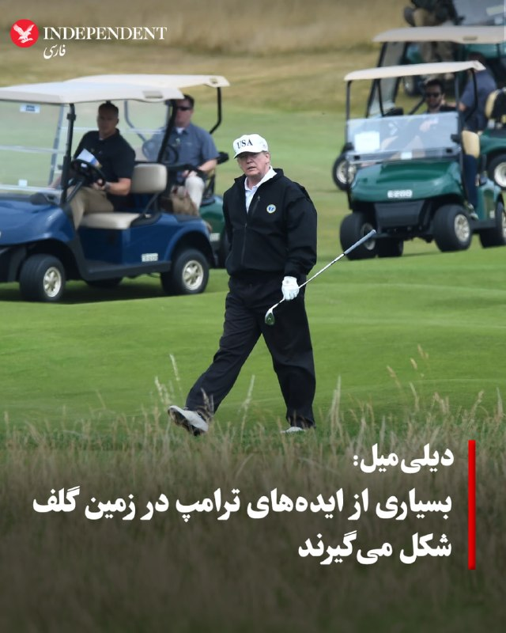
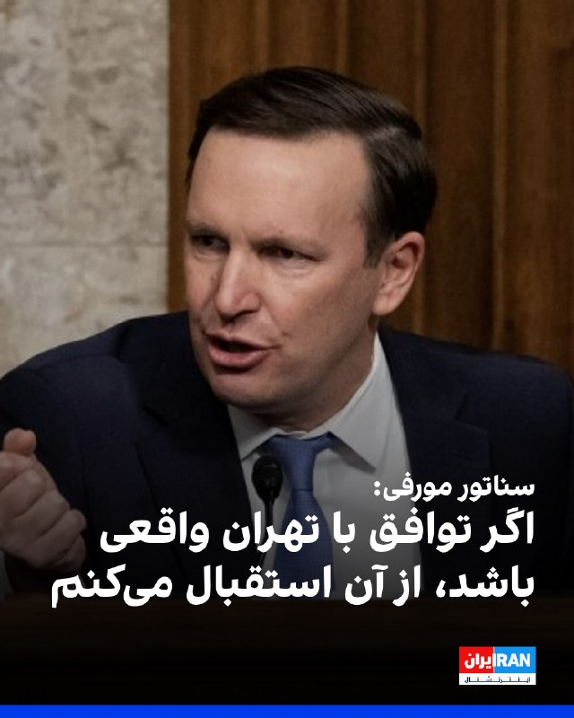
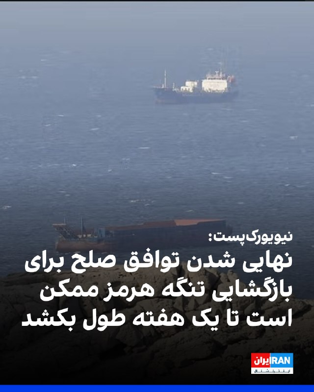
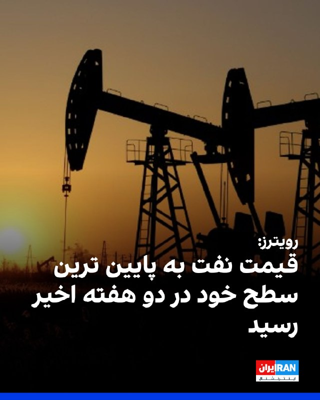
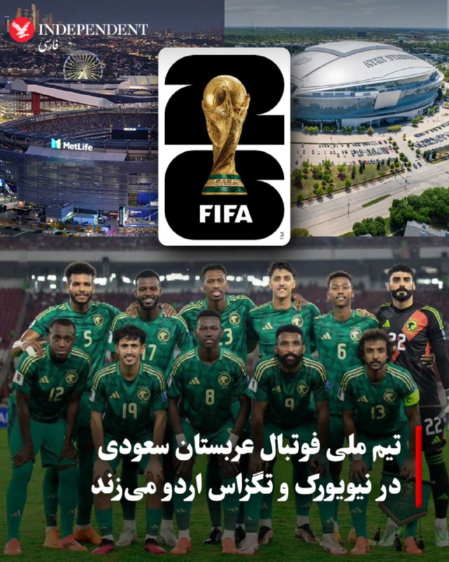
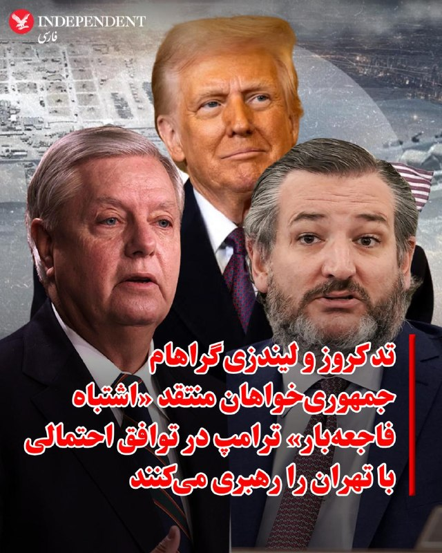
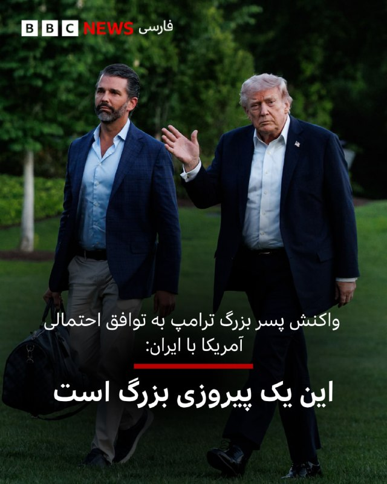

# خواننده تلگرام

<!-- TOP_NAV START -->

<a href="https://github.com/drsploit/aio-DL/blob/main/telegram/content/archive_1.md" style="display:inline-block; padding:6px 12px; margin:0 4px; background-color:#2ea44f; color:white; text-decoration:none; border-radius:4px; font-weight:bold;">صفحه بعد</a>

<!-- TOP_NAV END -->

<!-- MSG START -->

---
📅 بروزرسانی: 1405/03/04 05:09
---

## VahidOOnLine — post 242045

  

♦️به گزارش دیلی‌میل، زمین های گلف دونالد ترامپ به عنوان پناهگاه او از فشارهای سیاسی واشنگتن عمل می‌کنند و بسیاری از تصمیم‌ها و ایده‌های غیرمنتظره او در همین فضا شکل می‌گیرند.
منابع می‌گویند برخی از طرح‌های مهم حتی در گفتگوهای غیررسمی روی زمین گلف به رئیس‌جمهور منتقل می‌شوند.
یکی از نمونه های اخیر، پیشنهاد تغییر نام اداره مهاجرت و گمرک آمریکا به نامی با عنوان «NICE» بود که گفته می شود یک حرفه ای گلف در جریان یک دور بازی با ترامپ مطرح کرد و او از آن خوشش آمد.
نمونه دیگر مربوط به یک جلسه غیررسمی در باشگاه گلف ترامپ بود که در آن طرحی درباره وام های ۵۰ ساله مسکن توسط یک مقام دولتی با استفاده از یک پوستر بزرگ به او ارائه شد.
گزارش می‌گوید ترامپ حدود ده دقیقه بعد تصویر آن را در شبکه اجتماعی خود منتشر کرد و این اقدام واکنش های منفی گسترده ای در حوزه مالی به همراه داشت.
به گفته منابع، افراد نزدیک به ترامپ و همراهان دائمی او در زمین گلف نقش مهمی در شکل گیری این گفتگوها دارند و زمان بندی و حالت روحی او در پذیرش ایده ها تاثیرگذار است.
گزارش همچنین به تجربه های پیشین رهبران خارجی مانند شینزو آبه اشاره می کند که از علاقه ترامپ به گلف برای پیشبرد گفتگوهای سیاسی و تجاری استفاده می کردند.
در مجموع، گزارش نتیجه می گیرد که زمین های گلف ترامپ نه تنها محل تفریح بلکه بخشی از فرآیند تصمیم گیری سیاسی او محسوب می شوند نیز به آن اشاره شد.
‌🇸🇦 Indypersian

🤖 @VahidOOnLine

## VahidOOnLine — post 242044

  

سناتور کریس مورفی، نماینده دموکرات مجلس سنای آمریکا، اعلام کرد اگر توافق با تهران واقعی باشد، از آن استقبال می‌کند.

او در شبکه اجتماعی ایکس عنوان کرد که با ادامه جنگ، «آمریکا ضعیف‌تر می‌شود» و نوشت: «پایان دادن به جنگ دراولویت است.»

مورفی با اشاره به گزارش‌های منتشر شده در مورد مفاد توافق احتمالی افزود: «ما میلیاردها دلار به ایران می‌دهیم تا به جایی که قبل از جنگ بودیم برگردیم. و گزارش‌ها حاکی از آن است که این توافق ممکن است حق ایران برای کنترل تنگه هرمز را تثبیت کند.»

او در مورد پرونده هسته‌ای جمهوری اسلامی نیز احتمال داد که تهران «تمام مسائل هسته‌ای را به تعویق می‌اندازد» و در خصوص احتمال لغو تحریم‌ها هم اضافه کرد که در این صورت،‌ «اهرم کمتری برای وادار کردن آن‌ها [جمهوری اسلامی] به دادن امتیاز بیشتر در مذاکرات آینده داریم.»

مورفی برخلاف سخنان دونالد ترامپ، رییس‌جمهوری آمریکا، در مورد نابودی توان نظامی جمهوری اسلامی، افزود: «ایران هنوز برنامه موشک‌های بالستیک و پهپاد خود را دارد. آنها هنوز نیروی دریایی دارند که می‌تواند تنگه هرمز را ببندد. یک رژیم تندرو هنوز در راس امور است.»
‌🏁 🇬🇧 IranintlTV

🤖 @VahidOOnLine

## VahidOOnLine — post 242043

  

♦️محمد سرافراز، رئیس پیشین سازمان صداوسیما و عضو کنونی شورای عالی فضای مجازی، یکشنبه سوم خردادماه در گفتگو با «روزنامه اینترنتی فراز» گفت بخشی از حاکمیت جمهوری اسلامی با الگوبرداری از مدل چین، به‌دنبال محدود کردن اینترنت جهانی برای عموم مردم و ارائه دسترسی کنترل‌شده فقط به گروه‌های خاص است.

سرافراز گفت تجهیزات لازم برای اجرای این مدل و «قطع دائمی اینترنت» از چین خریداری و وارد ایران شده است. او توضیح داد در الگوی مورد نظر برخی جریان‌ها، نیاز کاربران باید عمدتا از طریق شبکه‌ها و خدمات داخلی تامین شود و دسترسی به اینترنت جهانی به‌شدت محدود بماند.

او با اشاره به تجربه چین گفت در این کشور اینترنت جهانی برای عموم مردم عملا قطع یا به‌شدت کنترل می‌شود و تنها گروه‌های مشخصی به دسترسی گسترده‌تر دسترسی دارند. سرافراز همچنین از ساختاری با عنوان «سامانه نیکان» نام برد و گفت هدف چنین الگویی این است که «روایت حکومت» بر فضای اطلاع‌رسانی کشور حاکم شود.

عضو شورای عالی فضای مجازی همچنین برخی اپراتورهای حاضر در این شورا را از عوامل پشت پرده طرح موسوم به «اینترنت پرو» معرفی کرد و گفت ذی‌نفعان قطع اینترنت «یک روز فیلترشکن می‌فروشند و یک روز اینترنت پرو.»

همزمان، نت‌بلاکس اعلام کرد پس از ۸۶ روز قطعی اینترنت در ایران، در حالی‌که دسترسی عمومی به اینترنت جهانی در جریان مذاکرات صلح تا حد زیادی قطع شده، کاربران قرارگرفته در «فهرست سفید» تصویری مصنوعی از وضعیت زندگی در ایران به جهان خارج ارائه می‌کنند.
‌🇸🇦 Indypersian

🤖 @VahidOOnLine

## VahidOOnLine — post 242042

  

روزنامه نیویورک‌پست به نقل از «یک مقام ارشد دولت آمریکا» نوشت که نهایی شدن توافق صلح با حکومت ایران برای بازگشایی تنگه هرمز ممکن است تا یک هفته طول بکشد، اما اگر تهران به شرایط دونالد ترامپ متعهد نشود، ممکن است رییس‌جمهوری ایالات متحده، از آن خارج شود.

یک مقام ارشد آمریکا گفت پس از آن‌که ترامپ اعلام کرد مذاکرات بر سر جنگ و برنامه هسته‌ای تهران در مرحله نهایی خود قرار دارد، وضعیت حکومت ایران باعث شده است که روند نهایی به کندی پیش برود.

این منبع اشاره کرد که ممکن است چند روز طول بکشد تا توافق نهایی به دست مجتبی خامنه‌ای، رهبر جمهوری اسلامی، برسد.

در همین ارتباط، شماری از رسانه‌ها گزارش داده‌اند که او درمکانی نامعلوم مخفی شده و امکان دسترسی به او برای مقام‌‌های حکومت ایران دشوار است.

به نوشته نیویورک‌پست، مقام ارشد آمریکایی گفت بازگشایی واقعی تنگه هرمز و پایان محاصره بنادر ایران توسط آمریکا حدود هفت روز طول خواهد کشید و ایالات متحده تنها زمانی تحریم‌ها را لغو خواهد کرد که ایران اورانیوم غنی‌شده خود را تحویل دهد.
‌🏁 🇬🇧 IranintlTV

🤖 @VahidOOnLine

## VahidOOnLine — post 242041

  

وب‌سایت حقوق بشری هرانا گزارش داد که روح‌الله کرکی، زندانی سیاسی محبوس در زندان شیبان اهواز، به اعدام محکوم شد.

بر اساس این گزارش، چندی پیش، کیفرخواست پرونده کرکی بابت اتهامات «انتشار و افشای اسناد محرمانه»، «همکاری با سازمان مجاهدین خلق»، «جاسوسی برای اسرائیل و تبادل اطلاعات نظامی و امنیتی»، «توهین به مقدسات و مقامات» و «اقدام علیه امنیت ملی» صادر و به دادگاه کیفری دو اهواز ارجاع شده بود.

به نوشته هرانا، این زندانی سیاسی دهم مهر سال گذشته به زندان شیبان اهواز منتقل شد. او ۱۴ مرداد سال گذشته به دست نیروهای امنیتی در اندیمشک بازداشت شده بود.

این وب‌سایت اشاره کرد روح‌الله کرکی، برادر امین کرکی، از بازداشت‌شدگان اعتراضات سراسری دی‌ ۹۶ است، و افزود: «امین کرکی در فروردین ۹۷ پس از بازداشت مجدد، در شرایطی پرابهام درگذشت.»
‌🏁 🇬🇧 IranintlTV

🤖 @VahidOOnLine

## VahidOOnLine — post 242040

  <a href="telegram/content/VahidOOnLine_242040_1779673170.mp4" target="_blank">🎬 Download video</a>

♦️گارد ساحلی تایوان روز یکشنبه سوم‌ خردادماه، ویدیویی منتشر کرد که نشان می‌دهد یک کشتی گارد ساحلی چین پس از یک روز رویارویی پرتنش و دریافت هشدار رادیویی، آب‌های اطراف جزایر پراتاس را ترک کرده است.

در این ویدیو، شناور گشتی تایچونگ به کشتی چینی هشدار می‌دهد که «صلحی که چین تبلیغ می‌کند یک فریب است» و از آن می‌خواهد آب‌های اطراف جزایر پراتاس را ترک کند؛ در حالی که کشتی چینی مدعی است در حال انجام ماموریتی عادی بوده و پکن بر این جزایر حاکمیت دارد.

جزایر پراتاس میان جنوب تایوان و هنگ‌کنگ قرار دارند و به‌دلیل فاصله زیاد از خاک اصلی تایوان، از نگاه برخی کارشناسان امنیتی در برابر حمله احتمالی چین آسیب‌پذیر محسوب می‌شوند.
‌🇸🇦 Indypersian

🤖 @VahidOOnLine

## VahidOOnLine — post 242039

  

مسعود رسولی، دبیر انجمن صنعت بسته‌بندی گوشت و مواد پروتیینی، اعلام کرد که بازار تقاضا برای گوشت قرمز نسبت به سال گذشته حدود ۵۰ درصد کاهش یافته است.

او به دلایل این کاهش ۵۰ درصدی اشاره نکرد اما وب‌سایت اقتصاد آنلاین با اشاره به سخنان رسولی نوشت: «طی چند سال اخیر با کاهش قدرت خرید مردم سرانه مصرف گوشت کاهش یافته است.»

در همین ارتباط، برخی گزارش‌های منتشر شده در رسانه‌های ایران حاکی از افزایش بی‌سابقه اقلام خوراکی و مصرفی از آغاز سال تاکنون است.

مخاطبان ایران‌اینترنشنال نیز با ارسال پیام‌هایی نوشته‌اند نه‌تنها سفره‌ها کوچک شده، بلکه مردم از تامین ابتدایی‌ترین نیازهای زندگی‌شان درمانده‌اند.
‌🏁 🇬🇧 IranintlTV

🤖 @VahidOOnLine

## VahidOOnLine — post 242038

  

سایت «اویل پرایس» (قیمت نفت) گزارش داد که قیمت هر بشکه نفت خام «وست‌ تگزاس‌ اینترمیدیت» به ۹۱ دلار و ۶۹ سنت و قیمت هر بشکه نفت خام «برنت» به ۹۸ دلار و ۲۴ سنت کاهش یافته است.

این پایین‌ترین قیمت نفت طی دو هفته گذشته محسوب می‌شود.
‌🏁 🇬🇧 IranintlTV

🤖 @VahidOOnLine

## VahidOOnLine — post 242037

  

خبرگزاری رویترز گزارش داد که قیمت نفت به پایین ترین سطح خود در دو هفته اخیر رسید،‌ و نوشت خوش بینی‌ها نسبت به پیشرفت مذاکرات آمریکا و جمهوری اسلامی و احتمال بازگشایی تنگه هرمز باعث کاهش بیش از ۴ درصدی نفت برنت و نفت آمریکا شد.

به نوشته رویترز، با این حال تحلیلگران انتظار دارند که ماه ها طول بکشد تا جریان نفت از تنگه هرمز به حالت عادی برگردد و زیرساخت های آسیب دیده نفت و گاز ترمیم شوند.
‌🏁 🇬🇧 IranintlTV

🤖 @VahidOOnLine

## VahidOOnLine — post 242036

  

شبکه خبری العربیه گزارش داد مقام‌های دولت اقلیم کردستان عراق، از جمله مسرور بارزانی، نخست‌وزیر اقلیم، اعلام کردند که نمی‌دانند چه طرف‌هایی سلاح‌هایی را که از سوی ایالات متحده برای «مخالفان حکومت ایران» ارسال شده بود، دریافت کرده‌اند.

در این گزارش به نقل از مقام‌های اقلیم کردستان عراق آمده است: اقلیم کردستان ترجیح می‌دهد ایالات متحده یا دونالد ترامپ، رییس‌جمهوری آمریکا، مشخص کند این سلاح‌ها دقیقا به دست چه کسانی رسیده است.
‌🏁 🇬🇧 IranintlTV

🤖 @VahidOOnLine

## VahidOOnLine — post 242035

  <a href="telegram/content/VahidOOnLine_242035_1779673174.mp4" target="_blank">🎬 Download video</a>

بامداد یک‌شنبه سوم خرداد، روسیه حملات گسترده‌ای علیه اوکراین انجام داد و صدها پهپاد و ده‌ها موشک شلیک کرد.
ولودیمیر زلنسکی، رییس‌جمهوری اوکراین، از کشته شدن چهار نفر و زخمی شدن حدود ۱۰۰ نفر در این حملات به کی‌یف و مناطق اطراف آن خبر داد.
وزارت دفاع روسیه اعلام کرد در این حملات از موشک هایپرسونیک «اورشنیک» استفاده کرده است.
‌🏁 🇬🇧 IranintlTV

🤖 @VahidOOnLine

## VahidOOnLine — post 242034

  

شبکه خبری سی‌بی‌اس به نقل از مقام‌های آمریکایی گزارش داد هنگامی که ایالات متحده جزئیات پیشنهادی خود را برای تهران ارسال می‌کند، دشواری دسترسی به رهبر جمهوری اسلامی می‌تواند باعث شود واشینگتن با تأخیری قابل توجه پاسخ دریافت کند.

بنا بر این گزارش مقام‌های ایرانی که مجاز به همکاری با دولت ترامپ هستند، در برقراری ارتباط در درون ساختار حکومتی جمهوری اسلامی با مشکل مواجه شده‌اند؛ مسئله‌ای که به نوشته این شبکه، یکی از دلایل اصلی کندی در انتشار جزئیات توافق احتمالی با ایران و توافق‌های گذشته بوده است.

پیش‌تر یک مقام ارشد دولت آمریکا روز یکشنبه گفته بود مجتبی خامنه‌ای با کلیات پیش‌نویس توافق فعلی موافقت کرده است.

دونالد ترامپ، رییس‌جمهوری ایالات متحده، نیز در تروث‌سوشال اعلام کرد انتظار دارد نظر نهایی در چند روز آینده مشخص شود.

بر اساس گزارش سی‌بی‌اس، حتی مقام‌های ارشد حکومت ایران نیز از پیش نمی‌دانند خامنه‌ای کجاست و هیچ راه مستقیمی برای تماس با او ندارند.

در همین حال، سخنگوی کاخ سفید از اظهارنظر درباره اطلاعات مربوط به محل اقامت رهبر جمهوری اسلامی یا شیوه‌های ارتباطی حکومت ایران خودداری کرد.
https://iranintl
‌🏁 🇬🇧 IranintlTV

🤖 @VahidOOnLine

## VahidOOnLine — post 242033

  

♦️بلومبرگ به نقل از منابع اطلاعاتی آمریکا که نام آنها را اعلام نکرده گزارش داد که دشواری برقرای ارتباط با مجتبی خامنه‌ای، ممکن است اعلام توافق را به تاخیر بیاندازد. بر اساس این گزارش، رهبر سوم نظام که در سه ماه اخیر هیچ تصویر و حتی فایل صوتی از او منتشر نشده، در مکانی مخفی شده است که مذاکره‌کنندگان با آمریکا از‌ آن اطلاع ندارند و ارتباط با او فقط از طریق «پیک‌ها» ممکن است. پیش‌تر گفته شده بود که فقط احمد وحیدی، فرمانده سپاه با او در ارتباط است.
‌🇸🇦 Indypersian

🤖 @VahidOOnLine

## VahidOOnLine — post 242032

  

♦️به گزارش العربیه، گئورگیوس (جورج) دونیس، سرمربی تازه منصوب‌شده عربستان سعودی، فهرست اولیه ۳۰ نفره این کشور برای جام جهانی ۲۰۲۶ را اعلام کرد و قرار است ترکیب نهایی ۲۶ نفره «شاهین‌های سبز» اواخر هفته آینده تایید شود.
در صدر این فهرست، سالم الدوسری، کاپیتان تیم، سعود عبدالحمید مدافع مشغول بازی در فرانسه، و شماری از بازیکنان تیمی قرار دارند که در جام جهانی ۲۰۲۲ قطر به‌طور تاریخی آرژانتین را شکست داد.
الاهلی، قهرمان تازه لیگ قهرمانان آسیا، پنج بازیکن در این فهرست دارد و باشگاه‌هایی مانند القادسیه و نئوم اس‌سی نیز حضور پررنگ‌تری پیدا کرده‌اند؛ ترکیبی که به نوشته العربیه بیش از تغییرات ریشه‌ای، بر حفظ انسجام و تجربه بازیکنان لیگ حرفه‌ای عربستان تکیه دارد.
دونیس و بازیکنان عربستان پیش از آغاز مسابقات، اردوهای آماده‌سازی در نیویورک و تگزاس برگزار خواهند کرد و سپس در دیدارهای دوستانه مقابل اکوادور، پورتوریکو و سنگال به میدان می‌روند.
‌🇸🇦 Indypersian

🤖 @VahidOOnLine

## VahidOOnLine — post 242031

  

♦️به گزارش دیلی میل سناتورهای جمهوری‌خواه از جمله تد کروز و لیندزی گراهام در صدر فهرست جمهوری خواهانی قرار دارند که به شدت به توافق در حال شکل‌گیری دولت ترامپ با رژیم ایران انتقاد می کنند. آنها این توافق احتمالی را «اشتباه فاجعه‌بار» توصیف کردند و نسبت به امتیازدهی احتمالی به تهران هشدار دادند. این واکنش‌ها در حالی مطرح شد که دونالد ترامپ با مخالفت‌هایی در داخل حزب خود درباره چارچوب اولیه توافق مواجه شده است.
بر اساس گزارش‌ها، چارچوب پیشنهادی شامل بازگشایی تنگه هرمز، آتش‌بس ۶۰ روزه و ادامه مذاکرات درباره برنامه هسته‌ای ایران است، در حالی که جزئیات نهایی هنوز در حال مذاکره است. برخی جمهوری‌خواهان به این موضوع معترض‌اند که ایران ممکن است مجبور به تحویل فوری تمام مواد هسته‌ای موجود در داخل کشور نشود.
تد کروز هشدار داد اگر نتیجه توافق این باشد که ایران همچنان تحت حاکمیت اسلام‌گرایان با شعارهای ضدآمریکایی باقی بماند، میلیاردها دلار دریافت کند، به غنی‌سازی اورانیوم ادامه دهد و کنترل مؤثر تنگه هرمز را در اختیار داشته باشد، این نتیجه یک اشتباه فاجعه‌بار خواهد بود.
لیندزی گراهام نیز نسبت به مسیر مذاکرات ابراز تردید کرد و گفت توافقی که ایران را به قدرت مسلط منطقه تبدیل کند می‌تواند برای اسرائیل «کابوس» باشد. او همچنین این سؤال را مطرح کرد که اگر چنین برداشت‌هایی درست باشد، اساسا جنگ برای چه آغاز شده بود. در عین حال، او بعدا گفت ممکن است از توافق حمایت کند اگر به گسترش قابل توجه پیمان های ابراهیم و پیوستن کشورهایی مانند عربستان سعودی، قطر و پاکستان منجر شود و آن را اقدامی «تحول‌آفرین» توصیف کرد.
سناتورهای دیگری مانند راجر ویکر نیز آتش‌بس ۶۰ روزه را به شدت نقد کردند و گفتند دستاوردهای نظامی آمریکا ممکن است بی‌اثر شود. تام تیلیس نیز هشدار داد که پذیرش باقی ماندن مواد هسته‌ای در ایران و توافقی بدون تصویب کنگره، مشابه شکست توافق‌های گذشته خواهد بود.
بر اساس گزارش‌های تایید نشده، آمریکا و رژیم ایران به‌طور اصولی درباره بازگشایی تنگه هرمز و مدیریت ذخایر اورانیوم غنی‌شده به توافق رسیده‌اند، اما جزئیات نحوه اجرا هنوز روشن نیست و واکنش رسمی تهران نیز متناقض است.
ترامپ این توافق را متفاوت از توافق اوباما دانست و تأکید کرد تا نهایی شدن توافق، محاصره ایران ادامه خواهد داشت و از منتقدان در داخل حزب خود انتقاد کرد. مارکو روبیو، وزیر خارجه آمریکا نیز از رویکرد دولت دفاع کرد و گفت هدف جلوگیری از دستیابی ایران به سلاح هسته‌ای است
‌🇸🇦 Indypersian

🤖 @VahidOOnLine

## VahidOOnLine — post 242022

جاویدنامان انقلاب ملی ایرانیان؛
روایت جوانانی است که هرکدام در حال ساختن زندگی بودند؛ یکی پدر دو کودک بود، یکی رویای بازیگری داشت، یکی با موسیقی زندگی می‌کرد، یکی در زمین فوتبال می‌دوید و دیگری تازه وارد دانشگاه شده بود.
محمد خداپناه، حمیدرضا علیزاده، آریا هنرمند، حمیدرضا مجیدی، مسعود عیسوند جهانبخشی، شیوا جاوید، مهدی عبدلی و صابر آقابابایی
نام‌هایی که قرار بود بخشی از آینده این سرزمین باشند، اما جمهوری اسلامی آنان را با شلیک مستقیم، تیر خلاص، شکنجه و سرکوب از ایران گرفت.
فراموش نمی‌کنیم که پشت هر نام، یک زندگی جریان داشت، خانه‌هایی که ویران شدند، خانواده‌هایی که چشم‌انتظار ماندند و رویاهایی که پیش از رسیدن به آینده، در خیابان‌ها خاموش شدند.
#جاویدنامان_انقلاب_ملی_ایرانیان
‌🏁 🇬🇧 IranintlTV

🤖 @VahidOOnLine

## FoxNewsTwitter — post 342191

  <a href="telegram/content/FoxNewsTwitter_342191_1779673178.mp4" target="_blank">🎬 Download video</a>

Fox News (Twitter/X)

A graduation ceremony in Franklin, Tennessee turned into a soaking wet controversy after officials decided to keep the event outdoors during a torrential downpour.

Footage from the ceremony shows graduates crossing the stage in heavy rain while families sat drenched in the stands as the storm moved through the area.

Now some parents are demanding answers, saying students deserved better and arguing the conditions became unsafe.

## FoxNewsTwitter — post 342190

‌Fox News (Twitter/X)

Read more:

## FoxNewsTwitter — post 342189

  

Fox News (Twitter/X)

“They’re coming after your boy.”

Hasan Piker is lashing out after federal officials subpoenaed him as part of an investigation tied to recent activist trips to communist Cuba.

During a Twitch livestream, the left-wing political influencer claimed the probe is an “intimidation tactic” aimed at him for criticizing Israel and the United States, describing himself as a “loudmouth” and “rabble-rouser.”

Fox News Digital previously reported that the Treasury Department’s Office of Foreign Assets Control is seeking documents tied to the financial, logistical, and communications details surrounding March trips to Cuba.

## pm_afshaa — post 91424

  <a href="telegram/content/pm_afshaa_91424_1779673181.webm" target="_blank">🎬 Download video</a>

🔴قلهکی، فعال رسانه‌ای اصولگرا:
دلیل اینکه تفاهم اسلام آباد هنوز امضا نشده اینه که نتانیاهو زنگ زده به ترامپ و پُرش کرده، آمريکا هم زده زیرش و گفته تا قبل اینکه 400 کیلو اورانیوم رو تحویل ندید، خبری از پول‌های بلوکه شده نیست!

💧 Rainbet.com the #1 Non-KYC Crypto Casino & Sportsbook @rainbetcom

😁 @Pm_Afshaa

## VahidOnline — post 75693

  

سی‌بی‌اس: مجتبی خامنه‌ای در مکانی نامعلوم با دسترسی کم به دنیای خارج پنهان شده است.

ترجمه ماشین:
اطلاعات نهادهای امنیتی آمریکا نشان می‌دهد که رهبر عالی ایران عملاً در مکانی نامعلوم پنهان شده، دسترسی محدودی به جهان خارج دارد و ارتباط با او تنها از طریق شبکه‌ای پیچیده از پیک‌ها امکان‌پذیر است؛ این را مقام‌های آمریکایی آگاه از موضوع گفته‌اند.

به گفته این منابع، مقام‌های ایرانی که مجوز همکاری با دولت ترامپ را دارند، برای برقراری ارتباط در داخل ساختار حکومتی خودشان با دشواری روبه‌رو بوده‌اند؛ مسئله‌ای که یکی از دلایل اصلی تأخیر در روشن شدن جزئیات توافق احتمالی با ایران و توافق‌های قبلی بوده است.

دو مقام آمریکایی گفتند وقتی آمریکا جزئیات پیشنهادی را ارسال می‌کند، دشواری دسترسی به رهبر عالی باعث می‌شود گاهی پیش از دریافت پاسخ از سوی آمریکا، تأخیری طولانی رخ دهد.

سخنگوی کاخ سفید از اظهارنظر درباره اطلاعات مربوط به محل حضور رهبر عالی یا روش‌های ارتباطی ایران خودداری کرد.

یک مقام ارشد دولت روز یکشنبه گفت رهبر عالی با چارچوب کلی پیش‌نویس توافق فعلی موافقت کرده و دونالد ترامپ، رئیس‌جمهوری آمریکا، در تروث‌سوشال نوشت که انتظار دارد ظرف چند روز آینده پاسخ نهایی اعلام شود.

مجتبی خامنه‌ای، رهبر عالی ایران، که در حملات آمریکا و اسرائیل در عملیات «خشم حماسی» زخمی شده بود، برای جلوگیری از حملاتی مشابه حملاتی که به کشته شدن پدرش، آیت‌الله علی خامنه‌ای، منجر شد، تدابیر بسیار شدیدی اتخاذ کرده است. علی خامنه‌ای از سال ۱۹۸۹ تا ۲۸ فوریه بر ایران حکومت می‌کرد. مجتبی خامنه‌ای از پیش از آغاز جنگ تاکنون به‌طور رسمی در انظار عمومی دیده یا شنیده نشده است.

یکی از مقام‌ها گفت اطلاعات به‌دست‌آمده توسط نهادهای اطلاعاتی آمریکا و اسرائیل از داخل حکومت ایران، امکان شناسایی و حذف بخش بزرگی از رهبری ارشد ایران در جریان جنگ را فراهم کرده است.

منابع گفتند در حال حاضر بیشتر رهبران ایران نور روز را نمی‌بینند، هفته‌ها در پناهگاه‌های به‌شدت مستحکم می‌مانند و جز در موارد کاملاً ضروری از صحبت با یکدیگر خودداری می‌کنند.

یکی از مقام‌ها گفت: «تماشای تلاش آن‌ها برای فهمیدن این‌که چطور با هم حرف بزنند، تقریباً مثل تماشای یک سیتکام است. آن‌ها کاملاً به ستوه آمده‌اند.»

شدیدترین تدابیر احتیاطی از سوی رهبر عالی اتخاذ شده است.

بر اساس طراحی این سازوکار، حتی مقام‌های عالی‌رتبه حکومت ایران هم نمی‌دانند او کجاست و هیچ راهی برای تماس مستقیم با او ندارند.

در عوض، پیام‌ها از طریق شبکه‌ای از پیک‌ها منتقل می‌شود که با هدف پنهان نگه داشتن محل حضور رهبر عالی ایجاد شده است.

یکی از مقام‌ها گفت: «به همین دلیل است که می‌بینید برخی می‌گویند: "رهبر عالی با چارچوب موافقت کرده" یا "منتظر پاسخ درباره نکات نهایی توافق هستیم." هر اطلاعاتی که به او می‌رسد، از پیش قدیمی شده و پاسخ‌های او با تأخیر زیادی همراه است.»

رهبر عالی در قالب کلیات با زیردستان خود ارتباط برقرار کرده و به آن‌ها جهت داده است که درباره چه موضوعاتی می‌توانند مذاکره کنند و چه موضوعاتی نباید مطرح شود.
cbsnews

📡 @VahidOnline

## IranIntlTV — post 338841

  <a href="https://t.me/IranintlTV/338841" target="_blank">📎 Download file</a>

🎧نسخه صوتی سیاست با مراد ویسی: نیاز به راهکارهای نو در راه درست سرنگونی
@iranintlTV

## IranIntlTV — post 338840

  

سناتور کریس مورفی، نماینده دموکرات مجلس سنای آمریکا، اعلام کرد اگر توافق با تهران واقعی باشد، از آن استقبال می‌کند.

او در شبکه اجتماعی ایکس عنوان کرد که با ادامه جنگ، «آمریکا ضعیف‌تر می‌شود» و نوشت: «پایان دادن به جنگ دراولویت است.»

مورفی با اشاره به گزارش‌های منتشر شده در مورد مفاد توافق احتمالی افزود: «ما میلیاردها دلار به ایران می‌دهیم تا به جایی که قبل از جنگ بودیم برگردیم. و گزارش‌ها حاکی از آن است که این توافق ممکن است حق ایران برای کنترل تنگه هرمز را تثبیت کند.»

او در مورد پرونده هسته‌ای جمهوری اسلامی نیز احتمال داد که تهران «تمام مسائل هسته‌ای را به تعویق می‌اندازد» و در خصوص احتمال لغو تحریم‌ها هم اضافه کرد که در این صورت،‌ «اهرم کمتری برای وادار کردن آن‌ها [جمهوری اسلامی] به دادن امتیاز بیشتر در مذاکرات آینده داریم.»

مورفی برخلاف سخنان دونالد ترامپ، رییس‌جمهوری آمریکا، در مورد نابودی توان نظامی جمهوری اسلامی، افزود: «ایران هنوز برنامه موشک‌های بالستیک و پهپاد خود را دارد. آنها هنوز نیروی دریایی دارند که می‌تواند تنگه هرمز را ببندد. یک رژیم تندرو هنوز در راس امور است.»
https://iranintl.com/20

## IranIntlTV — post 338839

  

روزنامه نیویورک‌پست به نقل از «یک مقام ارشد دولت آمریکا» نوشت که نهایی شدن توافق صلح با حکومت ایران برای بازگشایی تنگه هرمز ممکن است تا یک هفته طول بکشد، اما اگر تهران به شرایط دونالد ترامپ متعهد نشود، ممکن است رییس‌جمهوری ایالات متحده، از آن خارج شود.

یک مقام ارشد آمریکا گفت پس از آن‌که ترامپ اعلام کرد مذاکرات بر سر جنگ و برنامه هسته‌ای تهران در مرحله نهایی خود قرار دارد، وضعیت حکومت ایران باعث شده است که روند نهایی به کندی پیش برود.

این منبع اشاره کرد که ممکن است چند روز طول بکشد تا توافق نهایی به دست مجتبی خامنه‌ای، رهبر جمهوری اسلامی، برسد.

در همین ارتباط، شماری از رسانه‌ها گزارش داده‌اند که او درمکانی نامعلوم مخفی شده و امکان دسترسی به او برای مقام‌‌های حکومت ایران دشوار است.

به نوشته نیویورک‌پست، مقام ارشد آمریکایی گفت بازگشایی واقعی تنگه هرمز و پایان محاصره بنادر ایران توسط آمریکا حدود هفت روز طول خواهد کشید و ایالات متحده تنها زمانی تحریم‌ها را لغو خواهد کرد که ایران اورانیوم غنی‌شده خود را تحویل دهد.
https://iranintl.com/202605253993

## IranIntlTV — post 338838

  

وب‌سایت حقوق بشری هرانا گزارش داد که روح‌الله کرکی، زندانی سیاسی محبوس در زندان شیبان اهواز، به اعدام محکوم شد.

بر اساس این گزارش، چندی پیش، کیفرخواست پرونده کرکی بابت اتهامات «انتشار و افشای اسناد محرمانه»، «همکاری با سازمان مجاهدین خلق»، «جاسوسی برای اسرائیل و تبادل اطلاعات نظامی و امنیتی»، «توهین به مقدسات و مقامات» و «اقدام علیه امنیت ملی» صادر و به دادگاه کیفری دو اهواز ارجاع شده بود.

به نوشته هرانا، این زندانی سیاسی دهم مهر سال گذشته به زندان شیبان اهواز منتقل شد. او ۱۴ مرداد سال گذشته به دست نیروهای امنیتی در اندیمشک بازداشت شده بود.

این وب‌سایت اشاره کرد روح‌الله کرکی، برادر امین کرکی، از بازداشت‌شدگان اعتراضات سراسری دی‌ ۹۶ است، و افزود: «امین کرکی در فروردین ۹۷ پس از بازداشت مجدد، در شرایطی پرابهام درگذشت.»
https://iranintl.com/202605256245

## IranIntlTV — post 338837

  

مسعود رسولی، دبیر انجمن صنعت بسته‌بندی گوشت و مواد پروتیینی، اعلام کرد که بازار تقاضا برای گوشت قرمز نسبت به سال گذشته حدود ۵۰ درصد کاهش یافته است.

او به دلایل این کاهش ۵۰ درصدی اشاره نکرد اما وب‌سایت اقتصاد آنلاین با اشاره به سخنان رسولی نوشت: «طی چند سال اخیر با کاهش قدرت خرید مردم سرانه مصرف گوشت کاهش یافته است.»

در همین ارتباط، برخی گزارش‌های منتشر شده در رسانه‌های ایران حاکی از افزایش بی‌سابقه اقلام خوراکی و مصرفی از آغاز سال تاکنون است.

مخاطبان ایران‌اینترنشنال نیز با ارسال پیام‌هایی نوشته‌اند نه‌تنها سفره‌ها کوچک شده، بلکه مردم از تامین ابتدایی‌ترین نیازهای زندگی‌شان درمانده‌اند.
https://iranintl.com/202605253577

## IranIntlTV — post 338836

  

سایت «اویل پرایس» (قیمت نفت) گزارش داد که قیمت هر بشکه نفت خام «وست‌ تگزاس‌ اینترمیدیت» به ۹۱ دلار و ۶۹ سنت و قیمت هر بشکه نفت خام «برنت» به ۹۸ دلار و ۲۴ سنت کاهش یافته است.

این پایین‌ترین قیمت نفت طی دو هفته گذشته محسوب می‌شود.
https://iranintl.com/202605254345

## IranIntlTV — post 338834

  

شبکه خبری العربیه گزارش داد مقام‌های دولت اقلیم کردستان عراق، از جمله مسرور بارزانی، نخست‌وزیر اقلیم، اعلام کردند که نمی‌دانند چه طرف‌هایی سلاح‌هایی را که از سوی ایالات متحده برای «مخالفان حکومت ایران» ارسال شده بود، دریافت کرده‌اند.

در این گزارش به نقل از مقام‌های اقلیم کردستان عراق آمده است: اقلیم کردستان ترجیح می‌دهد ایالات متحده یا دونالد ترامپ، رییس‌جمهوری آمریکا، مشخص کند این سلاح‌ها دقیقا به دست چه کسانی رسیده است.
https://iranintl.com/202605259317

## IranIntlTV — post 338833

  <a href="telegram/content/IranIntlTV_338833_1779673187.mp4" target="_blank">🎬 Download video</a>

بامداد یک‌شنبه سوم خرداد، روسیه حملات گسترده‌ای علیه اوکراین انجام داد و صدها پهپاد و ده‌ها موشک شلیک کرد.
ولودیمیر زلنسکی، رییس‌جمهوری اوکراین، از کشته شدن چهار نفر و زخمی شدن حدود ۱۰۰ نفر در این حملات به کی‌یف و مناطق اطراف آن خبر داد.
وزارت دفاع روسیه اعلام کرد در این حملات از موشک هایپرسونیک «اورشنیک» استفاده کرده است.

## IranIntlTV — post 338832

  

شبکه خبری سی‌بی‌اس به نقل از مقام‌های آمریکایی گزارش داد هنگامی که ایالات متحده جزئیات پیشنهادی خود را برای تهران ارسال می‌کند، دشواری دسترسی به رهبر جمهوری اسلامی می‌تواند باعث شود واشینگتن با تأخیری قابل توجه پاسخ دریافت کند.

بنا بر این گزارش مقام‌های ایرانی که مجاز به همکاری با دولت ترامپ هستند، در برقراری ارتباط در درون ساختار حکومتی جمهوری اسلامی با مشکل مواجه شده‌اند؛ مسئله‌ای که به نوشته این شبکه، یکی از دلایل اصلی کندی در انتشار جزئیات توافق احتمالی با ایران و توافق‌های گذشته بوده است.

پیش‌تر یک مقام ارشد دولت آمریکا روز یکشنبه گفته بود مجتبی خامنه‌ای با کلیات پیش‌نویس توافق فعلی موافقت کرده است.

دونالد ترامپ، رییس‌جمهوری ایالات متحده، نیز در تروث‌سوشال اعلام کرد انتظار دارد نظر نهایی در چند روز آینده مشخص شود.

بر اساس گزارش سی‌بی‌اس، حتی مقام‌های ارشد حکومت ایران نیز از پیش نمی‌دانند خامنه‌ای کجاست و هیچ راه مستقیمی برای تماس با او ندارند.

در همین حال، سخنگوی کاخ سفید از اظهارنظر درباره اطلاعات مربوط به محل اقامت رهبر جمهوری اسلامی یا شیوه‌های ارتباطی حکومت ایران خودداری کرد.
https://iranintl

## IranIntlTV — post 338823

جاویدنامان انقلاب ملی ایرانیان؛
روایت جوانانی است که هرکدام در حال ساختن زندگی بودند؛ یکی پدر دو کودک بود، یکی رویای بازیگری داشت، یکی با موسیقی زندگی می‌کرد، یکی در زمین فوتبال می‌دوید و دیگری تازه وارد دانشگاه شده بود.
محمد خداپناه، حمیدرضا علیزاده، آریا هنرمند، حمیدرضا مجیدی، مسعود عیسوند جهانبخشی، شیوا جاوید، مهدی عبدلی و صابر آقابابایی
نام‌هایی که قرار بود بخشی از آینده این سرزمین باشند، اما جمهوری اسلامی آنان را با شلیک مستقیم، تیر خلاص، شکنجه و سرکوب از ایران گرفت.
فراموش نمی‌کنیم که پشت هر نام، یک زندگی جریان داشت، خانه‌هایی که ویران شدند، خانواده‌هایی که چشم‌انتظار ماندند و رویاهایی که پیش از رسیدن به آینده، در خیابان‌ها خاموش شدند.
#جاویدنامان_انقلاب_ملی_ایرانیان

## ManotoTV — post 105825

  <a href="telegram/content/ManotoTV_105825_1779673189.mp4" target="_blank">🎬 Download video</a>

تو این دو سال از دست شماها چی کشیدیم...

## ManotoTV — post 105823

  <a href="telegram/content/ManotoTV_105823_1779673191.mp4" target="_blank">🎬 Download video</a>

قیمت جهانی نفت شامگاه یکشنبه و پس از انتشار نشانه‌هایی از توافق احتمالی برای پایان تنش میان آمریکا و جمهوری‌اسلامی، حدود ۵ دلار در هر بشکه کاهش یافت.
بهای نفت برنت، شاخص جهانی نفت، با افت حدود ۴.۶ درصدی به کمتر از ۱۰۰ دلار رسید و در حدود ۹۸ دلار معامله شد.
با این حال، تحلیلگران می‌گویند حتی در صورت دستیابی به توافق و بازگشایی تنگه هرمز، اختلال در بازار انرژی ممکن است ماه‌ها ادامه پیدا کند.
بر اساس گزارش‌ها، در هفته‌های اخیر عبور روزانه حدود ۱۴ میلیون بشکه نفت از منطقه مختل شده؛ موضوعی که باعث افزایش قیمت سوخت در جهان و آمریکا شده است. میانگین قیمت بنزین در آمریکا اکنون حدود ۱.۵ دلار بیشتر از پیش از آغاز جنگ است.
کارشناسان همچنین هشدار داده‌اند که پاکسازی تنگه هرمز، خروج نفتکش‌ها و بازگشت کامل تولید نفت ممکن است از چند هفته تا چند ماه زمان ببرد و بازسازی ذخایر انرژی حتی سال‌ها طول بکشد.

## FarsiVOA — post 218583

  

⚡️مارک لوین، مفسر مشهور رادیویی آمریکایی و از حامیان دونالد ترامپ رئیس جمهوری آمریکا، روز یکشنبه با انتشار مطلبی در شبکه اجتماعی ایکس، گفت: «در اینترنت مطالب زیادی درباره یک توافق احتمالی [با جمهوری اسلامی] وجود دارد. اما من هیچ چیزی درباره خود مردم ایران ندیدم.»
@FarsiVOA

## FarsiVOA — post 218582

  

⚡️دونالد ترامپ، رئیس جمهوری آمریکا، روز یکشنبه تصویری از یک بمب متصل به یک هواپیمای نظامی منتشر کرد که روی آن جمله معروفی که در پایان پیام‌های آنلاین خود می‌نویسد دیده می‌شد: «از توجه شما به این موضوع سپاسگزارم!»
@FarsiVOA

## FarsiVOA — post 218580

⚡️اهداف جمهوری اسلامی از أوردن زنان بدون حجاب به تجمعات شبانه؛ گفت‌وگو با پگاه بنی‌هاشمی
@FarsiVOA

## FarsiVOA — post 218579

  <a href="telegram/content/FarsiVOA_218579_1779673192.mp4" target="_blank">🎬 Download video</a>

⚡️افشاگری‌های تازه درباره ساختار کنترل اینترنت در ایران، تصویری است از شکل‌گیری جامعه‌ای که در آن، دسترسی آزاد به جهان، به امتیازی محدود و طبقاتی تبدیل می‌شود. جایی که اینترنت، از یک حق عمومی، به کالایی ویژه برای گروهی خاص تغییر ماهیت داده است
@FarsiVOA

## FarsiVOA — post 218578

⚡️واکنش مسرور بارزانی به سخنان آمریکا درباره سلاح‌ها؛ احتمال سفر مقامات بغداد و اقلیم کردستان به تهران
@FarsiVOA

## FarsiVOA — post 218577

⚡️اخراج گسترده افغان‌ها از ایران و پاکستان؛ هشدار سازمان ملل درباره بحران انسانی در افغانستان
@FarsiVOA

## FarsiVOA — post 218576

⚡️راه‌های خارج کردن ۴۰۰ کیلوگرم اورانیوم غنی‌شده با غنای بالا از ایران؛ گفت‌وگو با مسعود منیری
@FarsiVOA

## FarsiVOA — post 218575

  <a href="telegram/content/FarsiVOA_218575_1779673193.mp4" target="_blank">🎬 Download video</a>

⚡️تازه‌ترین نظرات قانون‌گذاران آمریکایی درباره توافق احتمالی واشنگتن با جمهوری اسلامی
@FarsiVOA

## FarsiVOA — post 218574

⚡️«طمع» جمهوری اسلامی و امکان بازگشت به «نقطه صفر» در مذاکرات؛ گفت‌وگو با حسن هاشمیان
FarsiVOA

## IranianMinds — post 20702

🔴 نیویورک‌پست:

احتمال رسیدن به توافق بین آمریکا و ایران به طور فزاینده‌ای کاهش یافته. هر دو طرف در ابتدا موافقت کردن که برخی از خواسته‌های حداکثری رو کنار بذارن، اما 24 ساعت بعد پس از فشار شدید اسرائیلی‌ها و دیگر طرفداران اسرائیل نزدیک به ترامپ، او لحن خودش رو به طور چشمگیری تغییر داده و خواستار آن شده که ایرانی‌ها برای هرگونه رفع تحریم و دارایی‌های مسدود شده، کل ذخیره اورانیوم خود را کنار بذارن، در حالی که در ابتدا قرار بود که بخشی از دارایی‌ها به عنوان بخشی از تفاهمنامه آزاد بشه.

تفاهمنامه روز جمعه، تحت فشار شدید است و احتمال فرو پاشیدن آن زیاده، مگه اینکه یکی از طرفین عقب‌نشینی کنه.

@IranianMinds

## IranianMinds — post 20701

💯 اگر هنوز ۵۰۰ هزارتومان رو نگرفتی همین الان عضو شو‌ و جایزتو بگیر
نیازی هم به واریز نیست

👍 تنها سایت مورد #تایید ما با بونوس های واقعی

🌐 Winro.io

## IranianMinds — post 20700

  <a href="telegram/content/IranianMinds_20700_1779673194.webm" target="_blank">🎬 Download video</a>

⭕️ تنها جایی که در لحظه عضویت بهت 500 هزارتومان موجودی میده اینجاس 
❌

🎉 کافیه فقط عضو بشی تا #وینرو بهت 
🤩 
🤩 
🤩 هزارتومان جایزه بده ، نیازی هم به واریز نیست.

⌛ پشتیبانی 24 ساعته

🍆تنها سایت مورد اعتماد ما با بونوس های کاملا واقعی و رویایی:

🌐 Winro.io

🌐 Winro.io
کانال بونوس های رایگان a3

📱 @winro_io

## BBCPersian — post 281977

  

‌
دونالد ترامپ جونیور، پسر رئیس جمهور آمریکا، از توافق احتمالی با ایران دفاع کرده و آن را «یک پیروزی بزرگ برای آمریکا» توصیف کرده است.

او روز یکشنبه در شبکه ایکس نوشت: «این یک پیروزی بزرگ برای آمریکاست. باید افرادی را نادیده بگیریم که تا زمانی که حمله زمینی به ایران انجام نشود، راضی نخواهند شد. پدرم قول داده بود مانع دستیابی ایران به سلاح هسته‌ای شود و دقیقا همین کار را انجام می‌دهد.»

اعلام دونالد ترامپ، رئیس جمهور آمریکا مبنی بر «تا حد زیادی مذاکره شدن» توافق با ایران، که به گفته او شامل بازگشایی تنگه هرمز نیز می‌شود، واکنش‌های متفاوتی را در میان جمهوری‌خواهان و متحدان سیاسی او در آمریکا برانگیخته است.

این اظهارات با استقبال شماری از متحدان ترامپ روبه‌رو شد. اما همزمان، چند چهره بانفوذ جمهوری‌خواه و نزدیک به جریان ترامپ نسبت به مفاد احتمالی این توافق ابراز نگرانی کرده‌اند.

📷EPA/Shutterstock

https://bbc.in/3RrLdl7
@BBCPersian

## BBCPersian — post 281976

آن چه ترامپ در یک ماه اخیر درباره توافق با ایران گفت

۵ مه (۱۵ اردیبهشت) : دونالد ترامپ، پروژه هدایت کشتی‌ها از تنگه هرمز را به حالت تعلیق درآورد و گفت که پیشرفت‌هایی در جهت دستیابی به توافق نهایی با ایران حاصل شده است.

۶ مه (۱۶ اردیبهشت): آقای ترامپ گفت که احتمال توافق با ایران هست اما هنوز قطعی نیست و اگر این توافق حاصل نشود، بمباران‌ها «در سطحی بسیار بالاتر و با شدت بیشتر از قبل» از سر گرفته خواهد شد.

۱۰ مه (۲۰ اردیبهشت) : ایران خواسته‌های خود را برای پایان دادن به جنگ و بازگشایی تنگه هرمز ارائه داد؛ از جمله پایان فوری جنگ در همه جبهه‌ها، توقف محاصره دریایی بنادر ایران توسط آمریکا و تضمین عدم حملات بیشتر به ایران. آقای ترامپ این پیشنهاد را «کاملاً غیرقابل قبول» خواند.
۱۱ مه (۲۱ اردیبهشت): دونالد ترامپ به خبرنگاران گفت که رهبران ایران «افرادی بسیار غیرقابل اعتماد» هستند و ایران را متهم کرد که از یک توافق قبلی عقب‌نشینی کرده است؛ توافقی که طبق آن قرار بود به آمریکا اجازه داده شود ذخایر اورانیوم غنی‌شده ایران را خارج کند. او تأکید کرد که ایران «هرگز سلاح هسته‌ای نخواهد داشت.»
۱۵ مه (۲۵ اردیبهشت): آقای ترامپ گفت که حاضر است تعلیق ۲۰ ساله برنامه هسته‌ای ایران را بپذیرد؛ موضوعی که به نظر می‌رسد نشان‌دهنده تغییر موضع از درخواست پایان کامل آن به‌سمت تعلیق طولانی‌مدت است. پیش‌تر او خواستار توقف دائمی غنی‌سازی اورانیوم شده بود.
۱۸ مه (۲۸ اردیبهشت): رئیس جمهور آمریکا گفت که به درخواست کشورهای خلیج فارس، حمله نظامی برنامه‌ریزی‌شده علیه ایران برای روز بعد را لغو کرده است، زیرا «مذاکرات جدی در حال انجام است». او در شبکه اجتماعی خود تروث سوشال نوشت: «هیچ سلاح هسته‌ای برای ایران.»
۲۳ مه (۲ خرداد): آقای ترامپ در شبکه اجتماعی تروث سوشال گفت که یک توافق «تا حد زیادی نهایی شده» و «جزئیات نهایی» در حال بررسی است و به‌زودی اعلام خواهد شد. او افزود این توافق شامل بازگشایی تنگه هرمز خواهد بود.

یکشنبه ۳ خرداد: آقای ترامپ گفت که محاصره بنادر ایران «تا زمان رسیدن به توافق، تأیید و امضا شدن آن، کاملاً برقرار و اجرایی خواهد بود». او همچنین گفت که با وجود این که رابطه آمریکا با ایران «بسیار حرفه‌ای تر می‌شود»، تهران «باید درک کند که نمی‌تواند سلاح هسته‌ای توسعه دهد یا به دست آورد.»
@BBCPersian

## manototv — post 105825

  <a href="telegram/content/manototv_105825_1779673196.mp4" target="_blank">🎬 Download video</a>

تو این دو سال از دست شماها چی کشیدیم...

## manototv — post 105823

  <a href="telegram/content/manototv_105823_1779673197.mp4" target="_blank">🎬 Download video</a>

قیمت جهانی نفت شامگاه یکشنبه و پس از انتشار نشانه‌هایی از توافق احتمالی برای پایان تنش میان آمریکا و جمهوری‌اسلامی، حدود ۵ دلار در هر بشکه کاهش یافت.
بهای نفت برنت، شاخص جهانی نفت، با افت حدود ۴.۶ درصدی به کمتر از ۱۰۰ دلار رسید و در حدود ۹۸ دلار معامله شد.
با این حال، تحلیلگران می‌گویند حتی در صورت دستیابی به توافق و بازگشایی تنگه هرمز، اختلال در بازار انرژی ممکن است ماه‌ها ادامه پیدا کند.
بر اساس گزارش‌ها، در هفته‌های اخیر عبور روزانه حدود ۱۴ میلیون بشکه نفت از منطقه مختل شده؛ موضوعی که باعث افزایش قیمت سوخت در جهان و آمریکا شده است. میانگین قیمت بنزین در آمریکا اکنون حدود ۱.۵ دلار بیشتر از پیش از آغاز جنگ است.
کارشناسان همچنین هشدار داده‌اند که پاکسازی تنگه هرمز، خروج نفتکش‌ها و بازگشت کامل تولید نفت ممکن است از چند هفته تا چند ماه زمان ببرد و بازسازی ذخایر انرژی حتی سال‌ها طول بکشد.

<!-- MSG END -->

<!-- NAV START -->

<a href="https://github.com/drsploit/aio-DL/blob/main/telegram/content/archive_1.md" style="display:inline-block; padding:6px 12px; margin:0 4px; background-color:#2ea44f; color:white; text-decoration:none; border-radius:4px; font-weight:bold;">صفحه بعد</a>

<!-- NAV END -->
