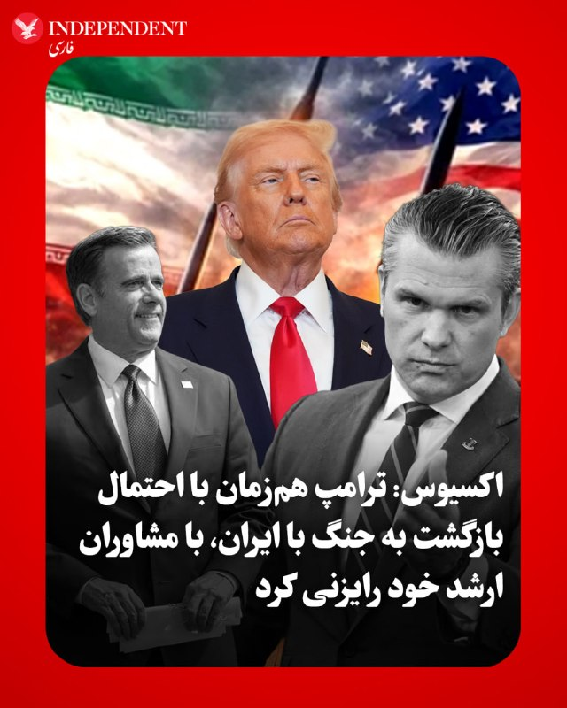
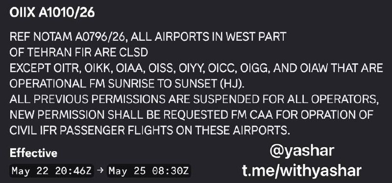
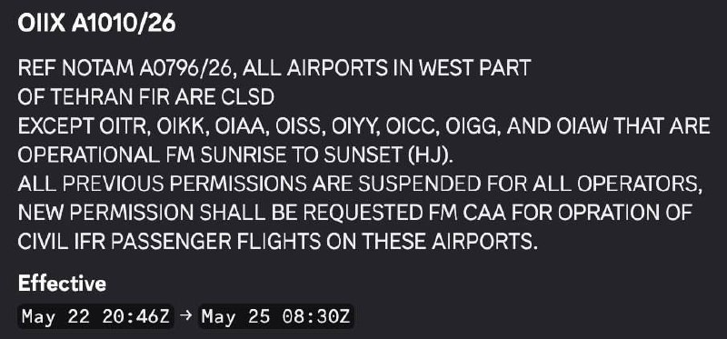

# خواننده تلگرام

<!-- TOP_NAV START -->

<a href="https://github.com/drsploit/aio-DL/blob/main/telegram/content/archive_1.md" style="display:inline-block; padding:6px 12px; margin:0 4px; background-color:#2ea44f; color:white; text-decoration:none; border-radius:4px; font-weight:bold;">صفحه بعد</a>

<!-- TOP_NAV END -->

<!-- MSG START -->

---
📅 بروزرسانی: 1405/03/02 01:20
---

## VahidOOnLine — post 241609

  <a href="telegram/content/VahidOOnLine_241609_1779486621.mp4" target="_blank">🎬 Download video</a>

⭕️«صبحانه زنان»؛ بنیاد زنان نیویورک ۱۵۰۰ زن تاثیرگذار را در نیویورک گرد هم آورد

📌یکی از نمادهای مشهور این مراسم اهدای جایزه «عصای راه‌پیمایی» است؛ تندیسی نمادین که مفاهیمی چون قدرت، خرد و حرکت روبه‌جلو را نمایندگی می‌کند

♦️برگزارکنندگان این مراسم تاکید کردند این بنیاد طی سال‌ها توانسته است زنان آمریکایی را، فارغ از وابستگی‌های حزبی و تفاوت‌های سیاسی، کنار یکدیگر گرد آورد و از طریق فعالیت‌های مدنی، آموزشی و اقتصادی، بر جامعه آمریکا تاثیر بگذارد.

یکی از نمادهای این مراسم «عصای راه‌پیمایی» (Walking Stick Award) است؛ هدیه‌ای نمادین و دست‌ساز که با الهام از هنرهای بومی، مختص به هر فرد ساخته و تزیین و به زنان تاثیرگذار، فعالان اجتماعی و رهبران مدنی اهدا می‌شود و مفاهیمی چون قدرت، خرد و حرکت روبه‌جلو را نمایندگی می‌کند.
ایده ساخت و اهدای این عصای تزیین‌شده که گوناگونی و جمعیت رنگارنگ آمریکا را به تصویر می‌کشد، یکی از سازمان‌های تحت‌حمایت بنیاد که در حوزه توانمند سازی زنان فعالیت می‌کند، مطرح و اجرا کرد.

بیشتر بخوانید...
‌🇸🇦 Indypersian

🤖 @VahidOOnLine

## VahidOOnLine — post 241608

  

♦️بر اساس گزارش‌های تحلیلی آژانس رتبه‌بندی مودیز (Moody's)، رتبه اعتباری بلندمدت عربستان سعودی با وجود انسداد تنگه هرمز، همچنان «پایدار» است. مودیز در گزارش روز جمعه خود اعلام کرد که این تصمیم بازتاب‌دهنده اقتصاد بزرگ، ثروتمند و جایگاه رقابتی بالا و هزینه پایین تولید هیدروکربن در این کشور، در کنار بهبود اثربخشی سیاست‌ها و پیشرفت در چارچوب چشم‌انداز ۲۰۳۰ است. این آژانس تایید کرد که رشد بخش خصوصی غیرنفتی عربستان سعودی با نرخ پیش‌بینی‌شده ۴ تا ۵ درصد پس از فروکش کردن تنش‌ها، از قوی‌ترین‌ها در میان کشورهای شورای همکاری خلیج فارس خواهد بود. اگرچه اقتصاد پادشاهی سعودی به دلیل درگیری‌های جاری در خاورمیانه و انسداد عملی تنگه هرمز از اوایل ماه مارس، با کاهش ۱۰ درصدی تولید هیدروکربن و انقباض ۱.۷ درصدی کلِ جی‌دی‌پی (GDP) در سال ۲۰۲۶ مواجه است، اما مودیز پیش‌بینی می‌کند که در سال ۲۰۲۷ و با عادی‌سازی جریان تجارت، رشد اقتصادی عربستان سعودی جهش چشمگیر ۸ درصدی را تجربه کند.
طبق تحلیل سناریوی مرکزی این آژانس رتبه‌بندی، ساختار اعتباری عربستان سعودی در برابر اختلالات طولانی‌مدت و انسداد تنگه هرمز تا پایان سال ۲۰۲۶ تاب‌آور خواهد بود. این ثبات و انعطاف‌پذیری به دلیل توانایی ریاض در تغییر مسیر بخش عمده‌ای از صادرات نفت خود از طریق خط لوله شرق به غرب به سمت پایانه‌های دریای سرخ است؛ به‌طوری‌که این بنادر اکنون قادر به بارگیری تا ۵ میلیون بشکه در روز معادل نفت (دو‌سوم سطوح پیش از نزاع منطقه) هستند. علاوه بر این، جهش قیمت نفت به محدوده ۹۰ تا ۱۱۰ دلار در هر بشکه در سال ۲۰۲۶ و وجود دارایی‌های مالی قدرتمند دولت (معادل ۱۸ درصد جی‌دی‌پی در سال ۲۰۲۵)، ظرفیت بالایی را برای جذب نوسانات ایجاد کرده و درآمدها را فراتر از پیش‌بینی‌های قبل از جنگ برده است.
‌🇸🇦 Indypersian

🤖 @VahidOOnLine

## VahidOOnLine — post 241607

  

ترامپ در یک سخنرانی در سوفرن نیویورک گفت: «با عملیات خشم حماسی، رزمندگان ما اطمینان حاصل خواهند کرد که جمهوری اسلامی به عنوان بزرگ‌ترین حامی «تروریسم» دولتی در جهان، هرگز به سلاح هسته‌ای دست نخواهد یافت و خودشان هم این را می‌دانند.»
ترامپ گفت: حکومت ایران به عنوان بزرگ‌ترین حامی تروریسم دولتی، به سراسر جهان پول می‌فرستد تا مشکل ایجاد کند.

‌🏁 🇬🇧 IranintlTV

🤖 @VahidOOnLine

## VahidOOnLine — post 241606

  

خبرگزاری تسنیم، وابسته به سپاه پاسداران، به نقل از یک منبع نظامی گزارش داد نیروهای مسلح جمهوری اسلامی «به‌طور کامل» تحولات را زیر نظر دارند و در صورت آنچه «حماقت دشمن» و هرگونه بهانه‌جویی از سوی آمریکا و متحدانش خوانده شده، سناریوهای تازه‌ای آماده کرده‌اند.

به گفته این منبع، در صورت اقدام نظامی احتمالی آمریکا، «نسخه سوم مبارزه جمهوری اسلامی» اجرا خواهد شد؛ نسخه‌ای که به ادعای او در حوزه تجهیزات جدید، اهداف نوین، تاکتیک‌ها و راهبردهای جنگی نمود خواهد داشت و حتی می‌تواند جبهه‌های جدیدی در سطح فرامنطقه‌ای ایجاد کند.

این منبع نظامی همچنین مدعی شد آمریکا در صورت «زیاده‌خواهی و اقدام نظامی»، «تنبیه بزرگ سوم» را در کمتر از یک سال تجربه خواهد کرد؛ تنبیهی که به گفته او «به شکلی خاص‌تر و جدیدتر» خواهد بود.
‌🏁 🇬🇧 IranintlTV

🤖 @VahidOOnLine

## VahidOOnLine — post 241605

  

♦️تسنیم، خبرگزاری وابسته به سپاه پاسداران، روز جمعه به نقل از «یک منبع نظامی» نوشت: «نیروهای مسلح جمهوری اسلامی کاملا اوضاع را زیر نظر دارند و در صورت حماقت دشمن با هرگونه بهانه جویی، سناریوهای تازه‌ای برای آمریکا و متحدانش آماده کرده‌اند. این منبع نظامی در گفتگو با تسنیم ضمن اشاره به اینکه اگر دشمن حماقت کند، «نسخه سوم مبارزه ایران» را مشاهده خواهد کرد مدعی شد: «این نسخه سوم هم در حوزه تجهیزات جدید و هم در حوزه اهداف نوین و نیز در حوزه تاکتیک‌ها و استراتژی جنگ نمایان خواهد شد. به نحوی که جبهه‌های جدید فرامنطقه‌ای نیز آنها را پشیمان‌تر خواهد کرد. آمریکا در صورت زیاده‌خواهی و بهانه‌جویی و اقدام نظامی احتمالی، تنبیه بزرگ سوم خود را در کمتر از یکسال تجربه خواهد کرد؛ این بار به شکل خاص‌تر و جدیدتر».
‌🇸🇦 Indypersian

🤖 @VahidOOnLine

## VahidOOnLine — post 241604

  

♦️فرماندهی مرکزی آمریکا، سنتکام، با انتشار تصاویری از یک  هلیکوپتر «یو‌اچ-۱‌وای ونوم» (UH-1Y Venom) متعلق به نیروی دریایی آمریکا، جزئیاتی از عملیات‌های اخیر در چارچوب محاصره بنادر جمهوری اسلامی را به نمایش گذاشت.
سنتکام اعلام کرد این هلیکوپتر در جریان عملیات محاصره دریایی علیه بنادر جمهوری اسلامی به کار گرفته شده و توانایی اجرای ماموریت‌های مختلف از جمله رهگیری دریایی، شناسایی و پشتیبانی نزدیک رزمی را دارد.
‌🇸🇦 Indypersian

🤖 @VahidOOnLine

## VahidOOnLine — post 241603

  <a href="telegram/content/VahidOOnLine_241603_1779486625.mp4" target="_blank">🎬 Download video</a>

یک شهروند در پیامی صوتی به ایران اینترنشنال از فشار شدید در ایران و بلاتکلیفی و استرس به دلیل اظهارات دونالد ترامپ درباره امکان پایان جنگ و آتش‌بس می‌گوید. صدای او برای حفظ امنیتش با هوش مصنوعی بازخوانی شده است.
‌🏁 🇬🇧 IranintlTV

🤖 @VahidOOnLine

## VahidOOnLine — post 241602

  

♦️به گزارش اکسیوس، دونالد ترامپ، رئیس‌جمهوری آمریکا، روز جمعه با تیم ارشد امنیت ملی خود در کاخ سفید دیدار کرد تا سناریوهای مختلف در صورت شکست مذاکرات و احتمال آغاز حملات جدید علیه ایران را بررسی کند. در این نشست حساس که با حضور مقامات کلیدی از جمله جِی‌دی ونس، معاون رئیس‌جمهوری، پیت هگست، وزیر جنگ و جان راتکلیف، رئیس سی‌آی‌ای، برگزار شد، ترامپ در جریان آخرین وضعیت دیپلماسی قرار گرفت. نشانه‌های جدی از تغییر برنامه آخر هفته رئیس‌جمهوری، از جمله لغو سفر به باشگاه گلف بدمینستر، بازگشت به واشنگتن و حتی عدم شرکت در مراسم عروسی پسرش، دونالد ترامپ جوان، نشان‌دهنده وضعیت اضطراری در کاخ سفید است. منابع نزدیک به ترامپ می‌گویند او از روند کند مذاکرات ناامید شده و به سمت گزینه نظامی متمایل شده است، هرچند هنوز تصمیم قطعی برای از سرگیری جنگ اتخاذ نشده است.
در همین حال، تهران به کانون تلاش‌های دیپلماتیک «لحظه آخری» برای جلوگیری از شعله‌ور شدن دوباره جنگ تبدیل شده است. عاصم منیر، فرمانده کل ارتش پاکستان، به عنوان میانجی اصلی، در سفری حساس وارد تهران شده و قرار است با احمد وحیدی، از فرماندهان کلیدی سپاه پاسداران دیدار کند. هم‌زمان، یک هیئت قطری نیز برای پشتیبانی از این میانجی‌گری وارد پایتخت ایران شده است. با این حال، یک مقام آمریکایی روند تبادل پیش‌نویس‌ها میان طرفین را «زجرآور» و بدون پیشرفت ملموس توصیف کرده است؛ امری که نشان می‌دهد شکاف‌های موجود میان دو طرف چقدر عمیق است.
در طرف مقابل، وزارت امور خارجه ایران و رسانه‌های نزدیک به سپاه پاسداران تایید کرده‌اند که گفتگوها در جریان است اما هنوز هیچ نتیجه نهایی حاصل نشده و توافق نزدیکی در کار نیست. مقامات ایرانی تاکید دارند که تمرکز فعلی مذاکرات صرفا بر «پایان دادن به جنگ» است و تا زمانی که این هدف محقق نشود، درباره هیچ موضوع دیگری گفتگو نخواهد شد. ناظران معتقدند با وجود اینکه ترامپ در هفته‌های گذشته چندین بار تا آستانه از سرگیری جنگ پیش رفته و عقب‌نشینی کرده، اما ساعات پیش رو و احتمال رخ دادن یک گشایش ناگهانی در ۲۴ ساعت آینده، تعیین‌کننده مسیر نهایی (جنگ یا دیپلماسی) خواهد بود.
‌🇸🇦 Indypersian

🤖 @VahidOOnLine

## VahidOOnLine — post 241601

  

دونالد ترامپ، رییس جمهوری ایالات متحده، در سخنرانی خود در نیویورک درباره جنگ ایران اعلام کرد: «این ماجرا به‌زودی پایان خواهد یافت.»

او همچنین گفت که ما جمهوری اسلامی را متوقف کرده‌ایم؛ آن‌ها هرگز به سلاح هسته‌ای دست نخواهند یافت.
‌🏁 🇬🇧 IranintlTV

🤖 @VahidOOnLine

## VahidOOnLine — post 241600

  

اکسیوس به نقل از دو مقام آمریکایی اعلام کرد که ترامپ صبح جمعه نشستی با اعضای ارشد تیم امنیت ملی خود درباره جنگ ایران برگزار کرد.
اکسیوس نوشت به گفته منابعی که مستقیما با ترامپ گفت‌وگو کردند، او در حال بررسی حملات جدید است، مگر اینکه پیشرفتی در مذاکرات در آخرین لحظه حاصل شود.
‌🏁 🇬🇧 IranintlTV

🤖 @VahidOOnLine

## VahidOOnLine — post 241599

  

♦️دونالد ترامپ روز جمعه، اول خردادماه، طی سخنرانی در نیویورک درباره جنگ با ایران گفت که «این ماجرا به‌زودی تمام خواهد شد». رئیس‌جمهوری آمریکا گفت: «اگر جلوی ایران را نگیریم، آنها به سلاح هسته‌ای دست پیدا می‌کنند. مجبوریم این کار را بکنیم، و ما جلوی آنها را گرفتیم. آنها هرگز به سلاح هسته‌ای دست پیدا نخواهند کرد».
‌🇸🇦 Indypersian

🤖 @VahidOOnLine

## VahidOOnLine — post 241598

  

آسوشیتدپرس به نقل از یک مقام آمریکایی اعلام کرد ارتش آمریکا تاکنون هیچ مین انفجاری در تنگه هرمز کشف یا خنثی نکرده است.
این مقام آمریکایی افزود عملیات جست‌وجو در این گذرگاه حیاتی نفتی همچنان ادامه دارد، اما تاکنون هیچ مین دریایی پیدا نشده است.

این در حالی است که محاصره دریایی بنادر جنوب ایران همچنان ادامه دارد.
‌🏁 🇬🇧 IranintlTV

🤖 @VahidOOnLine

## VahidOOnLine — post 241597

♦️ویدیوی منتشرشده در شبکه‌های اجتماعی، جشن تولد خانواده امیرمحمد خیاط بر سر مزار او را نشان می‌دهد؛ جایی که پدر این قهرمان تکواندو با چهره‌ای اندوهگین و بغض‌آلود، بر مزار فرزندش رقصی سوگوارانه انجام می‌دهد.
امیرمحمد خیاط ۱۸ دی‌ماه ۱۴۰۴ در اطراف میدان خیام نیشابور با شلیک نیروهای سرکوب جمهوری اسلامی کشته شد.
او متولد ۲۶ اردیبهشت ۱۳۸۲ بود و از نوجوانی در رشته تکواندو فعالیت می‌کرد. امیرمحمد طی سال‌های اخیر بیش از ۲۰ عنوان قهرمانی، نایب‌قهرمانی و مقام سوم رقابت‌های استانی و باشگاهی را به دست آورده بود.
‌🇸🇦 Indypersian

🤖 @VahidOOnLine

## VahidOOnLine — post 241596

  

♦️عباس عراقچی، وزیر خارجه جمهوری اسلامی روز جمعه با آنتونیو گوترش، دبیرکل سازمان ملل متحد، تلفنی گفتگو کرد. به گزارش ایرنا، در این گفتگو، علاوه بر بررسی آخرین وضعیت منطقه‌، دو طرف روند تحولات مرتبط با دیپلماسی میان تهران و واشنگتن با میانجی‌گری اسلام‌آباد را بررسی کردند.
هم‌زمان با این گفتگو، عاصم منیر، فرمانده کل ارتش پاکستان و محسن نقوی، وزیر کشور این کشور در سفری از پیش اعلام‌نشده وارد تهران شدند؛ سفری که هدف اصلی آن، حل اختلافات میان تهران و واشنگتن برای امضای تفاهم‌نامه اولیه شروع مذاکرات عنوان شده است. همچنین سخنگوی وزارت خارجه ایران از حضور یک هیئت قطری در تهران در چارچوب «مساعی جمیله» برای کاهش تنش‌ها خبر داد، هرچند تاکید کرد که پاکستان همچنان میانجی رسمی این گفتگوهاست. با وجود این تحرکات، اسماعیل بقایی با «عمیق و جدی» خواندن شکاف‌های میان ایران و آمریکا اعلام کرد که تمرکز فعلی مذاکرات بر پایان دادن به جنگ است، مسئله هسته‌ای هنوز در دستور کار نیست و نمی‌توان گفت که توافق در هفته‌ها یا ماه‌های آینده نزدیک خواهد بود.
‌🇸🇦 Indypersian

🤖 @VahidOOnLine

## WithYashar — post 12047

گزارش‌های متعددی درباره برخاستن اضطراری (اسکرامبل) جنگنده‌ها از فرودگاه مهرآباد، تهران دریافت شده است.
@withyashar
جنگنده های خود رژیمن از ترسه …. شانه کسکم

## WithYashar — post 12046

کردان سمت هشتگرد صدای جنگنده میاد

## WithYashar — post 12045

یاشار جان کرج صدای جنگنده میاد
ساعت 01:06

## WithYashar — post 12044

  

فضای هوایی غرب ایران طبق یک NOTAM جدید تا صبح روز دوشنبه بسته شده است، به‌جز پروازهای روزانه (در ساعات روشنایی روز)
@withyashar

## WithYashar — post 12043

۸۹ ساعت و ۳۰ دقیقه دقیقا الان خوبه ؟
چون ویس و حتی تکست ها رو که بالا هست نمیری ‌نگاه کنی …🤬۵۰ بار گفتم

## WithYashar — post 12042

چرا ۹۰ساعت؟

## WithYashar — post 12041

دقایقی پیش بازار بورس آمریکا برای حدود ۹۰ ساعت آینده بسته شد.
@withyashar
رفتیم تو وضعیت قرمز 💥

## WithYashar — post 12040

  <a href="telegram/content/WithYashar_12040_1779486631.mp4" target="_blank">🎬 Download video</a>

یاد این سکانس افتادم 😔
@withyashar

## WithYashar — post 12039

این دوتا غذا آخری که گفتی چی هست اصن🥲🙁

## WithYashar — post 12038

## WithYashar — post 12037

ترامپ: «مسئله‌ی ایران خیلی زود تمام می‌شود و همه‌چیز به‌‌ سرعت به حالت عادی بازمی‌گردد.»
@withyashar

## WithYashar — post 12036

اتاق جنگ با شما : تهران/ولنجک صدای رد شدن پهباد میاد سمت ۰۰:۳۰
@withyashar

## WithYashar — post 12035

اتاق جنگ با شما : پدافند مشهد جای فرودگاه فعال شده
@withyashar

## WithYashar — post 12034

اکسیوس: منابع نزدیک به مذاکرات میگن توی ۲۴ ساعت آینده امکان پیشرفت وجود داره ترامپ ساعاتی پیش جلسه‌ای با تیم ارشد امنیت ملی درباره‌ی جنگ با ایران تشکیل داده بود
@withyashar

## WithYashar — post 12033

اتاق جنگ با شما : سلام داداشم پدافند اصفهان چند دقیقس فعاله
@withyashar

## WithYashar — post 12032

## WithYashar — post 12031

سلام داداش یاشار
بنظرت الان ک مقامات پاکستان تو ایرانن
بازم ممکنه امشب بزنه یا اصلا فردا؟
امکانش هست؟

## WithYashar — post 12030

پرزیدنت ترامپ:

من از ناهار خوردن با کسی که واقعاً واقعاً موفق است متنفرم، زیرا او مدام در مورد اینکه چقدر عالی هستند لاف می زند و این باعث می شود در مورد اینکه رئیس جمهور شدم صحبت نکنم.

ترامپ : ما جلوی ایران رو گرفتیم اونها هرگز نباید سلاح هسته ای داشته باشن
@withyashar

## WithYashar — post 12029

## WithYashar — post 12028

## mwarmonitor — post 9506

  <a href="telegram/content/mwarmonitor_9506_1779486632.mp4" target="_blank">🎬 Download video</a>

ترامپ حرکت جدید به رقص معروف خودش اضافه کرد 🏌

@mwarmonitor

## mwarmonitor — post 9505

  

🔴فضای هوایی غرب ایران طبق یک NOTAM جدید تا صبح روز دوشنبه بسته شده است، به‌جز پروازهای روزانه (در ساعات روشنایی روز).

@mwarmonitor

## mwarmonitor — post 9504

🔴اکسیوس: ترامپ در بحبوحه بررسی احتمال بازگشت به جنگ، با مشاوران ارشد خود درباره ایران تشکیل جلسه داد

📝نویسنده: باراک راوید

🔰به گفته دو مقام آمریکایی به «اکسیوس»، پرزیدنت ترامپ صبح روز جمعه جلسه‌ای را با تیم امنیت ملی ارشد خود درباره جنگ با ایران برگزار کرد.

📌چرا این موضوع اهمیت دارد؟
منابعی که مستقیماً با رئیس‌جمهور گفتگو کرده‌اند می‌گویند ترامپ در صورت عدم دستیابی به یک گشایش ناگهانی و دقیقه‌نودی در مذاکرات، به‌طور جدی در حال بررسی آغاز حملات جدید علیه ایران است.

نمای دوقاب (تحولات هم‌زمان):
نشست ترامپ درباره ایران در حالی برگزار شد که رئیس ارتش پاکستان، فیلد مارشال عاصم منیر، در تلاشی آشکار و دقیقه‌نودی برای پر کردن شکاف‌ها و جلوگیری از سرگیری جنگ، به تهران سفر کرده است.
یک هیئت قطری نیز روز جمعه برای حمایت از تلاش‌های میانجی‌گرانه وارد تهران شد.
انتظار می‌رود عاصم منیر روز شنبه با سردار احمد وحیدی، از فرماندهان سپاه پاسداران و مهره‌ای کلیدی در فرآیند تصمیم‌گیری ایران، دیدار کند.
یک مقام آمریکایی که در جریان تلاش‌های دیپلماتیک قرار گرفته است، روند مذاکرات را «طاقت‌فرسا» توصیف کرد. این مقام آمریکایی گفت که پیش‌نویس‌ها «هر روز بین طرفین رد و بدل می‌شوند» اما پیشرفت چندانی حاصل نشده است.
حاضران در اتاق جلسه:
به گفته منابع آگاه، در این نشست علاوه بر ترامپ، جی‌دی ونس (معاون رئیس‌جمهور)، پیت هگست (وزیر دفاع)، جان راتکلیف (رئیس سی‌آی‌ای)، سوزی وایلز (رئیس کارکنان کاخ سفید) و دیگر مقامات حضور داشتند.
مارکو روبیو (وزیر امور خارجه) و ژنرال دن کین (رئیس ستاد مشترک ارتش) در این جلسه حضور نداشتند؛ چرا که روبیو در اروپا بود و ژنرال کین در مراسم فارغ‌التحصیلی آکادمی نیروی دریایی حضور داشت.
در طول این جلسه، گزارشی از آخرین وضعیت مذاکرات و سناریوهای مختلف در صورت فروپاشی گفتگوها به ترامپ ارائه شد.
نکات جالب و پشت‌پرده:
چند ساعت پس از این دیدار، کاخ سفید از تغییر در برنامه آخر هفته ترامپ خبر داد.
او پس از سخنرانی برنامه‌ریزی‌شده خود در غروب جمعه در نیویورک، به جای اقامت در باشگاه گلف خود در بد مینستر، به واشنگتن بازخواهد گشت.
ترامپ همچنین در حساب کاربری خود در شبکه اجتماعی «تروث سوشال» نوشت که به دلیل «مسائل مربوط به دولت و عشق به ایالات متحده آمریکا» در مراسم عروسی پسرش، دان جونیور، در این آخر هفته شرکت نخواهد کرد.
او نوشت: «احساس می‌کنم برای من مهم است که در این بازه زمانی حساس، در واشنگتن دی‌سی و در کاخ سفید بمانم.»
در پشت صحنه چه می‌گذرد؟
یک منبع نزدیک به ترامپ و منبع دوم دیگری که از شرایط آگاهی دارد به اکسیوس گفتند که ترامپ طی چند روز گذشته به شدت از روند مذاکرات با ایران ناامید و کلافه شده است.
به گفته این دو منبع، او روز سه‌شنبه به بنیامین نتانیاهو، نخست‌وزیر اسرائیل گفت که می‌خواهد شانس دیگری به دیپلماسی بدهد، اما تا پنجشنبه‌شب، نظرش بیشتر به سمت صدور فرمان حمله متمایل شده بود.
یک منبع نزدیک به ترامپ گفت رئیس‌جمهور احتمال یک عملیات نظامی بزرگ و «تعیین‌کننده» نهایی را مطرح کرده است تا پس از آن بتواند اعلام پیروزی کند و به جنگ پایان دهد.
با این حال، هنوز هیچ نشانه‌ای مبنی بر اینکه ترامپ تصمیم قطعی برای سرگیری جنگ گرفته باشد، وجود ندارد.
موضع طرف مقابل:
وزارت امور خارجه ایران روز جمعه اعلام کرد که گفتگوها در جریان است اما توافق نزدیکی در کار نیست.
خبرگزاری نیمه‌رسمی تسنیم، وابسته به سپاه پاسداران، روز جمعه به نقل از یک منبع نزدیک به تیم مذاکره‌کننده ایران نوشت: «گفتگوها پیرامون موضوعات مورد اختلاف همچنان ادامه دارد و هنوز نتیجه نهایی حاصل نشده است.»
🔹این منبع مدعی شد که تمرکز فعلی بر «پایان دادن به جنگ» است و تا زمانی که این هدف محقق نشود، در مورد هیچ موضوع دیگری مذاکره نخواهد شد.

🔸تحلیل واقعیتِ میان خطوط:
ترامپ طی شش هفته گذشته چندین بار تا آستانه سرگیری جنگ پیش رفته اما در نهایت از آن صرف‌نظر کرده است.
برخی منابع نزدیک به مذاکرات همچنان بر این باورند که در ۲۴ ساعت آینده فرصتی برای نوعی گشایش وجود دارد.
با این حال، دو منبع آگاه از طرز تفکر ترامپ می‌گویند او تمایل دارد اقدام نظامی را پیش ببرد، مگر اینکه اتفاق غیرمنتظره‌ای در گفتگوها رخ دهد.

@mwarmonitor

## FoxNewsTwitter — post 342148

  <a href="telegram/content/FoxNewsTwitter_342148_1779486634.mp4" target="_blank">🎬 Download video</a>

Fox News (Twitter/X)

WATCH: President Trump breaks out his staple 'YMCA' dance moves — with a bonus golf swing — as he wraps up a midterm campaign event in upstate New York.

## FoxNewsTwitter — post 342147

  <a href="telegram/content/FoxNewsTwitter_342147_1779486636.mp4" target="_blank">🎬 Download video</a>

Fox News (Twitter/X)

NEW: Tom Gorman, father of slain Sheridan Gorman, shared the devastating reality his family faces following his daughter’s murder at the hands of an illegal immigrant.

Gorman addressed the agonizing grief he and his wife endure, describing a heartbreaking moment on Mother’s Day that underscores the human cost of the border crisis.

“I am a husband who had to hold his wife on Mother’s Day when she asked the question no mother should ever have to ask. Through tears, Jess looked at Maddy and me and asked, ‘Am I still the mother of two?’ There’s no answer big enough for that pain.”

“All I could do was hold her and tell her the truth: ‘Yes, Jess. You’re still the mother of two because Sheridan will always be our daughter.’”

## FoxNewsTwitter — post 342146

  <a href="telegram/content/FoxNewsTwitter_342146_1779486638.mp4" target="_blank">🎬 Download video</a>

Fox News (Twitter/X)

BREAKING: President Trump blasts Democrats as “bulls**** artists” for trying to blame his admin for rising costs just days after he took office:

“The Democrats are the ones that caused all the costs.”

“They would constantly come out with the word ‘affordability.’ I said they’re the ones that caused the problem.”

“I’m in office two days, and the costs have gone through the roof under four years of Sleepy Joe or Crooked Joe — or both — Biden.”

“They’re the greatest ‘bulls**** artists.’”

## FoxNewsTwitter — post 342145

Fox News (Twitter/X)

BREAKING: Jessica Gorman, the mother of slain Sheridan Gorman, delivers a powerful rebuke of far-left sanctuary policies, saying that her daughter’s life was stolen by an illegal migrant who should have never been released into the community:

“No mother should ever have to wonder if her child called out for her in her final moments.”

“No mother should ever have to imagine her baby lying alone and bleeding on the cold pavement.”

“No family should ever have to bury a child because public officials failed to put innocent American lives first.”

“Please, please support leaders and policies that protect your child and mine. Because a city, a state, or a country that does not protect its children has lost its way. And together, we must be brave enough to demand that it find its way back.”

## FoxNewsTwitter — post 342144

Fox News (Twitter/X)

BREAKING: The mother of Welles Crowther — the 9/11 hero known for the red bandana he wore as he repeatedly ran back into the South Tower to save as many as 18 lives — joins President Trump on stage as he announces that Welles will posthumously receive the Presidential Medal of Freedom.

TRUMP: “I just want to congratulate his great mother on doing a phenomenal job raising that young man. Boy, what bravery. He saved those people and became a legend, in a sense. Nobody else would have done what he did.”

ALLISON CROWTHER: “It’s such a beautiful thing that even 25 years later, Welles’ light still shines brightly.”

## FoxNewsTwitter — post 342143

  <a href="telegram/content/FoxNewsTwitter_342143_1779486639.mp4" target="_blank">🎬 Download video</a>

Fox News (Twitter/X)

JUST IN: President Trump rips the Biden admin’s electric vehicle mandate, warning that the power grid cannot support a forced transition to EVs:

“We ended Joe Biden’s insane electric vehicle mandate. That’s where they wanted everybody to buy an electric car.”

“If we would build the charging booths, right? It would cost the country $4 trillion. No country can afford that.”

“We love electric cars. I have to say that because of Elon.”

“Not everybody wants to have an electric car. And I ended that whole nonsense. By 2030, you’re all going to have electric cars? I don’t think so.”

## FoxNewsTwitter — post 342142

  <a href="telegram/content/FoxNewsTwitter_342142_1779486641.mp4" target="_blank">🎬 Download video</a>

Fox News (Twitter/X)

NEW: President Trump praises his admin's move to bring automotive manufacturing jobs back to the U.S. from overseas.

“They were all made in Germany and other countries. Now they're making them here because if they don't, they have to pay a big penalty."

"They're stamping them at my instruction 'Made in the USA.'"

## FoxNewsTwitter — post 342141

  <a href="telegram/content/FoxNewsTwitter_342141_1779486642.mp4" target="_blank">🎬 Download video</a>

Fox News (Twitter/X)

NEW: President Trump slams Democrats for spending millions on a political “autopsy” before asking a roaring crowd which nickname for Joe Biden they like best:

“They spent $10 million for the autopsy. It was called an autopsy. And they had typos. They had typos in every other sentence. They had misspelled words. They had commas in the wrong locations.”

“I could have given them the autopsy without any charge at all.”

“I said you had one candidate named Sleepy Joe Biden.”

## VahidOnline — post 75629

  

به گزارش اکسیوس، دونالد ترامپ، رئیس‌جمهوری آمریکا، روز جمعه با تیم ارشد امنیت ملی خود در کاخ سفید دیدار کرد تا سناریوهای مختلف در صورت شکست مذاکرات و احتمال آغاز حملات جدید علیه ایران را بررسی کند.

در این نشست حساس که با حضور مقامات کلیدی از جمله جِی‌دی ونس، معاون رئیس‌جمهوری، پیت هگست، وزیر جنگ و جان راتکلیف، رئیس سی‌آی‌ای، برگزار شد، ترامپ در جریان آخرین وضعیت دیپلماسی قرار گرفت.

نشانه‌های جدی از تغییر برنامه آخر هفته رئیس‌جمهوری، از جمله لغو سفر به باشگاه گلف بدمینستر، بازگشت به واشنگتن و حتی عدم شرکت در مراسم عروسی پسرش، دونالد ترامپ جوان، نشان‌دهنده وضعیت اضطراری در کاخ سفید است.
منابع نزدیک به ترامپ می‌گویند او از روند کند مذاکرات ناامید شده و به سمت گزینه نظامی متمایل شده است، هرچند هنوز تصمیم قطعی برای از سرگیری جنگ اتخاذ نشده است.

در همین حال، تهران به کانون تلاش‌های دیپلماتیک «لحظه آخری» برای جلوگیری از شعله‌ور شدن دوباره جنگ تبدیل شده است.
عاصم منیر، فرمانده کل ارتش پاکستان، به عنوان میانجی اصلی، در سفری حساس وارد تهران شده و قرار است با احمد وحیدی، از فرماندهان کلیدی سپاه پاسداران دیدار کند.
@VahidOOnLine

📡 @VahidOnline

## kianmeli1 — post 87568

🔴جمهوری اسلامی تهدیدات حمله را کاملا جدی گرفته است و تمام پایگاه ها آماده باش کامل است

باید دید آیا برنامه ترامپ حمله است یا خیر
https://t.me/kianmeli1

## kianmeli1 — post 87567

  

🔴امشب ایران آماده جنگ احتمالی شد

فضای هوایی غرب ایران طبق یک NOTAM جدید تا صبح روز دوشنبه بسته شده است، به‌جز پروازهای روزانه (در ساعات روشنایی روز).
https://t.me/kianmeli1

## kianmeli1 — post 87566

🔴دقایقی پیش بازار بورس آمریکا برای حدود ۹۰ ساعت آینده بسته شد.

اگر قرار است ترامپ فرمان حمله صادر کند امشب یا فرداشب صادر میشود
https://t.me/kianmeli1

## kianmeli1 — post 87565

🔴خبرگزاری تسنیم، وابسته به سپاه پاسداران، به نقل از یک منبع نظامی می‌گوید نیروهای مسلح ایران در حال آماده شدن برای از سرگیری احتمالی جنگ با آمریکا هستند و طرح جدیدی برای «مبارزه سوم» آماده کرده‌اند که آمریکا و متحدان آمریکا را به شیوه‌ای «جدید و خاص» هدف قرار خواهد داد.
https://t.me/kianmeli1

## kianmeli1 — post 87564

🔴طرفداران نظام در میدان انقلاب خطاب به ترامپ

حمله امشب چی شد منتظریم
https://t.me/kianmeli1

## kianmeli1 — post 87563

‏🔴اکسیوس به نقل از دو مقام آمریکایی اعلام کرد که دونالد ترامپ صبح جمعه نشستی با اعضای ارشد تیم امنیت ملی خود درباره جنگ ایران برگزار کرد
https://t.me/kianmeli1

## kianmeli1 — post 87562

  

🔴سایت انصاف‌نیوز از دسترس خارج شد.

این سایت روز گذشته نوشته بود:
« شنیده‌ی انصاف نیوز حاکی است که سعید جلیلی مدتی است در جلسات شعام شرکت نمی‌کند.»
https://t.me/kianmeli1

## kianmeli1 — post 87561

🔴ترامپ درباره تست شناختی : بایدن حتی سوال اول رو هم نمی‌تونست جواب بده

فکر نمی‌کنم بتونه بگیره اینا رو
کدوم خرسه کدوم اسبه
https://t.me/kianmeli1

## kianmeli1 — post 87560

  <a href="telegram/content/kianmeli1_87560_1779486645.mp4" target="_blank">🎬 Download video</a>

🔴ترامپ:من باهوش‌ترین آدمی هستم که شما ممکن است ببینید
https://t.me/kianmeli1

## kianmeli1 — post 87559

  <a href="telegram/content/kianmeli1_87559_1779486646.mp4" target="_blank">🎬 Download video</a>

🔴ترامپ: ما اینقدر نفت از ونزوئلا استخراج کرده‌ایم(چاپیدیم) که هزینه جنگ را حدود ۲۵ برابر پرداخت کرده‌ایم.
https://t.me/kianmeli1

## IranIntlTV — post 338498

  

ترامپ در یک سخنرانی در سوفرن نیویورک گفت: «با عملیات خشم حماسی، رزمندگان ما اطمینان حاصل خواهند کرد که جمهوری اسلامی به عنوان بزرگ‌ترین حامی «تروریسم» دولتی در جهان، هرگز به سلاح هسته‌ای دست نخواهد یافت و خودشان هم این را می‌دانند.»
ترامپ گفت: حکومت ایران به عنوان بزرگ‌ترین حامی تروریسم دولتی، به سراسر جهان پول می‌فرستد تا مشکل ایجاد کند.

https://iranintl.com/202605221757

## IranIntlTV — post 338497

  

خبرگزاری تسنیم، وابسته به سپاه پاسداران، به نقل از یک منبع نظامی گزارش داد نیروهای مسلح جمهوری اسلامی «به‌طور کامل» تحولات را زیر نظر دارند و در صورت آنچه «حماقت دشمن» و هرگونه بهانه‌جویی از سوی آمریکا و متحدانش خوانده شده، سناریوهای تازه‌ای آماده کرده‌اند.

به گفته این منبع، در صورت اقدام نظامی احتمالی آمریکا، «نسخه سوم مبارزه جمهوری اسلامی» اجرا خواهد شد؛ نسخه‌ای که به ادعای او در حوزه تجهیزات جدید، اهداف نوین، تاکتیک‌ها و راهبردهای جنگی نمود خواهد داشت و حتی می‌تواند جبهه‌های جدیدی در سطح فرامنطقه‌ای ایجاد کند.

این منبع نظامی همچنین مدعی شد آمریکا در صورت «زیاده‌خواهی و اقدام نظامی»، «تنبیه بزرگ سوم» را در کمتر از یک سال تجربه خواهد کرد؛ تنبیهی که به گفته او «به شکلی خاص‌تر و جدیدتر» خواهد بود.
https://iranintl.com/202605226156

## IranIntlTV — post 338496

  <a href="telegram/content/IranIntlTV_338496_1779486648.mp4" target="_blank">🎬 Download video</a>

یک شهروند در پیامی صوتی به ایران اینترنشنال از فشار شدید در ایران و بلاتکلیفی و استرس به دلیل اظهارات دونالد ترامپ درباره امکان پایان جنگ و آتش‌بس می‌گوید. صدای او برای حفظ امنیتش با هوش مصنوعی بازخوانی شده است.

## IranIntlTV — post 338495

  

دونالد ترامپ، رییس جمهوری ایالات متحده، در سخنرانی خود در نیویورک درباره جنگ ایران اعلام کرد: «این ماجرا به‌زودی پایان خواهد یافت.»

او همچنین گفت که ما جمهوری اسلامی را متوقف کرده‌ایم؛ آن‌ها هرگز به سلاح هسته‌ای دست نخواهند یافت.
https://iranintl.com/202605220706

## IranIntlTV — post 338494

  

اکسیوس به نقل از دو مقام آمریکایی اعلام کرد که ترامپ صبح جمعه نشستی با اعضای ارشد تیم امنیت ملی خود درباره جنگ ایران برگزار کرد.
اکسیوس نوشت به گفته منابعی که مستقیما با ترامپ گفت‌وگو کردند، او در حال بررسی حملات جدید است، مگر اینکه پیشرفتی در مذاکرات در آخرین لحظه حاصل شود.
https://iranintl.com/202605229907

## IranIntlTV — post 338493

  

آسوشیتدپرس به نقل از یک مقام آمریکایی اعلام کرد ارتش آمریکا تاکنون هیچ مین انفجاری در تنگه هرمز کشف یا خنثی نکرده است.
این مقام آمریکایی افزود عملیات جست‌وجو در این گذرگاه حیاتی نفتی همچنان ادامه دارد، اما تاکنون هیچ مین دریایی پیدا نشده است.

این در حالی است که محاصره دریایی بنادر جنوب ایران همچنان ادامه دارد.
https://iranintl.com/202605224264

## IranIntlTV — post 338492

  <a href="telegram/content/IranIntlTV_338492_1779486651.mp4" target="_blank">🎬 Download video</a>

مشاور رییس دولت امارات متحده عربی گفت برخی کشورهای عربی اکنون جمهوری اسلامی را تهدیدی بزرگ‌تر از اسرائیل می‌بینند.

به گفته او، حملات جمهوری اسلامی نگاه امنیتی منطقه را تغییر داده و باعث شده همکاری برخی دولت‌های عربی با اسرائیل اهمیت بیشتری پیدا کند.
@iranintltv

## IranIntlTV — post 338491

  <a href="telegram/content/IranIntlTV_338491_1779486653.mp4" target="_blank">🎬 Download video</a>

پیام‌های رسیده به ایران‌اینترنشنال نشان می‌دهد مشکلات در تامین برخی کالاهای ضروری و اساسی در ایران همچنان ادامه دارد.

شهروندان در شهرهای مختلف همچنین از کمبود بنزین خبر می‌دهند.

گفت‌وگو با معصومه طاهرخانی، تحلیل‌گر اقتصادی
@iranintltv

## IranIntlTV — post 338490

  <a href="telegram/content/IranIntlTV_338490_1779486654.mp4" target="_blank">🎬 Download video</a>

همزمان با سفر هیاتی از پاکستان به ریاست فرمانده ارتش و رییس اطلاعات این کشور به تهران برای پیشبرد مذاکرات، قطر نیز در هماهنگی با آمریکا تیمی مذاکره‌کننده به تهران اعزام کرد.

رییس‌جمهوری آمریکا در تروث سوشال نوشت به‌دلیل شرایط حساس فعلی، ترجیح داده در کاخ سفید و واشینگتن بماند. ترامپ همچنین گفت ایران بی‌صبرانه به‌دنبال دستیابی به توافق با آمریکا است.
@iranintltv

## Shin_Persian — post 6162

  

Faytuks Network ✓ @FaytuksNetwork
Fri, 22 May 2026 21:32:12 UTC

Details of the NOTAM

فارسی

جزئیات نوتام (NOTAM):

𝕏 · @shin_persian

## Shin_Persian — post 6161

  

Shin ✓ @hey_itsmyturn
Fri, 22 May 2026 21:37:46 UTC

Jet activity over Karaj, Alborz Province, #Iran

فارسی

فعالیت جنگنده‌ها بر فراز کرج، استان البرز، #Iran

𝕏 · @shin_persian

## Shin_Persian — post 6160

  

Shin ✓ @hey_itsmyturn
Fri, 22 May 2026 21:33:16 UTC

Received multiple reports regarding jet scramble from Mehrabad airport, Tehran
Tehran Province, #Iran

فارسی

گزارش‌های متعددی درباره برخاستن اضطراری (اسکرامبل) جنگنده‌ها از فرودگاه مهرآباد، تهران دریافت شده است.
استان تهران، #Iran

𝕏 · @shin_persian

## Shin_Persian — post 6158

افيخاي ادرعي ✓ @AvichayAdraee Fri, 22 May 2026 19:40:50 UTC #عاجل ‼️ إنذار عاجل إلى سكان لبنان وتحديدًا سكان منطقتيْ صور وزقوق المفدي 🔸في ضوء قيام حزب الله الارهابي بخرق اتفاق وقف اطلاق النار يضطر جيش الدفاع للعمل ضده بقوة. جيش الدفاع لا ينوي المساس بكم.…

## Shin_Persian — post 6157

افيخاي ادرعي ✓ @AvichayAdraee
Fri, 22 May 2026 19:40:50 UTC

#عاجل ‼️ إنذار عاجل إلى سكان لبنان وتحديدًا سكان منطقتيْ صور وزقوق المفدي

🔸في ضوء قيام حزب الله الارهابي بخرق اتفاق وقف اطلاق النار يضطر جيش الدفاع للعمل ضده بقوة. جيش الدفاع لا ينوي المساس بكم.

🔸نحث سكان المبنييْن المحدديْن بالأحمر في الخريطتيْن المرفقتيْن والمباني المجاورة لهما: أنتم تتواجدون بالقرب من مبنييْن يستخدمهما حزب الله الإرهابي فحرصًا على سلامتكم عليكم اخلائها فورًا والابتعاد عنها لمسافة لا تقل عن 500 متر

🔸البقاء في منطقة المباني المحددة يعرضكم للخطر

English

#Urgent ‼️ Urgent warning to the residents of Lebanon, specifically the residents of the Tyre (Sour) and Zghoq al-Mafdi areas.

🔸In light of the terrorist Hezbollah's violation of the ceasefire agreement, the IDF (Israel Defense Forces) is compelled to act against it forcefully. The IDF does not intend to harm you.

🔸We urge the residents of the two buildings marked in red on the attached maps and the buildings adjacent to them: You are located near two buildings used by the terrorist Hezbollah. For your safety, you must evacuate them immediately and move at least 500 meters away from them.

🔸Remaining in the vicinity of the designated buildings puts you in danger.

𝕏 · @shin_persian

## FarsiVOA — post 218395

⚡️جزئیات ناپدید شدن مشکوک ٣ خدمه عراقی کشتی «بریج ۱ و ۲» در حوالی جزیره کیش
@FarsiVOA

## FarsiVOA — post 218394

  

⚡️دونالد ترامپ، رئیس‌جمهوری آمریکا، روز جمعه ۱ خرداد در یک سخنرانی در شهر سافرن ایالت نیویورک، با اشاره به اینکه آمریکا «بهترین و قدرتمندترین ارتش جهان» را دارد گفت «با عملیات خشم حماسی، نیروهای ما دارند اطمینان حاصل می‌کنند که [جمهوری اسلامی] ایران، بزرگ‌ترین حامی حکومتی تروریسم در جهان» و حکومت حامی تروریسم «شماره یک» در جهان دیگر هرگز موفق نشود.

او گفت جمهوری اسلامی «پولش را به سراسر دنیا می‌فرستد تا مشکل‌تراشی کند.»

آقای ترامپ گفت: «آن‌ها هرگز به سلاح هسته‌ای دست پیدا نخواهند کرد، و خودشان هم این را می‌دانند. می‌دانند. و آمریکا دوباره در حال پیروزی است.»
@FarsiVOA

## FarsiVOA — post 218393

🔺دونالد ترامپ: جمهوری اسلامی به‌شدت خواهان توافق است؛رهبرانشان از بین رفته‌اند

◾️دونالد ترامپ، رئیس‌جمهوری آمریکا، روز جمعه ۱ خرداد در یک سخنرانی در شهر سافرن ایالت نیویورک، با اشاره به جنبش حامیانش گفت «این جنبش بر پایه عقل سلیم شکل گرفته؛ ما مرزهای قدرتمند می‌خواهیم، آموزش خوب می‌خواهیم، مالیات پایین می‌خواهیم، و یک ارتش قدرتمند می‌خواهیم.»

⬇️ بیشتر بخوانید:
https://ir.voanews.com/a/8152854.html
@FarsiVOA

## Persian_Trend_Official — post 14692

  <a href="telegram/content/Persian_Trend_Official_14692_1779486657.mp4" target="_blank">🎬 Download video</a>

💢 ترامپ

💢باور کنید من توانستم این معادله را حل‌ کنم
!
‌‌(203 × 9 ÷2+ 1324 − 1292) × 19

🫆:Tony

📌 @persian_trend_official
پرشین ترند | متفاوت‌ترین کانال نظامی

## Persian_Trend_Official — post 14691

  <a href="telegram/content/Persian_Trend_Official_14691_1779486658.webm" target="_blank">🎬 Download video</a>

🔴 ایران بخشی از حریم هوایی غرب کشور را تا دوشنبه بست

💢گزارش‌ها حاکی است ایران بخشی از حریم هوایی غرب کشور را برای پروازهای شبانه از غروب تا طلوع خورشید تا روز دوشنبه بسته است.

🫆:Tony

📌 @persian_trend_official
پرشین ترند | متفاوت‌ترین کانال نظامی

## Persian_Trend_Official — post 14689

  <a href="telegram/content/Persian_Trend_Official_14689_1779486659.mp4" target="_blank">🎬 Download video</a>

🔥هم اکنون بندر نووروسییسک، روسیه مورد حمله موشکی پهپادی اوکراینی ها قرارگرفت،

👩‍💻☆Phantom☆

🆔 @persian_trend_official
پرشین ترند | متفاوت‌ترین کانال نظامی

## Persian_Trend_Official — post 14687

  

شبتون بخیر 🔥❤️

توضیح عکس:
یک مرد آمریکایی موقع طوفان فلوریدا از داخلش خونه‌ش این عکس رو گرفته، چند تن فشار رو این درب و شیشه‌ها تحمل کردن!!!

این یعنی کارخانه شیشه، قاب، گسکت، نصاب، استراکچر، ریل و... همه کارشون رو به نحو احسن انجام دادند.

📝 Nick
📌 @persian_trend_official
پرشین ترند | متفاوت‌ترین کانال نظامی

## Persian_Trend_Official — post 14686

https://youtube.com/live/D0LvFYIUbgw?feature=share

## Persian_Trend_Official — post 14685

  <a href="https://t.me/persian_trend_official/14685" target="_blank">📎 Download file</a>

فایل صوتی لایو اول
نسخه کم حجم - 5.94 مگابایت

اتاق جنگ جمعه 1 خرداد | عاصم منیر در تهران برای التیماتوم یا توافق؟

📝 Nick

📌 @persian_trend_official
پرشین ترند | متفاوت‌ترین کانال نظامی

## IranianMinds — post 20572

🔴 ترامپ :

من این محاسبه را درست انجام دادم

(203 × 9 ÷ 2 + 1324 − 1292) × 19

@IranianMinds

## BBCPersian — post 281813

  

🔻تولسی گابارد اعلام کرد که از سمت خود به‌عنوان مدیر اطلاعات ملی ایالات متحده آمریکا در دولت دونالد ترامپ کناره‌گیری خواهد کرد. او دلیل این تصمیم را تشخیص سرطان استخوان همسرش عنوان کرده است.

خانم گابارد در نامه استعفای خود که به دست شبکه سی‌بی‌اس نیوز رسیده، نوشته است: «قدرت و عشق او در همه چالش‌ها پشتیبان من بوده است. نمی‌توانم با وجدان آسوده از او بخواهم این مبارزه را به تنهایی پشت سر بگذارد، در حالی که من همچنان در این مسئولیت دشوار و پرمشغله باقی بمانم.»

دونالد ترامپ، رئیس جمهور آمریکا نیز در پیامی در شبکه‌های اجتماعی نوشت که گابارد «کار فوق‌العاده‌ای انجام داده و دلتنگش خواهیم شد.»

استعفای او از ۳۰ ژوئن، ۹ تیر ۱۴۰۵، اجرایی می‌شود و به گفته آقای ترامپ، آرون لوکاس، معاون اصلی مدیر اطلاعات ملی، به‌طور موقت این سمت را برعهده خواهد گرفت.

ادامه خبر را از لینک زیر در وبسایت بی‌بی‌سی فارسی بخوانید.

📷 Bloomberg via Getty Images
https://bbc.in/4dqxAv9
‌@BBCPersian

## BBCPersian — post 281812

🔻مارکو روبیو، وزیر خارجه آمریکا درحاشیه نشست وزرای خارجه کشورهای عضو ناتو با هاکان فیدان، وزیر خارجه ترکیه گفت‌وگو کرد.

آقای روبیو با اشاره به این دیدار در شبکه ایکس نوشت: «در دیدار با هاکان فیدان درباره ضرورت پایبندی همه متحدان به تعهدات دفاعی و همچنین برنامه‌های مربوط به نشست آینده ناتو در ترکیه گفت‌و‌گو کردیم.»

او همچنین گفت که در این دیدار درباره بازگشایی تنگه هرمز و تلاش برای دستیابی به ثبات در منطقه با آقای فیدان مذاکره کرده است.

نشست وزرای خارجه عضو ناتو امروز در سوئد برگزار شده است.

https://bbc.in/4nNPWtx
@BBCPersian

## BBCPersian — post 281811

  

🔻ایرنا، خبرگزاری رسمی ایران می‌گوید که محمدباقر قالیباف،‌ رئیس هیئت مذاکره کننده ایرانی،‌ اسماعیل بقایی،‌ سخنگوی وزارت خارجه را به عنوان سخنگوی «هیئت میناب ۱۶۸» منصوب کرده است.

پیشتر در سفرهیئت ایرانی به پاکستان گفته شده بود که نام هیئت مذاکره کننده ایران به یادبود کشته شدگان مدرسه میناب «هیئت میناب ۱۶۸» نام دارد.

آقای قالیباف در حکمی که ایرنا آن را منتشر کرد نوشت: «امیدوارم با دقت و مسئولیت‌پذیری که از شما سراغ دارم، در این سنگر مبارزه بتوانید در روشنگری و تبین مواضع جمهوری اسلامی ایران در جهان» موفق باشید.

جزئیاتی از مذاکرات منتشر نشده است اما در حال حاضر وزیر کشور و فرمانده ارتش پاکستان و یک هیئت قطری در تهران به سر می‌برند.

پیشتر مقامات آمریکایی گفته بودند که مذاکرات در جریان است.

همچنین اقای بقایی عصر امروز گفت که این مرحله از مذاکرات بر خاتمه جنگ تمرکز دارد و جزئیات مباحث مرتبط با موضوع هسته‌ای قرار نیست مورد بحث قرار گیرد.

این در حالی است که آقای ترامپ بارها تاکید کرده است که اولویتش پرونده هسته‌ای ایران است.

📷 AFP via Getty Images
https://bbc.in/4tKarbL
@BBCPersian

## Dirty_Kids — post 389978

  <a href="telegram/content/Dirty_Kids_389978_1779486662.mp4" target="_blank">🎬 Download video</a>

پرزیدنت ترامپ خطاب به شخصی که داشت در سخنرانیش شلوغ میکرد گفت “برو خونه پیش مامانت!”

@Dirty_Kids 👻

## Dirty_Kids — post 389977

  <a href="telegram/content/Dirty_Kids_389977_1779486663.mp4" target="_blank">🎬 Download video</a>

این شما و این دلقک بازی جدید ترامپ، رئیس جمهور ایالات متحده:

@Dirty_Kids 👻

## Dirty_Kids — post 389976

  <a href="telegram/content/Dirty_Kids_389976_1779486664.mp4" target="_blank">🎬 Download video</a>

ترامپ از حضار خواستن با تشویق هاشون نشون بدن لقب “اسلیپی جو بایدن” رو بیشتر دوس دارن یا “کروکد جو بایدن”…

@Dirty_Kids 👻

## alonews — post 121908

  <a href="telegram/content/alonews_121908_1779486665.webm" target="_blank">🎬 Download video</a>

👈فضای هوایی غرب ایران طبق یک NOTAM جدید تا صبح روز دوشنبه بسته شده است، به‌جز پروازهای روزانه (در ساعات روشنایی روز).

✅ @AloNews خبر جنگ

## alonews — post 121907

  <a href="telegram/content/alonews_121907_1779486665.webm" target="_blank">🎬 Download video</a>

👈دقایقی پیش بازار بورس آمریکا برای حدود ۹۰ ساعت آینده بسته شد.

اگر قرار است ترامپ فرمانی صادر کند امشب یا فرداشب صادر میشود

✅ @AloNews خبر جنگ

## alonews — post 121906

  <a href="telegram/content/alonews_121906_1779486665.webm" target="_blank">🎬 Download video</a>

👈منبعی عالی‌رتبه به العربیه: فضای مذاکرات مثبت است، اما تاکنون به توافق نهایی نرسیده‌اند.

🔴«پیش‌نویس توافق آماده است که نیاز به موافقت تهران و واشنگتن دارد.»

🔴«تهران خواستار تضمین‌های روشن در مورد آزادی دارایی‌های مسدودشده و تحریم‌های نفتی است.»

🔴کار برای کاهش فاصله بین خواسته‌های مشروع ما و خواسته‌های واشنگتن در جریان است

✅ @AloNews خبر جنگ

## alonews — post 121905

  <a href="telegram/content/alonews_121905_1779486666.mp4" target="_blank">🎬 Download video</a>

👈کسشرهای ترامپ تموم؛ آخرش هم یه رقص معروفشو زد قمار باز

‎
✅ @AloNews خبر جنگ

## alonews — post 121904

  <a href="telegram/content/alonews_121904_1779486667.webm" target="_blank">🎬 Download video</a>

👈 ترامپ: «مسئله‌ی ایران خیلی زود تمام می‌شود و همه‌چیز به‌‌ سرعت به حالت عادی بازمی‌گردد.»

✅ @AloNews خبر جنگ

## alonews — post 121903

  <a href="telegram/content/alonews_121903_1779486667.webm" target="_blank">🎬 Download video</a>

👈یک مقام ایرانی به المانیتور گفت که «برخی ایده‌ها و متون جدید بین دو طرف مبادله شده است.»

🔴این مقام افزود: «این فقط می‌تواند مبنایی برای گفتگو بین ایران و ایالات متحده باشد. به معنای توافقی نیست که بتوان آن را اعلام کرد.»

✅ @AloNews خبر جنگ

## alonews — post 121902

  <a href="telegram/content/alonews_121902_1779486667.webm" target="_blank">🎬 Download video</a>

🔴فوری / اکسیوس: ترامپ امروز با افسران ارشد جلسه داشت به شدت درحال بررسی بازگشت به جنگه! 
✅ @AloNews خبر جنگ

## alonews — post 121901

  <a href="telegram/content/alonews_121901_1779486668.webm" target="_blank">🎬 Download video</a>

👈اکسیوس:برخی منابع نزدیک به مذاکرات همچنان بر این باورند که طی ۲۴ ساعت آینده فرصتی برای نوعی پیشرفت وجود دارد

✅ @AloNews خبر جنگ

## alonews — post 121900

  <a href="telegram/content/alonews_121900_1779486668.webm" target="_blank">🎬 Download video</a>

🔴فوری / اکسیوس: ترامپ امروز با افسران ارشد جلسه داشت به شدت درحال بررسی بازگشت به جنگه!

✅ @AloNews خبر جنگ

## alonews — post 121899

👈ترامپ : ما جلوی ایران رو گرفتیم اونها هرگز نباید سلاح هسته ای داشته باشن

✅ @AloNews خبر جنگ

## alonews — post 121898

  <a href="telegram/content/alonews_121898_1779486668.mp4" target="_blank">🎬 Download video</a>

👈 ترامپ می‌گوید این محاسبه را درست انجام داده است:(203 × 9 ÷ 2 + 1324 − 1292) × 19

✅ @AloNews خبر جنگ

## alonews — post 121897

  <a href="telegram/content/alonews_121897_1779486670.mp4" target="_blank">🎬 Download video</a>

👈ترامپ درباره تست شناختی : بایدن حتی سوال اول رو هم نمی‌تونست جواب بده

🔴 فکر نمی‌کنم بتونه بگیره اینا رو کدوم خرسه کدوم اسبه

✅ @AloNews خبر جنگ

## alonews — post 121896

  <a href="telegram/content/alonews_121896_1779486671.webm" target="_blank">🎬 Download video</a>

👈ترامپ: «از ناهار خوردن با کسی که واقعاً، واقعاً موفق است متنفرم، چون او مدام درباره‌ی عالی بودن خودش لاف میزند و این مانع از این می‌شود که من درباره‌ی این حرف بزنم که رئیس‌جمهور شدم.»

✅ @AloNews خبر جنگ

## alonews — post 121895

  <a href="telegram/content/alonews_121895_1779486671.mp4" target="_blank">🎬 Download video</a>

👈 ترامپ: من مشکلی ندارم که به من بگویند یک دیکتاتور درخشان و تمام عیار، اما نمی‌خواهم احمق خطاب شوم.

✅ @AloNews خبر جنگ

## alonews — post 121894

  <a href="telegram/content/alonews_121894_1779486673.mp4" target="_blank">🎬 Download video</a>

👈ترامپ : ما عاشق ماشین‌های برقی هستیم باید اینو بگم به خاطر "ایلان ماسکه"

✅ @AloNews خبر جنگ

## alonews — post 121893

  

قیمت استثنایی گیگی
9️⃣
8️⃣
1️⃣

تحویل زیر یک دقیقه
✅
دارای لینک سابسکریشن جهت دیدن حجم و کنترل مصرف
✅
بدون قطعی 
✅
بدون محدودیت کاربر و زمان
✅
جمینایو چت جی بی تی و... کامل اوکیه با سرورامون
✅

🏪پشتیبانی کامل
✅
شروع فعالیت از سال 2022 
✅
پرداخت ریالی
✅

ضریب و این چیزا ندارن و تا آخرین مگابایت برای پشتیبانیش درختمتیم
🥂

💤این تخفیف فقط تا ۱۲ شب فعاله
💤

⭐️ @Napsternetiran_bot
〰️〰️〰️〰️〰️〰️〰️

🔶 @Napsternetvirani

## alonews — post 121892

  <a href="telegram/content/alonews_121892_1779486675.mp4" target="_blank">🎬 Download video</a>

👈 ترامپ: ما اینقدر نفت از ونزوئلا استخراج کرده‌ایم که هزینه جنگ را حدود ۲۵ برابر پرداخت کرده‌ایم.

✅ @AloNews خبر جنگ

## alonews — post 121891

  <a href="telegram/content/alonews_121891_1779486676.mp4" target="_blank">🎬 Download video</a>

👈 پرزیدنت ترامپ: من باهوش‌ترین فردی هستم که تا به حال ملاقات کردید.

✅ @AloNews خبر جنگ

<!-- MSG END -->

<!-- NAV START -->

<a href="https://github.com/drsploit/aio-DL/blob/main/telegram/content/archive_1.md" style="display:inline-block; padding:6px 12px; margin:0 4px; background-color:#2ea44f; color:white; text-decoration:none; border-radius:4px; font-weight:bold;">صفحه بعد</a>

<!-- NAV END -->
