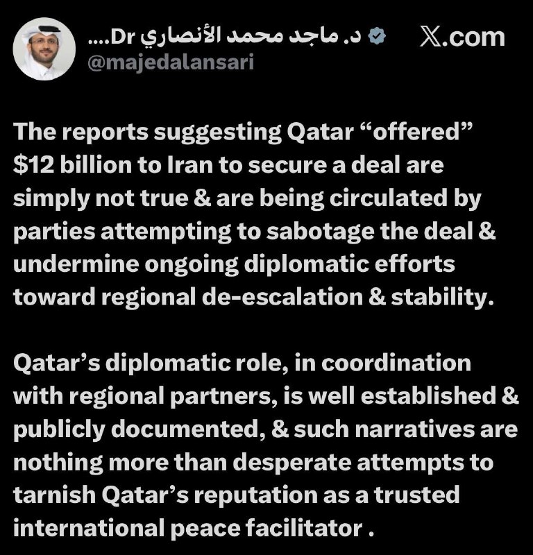
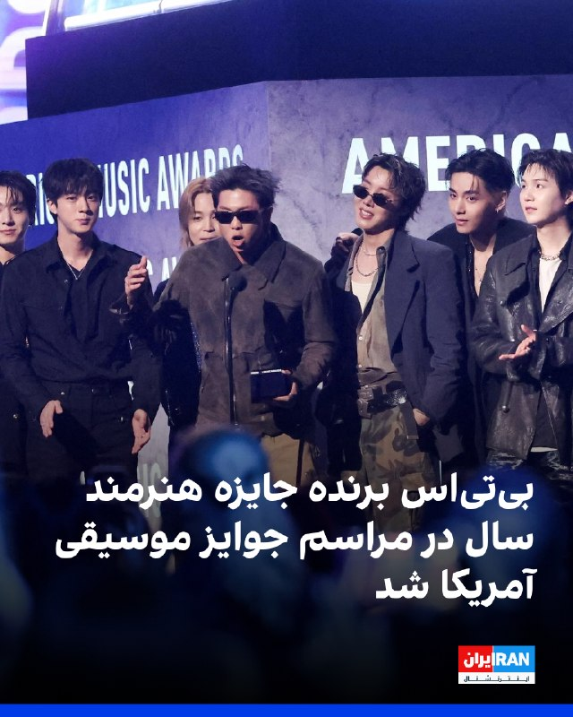
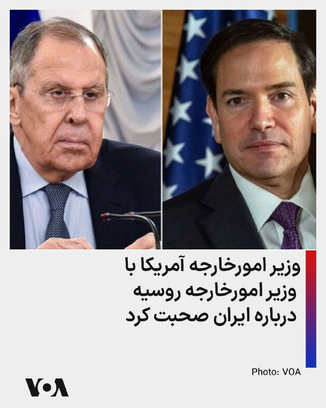
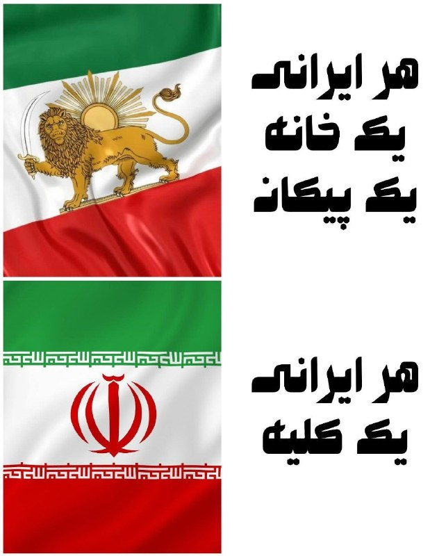
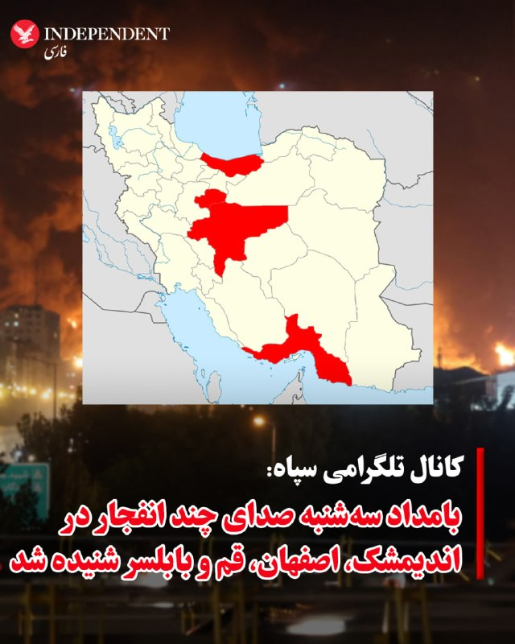

# خواننده تلگرام

<!-- TOP_NAV START -->

<a href="https://github.com/drsploit/aio-DL/blob/main/telegram/content/archive_1.md" style="display:inline-block; padding:6px 12px; margin:0 4px; background-color:#2ea44f; color:white; text-decoration:none; border-radius:4px; font-weight:bold;">صفحه بعد</a>

<!-- TOP_NAV END -->

<!-- MSG START -->

---
📅 بروزرسانی: 1405/03/05 07:38
---

## VahidOOnLine — post 242218

  

گروه جهانی بی‌تی‌اس در مراسم امسال جوایز موسیقی آمریکا در لاس‌وگاس، برنده جایزه هنرمند سال شد. این گروه برای کسب عنوان هنرمند سال با هنرمندان مطرحی چون بد بانی، برونو مارس، تیلور سوییفت، هری استایلز، لیدی گاگا، جاستین بیبر، کندریک لامار، مورگان والن و سابرینا کارپنتر رقابت کرد.
این دومین بار است که بی‌تی‌اس این جایزه را دریافت می‌کند. آن‌ها نخستین بار در سال ۲۰۲۱ برنده این جایزه شدند و این اولین باری بود که هنرمندان آسیایی در این مراسم که بر اساس رای هواداران برگزار می‌شود، برنده می‌شد.
اعضای گروه شامل آر‌ام، جین، شوگا، جی‌هوپ، جیمین، وی و جونگ کوک همگی برای دریافت جایزه در مراسم حضور داشتند. آن‌ها به‌تازگی دومین اجرای خود از چهار شب کنسرت پیاپی و کاملا فروخته‌شده در ورزشگاه الیجنت در لاس‌وگاس را به پایان رسانده بودند.
این گروه از هواداران خود که با نام «آرمی» شناخته می‌شوند، قدردانی کرد. آر‌ام در سخنرانی خود به جمعیت تشویق‌کننده گفت: «افتخار بزرگی است که پس از پایان خدمت نظامی همه اعضا، بار دیگر این جایزه ارزشمند را دریافت می‌کنیم.»

‌🏁 🇬🇧 IranintlTV

🤖 @VahidOOnLine

## VahidOOnLine — post 242217

  

♦️به گزارش خبرگزاری فرانسه، مارکو روبیو، وزیر امور خارجه ایالات متحده، روز سه‌شنبه با تاکید بر بازگشایی تنگه هرمز که در حال حاضر تحت محاصره است، اعلام کرد که این آبراه حیاتی «به هر طریقی» باز خواهد شد. این اظهارات در حالی مطرح می‌شود که درگیری دوشنبه‌شب واشنگتن و تهران، توافق احتمالی برای پایان دادن به جنگ خاورمیانه را در هاله‌ای از ابهام قرار داده است.
روبیو در جریان سفر رسمی خود به شهر جایپور هند، در گفتگو با خبرنگاران گفت: «تنگه باید باز شود؛ این اتفاق به هر طریقی رخ خواهد داد، بنابراین آن باید بازگشایی شود.» او در ادامه افزود: «آنچه در آنجا رخ می‌دهد غیرقانونی، نامشروع و برای جهان غیرقابل تحمل و غیرقابل قبول است.»
‌🇸🇦 Indypersian

🤖 @VahidOOnLine

## VahidOOnLine — post 242216

  

♦️خبرگزاری تسنیم گزارش داد هیات‌رییسه فدراسیون فوتبال روز دوشنبه چهار خرداد، پرداخت ۲۵۰ میلیارد تومان پاداش برای بازیکنان، مربیان و سایر اعضای تیم ملی فوتبال ایران بابت صعود به جام جهانی ۲۰۲۶ را تصویب کرده است.

بر اساس این گزارش، این مبلغ میان تمامی اعضای تیم ملی تقسیم خواهد شد و قرار است از محل مطالبات فدراسیون فوتبال از فیفا تامین شود.

تسنیم نوشت در جلسه هیات‌رییسه، ابتدا رقم بالاتری برای پاداش صعود به جام جهانی مطرح شده بود، اما در نهایت اعضا با پرداخت ۲۵۰ میلیارد تومان موافقت کردند.
‌🇸🇦 Indypersian

🤖 @VahidOOnLine

## VahidOOnLine — post 242215

  

♦️به دنبال افزایش دوباره قیمت لبنیات، قیمت مصوب شیر بطری به ۹۸ هزار تومان و قیمت ماست دبه‌ای (۲ کیلویی) به دست‌کم ۲۲۸ هزار و ۷۰۰ تومان رسیده است. این در حالی است که در فروشگاه‌‌های آنلاین و سوپر‌ها، قیمت لبنیات بسیار بیشتر است. برای مثال شیر پرچرب یک لیتری میهن در فروشگاه‌های آنلاین دست‌کم ۱۳۰ هزار تومان فروخته می‌شود و پنیر نیم کیلویی روزانه ۲۸۳ هزار تومان قیمت دارد.کره ۱۰۰ گرمی دامداران ۹۲ هزار و ۶۰۰ تومان و بستنی وانیلی دومینو (۲ لیتری) ۴۷۵ هزار تومان به فروش می‌رسد. قیمت ماست ۹۰۰ گرمی کاله نیز در فروشگاه‌های آنلاین ۲۴۸ هزار تومان است. افزایش شدید قیمت‌ها به حذف با محدودیت مصرف لبنیات در بین خانوارهای ایرانی منجر شده است که تاثیرات آن بر سلامتی مردم به ویژه کودکان و نوجوانان در سال‌های پیش‌رو نمایان خواهد شد. این در حالی است که گوشت نیز برای بسیار از خانواده‌ها دست نیافتنی شده است.
‌🇸🇦 Indypersian

🤖 @VahidOOnLine

## VahidOOnLine — post 242214

  

مارکو روبیو، وزیر خارجه آمریکا، در واکنش به حمله روز دوشنبه ایالات‌متحده به اهداف ایرانی گفت: «تنگه‌ها باید باز بمانند و به هر شکلی باز خواهند ماند.» او درباره مذاکرات حکومت ایران در قطر گفت چانه‌زنی بر سر متن اولیه توافق ادامه دارد و نهایی‌کردن زبان توافق ممکن است چند روز طول بکشد.
‌🏁 🇬🇧 IranintlTV

🤖 @VahidOOnLine

## VahidOOnLine — post 242213

  <a href="telegram/content/VahidOOnLine_242213_1779768531.mp4" target="_blank">🎬 Download video</a>

♦️امیره حشوی، ملکه زیبایی لبنانی‌تبار اهل دیربورن‌ هایتس ایالت میشیگان که در تاریخ ۱۰ اوت ۲۰۲۵ با کسب عنوان «ملکه زیبایی شهرستان وین» (Miss Wayne County) در ایالت میشیگان، به عنوان نخستین زن محجبه در تاریخ مسابقات سازمان «دوشیزه آمریکا» تاج بر سر گذاشت در رژه صد‌مین سالگرد روز یادبود در شهر دیربورن شرکت کرد. او در این ویدیو تاج ملکه زیبایی را روی روسری گذاشته است. دیربورن یکی از بالاترین تمرکزهای جمعیت عرب‌ و مسلمان در آمریکا را دارد و در برخی برآوردها جمعیت عرب‌تبار این منطقه حدود ۴۰ درصد کل جمعیت برآورد می‌شود. به‌طور کلی ایالت میشیگان نیز یکی از بزرگترین و قدیمی‌ترین جمعیت‌های مسلمان و عرب را در آمریکا دارد.
‌🇸🇦 Indypersian

🤖 @VahidOOnLine

## VahidOOnLine — post 242212

  

♦️مشاهده‌های میدانی در سواحل بوشهر و هرمزگان نشان می‌دهد افزایش گردشگری و تخریب زیستگاه‌های حساس، به‌ویژه در جزیره هنگام، لاک‌پشت پوزه‌عقابی را که در فهرست گونه‌های «به‌شدت در معرض انقراض» قرار دارد، با تهدیدهای جدی روبه‌رو کرده است.

لاک‌پشت پوزه‌عقابی، از گونه‌های ارزشمند و در حال انقراض دریایی جهان، سواحل جنوبی ایران را به‌عنوان یکی از زیستگاه‌های اصلی تخم‌گذاری و زادآوری انتخاب کرده، اما توسعه بی‌ضابطه گردشگری، تخریب زیستگاه‌ها و آلودگی نوری، چرخه زادآوری این گونه را با خطر روبه‌رو کرده است.
مجید عسگری، مسئول پروژه حفاظت از لاک‌پشت پوزه‌عقابی در بوشهر و هرمزگان، به «همشهری‌آنلاین» گفت روند پایش این گونه در بوشهر از سال ۱۳۹۴ به‌طور مستمر انجام شده، اما در هرمزگان پایش‌ها مقطعی و محدود بوده است.

او با اشاره به نتایج ثبت‌شده در جزیره هنگام گفت تعداد لاک‌پشت‌های ثبت‌شده از ۷۱ مورد در سال ۱۳۹۹ به ۴۳ مورد در سال ۱۴۰۴ کاهش یافته است. به گفته عسگری، افزایش حضور گردشگران در فصل تخم‌گذاری، کمپ‌زدن در سواحل حساس، تخریب زیستگاه‌ها و کاهش نظارت اجرایی از مهم‌ترین دلایل این کاهش است.

عسگری گفت در برخی سال‌ها لاک‌پشت‌ها چندین بار به ساحل بازگشتند، اما به‌دلیل فرسایش سواحل و نبود عمق مناسب شن، موفق به لانه‌سازی و تخم‌گذاری نشدند.

او جزیره شیب‌دراز در قشم را نمونه موفق گردشگری کنترل‌شده دانست و گفت مدیریت متمرکز و مشارکت جامعه محلی باعث شده آسیب کمتری به زیستگاه‌های تخم‌گذاری وارد شود.

به گفته مسئول پروژه حفاظت از لاک‌پشت پوزه‌عقابی، در استان بوشهر روند تخم‌گذاری این گونه در سال‌های اخیر افزایش ملایمی داشته و در سال ۱۴۰۴ حدود ۳۴۷ لاک‌پشت در سواحل این استان ثبت شده‌اند.

عسگری همچنین گفت به‌دلیل محدودیت‌های مالی و اجرایی، پایش مستمر در برخی جزایر هرمزگان از جمله کیش، سیری، ابوموسی و فارور انجام نشده و همین موضوع ارائه آمار دقیق از جمعیت این گونه را دشوار کرده است.

او تاکید کرد حفاظت از سواحل شنی، کنترل گردشگری بی‌ضابطه، کاهش آلودگی نوری و مشارکت جوامع محلی، مهم‌ترین راهکارهای حفظ زیستگاه‌های لاک‌پشت پوزه‌عقابی در سواحل جنوبی ایران است.
‌🇸🇦 Indypersian

🤖 @VahidOOnLine

## VahidOOnLine — post 242211

  

سخنگوی وزارت خارجه قطر گزارش‌ها درباره پیشنهاد دوحه برای آزادسازی ۱۲ میلیارد دلار دارایی‌های تهران در راستای دستیابی به توافق با آمریکا را تکذیب و این ادعاها را تلاشی برای تخریب دیپلماسی کنونی توصیف کرد.
ماجد الانصاری، سخنگوی وزارت خارجه قطر، در ایکس نوشت: «گزارش‌هایی که می‌گویند قطر ۱۲ میلیارد دلار به ایران پیشنهاد داده تا توافقی را تضمین کند، درست نیست.»
او گفت این ادعاها از سوی طرف‌هایی منتشر می‌شود که در پی تضعیف «تلاش‌های دیپلماتیک کنونی برای ثبات و کاهش تنش منطقه‌ای» هستند.
الانصاری افزود نقش میانجی‌گری قطر در کنار شرکای منطقه‌ای «به‌خوبی تثبیت شده و به‌صورت عمومی مستند شده است» و این گزارش‌ها تلاشی برای آسیب زدن به اعتبار دوحه به‌عنوان «تسهیل‌کننده مورد اعتماد بین‌المللی صلح» است.

‌🏁 🇬🇧 IranintlTV

🤖 @VahidOOnLine

## VahidOOnLine — post 242202

بعضی خانه‌ها بعد از ۱۸ و ۱۹ دی دیگر شبیه قبل نشدند.
یک صندلی خالی ماند، یک تلفن دیگر جواب داده نشد و خانواده‌هایی ماندند با تصویری که آخرین‌بار از عزیزشان دیده بودند.<
میلاد حاجیوند عبداللهی، ساسان کشوری، محمد رفیعی، بنیامین علیزاده، امید احمدی، احمدرضا خیری‌زاد، فاطمه علی‌محمدی و سعید صادقی حسنوند؛
جوانانی با زندگی‌های معمولی، با کار، دانشگاه، ورزش، عشق و هزار برنامه برای ادامه راه.<
اما خیابان‌های آن روزها، برای بسیاری به آخر زندگی تبدیل شد؛ با گلوله جنگی، خونریزی، ضرب‌وجرح و پیکرهایی که بعضی خانواده‌ها با تهدید و فشار تحویل گرفتند.<
این روایت‌ها کوتاه نوشته می‌شوند تا نام‌ها در حافظه‌مان بماند و فراموش نشود چه بر جوانان ایران گذشت.<
#جاویدنامان_انقلاب_ملی_ایرانیان
‌🏁 🇬🇧 IranintlTV

🤖 @VahidOOnLine

## VahidOOnLine — post 242201

♦️موسسه آتشفشان‌شناسی و لرزه‌نگاری فیلیپین اعلام کرد یک شهاب‌سنگ دوشنبه‌شب چهارم خرداد، هم‌زمان با فوران آتشفشان «مایون» در استان آلبای فیلیپین از کنار این آتشفشان عبور کرده و آسمان منطقه را روشن کرده است.

ویدیوی منتشرشده از سوی این موسسه نشان می‌دهد شی نورانی در حالی از نزدیکی آتشفشان مایون، یکی از فعال‌ترین آتشفشان‌های فیلیپین، عبور می‌کند.
بر اساس این گزارش، این رویداد ساعت ۲۲:۳۳ به وقت محلی ثبت شده و دوربین «لیگنون هیل» آن را ضبط کرده است.

این موسسه ابتدا اعلام کرده بود شهاب‌سنگ به دامنه شمالی آتشفشان برخورد کرده، اما بعدتر با استناد به داده‌های لرزه‌ای، امواج فروصوت و تصاویر دوربین‌های دیگر، توضیح داد این جرم هنگام ورود به جو متلاشی شده و به آتشفشان برخورد نکرده است.
‌🇸🇦 Indypersian

🤖 @VahidOOnLine

## FoxNewsTwitter — post 342256

  <a href="telegram/content/FoxNewsTwitter_342256_1779768534.mp4" target="_blank">🎬 Download video</a>

Fox News (Twitter/X)

At one of America’s most sacred places, Gretchen Wilson delivered a Memorial Day performance that brought the crowd to a standstill.

Wilson sang “God Bless America” during Freedom 250’s ceremony at Arlington National Cemetery, with veterans and military families gathered in tribute.

The emotional performance served as a reminder of the sacrifice behind the holiday.

## FoxNewsTwitter — post 342255

  

Fox News (Twitter/X)

WATCH LIVE: Freedom 250 hosts candlelight Memorial Day observance at Arlington National Cemetery https://twitter.com/i/broadcasts/1oJMvvNNppkxQ

## mamlekate — post 103585

📝 مارکو روبیو درباره مذاکرات با جمهوری اسلامی: امروز گفت‌وگوهایی در قطر جریان داشت

مارکو روبیو، وزیر امورخارجه آمریکا، روز سه‌شنبه در جریان سفر رسمی خود به هند به خبرنگاران گفت: «امروز گفت‌وگوهایی در قطر در جریان بود، بنابراین خواهیم دید که آیا می‌توانیم پیشرفتی داشته باشیم یا خیر.»

📝 واشنگتن در پی فرمولی برای حذف ذخایر اورانیوم ایران بدون انتقال به آمریکا

به گزارش نیویورک پست، مقام‌های آمریکایی در حال بررسی روش‌هایی هستند که ایران بتواند ذخایر اورانیوم با غنای بالا را بدون تحویل مستقیم به واشنگتن از بین ببرد.

📝 چارچوب سه‌مرحله‌ای توافق: بازگشایی هرمز، نابودی اورانیوم، کاهش محاصره و سپس مذاکره بر سر شرایط مذاکره صلح

@mamlekate

## mamlekate — post 103584

📝 سنتکام: به چند سایت پرتاب موشک و قایق در جنوب ایران حمله کردیم

ارتش آمريکا اعلام کرد حملات تازه‌ای را به جنوب ايران انجام داده و سايت‌های موشکی ايران و قايق‌هايی را که «در تلاش برای مين‌گذاری» بودند، هدف قرار داده است.

@mamlekate

## VahidOnline — post 75720

  

وزارت خارجه آمریکا اواخر دوشنبه به وقت واشنگتن گفت مارکو روبیو وزیر امور خارجه، به در خواست همتای روس خود سرگئی لاوروف، با او صحبت کرد. در این تماس تلفنی، دو وزیر درباره جنگ روسیه و اوکراین، روابط دوجانبه و اوضاع ایران صحبت کردند.
@VahidHeadline

📡 @VahidOnline

## VahidOnline — post 75719

  

realDonaldTrump

📡 @VahidOnline

## kianmeli1 — post 87670

  

🔴گزارش‌هایی که حاکی از «پیشنهاد» ۱۲ میلیارد دلاری قطر به ایران برای تضمین یک توافق است، به هیچ وجه صحت ندارند و توسط طرف‌هایی منتشر می‌شوند که سعی در تخریب توافق و تضعیف تلاش‌های دیپلماتیک جاری برای کاهش تنش و ثبات منطقه‌ای دارند.

نقش دیپلماتیک قطر، در هماهنگی با شرکای منطقه‌ای، به خوبی تثبیت شده و به طور عمومی مستند شده است و چنین روایت‌هایی چیزی بیش از تلاش‌های ناامیدانه برای خدشه‌دار کردن اعتبار قطر به عنوان یک تسهیل‌کننده صلح بین‌المللی مورد اعتماد نیست.
https://t.me/kianmeli1

## IranIntlTV — post 339019

  

گروه جهانی بی‌تی‌اس در مراسم امسال جوایز موسیقی آمریکا در لاس‌وگاس، برنده جایزه هنرمند سال شد. این گروه برای کسب عنوان هنرمند سال با هنرمندان مطرحی چون بد بانی، برونو مارس، تیلور سوییفت، هری استایلز، لیدی گاگا، جاستین بیبر، کندریک لامار، مورگان والن و سابرینا کارپنتر رقابت کرد.
این دومین بار است که بی‌تی‌اس این جایزه را دریافت می‌کند. آن‌ها نخستین بار در سال ۲۰۲۱ برنده این جایزه شدند و این اولین باری بود که هنرمندان آسیایی در این مراسم که بر اساس رای هواداران برگزار می‌شود، برنده می‌شد.
اعضای گروه شامل آر‌ام، جین، شوگا، جی‌هوپ، جیمین، وی و جونگ کوک همگی برای دریافت جایزه در مراسم حضور داشتند. آن‌ها به‌تازگی دومین اجرای خود از چهار شب کنسرت پیاپی و کاملا فروخته‌شده در ورزشگاه الیجنت در لاس‌وگاس را به پایان رسانده بودند.
این گروه از هواداران خود که با نام «آرمی» شناخته می‌شوند، قدردانی کرد. آر‌ام در سخنرانی خود به جمعیت تشویق‌کننده گفت: «افتخار بزرگی است که پس از پایان خدمت نظامی همه اعضا، بار دیگر این جایزه ارزشمند را دریافت می‌کنیم.»

https://iranintl.com/202605266357

## IranIntlTV — post 339018

  

مارکو روبیو، وزیر خارجه آمریکا، در واکنش به حمله روز دوشنبه ایالات‌متحده به اهداف ایرانی گفت: «تنگه‌ها باید باز بمانند و به هر شکلی باز خواهند ماند.» او درباره مذاکرات حکومت ایران در قطر گفت چانه‌زنی بر سر متن اولیه توافق ادامه دارد و نهایی‌کردن زبان توافق ممکن است چند روز طول بکشد.
https://iranintl.com/202605261875

## IranIntlTV — post 339017

  

سخنگوی وزارت خارجه قطر گزارش‌ها درباره پیشنهاد دوحه برای آزادسازی ۱۲ میلیارد دلار دارایی‌های تهران در راستای دستیابی به توافق با آمریکا را تکذیب و این ادعاها را تلاشی برای تخریب دیپلماسی کنونی توصیف کرد.
ماجد الانصاری، سخنگوی وزارت خارجه قطر، در ایکس نوشت: «گزارش‌هایی که می‌گویند قطر ۱۲ میلیارد دلار به ایران پیشنهاد داده تا توافقی را تضمین کند، درست نیست.»
او گفت این ادعاها از سوی طرف‌هایی منتشر می‌شود که در پی تضعیف «تلاش‌های دیپلماتیک کنونی برای ثبات و کاهش تنش منطقه‌ای» هستند.
الانصاری افزود نقش میانجی‌گری قطر در کنار شرکای منطقه‌ای «به‌خوبی تثبیت شده و به‌صورت عمومی مستند شده است» و این گزارش‌ها تلاشی برای آسیب زدن به اعتبار دوحه به‌عنوان «تسهیل‌کننده مورد اعتماد بین‌المللی صلح» است.

https://iranintl.com/202605269986

## IranIntlTV — post 339016

  <a href="telegram/content/IranIntlTV_339016_1779768539.mp4" target="_blank">🎬 Download video</a>

یک شهروند در ویدیویی که در شبکه‌های اجتماعی منتشر شده، به وضعیت شغلی خود اشاره کرده و از اقدامات و تصمیمات حکومت انتقاد می‌کند. او می‌گوید: «جمهوری اسلامی دائم از توافق و آتش‌بس سخن می‌گوید، اما درباره تعطیلی کارخانه‌ها حرفی نمی‌زند.»

گزارش‌های منتشر‌شده نشان می‌دهد فشار اقتصادی و ناامنی شغلی شهروندان تشدید شده است.
@iranintltv

## IranIntlTV — post 339007

بعضی خانه‌ها بعد از ۱۸ و ۱۹ دی دیگر شبیه قبل نشدند.
یک صندلی خالی ماند، یک تلفن دیگر جواب داده نشد و خانواده‌هایی ماندند با تصویری که آخرین‌بار از عزیزشان دیده بودند.
میلاد حاجیوند عبداللهی، ساسان کشوری، محمد رفیعی، بنیامین علیزاده، امید احمدی، احمدرضا خیری‌زاد، فاطمه علی‌محمدی و سعید صادقی حسنوند؛
جوانانی با زندگی‌های معمولی، با کار، دانشگاه، ورزش، عشق و هزار برنامه برای ادامه راه.
اما خیابان‌های آن روزها، برای بسیاری به آخر زندگی تبدیل شد؛ با گلوله جنگی، خونریزی، ضرب‌وجرح و پیکرهایی که بعضی خانواده‌ها با تهدید و فشار تحویل گرفتند.
این روایت‌ها کوتاه نوشته می‌شوند تا نام‌ها در حافظه‌مان بماند و فراموش نشود چه بر جوانان ایران گذشت.
#جاویدنامان_انقلاب_ملی_ایرانیان

## FarsiVOA — post 218670

🔺مارکو روبیو درباره مذاکرات با جمهوری اسلامی: امروز گفت‌وگوهایی در قطر جریان داشت

▪️مارکو روبیو، وزیر امورخارجه آمریکا، روز سه‌شنبه ۵ خرداد در جریان سفر رسمی خود به هند به خبرنگاران گفت: «امروز گفت‌وگوهایی در قطر در جریان بود، بنابراین خواهیم دید که آیا می‌توانیم پیشرفتی داشته باشیم یا خیر.»

⬇️ بیشتر بخوانید:
https://ir.voanews.com/a/8153982.html
@FarsiVOA

## FarsiVOA — post 218669

  

⚡️وزارت خارجه آمریکا اواخر دوشنبه به وقت واشنگتن گفت مارکو روبیو وزیر امور خارجه، به در خواست همتای روس خود سرگئی لاوروف، با او صحبت کرد. در این تماس تلفنی، دو وزیر درباره جنگ روسیه و اوکراین، روابط دوجانبه و اوضاع ایران صحبت کردند.

@FarsiVOA

## FarsiVOA — post 218668

🔺اسرائيل به بیش از ۷۰ زیرساخت حزب‌الله در لبنان حمله کرد و شماری از اعضای آن را کشت

▪️ارتش اسرائيل روز دوشنبه ۴ خرداد اعلام کرد که در چندین رشته عملیات در سراسر لبنان، بیش از ۷۰ موضع زیرساختی گروه تروریستی حزب‌الله را هدف قرار گرفت.

⬇️ بیشتر بخوانید:
https://ir.voanews.com/a/8153978.html
@FarsiVOA

## FarsiVOA — post 218667

⚡️صدای موافقان و منتقدان کنگره آمریکا در سایه احتمال توافق با جمهوری اسلامی
@FarsiVOA

## FarsiVOA — post 218666

⚡️تنگه هرمز و بحران کمک‌های غذایی و تجارت افغانستان زیر فشار جنگ و گرانی
@FarsiVOA

## FarsiVOA — post 218665

  

⚡️دونالد ترامپ، رئيس جمهوری آمریکا با انتشار این گرافیک اقدام نظامی خود علیه جمهوری اسلامی را با سیاست باراک اوباما، رئیس جمهوری سابق آمریکا مقایسه کرد که در این تصویر فرستادن پول نقد است.
@FarsiVOA

## FarsiVOA — post 218664

⚡️آخرین تحولات عراق؛ بغداد اعضای بازداشت‌شده داعش با تابعیت ترکیه را به آنکارا تحویل می‌دهد
@FarsiVOA

## FarsiVOA — post 218663

⚡️کارزار سرکوب در سایه قطع اینترنت در ایران؛ هر ۴۸ ساعت یک چوبه دار
@FarsiVOA

## FarsiVOA — post 218662

⚡️نگاهی به جهان‌بینی کریستیان مونجیو، فیلمساز رومانیایی که با فیورد در کن ۲۰۲۶ برای دومین بارپس از نخل تاریخی چهار ماه، سه هفته و دو روز در سال ۲۰۰۷، نخل طلا گرفت
@FarsiVOA

## FarsiVOA — post 218661

⚡️آیا ابولا می‌تواند به آمریکا برسد؟ مقام‌های بهداشتی می‌گویند خطر فعلاً پایین است، اما غربالگری مسافران در برخی فرودگاه‌ها گسترش یافته است. کارشناسان هشدار می‌دهند که ضعف در کنترل بیماری‌ها در هر نقطه از جهان می‌تواند پیامدهای جهانی داشته باشد.
@FarsiVOA

## Persian_Trend_Official — post 15028

  

صبحتون بخیر ☕️🤍

📝 Nick
📌 @persian_trend_official
پرشین ترند | متفاوت‌ترین کانال نظامی

## Persian_Trend_Official — post 15027

  

⭕️پست جدید دونالد ترامپ

پ ن: آیا هنوز عقیده دارید ترامپ پولی به جمهوری اسلامی پرداخت خواهد داد؟

🫆:Tony

📌 @persian_trend_official
پرشین ترند | متفاوت‌ترین کانال نظامی

## Persian_Trend_Official — post 15026

  <a href="telegram/content/Persian_Trend_Official_15026_1779768540.webm" target="_blank">🎬 Download video</a>

🔴 مقام آمریکایی: حملات در ایران «دفاعی» بوده است

▪️ یک مقام آمریکایی اعلام کرده حملات اخیر در ایران جنبه دفاعی داشته و به معنای پایان آتش‌بس نیست
▪️ به گفته او، یک سایت سام (پدافند موشکی زمین به هوا) در بندرعباس هدف قرار گرفته است
▪️ این مقام مدعی شده این اقدام پس از تهدید یا هدف قرار گرفتن جنگنده‌های آمریکایی انجام شده است

▪️ تاکنون هیچ تأیید مستقلی از سوی ایران درباره این ادعاها منتشر نشده است
▪️ وضعیت منطقه همچنان در سطح بالای تنش و ابهام قرار دارد

🫆:Tony

📌 @persian_trend_official
پرشین ترند | متفاوت‌ترین کانال نظامی

## Persian_Trend_Official — post 15025

  

⭕️روبیو به ارمنستان می رود

▪️سفارت آمریکا در ایروان اعلام کرد که مارکو روبیو روز سه‌شنبه برای دیدارهایی با محوریت دیپلماسی و روابط دوجانبه به ارمنستان سفر خواهد کرد.

🫆:Tony

📌 @persian_trend_official
پرشین ترند | متفاوت‌ترین کانال نظامی

## RadioFarda — post 157554

  <a href="https://t.me/radiofarda/157554" target="_blank">📎 Download file</a>

📻بشنوید: سرخط خبرها با رادیوفردا، پنجم خرداد ۱۴۰۵‌

@RadioFarda

## BBCPersian — post 282064

  

‌
با وجود حملات اخیر آمریکا به سامانه‌های موشکی و قایق‌های ایران در خلیج فارس که وضعیت آتش‌بس شکننده را متزلزل‌تر کرده است،‌ مارکو روبیو، وزیر خارجه آمریکا روز سه‌شنبه گفت که توافق با ایران «همچنان امکان‌پذیر است.»

او در هند به
خبرنگاران گفت: «امروز مذاکراتی در قطر در جریان بود،‌ و باید دید آیا می‌توانیم شاهد پیشرفتی باشیم یا خیر. فکر می‌کنم بخش زیادی از زمان صرف دقت در کلمات و واژه‌های به کار گرفته در متن اسناد می‌شود، بنابراین چند روز طول خواهد کشید.»

آقای روبیو افزود: «رئیس‌جمهور تمایل خود را برای انجام این کار ابراز کرده است. او یا به یک توافق خوب دست خواهد یافت یا هیچ توافقی نخواهد کرد.»

آقای روبیو به خبرنگاران گفت که تنگه هرمز باید باز باشد.

او گفت که آنها به هر حال این مسیر را باز خواهند کرد و افزود: «آنچه در آنجا اتفاق میافتد،‌ غیرقانونی است و باعث بی‌ثباتی برای جهان و غیرقابل قبول است.»

از سوی دیگر، دونالد ترامپ هم در شبکه اجتماعی خود، با انتشار دو تصویر گرافیکی کنار هم، بار دیگر تلاش کرد از توافق دولت اوباما با ایران انتقاد کند.

📷 AFP via Getty Images
@BBCPersian

## BBCPersian — post 282063

با وجود تاکید دونالد ترامپ بر پیوستن عربستان و قطر به پیمان ابراهیم و برقراری روابط علنی و رسمی با اسرائیل در صورت توافق میان ایران و آمریکا، يک منبع سعودی به سی‌ان‌ان و چند رسانه دیگر گفته است «عربستان سعودی تنها زمانی روابط خود با اسرائيل را عادی سازی خواهد کرد که «مسيری غيرقابل بازگشت» برای تشکيل کشور فلسطينی ايجاد شود.»

این درخواست ریاض در چند سال گذشته مانع اصلی برقراری روابط علنی میان عربستان و اسرائیل بوده است.

روز دوشنبه همچنین گزارش شد که پاکستان هم از تلاش ترغیب‌کننده دونالد ترامپ برای عادی سازی روابط با اسرائیل «استقبال نکرده است».

https://bbc.in/4wQu3Oj
@BBCPersian

## BBCPersian — post 282056

‌
لانا پانتینگ ناخواسته به یکی از افراد شرکت‌کننده در آزمایش‌های محرمانه سیا موسوم به «ام‌کی-اولترا» تبدیل شد. این پروژه در جریان جنگ سرد، تاثیر مواد روان‌گردانی مانند ال‌اس‌دی، شوک الکتریکی و روش‌های شست‌وشوی مغزی را بر انسان‌ها، بدون رضایت آن‌ها، آزمایش می‌کرد.

بیش از ۱۰۰ موسسه، از جمله چندین بیمارستان، زندان و مدرسه در آمریکا و کانادا، در این برنامه دخیل بودند.

واقعیت تلخ مربوط به آزمایش‌های ام‌کی-اولترا در دهه ۱۹۷۰ برملا شد. از آن زمان، شماری از قربانیان تلاش کرده‌اند علیه دولت‌های آمریکا و کانادا طرح دعوی کنند. در آمریکا این پرونده‌ها بیشتر بی‌نتیجه مانده است، اما در سال ۱۹۸۸ دادگاهی در کانادا حکم داد دولت آمریکا به هر یک از ۹ قربانی ۶۷ هزار دلار بپردازد.

خانم پانتینگ می‌گوید نامش در میان دریافت‌کنندگان غرامت نبود چون آن موقع هنوز از قربانی بودن خود خبر نداشت.

📷Getty images/ SUBMITTED PHOTO

از لینک ⬇️ این مطلب را در سایت بی‌بی‌سی فارسی بخوانید.

https://bbc.in/3PCXt1K
@BBCPersian

## BBCPersian — post 282055

‌ توماج صالحی، یکی از سرشناس‌ترین رپرهای ایرانی که خود چند بار به زندان افتاده و حتی با حکم اعدام روبرو شده بود،‌ صدور حکم اعدام برای چهارتن از متهمان پرونده اکباتان را «ناعادلانه» و «ضدبشری» خواند و گفت: «شرافت ما حکم می‌کند در مقابل این بی‌عدالتی بایستیم.»…

## BBCPersian — post 282054

  

‌
توماج صالحی، یکی از سرشناس‌ترین رپرهای ایرانی که خود چند بار به زندان افتاده و حتی با حکم اعدام روبرو شده بود،‌ صدور حکم اعدام برای چهارتن از متهمان پرونده اکباتان را «ناعادلانه» و «ضدبشری» خواند و گفت: «شرافت ما حکم می‌کند در مقابل این بی‌عدالتی بایستیم.»

آقای صالحی پس از ماه‌ها سکوت در شبکه اجتماعی ایکس نوشت: «این متن را در حالی می‌نویسم که ماه‌هاست آزادی ‌بیان و آزادی رسانه «گرچه هرگز نداشته‌ایم» به بهانه‌ جنگ، به شدید‌ترین شکل ممکن سرکوب شده، و فقر نیز از زمین و آسمان بر سر مردم می‌بارد.»

او در یادداشت خود به جنبش اعتراضی سال ۱۴۰۱،‌ اشاره کرد و نوشت: «جنبش باشکوه و سربلند «زن زندگی آزادی» برای عدالت، آزادی و کرامت انسانی جنگید. حالا هنوز هم بازماندگانی از این جنبش در زندان هستند و چهار نفر از آنها به حکمِ ناعادلانه و ضدبشری اعدام محکوم شده‌اند.»

📷LightRocket via Getty Images
@BBCPersian

⬇️ادامه خبر

## BBCPersian — post 282053

  

‌
فرماندهی مرکزی نیروهای آمریکا - سنتکام - در بیانیه‌ای اعلام کرده است: «نيروهای آمريکا امروز (دوشنبه) در جنوب ايران حملات دفاعی از خود انجام دادند تا از نيروهای ما در برابر تهديدهای نيروهای ايرانی محافظت شود»

در بیانیه سنتکام آمده: «اهداف اين حملات شامل سايت های پرتاب موشک و قايق های ايرانی بود که تلاش می‌کردند مين‌گذاری کنند. فرماندهی مرکزی آمريکا ضمن خويشتن‌داری در طول آتش‌بس جاری، همچنان به دفاع از نيروهای خود ادامه می‌دهد.»

ایران هنوز واکنشی رسمی به این گزارش نشان نداده است، اما برخی از سایت‌های ایرانی از هدف قرار گرفتن دو قایق تندرو سپاه در نزدیکی سواحل خلیج فارس و کشته شدن چند نفر از سرنشینان این قایق‌ها خبر دادند.

نیمه شب دوشنبه به وقت ایران،‌ برخی از ساکنان بندرعباس و شهرهای حاشیه خلیج فارس، از شنیده شدن چند انفجار و فعالیت پدافند ضدهوایی خبر داده بودند.

رسانه‌های رسمی هم این گزارش‌ها را تایید کردند اما اعلام کرده بودند که علت این انفجارها مشخص نیست.

📷 the U.S. Navy via Getty Images

https://bbc.in/4wQu3Oj
@BBCPersian

## BBCPersian — post 282052

  

‌
دونالد ترامپ، رئیس جمهور آمریکا، در اظهارنظری تازه که به نوعی «عقب‌نشینی» از مواضع قبلی ارزیابی شده، گفته است: «اورانيوم غنی شده («غبار هسته ای!») يا بلافاصله به ايالات متحده تحويل داده خواهد شد تا به آمريکا منتقل و نابود شود، يا ترجيحا با همکاری و هماهنگی جمهوری اسلامی ايران، در همان محل يا در مکانی ديگر که مورد توافق باشد، نابود خواهد شد؛ اقدامی که با نظارت آژانس انرژی اتمی يا نهاد معادل آن به عنوان ناظر بر اين روند و اين رويداد انجام می‌شود.»

باراک راوید، گزارشگر نشریه اکسیوس که در چند هفته اخیر بارها از تماس نزدیک خود با آقای ترامپ و نظرات او درباره مذاکرات با ایران خبر داده، در شبکه ایکس نوشته این سخنان آقای ترامپ نشان از «عقب‌نشینی» آمریکا از تقاضای قبلی خود و نزدیک شدن به آن چیزی است که ایران به آن اشاره کرده بود.

بنیامین نتانیاهو، نخست‌وزیر اسرائیل، هم چند روز پیش گفته بود تا زمانی که ذخایر اورانیوم غنی‌شده ایران «خارج نشود»، نمی‌توان جنگ را پایان‌یافته دانست.

📷 EPA/Shutterstock
https://bbc.in/4f2VsGk
@BBCPersian

## alonews — post 122702

  <a href="telegram/content/alonews_122702_1779768544.webm" target="_blank">🎬 Download video</a>

👈وزیر امور خارجه آمریکا: ایالات متحده تلاش می‌کند از طریق مذاکره به جنگ پایان دهد

✅ @AloNews خبر جنگ

## alonews — post 122701

  <a href="telegram/content/alonews_122701_1779768544.webm" target="_blank">🎬 Download video</a>

👈رویترز به نقل از وزیر امور خارجه آمریکا: تدوین مفاد توافق با ایران ممکن است چند روز طول بکشد/ فکر می‌کنم در مورد عبارات خاص در سند اولیه، بحث‌های زیادی وجود دارد

روبیو، در مورد حملات اخیر آمریکا اظهار داشت:

🔴تنگه‌ها باید باز بمانند و به هر حال باز خواهند ماند.

🔴دیروز برخی مذاکرات در قطر انجام شد.

✅ @AloNews خبر جنگ

## alonews — post 122700

  <a href="telegram/content/alonews_122700_1779768544.webm" target="_blank">🎬 Download video</a>

👈آمریکا حملات جدیدش در جنوب ایران را تایید کرد فاکس نیوز به نقل از سخنگوی فرماندهی مرکزی ایالات متحده مدعی شد: 
🔴ما روز دوشنبه حملاتی را در جنوب ایران برای دفاع از خود انجام دادیم. 
🔴این حملات، سکوهای پرتاب موشک و قایق‌هایی را که سعی در مین‌گذاری داشتند، هدف…

## alonews — post 122699

  <a href="telegram/content/alonews_122699_1779768544.webm" target="_blank">🎬 Download video</a>

👈آمریکا حملات جدیدش در جنوب ایران را تایید کرد

فاکس نیوز به نقل از سخنگوی فرماندهی مرکزی ایالات متحده مدعی شد:

🔴ما روز دوشنبه حملاتی را در جنوب ایران برای دفاع از خود انجام دادیم.

🔴این حملات، سکوهای پرتاب موشک و قایق‌هایی را که سعی در مین‌گذاری داشتند، هدف قرار داد.

🔴ما در طول آتش‌بس با خویشتن‌داری به دفاع از نیروهای خود ادامه می‌دهیم.

✅ @AloNews خبر جنگ

---
📅 بروزرسانی: 1405/03/05 03:26
---

## VahidOOnLine — post 242200

  

♦️ شبکه فاکس‌نیوز به نقل از سخنگوی فرماندهی مرکزی ایالات متحده (سنتکام) گزارش داد نیروهای نظامی آمریکا «در دفاع از خود در جنوب ایران» به اهدافی حمله کرده‌اند.
این سخنگو توضیح داد که اهداف مورد حمله شامل محل‌های پرتاب موشک و قایق‌هایی بوده‌اند که تلاش می‌کردند مین‌گذاری کنند. در این بیانیه آمده است: ارتش ایالات متحده از نیروهای آمریکایی «در حالی که در جریان آتش‌بس جاری خویشتن‌داری نشان می‌دهند» دفاع خواهد کرد.
پیش‌تر، خبرگزاری مهر از وقوع انفجارهایی در بندری بندرعباس خبر داده بود. صدای انفجار و فعالیت پدافند در اصفهان، بابل و اندیمشک هم شنیده شده است.
‌🇸🇦 Indypersian

🤖 @VahidOOnLine

## VahidOOnLine — post 242199

  

♦️ماجد محمد الانصاری، مشاور نخست‌وزیر و سخنگوی وزارت خارجه قطر در پیامی در اکس نوشت: «گزارش‌هایی که ادعا می‌کنند قطر برای دستیابی به توافق، «پیشنهاد» ۱۲ میلیارد دلار به ایران داده، کاملا نادرست است و از سوی طرف‌هایی منتشر می‌شود که در تلاش‌اند توافق را تخریب کرده و تلاش‌های دیپلماتیک جاری برای کاهش تنش و ثبات منطقه‌ای را تضعیف کنند.
نقش دیپلماتیک قطر، در هماهنگی با شرکای منطقه‌ای، کاملا شناخته‌شده و به‌طور عمومی مستند است و این روایت‌ها چیزی جز تلاش‌ برای خدشه‌دار کردن اعتبار قطر به‌عنوان یک میانجی مورد اعتماد بین‌المللی برای صلح نیست.» این در حالی است که محمد مرندی که در مذاکرات اخیر هیات مذاکره‌کننده جمهوری اسلامی با آمریکا در اسلام آباد حضور داشت، می‌گوید که قطر پذیرفته قبل از نهایی شدن توافق، شش میلیارد دلار پول به جمهوری اسلامی بدهد.
‌🇸🇦 Indypersian

🤖 @VahidOOnLine

## VahidOOnLine — post 242198

  

♦️صابرین‌نیوز، کانال تلگرامی مشترک سپاه قدس و حشدالشعبی عراق، بامداد سه‌شنبه، از شنیده‌شدن صداهای انفجار و فعال شدن پدافند در اندیمشک، اصفهان، قم و بابلسر خبر داد. پیش از این نیز گزارش‌هایی از وقوع سه انفجار در بندرعباس و هدف قرار گرفتن فرودگاه این شهر و نیز شنیده شدن چند انفجار در حوالی سیریک و جاسک منتشر شده بود. به گزارش خبرگزاری دانشجو، چهار نیروی سپاه پاسداران در حمله جنگنده‌های آمریکا در جنوب جزیره لارک کشته شدند. انفجارها و حمله‌ها در جنوب ایران طی روزهای گذشته و در طول آتش‌بس به تکرار اتفاق افتاده است.
‌🇸🇦 Indypersian

🤖 @VahidOOnLine

## VahidOOnLine — post 242197

  

فاکس‌نیوز به نقل از سخنگوی ستاد فرماندهی مرکزی آمریکا، سنتکام، گزارش داد نیروهای آمریکا روز دوشنبه در جنوب ایران به اهدافی از جمله محل‌های پرتاب موشک و قایق‌های ایرانی که در تلاش برای مین‌گذاری بودند، حمله کردند.
‌🏁 🇬🇧 IranintlTV

🤖 @VahidOOnLine

## VahidOOnLine — post 242196

  <a href="telegram/content/VahidOOnLine_242196_1779753376.mp4" target="_blank">🎬 Download video</a>

♦️محمد مرندی، عضو سابق تیم مذاکره‌کننده هسته‌ای که در گفتگوهای اخیر در اسلام‌آباد حضور داشت، دوشنبه‌شب چهارم خرداد‌ماه، در گفتکو با صدا و سیما مدعی شد قطر پذیرفته است دارایی‌های مسدودشده جمهوری اسلامی را که حدود شش میلیارد دلار برآورد می‌شود، پیش از نهایی شدن توافق در اختیار تهران قرار دهد و سپس معادل این مبلغ را از آمریکا دریافت کند.
‌🇸🇦 Indypersian

🤖 @VahidOOnLine

## VahidOOnLine — post 242195

  

خبرگزاری دانشجو از حمله آمریکا و اسرائیل به جنوب جزیره لارک در سحرگاه گذشته به وقت محلی خبر داد. این گزارش به نقل از منابع محلی نوشت نام‌های سه نفر از کشته‌شدگان عباس اسلامی، قدرت زرنگاری و عبدالرضا گلزاری است، اما تعداد کشته‌شدگان هنوز مشخص نیست.
‌🏁 🇬🇧 IranintlTV

🤖 @VahidOOnLine

## WithYashar — post 12508

سخنگوی وزارت خارجه قطر:
اینکه گفتن قطر 12 میلیارد دلار از پول‌های بلوکه شده ایران رو قراره پرداخت کنه کاملا کذبه و از این خبرا نیست!
@withyashar

## WithYashar — post 12507

سخنگوی سنتکام به فاکس نیوز : نیرو های آمریکایی در جنوب ایران حملات دفاعی انجام دادند تا از نیرو های خود در برابر تهدیدات نیرو های ایرانی محافظت کنند. اهداف شامل سایت‌ های پرتاب موشک و قایق‌ های ایرانی بودند که در تلاش برای کاشت مین بودند فرماندهی مرکزی…

## WithYashar — post 12506

سخنگوی سنتکام به فاکس نیوز :

نیرو های آمریکایی در جنوب ایران حملات دفاعی انجام دادند تا از نیرو های خود در برابر تهدیدات نیرو های ایرانی محافظت کنند. اهداف شامل سایت‌ های پرتاب موشک و قایق‌ های ایرانی بودند که در تلاش برای کاشت مین بودند
فرماندهی مرکزی آمریکا همچنان از نیرو های خود دفاع میکند و در عین حال در طول آتش‌ بس جاری ، خویشتن‌ داری به خرج میدهد
@withyashar

## WithYashar — post 12505

نفت ۹۷$
@withyashar

## mwarmonitor — post 9728

  <a href="telegram/content/mwarmonitor_9728_1779753377.mp4" target="_blank">🎬 Download video</a>

📝 جذابیت سیاست مدرن به همینه؛ شما می‌تونی کل حیاط پشتی همسایه رو شخم بزنی، زیربنای نظامی‌ش رو بفرستی هوا، بعد دستت رو بزنی به کمرت و بگی: «سوءتفاهم نشه، این فقط یک حرکت کاملاً دفاعی و دوستانه در راستای تحکیم پایه‌های صلح پایدار بود!» طبق استاندارد جدید دیپلماتیک،…

## mwarmonitor — post 9727

🚨جزئیات بیشتر درباره حملات آمریکا علیه اهداف ایرانی امروز: خبرنگار فاکس نیوز 🚨یک مقام ارشد آمریکایی به من گفته است که دو قایق ایرانی در حال کارگذاری مین در تنگه هرمز شناسایی شدند. ارتش آمریکا هر دو شناور متعلق به نیروی دریایی سپاه (IRGC) را منهدم کرد و همچنین…

## mwarmonitor — post 9726

🔴سخنگوی سنتکام، کاپیتان تیم هاوکینز به فاکس گفت: 🔴«نیروهای آمریکایی امروز در جنوب ایران حملات دفاع از خود انجام دادند تا از نیروهای ما در برابر تهدیدهای ناشی از نیروهای ایرانی محافظت کنند. اهداف شامل سایت‌های پرتاب موشک و قایق‌های ایرانی بود که در حال تلاش…

## mwarmonitor — post 9725

🚨«درگیری‌هایی میان نیروی دریایی ایران و نیروهای آمریکایی رخ داده که در نتیجه آن تعدادی کشته شده‌اند، که عبارتند از: پاسدار عباس اسلامی پاسدار قدرت زرنگاری پاسدار عبدالرضا گلزاری پاسدار حسین ستوده» @mwarmonitor

## FoxNewsTwitter — post 342254

  

Fox News (Twitter/X)

WATCH LIVE: Sen. Bernie Sanders headlines campaign rally in Portland, Maine https://twitter.com/i/broadcasts/1AGRnnZnRkXGl

## FoxNewsTwitter — post 342253

  <a href="telegram/content/FoxNewsTwitter_342253_1779753380.mp4" target="_blank">🎬 Download video</a>

Fox News (Twitter/X)

FOX NEWS REPORT: Pope Leo is calling for robust regulations on artificial intelligence, warning the technology "hurts humanity." @BillMelugin_ reports.

## pm_afshaa — post 91512

  <a href="telegram/content/pm_afshaa_91512_1779753382.webm" target="_blank">🎬 Download video</a>

🔴الجزیره به نقل از یک مقام آمریکایی: ایران طی 24 ساعت گذشته تلاش کرد به نیروهای آمریکایی حمله کنه. 
💧 Rainbet.com the #1 Non-KYC Crypto Casino & Sportsbook @rainbetcom 
😁 @Pm_Afshaa

## pm_afshaa — post 91511

  <a href="telegram/content/pm_afshaa_91511_1779753382.webm" target="_blank">🎬 Download video</a>

🔴الجزیره به نقل از یک مقام آمریکایی:
ایران طی 24 ساعت گذشته تلاش کرد به نیروهای آمریکایی حمله کنه.

💧 Rainbet.com the #1 Non-KYC Crypto Casino & Sportsbook @rainbetcom

😁 @Pm_Afshaa

## pm_afshaa — post 91510

  <a href="telegram/content/pm_afshaa_91510_1779753383.webm" target="_blank">🎬 Download video</a>

🔴فوری از سنتکام: نیروهای ایالات متحده امروز حملات دفاعی خود را در جنوب ایران انجام دادن تا از نیروهای ما در برابر تهدیدات ناشی از نیروهای ایرانی محافظت کنند. اهداف شامل سایت‌های پرتاب موشک و قایق‌های ایرانی در تلاش برای استقرار مین بودن. فرماندهی مرکزی ایالت…

## pm_afshaa — post 91509

🔴فوری از سنتکام: نیروهای ایالات متحده امروز حملات دفاعی خود را در جنوب ایران انجام دادن تا از نیروهای ما در برابر تهدیدات ناشی از نیروهای ایرانی محافظت کنند. اهداف شامل سایت‌های پرتاب موشک و قایق‌های ایرانی در تلاش برای استقرار مین بودن. فرماندهی مرکزی ایالت…

## pm_afshaa — post 91508

🔴فوری از سنتکام: نیروهای ایالات متحده امروز حملات دفاعی خود را در جنوب ایران انجام دادن تا از نیروهای ما در برابر تهدیدات ناشی از نیروهای ایرانی محافظت کنند.

اهداف شامل سایت‌های پرتاب موشک و قایق‌های ایرانی در تلاش برای استقرار مین بودن. فرماندهی مرکزی ایالت متحده آمریکا همچنان به دفاع از نیروهای ما در حین حرکت ادامه می‌دهد.

💧 Rainbet.com the #1 Non-KYC Crypto Casino & Sportsbook @rainbetcom

😁 @Pm_Afshaa

## pm_afshaa — post 91507

  <a href="telegram/content/pm_afshaa_91507_1779753383.webm" target="_blank">🎬 Download video</a>

🔴سخنگوی وزارت خارجه قطر:
اینکه گفتن قطر 12 میلیارد دلار از پول‌های بلوکه شده ایران رو قراره پرداخت کنه کاملا کذبه و از این خبرا نیست!

💧 Rainbet.com the #1 Non-KYC Crypto Casino & Sportsbook @rainbetcom

😁 @Pm_Afshaa

## VahidOnline — post 75718

  

فاکس‌نیوز به نقل از سخنگوی ستاد فرماندهی مرکزی آمریکا، سنتکام، گزارش داد نیروهای آمریکا روز دوشنبه در جنوب ایران به اهدافی از جمله محل‌های پرتاب موشک و قایق‌های ایرانی که در تلاش برای مین‌گذاری بودند، حمله کردند.
@VahidOOnLine

📡 @VahidOnline

## kianmeli1 — post 87669

🔴سخنگوی سنتکام به فاکس نیوز:

نیروهای آمریکایی امروز برای محافظت از نیروهای خود در برابر تهدیدات نیروهای ایرانی، حملات دفاع از خود را در جنوب ایران انجام دادند.

اهداف شامل سایت‌های پرتاب موشک و قایق‌های ایرانی بود که سعی در مین‌گذاری داشتند.

فرماندهی مرکزی ایالات متحده همچنان در طول آتش‌بس جاری، ضمن خویشتن‌داری، از نیروهای خود دفاع می‌کند.
https://t.me/kianmeli1

## IranIntlTV — post 339006

  <a href="telegram/content/IranIntlTV_339006_1779753384.mp4" target="_blank">🎬 Download video</a>

صداوسیما در روزهای اخیر تصاویری پخش کرده که در آن، مجری‌ها مقابل دوربین اسلحه به دست گرفته‌اند، دربارهٔ تیراندازی حرف می‌زنند و حتی شلیک هم می‌کنند؛ تصاویری که در هر رسانهٔ جریان اصلی، به‌شدت حساس و محدود تلقی می‌شود.

نمایش و آموزش استفاده از سلاح در قالب برنامه‌های تلویزیونی، بخشی از روندی است که خشونت را به امری عادی و روزمره تبدیل می‌کند.

تجربهٔ بسیاری از کشورها نشان داده حکومت‌هایی که خشونت را وارد زبان و تصویر رسانه می‌کنند، در نهایت جامعه را به سمت ترس، افراطی‌گری و بحران بیشتر سوق می‌دهند.

کامبیز حسینی در «برنامه» به این موضوع می‌پردازد.

«یک ایران صدای شما را می‌شنود»
دوشنبه تا پنجشنبه ۱۱ شب تهران
از تلویزیون ایران اینترنشنال

تماشای نسخه کامل این قسمت از «برنامه» در یوتیوب:
https://youtu.be/eYsI3zfbVKA
@iranintltv

## IranIntlTV — post 339005

  <a href="telegram/content/IranIntlTV_339005_1779753386.mp4" target="_blank">🎬 Download video</a>

دانیال از آلمان: ما ایرانی‌ها تازه همدیگر را پیدا کرده‌ایم

«یک ایران صدای شما را می‌شنود»
دوشنبه تا پنجشنبه ۱۱ شب تهران
از تلویزیون ایران اینترنشنال

تماشای نسخه کامل این قسمت از «برنامه» در یوتیوب:
https://youtu.be/eYsI3zfbVKA
@iranintltv

## IranIntlTV — post 339004

  <a href="telegram/content/IranIntlTV_339004_1779753388.mp4" target="_blank">🎬 Download video</a>

محمد محمدی گلپایگانی، رییس دفتر علی خامنه‌ای، رهبر کشته‌شده جمهوری اسلامی، درباره زندگی او گفت: «خامنه‌ای با تجمل‌گرایی مخالف بود و زندگی او بسیار ساده‌ بود.»

گلپایگانی به نقل از او گفت که تمام وسایل زندگی شخصی‌اش به اندازه بار یک وانت، یا حتی کمتر، بود.
@iranintltv

## IranIntlTV — post 339003

  <a href="telegram/content/IranIntlTV_339003_1779753389.mp4" target="_blank">🎬 Download video</a>

فرزانه از هلند: جمهوری اسلامی باعث تفرقه بین مردم شده بود، ولی حالا همه یک‌صدا هستیم

«یک ایران صدای شما را می‌شنود»
دوشنبه تا پنجشنبه ۱۱ شب تهران
از تلویزیون ایران اینترنشنال

تماشای نسخه کامل این قسمت از «برنامه» در یوتیوب:
https://youtu.be/eYsI3zfbVKA
@iranintltv

## IranIntlTV — post 339002

  

فاکس‌نیوز به نقل از سخنگوی ستاد فرماندهی مرکزی آمریکا، سنتکام، گزارش داد نیروهای آمریکا روز دوشنبه در جنوب ایران به اهدافی از جمله محل‌های پرتاب موشک و قایق‌های ایرانی که در تلاش برای مین‌گذاری بودند، حمله کردند.
پیش‌تر خبرگزاری دانشجو از حمله آمریکا و اسرائیل به جنوب جزیره لارک در سحرگاه گذشته به وقت محلی خبر داده بود. این گزارش به نقل از منابع محلی نوشت نام‌های سه نفر از کشته‌شدگان عباس اسلامی، قدرت زرنگاری و عبدالرضا گلزاری است، اما تعداد کشته‌شدگان هنوز مشخص نیست.

https://iranintl.com/202605255929

## IranIntlTV — post 339001

  <a href="telegram/content/IranIntlTV_339001_1779753392.mp4" target="_blank">🎬 Download video</a>

رسانه‌ها در ایران از ابلاغ دستور مسعود پزشکیان به وزارت ارتباطات برای بازگشایی اینترنت بین‌الملل خبر دادند. ستاد راهبردی و ساماندهی فضای مجازی نیز اعلام کرد بازگشت اینترنت به وضعیت پیش از دی‌ماه ۱۴۰۴ تصویب شده است.

این در حالی است که نت‌بلاکس گزارش داد خاموشی اینترنت وارد هشتادوهفتمین روز خود شده است.

گفت‌وگو با علیرضا منافی، پژوهشگر دسترسی به اینترنت در سازمان اصل ۱۹
@iranintltv

## IranIntlTV — post 339000

  

خبرگزاری دانشجو از حمله آمریکا و اسرائیل به جنوب جزیره لارک در سحرگاه گذشته به وقت محلی خبر داد. این گزارش به نقل از منابع محلی نوشت نام‌های سه نفر از کشته‌شدگان عباس اسلامی، قدرت زرنگاری و عبدالرضا گلزاری است، اما تعداد کشته‌شدگان هنوز مشخص نیست.
https://iranintl.com/202605254753

## IranIntlTV — post 338999

  <a href="telegram/content/IranIntlTV_338999_1779753394.mp4" target="_blank">🎬 Download video</a>

رویترز گزارش داد محمدباقر قالیباف و عباس عراقچی برای دیدار با نخست‌وزیر قطر وارد دوحه شده‌اند.

به گزارش رویترز، این دیدار با هدف بررسی گزینه‌های دستیابی به توافق میان تهران و واشینگتن و پایان دادن به تنش‌ها، به‌ویژه درباره تنگه هرمز و اورانیوم با غنای بالا، انجام می‌شود.

گفت‌وگو با میثم مهرانی، تحلیل‌گر سیاسی
@iranintltv

## Shin_Persian — post 6235

Shin ✓ @hey_itsmyturn
Mon, 25 May 2026 23:36:47 UTC

Qatar offers extra all-inclusive, happy-ending-included spa vouchers for Araghchi and Ghalibaf to compensate the US strike on IRGC terror positions in southern Iran.

فارسی

قطر بن‌های تخفیف اضافی اسپا با خدمات کامل و «پایان خوش» را به عراقچی و قالیباف هدیه می‌دهد تا ضربه ایالات متحده به مواضع تروریستی سپاه پاسداران (IRGC) در جنوب ایران را جبران کند.

𝕏 · @shin_persian

## Shin_Persian — post 6234

Jennifer Griffin ✓ @JenGriffinFNC
Mon, 25 May 2026 22:54:25 UTC

CENTCOM spox Capt Tim Hawkins to Fox: “U.S. forces conducted self-defense strikes in southern Iran today to protect our troops from threats posed by Iranian forces. Targets included missile launch sites and Iranian boats attempting to emplace mines. U.S. Central Command continues to defend our forces while using restraint during the ongoing ceasefire.”

فارسی

کاپیتان تیم هاوکینز، سخنگوی سنتکام (فرماندهی مرکزی ایالات متحده) به فاکس‌نیوز گفت: «نیروهای آمریکایی امروز برای محافظت از نیروهایمان در برابر تهدیدات ناشی از نیروهای ایرانی، حملاتی را در قالب دفاع از خود در جنوب ایران انجام دادند. اهداف شامل سایت‌های پرتاب موشک و قایق‌های ایرانی بود که قصد مین‌گذاری داشتند. فرماندهی مرکزی ایالات متحده ضمن رعایت خویشتن‌داری در طول آتش‌بس جاری، به دفاع از نیروهای ما ادامه می‌دهد.»

𝕏 · @shin_persian

## Shin_Persian — post 6233

Shin ✓ @hey_itsmyturn
Mon, 25 May 2026 23:02:20 UTC

So it was US :))

فارسی

پس کار آمریکا بود :))

𝕏 · @shin_persian

## FarsiVOA — post 218660

⚡️واکنش‌های متفاوت در کنگره آمریکا به مفاد توافق احتمالی با جمهوری اسلامی
@FarsiVOA

## FarsiVOA — post 218659

🔺آمریکا از حمله به سایت‌های موشکی و قایق‌های جمهوری اسلامی که سرگرم مین‌گذاری دریایی بودند خبر داد

▪️جنیفر گریفین، خبرنگار فاکس نیوز دوشنبه شب به وقت واشنگتن در گزارشی گفت که تیم هاوکینز، سخنگوی ستاد فرماندهی مرکزی آمریکا، سنتکام، به این شبکه گفت: «نیروهای آمریکایی امروز در برابر تهدیدات نیروهای [جمهوری اسلامی] ایران، حملات دفاعی از خود را در جنوب ایران انجام دادند.»

⬇️ بیشتر بخوانید:
https://ir.voanews.com/a/8153759.html
@FarsiVOA

## Persian_Trend_Official — post 15024

⭕️سخنگوی فرماندهی مرکزی آمریکا به خبرگزاری فاکس نیوز

⭕️ «نیروهای آمریکایی امروز در جنوب ایران حملات دفاع در خود انجام دادند تا از نیروهای خود در برابر تهدیدات ناشی از نیروهای ایرانی محافظت کنند. اهداف شامل سایت‌های پرتاب موشک و کشتی‌های ایرانی بود که سعی می‌کردند مین‌ها را مستقر کنند.

♦️فرماندهی مرکزی آمریکا همچنان در حال دفاع از نیروهای خود است، در حالی که در طول آتش‌بس جاری از خودداری استفاده می‌کند.»

🫆:Tony

📌 @persian_trend_official
پرشین ترند | متفاوت‌ترین کانال نظامی

## IranianMinds — post 20773

🔴فاکس‌نیوز به نقل از سخنگوی ستاد فرماندهی مرکزی آمریکا(سنتکام) گزارش داد:

نیروهای آمریکایی روز دوشنبه در جنوب ایران به اهدافی از جمله محل‌های پرتاب موشک و قایق‌های ایرانی که در تلاش برای مین‌گذاری بودند ، حمله کردند.

@IranianMinds

## BBCPersian — post 282043

‌
جنگ آمریکا و اسرائیل با ایران، بار دیگر توجه‌ها را به موضوع سلاح‌های هسته‌ای و خطر گسترش آن‌ها جلب کرده است.

بر اساس برآوردهای «اتحادیه دانشمندان آمریکایی» و «انجمن بین‌المللی کنترل تسلیحات»، اکنون ۹ کشور دارای سلاح هسته‌ای هستند یا گمان می‌رود چنین تسلیحاتی در اختیار داشته باشند: آمریکا، روسیه، چین، فرانسه، بریتانیا، هند، پاکستان، کره شمالی و اسرائیل.

ایران سلاح هسته‌ای ندارد.

بمب هسته‌ای تنها دو بار در تاریخ استفاده شده است؛ زمانی که آمریکا در اوت ۱۹۴۵ دو بمب اتمی بر شهرهای هیروشیما و ناکازاکی ژاپن انداخت. تا پایان همان سال، حدود ۱۴۰ هزار نفر در هیروشیما و ۷۴ هزار نفر در ناکازاکی کشته شدند.

سلاح‌های هسته‌ای علاوه بر موج انفجار و حرارت شدید، تشعشعاتی آزاد می‌کنند که می‌تواند باعث بیماری‌های خطرناک و مسمومیت پرتویی (رادیواکتیو) شود و آثار آن فراتر از لحظه انفجار ادامه یابد.

اما پیش از آنکه اورانیوم به ماده اصلی ساخت سلاح هسته‌ای تبدیل شود، چگونه کشف شد و کاربردهای غیرنظامی آن چیست؟

📷 Getty images/ MAXAR

از لینک ⬇️ این مطلب را در سایت بی‌بی‌سی فارسی بخوانید:
https://bbc.in/42WhZxd
@BBCPersian

## Dirty_Kids — post 390207

  <a href="telegram/content/Dirty_Kids_390207_1779753396.webm" target="_blank">🎬 Download video</a>

☢️خفن ترین و‌ قدیمی ترین  انالیزور  ایران ینی دکتر بت 
👍 
🔴مسابقات جذاب جام جهانی به زودی شروع میشه بیا توی کانال دکتر بت و باهاش همراه شو و پول در بیار
💵 رایگان بهترین شرط هارو براتون میذاره حتی هزار تومن هم دریافت نمیکنه روزانه میتونی از پیش بینی فوتبال باهاش…

## Dirty_Kids — post 390206

  <a href="telegram/content/Dirty_Kids_390206_1779753397.webm" target="_blank">🎬 Download video</a>

☢️خفن ترین و‌ قدیمی ترین  انالیزور  ایران ینی دکتر بت 
👍

🔴مسابقات جذاب جام جهانی به زودی شروع میشه بیا توی کانال دکتر بت و باهاش همراه شو و پول در بیار
💵

رایگان بهترین شرط هارو براتون میذاره
حتی هزار تومن هم دریافت نمیکنه
روزانه میتونی از پیش بینی فوتبال باهاش پول در بیاری 👌
A4

🌟اگ اهل پیش بینی فوتبالی این کانال اصلا از دست ندین
👇

✅https://t.me/+4_ADqwB9e-QwYjlk

✅https://t.me/+4_ADqwB9e-QwYjlk

## Dirty_Kids — post 390205

  

#بخوابیم

@Dirty_Kids 👻

## Dirty_Kids — post 390204

  

جنیفر گریفین خبرنگار فاکس نیوز توئیت زده که:

«سخنگوی سنتکام کاپیتان تیم هاوکینز به فاکس نیوز گفته که نیروهای آمریکایی امروز در جنوب ایران در در حملاتی تدافعی در برابر تهدیدهای نیروهای ج.ا اهدافی رو شامل پایگاه‌های پرتاب آبگرمکن و قایق‌های روافض رو که در حال مین‌ریزی بودن رو هدف قرار دادن.»

@Dirty_Kids 👻

## Dirty_Kids — post 390203

  

بعضی از رسانه‌های حکومتی نوشتن که حمله به خارک دیروز انجام شده [۴خرداد] و رسانه‌های روافض تحت فشار بودند که این قضیه رو رسانه‌ای نکنن تا خللی در مذاكرات ایجاد نشه،

اگه حقیقت داشته باشه این داستان همزمان می‌شه با اون پست شیر AIبه‌باسن خدا در تروث‌سوشال که دیروز منتشر کرد و تصویری بود از حمله‌ی جنگنده‌ی آمریکا به قایق‌های تندروی روافض.

در عین حال این داستان دیشب کسپر شدن اون چهار رأس سپاهی تروریست، ربطی به صدای انفجارهای امشب در بندر عباس نداره که احتمالاً اینو هم گفتن رسانه‌ای نکنید که مذاکرات بگا نره.

در حکومت روافض همچنان و خوشبختانه سگ صاحبشو نمی‌شناسه.

@Dirty_Kids 👻

<!-- MSG END -->

<!-- NAV START -->

<a href="https://github.com/drsploit/aio-DL/blob/main/telegram/content/archive_1.md" style="display:inline-block; padding:6px 12px; margin:0 4px; background-color:#2ea44f; color:white; text-decoration:none; border-radius:4px; font-weight:bold;">صفحه بعد</a>

<!-- NAV END -->
