# خواننده تلگرام

<!-- TOP_NAV START -->

<a href="https://github.com/drsploit/aio-DL/blob/main/telegram/content/archive_1.md" style="display:inline-block; padding:6px 12px; margin:0 4px; background-color:#2ea44f; color:white; text-decoration:none; border-radius:4px; font-weight:bold;">صفحه بعد</a>

<!-- TOP_NAV END -->

<!-- MSG START -->

---
📅 بروزرسانی: 1405/03/04 14:28
---

## VahidOOnLine — post 242108

  <a href="telegram/content/VahidOOnLine_242108_1779706731.mp4" target="_blank">🎬 Download video</a>

تماسی از هلند:
«می‌گفت هر روز با برنامه‌های منوتو زندگی می‌کردیم…
و حالا نمی‌دانیم بعد از آن باید چه کنیم.»
او همچنین از جاویدنام سینا حق‌شناس یاد کرد؛ دوستی که خبر جان‌باختنش زندگی او را زیر و رو کرده بو
‌🏁 🇬🇧 ManotoTV

🤖 @VahidOOnLine

## VahidOOnLine — post 242107

  

سایت هرانا خبر داد گلرخ ایرایی، زهرا صفایی، مرضیه فارسی، شیوا اسماعیلی و سکینه پروانه، پنج تن از زندانیان سیاسی محبوس در بند زنان زندان اوین، از یکشنبه به‌صورت تنبیهی از حق استفاده از تلفن زندان محروم شده‌اند.

هرانا نوشت محرومیت تنبیهی این پنج زندانی سیاسی پس از آن اعمال شد که آنان در اعتراض به اجرای احکام اعدام، در محوطه هواخوری زندان شعار داده بودند.

این زندانیان پیش‌تر نیز از حق ملاقات حضوری با خانواده و وکلای خود محروم بوده‌اند و این محدودیت همچنان ادامه دارد.
‌🏁 🇬🇧 IranintlTV

🤖 @VahidOOnLine

## VahidOOnLine — post 242106

  

دونالد ترامپ در شبکه تروث سوشال نوشت: «توافق با ایران یا یک توافق بزرگ و معنادار خواهد بود یا اصلا توافقی در کار نخواهد بود. این دقیقا برعکس فاجعه برجام است که توسط دولت شکست‌خورده اوباما انجام شد؛ توافقی که یک مسیر مستقیم و آشکار برای دستیابی آن‌ها به سلاح هسته‌ای بود. نه، من چنین توافق‌هایی انجام نمی‌دهم.»

او افزود: «من به همه دموکرات‌ها و جمهوری‌خواهانِ اسمی و احمق‌هایی می‌خندم که هیچ چیزی درباره توافق احتمالی که من با ایران در حال انجامش هستم نمی‌دانند؛ موضوعاتی که هنوز حتی درباره‌شان مذاکره هم نشده است.»
iranintl
‌🏁 🇬🇧 IranintlTV

🤖 @VahidOOnLine

## VahidOOnLine — post 242105

  <a href="telegram/content/VahidOOnLine_242105_1779706736.mp4" target="_blank">🎬 Download video</a>

ویدیوهای رسیده به ایران‌اینترنشنال نشان می‌دهند گروهی از ایرانیان مقیم آلمان هم‌زمان با فستیوال موسیقی گوتیک‌ویو در شهر لایپزیگ علیه جمهوری اسلامی راهپیمایی نمادین برگزار کردند.
این تجمع با پوشیدن لباس مشکی، پخش موسیقی نویز و نصب نماد «وای‌فای خاموش» بر دهان شرکت‌کنندگان همراه بود؛ حرکتی اعتراضی برای جلب توجه افکار عمومی به کشتارهای رخ‌داده در ایران و بی‌توجهی سیاستمداران اروپایی.
‌🏁 🇬🇧 IranintlTV

🤖 @VahidOOnLine

## VahidOOnLine — post 242104

  

♦️اسماعیل بقایی، سخنگوی وزارت امور خارجه جمهوری اسلامی روز دوشنبه چهارم خرداد در پاسخ به پرسش‌های خبرنگاران درباره اعمال هزینه عبور از تنگه هرمز گفت: «کشتی‌ها عوارضی نمی‌پردازند. ناوبری و حفاظت از محیط زیست در تنگه هرمز هزینه‌هایی دارد و ما با کشور عمان در حال بررسی طرحی برای تامین این هزینه‌ها هستیم.»

این اظهارات در حالی بیان می‌شود که عبور و مرور کشتی‌های باری و نفتکش‌ها در از تنگه هرمز، محل گذر یک پنجم انرژی جهان از زمان آغاز جنگ آمریکا و اسرائیل با جمهوری اسلامی عملا متوقف شده است. مساله بازگشایی تنگه هرمز یکی از موضوعات مذاکرات جاری میان تهران و واشنگتن است.
‌🇸🇦 Indypersian

🤖 @VahidOOnLine

## VahidOOnLine — post 242103

  

نت‌بلاکس صبح دوشنبه اعلام کرد خاموشی اینترنت در ایران وارد هشتادوهفتمین روز متوالی شده و بیش از ۲۰۶۴ ساعت ادامه داشته است. نت‌بلاکس نوشت قطع اینترنت «هرگونه شفافیت درباره اعدام‌ها» را از بین برده و به شرایط «غیرانسانی» و بلاتکلیفی منتقدان زندانی، مخالفان و گردشگران افزوده است.
iranintl
‌🏁 🇬🇧 IranintlTV

🤖 @VahidOOnLine

## VahidOOnLine — post 242102

  

مسعود پزشکیان، رییس دولت جمهوری اسلامی گفت: «روند مذاکرات و تعاملات خارجی کشور به‌گونه‌ای طراحی شده که حقوق ملت ایران به‌صورت کامل استیفا شود و جمهوری اسلامی تحت هیچ شرایطی در برابر فشارها و مطالبات زیاده‌خواهانه تسلیم نخواهد شد.»

او افزود: «حفظ ثبات بازار و تامین نیازهای کشور در شرایط جنگی، مرهون تلاش موثر فعالان اقتصادی بوده است.»
iranintl
‌🏁 🇬🇧 IranintlTV

🤖 @VahidOOnLine

## VahidOOnLine — post 242101

  

♦️حسین کرمانپور، رییس مرکز روابط عمومی وزارت بهداشت درباره وضعیت مجتبی خامنه‌ای، سومین رهبر جمهوری اسلامی به ایلنا گفت او در جریان بمباران بیت رهبری فقط  بر صورت، سر و پاها دچار جراحت جزئی شده بود.

این مقام وزارت بهداشت گفت: «استنباط ما این بود که کسی که زیر چنین بمبارانی باشد نباید بدن سالمی داشته باشد، اما به جز جراحت سطحی بر صورت، سر و پاها که منجر به هیچ قطع عضو و ناراحتی خاصی نشده بود، اتفاق خاصی نیفتاده بود و از دید من پزشک جزو مجروحیت‌های مهمی تلقی نمی‌شد و نیاز به اقدامات خاصی نداشت، جز یک الی دو بخیه که به ایشان زده شد. اگر اشتباه نکنم تا ساعت ۲ بامداد دهم اسفند هم مهمان ما بودند.»

کرمانپور گفت: «همکارانم گفتند هرکاری کردیم ایشان روزه‌شان را باز کنند، نکردند و تا افطار ایشان روزه‌شان را نگه داشتند که این هم نشان از سلامت ایشان دارد که اگر مجروحیت زیاد بود نمی‌توانستند به حرف ما گوش ندهند... تا افطار ماندند بخیه‌ها هم زده شد و ساعت ۲ بامداد دهم اسفند ترخیص شدند و به محلی که باید می‌رفتند، منتقل شدند.»
از زمان بمباران بیت رهبری هیچ صدا یا تصویری از مجتبی خامنه‌ای منتشر نشده است.
‌🇸🇦 Indypersian

🤖 @VahidOOnLine

## VahidOOnLine — post 242100

🗣روایت شما از احتمال توافق میان آمریکا و جمهوری اسلامی- دوشنبه ۴ خرداد

🔹آقای ترامپ اومدی راجع به اون چهل‌هزار گل پژمرده و این زندانی‌های در معرض اعدام حرف زدی. گفتی که این رژیم فاسد هر کاری کنه حمله می‌کنی. ولی خب معلوم شد که به ما مردم بیچاره اهمیت ندادی.

🔹چه مذاکره‌ای؟ واقعا نمی‌فهمیم ترامپ داره چه غلطی می‌کنه. ولی ما بدون ترامپ هم می‌تونیم. هم‌میهنان، ما اعتراضات رو دوباره شروع می‌کنیم و ایران‌مون رو پس می‌گیریم. ناامید نباشید.

🔹برامون مهمه که خون عزیزترین‌های ایران پایمال نشه. فکر اینکه اون همه زندگی، آینده، تجربه و متعلقات رو برای «هیچ» رها کرده باشن عذابم می‌ده.

🔹اگر می‌خواستی توافق کنی، بی‌جا کردی به ما مردم گفتی کمک در راه است. چه کمکی؟ جنگ نصفه‌نیمه و بی‌نتیجه که فقط اینترنت‌ها رو قطع کرد و قیمت‌ها رو برد بالا.

🔹الان حدود سه ماهه که با قطعی اینترنت و گرانی روزبه‌روز داریم عقب‌مونده‌تر و فقیرتر می‌شیم. قرار بود ترامپ از ما حمایت کنه، نه اینکه نصف کار رو ول کنه بره. آقای ترامپ، ۸۰ میلیون ایرانی حرف شما رو حساب کردن و امید بستن.

🔹یکی به این ترامپ بگه قبل از جنگ این همه از خون جاویدنام‌ها و جون مردم مایه گذاشت برای شروع جنگ، حداقل یکی از بندهای توافق رو اختصاص می‌داد به حقوق مردم مثل اینترنت یا حق اعتراض آزاد.

🔹ترامپ عزیز، اول ازت ممنونم بابت همراهی‌هات تاکنون، ولی اگر با بوفالوی منطقه و قاتل مردم ایران هر توافقی بکنی، نه می‌بخشیم و نه فراموش می‌کنیم و البته قطعا خودمون ریشه این جهل و جور و فساد رو از تاریخ ایران درمیاریم و به زباله‌دان تاریخ می‌اندازیم.

🔹فقط از خدا می‌خوام که توافق نشه، مجدد جنگ بشه، چون هیچ‌کس از هیچ کجای دنیا نمی‌تونه درک کنه این جمهوری اسلامی چقدر وحشی، چقدر متجاوز و چقدر خشنه. موندن اینا یعنی نادیده گرفتن قتل‌عام ده‌ها هزار جاویدنام
‌🏁 🇬🇧 IranintlTV

🤖 @VahidOOnLine

## VahidOOnLine — post 242099

  

ابراهیم رضایی، سخنگوی کمیسیون امنیت ملی مجلس، گفت جمهوری اسلامی نباید در موضوع هسته‌ای تعهدی بدهد که قدرت بازدارندگی‌اش را تضعیف کند.

او افزود: «جمهوری اسلامی نباید چیزی را که برای آن هزینه زیادی پرداخته، «دو دستی تقدیم دشمن» کند.

او توان هسته‌ای را «دارایی استراتژیک» خواند و گفت واگذاری آن در مذاکره ممکن است خطراتی به همراه داشته باشد و دشمن را برای حمله مجدد «حریص‌تر» کند.
iranintl
‌🏁 🇬🇧 IranintlTV

🤖 @VahidOOnLine

## VahidOOnLine — post 242098

  

غلامحسین محسنی اژه‌ای، رییس قوه قضاییه در پیامی در خصوص انتخاب مجدد قالیباف به‌عنوان رییس مجلس شورای اسلامی، نوشت: «محمدباقر قالیباف که مدیری جهادی و نستوه و میدان‌دیده است و در جنگهای ۱۲ روزه و رمضان و پس از آن، در عرصه‌های میدان و دیپلماسی جهاد کرد.»

او ادامه داد: «قوه قضاییه آماده است بیش از گذشته با مجلس و نمایندگان آن، همکاری و مساعدت داشته باشد.»
‌🏁 🇬🇧 IranintlTV

🤖 @VahidOOnLine

## VahidOOnLine — post 242097

  <a href="telegram/content/VahidOOnLine_242097_1779706742.mp4" target="_blank">🎬 Download video</a>

گفت‌وگو درباره اعتراضات خارج از کشور:
« چه رفتارهایی به همبستگی و رساندن پیام مردم ایران کمک می‌کند؟»
‌🏁 🇬🇧 ManotoTV

🤖 @VahidOOnLine

## VahidOOnLine — post 242096

  

مهدی خراطیان، تحلیلگر نزدیک به نهادهای امنیتی جمهوری اسلامی گفت: «رهبر انقلاب بر اساس پروتکل‌های پیچیده امنیتی، مدام جابه‌جا می‌شد و برای برگزاری جلسات به دفتر خود مراجعه می‌کرد. محل اقامت او نیز به‌طور مداوم تغییر می‌کرد و من کشته شدن او را جز در نتیجه نفوذ، به شکل دیگری قابل تفسیر نمی‌دانم.»

او افزود موساد فرصتی برای کشتن علی خامنه‌ای به دست آورد.

دفتر خامنه‌ای در نخستین ساعات آغاز جنگ میان جمهوری اسلامی، آمریکا و اسرائیل در ۹ اسفند ۱۴۰۴ هدف حمله موشکی قرار گرفت.
iranintl
‌🏁 🇬🇧 IranintlTV

🤖 @VahidOOnLine

## VahidOOnLine — post 242095

  <a href="telegram/content/VahidOOnLine_242095_1779706745.mp4" target="_blank">🎬 Download video</a>

⭕️ «جمعیت اندک در تجمع شبانه حامیان حکومت در اهواز»

♦️یکی از مخاطبان ایندیپندنت فارسی ویدیویی را از جمعیت اندک در تجمع شبانه حامیان جمهوری اسلامی در پارک داریوش اهواز ارسال کرده است.
این شهروند که ویدیو را از خودرو و در حال حرکت گرفته است در پایان شعار «جاوید شاه» سر می‌دهد.
از دومین روز حملات آمریکا و اسرائیل به جمهوری اسلامی، هواداران حکومت هر شب در مکان‌های تعیین شده در شهرها و روستاها تجمع برگزار می‌کنند.
‌🇸🇦 Indypersian

🤖 @VahidOOnLine

## VahidOOnLine — post 242094

  

حسین کرمانپور، رییس مرکز روابط عمومی وزارت بهداشت، در خصوص جراحت مجتبی خامنه‌ای پس از بمباران روز اول جنگ، گفت: «او برای مداوا تا ساعت دو بامداد دهم اسفند مهمان ما بود، استنباط ما این بود که کسی که زیر چنین بمبارانی باشد نباید بدن سالمی داشته باشد، اما به جز جراحت سطحی بر صورت، سر و پاها اتفاق خاصی نیفتاده بود.»

او ادامه داد: «در این رخداد وزیر در بیمارستان حضور پیدا کرد. بچه‌های ما هم زنده هستند؛ کسی که بخیه زده است و کسی که بی‌حسی موضعی داده است، همه زنده هستند، اگر روزی قرار شد آن‌ها روایت‌شان را بگویند حتما ارائه خواهند داد.»

این در حالی است که پس از روز نهم اسفند، تاکنون هیچ تصویر یا صوتی از رهبر جدید جمهوری اسلامی منتشر نشده است.
‌🏁 🇬🇧 IranintlTV

🤖 @VahidOOnLine

## VahidOOnLine — post 242093

  

سخنگوی مجتمع گاز پارس جنوبی عسلویه اعلام کرد صبح دوشنبه هنگام آواربرداری از تاسیسات آسیب‌دیده جنگ در پالایشگاه ششم گاز عسلویه، انفجاری رخ داد که در پی آن سه نفر از کارکنان شرکت پیمانکاری بازسازی پالایشگاه مصدوم و به بیمارستان منتقل شدند.
‌🏁 🇬🇧 IranintlTV

🤖 @VahidOOnLine

## VahidOOnLine — post 242092

  

♦️رسانه‌های داخلی ایران روز دوشنبه چهارم خرداد به نقل از علی عبداللهی، فرمانده قرارگاه خاتم الانبیا گزارش کردند که نیروهای مسلح جمهوری اسلامی در دور بعدی جنگ «با استفاده از سامانه‌های جدید پدافندی، بیش از پیش با حملات هوایی دشمن مقابله» خواهد کرد.
این ادعا در حالی مطرح می‌شود که از زمان نخستین حمله اسرائیل به مواضع نظامی جمهوری اسلامی، بخشی از سامانه پدافندی ایران به‌شدت آسیب دید. این روند در جریان جنگ دوازده روزه تکمیل شد و آسمان ایران عملا در اختیار جنگنده‌های اسرائیلی و آمریکایی قرار گرفت. در جریان جنگ اخیر هم جمهوری اسلامی تنها توانست یک فروند جنگنده اف۱۸ آمریکا را هدف قرار دهد و سرنگون کند. با این حال براساس گزارش‌ها تعدادی از پهپادهای آمریکایی و اسرائیل در مناطق مختلف ایران رهگیری و منهدم شدند.
‌🇸🇦 Indypersian

🤖 @VahidOOnLine

## VahidOOnLine — post 242091

  

بر اساس اطلاعات رسیده به ایران‌اینترنشنال، امید عظیمی، ۲۶ ساله، روز ۱۹ دی‌ماه در جریان اعتراضات صادقیه تهران هدف گلوله قرار گرفت، خود را در یک پارک مخفی کرد اما به دلیل خونریزی شدید جان باخت.

به گفته یک منبع مطلع، امید عظیمی روز ۱۹ دی پس از خروج از باشگاه، برای شرکت در تجمع اعتراضی علیه گرانی و جمهوری اسلامی، مطابق فراخوان شاهزاده رضا پهلوی، به خیابان رفته بود. پس از قطع ناگهانی آنتن‌های تلفن همراه، ارتباط نزدیکانش با او قطع شد و خانواده و اطرافیانش تا صبح در بیمارستان‌ها به دنبال او گشتند.

امید پس از اصابت گلوله، خود را به یک پارک رساند و در آنجا پنهان شد. زمانی که نزدیکانش او را پیدا کردند، خون زیادی از دست داده بود. او را سپس به بیمارستان شهریار منتقل کردند اما به دلیل شدت جراحات و خونریزی شدید جان باخت.

دوستانش امید را فردی شجاع و نترس می‌دانند و می‌گویند که او همیشه دوست داشت مردم متحد باشند تا ایران آزاد شود. او عاشق ورزش و موتور‌سواری بود

امید در آخرین تماس تلفنی با مادرش گفته بود: شام می‌آیم و دور هم می‌خوریم.

‌🏁 🇬🇧 IranintlTV

🤖 @VahidOOnLine

## VahidOOnLine — post 242090

  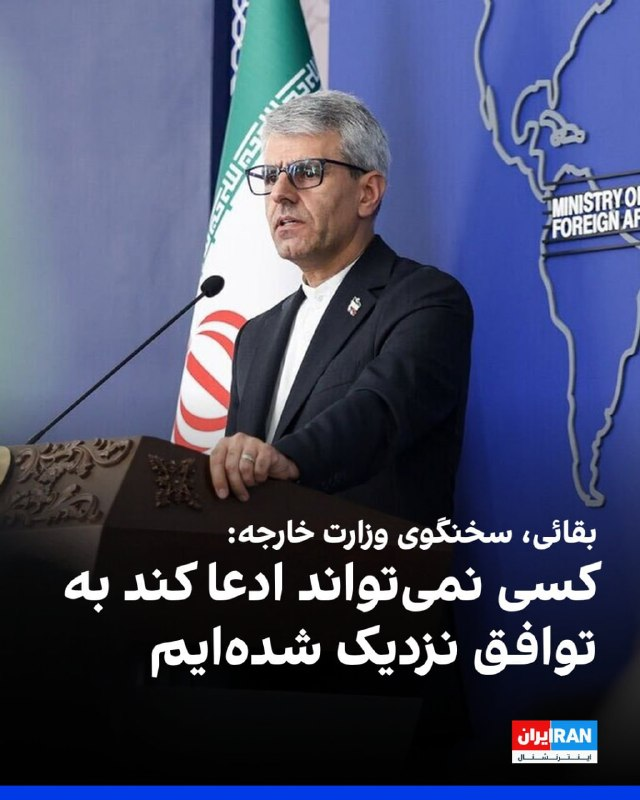

سماعیل بقائی، سخنگوی وزارت خارجه جمهوری اسلامی گفت: «کسی نمی‌تواند ادعا بکند به توافق نزدیک شده‌ایم، تغییرات مکرر مواضع مقامات آمریکایی هر گفت‌وگویی را دچار اشکال می‌کند.»

او افزود: «جمهوری اسلامی در حال حاضر بر روند مذاکرات متمرکز است و اینکه توافق احتمالی بعدا چگونه اعلام یا امضا شود، موضوعی است که برای تصمیم‌گیری درباره آن فرصت وجود دارد.»

بقائی اضافه کرد: «سفر هیئت‌ها به تهران یا سفر متقابل ممکن است در صورت لزوم انجام شود، اما در شرایط فعلی برنامه‌ای برای سفر به پاکستان یا سفر هیئت پاکستانی به ایران برنامه‌ریزی نشده است.»
‌🏁 🇬🇧 IranintlTV

🤖 @VahidOOnLine

## VahidOOnLine — post 242089

  <a href="telegram/content/VahidOOnLine_242089_1779706751.mp4" target="_blank">🎬 Download video</a>

ویدیویی که تازه به دست ایران‌اینترنشنال رسیده، خاکسپاری شبانه جاویدنام رئوف درخشانی‌مهر را نشان می‌دهد؛ سندی از اجبار خانواده‌ها به دفن مخفیانه و شبانه معترضان کشته‌شده.
رئوف، ۱۹ ساله و دانشجوی حقوق، شامگاه ۱۹ دی در دزفول با شلیک گلوله جنگی کشته شد و او را با تدابیر امنیتی در آرامستان شهیدآباد دزفول به خاک سپردند.
‌🏁 🇬🇧 IranintlTV

🤖 @VahidOOnLine

## WithYashar — post 12409

دیلی‌میل: تد کروز و لیندسی گراهام رهبری جمهوری‌خواهان رو بر عهده دارن که از توافق در حال شکل‌گیری ترامپ با ایران انتقاد میکنن و اونو اشتباهی فاجعه‌‌بار می‌دونن.
@withyashar

## WithYashar — post 12408

ترامپ در تروث : «من به تمام دموکرات‌ها، جمهوری‌خواه‌های ظاهری (RINOها) و احمق‌هایی می‌خندم که هیچ اطلاعی درباره توافق احتمالی‌ای که من با ایران در حال انجامش هستم ندارند؛ مسائلی که حتی هنوز وارد مرحله مذاکره هم نشده‌اند.

افراد ضعیف و بی‌اثری مثل سناتور شکست‌خورده تام تیلیس که به‌زودی از قدرت کنار می‌رود یا بیل کسیدی که تازه یک شکست سنگین در انتخابات مقدماتی خورده، یا نماینده واقعاً افتضاح، توماس مَسی؛ آدمی کاملاً کثیف که بعد از خیانت بزرگ به حزبش (و کشورش!) با اختلاف سنگین از یک میهن‌پرست واقعی آمریکایی که مورد حمایت «ترامپ» بود شکست خورد؛ و تقریباً تمام دموکرات‌ها؛ کسانی که کاملاً راهشان را گم کرده‌اند، مدام از سیاست‌های بد و نامزدهای حتی بدتر حمایت می‌کنند، اما همزمان از تک‌تک پیروزی‌های فوق‌العاده من انتقاد دارند.

این افراد بهتر است به خانه بروند و استراحت کنند؛ چون جز ایجاد تفرقه و شکست، کاری انجام نمی‌دهند. به زبان ساده: آن‌ها بازنده‌اند!

توافق با ایران یا یک توافق بزرگ و معنادار خواهد بود، یا اصلاً توافقی در کار نخواهد بود.
این توافق دقیقاً نقطه مقابل فاجعه برجام (JCPOA) خواهد بود؛ توافقی که توسط دولت شکست‌خورده اوباما مذاکره شد و مسیری مستقیم و آشکار برای دستیابی ایران به سلاح هسته‌ای ایجاد می‌کرد.
نه، من چنین توافق‌هایی انجام نمی‌دهم!
@withyashar

## WithYashar — post 12407

خوش چشم (مرشد فیلم صمد)تحلیلگر صداسیما: پول بشینه توی حساب جمهوری اسلامی میریم پای میز مذاکره
@withyashar

## WithYashar — post 12406

شبکه ۱۲ عبری: حزب‌الله استفاده از پهپادهای انتحاری را به‌طور چشمگیری افزایش داده است
@withyashar

## WithYashar — post 12405

فوری/ بازگشایی اینترنت بین الملل مصوب شد

ستاد راهبری و ساماندهی فضای مجازی صبح امروز دوشنبه (چهارم خردادماه) به ریاست دکتر عارف معاون اول رئیس جمهور تشکیل جلسه داد و بازگشت اینترنت به وضعیت قبل از دی ماه 1404 مصوب شد.

این مصوبه برای رییس جمهور ارسال شد و در صورت تایید رئیس جمهور جهت اجرا برای وزارت ارتباطات ارسال خواهد شد.
@withyashar

## WithYashar — post 12404

بقایی: برای تنگه هرمز عوارض نمی‌گیریم؛ هزینه‌های دریافتی صرفاً بابت خدمات ناوبری و حفاظت از محیط زیست است
@withyashar

## WithYashar — post 12403

ربیو:اگر مذاکرات شکست بخورد تقصیر ایالات متحده یا متحدان ما در منطقه خلیج فارس نیست. 100 درصد تقصیر ایران است
@withyashar

## WithYashar — post 12402

سخنگوی وزارت خارجه:

سفر آقای عراقچی به نیویورک به علت مشکل روادید منتفی است
@withyashar

## WithYashar — post 12401

  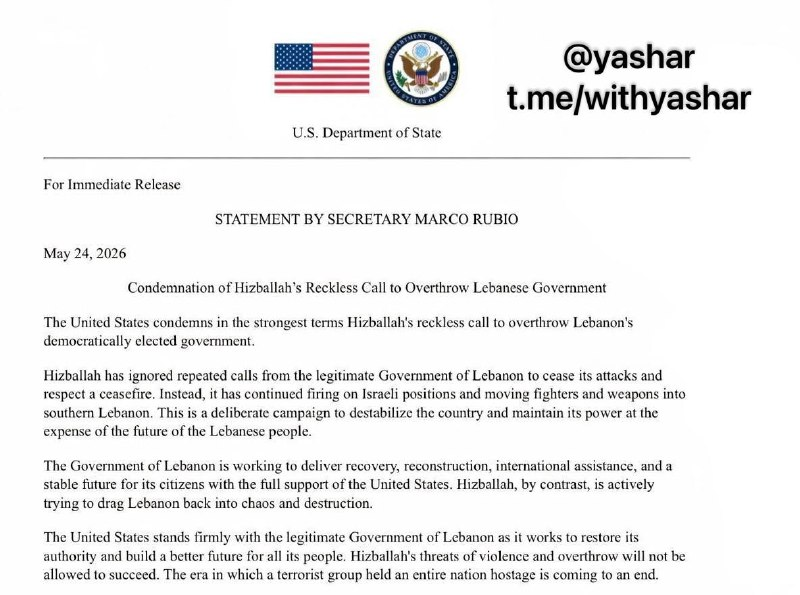

بیانیهٔ مارکو روبیو، وزیر امور خارجه آمریکا
محکومیت درخواست بی‌پروا و خطرناک حزب‌الله برای سرنگونی دولت لبنان

ایالات متحده با شدیدترین لحن ممکن، درخواست بی‌ملاحظه حزب‌الله برای سرنگونی دولت منتخب و قانونی لبنان را محکوم می‌کند.
حزب‌الله بارها درخواست‌های دولت قانونی لبنان برای توقف حملات و احترام به آتش‌بس را نادیده گرفته است. در عوض، به شلیک به مواضع اسرائیل و انتقال نیروها و سلاح‌ها به جنوب لبنان ادامه داده است. این یک کارزار عمدی برای بی‌ثبات کردن کشور و حفظ قدرت خود، به بهای آینده مردم لبنان است.

دولت لبنان در حال تلاش برای بازسازی، احیای کشور، دریافت کمک‌های بین‌المللی و ایجاد آینده‌ای باثبات برای شهروندانش با حمایت کامل ایالات متحده است. اما حزب‌الله، برعکس، فعالانه می‌کوشد لبنان را دوباره به سوی هرج‌ومرج و ویرانی بکشاند.

ایالات متحده قاطعانه در کنار دولت قانونی لبنان ایستاده است؛ دولتی که برای بازگرداندن حاکمیت خود و ساختن آینده‌ای بهتر برای همه مردم لبنان تلاش می‌کند. تهدیدهای حزب‌الله برای خشونت و سرنگونی حکومت، اجازه موفقیت نخواهد یافت. دورانی که یک گروه تروریستی تمام یک کشور را گروگان گرفته بود، رو به پایان است.
@withyashar

## WithYashar — post 12400

سعید قاسمی نژاد مشاور شاهزاده : ‏شاید شما هم مثل من همیشه این سوال را از خودتان می‌پرسید که اگر در سال ۵۷ بودید آیا اسیر جو زمان می‌شدید و روبروی شاه می‌ایستادید یا کنار او می‌ایستادید و از ایران دفاع می‌کردید. اگر امروز روبروی شاهزاده رضا پهلوی ایستاده‌اید و‌ دشمن اویید قطعا آن روز هم روبروی شاه می‌ایستادید و‌ دشمن او می‌بودید، شک نکنید و به خودتان و دیگران دروغ نگویید.
@withyashar
یاشار : چقدر زیبا یاد آوری کردید ، اتفاقا اگه در اون زمان بودیم جلوی اطرافیان شاه میستادیم !
جلوی فردوست ، جلوی بختیار ، جلوی ارتشید قره باغی و حتی اردشیر زاهدی و خیلی از حلقه اطرافیان ایشان !
جاوید شاه پاینده ایران !

## WithYashar — post 12399

ترامپ در تروث : یکی از بدترین توافق‌هایی که کشور ما تا به حال انجام داده، «توافق هسته‌ای ایران» بود که توسط باراک حسین اوباما و افراد کاملاً غیرحرفه‌ای دولت اوباما طراحی و امضا شد. این توافق، یک مسیر مستقیم برای ایران جهت دستیابی به سلاح هسته‌ای ایجاد می‌کرد.…

## WithYashar — post 12398

انتخابات هیئت رئیسه مجلس که از ساعت ۷:۳۰ صبح امروز آغاز شد، دقایقی پیش پایان یافت
با آرا اکثریت نمایندگان قالیباف رئیس‌مجلس ماند
این انتخابات بصورت حضوری و با رای مستقیم نمایندگان برای انتخاب ۱۲ عضو هیئت رئیسه مجلس شامل یک رئیس، ۲ نایب رئیس، ۶ دبیر و ۳ ناظر بود.
@withyashar

## WithYashar — post 12397

😂😂😂

## WithYashar — post 12396

نعیم قاسم دبیرکل حزب الله:به خیابان ها بیاید و دولت لبنان را سرنگون کنید
@withyashar

## WithYashar — post 12395

## WithYashar — post 12394

## WithYashar — post 12393

## WithYashar — post 12392

Voice message

## WithYashar — post 12391

در مسیر قاهره در یک کاروانسرا استراحت می‌کنیم. نگران نباشید، کمی بعد حرکت می‌کنیم.😃

## WithYashar — post 12390

نیویورک پست : ترامپ نظر خود را تغییر داده و احتمال توافق اکنون به طور قابل توجهی کاهش یافته است؛ تماس ترامپ با نتانیاهو تأثیر بسیار زیادی داشته
@withyashar

## mwarmonitor — post 9673

من به همه «دوموکراسی‌خواهان» (ترکیب تمسخرآمیز دموکرات و احمق)، رینوها (جمهوری‌خواهان فقط در نام) و نادان‌هایی که هیچ چیز درباره توافق احتمالی من با ایران نمی‌دانند می‌خندم؛ چیزهایی که هنوز حتی درباره آن‌ها مذاکره هم نشده است. افراد ضعیف و بی‌کفایتی مانند سناتور…

## mwarmonitor — post 9672

من به همه «دوموکراسی‌خواهان» (ترکیب تمسخرآمیز دموکرات و احمق)، رینوها (جمهوری‌خواهان فقط در نام) و نادان‌هایی که هیچ چیز درباره توافق احتمالی من با ایران نمی‌دانند می‌خندم؛ چیزهایی که هنوز حتی درباره آن‌ها مذاکره هم نشده است. افراد ضعیف و بی‌کفایتی مانند سناتور شکست‌خورده تام تیلیس (که به زودی از سمت خود کنار می‌رود!)، بیل کسیدی که همین چند وقت پیش شکست سنگینی را در انتخابات مقدماتی متحمل شد، و نماینده واقعاً بد کنگره توماس مسی؛ یک کیسه کثافت بزرگ که در یک شکست مفتضحانه، نتیجه را به یک وطن‌پرست بزرگ آمریکایی (مورد تایید "ترامپ") واگذار کرد، آن هم پس از اینکه بی‌وفایی شدیدی به حزب (و کشورش!) نشان داد.
و تقریباً همه «دوموکراسی‌خواهان»، افرادی که کاملاً راه خود را گم کرده‌اند و مدام از سیاست‌های بد و حتی نامزدهای بدتر حمایت می‌کنند، اما به طور مداوم از تک‌تک پیروزی‌های فوق‌العاده من انتقاد می‌کنند. این افراد باید به خانه بروند و استراحت کنند، آن‌ها کاری جز ایجاد تفرقه و باخت انجام نمی‌دهند. به عبارت دیگر، آن‌ها بازنده هستند!
توافق با ایران یا یک توافق بزرگ و معنادار خواهد بود، یا اصلاً توافقی در کار نخواهد بود. این توافق دقیقاً نقطه مقابل فاجعه برجام (JCPOA) خواهد بود که توسط دولت شکست‌خورده اوباما مذاکره شد؛ توافقی که یک مسیر مستقیم و باز برای رسیدن ایران به سلاح هسته‌ای بود. خیر، من این‌طور معامله نمی‌کنم!

رئیس‌جمهور دونالد جی ترامپ (DJT)

@mwarmonitor

## mwarmonitor — post 9671

🔸شبکه ۱۲ اسرائیل: از صبح تاکنون ۳ پهپاد حزب‌الله در داخل اسرائیل منفجر شده‌اند که یکی از آن‌ها به یک ساختمان در منطقه «مطله» اصابت کرده است.

@mwarmonitor

## mwarmonitor — post 9670

🔴تد کروز و لیندسی گراهام رهبری جمهوری‌خواهان را بر عهده دارند که از ترامپ به‌خاطر «اشتباه فاجعه‌بار» در توافق در حال شکل‌گیری او با ایران به‌شدت انتقاد می‌کنند. Daily mail

@mwarmonitor

## mwarmonitor — post 9669

  

🔴فایننشال تایمز گزارش می‌دهد که شی جین‌پینگ در جریان دیدار با ترامپ، هنگام صحبت درباره طرح‌های نظامی‌سازی مجدد ژاپن و افزایش هزینه‌های دفاعی تحت نخست‌وزیری سانائه تاکایچی، دچار عصبانیت شده است.

🔸ترامپ گفته است که ژاپن برای دفاع از خود در برابر تهدیدهای کره شمالی به یک ارتش قوی‌تر نیاز دارد.

@mwarmonitor

## mwarmonitor — post 9668

🔴شبکه کان اسرائیل: رئیس ستاد ارتش اسرائیل خواستار حمله به بیروت در پاسخ به پهپادهای حزب‌الله شده است.

@mwarmonitor

## mwarmonitor — post 9667

  <a href="telegram/content/mwarmonitor_9667_1779706755.mp4" target="_blank">🎬 Download video</a>

📍مرکز خرید محبوب «Kvadrat» در منطقه لوکیانیوکا در کی‌یف پس از یک حمله سنگین موشکی و پهپادی روسیه در یکشنبه کاملاً در آتش سوخت.

🔸در منطقه شوچنکیفسکی، یک نفر کشته شد. تعداد کل مجروحان در کی‌یف به بیش از ۴۰ نفر افزایش یافته است.

@mwarmonitor

## mwarmonitor — post 9666

  

📊آسیا هفته را با خبرهایی آغاز کرد مبنی بر اینکه آمریکا و ایران به‌تدریج در حال نزدیک شدن به یک توافق هستند و بازارها نیز تصمیم گرفتند به جنبه مثبت ماجرا نگاه کنند: بلومبرگ

@mwarmonitor

## mwarmonitor — post 9665

🔴وزیر دارایی اسرائیل، بتسالل اسموتریچ:

🔸«برای هر پهپاد انفجاری حزب‌الله، باید ده ساختمان در بیروت با خاک یکسان شود.

🔹این هفته بودجه‌ای حدود دو میلیارد شکل برای راهکارهای فناورانه مقابله با تهدید پهپادها تصویب کردم. از جمله این بودجه به نهادهای غیرنظامی اجازه می‌دهد راهکارها و ایده‌های خلاقانه و خارج از چارچوب ارائه کنند.»

@mwarmonitor

## mwarmonitor — post 9664

  

🔴قطر به‌صورت مخفیانه LNG از طریق تنگه هرمزِ مسدودشده جابه‌جا می‌کند

🔹با وجود انسداد تقریباً کامل تنگه هرمز، قطر موفق شده است سه کشتی حامل LNG را به‌صورت مخفیانه از این آبراه حیاتی عبور دهد.

🔹به گزارش بلومبرگ، این تانکرها شامل Al Rayyan (در مسیر چین) و Fuwairit (در مسیر پاکستان) هستند که در روزهای اخیر فرستنده‌های موقعیت‌یاب خود را خاموش کرده و با موفقیت از تنگه عبور کرده‌اند.

🔸این اقدام به قطر اجازه می‌دهد حتی در شرایط ادامه درگیری نظامی در منطقه، همچنان به تأمین مشتریان اصلی آسیایی خود ادامه دهد.

@mwarmonitor

## mwarmonitor — post 9663

  

🚀چین فضاپیمای شِنژو ۲۳ را پرتاب کرد؛ یکی از سه فضانورد قرار است یک مأموریت یک‌ساله در فضا انجام دهد.

🔸در این مأموریت، فضاپیما با سه فضانورد به ایستگاه فضایی تیانگونگ در مدار زمین پرتاب شد و طبق برنامه، یکی از اعضای خدمه قرار است حدود یک سال در فضا بماند.

🔹این مأموریت بخشی از برنامه چین برای افزایش توان پروازهای طولانی‌مدت فضایی و آماده‌سازی برای فرود سرنشین‌دار بر ماه تا سال ۲۰۳۰ است. نیویورک پست

@mwarmonitor

## mwarmonitor — post 9662

🔸سخنگوی وزارت امور خارجه ایران گفت: ما از تنگه هرمز عوارض دریافت نخواهیم کرد.

🔹سخنگوی وزارت امور خارجه ایران گفت که طبیعی است خدماتی که ارائه می‌شود هزینه‌ای داشته باشد، اما نباید این هزینه‌ها به‌عنوان «عوارض» معرفی شوند.

@mwarmonitor

## mwarmonitor — post 9661

  

🔴یک پهپاد MQ-4C Triton نیروی دریایی ایالات متحده که دو روز پیش به پایگاه هوایی موفق‌السلطی در اردن منتقل شده بود، اکنون به پرواز درآمده و در حال حرکت به سمت خلیج فارس برای انجام یک مأموریت شناسایی در نزدیکی ایران است.

@mwarmonitor

## pm_afshaa — post 91447

  <a href="telegram/content/pm_afshaa_91447_1779706759.webm" target="_blank">🎬 Download video</a>

🔴العربیه:
نخست‌وزیر پاکستان با رهبران چین درباره پرونده ایران و توافق با آمریکا صحبت کرد.

اسلام‌آباد اصرار داره که پکن نقش ضامن رو تو هر جور توافقی بین آمریکا و ایران بازی کنه.

💧 Rainbet.com the #1 Non-KYC Crypto Casino & Sportsbook @rainbetcom

😁 @Pm_Afshaa

## pm_afshaa — post 91446

  <a href="telegram/content/pm_afshaa_91446_1779706760.webm" target="_blank">🎬 Download video</a>

🔴صداوسیما از سفر عبدالناصر همتی، رییس کل بانک مرکزی، به قطر خبر داد و نوشت این سفر در حالی انجام شده که چند روز پیش هیاتی قطری برای گفت‌وگو درباره اموال بلوکه‌شده ایران در تهران حضور داشتن.

💧 Rainbet.com the #1 Non-KYC Crypto Casino & Sportsbook @rainbetcom

😁 @Pm_Afshaa

## pm_afshaa — post 91445

  <a href="telegram/content/pm_afshaa_91445_1779706761.webm" target="_blank">🎬 Download video</a>

🔴دیلی‌میل: تد کروز و لیندسی گراهام رهبری جمهوری‌خواهان رو بر عهده دارن که از توافق در حال شکل‌گیری ترامپ با ایران انتقاد میکنن و اونو اشتباهی فاجعه‌‌بار می‌دونن.

💧 Rainbet.com the #1 Non-KYC Crypto Casino & Sportsbook @rainbetcom

😁 @Pm_Afshaa

## pm_afshaa — post 91444

  <a href="telegram/content/pm_afshaa_91444_1779706761.webm" target="_blank">🎬 Download video</a>

🔴پست جدید ترامپ در تروث سوشال:

من میخندم به همه‌ی دموکرات‌های احمق و رینوها (جمهوری‌خواهان بدلی) و ابلهانی که هیچ‌چیز درباره‌ی توافق احتمالی من با ایران نمیدانند؛ چیزهایی که حتی هنوز مورد مذاکره هم قرار نگرفته‌اند. افراد ضعیف و بی‌خاصیتی مثل سناتور شکست‌خورده تام تیلیس (که به‌زودی از کار برکنار میشود!)، بیل کسیدی که همین چندهفته پیش یک شکست سنگین رو توی انتخابات درون‌حزبی تجربه کرد، و عضو واقعاً بد کنگره توماس مسی؛ یک آدم پست و رذل به تمام‌معنا که بعد از نشان دادن بی‌وفایی شدید به حزبش (و کشورش!)، در یک انتخابات قاطع (با اختلاف فاحش) به یک میهن‌پرست بزرگ آمریکایی (مورد حمایت "ترامپ") باخت. و تقریباً همه‌ی دموکرات‌های احمق، افرادی که کاملاً راه خودشون رو گم کرده‌اند، مدام از سیاست‌های بد و حتی نامزدهای بدتر حمایت میکنند، اما به‌طور مستمر از تک‌تک بردهای شگفت‌انگیز من انتقاد میکنند. این افراد باید بروند خانه و استراحت کنند، اونا کاری جز ایجاد تفرقه و باخت انجام نمیدهند. به عبارت دیگر، اونا بازنده هستند!

توافق با ایران یا یک توافق بزرگ و پرمحتوا خواهد بود، یا اصلاً توافقی در کار نخواهد بود. این توافق دقیقاً نقطه‌ی مقابل فاجعه‌ی برجام خواهد بود که توسط دولت شکست‌خورده‌ی اوباما مذاکره شد؛ توافقی که یک مسیر مستقیم و باز واسه رسیدن به سلاح هسته‌ای جلو پای ایران گذاشت. نخیر، من از این مدل توافق‌ها نمیکنم!

💧 Rainbet.com the #1 Non-KYC Crypto Casino & Sportsbook @rainbetcom

😁 @Pm_Afshaa

## pm_afshaa — post 91443

  <a href="telegram/content/pm_afshaa_91443_1779706762.webm" target="_blank">🎬 Download video</a>

🔴بقایی، سخنگوی وزارت خارجه:
درسته که تو خیلی از موضوعات به یه جمع‌بندی رسیدیم، ولی اگه بگیم این یعنی امضای یه توافق نزدیکه، کسی نمیتونه چنین ادعایی بکنه.

ما مدام میبینیم که موضع مقامات آمریکا تغییر میکنه و این روند هر گفت‌وگویی رو با اشکال و شک‌های زیادی مواجه میکنه

💧 Rainbet.com the #1 Non-KYC Crypto Casino & Sportsbook @rainbetcom

😁 @Pm_Afshaa

## pm_afshaa — post 91442

  <a href="telegram/content/pm_afshaa_91442_1779706763.webm" target="_blank">🎬 Download video</a>

🔴اکونومیست: عربستان از ترامپ خواسته هرگونه حمله جدید به ایران رو تا بعد از مراسم سالانه حج به تعویق بندازه.

ریاض نگرانه اگه درگیری دوباره آغاز و حریم هوایی منطقه بسته بشه، زائران در عربستان سعودی گیر بیفتن.

💧 Rainbet.com the #1 Non-KYC Crypto Casino & Sportsbook @rainbetcom

😁 @Pm_Afshaa

## pm_afshaa — post 91441

  <a href="telegram/content/pm_afshaa_91441_1779706763.webm" target="_blank">🎬 Download video</a>

🔴سی‌بی‌اس: مجتبی خامنه‌ای در مکانی نامعلوم با دسترسی کم به دنیای خارج پنهان شده و ارتباط با اون فقط از طریق شبکه‌ای از پیک‌ها انجام میشه.

حتی بسیاری از مقام‌های ارشد جمهوری اسلامی هم به مجتبی خامنه‌ای دسترسی مستقیم ندارن و همین روند مذاکرات و پاسخ تهران به پیشنهادهای آمریکا رو کند کرده.

💧 Rainbet.com the #1 Non-KYC Crypto Casino & Sportsbook @rainbetcom

😁 @Pm_Afshaa

## pm_afshaa — post 91440

تسنیم: مصوبه رفع انسداد اینترنت بین‌المللی تأیید شد و به دست پزشکیان رسید؛ اگر پزشکیان هم تأییدش کنه، این مصوبه برای اجرا به وزارت ارتباطات صادر می‌شه و تا هفته آینده نت بین‌المللی وصل می‌شه

💧 Rainbet.com the #1 Non-KYC Crypto Casino & Sportsbook @rainbetcom

😁 @Pm_Afshaa

## pm_afshaa — post 91439

🔴ربیو:اگر مذاکرات شکست بخورد تقصیر ایالات متحده یا متحدان ما در منطقه خلیج فارس نیست. 100 درصد تقصیر ایران است

💧 Rainbet.com the #1 Non-KYC Crypto Casino & Sportsbook @rainbetcom

😁 @Pm_Afshaa

## pm_afshaa — post 91438

درود هموطنان عزیزم یک دختر 26 سال داره بجرم کشتن یکنفر که وارد خونش شده که بهش تعرض و تجاوز بکنه صبح 5 خرداد اعدام میشه، باید ۱۰ میلیارد جمع بشه که رضایت بدن تا حالا ۹ میلیارد جمع شده  همه چی داخل تصویر هست کسی خواست استعلام بگیره میدونم ایرانی ها آدم با…

## pm_afshaa — post 91437

به قرآن قسم بگی چندجا روبیکا هم گفتم بزارن شما کامل بخون و استعلام هم بگیر که دروغ نیست میتونی کانال بزاری فردا اعدام میشه یک میلیارد مونده💔💔

## pm_afshaa — post 91436

درود هموطنان عزیزم یک دختر 26 سال داره بجرم کشتن یکنفر که وارد خونش شده که بهش تعرض و تجاوز بکنه صبح 5 خرداد اعدام میشه، باید ۱۰ میلیارد جمع بشه که رضایت بدن تا حالا ۹ میلیارد جمع شده  همه چی داخل تصویر هست کسی خواست استعلام بگیره میدونم ایرانی ها آدم با…

## pm_afshaa — post 91435

  

درود هموطنان عزیزم
یک دختر 26 سال داره بجرم کشتن یکنفر که وارد خونش شده که بهش تعرض و تجاوز بکنه
صبح 5 خرداد اعدام میشه، باید ۱۰ میلیارد جمع بشه که رضایت بدن تا حالا ۹ میلیارد جمع شده  همه چی داخل تصویر هست کسی خواست استعلام بگیره
میدونم ایرانی ها آدم با غیرتی هستند حتی شما با کمک ۱۰ هزار تومان کمک بزرگی کردید❤️

شماره کارت:۵۸۹۴۶۳۱۵۹۴۰۴۵۲۸۸
شبا: ۲۲۰۱۳۰۱۰۰۰۰۰۰۰۰۲۶۰۴۸۲۷۶۶

روی شماره کارت و شماره شبا بزنید کپی میشه

## pm_afshaa — post 91434

🔴قالیباف برای هفتمین بار رئیس مجلس شد

💧 Rainbet.com the #1 Non-KYC Crypto Casino & Sportsbook @rainbetcom

😁 @Pm_Afshaa

## pm_afshaa — post 91433

🔴کابینه سیاسی-امنیتی اسراییل فردا ساعت 18 تشکیل جلسه خواهد داد

💧 Rainbet.com the #1 Non-KYC Crypto Casino & Sportsbook @rainbetcom

😁 @Pm_Afshaa

## pm_afshaa — post 91432

وزارت امور خارجه چین امروز در واکنش به مذاکرات بین ایران و ایالات متحده برای رسیدن به توافقی جهت پایان جنگ اعلام کرد که این جنگ اصلاً نباید آغاز می‌شد و نیازی به ادامه آن نیست

💧 Rainbet.com the #1 Non-KYC Crypto Casino & Sportsbook @rainbetcom

😁 @Pm_Afshaa

## pm_afshaa — post 91431

مشاور وزیر ارتباطات از احتمال دسترسی و اتصال به اینترنت بین‌المللی در هفته آینده خبر داد

💧 Rainbet.com the #1 Non-KYC Crypto Casino & Sportsbook @rainbetcom

😁 @Pm_Afshaa

## pm_afshaa — post 91430

  

جمهوری اسلامی برای بچه های اکباتان حکم اعدام صادر کرد

میلاد آرمون، نوید نجاران، مهدی ایمانی و سید محمدمهدی حسینی به اعدام محکوم شدن

💧 Rainbet.com the #1 Non-KYC Crypto Casino & Sportsbook @rainbetcom

😁 @Pm_Afshaa

## pm_afshaa — post 91429

نعیم قاسم دبیرکل حزب الله:به خیابان ها بیاید و دولت لبنان را سرنگون کنید

💧 Rainbet.com the #1 Non-KYC Crypto Casino & Sportsbook @rainbetcom

😁 @Pm_Afshaa

## pm_afshaa — post 91428

🔴نیویورک پست : ترامپ نظر خود را تغییر داده و احتمال توافق اکنون به طور قابل توجهی کاهش یافته است؛ تماس ترامپ با نتانیاهو تأثیر بسیار زیادی داشته

💧 Rainbet.com the #1 Non-KYC Crypto Casino & Sportsbook @rainbetcom

😁 @Pm_Afshaa

## DEJradio — post 4933

  <a href="telegram/content/DEJradio_4933_1779706765.webm" target="_blank">🎬 Download video</a>

🔺📌 با توجه به شرایط اقتصادی ایران، بسیاری از مردم برای تامین لوازم زندگی از روی ناچاری سراغ سمساری‌ها و دست دوم فروشی‌ها می‌روند. گزارش‌های میدانی حاکی از آن است حتی خرید اقساط از سمساری‌ها نیز بیشتر شده است:
از آخرین باری که برای منزل لوازم جدید خرید کردید چقدر می‌گذرد؟ آیا پول شما به خرید دکور می‌رسد؟ مثلا خرید یک مجسمه؛ در اروپا یک استقبال از مجسمه دکوری زیاد شده: مجسمه یا تندیس آلت جنسی!

#مجسمه #آلت_جنسی
@DEJradio

## DEJradio — post 4932

  <a href="telegram/content/DEJradio_4932_1779706766.webm" target="_blank">🎬 Download video</a>

🔺📢 صبح روز دوشنبه ۴ خرداد و در جریان عملیات آواربرداری در پالایشگاه ششم پارس جنوبی، حادثه‌ای رخ داد که به مصدوم شدن شش تن از کارکنان شرکت پیمانکار انجامید.

به گفته ابراهیم عباسی، سخنگوی مجتمع گاز پارس جنوبی، این حادثه حدود ساعت ۱۰ صبح روز دوشنبه چهارم خرداد و هنگام پاک‌سازی بقایای تأسیسات آسیب‌دیده رخ داده است.

بر اساس این گزارش، سه تن از مصدومان به صورت سرپایی درمان شدند و سه نفر دیگر برای بررسی‌های بیشتر به بیمارستان عسلویه منتقل شده‌اند. مقام‌های مسئول اعلام کرده‌اند علت وقوع این حادثه همچنان در دست بررسی است.

#آواربرداری #عسلویه
@DEJradio

## DEJradio — post 4931

👑🎥 شماری از ایرانیان میهن‌دوست روز یکشنبه سوم خرداد ۱۴۰۵ در حمایت از انقلاب شیر و خورشید و شاهزاده رضا پهلوی در شهر تریر آلمان تظاهرات کردند.

#آلمان #انقلاب_شیروخورشید
@DEJradio

## DEJradio — post 4930

  <a href="telegram/content/DEJradio_4930_1779706767.webm" target="_blank">🎬 Download video</a>

🔺📢 مجله اکونومیست می‌نویسد، گزارش‌‌ها حاکی از آن است که عربستان سعودی از دونالد ترامپ درخواست کرده است هرگونه حمله جدید به ایران را تا پس از حج به تعویق بیندازد زیرا این نگرانی وجود دارد که اگر درگیری دوباره آغاز شود، زائران در آنجا گیر خواهند افتاد.

این مراسم ۹ خرداد تمام می‌شود.

#حج #عربستان_سعودی
@DEJradio

## DEJradio — post 4929

  <a href="telegram/content/DEJradio_4929_1779706767.webm" target="_blank">🎬 Download video</a>

🤡
🔺 حبیب‌الله سیاری معاون هماهنگ‌کننده ارتش جمهوری اسلامی در واکنش به ادعاها درباره توافق آمریکا و جمهوری اسلامی با اعلام بی‌خبری از موضوع به کنایه می‌گوید، اصلا نمی‌دونم توافق سر چی هست!

کانال تلگرامی سـ.ـپاه نیوز می‌نویسد: «در حالی‌که رسانه‌های بیگانه با جزئیات دقیق یا تحریف‌شده، در حال مهندسی اخبار تفاهم احتمالی و تزریق ابهام و اضطراب به جامعه هستند، مراجع رسمی داخلی حتی از انتشار یک خط روایت اول و شفاف دریغ می‌کنند.»
محمد منان نماینده مجلس شورای اسلامی گفته «حسب اخبار واصله طبق توافق احتمالی،ایران تنگه هرمز را باز خواهد کرد بدون آنکه به اخذ عوارض توسط ایران اشاره ای شده باشد!»

#توافق #مذاکرات
@DEJradio

## mamlekate — post 103580

📝 سفر همتی به قطر در سایه پرونده پول‌های بلوکه‌شده

خبرگزاری ایلنا از سفر عبدالناصر همتی، رئیس کل بانک مرکزی جمهوری اسلامی، به قطر خبر داد و نوشت یکی از دلایل سفر همتی به قطر پیگیری آزادسازی منابع ارزی ایران است.

📝 اولین جلسه حضوری مجلس جمهوری اسلامی پس از جنگ

@mamlekate

## mamlekate — post 103579

📝 مقام ارشد آمریکا: ایران پشت‌پرده برای واگذاری اورانیوم غنی‌شده، تعهد داده است

یک مقام ارشد دولت ترامپ اعلام کرد رژیم ایران «پشت‌پرده» تعهداتی در زمینه واگذاری اورانیوم غنی‌شده داده و جمهوری اسلامی بدون اجرای این تعهدات، دستاورد چندانی از مذاکرات نخواهد داشت.

📝 مقام وزارت خارجه جمهوری اسلامی: درباره اورانیوم با غلطت بالا بعد از تفاهم اولیه مذاکره می‌کنیم

یک دیپلمات ارشد جمهوری اسلامی اعلام کرد که در صورت دستیابی به توافق میان تهران و واشنگتن، «موضوع هسته‌ای و غنی‌سازی و ذخایر اورانیوم غنی‌شده با خلوص بالا» در فرصت نهایتا ۶۰ روزه این توافق بررسی خواهد شد.

@mamlekate

## kianmeli1 — post 87653

🔴در روبیکا و جاهای دیگه به اسم کیان ملی کانال ساختن و فیلترشکن میفروشن مراقب باشید اونجاها دست افراد مشکوکه

نمونه پیام: بنده داخل روبیکا به اسم کیان ملی بهم دو بار فیلتر فروختن
دیگه هم‌جواب ندادن
تو شونم ادعا شون میشد چنل تلگرام مال اوناس
https://t.me/kianmeli1

## kianmeli1 — post 87652

🔴زلزله ۴.۷ ریشتری لافت هرمزگان بزرگترین لرزه ثبت‌شده در کشور
https://t.me/kianmeli1

## kianmeli1 — post 87651

  <a href="telegram/content/kianmeli1_87651_1779706768.mp4" target="_blank">🎬 Download video</a>

🔴من تا قبل از جنگ تو این شرکت محصولات پتروشیمی تو ساوه کار میکردم که الآن بخاطر وضع اقتصادی بسته شده و همه کارگرا و کارمنداش بیکارن و حقوق نمیگیرن.
کسی به فکر ما نیست و معلوم نیست کی بدرد ما برسن؟
https://t.me/kianmeli1

## kianmeli1 — post 87650

  <a href="telegram/content/kianmeli1_87650_1779706769.mp4" target="_blank">🎬 Download video</a>

🔴اسماعیل بقایی، سخنگوی وزارت خارجه جمهوری اسلامی که همزمان سخنگوی تیم مذاکره‌کننده با آمریکاست، صبح امروز در نشست خبری گفت: «کسی نمی‌تواند ادعا کند که به توافق نزدیک شده‌ایم. تغییرات مکرر مواضع مقامات آمریکایی هر گفت‌گویی را دچار اشکال می‌کند. در حوزه هسته‌ای هیچ مذاکره‌ای نمی‌کنیم و هر اقدام خصمانه‌ای نیز با واکنش شدید ایران مواجه خواهد شد. همچنین بحثی در مورد جزئیات مدیریت تنگه هرمز نداریم و اینکه تنگه به چه شیوه‌ای مدیریت شود، مربوط به دولت‌های ساحلی آن است.»
https://t.me/kianmeli1

## kianmeli1 — post 87649

  <a href="telegram/content/kianmeli1_87649_1779706772.mp4" target="_blank">🎬 Download video</a>

🔴تحلیلگر صداسیما: پول بشینه توی حساب جمهوری اسلامی میریم پای میز مذاکره
https://t.me/kianmeli1

## IranIntlTV — post 338905

  <a href="telegram/content/IranIntlTV_338905_1779706774.mp4" target="_blank">🎬 Download video</a>

سرخط خبرهای دوشنبه ۴ خرداد
@iranintltv

## IranIntlTV — post 338904

  

سایت هرانا خبر داد گلرخ ایرایی، زهرا صفایی، مرضیه فارسی، شیوا اسماعیلی و سکینه پروانه، پنج تن از زندانیان سیاسی محبوس در بند زنان زندان اوین، از یکشنبه به‌صورت تنبیهی از حق استفاده از تلفن زندان محروم شده‌اند.

هرانا نوشت محرومیت تنبیهی این پنج زندانی سیاسی پس از آن اعمال شد که آنان در اعتراض به اجرای احکام اعدام، در محوطه هواخوری زندان شعار داده بودند.

این زندانیان پیش‌تر نیز از حق ملاقات حضوری با خانواده و وکلای خود محروم بوده‌اند و این محدودیت همچنان ادامه دارد.
https://iranintl.com/202605252442

## IranIntlTV — post 338903

  

دونالد ترامپ در شبکه تروث سوشال نوشت: «توافق با ایران یا یک توافق بزرگ و معنادار خواهد بود یا اصلا توافقی در کار نخواهد بود. این دقیقا برعکس فاجعه برجام است که توسط دولت شکست‌خورده اوباما انجام شد؛ توافقی که یک مسیر مستقیم و آشکار برای دستیابی آن‌ها به سلاح هسته‌ای بود. نه، من چنین توافق‌هایی انجام نمی‌دهم.»

او افزود: «من به همه دموکرات‌ها و جمهوری‌خواهانِ اسمی و احمق‌هایی می‌خندم که هیچ چیزی درباره توافق احتمالی که من با ایران در حال انجامش هستم نمی‌دانند؛ موضوعاتی که هنوز حتی درباره‌شان مذاکره هم نشده است.»
iranintl.com/202605255000

## IranIntlTV — post 338902

  <a href="telegram/content/IranIntlTV_338902_1779706777.mp4" target="_blank">🎬 Download video</a>

روزنامه شرق از بلاتکلیفی آموزش و پرورش برای حضوری کردن کلاس‌ها و چالش خانواده‌ها در ثبت‌نام سال تحصیلی جدید گزارش داد. بنا بر این گزارش، معاون وزیر آموزش و پرورش گفت: «تصمیم به حضوری کردن مدارس در اختیار آموزش و پرورش نیست.»

گفت‌وگو با لیلا سعادتی، عضو تحریریه ایران‌اینترنشنال

@iranintltv

## IranIntlTV — post 338901

  <a href="telegram/content/IranIntlTV_338901_1779706779.mp4" target="_blank">🎬 Download video</a>

پلیس ضد شورش ترکیه یکشنبه با شلیک گاز اشک‌آور وارد دفتر مرکزی حزب جمهوری‌خواه خلق، بزرگ‌ترین حزب مخالف دولت رجب طیب اردوغان، شد تا رهبر برکنار‌شده این حزب را بیرون کند.

گفت‌وگو با میثم بادامچی، نویسنده و پژوهشگر علوم سیاسی

@iranintltv

## IranIntlTV — post 338900

  <a href="telegram/content/IranIntlTV_338900_1779706781.mp4" target="_blank">🎬 Download video</a>

ویدیوهای رسیده به ایران‌اینترنشنال نشان می‌دهند گروهی از ایرانیان مقیم آلمان هم‌زمان با فستیوال موسیقی گوتیک‌ویو در شهر لایپزیگ علیه جمهوری اسلامی راهپیمایی نمادین برگزار کردند.
این تجمع با پوشیدن لباس مشکی، پخش موسیقی نویز و نصب نماد «وای‌فای خاموش» بر دهان شرکت‌کنندگان همراه بود؛ حرکتی اعتراضی برای جلب توجه افکار عمومی به کشتارهای رخ‌داده در ایران و بی‌توجهی سیاستمداران اروپایی.

## IranIntlTV — post 338899

  <a href="telegram/content/IranIntlTV_338899_1779706783.mp4" target="_blank">🎬 Download video</a>

یک شهروند با ارسال پیامی به ایران‌اینترنشنال می‌گوید: «مگر ما در ۱۸ و ۱۹ دی، در خیابان فریاد زدیم که توافق هسته‌ای جدید می‌خواهیم؟ توافق هسته‌ای که قبلا انجام شده بود. ما فریاد آزادی سر دادیم، نه فریاد توافق هسته‌ای که حالا ترامپ می‌خواهد انجام دهد.»

## IranIntlTV — post 338898

  

نت‌بلاکس صبح دوشنبه اعلام کرد خاموشی اینترنت در ایران وارد هشتادوهفتمین روز متوالی شده و بیش از ۲۰۶۴ ساعت ادامه داشته است. نت‌بلاکس نوشت قطع اینترنت «هرگونه شفافیت درباره اعدام‌ها» را از بین برده و به شرایط «غیرانسانی» و بلاتکلیفی منتقدان زندانی، مخالفان و گردشگران افزوده است.
iranintl.com/202605251225

## IranIntlTV — post 338897

  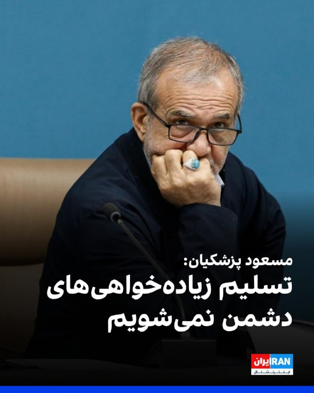

مسعود پزشکیان، رییس دولت جمهوری اسلامی گفت: «روند مذاکرات و تعاملات خارجی کشور به‌گونه‌ای طراحی شده که حقوق ملت ایران به‌صورت کامل استیفا شود و جمهوری اسلامی تحت هیچ شرایطی در برابر فشارها و مطالبات زیاده‌خواهانه تسلیم نخواهد شد.»

او افزود: «حفظ ثبات بازار و تامین نیازهای کشور در شرایط جنگی، مرهون تلاش موثر فعالان اقتصادی بوده است.»
iranintl.com/202605257599

## IranIntlTV — post 338896

🗣روایت شما از احتمال توافق میان آمریکا و جمهوری اسلامی- دوشنبه ۴ خرداد

🔹آقای ترامپ اومدی راجع به اون چهل‌هزار گل پژمرده و این زندانی‌های در معرض اعدام حرف زدی. گفتی که این رژیم فاسد هر کاری کنه حمله می‌کنی. ولی خب معلوم شد که به ما مردم بیچاره اهمیت ندادی.

🔹چه مذاکره‌ای؟ واقعا نمی‌فهمیم ترامپ داره چه غلطی می‌کنه. ولی ما بدون ترامپ هم می‌تونیم. هم‌میهنان، ما اعتراضات رو دوباره شروع می‌کنیم و ایران‌مون رو پس می‌گیریم. ناامید نباشید.

🔹برامون مهمه که خون عزیزترین‌های ایران پایمال نشه. فکر اینکه اون همه زندگی، آینده، تجربه و متعلقات رو برای «هیچ» رها کرده باشن عذابم می‌ده.

🔹اگر می‌خواستی توافق کنی، بی‌جا کردی به ما مردم گفتی کمک در راه است. چه کمکی؟ جنگ نصفه‌نیمه و بی‌نتیجه که فقط اینترنت‌ها رو قطع کرد و قیمت‌ها رو برد بالا.

🔹الان حدود سه ماهه که با قطعی اینترنت و گرانی روزبه‌روز داریم عقب‌مونده‌تر و فقیرتر می‌شیم. قرار بود ترامپ از ما حمایت کنه، نه اینکه نصف کار رو ول کنه بره. آقای ترامپ، ۸۰ میلیون ایرانی حرف شما رو حساب کردن و امید بستن.

🔹یکی به این ترامپ بگه قبل از جنگ این همه از خون جاویدنام‌ها و جون مردم مایه گذاشت برای شروع جنگ، حداقل یکی از بندهای توافق رو اختصاص می‌داد به حقوق مردم مثل اینترنت یا حق اعتراض آزاد.

🔹ترامپ عزیز، اول ازت ممنونم بابت همراهی‌هات تاکنون، ولی اگر با بوفالوی منطقه و قاتل مردم ایران هر توافقی بکنی، نه می‌بخشیم و نه فراموش می‌کنیم و البته قطعا خودمون ریشه این جهل و جور و فساد رو از تاریخ ایران درمیاریم و به زباله‌دان تاریخ می‌اندازیم.

🔹فقط از خدا می‌خوام که توافق نشه، مجدد جنگ بشه، چون هیچ‌کس از هیچ کجای دنیا نمی‌تونه درک کنه این جمهوری اسلامی چقدر وحشی، چقدر متجاوز و چقدر خشنه. موندن اینا یعنی نادیده گرفتن قتل‌عام ده‌ها هزار جاویدنام.

## IranIntlTV — post 338895

  <a href="telegram/content/IranIntlTV_338895_1779706786.mp4" target="_blank">🎬 Download video</a>

دادگاه انقلاب تهران، ۴ نفر از معترضان جنبش زن، زندگی، آزادی را در پرونده شهرک اکباتان به اتهام افساد فی‌الارض به اعدام محکوم کرد. با وجود اینکه پیش‌تر این حکم از سوی دادگاه کیفری نقض شده بود، ابوالقاسم صلواتی حکم اعدام متهمان این پرونده را دوباره تایید کرد.

گفت‌وگو با رضا اکوانیان، روزنامه‌نگار و فعال حقوق بشر

@iranintltv

## IranIntlTV — post 338894

  <a href="telegram/content/IranIntlTV_338894_1779706788.mp4" target="_blank">🎬 Download video</a>

سخنگوی وزارت خارجه جمهوری اسلامی یکی از محورهای تفاهم را توقف جنگ در «تمام جبهه‌ها» عنوان کرد.

مرتضی کاظمیان، عضو تحریریه ایران‌اینترنشنال، از بی‌اعتنایی جمهوری اسلامی به منافع ملی و اقدام ضدملی حکومت در گره زدن منافع ایران با مصالح حزب‌الله لبنان می‌گوید.

@iranintltv

## IranIntlTV — post 338893

  

ابراهیم رضایی، سخنگوی کمیسیون امنیت ملی مجلس، گفت جمهوری اسلامی نباید در موضوع هسته‌ای تعهدی بدهد که قدرت بازدارندگی‌اش را تضعیف کند.

او افزود: «جمهوری اسلامی نباید چیزی را که برای آن هزینه زیادی پرداخته، «دو دستی تقدیم دشمن» کند.

او توان هسته‌ای را «دارایی استراتژیک» خواند و گفت واگذاری آن در مذاکره ممکن است خطراتی به همراه داشته باشد و دشمن را برای حمله مجدد «حریص‌تر» کند.
iranintl.com/202605255630

## IranIntlTV — post 338892

  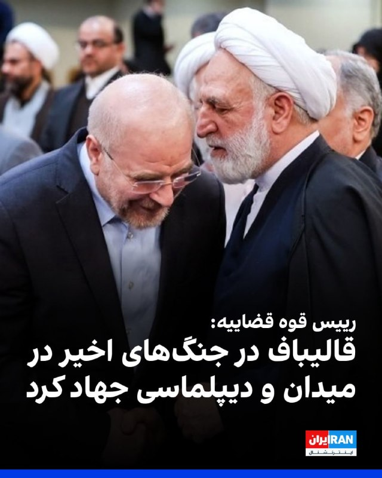

غلامحسین محسنی اژه‌ای، رییس قوه قضاییه در پیامی در خصوص انتخاب مجدد قالیباف به‌عنوان رییس مجلس شورای اسلامی، نوشت: «محمدباقر قالیباف که مدیری جهادی و نستوه و میدان‌دیده است و در جنگهای ۱۲ روزه و رمضان و پس از آن، در عرصه‌های میدان و دیپلماسی جهاد کرد.»

او ادامه داد: «قوه قضاییه آماده است بیش از گذشته با مجلس و نمایندگان آن، همکاری و مساعدت داشته باشد.»

## IranIntlTV — post 338891

  

مهدی خراطیان، تحلیلگر نزدیک به نهادهای امنیتی جمهوری اسلامی گفت: «رهبر انقلاب بر اساس پروتکل‌های پیچیده امنیتی، مدام جابه‌جا می‌شد و برای برگزاری جلسات به دفتر خود مراجعه می‌کرد. محل اقامت او نیز به‌طور مداوم تغییر می‌کرد و من کشته شدن او را جز در نتیجه نفوذ، به شکل دیگری قابل تفسیر نمی‌دانم.»

او افزود موساد فرصتی برای کشتن علی خامنه‌ای به دست آورد.

دفتر خامنه‌ای در نخستین ساعات آغاز جنگ میان جمهوری اسلامی، آمریکا و اسرائیل در ۹ اسفند ۱۴۰۴ هدف حمله موشکی قرار گرفت.
iranintl.com/202605256952

## IranIntlTV — post 338890

  <a href="telegram/content/IranIntlTV_338890_1779706792.mp4" target="_blank">🎬 Download video</a>

مقام‌های اسرائیلی به اورشلیم‌پست گفتند توافق احتمالی میان تهران و واشینگتن «بد» است، زیرا به برنامه موشکی ایران و شبکه نیروهای نیابتی جمهوری اسلامی در منطقه نمی‌پردازد و ممکن است آزادی عمل اسرائیل در لبنان را محدود کند.

گزارش اشکان صفایی، خبرنگار ایران‌اینترنشنال
@iranintltv

## IranIntlTV — post 338889

  

حسین کرمانپور، رییس مرکز روابط عمومی وزارت بهداشت، در خصوص جراحت مجتبی خامنه‌ای پس از بمباران روز اول جنگ، گفت: «او برای مداوا تا ساعت دو بامداد دهم اسفند مهمان ما بود، استنباط ما این بود که کسی که زیر چنین بمبارانی باشد نباید بدن سالمی داشته باشد، اما به جز جراحت سطحی بر صورت، سر و پاها اتفاق خاصی نیفتاده بود.»

او ادامه داد: «در این رخداد وزیر در بیمارستان حضور پیدا کرد. بچه‌های ما هم زنده هستند؛ کسی که بخیه زده است و کسی که بی‌حسی موضعی داده است، همه زنده هستند، اگر روزی قرار شد آن‌ها روایت‌شان را بگویند حتما ارائه خواهند داد.»

این در حالی است که پس از روز نهم اسفند، تاکنون هیچ تصویر یا صوتی از رهبر جدید جمهوری اسلامی منتشر نشده است.
https://iranintl.com/202605259051

## IranIntlTV — post 338888

  

سخنگوی مجتمع گاز پارس جنوبی عسلویه اعلام کرد صبح دوشنبه هنگام آواربرداری از تاسیسات آسیب‌دیده جنگ در پالایشگاه ششم گاز عسلویه، انفجاری رخ داد که در پی آن سه نفر از کارکنان شرکت پیمانکاری بازسازی پالایشگاه مصدوم و به بیمارستان منتقل شدند.
https://iranintl.com/202605254404

## IranIntlTV — post 338887

  <a href="telegram/content/IranIntlTV_338887_1779706796.mp4" target="_blank">🎬 Download video</a>

یک شهروند با ارسال پیامی به ایران‌اینترنشنال درباره اخبار مربوط به مذاکرات آمریکا و جمهوری اسلامی می‌گوید: «ناامیدی و افسردگی به حدی در مردم بالاست که شبیه مرده‌های متحرک زندگی می‌کنیم. اگر قرار است مذاکره‌ای شود، وضعیت مردم و تغییرِ حکومت با انتخاب مردم هم باید جزوش باشد.»

## IranIntlTV — post 338886

  

🔻عبدالکریم حسین‌زاده، معاون مسعود پزشکیان، رییس دولت جمهوری اسلامی در پیامی در شبکه اجتماعی ایکس با اشاره به یادداشت سردار آزمون، او را «سرمایه ملی» خواند و خواستار بازگشت سردار به تیم ملی فوتبال شد: «هرکس نام ایران را بالاتر از گلایه‌های شخصی می‌نشاند، بخشی از سرمایه ملی ماست.»

🔹سردار آزمون چهار روز پیش در یادداشتی در صفحه اینستاگرام خود نوشت: «تا امروز از هيچ تلاشی برای حمايت از هموطنانم دريغ نكردم. هر جايی كه فوتبال بازی كنم، هويت من، قلب من و افتخار من ايران است.»

🔹او همچنین نوشت: «من هميشه با افتخار برای تيم ملی كشورم بازی كردم. وقتی می‌برديم، به خودم و هم‌تيمی‌هام افتخار می كردم و وقتی نمی‌برديم مثل همه آنها ناراحت‌ترين آدم دنيا بودم. من عاشق فوتبال هستم و عاشق مردم خوب و شايسته كشورم ايران.»

🔹درحالی که امیر قلعه‌نویی، سرمربی تیم ملی هنوز فهرست نهایی تیم ملی را اعلام نکرده است، روزنامه فرهیختگان خواستار عذرخواهی سردار آزمون برای بازگشت به تیم ملی شده است.

🔹این روزنامه امروز در یادداشتی نوشت: «اگر قرار به بازگشت او باشد، همه منتظر شنیدن یک عذرخواهی واقعی و صادقانه هستند.»

@iranintltvsport

## Shin_Persian — post 6214

  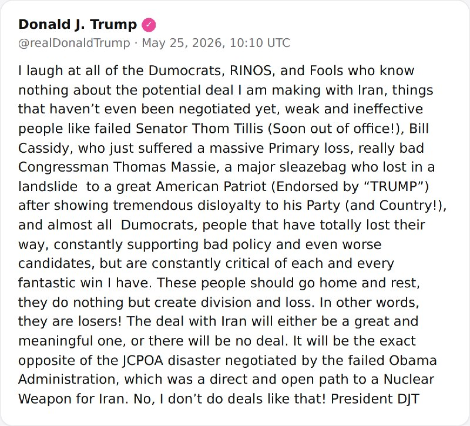

Shin ✓ @hey_itsmyturn Mon, 25 May 2026 10:15:32 UTC President Trump @POTUS: "I laugh at all of the Dumocrats, RINOS, and Fools who know nothing about the potential deal I am making with Iran, things that haven’t even been negotiated yet, weak and ineffective…

## Shin_Persian — post 6213

Shin ✓ @hey_itsmyturn
Mon, 25 May 2026 10:15:32 UTC

President Trump @POTUS:
"I laugh at all of the Dumocrats, RINOS, and Fools who know nothing about the potential deal I am making with Iran, things that haven’t even been negotiated yet, weak and ineffective people like failed Senator Thom Tillis (Soon out of office!), Bill Cassidy, who just suffered a massive Primary loss, really bad Congressman Thomas Massie, a major sleazebag who lost in a landslide to a great American Patriot (Endorsed by “TRUMP”) after showing tremendous disloyalty to his Party (and Country!), and almost all Dumocrats, people that have totally lost their way, constantly supporting bad policy and even worse candidates, but are constantly critical of each and every fantastic win I have. These people should go home and rest, they do nothing but create division and loss. In other words, they are losers! The deal with Iran will either be a great and meaningful one, or there will be no deal. It will be the exact opposite of the JCPOA disaster negotiated by the failed Obama Administration, which was a direct and open path to a Nuclear Weapon for Iran. No, I don’t do deals like that! President DJT"

فارسی

رئیس‌جمهور ترامپ @POTUS:
«من به تمام دموکرات‌های نادان (Dumocrats)، راینوها (RINOs - جمهوری‌خواهان اسمی) و احمق‌هایی که هیچ‌چیز درباره توافق احتمالی من با ایران نمی‌دانند می‌خندم؛ مواردی که هنوز حتی درباره آن‌ها مذاکره هم نشده است. افراد ضعیف و بی‌کفایتی مانند سناتور شکست‌خورده تام تیلیس (که به‌زودی از سمتش برکنار می‌شود!)، بیل کسیدی که همین اواخر شکست سنگینی در انتخابات مقدماتی متحمل شد، کنگره‌منِ واقعاً بد توماس مسی، یک رذل تمام‌عیار که پس از نشان دادن بی‌لیاقتی و بی‌وفایی عظیم به حزب (و کشورش!) با شکستی فاحش در برابر یک میهن‌پرست بزرگ آمریکایی (مورد حمایت "ترامپ") شکست خورد، و تقریباً تمام دموکرات‌های نادان؛ افرادی که کاملاً راهشان را گم کرده‌اند، مدام از سیاست‌های بد و نامزدهای حتی بدتر حمایت می‌کنند، اما به‌طور مداوم از تک‌تک پیروزی‌های شگفت‌انگیز من انتقاد می‌کنند. این افراد باید به خانه بروند و استراحت کنند، آن‌ها کاری جز ایجاد تفرقه و شکست انجام نمی‎دهند. به عبارت دیگر، آن‌ها بازنده هستند! توافق با ایران یا توافقی بزرگ و معنادار خواهد بود یا اصلاً توافقی در کار نخواهد بود. این دقیقاً برعکس فاجعه برجام (JCPOA) خواهد بود که توسط دولت شکست‌خورده اوباما مذاکره شد؛ توافقی که مسیری مستقیم و باز برای رسیدن ایران به سلاح هسته‌ای بود. خیر، من چنین توافق‌هایی نمی‌کنم! پرزیدنت دی‌جی‌تی»

𝕏 · @shin_persian

## ManotoTV — post 105828

  <a href="telegram/content/ManotoTV_105828_1779706800.mp4" target="_blank">🎬 Download video</a>

تماسی از هلند:
«می‌گفت هر روز با برنامه‌های منوتو زندگی می‌کردیم…
و حالا نمی‌دانیم بعد از آن باید چه کنیم.»
او همچنین از جاویدنام سینا حق‌شناس یاد کرد؛ دوستی که خبر جان‌باختنش زندگی او را زیر و رو کرده بو

## ManotoTV — post 105827

  <a href="telegram/content/ManotoTV_105827_1779706802.mp4" target="_blank">🎬 Download video</a>

گفت‌وگو درباره اعتراضات خارج از کشور:
« چه رفتارهایی به همبستگی و رساندن پیام مردم ایران کمک می‌کند؟»

## ManotoTV — post 105826

  <a href="telegram/content/ManotoTV_105826_1779706805.mp4" target="_blank">🎬 Download video</a>

تماسی از اتریش:
«می‌گفت سختی‌ها خیلی‌ها را عوض کرد…
و از کیوان عباسی به‌خاطر حفظ همان نگاه و مسیر همیشگی‌اش قدردانی کرد.»

## FarsiVOA — post 218606

🔺سفر همتی به قطر در سایه پرونده پول‌های بلوکه‌شده

◾️خبرگزاری ایلنا از سفر عبدالناصر همتی، رئیس کل بانک مرکزی جمهوری اسلامی، به قطر خبر داد و نوشت یکی از دلایل سفر همتی به قطر پیگیری آزادسازی منابع ارزی ایران است.

◾️قطر از سال ۲۰۲۳ به یکی از گره‌های اصلی پرونده مالی ایران و آمریکا تبدیل شد؛ زمانی که حدود شش میلیارد دلار از پول‌های ایران که در کره جنوبی مسدود بود، به حساب‌هایی در قطر منتقل شد.

◾️اخیراً و در جریان مذاکرات تهران و واشنگتن، موضوع دارایی‌های مسدودشده جمهوری اسلامی بار دیگر مطرح شد.

◾️قطر هم محل نگهداری بخشی از منابع مسدودشده ایران است، هم کانال میانجی‌گری با آمریکا، هم طرف گفت‌وگو با واشنگتن درباره امنیت تنگه هرمز.

⬇️ بیشتر بخوانید:
https://ir.voanews.com/a/8153581.html

## FarsiVOA — post 218605

  

شی جین‌پینگ، رئیس‌جمهوری چین، در دیدار با شهباز شریف، نخست‌وزیر پاکستان در پکن، از دوستی «ناگسستنی» میان پکن و اسلام‌آباد و همچنین تلاش‌های پاکستان برای پایان جنگ علیه حکومت ایران تمجید کرد.

در این دیدار که روز دوشنبه برگزار شد، عاصم منیر، فرمانده ارتش پاکستان، نیز شریف را همراهی می‌کرد. منیر به‌تازگی برای دستیابی به یک توافق میان تهران و واشنگتن به ایران سفر کرد.

شی روز دوشنبه هنگام استقبال از هیئت پاکستانی گفت: «می‌دانم که شما تازه از ایران بازگشته‌اید و برای صلح کنونی تلاش‌های مثبتی انجام داده‌اید. ما همچنان نقش سازنده‌ای را که پاکستان ایفا کرده است، ارج می‌نهیم.»

خبرگزاری رویترز نوشت که برای پاکستان، درگیر کردن چین در تلاش‌های میانجی‌گرانه‌اش اهمیت زیادی دارد، زیرا پکن و تهران روابط نزدیکی با یکدیگر دارند.

چین و پاکستان در ماه مارس، هم‌زمان با دیدار وزیران خارجه دو کشور در پکن، ابتکار مشترک پنج‌ماده‌ای صادر کردند که در آن خواستار مذاکرات صلح و بازگشت عبور و مرور عادی دریایی در تنگه هرمز شدند؛ آبراهی حیاتی که معمولاً حدود یک‌پنجم نفت و گاز طبیعی مایع جهان از آن عبور می‌کند.
@FarsiVOA

## FarsiVOA — post 218604

  

جوزف عون، رئیس‌جمهوری لبنان، در آستانه دور تازه گفت‌وگوهای مورد حمایت آمریکا با اسرائیل، خروج نیروهای اسرائیلی از جنوب لبنان را مطالبه‌ای «غیرقابل مذاکره» خواند و گفت دولت لبنان این هدف را از مسیر مذاکره دنبال می‌کند.

او گفت روستاهای جنوبی لبنان همچنان زیر فشار حملات و «اشغال تازه» قرار دارند و بیروت این وضعیت را نمی‌پذیرد. مقام‌های اسرائیلی در مقابل می‌گویند تا زمانی که تهدید حزب‌الله رفع نشود، نیروهای اسرائیلی در جنوب لبنان باقی خواهند ماند.

زمینه این موضع، روند تازه‌ای است که با میانجی‌گری دولت دونالد ترامپ آغاز شد. واشنگتن ماه گذشته آتش‌بسی ۱۰روزه میان لبنان و اسرائیل اعلام کرد و ترامپ هم‌زمان از جوزف عون و بنیامین نتانیاهو برای گفت‌وگو در کاخ سفید دعوت کرد.

دورهای قبلی گفت‌وگو در واشنگتن به تمدید آتش‌بس انجامید. بر اساس گزارش رویترز، گفت‌وگوهای ۱۴ و ۱۵ مه با میانجی‌گری آمریکا به تمدید ۴۵روزه آتش‌بس منجر شد و وزارت خارجه آمریکا آن را «سازنده» توصیف کرد.

قرار است پیش از دور سیاسی بعدی در اوایل ژوئن، هیئت‌های نظامی دو طرف روز ۲۹ مه در پنتاگون گفت‌وگو کنند.
@FarsiVOA

## FarsiVOA — post 218603

  

سخنگوی وزارت امور خارجه جمهوری اسلامی از عدم سفر عباس عراقچی، وزیر خارجه، به نیویورک خبر داد و گفت که او در جلسه شورای امنیت سازمان ملل شرکت نمی‌کند.

نشست علنی شورای امنیت سازمان ملل رو ز پنچم خرداد، با حضور وزیران خارجه کشورهای عضو در نیویورک برگزار می‌شود و چین ریاست دوره‌ای این نشست را بر عهده دارد.

پیشتر اسماعیل بقایی، گفته بود که با توجه به ریاست دوره‌ای چین و برنامه این کشور برای برگزاری نشست ویژه وزرای خارجه درباره مباحث مرتبط با صلح و امنیت بین‌المللی، از عباس عراقچی نیز برای حضور در این نشست دعوت شده است.

بقایی در ۳۰ اردیبهشت به صدا و سیمای جمهوری اسلامی گفته بود که مقدمات این سفر در حال انجام است.

اما او در نشست خبری روز چهارم خرداد اعلام کرد که «با توجه به مجموع شرایط»، سفر عراقچی به نیویورک انجام نخواهد شد.
@FarsiVOA

## FarsiVOA — post 218602

🔺حصر دیجیتال ۸۷روزه شد؛ هشدار درباره پنهان‌ماندن اعدام‌ها و ضربه به درآمدهای مالیاتی

◾️نت‌بلاکس، نهاد ناظر بر اختلالات اینترنتی، اعلام کرد محدودیت گسترده اینترنت در ایران وارد هشتادوهفتمین روز پیاپی شده و بیش از دو هزار و ۶۴ ساعت ادامه یافته است.

◾️به گفته این نهاد، وضعیت کنونی شفافیت درباره اعدام‌ها را از میان برده و بلاتکلیفی روزانه زندانیان، مخالفان، منتقدان و بازداشت‌شدگان را تشدید کرده است.

◾️این هشدار در شرایطی مطرح می‌شود که عفو بین‌الملل در گزارشی به تاریخ ۳۱ اردیبهشت ۱۴۰۵ اعلام کرد از زمان آغاز حملات آمریکا و اسرائیل به ایران در ۲۸ فوریه، مقام‌های جمهوری اسلامی دست‌کم ۳۶ نفر را پس از محکومیت در پرونده‌های سیاسی و در پی «محاکمه‌های به‌شدت ناعادلانه» اعدام کرده‌اند.

⬇️ بیشتر بخوانید:
https://ir.voanews.com/a/8153580.html

## FarsiVOA — post 218601

🔺مقام وزارت خارجه جمهوری اسلامی: درباره اورانیوم با غلطت بالا بعد از تفاهم اولیه مذاکره می‌کنیم

◾️یک دیپلمات ارشد جمهوری اسلامی اعلام کرد که در صورت دستیابی به توافق میان تهران و واشنگتن، «موضوع هسته‌ای و غنی‌سازی و ذخایر اورانیوم غنی‌شده با خلوص بالا» در فرصت نهایتاً ۶۰ روزه این توافق بررسی خواهد شد.

◾️پیشتر دونالد ترامپ گفته بود واشنگتن قصد دارد اورانیوم غنی‌شده جمهوری اسلامی را از کنترل تهران خارج کند.

◾️رسانه‌های ایران ادعا کردند مجتبی خامنه‌ای با خارج کردن این مواد هسته‌ای از ایران مخالفت کرده است.

◾️با وجود این، مقام آمریکایی گفت مجتبی خامنه‌ای «چارچوب کلی» توافق را «تأیید کرده» و مسئله فقط این است که چگونه این موضوع را به «تندروها و مردم بفروشند» که معنای تسلیم در برابر خواست آمریکا را ندهد.

⬇️ بیشتر بخوانید:
https://ir.voanews.com/a/8153579.html

## FarsiVOA — post 218600

  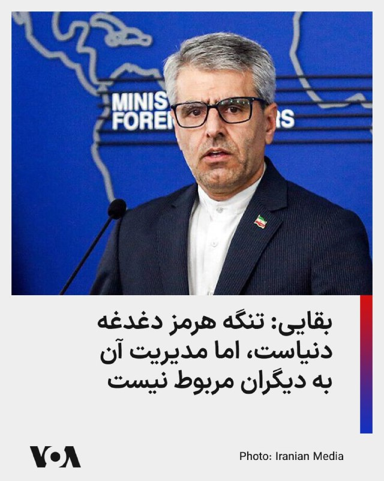

سخنگوی وزارت امور خارجه جمهوری اسلامی گفت امنیت تنگه هرمز «دغدغه کل دنیاست»، اما مدیریت و تدوین سازوکار تردد ایمن در این آبراه بر عهده ایران و عمان است.

اسماعیل بقایی گفت تهران و مسقط در حال تدوین پروتکلی برای اطمینان از عبور ایمن کشتی‌ها هستند و این اقدام را «مسئولانه» و مطابق حقوق بین‌الملل دانست. او با رد تعبیر «عوارض» گفت ایران در پی دریافت عوارض نیست، اما خدماتی مانند ناوبری و حفاظت از محیط زیست تنگه هرمز، خلیج فارس و دریای عمان می‌تواند مستلزم دریافت هزینه باشد.

این موضع در حالی مطرح می‌شود که واشنگتن بارها با هرگونه دریافت «عوارض» یا کنترل یک‌جانبه بر تنگه هرمز مخالفت کرده است. کاخ سفید اعلام کرده بود دونالد ترامپ و شی جین‌پینگ، رئیس جمهوری چین، بر بازگشایی تنگه هرمز و مخالفت با دریافت عوارض از سوی هر کشور یا سازمانی توافق کرده‌اند.

رویترز نیز گزارش داده مارکو روبیو، وزیر خارجه آمریکا، گفته طرحی «نسبتاً محکم» درباره بازگشایی تنگه هرمز روی میز است، اما اگر مذاکرات با ایران شکست بخورد، واشنگتن «راه دیگری» را دنبال خواهد کرد.
@FarsiVOA

## FarsiVOA — post 218599

  

رسانه‌های داخلی از برگزاری جلسه حضوری مجلس شورای اسلامی پس از ۹۷ روز تعطیلی خبر داده و اعلام کردند که محمدباقر قالیباف، برای هفتمین سال به عنوان رئيس مجلس شورای اسلامی انتخاب شد.

آخرین جلسه حضوری مجلس در ۲۸ بهمن ۱۴۰۴، تقریباً دو هفته پیش از درگیری نظامی، برگزار شده بود و جلسه روز چهارم خرداد، به صورت حضوری و با هدف برگزاری انتخابات هیات رئیسه تشکیل شده است.

قالیباف برای نشستن دوباره بر صندلی ریاست مجلس، رقیب جدی نداشت و باید با محمدتقی نقدعلی، نماینده خمینی‌شهر و عثمان سالاری، نماینده تربت‌جام رقابت می‌کرد.

با اوج‌گیری تنش‌های نظامی در منطقه، قالیباف همزمان به عنوان رئيس هیئت‌ مذاکره کننده جمهوری اسلامی با آمریکا و همچنین نماینده ویژه جمهوری اسلامی در امور چین نیز فعالیت می‌کند.
@FarsiVOA

## FarsiVOA — post 218598

  

ارتش اسرائیل به ساکنان ۱۰ منطقه شامل شهر و روستا در جنوب لبنان هشدار داد که پیش از حملات هوایی علیه مواضع گروه حزب‌الله لبنان، این مناطق را تخلیه کنند.

ارتش اسرائیل صبح دوشنبه با انتشار بیانیه‌ای اسامی این مناطق را اعلام کرد و گفت که به ساکنان دستور داده شده است دست‌کم یک کیلومتر از محل سکونت خود فاصله بگیرند.

سرهنگ آویخای ادرعی، سخنگوی ارتش، هشدار داده است: «در پی نقض توافق آتش‌بس توسط سازمان تروریستی حزب‌الله، ارتش ناچار است با قدرت علیه آن اقدام کند و قصد آسیب رساندن به شما را ندارد.»

او افزود: «هر کسی که در نزدیکی عناصر حزب‌الله و تأسیسات و ابزارهای نظامی آن‌ها باشد، جان خود را در معرض خطر قرار می‌دهد.»

مارکو روبیو، وزیر خارجه آمریکا روز دوشنبه در جریان سفر به هند گفت: «اسرائیل همیشه حق دارد از خود دفاع کند. هر کشوری در جهان چنین حقی دارد. بنابراین اگر حزب‌الله قرار است به سوی آن‌ها موشک شلیک کند یا موشک شلیک می‌کند، اسرائیل کاملاً حق دارد به آن پاسخ دهد یا از وقوع آن جلوگیری کند.»
@FarsiVOA

## FarsiVOA — post 218597

  

تلویزیون پاکستان گزارش داد که عاصم منیر، فرمانده ارتش پاکستان و میانجی اصلی مذاکرات جمهوری اسلامی و آمریکا، در جریان سفر رسمی شهباز شریف به چین، در پکن کنار نخست‌وزیر پاکستان حاضر شده و در گفت‌وگو با مقام‌های چینی شرکت کرده است.

شهباز شریف سفر رسمی چهارروزه خود به چین را روز شنبه از هانگژو آغاز کرده بود، اما تصاویر پخش‌شده از تلویزیون دولتی پاکستان نشان می‌دهد که عاصم منیر نیز در پکن در کنار او با رهبران چین دیدار کرده است.

بر اساس این گزارش، شریف در حضور عاصم منیر به مقام‌های چینی گفت پاکستان برای میانجی‌گری میان جمهوری اسلامی و آمریکا «نقشی صادقانه» ایفا کرده و از حمایت چین برای پیشبرد صلح قدردانی کرد.

عاصم منیر روزهای جمعه و شنبه در تهران بود و این سفر بخشی از تلاش‌های میانجی‌گرانه پاکستان برای پایان رسمی جنگ ایران عنوان شده است. حضور او در پکن، بلافاصله پس از رایزنی‌های تهران، نشان می‌دهد اسلام‌آباد تلاش دارد میانجی‌گری خود میان تهران و واشنگتن را با هماهنگی نزدیک‌تر با چین پیش ببرد.
@FarsiVOA

## FarsiVOA — post 218596

  

ارتش اسرائیل اعلام کرد هشدار مربوط به احتمال نفوذ پهپاد در منطقه عرب العرامشه در شمال اسرائیل پایان یافته و دیگر تهدید فوری شناسایی نمی‌شود.

به گزارش تایمز اسرائیل، آژیرها دقایقی پیش در این منطقه به صدا درآمده بود. ارتش اسرائیل می‌گوید یک «هدف هوایی مشکوک» شناسایی شد، اما بعداً تماس سامانه‌های رصد با آن از دست رفت؛ موضوعی که می‌تواند به خروج پهپاد از منطقه تحت پایش یا سقوط آن مربوط باشد.

براساس اعلام ارتش اسرائیل، این رویداد بدون گزارش زخمی پایان یافته است.
@FarsiVOA

## FarsiVOA — post 218595

🔺اکسیوس: ترامپ خواستار پیوستن کشورهای عرب به توافق ابراهیم پس از پایان جنگ شد

◾️اکسیوس گزارش داد دونالد ترامپ از رهبران چند کشور عربی خواسته است اگر توافقی برای پایان جنگ با جمهوری اسلامی حاصل شود، به روند توافق ابراهیم بپیوندند و روابط خود را با اسرائیل عادی کنند.

◾️بر اساس این گزارش، تماس ترامپ با رهبران عربستان، امارات، قطر، پاکستان، ترکیه، مصر، اردن و بحرین انجام شد و محور اصلی آن توافق در حال شکل‌گیری با جمهوری اسلامی بود.

◾️یک مقام آمریکایی به اکسیوس گفته است که رهبران حاضر در تماس روز شنبه اعلام کرده‌اند در صورت موفقیت یا شکست توافق، در کنار واشنگتن خواهند بود.

⬇️ بیشتر بخوانید:
https://ir.voanews.com/a/8153577.html

## FarsiVOA — post 218594

  

بلومبرگ گزارش داد یک خریدار کشتی‌های فرسوده گفته وزارت خزانه‌داری آمریکا اجازه داده چهار شناور تحریمی مرتبط با حمل محموله‌های ایران برای اوراق خریداری شوند.

بر اساس گزارش‌ها، شرکت جی‌ام‌اس مستقر در دبی، مجوز خرید چهار کشتی یوگی، تیمون، رانتانپلن و بیگلی را دریافت کرده است؛ شناورهایی که به شبکه کشتیرانی مرتبط با محمدحسین شمخانی نسبت داده شده‌اند. این شبکه از سوی آمریکا به انتقال نفت و کالاهای مرتبط با ایران متهم شده است.

این تصمیم در حالی گرفته شده که وزارت خزانه‌داری آمریکا اخیراً در چارچوب فشار حداکثری تازه، ۱۹ کشتی و بیش از ۵۰ فرد و شرکت مرتبط با تجارت نفت و پتروشیمی ایران را تحریم کرده بود.

مالکان ناشناس این کشتی‌ها می‌توانند از ارزش آهن‌قراضه آنها میلیون‌ها دلار دریافت کنند و واشنگتن می‌گوید خروج کنترل‌شده کشتی‌های فرسوده از «ناوگان سایه» می‌تواند ریسک‌های ایمنی و زیست‌محیطی را کاهش دهد.
@FarsiVOA

## FarsiVOA — post 218593

  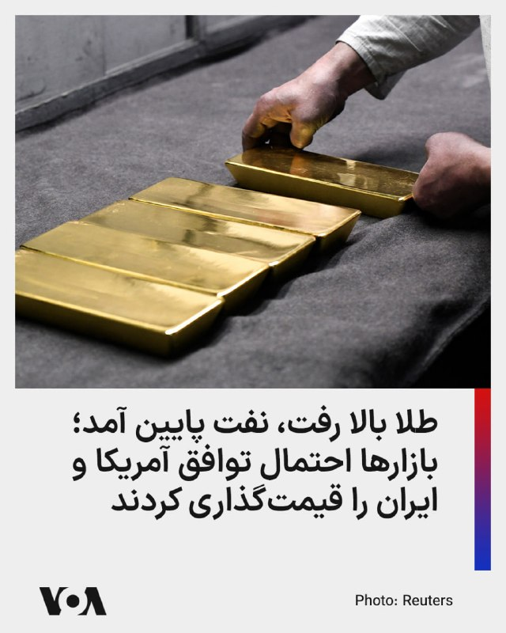

قیمت طلا روز دوشنبه همزمان با افت دلار و کاهش شدید بهای نفت افزایش یافت؛ نشانه‌ای از بازاری که هنوز میان امید به توافق آمریکا و جمهوری اسلامی و تردید درباره پایداری آن در نوسان است.

رویترز گزارش داد بهای هر اونس طلا بیش از یک درصد بالا رفت و به حدود ۴ هزار و ۵۵۹ دلار رسید. تضعیف دلار، خرید طلا را برای دارندگان ارزهای دیگر ارزان‌تر کرد و افت نفت نیز بخشی از نگرانی‌های تورمی را کاهش داد.

همزمان، نفت برنت حدود ۶ درصد سقوط کرد و به محدوده ۹۸ دلار رسید؛ نفت خام آمریکا نیز به حدود ۹۱ دلار کاهش یافت. علت اصلی افت نفت، امید بازار به پیشرفت در توافقی است که می‌تواند مسیر تنگه هرمز و صادرات انرژی خلیج فارس را تا حدی باز کند.

با این حال، رشد طلا نشان می‌دهد سرمایه‌گذاران هنوز پایان بحران را قطعی نمی‌دانند.
@FarsiVOA

## FarsiVOA — post 218592

🔺مقام ارشد آمریکا: ایران پشت‌پرده برای واگذاری اورانیوم غنی‌شده، تعهد داده است

◾️یک مقام ارشد دولت ترامپ اعلام کرد رژیم ایران «پشت‌پرده» تعهداتی در زمینه واگذاری اورانیوم غنی‌شده داده و جمهوری اسلامی بدون اجرای این تعهدات، دستاورد چندانی از مذاکرات نخواهد داشت.

◾️به گزارش نیویورک‌پست، این مقام آمریکایی که با خبرنگاران صحبت می‌کرد، درباره روند مذاکرات برای دستیابی به یک توافق احتمالی با تهران گفت: «۹۵ درصد کار انجام شده، اما در سیستم آن‌ها حتی تغییر واژه‌ها هم مستلزم چند روز بررسی و مشورت است.»

◾️این منبع ارشد دست‌کم دو بار برای خبرنگاران توضیح داد که توافق قریب‌الوقوع نیست و قرار نیست انتقال پول نقد شبیه انتقال پول نقد به ایران در سال ۲۰۱۶ در دوران باراک اوباما رخ دهد.

⬇️ بیشتر بخوانید:
https://ir.voanews.com/a/8153576.html

## FarsiVOA — post 218591

  

ارتش اسرائیل اعلام کرد نیروهای این کشور در جریان عملیاتی در جنوب، لؤی هشام محمود بصل، عضو سازمان تروریستی حماس را که در حمله به پایگاه زیکیم در جریان کشتار هفتم اکتبر نقش داشت، از پا درآوردند.

بر اساس اعلام ارتش اسرائیل، بصل به‌عنوان تک‌تیرانداز در گردان زیتون حماس فعالیت می‌کرد و در روزهای اخیر نیز برای اجرای حملات تروریستی علیه نیروهای اسرائیلی در منطقه برنامه‌ریزی می‌کرد.

ارتش اسرائیل گفته است این عملیات برای رفع یک تهدید فوری انجام شده و نیروهای این کشور در چارچوب توافق موجود در منطقه مستقر هستند و به مقابله با هرگونه تهدید فوری ادامه خواهند داد.
@FarsiVOA

## DW_Farsi — post 125125

  

🔸 چهار متهم پرونده اکباتان به اعدام محکوم شدند

ارگان خبری مجموعه فعالان حقوق بشر در ایران (هرانا) گزارش داد که شعبه ۱۵ دادگاه انقلاب تهران به ریاست ابوالقاسم صلواتی، چهار متهم پرونده اکباتان تهران و از بازداشت شدگان اعتراضات سراسری ۱۴۰۱، به نام‌های میلاد آرمون، نوید نجاران، مهدی ایمانی و محمدمهدی حسینی را به اتهام "محاربه" به اعدام محکوم کرده است.

صدور این حکم علیه این چهار جوان در حالی است که پیش‌تر احکام اعدام صادرشده از سوی دادگاه کیفری به اتهام مشارکت در قتل عمد، از سوی دیوان عالی کشور رد شده و پس از بررسی مجدد در شعبه بدوی به حبس و پرداخت دیه تغییر کرده بود.

آنگونه که هرانا نوشته، امیرمحمد خوش‌اقبال، علیرضا برمرز پورناک، علیرضا کفایی و حسین نعمتی دیگر متهمان این پرونده نیز هرکدام به پنج سال زندان از بابت اتهام اجتماع و تبانی، دوسال حبس از بابت تبلیغ علیه نظام، دو سال منع فعالیت در فضای مجازی و دو سال منع اسکان در تهران و البرز محکوم شده‌اند.
@dw_farsi

## DW_Farsi — post 125124

  

🔶 سومین نفتکش حامل گازمایع قطر از طریق تنگه هرمز در مسیر چین است

داده‌های ردیابی کشتی‌ها در روز جمعه ۲۲ مه (۱ خرداد) نشان داد که سومین نفتکش حامل گاز طبیعی مایع قطر در حال عبور از تنگه هرمز و حرکت به سمت چین است.

این در شرایطی است که یک تیم مذاکره‌کننده قطری برای کمک به دستیابی به توافقی برای پایان دادن به جنگ با ایران وارد تهران شده است.

ارسال محموله‌ها از طریق این آبراه مهم بین‌المللی همچنان نامنظم است و این سومین ترانزیت یک تانکر گاز مایع قطری تقریباً دو هفته پس از عبور اولین محموله از این تنگه تحت توافق ایران و پاکستان به شمار می‌رود.

طبق داده‌های کشتیرانی LSEG، این کشتی با نام السهله، با ظرفیت ۲۱۱ هزار و ۲۸۴ متر مکعب، منطقه رأس لفان در قطر را ترک کرده و انتظار می‌رود در روز شنبه ۱۴ ژوئن (۲۴ خرداد)‌ به ترمینال گاز مایع تیانجین چین برسد.

به گفته این منابع، ایران اجازه عبور این محموله را برای کمک به ایجاد اعتماد میان قطر و پاکستان که در حال میانجیگری در مذاکرات صلح هستند، صادر کرده است.
@dw_farsi

## DW_Farsi — post 125123

  

🔶 ایران می‌گوید علیرغم پیشرفت، توافق با آمریکا "قریب‌الوقوع" نیست

اسماعیل بقایی، سخنگوی وزارت امور خارجه ایران، روز دوشنبه ۴ خرداد (۲۵ مه) هشدار داد که با وجود پیشرفت تهران و واشنگتن در "بخش بزرگی از مسائل" در تبادلاتشان، توافق با ایالات متحده برای پایان دادن به جنگ "قریب‌الوقوع" نیست.

مارکو روبیو، وزیر امور خارجه ایالات متحده، پیش از این گفته بود که توافق می‌تواند "امروز" [دوشنبه چهارم خرداد] محقق شود.

بقایی تصریح کرد: «در بخش زیادی از موضوعات مورد گفت‌وگو، ما به یک جمع‌بندی رسیده‌ایم و این یک امر درستی است ولی این‌که بخواهیم بگوییم امضای توافق قریب الوقوع است، کسی نمی‌تواند چنین ادعایی بکند.»

سخنگوی وزارت امور خارجه ایران همچنین با تاکید بر اینکه تمرکز مذاکرات بر "خاتمه جنگ" است گفت: «در این مرحله درباره جزئیات موضوع هسته‌ای صحبتی نداریم.»

بقایی افزود: «تهدیدها، فشارها، کاریکاتور منتشر کردن بخشی از سیاست‌ورزی در آن طرف دنیاست. ما کار خود را در میدان عمل دنبال می‌کنیم.»
@dw_farsi

## DW_Farsi — post 125122

  

🔶 "مصادره اموال و اخراج هزاران شیعه پاکستانی" از امارات در جنگ ایران

خبرگزاری رویترز در گزارشی نوشت"هزاران شیعه" پاکستانی در طول جنگ ایران از امارات متحده عربی به پاکستان اخراج شده‌‌اند. به نوشته رویترز این امر باعث نگرانی جامعه شیعیان پاکستان شده و دیده‌بان حقوق بشر را بر آن داشته است تا در این مورد تحقیق کند.

رویترز اسناد مهاجرت، ویزا و جزئیات پرواز ۱۰۳ پاکستانی را که گفته بودند شیعه اخراج شده هستند، بررسی و با ۲۴ نفر از آنها مصاحبه کرده است. مصاحبه‌شوندگان گفته‌اند که پیش از سوار شدن به هواپیما حتی نتوانسته‌اند چمدان یا پس‌انداز خود را پس بگیرند.

بانک اطلاعاتی که توسط سازمان سیاسی شیعه پاکستانی "مجلس وحدت مسلمین" گردآوری شده و توسط رویترز مشاهده شده است، نشان می‌دهد ۷ هزار و ۵۰۰ شیعه پاکستانی از ۲۸ فوریه (۹ اسفند ۱۴۰۴)، همزمان با آغاز حمله آمریکا و اسرائیل به ایران، از این کشور عربی حاشیه خلیج فارس اخراج شده‌اند.
@dw_farsi

## DW_Farsi — post 125121

🔶 گزارش سیپری؛ ماموریت‌های صلح در تنگنای بودجه و نیروی انسانی

سال ۲۰۲۵ سال خوبی برای ماموریت‌های بین‌المللی صلح نبوده است. طبق گزارش جدید مؤسسه پژوهش‌های صلح استکهلم "سیپری" (SIPRI)، شمار این مأموریت‌ها اندکی کاهش یافته است. در حدود ۲۵ سال گذشته، هرگز شمار نیروهای بین‌المللی فعال در عرصه صلح تا این اندازه کم نبوده است.

تا پایان ماه دسامبر گذشته، مجموعاً نزدیک به ۷۹ هزار نفر در این مأموریت‌ها حضور داشتند؛ رقمی که شامل نیروهای نظامی، نیروهای پلیس و کارکنان غیرنظامی می‌شود. بر اساس این گزارش، تنها طی ده سال گذشته شمار آنها تقریباً به نصف کاهش یافته است.

کلودیا فایفر کروز، پژوهشگر مؤسسه سیپری، به کانال اول تلویزیون آلمان (ARD) گفته است که دلایل مختلفی برای این وضعیت وجود دارد.

به گزارش کانال اول تلویزیون آلمان، در شورای امنیت سازمان ملل، قدرت‌های دارای حق وتو بیش از پیش مانع یکدیگر می‌شوند و در سازمان‌های منطقه‌ای مانند اتحادیه آفریقا نیز مشکلات مشابهی وجود دارد.

افزون بر این، سازمان‌های بین‌المللی مانند سازمان ملل متحد نیز با کمبود بودجه روبه‌رو هستند؛ به‌گونه‌ای‌که در سال ۲۰۲۵ بیش از دو میلیارد دلار کسری بودجه داشته‌اند.

طبق همین گزارش، دیگر کشورهای بزرگ تأمین‌کننده بودجه این مأموریت‌ها، از جمله چین، نیز یا سهم خود را پرداخت نکرده‌اند یا با تأخیر پرداخت کرده‌اند. در نتیجه، تمامی ماموریت‌های سازمان ملل به‌ناچار فعالیت‌های خود را محدود و شمار کارکنانشان را کاهش داده‌اند.

📌 برای دسترسی کامل به گزارش به وبسایت دویچه‌وله فارسی مراجعه کنید.
@dw_farsi

## DW_Farsi — post 125120

  

🔶 محمدباقر قالیباف برای هفتمین بار رئیس مجلس شورای اسلامی شد

محمدباقر قالیباف در انتخابات هیئت رئیسه مجلس شورای اسلامی که صبح روز دوشنبه ۴ خرداد (۲۵ مه) برگزار شد، برای هفتمین سال متوالی به عنوان رئیس مجلس انتخاب شد.

قالیباف ۶۴ ساله، به عنوان سیاستمداری با نفوذ در ساختار سپاه پاسداران انقلاب اسلامی شناخته می‌شود. به ویژه پس از کشته شدن علی خامنه‌ای، علی لاریجانی و شمار دیگری از مقامات ارشد جمهوری اسلامی و تغییر ساختار قدرت، نام او به عنوان یکی از تصمیم‌گیران اصلی در پیشبرد سیاست‌های نظام و مذاکره با آمریکا مطرح شده است.

محمدباقر قالیباف بارها برای انتخابات ریاست جمهوری نامزد شد. او در سال ۱۳۸۴ نامزد شد اما از محمود احمدی‌نژاد شکست خورد. پس از آن به عنوان شهردار تهران منصوب شد و از سال ۱۳۸۴ تا ۱۳۹۶ این سمت را در اختیار داشت.

او در سال ۱۳۹۲ بار دیگر نامزد انتخابات ریاست جمهوری شد اما از حسن روحانی شکست خورد و در سال ۹۶ نیز پیش از برگزاری انتخابات به نفع ابراهیم رئیسی کناره‌گیری کرد.

نام قالیباف با فسادهای مالی خود و خانواده‌اش و نقش او در سرکوب جنبش‌های سیاسی و مدنی در ایران نیز گره خورده است.
@dw_farsi

## DW_Farsi — post 125119

  

🔶 لیندزی گراهام از ترامپ خواست در توافق با ایران به تعهداتش "پایبند" باشد

لیندزی گراهام، سناتور جمهوری‌خواه از ایالت کارولینای جنوبی، روز یکشنبه ۲۴ مه (۳ خرداد) از دونالد ترامپ، رئیس‌جمهور آمریکا، خواست تا در حالی که واشنگتن به تلاش برای نهایی کردن توافق با تهران بر سر جنگ ادامه می‌دهد، ثابت قدم بماند.

گراهام در پستی در شبکه اجتماعی ایکس نوشت: «اگر در واقع، در نتیجه این مذاکرات برای پایان دادن به درگیری با ایران، متحدان عرب و مسلمان ما در منطقه با پیوستن به پیمان ابراهیم موافقت کنند، این توافق‌نامه به یکی از مهم‌ترین توافق‌نامه‌ها در تاریخ خاورمیانه تبدیل خواهد شد.»

گراهام همچنین به اظهارات قبلی ترامپ در مورد پیوستن عربستان سعودی، قطر و پاکستان به پیمان ابراهیم اشاره کرد و پیشنهاد او را "فراتر از یک تغییر اساسی برای منطقه و جهان" خواند. او گفت: «این یک اقدام درخشان از سوی رئیس‌ جمهور ترامپ است.»

گراهام خطاب به ترامپ نیز نوشت: «رئیس جمهور ترامپ، برای رسیدن به یک توافق خوب با ایران، به مواضع خود پایبند باشید.»
@dw_farsi

## DW_Farsi — post 125118

  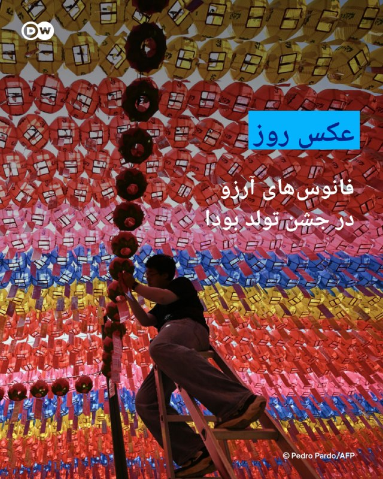

📸عکس روز: فانوس‌های آرزو در جشن تولد بودا

همزمان با جشن تولد بودا، فانوس‌های رنگارنگ در معبد "جوگیه" در شهر سئول روشن شده‌اند. در این آیین سنتی، به هرکدام از فانوس‌ها کارتی همراه با آرزوهای پیروان بودا آویزان شده که نمادی از امید، آرامش و دعا برای آینده است.
جشن تولد بودا یکی از مهم‌ترین مناسبت‌های مذهبی در کره‌جنوبی به شمار می‌رود و هر سال هزاران نفر را به معابد تاریخی این کشور می‌کشاند.
@dw_farsi

## DW_Farsi — post 125117

  

🔶 تهدید ایران به شکستن محاصره دریایی تنگه هرمز و خروج از ان‌پی‌تی

محسن رضایی، مشاور نظامی مجتبی خامنه‌ای، روز یکشنبه سوم خرداد (۲۴ مه) گفت که مدیریت تنگه هرمز "حق قانونی" تهران برای تضمین امنیت ملی است. او مدعی شد: «مدیریت ایران بر تنگه هرمز به ۵۰ سال ناامنی در خلیج فارس پایان می‌دهد.»

رضایی، که تحت تحریم‌های ایالات متحده قرار دارد، همچنین گفت که ایران "دلایل محکمی" برای حفظ کنترل تنگه دارد و ادعا کرد که هدف تهران جلوگیری از تبدیل شدن خلیج فارس به مرکزی برای استقرار نظامی و بی‌ثباتی است.

اظهارات محسن رضایی روز یکشنبه توسط خبرگزاری مهر، نزدیک به سپاه پاسداران، منتشر شد.

در همین حال، ابراهیم ذوالفقاری، سخنگوی قرارگاه خاتم الانبیاء، هشدار داد که اگر تنگه هرمز مورد حمله قرار گیرد، نیروهای نظامی جمهوری اسلامی محاصره بنادر ایران توسط ایالات متحده را خواهند شکست.

ذوالفقاری همچنین تهدید به "خروج ایران از پیمان منع گسترش سلاح‌های هسته‌ای" کرد. او گفت: «اگر دشمن به تنگه هرمز حمله کند، ما محاصره دریایی را خواهیم شکست و ممکن است از پیمان منع گسترش سلاح‌های هسته‌ای (ان‌پی‌تی) خارج شویم.»
@dw_farsi

## DW_Farsi — post 125116

  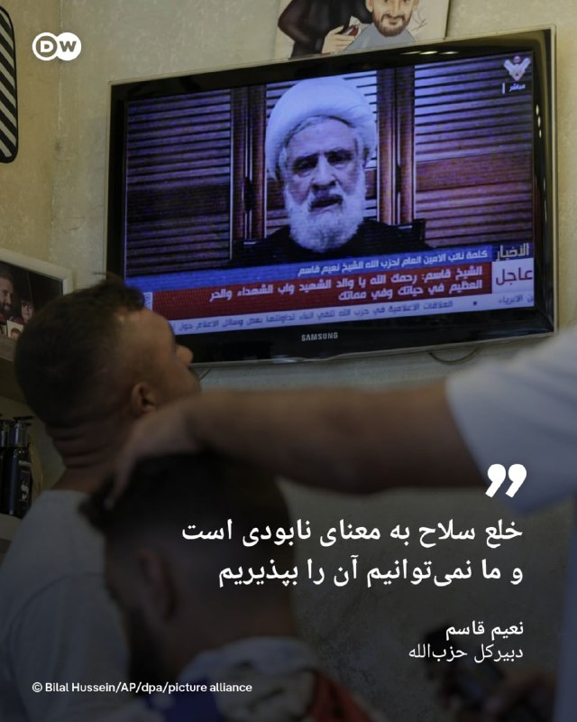

🔶 نعیم قاسم: خلع سلاح به معنای نابودی است و ما نمی‌توانیم آن را بپذیریم

نعیم قاسم، دبیرکل حزب‌الله، در یک سخنرانی به مناسبت "روز مقاومت و آزادسازی" که یادآور عقب‌نشینی نیروهای ارتش اسرائیل از اشغال جنوب لبنان در ۲۵ مه ۲۰۰۰ است، درخواست خلع سلاح این گروه را محکوم کرد.

او گفت: «چیزی به نام انحصار سلاح یا خلع سلاح حزب‌الله وجود ندارد.»

قاسم همچنین افزود، خلع سلاح حزب‌الله "توان دفاعی لبنان و توان مقاومت و مردم آن را به عنوان مقدمه‌ای برای نابودی" از بین می‌برد. او افزود: «خلع سلاح به معنای نابودی است و این چیزی است که ما نمی‌توانیم بپذیریم.»

نعیم قاسم همچنین ضمن برشمردن چندین حمله به سربازان ارتش اسرائیل، از پهپادهای انتحاری دید اول شخص (FPV) حزب‌الله که به گفته او باعث "گیج‌شدن" اسرائیل شده‌اند، تمجید کرد. او ادعا کرد که این حملات منجر به کشته شدن چندین افسر اسرائیلی شده است، در حالی که ارتش اسرائیل اعلام کرده است که آنها زخمی شده‌اند.

دبیرکل حزب‌الله همچنین ایالات متحده را محکوم کرد و گفت که این کشور نه میانجی است و نه بازیگری صادق، زیرا "اسرائیل را بر اساس منافع خود مدیریت می‌کند".
@dw_farsi

## DW_Farsi — post 125115

  

🔶 بالا نگه داشتن سطح هشدار ارتش اسرائیل همزمان با کاهش نیروهای ذخیره

در بحبوحه انتشار اخبار لحظه به لحظه در مورد "پیشرفت" مذاکرات بین ایالات متحده و ایران، افسران ارشد ارتش اسرائیل روز یکشنبه ۲۴ ماه (۳ خرداد) تأیید کردند که چندین شاخه از ارتش، تعداد سربازان ذخیره را در ستاد کل کاهش داده‌اند.

به گزارش "جروزالم پست" برخی از افسران پیامی دریافت کردند مبنی بر اینکه باید "نسبت به هرگونه درخواست برای بازگشت به خدمت هوشیار و گوش به زنگ باشند"، اما مجبور نیستند به ستاد بیایند.

شلومی بیندر، رئیس اداره اطلاعات ارتش اسرائیل، هدایت عملیات جمع‌آوری اطلاعات برای ایجاد تصویری روشن از تلاش‌های ایران برای بازسازی قابلیت‌های نظامی آسیب‌دیده‌اش را بر عهده دارد.

طبق این گزارش، افسران ارشد ارتش اسرائیل ادعا می‌کنند که بنا بر ارزیابی آنها، رده سیاسی اسرائیل از هسته مذاکرات ایالات متحده و ایران کنار گذاشته شده است.

در شرایط کنونی و با وجود سیگنال‌های متناقض طرفین، مشخص نیست که آیا واقعاً پیشرفتی در مذاکرات حاصل شده است یا اینکه هرکدام از طرفین صرفا در تلاش برای افزایش فشار بر طرف مقابل است.
@dw_farsi

## DW_Farsi — post 125114

  

🔶 کاهش قیمت نفت به دنبال چشم‌اندازی برای توافق آمریکا با ایران

امیدها برای دستیابی به یک توافق صلح بین ایالات متحده و ایران، قیمت نفت را به پایین‌ترین سطح خود در بیش از دو هفته گذشته رسانده است.

نفت خام برنت دریای شمال با ۴.۵۵ درصد کاهش به ۹۸.۸۳ دلار در هر بشکه رسید، در حالی که نفت خام وست تگزاس اینترمدیت (WTI) با ۴.۷۳ درصد کاهش به ۹۲.۰۳ دلار رسید. این نرخ پایین‌ترین سطح از ۷ مه (۱۷ اردیبهشت) تا کنون است. با این حال، چشم‌انداز توافق سریع پس از سیگنال‌های متناقض از سوی واشنگتن همچنان نامشخص است.

کارشناسان پیش‌بینی می‌کنند که بحران انرژی ناشی از جنگ ایران ادامه خواهد یافت.

یکی از موضوعات مورد اختلاف، همچنان حاکمیت بر تنگه هرمز است؛ آبراهی کلیدی که از طریق آن پیش از جنگ یک پنجم نفت و گاز مایع جهان منتقل می‌شد. رئیس شرکت ملی نفت ابوظبی هفته گذشته هشدار داد که حتی در صورت پایان فوری جنگ، ترافیک کشتیرانی در این تنگه حداقل تا سال ۲۰۲۷ به سطح عادی خود باز نخواهد گشت.
@dw_farsi

## DW_Farsi — post 125113

  

🔶 سی‌بی‌اس: مجتبی خامنه‌ای از طریق شبکه‌ای از پیام‌رسان‌ها ارتباط برقرار می‌کند

مقامات آمریکایی به نقل از نهادهای اطلاعاتی آمریکا به شبکه تلویزیونی "سی‌بی‌اس" گفتند که مجتبی خامنه‌ای، رهبر جمهوری اسلامی، در مکانی مخفی پنهان شده و از طریق شبکه‌ای پیچیده از پیام‌رسان‌ها ارتباط برقرار می‌کند.

این گزارش می‌گوید اقدامات احتیاطی که برای جلوگیری از ترور خامنه‌ای توسط اسرائیل در نظر گرفته شده، باعث تأخیر در مذاکرات آمریکا و ایران برای پایان دادن به جنگ می‌شود. گزارش می‌افزاید که حتی مقامات ارشد جمهوری اسلامی نیز نمی‌توانند مستقیماً با مجتبی خامنه‌ای تماس بگیرند.

یک مقام آمریکایی به این شبکه گفت: «به همین دلیل است که می‌بینید افرادی چیزهایی مانند "رهبر معظم انقلاب با چارچوب موافقت کرده است" یا "ما منتظر شنیدن نظرات در مورد نکات نهایی توافق هستیم"، می‌گویند. هر اطلاعاتی که او دریافت می‌کند، تاریخ‌دار است و پاسخ‌های او با تأخیر زیادی همراه است.»
@dw_farsi

## DW_Farsi — post 125112

🔶 جام ۱۹۸۲؛ زیکو، "جوجه‌ای" که به "پله سفید" شهرت یافت

🔺 گزارشی از شهرام احدی

در تاریخ جام جهانی فوتبال بازندگانی بوده‌اند که بخت با آنان یار نبوده و برخلاف آنچه که شاید سزاوار آن بوده باشند، از دور مسابقات حذف شده‌اند:

ناکامی مجارستان در برابر آلمان در فینال جام جهانی ۱۹۵۴، شکست آلمان‌ها در برابر لاجوردی‌های ایتالیا در نیمه‌نهایی ۱۹۷۰ مکزیک و ناکامی فرانسویان در سال‌های ۱۹۸۲ و ۱۹۸۶ در مقابل آلمان در مرحله نیمه‌نهایی، نمونه‌هایی از این دست هستند.

اما شاید ناکامی یک تیم تلخ‌تر و ناسزاوارتر از همه بوده باشد: خداحافظی غمگین رقصندگان برزیل از جام جهانی ۱۹۸۲.

زیکو و یارانش که در مرحله‌ی دوم، آرژانتین و ستاره‌اش مارادونا را ۳ بر یک به زانو درآورده بودند، در بازی بعدی‌شان تنها به تساوی در برابر ایتالیا نیاز داشتند. آنان در دقیقه ۶۸ به گل تساوی دست یافتند و به جای آنکه در پی حفظ نتیجه برآیند، به حملات و هنرنمایی‌های خود ادامه دادند.

گل پائولو روسی، مهاجم زهردار ایتالیا، در دقیقه ۷۵ اما رویای فوتبال‌دوستان را که شیفته زیبایی بازی برزیل شده بودند، نقش بر آب کرد.

📌 برای دسترسی کامل به گزارش به وبسایت دویچه‌وله فارسی مراجعه کنید.
@dw_farsi

## Persian_Trend_Official — post 14928

  <a href="telegram/content/Persian_Trend_Official_14928_1779706823.webm" target="_blank">🎬 Download video</a>

من به تمام دموکرات‌های احمق، جمهوری‌خواهان ظاهری و نادان‌هایی که هیچ چیزی درباره توافق احتمالی‌ای که با ایران در حال انجامش هستم نمی‌دانند می‌خندم؛ چیزهایی که حتی هنوز مذاکره هم نشده‌اند. افراد ضعیف و بی‌اثری مثل سناتور شکست‌خورده تام تیلیس (که به‌زودی از کار برکنار می‌شود!)، بیل کسیدی که تازه یک شکست سنگین در انتخابات مقدماتی خورده، و نماینده واقعاً افتضاح، توماس مَسی، یک آدم کثیف واقعی که پس از خیانت بزرگ به حزبش (و کشورش!) با اختلاف سنگین به یک میهن‌پرست بزرگ آمریکایی (که مورد حمایت «ترامپ» بود) باخت؛ و تقریباً تمام دموکرات‌ها، افرادی که کاملاً راهشان را گم کرده‌اند، مدام از سیاست‌های بد و نامزدهای حتی بدتر حمایت می‌کنند، اما دائماً از تک‌تک پیروزی‌های فوق‌العاده من انتقاد می‌کنند.

این افراد باید به خانه بروند و استراحت کنند؛ آن‌ها هیچ کاری جز ایجاد تفرقه و شکست انجام نمی‌دهند. به زبان ساده، آن‌ها بازنده‌اند!

توافق با ایران یا یک توافق بزرگ و معنادار خواهد بود، یا اصلاً توافقی در کار نخواهد بود. این توافق دقیقاً برعکس فاجعه برجام خواهد بود که توسط دولت شکست‌خورده اوباما مذاکره شد؛ توافقی که یک مسیر مستقیم و آشکار برای دستیابی ایران به سلاح هسته‌ای بود.

نه، من چنین توافق‌هایی انجام نمی‌دهم!

رئیس‌جمهور DJT

🫆:Tony

📌 @persian_trend_official
پرشین ترند | متفاوت‌ترین کانال نظامی

## Persian_Trend_Official — post 14927

  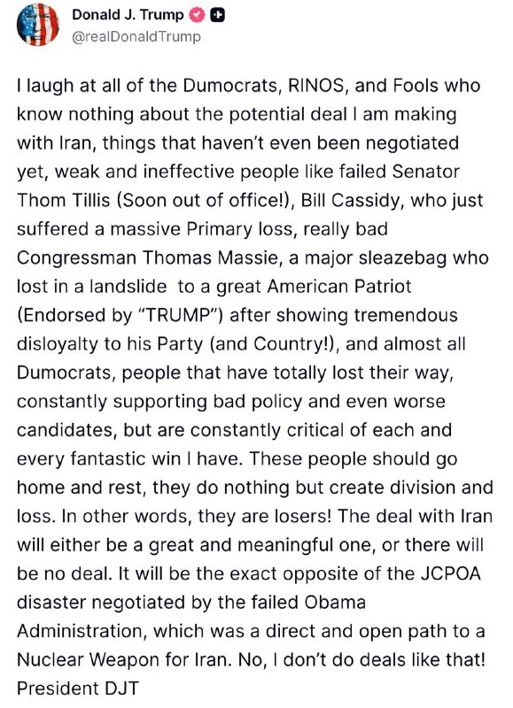

📷 Photo

## Persian_Trend_Official — post 14926

🔴تسنیم به نقل از منابع ایرانی:

«ایران هیچ خوش‌بینی‌ای نسبت به آمریکا ندارد.

♦️هنوز هیچ تفاهم نهایی حاصل نشده و اختلافات بر سر برخی بندها همچنان پابرجاست.

♦️حتی اگر یک تفاهم اولیه هم حاصل شود، این موضوع نگاه ایران به آمریکا یا اعتماد تهران به پایبندی این دولت به تعهداتش را تغییر نخواهد داد.

♦️آمریکایی‌ها سابقه بسیار بدی در مذاکرات دارند و همین مسئله بدبینی را تقویت و تثبیت می‌کند.

♦️حتی در صورت دستیابی به تفاهم، ایران در تمام مراحل پس از اعلام آن، اقدامات آمریکا را زیر نظر خواهد داشت.

♦️اگر آمریکا به وعده‌های خود عمل نکند، ایران همچنان کارت‌های فشار و ابزارهای لازم برای مقابله را حفظ خواهد کرد.»

🫆:Tony

📌 @persian_trend_official
پرشین ترند | متفاوت‌ترین کانال نظامی

## Persian_Trend_Official — post 14925

  <a href="telegram/content/Persian_Trend_Official_14925_1779706824.mp4" target="_blank">🎬 Download video</a>

داکتر مرندی، تحلیلگر سیاسی: ظاهرا قرار بر این است قطری ها بخشی از پول را برای ما تامین و بعد از آمریکا دریافت کنند.

📌 @persian_trend_official
پرشین ترند | متفاوت‌ترین کانال نظامی

## Persian_Trend_Official — post 14924

  <a href="telegram/content/Persian_Trend_Official_14924_1779706827.mp4" target="_blank">🎬 Download video</a>

پروفسور خوش‌چشم، تحلیلگر مسائل راهبردی: علت منصرف‌شدن ترامپ از حملهٔ دوباره به ایران، ۲ عملیات پیش‌دستانهٔ منتسب به ایران بود نه درخواست عرب‌ها !!! 📌 @persian_trend_official پرشین ترند | متفاوت‌ترین کانال نظامی

## Persian_Trend_Official — post 14923

  <a href="telegram/content/Persian_Trend_Official_14923_1779706829.webm" target="_blank">🎬 Download video</a>

🔴 بازگشایی اینترنت بین الملل مصوب شد ♦️سیتنا خبر داد: ستاد راهبری و ساماندهی فضای مجازی صبح امروز دوشنبه (چهارم خردادماه) به ریاست دکتر عارف معاون اول رئیس جمهور تشکیل جلسه داد و بازگشت اینترنت به وضعیت قبل از دی ماه 1404 مصوب شد. ♦️این مصوبه برای رییس جمهور…

## Persian_Trend_Official — post 14922

  <a href="telegram/content/Persian_Trend_Official_14922_1779706830.webm" target="_blank">🎬 Download video</a>

مهر: حادثه در پالایشگاه ششم پارس جنوبی؛ ۳ نفر مصدوم شدند

سخنگو مجتمع گاز پارس جنوبی عسلویه:

صبح امروز در حین آوار برداری از تاسیسات آسیب دیده جنگ رمضان در پالایشگاه ششم گاز عسلویه، انفجار محدودی رخ داد.

بلافاصله نیروهای امدادی و آتش نشانی پالایشگاه وارد عمل شده و آتش را کنترل و خاموش کردند.

علت حادثه در دست بررسی است.

در این حادثه ۳ نفر از کارکنان شرکت پیمانکاری بازسازی پالایشگاه مصدوم و به بیمارستان منتقل شدند.

🫆:Tony

📌 @persian_trend_official
پرشین ترند | متفاوت‌ترین کانال نظامی

## Persian_Trend_Official — post 14921

پروفسور خوش‌چشم، تحلیلگر مسائل راهبردی: علت منصرف‌شدن ترامپ از حملهٔ دوباره به ایران، ۲ عملیات پیش‌دستانهٔ منتسب به ایران بود نه درخواست عرب‌ها !!!

📌 @persian_trend_official
پرشین ترند | متفاوت‌ترین کانال نظامی

## Persian_Trend_Official — post 14920

  <a href="telegram/content/Persian_Trend_Official_14920_1779706831.webm" target="_blank">🎬 Download video</a>

🔴 بازگشایی اینترنت بین الملل مصوب شد

♦️سیتنا خبر داد: ستاد راهبری و ساماندهی فضای مجازی صبح امروز دوشنبه (چهارم خردادماه) به ریاست دکتر عارف معاون اول رئیس جمهور تشکیل جلسه داد و بازگشت اینترنت به وضعیت قبل از دی ماه 1404 مصوب شد.

♦️این مصوبه برای رییس جمهور ارسال شد و در صورت تایید رئیس جمهور جهت اجرا برای وزارت ارتباطات ارسال خواهدشد.

🫆:Tony

📌 @persian_trend_official
پرشین ترند | متفاوت‌ترین کانال نظامی

## Persian_Trend_Official — post 14919

  

🔴محمدباقر قالیباف رئیس مجلس ماند

♦️قالیباف با رای نمایندگان مجلس برای یکسال دیگر رئیس‌مجلس باقی ماند.

## Persian_Trend_Official — post 14918

  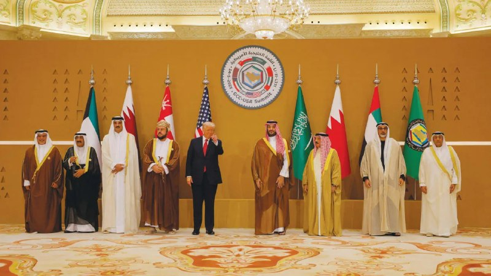

اورشلیم پست :
کشورهای خلیج فارس توان تحمل هزینه جنگ دیگری را ندارند، به ترامپ فشار می‌آورند تا از حمله به جمهوری اسلامی خودداری کند !

📌 @persian_trend_official
پرشین ترند | متفاوت‌ترین کانال نظامی

## Persian_Trend_Official — post 14917

  

ابراهیم رضایی سخنگوی کمیسیون امنیت ملی و سیاست خارجی مجلس :

در دوره جنگ نظامی تاکتیک ما چشم در مقابل چشم بود، در جنگ دیپلماتیک اقدام در مقابل اقدام است. بلوف رییس‌جمهور شکست‌خورده را باور نکنید، زمان به ضرر آمریکایی‌هاست. اگر توافق می‌خواهند مذاکره کنند، اگر بنزین ۶ دلاری می‌خواهند بایستند و بلوف بزنند تا علف زیر پایشان سبز شود. ایران زیر بار زور و تهدید نمی‌رود.

📌 @persian_trend_official
پرشین ترند | متفاوت‌ترین کانال نظامی

## Persian_Trend_Official — post 14916

ستاد راهبری و ساماندهی فضای مجازی صبح امروز دوشنبه (چهارم خردادماه) به ریاست دکتر عارف معاون اول رئیس جمهور تشکیل جلسه داد و بازگشت اینترنت به وضعیت قبل از دی ماه 1404 مصوب شد.

📌 @persian_trend_official
پرشین ترند | متفاوت‌ترین کانال نظامی

## Persian_Trend_Official — post 14915

  <a href="telegram/content/Persian_Trend_Official_14915_1779706833.webm" target="_blank">🎬 Download video</a>

خبرگزاری فارس، وابسته به سپاه پاسداران، از برگزاری «حضوری» انتخابات هیات‌رییسه مجلس شورای اسلامی با «رای مستقیم نمایندگان» خبر داد.

به گزارش این رسانه حکومتی، «بیش از ۲۷۰ نماینده» از مجموع ۲۸۵ نماینده مجلس در انتخابات هیات‌رییسه شرکت کردند.

فارس نوشت محمدباقر قالیباف با کسب ۲۳۵ رای، برای هفتمین سال متوالی به‌عنوان رییس مجلس انتخاب شد.

فارس افزود: «با آغاز انتخابات هیات‌رییسه مجلس، قالیباف در محل رای‌گیری حاضر شد و اولین نماینده‌ای بود که رای داد.»

با این حال، هنوز جزییاتی درباره نحوه برگزاری و محل دقیق این رای‌گیری منتشر نشده است.

این در حالی است که از زمان آغاز جنگ اخیر در ۹ اسفند ۱۴۰۴، جلسات علنی صحن مجلس برگزار نشده است.

📌 @persian_trend_official
پرشین ترند | متفاوت‌ترین کانال نظامی

## Persian_Trend_Official — post 14914

اسماعیل بقایی، سخنگوی وزارت امور خارجه جمهوری اسلامی:

کسی نمی‌تواند ادعا بکند به توافق نزدیک شده‌ایم

📌 @persian_trend_official
پرشین ترند | متفاوت‌ترین کانال نظامی

## Persian_Trend_Official — post 14913

سخنگوی وزارت خارجه جمهوری اسلامی: سفر عراقچی به نیویورک به‌دلیل «مشکل روادید» منتفی شد

اسماعیل بقایی، سخنگوی وزارت خارجه جمهوری اسلامی، اعلام کرد «با توجه به مجموع شرایط»، سفر عباس عراقچی به نیویورک برای شرکت در نشست شورای امنیت سازمان ملل متحد انجام نخواهد شد.

او گفت سفر وزیر خارجه جمهوری اسلامی «به علت مشکل روادید» منتفی شده است.

😄

📌 @persian_trend_official
پرشین ترند | متفاوت‌ترین کانال نظامی

## Persian_Trend_Official — post 14908

🔴 ارتش اسرائیل حملات به مواضع حزب‌الله در لبنان را ادامه می‌دهد

▪️ ارتش اسرائیل اعلام کرد حملات علیه اهداف وابسته به حزب‌الله در لبنان همچنان ادامه دارد
▪️ این حملات پس از کشته‌شدن یک نظامی دیگر اسرائیلی در حمله پهپاد انفجاری انجام شده است
▪️ تنش در جبهه لبنان همچنان بالا باقی مانده؛ آن هم در حالی که مذاکرات مربوط به آتش‌بس و توافق منطقه‌ای ادامه دارد

🫆:Tony

📌 @persian_trend_official
پرشین ترند | متفاوت‌ترین کانال نظامی

## RadioFarda — post 157537

  

🔸رسانه‌های ایران از تصویب مصوبه‌ای «جدید و مهم» دربارهٔ اتصال دوباره اینترنت کشور به اینترنت بین‌الملل در «ستاد ویژه ساماندهی فضای مجازی» خبر داده‌اند؛ مصوبه‌ای که هنوز برای اجرا نیازمند تأیید نهایی مسعود پزشکیان، رئیس‌جمهور ایران، است.

🔸خبرگزاری فارس روز دوشنبه چهارم خرداد گزارش داد چهارمین جلسه این ستاد به ریاست محمدرضا عارف، معاون اول رئیس‌جمهور، برگزار شد و در آن «مصوبات مهمی» دربارهٔ اتصال به اینترنت بین‌الملل به تصویب رسید.

🔸فارس به نقل از یک منبع نوشت که «برقراری اتصال اینترنت بین‌الملل» با ۹ رأی موافق و سه رأی مخالف تصویب شده و برای تأیید به دفتر رئیس‌جمهور ارسال شده است.

🔸خبرگزاری تسنیم نیز با انتشار گزارشی مشابه نوشت مصوبات این جلسه پس از تأیید نهایی رئیس‌جمهور، برای اجرا به وزارت ارتباطات و فناوری اطلاعات ابلاغ خواهد شد.

🔸در همین حال، سیتنا، رسانه تخصصی حوزه ارتباطات و فناوری اطلاعات، به نقل از «یک منبع آگاه» گزارش داد که در جلسه صبح دوشنبه «بازگشت اینترنت به وضعیت قبل از دی‌ماه ۱۴۰۴» مصوب شده و در صورت تأیید مسعود پزشکیان، جهت اجرا به وزارت ارتباطات ابلاغ خواهد شد.

@RadioFarda

## RadioFarda — post 157536

  

🔸رئیس مرکز روابط عمومی و اطلاع‌رسانی وزارت بهداشت روز دوشنبه چهارم خرداد مدعی شد که مجتبی خامنه‌ای در جریان حملات آمریکا و اسرائیل به «بیت رهبری» در نهم اسفند ۱۴۰۴ زیر بمباران تنها دچار چند «جراحت سطحی» شده بود.

🔸حسین کرمانپور سه ماه پس از این حمله به خبرگزاری ایلنا گفت: «استنباط ما این بود که کسی که زیر چنین بمبارانی باشد نباید بدن سالمی داشته باشد، اما به جز جراحت سطحی بر صورت، سر و پا‌ها که منجر به هیچ قطع عضو و ناراحتی خاصی نشده بود، اتفاق خاصی نیفتاده بود.»

🔸آقای کرمانپور در ادامه افزود که از دید او به عنوان یک پزشک جراحت‌های مجتبی خامنه‌ای مهم نبوده و تنها «یکی یا دو بخیه» که زده و او ساعت ۲ بامداد دهم اسفند مرخص شده است.

🔸این اظهارات در حالی مطرح می‌شود که پیش از گزارش‌هایی درباره جراحت‌های شدید به مجتبی خامنه‌ای منتشر شده بود.

🔸ازجمله نیوریوک تایمز سوم اردیبهشت از قول چهار مقام ایرانی گفته بود که مجتبی خامنه‌ای همچنان تحت درمان قرار دارد و در انتظار دریافت پروتز برای یکی از پاها و جراحی پلاستیک برای ترمیم آسیب‌های شدید صورت است.

@RadioFarda

## RadioFarda — post 157535

🔸اسماعیل بقائی در نشست خبری روز دوشنبه چهارم خرداد از لغو سفر عباس عراقچی، وزیر امور خارجه ایران به نشست شورای امنیت در آمریکا خبر داد.

🔸سخنگوی وزارت خارجه ایران در پاسخ به پرسش یک خبرنگار گفت که «با توجه به مجموع شرایط، این سفر انجام نخواهد شد. ضمن این که ما با یک مسئله مرتبط با روادید آمریکا هم مواجه شدیم.»

🔸جلسه شورای امنیت سازمان ملل قرار است روز سه‌شنبه این هفته در نیویورک برگزار شود.

🔸آمریکا پس از سرکوب خشونت‌بار اعتراضات دی ۱۴۰۴ شماری از مقامات ایران را تحریم کرد اما عباس عراقچی در این فهرست نبود.

🔸ایالات متحده سال گذشته نیز محدودیت‌های بی‌سابقه‌ای بر تردد، خرید و صدور ویزا برای هیئت جمهوری اسلامی در حاشیه هشتادمین نشست مجمع عمومی سازمان ملل در نیویورک اعمال کرد.

@RadioFarda

## RadioFarda — post 157534

  

🔸رسانه‌های دولتی پاکستان روز دوشنبه چهارم خرداد گزارش دادند که عاصم منیر، فرمانده ارتش پاکستان و یکی از چهره‌های اصلی میانجی‌گری میان ایران و آمریکا، همراه با شهباز شریف، نخست‌وزیر پاکستان، در پکن با مقام‌های چینی دیدار کرده است.

🔸عاصم منیر که روزهای جمعه و شنبه در تهران حضور داشت، همراه با محسن نقوی، وزیر کشور پاکستان، در تلاش‌های میانجی‌گرانه برای پایان رسمی جنگ ایران مشارکت دارد.

🔸چین نیز اعلام کرده است که با همکاری پاکستان برای «بازگرداندن هرچه سریع‌تر صلح و ثبات به خاورمیانه» تلاش خواهد کرد.

🔸شهباز شریف که از روز شنبه سفر چهارروزهٔ رسمی خود به چین را آغاز کرده، در دیدار با مقام‌های چینی گفت: «جهان در حال گذر از لحظه‌ای بحرانی است.» او همچنین از نقش پاکستان در میانجیگری میان تهران و واشینگتن دفاع کرد و گفت اسلام‌آباد «نقشی صادقانه» در این روند داشته است.

🔸به گزارش تلویزیون دولتی پاکستان، شهباز شریف در حضور عاصم منیر افزود: «اوضاع در مسیر درستی حرکت می‌کند» و از حمایت چین برای پیشبرد صلح قدردانی کرد.

@RadioFarda

## RadioFarda — post 157533

  

🔸اسماعیل بقائی، سخنگوی وزارت امور خارجه ایران در نشست خبری روز دوشنبه ۴ خرداد خود درباره روند مذاکرات با آمریکا گفت «این تحولات که در چند روز اخیر خبری شد، نتیجه چند هفته گفت‌وگو از طریق میانجی پاکستانی است.»

🔸او افزود که «برخی کشورهای دیگر نیز در این مدت نقش داشتند. بنابراین اینکه در زمینه بسیاری از موضوعات مورد گفت‌وگو ما به جمع‌بندی رسیده‌ایم، امر درستی است، اما اینکه بگوییم این به معنای امضای یک توافق قریب‌الوقوع است، کسی نمی‌تواند چنین ادعایی بکند.»

🔸اسماعیل بقائی اضافه کرد که «تمرکز مذاکرات بر خاتمه جنگ است و در این مرحله درباره جزئیات موضوع هسته‌ای صحبتی نداریم.»

🔸مارکو روبیو، وزیر خارجه آمریکا، روز دوشنبه گفت توافق برای پایان دادن به جنگ با ایران ممکن است حتی «امروز» حاصل شود، اما تأکید کرد واشینگتن عجله‌ای برای توافق بد ندارد.

🔸آقای روبیو افزود که ایالات متحده یا با ایران به توافقی خوب خواهد رسید یا «از راه دیگری» با این کشور برخورد خواهد کرد.

🔸روبیو به خبرنگاران گفت آمریکا پیش از بررسی «گزینه‌های دیگر»، به دیپلماسی هر فرصتی برای موفقیت خواهد داد.

@RadioFarda

## RadioFarda — post 157532

  

🔸محمدباقر قالیباف با رأی نمایندگان مجلس شورای اسلامی برای سومین سال در دوازدهمین دوره مجلس، بار دیگر رئیس مجلس شد.

🔸خبرگزاری‌های ایلنا و فارس گزارش دادند که انتخابات سومین اجلاسیه هیئت‌رئیسه دوازدهمین دوره مجلس صبح دوشنبه ۴ خرداد به صورت حضوری برگزار شد و قالیباف برای یک دورهٔ یک‌ساله دیگر بر کرسی ریاست مجلس باقی ماند.

🔸این هفتمین سال متوالی است که قالیباف ریاست مجلس شورای اسلامی را برعهده می‌گیرد.

🔸هیئت‌رئیسه مجلس شورای اسلامی ۱۲ عضو دارد: یک رئیس، دو نایب‌رئیس، سه ناظر و شش دبیر. اعضای هیئت‌رئیسه با رأی مستقیم نمایندگان برای دوره‌ای یک‌ساله انتخاب می‌شوند.

🔸رسانه‌های ایران همچنین گزارش داده‌اند که جلسه روز دوشنبه حضوری برگزار شده که بنابر این نخستین جلسۀ حضوری مجلس پس از بیش از ۸۰ روز بوده است. پس از آغاز جنگ اسرائیل و آمریکا با ایران، جلسات حضوری مجلس متوقف شده بود و در این مدت تنها یک جلسه مجازی برگزار شده بود.

@RadioFarda

## RadioFarda — post 157531

🔸مقامات کالیفرنیا در آمریکا در روزهای گذشته درباره انفجار یک مخزن معیوب حاوی مواد شیمیایی در لس‌آنجلس هشدار دادند.

🔸به گفته آن‌ها افزایش دمای این مخزن که می‌‌تواند منجر به انفجار آن یا نشت مواد شود، بخار سمی در هوا آزاد خواهد کرد.

🔸تاکنون حدود ۵۰ هزار از ساکنان محلی تخلیه شده‌اند.

🔸فرماندار کالیفرنیا، روز یکشنبه (سوم خرداد) گفت که از دونالد ترامپ، رئیس‌جمهور، درخواست کرده است تا برای پشتیبانی از عملیات، اعلامیه اضطراری فدرال صادر کند.

@RadioFarda

## RadioFarda — post 157530

  

🔸شبکه خبری سی‌بی‌اس در گزارشی بر اساس گفته‌های «مقام‌های «آگاه از موضوع» در دولت آمریکا گفت مجتبی خامنه‌ای، رهبر جمهوری اسلامی در مکانی نامعلوم پنهان شده و دسترسی محدودی به جهان خارج دارد و ارتباطاتش تنها از طریق شبکه پیچیده‌ای از نامه‌برها انجام می‌شود.

🔸این مقام‌ها بر اساس یافته‌های نهادهای اطلاعاتی آمریکا گفته‌اند مقام‌های حکومت ایران که مجوز مذاکره با دولت آمریکا را دارند، برای برقراری ارتباط در داخل ساختار حکومت خود با دشواری روبه‌رو بوده‌اند و همین موضوع یکی از دلایل اصلی تأخیر در روشن شدن جزئیات توافق احتمالی با ایران بوده است.

🔸دو مقام آمریکایی به سی‌بی‌اس گفتند وقتی آمریکا جزئیات پیشنهادی را ارسال می‌کند، دشواری دسترسی به مجتبی خامنه‌ای باعث می‌شود در دریافت پاسخ، تأخیری طولانی رخ دهد.

🔸مجتبی خامنه‌ای از زمان آغاز حملات آمریکا و اسرائیل به ایران، از انظار عمومی پنهان شده و با وجود اعلام نامش به عنوان رهبر سوم جمهوری اسلامی تاکنون از او صدا یا تصویری منتشر نشده است.

@RadioFarda

## IranianMinds — post 20716

🔴 ترامپ :

من به همه دموکرات ها، رینوس ها و احمق هایی که هیچ چیز در مورد معامله احتمالی من با ایران نمی دانند می خندم.

توافق با ایران یا توافقی بزرگ و معنادار خواهد بود یا توافقی وجود نخواهد داشت.

این دقیقا برعکس فاجعه برجام خواهد بود که توسط دولت شکست خورده اوباما مذاکره شد، که راهی مستقیم و باز برای دستیابی به سلاح هسته ای برای ایران بود.

نه، من چنین معامله ای انجام نمی دهم!

@IranianMinds

## IranianMinds — post 20715

🔴 خبرگزاری تسنیم : دستور رفع محدودیت های اینترنت بین الملل تایید شده و فقط به تایید نهایی پزشکیان نیاز داره ، در صورت تایید اینترنت بین الملل تا هفته ی آینده به حالت قبل جنگ برمیگرده! @IranianMinds

## IranianMinds — post 20714

  

🔴 بن‌ گویر، وزیر امنیت ملی اسرائیل:

نتانیاهو باید مشت خود را روی میز ترامپ بکوبد و به او بگوید که ما به جنگ برمی‌گردیم!

@IranianMinds

## IranianMinds — post 20713

❌دیگه فریب بونوس سایت های متفرقه رو نخورید!

💖توی این سایت که مورد #تایید ماست، با عضویت 500 هزارتومان بگیر!

🌐 Winro.io

🌐 Winro.io

## IranianMinds — post 20712

  <a href="telegram/content/IranianMinds_20712_1779706838.webm" target="_blank">🎬 Download video</a>

💩 
⚠️ دیگه #فریب بونوس های الکی سایت های سودجو رو نخورید
❌

💲بیا توی سایت مورد تایید ما یعنی #وینرو و با عضویت 500 هزار تومان اعتبار بی قیدو شرط بگیر
👏

🤩با عضویت 
🤩 
🤩 
🤩 هزار تومان اعتبار رایگان بگیر!

⌛ پشتیبانی 24 ساعته

🌐 Winro.io

🌐 Winro.io
کانال بونوس های رایگانr4

📱 @winro_io

## IranianMinds — post 20711

🔴 کلاس های دانشگاه تهران هم‌ از ۹ خرداد حضوری شد.

@IranianMinds

## IranianMinds — post 20710

🔴 خبرگزاری تسنیم :

دستور رفع محدودیت های اینترنت بین الملل تایید شده و فقط به تایید نهایی پزشکیان نیاز داره ، در صورت تایید اینترنت بین الملل تا هفته ی آینده به حالت قبل جنگ برمیگرده!

@IranianMinds

## IranianMinds — post 20709

ترامپ چند روز‌ دیگه :

تا ظهور‌ امام زمان به ایران فرصت دادم ، امیدوارم‌ زودتر به یه نتیجه ای برسیم و اگرنه خیلی براشون بد میشه!

@IranianMinds

## IranianMinds — post 20708

🔴 مشاور وزیر ارتباطات :

شاید تا هفته آینده اینترنت بین الملل وصل شد.

@IranianMinds

## IranianMinds — post 20707

  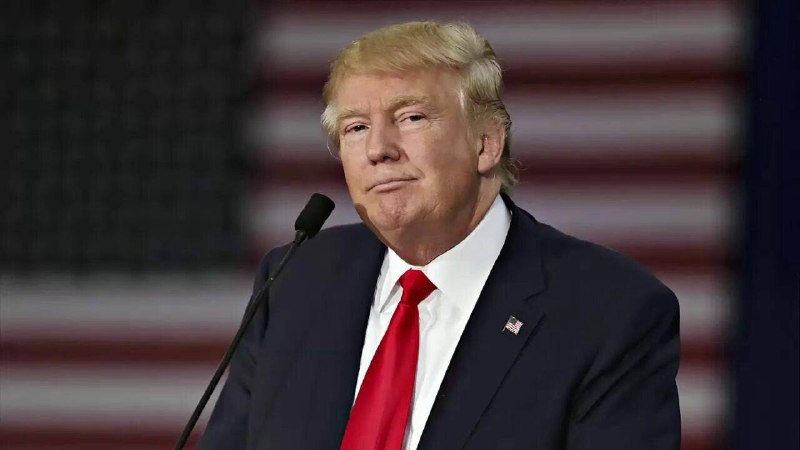

🔴 فاکس‌ نیوز :

ترامپ برای رسیدن به توافق نهایی ۷ روز‌ دیگر به جمهوری اسلامی زمان داد.

@IranianMinds

## IranianMinds — post 20706

🔴 اکونومیست:

عربستان از ترامپ خواسته هرگونه حمله جدید به ایران رو تا بعد از مراسم سالانه حج به تعویق بندازه.

ریاض نگرانه اگه درگیری دوباره آغاز و حریم هوایی منطقه بسته بشه، زائران در عربستان سعودی گیر بیفتن.

@IranianMinds

## IranianMinds — post 20705

  <a href="telegram/content/IranianMinds_20705_1779706840.mp4" target="_blank">🎬 Download video</a>

🔴 مارکو روبیو درباره ایران:

پیشنهاد بسیار محکمی روی میز وجود دارد.

این توافق شامل باز شدن تنگه‌ها و آغاز مذاکرات واقعی، جدی و زمان‌دار درباره مسائل هسته‌ای است.

این طرح حمایت زیادی در خلیج فارس و در سطح جهانی دارد ، همه کشورهایی که با آن‌ها صحبت کردیم، معتقدند این فقط یک پیشنهاد منطقی نیست، بلکه اقدامی درست برای جهان است

ترامپ عجله‌ای ندارد و توافق بد امضا نخواهد کرد ، ما قبل از بررسی گزینه‌های دیگر، به دیپلماسی هر فرصتی برای موفقیت می‌دهیم!

@IranianMinds

## BBCPersian — post 282013

🔻نیکزاد و حاجی‌بابایی نایب رئیس مجلس ماندند

علی نیکزاد، نماینده اردبیل و حمیدرضا حاجی بابایی، نماینده همدان بعنوان نواب رئیس انتخاب شدند.

به گزارش رسانه‌های ایران، آقای نیکزاد با ۱۴۳ رای و آقای حاجی‌بابایی با ۱۰۰ رای از ۲۸۰ نماینده حاضر در انتخابات نواب رئیس مجلس اول و دوم شدند.

عبدالرضا مصری با ۸۸ رای، حسینعلی حاجی دلگیانی با ۶۸ رای، رضا جباری با ۵۷ رای، علیرضا منادی سفیدان با ۵۲ رای و پیمان فلسفی با چهار رای، دیگر نامزدهای نیابت رئیس مجلس بودند.

پیش از این محمدباقر قالیباف با ۲۳۵ رأی از ۲۷۱ آرای مأخوذه، برای هفتمین سال متوالی به‌عنوان رئیس مجلس انتخاب شده بود.

به این ترتیب رئیس و دو نایب رئیس مجلس ابقا شدند.

این انتخابات حضوری و با رای مستقیم نمایندگان برای انتخاب ۱۲ عضو هیئت‌رئیسه شامل یک رئیس، دو نایب رئیس، شش دبیر و سه ناظر برگزار شد.

پیش از این، انتخابات با ورقه برگزار می‌شد اما رای‌گیری امسال با رای مستقیم نمایندگان به صندوق‌های الکترونیک رای‌گیری انجام شد.

https://bbc.in/4dvvoTc
@BBCPersian

## BBCPersian — post 282012

  

🔻سخنگوی وزارت خارجه ایران در واکنش به اظهارات مقام‌های آمریکایی که از پیشرفت در مذاکرات می‌گویند، گفت که در برخی موضوعات دو طرف به جمع‌بندی رسیده‌اند اما نمی‌توان گفت که توافق قریب‌الوقوع است.

اسماعیل بقایی مواضع ضد‌و‌نقیض مقام‌های آمریکا و سابقه حمله این کشور در میانه مذاکره را ازجمله دلایل این امر عنوان کرد.

این در حالی است که مارکو روبیو، وزیر خارجه آمریکا، گفته است که توافق میان تهران و واشنگتن «هنوز در حال پیشرفت است». دونالد ترامپ هم دیروز از نزدیک شدن به توافق گفته بود اما بعد تاکید کرد که عجله‌ای برای رسیدن به توافق ندارد.

📸GettyImages
@BBCPersian

## BBCPersian — post 282011

  <a href="telegram/content/BBCPersian_282011_1779706843.mp4" target="_blank">🎬 Download video</a>

🔻‌مارکو روبیو، وزیر خارجه آمریکا، گفته است که توافق میان تهران و واشنگتن «هنوز در حال پیشرفت است» و دونالد ترامپ، رئیس‌جمهور آمریکا، «عجله‌ای برای رسیدن به توافق ندارد.»

او پیش از ترک دهلی نو گفت که در حال حاضر «یک پیشنهاد کاملا محکم» برای رسیدن به توافق داریم که با باز شدن تنگه هرمز می‌توانیم وارد «یک مذاکره بسیار واقعی، مهم و با محدودیت زمانی در مورد مسائل هسته‌ای» بشویم.

به گفته وزیر خارجه آمریکا، دونالد ترامپ «قرار نیست توافق بدی انجام دهد، بنابراین بیایید ببینیم چه اتفاقی می‌افتد. ما قبل از بررسی گزینه‌های دیگر، هر فرصتی به دیپلماسی برای موفقیت می‌دهیم.»

او تاکید کرد که «یا توافق خوبی خواهیم داشت، یا باید به روش دیگری با این مسئله برخورد کنیم و ما ترجیح می‌دهیم توافق خوبی داشته باشیم.»

او در مورد اینکه چرا هنوز توافق اعلام نشده است گفت که این را باید از ایرانی‌ها پرسید و «ما منتظر شنیدن نظرات آنها هستیم و در سیستم آنها کمی طول می‌کشد تا آنها پاسخ دهند.»

https://bbc.in/4tYH5Xb
@BBCPersian

## BBCPersian — post 282010

  

🔻ایران می‌گوید که سفر وزیر خارجه به نیویورک برای شرکت در نشست شورای امنیت «منتفی» شده است.

اسماعیل بقایی، سخنگوی وزارت خارجه ایران، دلیل انجام نشدن سفر عباس عراقچی را «مشکل روادید» عنوان کرد.

آقای بقایی چهارشنبه هفته پیش درمورد حضور آقای عراقچی در این نشست گفته بود: «این سفر به نیویورک احتمال دارد انجام شود و البته ممکن هم هست انجام نشود، چون هنوز قطعی نیست. دلیلش هم این است که هم باید روادید صادر شود و هم ممکن است اولویت‌های دیگری داشته باشیم.»

چین به‌عنوان رئیس دوره‌ای شورای امنیت، سه‌شنبه ۲۶ مه یک بحث آزاد در سطح بالا با موضوع «حفظ اهداف و اصول منشور سازمان ملل و تقویت نظام بین‌المللی متمرکز بر سازمان ملل» برگزار خواهد کرد.

این جلسه به ریاست وانگ یی، عضو دفتر سیاسی کمیته مرکزی حزب کمونیست و وزیر امور خارجه چین، برگزار می‌شود.

چین این نشست را «فرصتی» برای همبستگی و اجماع کشورهای عضو توصیف کرد تا «تعهد راسخ خود را به حفظ اهداف و اصول منشور سازمان ملل متحد مجددا تصریح و نقش محوری این سازمان را در نظام بین‌المللی احیا کنند.»

📸Anadolu via Getty Images
https://bbc.in/42PLVv0
@BBCPersian

## BBCPersian — post 282003

🖋پاول آکسنوف
خبرنگار امور نظامی، بخش روسی بی‌بی‌سی

سرگئی مرنکوف، طراح ارشد هواپیماهای ترابری شرکت «هواپیماسازی غیرنظامی اورال»، اعلام کرد که کار روی ساخت هواپیمای جدید توربوپراپ «تی‌وی‌آراس-۴۴ لادوگا» در روسیه متوقف شده و این پروژه به وزارت دفاع واگذار شده است.

آقای مرنکوف در کنفرانسی درباره پشتیبانی هوانوردی مناطق قطبی، سیبری و خاور دور که سازمان هوانوردی روسیه برگزار کرده بود، گفت: «پروژه تی‌وی‌آراس-۴۴ لادوگا متوقف شده است. تصمیم گرفته شده این هواپیما و تمام زیرساخت‌های علمی و فنی آن در اختیار وزارت دفاع قرار گیرد تا بر پایه آن، یا نسخه ترابری مجهز به رمپ، یا نسخه ترابری با در جانبی، یا نسخه مسافربری ویژه نیازهای وزارت دفاع ساخته شود.»

او همچنین گفت که به دفتر طراحی این پروژه اجازه داده شده نخستین پرواز لادوگا را در سال ۲۰۲۶ انجام دهد.
ادامه مطلب⬇️

📸Getty/ elegram/favt_ru/ V.Lapkin/TASS/
https://bbc.in/4dGyZg1
@BBCPersian

## BBCPersian — post 281993

🖋سعید جعفری، روزنامه‌نگار

محمود احمدی‌نژاد سال‌ها به‌عنوان یکی از تندترین چهره‌های ضداسرائیلی جمهوری اسلامی شناخته می‌شد. اما حالا گزارش‌ها و روایت‌هایی منتشر شده که می‌گویند نام او در برخی سناریوهای مرتبط با آینده سیاسی ایران مطرح بوده است.

در این پست، نگاهی داریم به مواضع جنجالی احمدی‌نژاد، واکنش تحلیلگران اسرائیلی و آمریکایی، و این پرسش که چرا نام او دوباره در میانه بحث‌های مربوط به آینده ایران مطرح شده است.
ادامه مطلب⬇️

📸Getty/ Social media/ mahmoud ahmadinejad X/
https://bbc.in/4fGx9y5
@BBCPersian

## Dirty_Kids — post 390134

  <a href="telegram/content/Dirty_Kids_390134_1779706845.mp4" target="_blank">🎬 Download video</a>

طرفدارهایی که از پایان سریال The Boys شاکی هستن شروع کردن خودشون پایان بندی‌های مختلف رو با AI می‌سازن و باید بگم همین یک دقیقه‌ای که یکی از طرفدارها ساخته هم کیفیت VFXش و هم هیجانش از کل فصل ۵ بیشتر بود!

@Dirty_Kids 👻

## Dirty_Kids — post 390133

  <a href="telegram/content/Dirty_Kids_390133_1779706847.mp4" target="_blank">🎬 Download video</a>

امید دانا خود مواد مخدره، مصرف نمی‌کنه، خودش عین و سرچشمه مواد مخدره

@Dirty_Kids 👻

## Dirty_Kids — post 390132

  <a href="https://t.me/Dirty_Kids/390132" target="_blank">📎 Download file</a>

📱 اپلیکیشن اندروید بدون فیلتر ریتزوبت

➖➖➖➖➖

🔹 ثبت نام آسان 
✅
🔹 رابط کاربری بسیار راحت و سریع 
✅
🔹 درگاه پرداخت کارت به کارت 
✅
🔹 درگاه پرداخت دلاری سریع 
✅
🔹 بونوس ۱۰۰ درصدی اولین واریز 
✅
🔹 بونوس ۱۰۰ درصدی واریز یکشنبه ها 
✅

➖➖➖➖➖
🌐 https://RitzoBet.com

⚡️ @RitzoBet_ir

## Dirty_Kids — post 390131

  

⚠️ برای #شرطبندی های فوتبال از سایت معتبر و بین المللی استفاده کنید ✅

سایت #ریتزوبت ، چهار سال هستش داخل ایران فعالیت میکنه 
✅

لایسنس بین المللی داره ، روش های شارژ و برداشت متنوع داره و بونوس 100% ورزشی و کش بک های جذاب
💎

⏪ اپلیکیشن بدون فیلتر ریتزوبت 
📱
⏩
R4

✅ لینک بدون‌ فیلتر ریتزوبت
🤣

🆔 @RitzoBet_ir 
🇮🇷

## Dirty_Kids — post 390130

هر موقع شک کردی رب گوجه فرنگی کافیه برای ماکارونی ، دو قاشق دیگه رب بریز.

@Dirty_Kids 👻

## Dirty_Kids — post 390129

  <a href="telegram/content/Dirty_Kids_390129_1779706850.mp4" target="_blank">🎬 Download video</a>

پخش اذان مغرب مسلمانان از بلندگو در ميدان شلوغ دانداس تورنتو كانادا 🇨🇦

@Dirty_Kids 👻

## Dirty_Kids — post 390128

  <a href="telegram/content/Dirty_Kids_390128_1779706851.mp4" target="_blank">🎬 Download video</a>

اسماعیل بقایی، سخنگوی وزارت خارجه جمهوری اسلامی که همزمان سخنگوی تیم مذاکره‌کننده با آمریکاست، صبح امروز در نشست خبری گفت: «کسی نمی‌تواند ادعا کند که به توافق نزدیک شده‌ایم. تغییرات مکرر مواضع مقامات آمریکایی هر گفت‌گویی را دچار اشکال می‌کند. در حوزه هسته‌ای هیچ مذاکره‌ای نمی‌کنیم و هر اقدام خصمانه‌ای نیز با واکنش شدید ایران مواجه خواهد شد. همچنین بحثی در مورد جزئیات مدیریت تنگه هرمز نداریم و اینکه تنگه به چه شیوه‌ای مدیریت شود، مربوط به دولت‌های ساحلی آن است.»

اسماعیل بقایی، سخنگوی وزارت خارجه جمهوری اسلامی گفت به دلیل مخالفت دولت آمریکا با صدور ویزا، عباس عراقچی موفق نشد تا برای حضور در جلسه شورای امنیت سازمان ملل به نیویورک سفر کند.


@Dirty_Kids 👻

## Dirty_Kids — post 390127

  

🌪وقتی اینترنت طوفانیه فقط کافیه بادبان ها رو بکشی

⚫️100 هزار تومان تخفیف خرید اول 
🎁

⚫️پایین ترین قیمت گیگی 180 هزار تومان
🌐 

⚫️پورسانت %10 دائمی برای هر معرفی
💼

با بادبان، میتونی یه اتصال سریع، پایدار و امن
همراه با پشتیبانی ۲۴ ساعته داشته باشی
🚀

🛒کد تخفیف: badban4k

بادبان راهتو باز می‌کنه
⛵️
R4

🛡@BadBan_VPN | کانال 

🤖@BadBan_VPNBot | ربات 

📞@BadBan_VPNSupport | پشتیبانی

## Dirty_Kids — post 390126

  

فارس: تو جلسهٔ ستاد ویژهٔ ساماندهی فضای مجازی

اتصال مجدد اینترنت بین‌الملل به رای گذاشته شد که با 9 رای موافق و 3 رای مخالف تصویب و به پزشکیان ارسال شد.

@Dirty_Kids 👻

## Dirty_Kids — post 390125

  <a href="telegram/content/Dirty_Kids_390125_1779706856.mp4" target="_blank">🎬 Download video</a>

بیوگرافی کوتاهی از عمو مانوک و مرگ مشکوکش:

@Dirty_Kids 👻

## Dirty_Kids — post 390124

  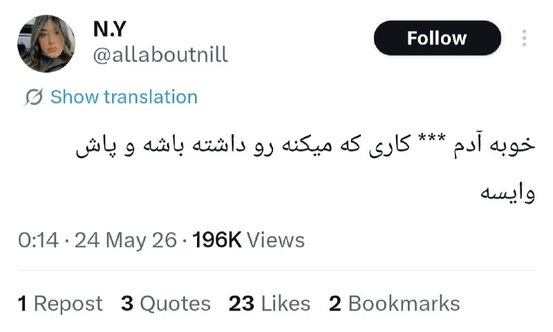

خودت خایه نوشتن «خایه» رو نداشتی.

@Dirty_Kids 👻

## Dirty_Kids — post 390123

  <a href="telegram/content/Dirty_Kids_390123_1779706858.mp4" target="_blank">🎬 Download video</a>

دل یه ایران گرفته

@Dirty_Kids 👻

## Dirty_Kids — post 390122

  <a href="telegram/content/Dirty_Kids_390122_1779706861.mp4" target="_blank">🎬 Download video</a>

دیگه نمیتونم تشخیص بدم کی پرستوعه کی کصخل‌مجازیه

@Dirty_Kids 👻

## Dirty_Kids — post 390121

  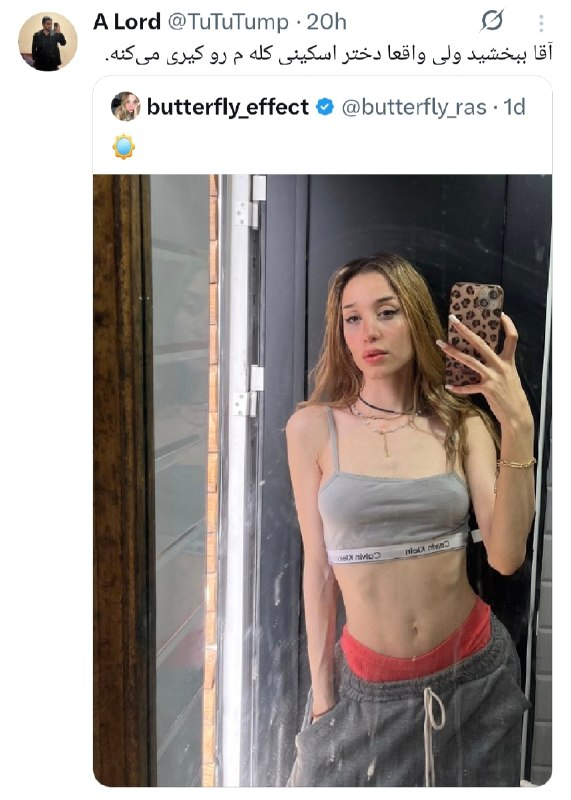

بکیرم میگی چی‌کار کنیم الان
اگه خواستن بهت بدن تو نکن

@Dirty_Kids 👻

## Dirty_Kids — post 390120

  <a href="telegram/content/Dirty_Kids_390120_1779706862.mp4" target="_blank">🎬 Download video</a>

مراد ویسی: مردم ایران منتظر ترامپ و بی‌بی نبودن رو پای خودشون همیشه وایستادن

@Dirty_Kids 👻

## Dirty_Kids — post 390119

  

بیا برو بابا قهبه 😂 همه‌ی شما صیغه‌زاده‌ها روهم یه تار از پشمشم نمیشید

انگار فرغون رو با بنز بیای مقایسه کنی
اصن فیس گربه‌ای رو ببین 😍

@Dirty_Kids 👻

## Dirty_Kids — post 390118

  <a href="telegram/content/Dirty_Kids_390118_1779706864.mp4" target="_blank">🎬 Download video</a>

صدا ، تصویر و خواسته مردم ایران سانسورشدنی نیست.

@Dirty_Kids 👻

## Hranews — post 113150

وقوع حادثه در پالایشگاه ششم پارس جنوبی؛ ۶ کارگر مصدوم شدند

❗️
❗️
❗️
❗️
❗️– سخنگوی مجتمع گاز پارس جنوبی اعلام کرد که حین عملیات آواربرداری پالایشگاه ششم پارس جنوبی ۶ #کارگر در پی وقوع حادثه‌ای مصدوم شدند.

ادامه مطلب

↘️
@hranews_bot تماس ✉️ -  @Hranews  کانال هرانا 🆑

## Hranews — post 113149

  

مجید رحمتی، عضو هیات مدیره کانون هماهنگی شوراهای اسلامی کار تهران، با اشاره به افزایش شدید قیمت مواد غذایی در ایران گفت که «مرغ هم از سفره ما کارگران حذف شده» و بسیاری از خانواده‌های کارگری دیگر توان خرید منظم منابع پروتئینی را ندارند. براساس گزارش منتشرشده، قیمت هر شانه تخم‌مرغ به حدود ۵۰۰ هزار تومان و قیمت مرغ در برخی موارد به کیلویی ۴۷۰ هزار تومان رسیده؛ در حالی که حداقل دستمزد ماهانه کارگران حدود ۲۳ تا ۲۴ میلیون تومان است. رحمتی می‌گوید بخش عمده درآمد #کارگران صرف اجاره مسکن و هزینه‌های اولیه زندگی می‌شود و حتی تامین خوراک ساده نیز برای بسیاری از خانوارها دشوار شده است.

این فعال کارگری همچنین گفت که سبد حداقلی معیشت خانوار کارگری که سال گذشته حدود ۴۵ میلیون تومان برآورد می‌شد، اکنون به حدود ۷۰ میلیون تومان رسیده است. به گفته او، کارگران امروز «برای بقا و زنده ماندن مبارزه می‌کنند» و سیاست‌های کنونی کنترل قیمت‌ها نیز دیگر کارایی گذشته را ندارند.

↘️
@hranews_bot تماس ✉️ -  @Hranews  کانال هرانا 🆑

## Hranews — post 113148

  

بر اساس آخرین داده‌های نت‌بلاکس، اکنون هشتادوهفتمین روز متوالی قطع اینترنت در ایران است؛ محدودیتی که بیش از ۲۰۶۴ ساعت ادامه داشته است. این نهاد ناظر بر وضعیت #اینترنت در جهان تاکید می‌کند این اقدام هرگونه شفافیت درباره اعدام‌ها را از میان برده و بر شرایط غیرانسانی و وضعیت بلاتکلیفی روزانه که منتقدان، مخالفان و گردشگران زندانی با آن روبه‌رو هستند، افزوده است.

↘️
@hranews_bot تماس ✉️ -  @Hranews  کانال هرانا 🆑

## Hranews — post 113147

  

بند زنان زندان اوین؛ ۵ زندانی سیاسی از دسترسی به تماس تلفنی محروم شدند

❗️
❗️
❗️
❗️
❗️– گلرخ ایرایی، زهرا صفایی، مرضیه فارسی، شیوا اسماعیلی و سکینه پروانه، پنج زندانی سیاسی محبوس در زندان اوین، از روز گذشته به صورت تنبیهی از حق استفاده از تلفن زندان محروم شده‌اند. این زندانیان همچنین پیش از این نیز از حق ملاقات حضوری با خانواده و وکلای خود محروم بوده‌اند و این محدودیت همچنان ادامه دارد.

به گزارش خبرگزاری هرانا، ارگان خبری مجموعه فعالان حقوق بشر در ایران، پنج زندانی سیاسی زن محبوس در زندان اوین از حق استفاده از تلفن زندان محروم شدند.

براساس اطلاعات دریافتی هرانا، روز گذشته گلرخ ایرایی، زهرا صفایی، مرضیه فارسی، شیوا اسماعیلی و سکینه پروانه از امکان دسترسی و استفاده از تلفن زندان منع شده‌اند و این محرومیت همچنان ادامه دارد.
اقدام تنبیهی یادشده پس از آن اعمال شد که این زندانیان در اعتراض به اجرای احکام اعدام، در محوطه هواخوری زندان اقدام به سر دادن شعار کرده بودند.

ادامه مطلب

#گلرخ_ایرایی
#زهرا_صفایی
#مرضیه_فارسی
#شیوا_اسماعیلی
#سکینه_پروانه

↘️
@hranews_bot تماس ✉️ -  @Hranews  کانال هرانا 🆑

## Hranews — post 113146

اعتراضات ۱۴۰۴؛ عباس اکبری فیض‌آبادی اعدام شد

❗️
❗️
❗️
❗️
❗️– مرکز رسانه قوه قضاییه از اجرای حکم اعدام عباس اکبری فیض‌آبادی، از بازداشت‌شدگان اعتراضات ۱۴۰۴ که به اتهاماتی از جمله «محاربه» متهم شده بود خبر داد. این حکم بامداد امروز به اجرا درآمد. بر اساس داده‌های گردآوری‌شده توسط هرانا، همزمان با آغاز درگیری‌های نظامی، روند صدور و اجرای احکام #اعدام در پرونده‌های سیاسی و امنیتی افزایش یافته و تاکنون ۳۶ زندانی با این اتهامات در این بازه زمانی اعدام شده‌اند.

ادامه مطلب

#عباس_اکبری_فیض‌آبادی

↘️
@hranews_bot تماس ✉️ -  @Hranews  کانال هرانا 🆑

## Hranews — post 113145

  

جمعی از رانندگان استیجاری برای سومین روز متوالی در مقابل ساختمان نهاد ریاست جمهوری در تهران، #تجمع_اعتراضی برگزار کردند.

به گفته این رانندگان، ما از استان‌های مختلف در حالی برای اعتراض به تهران آمده‌ایم که از سال ۱۴۰۰ به دنبال اجرای قانون و تبدیل وضعیت هستیم اما هیچ نهادی پیگیر وضعیت ما نیست.

↘️
@hranews_bot تماس ✉️ -  @Hranews  کانال هرانا 🆑

## manototv — post 105828

  <a href="telegram/content/manototv_105828_1779706870.mp4" target="_blank">🎬 Download video</a>

تماسی از هلند:
«می‌گفت هر روز با برنامه‌های منوتو زندگی می‌کردیم…
و حالا نمی‌دانیم بعد از آن باید چه کنیم.»
او همچنین از جاویدنام سینا حق‌شناس یاد کرد؛ دوستی که خبر جان‌باختنش زندگی او را زیر و رو کرده بو

## manototv — post 105827

  <a href="telegram/content/manototv_105827_1779706872.mp4" target="_blank">🎬 Download video</a>

گفت‌وگو درباره اعتراضات خارج از کشور:
« چه رفتارهایی به همبستگی و رساندن پیام مردم ایران کمک می‌کند؟»

## manototv — post 105826

  <a href="telegram/content/manototv_105826_1779706875.mp4" target="_blank">🎬 Download video</a>

تماسی از اتریش:
«می‌گفت سختی‌ها خیلی‌ها را عوض کرد…
و از کیوان عباسی به‌خاطر حفظ همان نگاه و مسیر همیشگی‌اش قدردانی کرد.»

## alonews — post 122531

  <a href="telegram/content/alonews_122531_1779706877.webm" target="_blank">🎬 Download video</a>

👈یک دیپلمات ارشد ایرانی به خبرگزاری ایسنا گفت: اگر آمریکا به تعهدات خود در چارچوب یادداشت تفاهم احتمالی عمل کند - مسئله هسته‌ای و ذخایر اورانیوم غنی‌شده پس از ۶۰ روز در ازای رفع تحریم‌ها علیه ایران و آزادسازی دارایی‌های مسدود شده ایرانی مورد بحث قرار خواهد گرفت. مدیریت عبور در تنگه هرمز یک مسئله ایرانی-عمانی است که تهران با عمان درباره آن گفتگو کرده است.

✅ @AloNews خبر جنگ

## alonews — post 122530

  <a href="telegram/content/alonews_122530_1779706877.webm" target="_blank">🎬 Download video</a>

👈 ترامپ: چیزهایی هست که از اول هم با ایران در موردشان مذاکره نشده بود

✅ @AloNews خبر جنگ

## alonews — post 122529

  <a href="telegram/content/alonews_122529_1779706877.webm" target="_blank">🎬 Download video</a>

⚫
🏆 به دنیای هیجان‌انگیز فوتبال خوش اومدی!

⭐️اینجا قراره باهم لحظه‌به‌لحظه‌ی جام جهانی رو زندگی کنیم؛
از بازی‌های حساس و نتایج داغ گرفته تا حاشیه‌ها، کری‌خونی‌ها و اتفاقاتی که همه درباره‌ش حرف میزنن! 
🔥
🔥

✅ پوشش کامل مسابقات

💀 ترول تیم‌ها و بازیکن‌ها

🎥 ویدیوها و لحظه‌های فان فوتبالی

📊 آمار، ترکیب‌ها و اخبار فوری

🌍 حواشی جذاب از سراسر جام جهانی

📢اینجا فقط یک کانال خبری نیست؛
یک جمع فوتبالیه برای کسایی که فوتبال رو با هیجان، شوخی و احساس واقعی دنبال میکنن 
📛
💟

🆘
🔞 آماده باش چون قراره جام جهانی رو متفاوت تجربه کنیم!

⚡ @Vaarzesh_Plus

⚡ @Vaarzesh_Plus

## alonews — post 122528

  <a href="telegram/content/alonews_122528_1779706878.webm" target="_blank">🎬 Download video</a>

👈خبرگزاری Financial Juice به نقل از ترامپ : یا یه توافق خفن و واقعی با ایران می‌بندیم، یا اصلاً توافقی در کار نیست

✅ @AloNews خبر جنگ

## alonews — post 122527

  <a href="telegram/content/alonews_122527_1779706878.webm" target="_blank">🎬 Download video</a>

👈وزیر امنیت ملی اسرائیل، ایتامار بن-گویر: نتانیاهو باید دستش را محکم روی میز ترامپ بکوبد و به او بگوید که ما به جنگ بازمی‌گردیم

✅ @AloNews خبر جنگ

## alonews — post 122526

  <a href="telegram/content/alonews_122526_1779706878.webm" target="_blank">🎬 Download video</a>

👈پست جدید ترامپ درباره ایران

🔴ترامپ : به همه دموکرات‌های احمق، جمهوری‌خواهانِ فقط به‌نام، و ابلهانی که هیچ‌چیز از معامله‌ای که با ایران دارم انجام می‌دهم نمی‌دانند، می‌خندم.

🔴معامله با ایران یا بزرگ و پرمعنا خواهد بود، یا اصلاً معامله‌ای در کار نخواهد بود.

🔴این معامله دقیقاً نقطه‌ی مقابل فاجعه‌ی برجام خواهد بود که توسط دولت شکست‌خورده اوباما مذاکره شد؛ برجام مسیری مستقیم و آشکار به سوی سلاح هسته‌ای برای ایران بود.

🔴نه، من اهل چنین معامله‌هایی نیستم!

✅ @AloNews خبر جنگ

## alonews — post 122525

  <a href="telegram/content/alonews_122525_1779706878.webm" target="_blank">🎬 Download video</a>

👈سخنگوی مجتمع گاز پارس جنوبی:
صبح امروز در عملیات آواربرداری پالایشگاه ششم پارس جنوبی، یک حادثه رخ داد که ۶ نفر از کارکنان شرکت پیمانکار مصدوم شدند.

🔴۳ نفر سرپایی مداوا و ۳ نفر دیگر برای بررسی‌های بیشتر به بیمارستان عسلویه منتقل شدند.

🔴علت حادثه در دست بررسی است

✅ @AloNews خبر جنگ

## alonews — post 122524

  <a href="telegram/content/alonews_122524_1779706879.webm" target="_blank">🎬 Download video</a>

👈رشد ۸۳ هزار واحدی شاخص بورس پس از پایان معاملات امروز

✅ @AloNews خبر جنگ

## alonews — post 122523

🔴فوری/ بازگشایی اینترنت بین الملل مصوب شد ‌ 
🔴ستاد راهبری و ساماندهی فضای مجازی صبح امروز دوشنبه (چهارم خردادماه) به ریاست دکتر عارف معاون اول رئیس جمهور تشکیل جلسه داد و بازگشت اینترنت به وضعیت قبل از دی ماه 1404 مصوب شد. ‌ 
🔴این مصوبه برای رییس جمهور ارسال…

## alonews — post 122522

  <a href="telegram/content/alonews_122522_1779706879.webm" target="_blank">🎬 Download video</a>

👈شاخص کل بورس با رشد 83 هزار واحدی در پایان معاملات امروز به 3 میلیون و 993 هزار واحد رسید

✅ @AloNews خبر جنگ

## alonews — post 122521

  <a href="telegram/content/alonews_122521_1779706879.mp4" target="_blank">🎬 Download video</a>

👈عوستاد خوش‌چشم، تحلیلگر مسائل راهبردی : تا پولای بلوکه‌شدهٔ ایران آزاد نشه، فعلاً خبری از هیچ توافق اولیه‌ای با آمریکا نیست

✅ @AloNews خبر جنگ

## alonews — post 122520

  <a href="telegram/content/alonews_122520_1779706881.webm" target="_blank">🎬 Download video</a>

👈آونر ویلان، مقام ارشد دفاعی سابق و کارشناس هسته‌ای ایران، هشدار داد که بهترین توافقی که ایالات متحده و ایران می‌توانند در مورد مسئله هسته‌ای به آن دست یابند، ممکن است شبیه برنامه جامع اقدام مشترک (برجام) باشد که در دوران دولت اوباما حاصل شد.

✅ @AloNews خبر جنگ

## alonews — post 122519

  <a href="telegram/content/alonews_122519_1779706882.webm" target="_blank">🎬 Download video</a>

👈پزشکیان: تسلیم زیاده‌خواهی‌های دشمن نمی‌شویم/ حقوق ملت ایران باید به صورت کامل استیفا شود

✅ @AloNews خبر جنگ

## alonews — post 122518

  <a href="telegram/content/alonews_122518_1779706882.webm" target="_blank">🎬 Download video</a>

👈هاآرتص: افسران ارشد در نهاد امنیتی اسرائیل از توافق احتمالی بین تهران و واشنگتن هراس دارند

🔴آنها هشدار می‌دهند که منافع امنیتی اسرائیل در طول مذاکرات لحاظ نشده است

✅ @AloNews خبر جنگ

## alonews — post 122517

  <a href="telegram/content/alonews_122517_1779706882.webm" target="_blank">🎬 Download video</a>

👈یک نظرسنجی جدید نشان می‌دهد که تردید گسترده‌ای درباره آمادگی دفاعی آلمان وجود دارد، گزارش DW.

🔴 این نظرسنجی نشان داد که تنها ۱۷٪ از آلمانی‌ها معتقدند که بوندس‌ور می‌تواند به طور کافی از کشور دفاع کند، در حالی که ۷۲٪ گفتند که به آمادگی نظامی شک دارند.

✅ @AloNews خبر جنگ

## alonews — post 122516

  <a href="telegram/content/alonews_122516_1779706882.webm" target="_blank">🎬 Download video</a>

👈 وزیر دارایی اسرائیل، بزالل سموتریچ: برای هر پهپاد انفجاری حزب‌الله، باید ۱۰ ساختمان در بیروت فرو بریزد.

✅ @AloNews خبر جنگ

## alonews — post 122515

  <a href="telegram/content/alonews_122515_1779706883.mp4" target="_blank">🎬 Download video</a>

👈روبیو تو پاسخ به سوالی درباره نگرانی هند از نقش پاکستان به‌عنوان میانجی بین آمریکا و ایران : هند همیشه نگران گروه‌های تروریستی مسلحیه که از خاک پاکستان فعالیت می‌کنن و هند رو هدف قرار میدن، این نگرانی همیشگی اوناست

🔴اما درباره نقشی که پاکستان به‌عنوان میانجی و تسهیل‌کننده تو موضوع ایران داشت، اصلاً مطرح نشد و فکر نمی‌کنم هند مشکلی با اون داشته باشه

🔴اختلاف هند با پاکستان یه موضوع جداگونه‌ست

✅ @AloNews خبر جنگ

## alonews — post 122514

  <a href="telegram/content/alonews_122514_1779706884.webm" target="_blank">🎬 Download video</a>

🔴فوری/ بازگشایی اینترنت بین الملل مصوب شد
‌

🔴ستاد راهبری و ساماندهی فضای مجازی صبح امروز دوشنبه (چهارم خردادماه) به ریاست دکتر عارف معاون اول رئیس جمهور تشکیل جلسه داد و بازگشت اینترنت به وضعیت قبل از دی ماه 1404 مصوب شد.
‌

🔴این مصوبه برای رییس جمهور ارسال شد و در صورت تایید رئیس جمهور جهت اجرا برای وزارت ارتباطات ارسال خواهد شد.

✅ @AloNews خبر جنگ

## alonews — post 122513

  <a href="telegram/content/alonews_122513_1779706885.webm" target="_blank">🎬 Download video</a>

👈عبدالناصر همتی برای پیگیری آزادسازی منابع ارزی ایران راهی قطر شد

✅ @AloNews خبر جنگ

## alonews — post 122508

  <a href="telegram/content/alonews_122508_1779706885.webm" target="_blank">🎬 Download video</a>

👈 جنگنده‌های اسرائیلی حملات هوایی را در چندین شهر جنوب لبنان انجام دادند

✅ @AloNews خبر جنگ

---
📅 بروزرسانی: 1405/03/04 09:48
---

## VahidOOnLine — post 242071

  

روزنامه کیهان با اشاره به احتمال تفاهم موقت میان جمهوری اسلامی و آمریکا، نوشت: «ملت ایران از مطالبه غرامت، خسارت، تنبیه متجاوز و رفع شر او و همچنین از حکمرانی بر تنگه هرمز به عنوان حاکمیت سرزمینی خود عقب نخواهد نشست.»

این روزنامه افزود: «توافق با عنصر عهدشکنی که تعهد دولت آمریکا در برجام را زیر پا گذاشت، مانند نقش زدن بر قالب یخ زیر آفتاب است.»

کیهان ادامه داد: «شرایط برخلاف تظاهر مذاکراتی دشمن، جنگی است و در برابر دشمن زخم‌خورده و مترصد، غفلت از آرایش دفاعی و تهاجمی و احتیاط ممکن نیست.»
‌🏁 🇬🇧 IranintlTV

🤖 @VahidOOnLine

## VahidOOnLine — post 242070

  

خبرگزاری ایسنا گزارش داد موجودی سدهای استان‌های تهران، مرکزی، خراسان رضوی، قم، اصفهان، زنجان و همدان در وضعیت نامطلوب است و تامین آب شرب شهرهایی از جمله تهران، کرج، مشهد، اراک، قم، اصفهان، یزد و همدان با محدودیت مواجه شده است.

بنا بر این گزارش حجم پرشدگی سدهای کشور به ۶۷ درصد رسیده، اما پنج سد مهم شامل لار، دوستی، پانزده خرداد، بارزو و ساوه همچنان کمتر از ۱۰ درصد آب دارند.
‌🏁 🇬🇧 IranintlTV

🤖 @VahidOOnLine

## VahidOOnLine — post 242069

  

خبرگزاری فارس، وابسته به سپاه پاسداران، نوشت بر اساس کسب اطلاعش از اتاق بازرگانی ایران و پاکستان، امارات متحده عربی برای جلوگیری از تبدیل بندر گوادر به رقیب دبی، در مسیر پیشرفت کریدور اقتصادی چین و پاکستان، موسوم به «سی‌پک»، کارشکنی می‌کند.

از آغاز جنگ میان جمهوری اسلامی با آمریکا و اسرائیل، امارات متحده عربی هدف بیشتری حملات جمهوری اسلامی قرار گرفت.
‌🏁 🇬🇧 IranintlTV

🤖 @VahidOOnLine

## VahidOOnLine — post 242068

  

♦️یک مقام سعودی اعلام کرد بیش از ۱.۵ میلیون زائر از خارج از عربستان سعودی برای شرکت در مراسم حج وارد این کشور شده‌اند؛ رقمی که با وجود جنگ در خاورمیانه، از تعداد زائران خارجی سال گذشته بیشتر است.
در دوران جنگ تهران چندین موج حمله به اهدافی در عربستان سعودی و سراسر خلیج فارس انجام داد؛ حملاتی که اختلال گسترده در پروازها و افزایش شدید هزینه‌های سفر را به دنبال داشت.
به گزارش عرب نیوز،شرکت‌های بزرگ هواپیمایی خلیج فارس در امارات، قطر و بحرین پس از هفته‌ها بسته شدن حریم هوایی و لغو پروازها، تلاش کرده‌اند بخش زیادی از ظرفیت عملیاتی خود را دوباره احیا کنند.
این رسانه سعودی می نویسد، با وجود این مشکلات، زائران همچنان برای شرکت در حج امسال راهی عربستان شده‌اند.
صالح المربع، فرمانده نیروهای گذرنامه حج عربستان، در یک نشست خبری گفت: «تعداد کل زائرانی که از خارج کشور وارد شده‌اند، به یک میلیون و ۵۱۸ هزار و ۱۵۳ نفر رسیده است.»
انتظار می‌رود این آمار طی دو روز آینده نیز افزایش یابد، زیرا زائران همچنان پیش از آغاز رسمی مناسک حج در روز دوشنبه از خارج وارد عربستان می‌شوند.
‌🇸🇦 Indypersian

🤖 @VahidOOnLine

## VahidOOnLine — post 242067

  

حسین شریعتمداری، نماینده رهبر جمهوری اسلامی در روزنامه کیهان، با اشاره به مذاکرات با آمریکا، نوشت: «ترجمه و معنای واقعی گشایش تنگه هرمز، خلع سلاح جمهوری اسلامی در مقابل تجاوز و حملات نظامی و اقتصادی و سیاسی دشمنان است.»

او افزود: «گشایش تنگه هرمز، حذف یکی از اصلی‌ترین موانع پیش‌روی دشمن برای حمله به کشور خواهد بود.»

او ادامه داد: «متاسفانه مسئولان و دست‌اندرکاران گفت‌وگو و تبادل پیام با آمریکا، از نتیجه گفت‌وگوهای انجام شده، گزارش دقیق و یا اطلاعات چندانی به افکار عمومی نمی‌دهند»
‌🏁 🇬🇧 IranintlTV

🤖 @VahidOOnLine

## VahidOOnLine — post 242066

  

♦️درحالی که دونالد ترامپ، رئیس‌جمهوری آمریکا همواره بر خارج کردن ذخایر اورانیوم غنی‌شده از ایران تاکید داشته است، در روایت سی‌ان‌ان از چارچوب توافق احتمالی با تهران آمده است که درباره چگونگی نابودی ذخایر اورانیوم غنی‌شده ایران در مرحله بعدی مذاکرات تصمیم‌گیری می‌شود. براساس این گزارش، در صورت توافق، بازه زمانی ۶۰ روزه برای به تفاهم رسیدن درباره جزئیات باقی مانده در نظر گرفته شده است. یکی از مقامات که مستقیما در جریان مذاکرات قرار دارد نیز به اسوشیتدپرس گفت: نحوه واگذاری اورانیوم از سوی ایران، در طول یک دوره ۶۰ روزه به مذاکرات بیشتر موکول خواهد شد. به گفته او، احتمالا بخشی از این مواد رقیق خواهد شد و بقیه به کشور ثالث منتقل می‌شود. روسیه پیشنهاد داده است این مواد را تحویل بگیرد.
بر اساس گزارش آژانس بین‌المللی انرژی اتمی، ایران ۴۴۰.۹ کیلوگرم اورانیوم با غنای تا ۶۰ درصد در اختیار دارد؛ سطحی که از نظر فنی تنها یک گام کوتاه تا غنای ۹۰ درصدی مورد نیاز برای ساخت سلاح هسته‌ای فاصله دارد.
‌🇸🇦 Indypersian

🤖 @VahidOOnLine

## VahidOOnLine — post 242065

  <a href="telegram/content/VahidOOnLine_242065_1779689884.mp4" target="_blank">🎬 Download video</a>

♦️به گزارش فاکس نیوز، مراسم فارغ‌التحصیلی دبیرستان سنتنیال در شهر فرانکلین ایالت تنسی با وجود بارش شدید باران و وقوع صاعقه، در فضای باز برگزار شد و موجی از انتقاد خانواده‌ها را به‌دنبال داشت.

مسئولان مدرسه با اجرای سیاست «باران یا آفتاب» تصمیم گرفتند برنامه از پیش تعیین‌شده را تغییر ندهند؛ با وجود آنکه از قبل از وضعیت آب‌وهوا اطلاع داشتند و حتی برای بارندگی برنامه جایگزین نیز در نظر گرفته بودند.

بر اساس گزارش‌ها، مسئولان امیدوار بودند مراسم پیش از آغاز بارندگی به پایان برسد و به همین دلیل آن را به سالن سرپوشیده منتقل نکردند. نگرانی درباره جا نشدن همه حاضران در سالن ورزشی نیز یکی از دلایل ادامه مراسم در فضای باز عنوان شده است.
‌🇸🇦 Indypersian

🤖 @VahidOOnLine

## VahidOOnLine — post 242064

♦️مارکو روبیو، وزیر خارجه آمریکا، روز دوشنبه در جریان سفر به هند گفت مذاکرات میان آمریکا و رژیم ایران «هنوز در حال پیشرفت و شکل‌گیری» است.
روبیو پیش از ترک دهلی‌نو برای بازدید از تاج‌محل در شهر آگرا، به خبرنگاران گفت: «فکر می‌کردیم شاید دیشب خبرهایی داشته باشیم. خیلی نباید در این مورد برداشت خاصی کرد. دریافت پاسخ کمی زمان می‌برد.»
او گفت درباره توانایی ایران برای باز نگه داشتن تنگه هرمز و ورود به «مذاکراتی واقعی، مهم و محدود از نظر زمانی درباره مسائل هسته‌ای»، «پیشنهاد نسبتا محکمی روی میز» قرار دارد. روبیو افزود که توافق احتمالی از حمایت گسترده کشورهای خلیج فارس و همچنین حمایت جهانی برخوردار است.
وزیر خارجه آمریکا همچنین تاکید کرد که دونالد ترامپ، رئیس‌جمهوری آمریکا، «عجله‌ای ندارد» و «قرار نیست توافق بدی امضا کند.»
روبیو گفت: «یا به یک توافق خوب می‌رسیم یا باید از راه دیگری با این مسئله برخورد کنیم.»
او در پاسخ به این پرسش که آیا لبنان بخشی از توافق خواهد بود یا نه، گفت گفت‌وگوها با اسرائیل و لبنان همچنان ادامه دارد.
‌🇸🇦 Indypersian

🤖 @VahidOOnLine

## VahidOOnLine — post 242063

  

روزنامه نیویورک‌پست به نقل از «یک مقام ارشد دولت آمریکا» نوشت که نهایی شدن توافق صلح با حکومت ایران برای بازگشایی تنگه هرمز ممکن است تا یک هفته طول بکشد، اما اگر تهران به شرایط دونالد ترامپ متعهد نشود، ممکن است رییس‌جمهوری ایالات متحده، از آن خارج شود.

یک مقام ارشد آمریکا گفت پس از آن‌که ترامپ اعلام کرد مذاکرات بر سر جنگ و برنامه هسته‌ای تهران در مرحله نهایی خود قرار دارد، وضعیت حکومت ایران باعث شده است که روند نهایی به کندی پیش برود.

این منبع اشاره کرد که ممکن است چند روز طول بکشد تا توافق نهایی به دست مجتبی خامنه‌ای، رهبر جمهوری اسلامی، برسد.

در همین ارتباط، شماری از رسانه‌ها گزارش داده‌اند که او درمکانی نامعلوم مخفی شده و امکان دسترسی به او برای مقام‌‌های حکومت ایران دشوار است.

به نوشته نیویورک‌پست، مقام ارشد آمریکایی گفت بازگشایی واقعی تنگه هرمز و پایان محاصره بنادر ایران توسط آمریکا حدود هفت روز طول خواهد کشید و ایالات متحده تنها زمانی تحریم‌ها را لغو خواهد کرد که ایران اورانیوم غنی‌شده خود را تحویل دهد.
‌🏁 🇬🇧 IranintlTV

🤖 @VahidOOnLine

## VahidOOnLine — post 242062

  

♦️مقام‌های اسرائیلی هشدار داده‌اند که توافق در حال شکل‌گیری میان رژیم ایران و ایالات متحده «توافقی بد» است، زیرا تهدیدهای اصلی جمهوری اسلامی فراتر از برنامه هسته‌ای را نادیده می‌گیرد.
یکی از این مقام‌ها به اورشلیم پست گفت: «توافق چارچوبی خوب نیست و حتی اگر توافق نهایی امضا شود و همه اورانیوم غنی‌شده از ایران خارج شود ــ که خود محل تردید جدی است ــ این توافق به برنامه موشکی ایران یا شبکه نیروهای نیابتی منطقه‌ای آن نمی‌پردازد.»
مقام‌های اسرائیلی همچنین نگران‌اند که این توافق آزادی عمل اسرائیل در لبنان را محدود کند و احتمالا توانایی این کشور برای اقدام علیه تهدیدهای جمهوری اسلامی در سراسر منطقه را کاهش دهد.
یک مقام اسرائیلی دیگر نیز گفت: «هنوز هیچ چیز نهایی نشده، اما این توافق می‌تواند بر اینکه آیا و چگونه قادر به اقدام خواهیم بود، تاثیر بگذارد.»
ارزیابی اسرائیل این است که دونالد ترامپ، رئیس‌جمهوری آمریکا، در حال حاضر خواهان دستیابی به توافق با ایران است و تنها فردی که ممکن است در نهایت مانع آن شود، مجتبی خامنه‌ای، رهبر جمهوری اسلامی، است.
یک مقام اسرائیلی گفت: «در نهایت، تصمیم به او بستگی دارد. همان‌طور که پدرش در آخرین لحظه در سال ۲۰۲۲ توافق جدید هسته‌ای را رد کرد، ممکن است او نیز همان مسیر را در پیش بگیرد.»
براساس این گزارش، فرض اصلی نهادهای امنیتی اسرائیل این است که حکومت کنونی ایران هرگز به‌طور کامل از برنامه هسته‌ای خود دست نخواهد کشید. به باور مقام‌های اسرائیلی، تهران به‌دنبال توافق‌هایی است که بتواند از آن‌ها برای خرید زمان و به تعویق انداختن رویارویی‌هایی استفاده کند که ممکن است توانایی‌هایش را تضعیف کند.
به گفته کارشناسان، اگر ایران با واگذاری ۴۶۰ کیلوگرم اورانیوم ۶۰ درصد غنی‌شده موافقت کند، انتقال این مواد به طرف ثالثی مانند آمریکا یا روسیه بخش ساده‌تر ماجرا خواهد بود. چالش بزرگ‌تر، ایجاد سازوکاری قابل اعتماد برای بازرسی و نظارت بر تاسیسات هسته‌ای ایران، به‌ویژه در زمینه بازسازی یا تولید سانتریفیوژها، خواهد بود.
همچنین هنوز مشخص نیست که با زیرساخت‌های هسته‌ای که در حملات ارتش اسرائیل و ارتش آمریکا آسیب جدی دیده‌اند چه خواهد شد.
در اسرائیل، هر توافقی که به ایران اجازه دهد زیرساخت هسته‌ای خود را تحت عنوان «پروژه غیرنظامی» حفظ کند، شکست این کارزار تلقی خواهد شد.
علاوه بر این، مقام‌های دفاعی به وب‌سایت «والا» تایید کردند که یکی از نقاط اختلاف در توافق، درخواست حکومت تهران برای گنجاندن حزب‌الله در توافق آتش‌بس و جلوگیری از ادامه عملیات نظامی اسرائیل است.
‌🇸🇦 Indypersian

🤖 @VahidOOnLine

## VahidOOnLine — post 242061

  

♦️قوه قضائیه جمهوری اسلامی روز دوشنبه چهارم خرداد اعلام کرد عباس اکبری فیض‌‌آبادی به‌اتهام «به اتهام محاربه، تخریب عمدی اموال عمومی به قصد مقابله با نظام مقدس جمهوری اسلامی ایران و اخلال در نظم و امنیت جامعه، اجتماع و تبانی برای ارتکاب جرم علیه امنیت داخلی کشور» محاکمه و اعدام شد.

میزان، خبرگزاری قوه قضائیه با اعلام این خبر نوشت: متهم «نقش مهمی در حمله به فرمانداری شهرستان و مراکز تامین امنیت و همچنین مراکز خدماتی» شهرستان نائین استان اصفهان داشت.

جمهوری اسلامی از زمان آغاز جنگ در اسفندماه سال گذشته دست‌کم ۲۵ نفر را به اتهام‌های سیاسی و امنیتی اعدام کرده است.
‌🇸🇦 Indypersian

🤖 @VahidOOnLine

## VahidOOnLine — post 242060

  

حکم اعدام عباس اکبری فیض‌آبادی، از بازداشت‌شدگان دی‌ماه در شهرستان نائین اصفهان، صبح دوشنبه، چهارم خرداد پس از تایید دیوان عالی کشور اجرا شد.

بر اساس گزارش خبرگزاری میزان، وابسته به قوه قضاییه جمهوری اسلامی، عباس اکبری فیض‌آبادی، فرزند علی، با اتهام‌هایی از جمله «محاربه»، «تخریب عمدی اموال عمومی به قصد مقابله با نظام جمهوری اسلامی»، «اخلال در نظم و امنیت جامعه» و «اجتماع و تبانی برای ارتکاب جرم علیه امنیت داخلی کشور» محاکمه شده بود.

در این گزارش آمده است که دادگاه پس از برگزاری جلسات رسیدگی و دریافت دفاعیات متهم و وکیل او، با استناد به آنچه «اقاریر متهم» درباره همراه داشتن کلت کمری جنگی، حضور در خیابان و تیراندازی عنوان شده، اتهام محاربه را محرز دانست.

قوه قضاییه همچنین اعلام کرد فیلمی از لحظه تیراندازی و گزارش مرجع انتظامی درباره کشف سلاح از منزل متهم، از جمله مستندات پرونده بوده است.

بر اساس این گزارش حکم اعدام عباس اکبری فیض‌آبادی در دیوان عالی کشور تایید و اعلام شد حکم صادرشده بر پایه مدارک، مستندات و اظهارات متهم بوده و ایرادی به آن وارد نیست.
‌🏁 🇬🇧 IranintlTV

🤖 @VahidOOnLine

## VahidOOnLine — post 242059

  

مارکو روبیو، وزیر خارجه ایالات متحده، صبح دوشنبه چهارم خرداد اعلام کرد که توافق آمریکا و حکومت ایران «همچنان پیش می‌رود.»

به‌گزارش خبرگزاری رویترز، او افزود که در مورد «توانایی ایران برای باز کردن» تنگه هرمز و «ورود به مذاکراتی واقعی، مهم و محدود از نظر زمانی درباره مسائل هسته‌ای»، پیشنهادی «نسبتا محکم» روی میز است.

روبیو اضافه کرد: «امیدواریم که بتوانیم آن را عملی کنیم. این طرح در خلیج فارس حمایت زیادی دارد. در سطح جهانی نیز از حمایت زیادی برخوردار است.»

او گفت که هر کشوری درک می‌کند که «این نه تنها بسیار منطقی است، بلکه کار درستی است که جهان باید انجام دهد.»

روبیو که در جریان سفر به هند با خبرنگاران گفت‌وگو می‌کرد، افزود که ترامپ عجله‌ای برای رسیدن به توافق ندارد.

او تاکید کرد: «قرار نیست که رییس‌جمهور توافق بدی انجام دهد. بنابراین بیایید ببینیم چه اتفاقی می‌افتد. ما قبل از بررسی گزینه‌ها، به دیپلماسی، فرصت موفقیت را می‌دهیم.»
‌🏁 🇬🇧 IranintlTV

🤖 @VahidOOnLine

## VahidOOnLine — post 242058

  

مقام‌های اسرائیلی هشدار دادند که توافق در حال شکل‌گیری بین حکومت ایران و ایالات متحده «یک توافق بد» است و می‌گویند که این توافق به تهدیدات کلیدی تهران فراتر از برنامه هسته‌ای‌اش نمی‌پردازد.

یک مقام اسرائیلی به روزنامه اورشلیم‌پست گفت: «چارچوب توافق خوب نیست و حتی اگر توافق نهایی امضا شود و تمام اورانیوم غنی‌شده از ایران خارج شود، که یک «اگر» بزرگ است، این توافق به موضوع برنامه موشکی ایران یا شبکه نیروهای نیابتی منطقه‌ای آن نمی‌پردازد.»

بر اساس این گزارش، مقام‌ها در اورشلیم همچنین نگرانند که این توافق بتواند آزادی عمل اسرائیل در لبنان را محدود کند و به‌طور بالقوه، توانایی آن را برای اقدام علیه تهدیدهای تهران در سراسر منطقه محدود کند.

یک مقام اسرائیلی به اورشلیم‌پست گفت: «هنوز هیچ چیز نهایی نیست، اما این توافقی است که می‌تواند بر توانایی و نحوه عملکرد ما تأثیر بگذارد.»

این گزارش حاکی از آن است که بنیامین نتانیاهو، نخست وزیر اسرائیل، عصر یکشنبه گروه کوچکی از وزرا و مقامات ارشد امنیتی را برای بحث در مورد توافق در حال شکل‌گیری تشکیل داد.
‌🏁 🇬🇧 IranintlTV

🤖 @VahidOOnLine

## VahidOOnLine — post 242057

♦️حسین انتظامی، سخنگوی سابق دبیرخانه شورای عالی امنیت ملی، در گفتگو با فارس، خبرگزاری وابسته به سپاه، درباره آخرین اقدام علی لاریجانی پیش از مرگ گفت: «کار بزرگی که او انجام داد این بود که درست ۲۴ ساعت قبل از مرگ، طرح صلح را در شورای عالی امنیت ملی به تصویب رساند. چهارچوبی که مسیر مذاکرات شامل آتش‌بس و صلح را به امضای تک‌تک اعضای این شورا رساند و برای رهبری فرستاد». علی لاریجانی بامداد ۲۶ اسفند ۱۴۰۴ در جریان حملات هوایی اسرائیل به تهران، به همراه فرزندش مرتضی و رئیس دفترش کشته شد.
‌🇸🇦 Indypersian

🤖 @VahidOOnLine

## VahidOOnLine — post 242056

♦️مارکو روبیو، وزیر خارجه آمریکا، روز یکشنبه در جریان سفر به هند، در مراسمی غافلگیرکننده در دهلی‌نو جشن تولد ۵۵ سالگی‌اش را برگزار کرد؛ مراسمی که با اجرای گروه موسیقی «ویلیج پیپل» همراه بود.

این مراسم در محوطه «بهارات ماندپام» و همزمان با جشن دویست‌وپنجاهمین سال استقلال آمریکا برگزار شد. سرجیو گور، سفیر آمریکا در هند، روبیو را به روی صحنه دعوت کرد و همزمان صفحه‌نمایشی بزرگ با پیام «تولدت مبارک مارکو روبیو» روشن شد.

در ادامه، یک کیک چهارطبقه برای وزیر خارجه آمریکا آورده شد و گروه «ویلیج پیپل» ترانه «تولدت مبارک» را برای او اجرا کرد. این گروه سپس اجرای خود را با ترانه مشهور «وای‌ام‌سی‌ای» ادامه داد.

سوبرامانیام جایشانکا، وزیر خارجه هند، و شماری دیگر از مقام‌های آمریکایی و هندی نیز در این مراسم حضور داشتند.

ترانه «وای‌ام‌سی‌ای» که از مشهورترین آثار موسیقی دیسکو به شمار می‌رود، در سال‌های اخیر بارها در مراسم و گردهمایی‌های دونالد ترامپ نیز پخش شده است.
‌🇸🇦 Indypersian

🤖 @VahidOOnLine

## VahidOOnLine — post 242055

  

شبکه خبری سی‌ان‌ان گزارش داد در چارچوب پیش‌نویس نوافق‌نامه آمریکا و حکومت ایران، ۶۰ روز برای نهایی‌کردن این توافق، فرصت داده شده و کاهش تحریم‌ها نیز به واگذاری ذخایر اورانیوم با غنای بالا از سوی تهران مشروط شده است.

یک مقام ارشد دولت دونالد ترامپ در گفت‌وگو با سی‌ان‌ان تاکید کرد: «بدون تحویل گردو غبار [اورانیوم]، پولی در کار نخواهد بود.»
‌🏁 🇬🇧 IranintlTV

🤖 @VahidOOnLine

## VahidOOnLine — post 242054

  

روزنامه دنیای اقتصاد گزارش داد: «بر اساس پیش‌بینی‌ها، درآمد‌های مالیاتی با عدم تحقق ۲۵ درصدی در بودجه سال جاری مواجه خواهد شد.»

این روزنامه اشاره کرد که این کاهش درآمد‌ها می‌تواند کسری بودجه را تشدید کند و افزود اقتصاد ایران در سال ۱۴۰۵ با مجموعه‌ای از نااطمینانی‌ها و فشار‌های همزمان مواجه شده است.

دنیای اقتصاد به «اختلال‌های گسترده اینترنت، کاهش دسترسی بسیاری از کسب‌وکار‌ها به بازار، افت فروش در بخش خدمات و تجارت آن‌لاین، افزایش هزینه‌های تولید، کاهش قدرت خرید خانوار‌ها و نگرانی‌های ناشی از تشدید تنش‌های منطقه‌ای» اشاره کرد؛ عواملی که بسیاری از بنگاه‌ها را در وضعیت نیمه‌تعطیل یا رکودی قرار داده‌اند.

بر اساس این گزارش، علی افضلی، مدیرکل دفتر سیاستگذاری بخش عمومی وزارت اقتصاد، در همایش «چشم‌انداز اقتصاد ایران ۱۴۰۵» گفته است احتمال دارد «حدود ۲۵ درصد از درآمد‌های مالیاتی امسال وصول نشود.»

دنیای اقتصاد نوشت اگر یک‌چهارم درآمد‌های مالیاتی محقق نشود، دولت یا باید هزینه‌ها را کاهش دهد، یا به سمت استقراض و چاپ پول برود، یا فشار مالیاتی بیشتری بر مؤدیان وارد کند؛ مسیرهایی که هر سه تبعات اقتصادی آسیب‌زا دارند.
ht
‌🏁 🇬🇧 IranintlTV

🤖 @VahidOOnLine

## VahidOOnLine — post 242053

  

♦️یک مقام ارشد دولت آمریکا روز یکشنبه به نیویورک پست گفت ممکن است نهایی شدن توافق تا یک هفته طول بکشد، اما دونالد ترامپ ممکن است در صورت نپذیرفتن شرایطش از سوی تهران، از این روند خارج شود.
یک‌مقام ارشد به این. روزنامه آمریکایی گفت، وضعیت حکومت تهران باعث شده روند نهایی شدن توافق کند پیش برود.
این منبع اعلام کرد ممکن است چند روز طول بکشد تا متن نهایی توافق به دست رهبر جمهوری اسلامی، مجتبی خامنه‌ای، برسد که از زمان آغاز جنگ در مخفیگاه به سر می‌برد و گفته می‌شود زخمی است.
او افزود، بازگشایی واقعی تنگه هرمز و پایان محاصره آمریکا علیه بنادر ایران حدود هفت روز زمان خواهد برد و آمریکا تنها زمانی تحریم‌ها را لغو می‌کند که ایران اورانیوم غنی‌شده خود را تحویل بدهد.
با وجود این نگاه مثبت، ترامپ گفته است عجله‌ای برای رسیدن به توافق ندارد و مذاکرات را تا زمان تعیین شرایط ایده‌آل ادامه خواهد داد.
‌🇸🇦 Indypersian

🤖 @VahidOOnLine

## VahidOOnLine — post 242052

  

نشریه اکونومیست گزارش داد که ریاض از دونالد ترامپ خواسته است هرگونه حمله جدید به ایران را تا پس از مراسم سالانه حج به تعویق بیندازد.

به نوشته اکونومیست، این نگرانی وجود دارد که اگر درگیری دوباره آغاز و حریم هوایی منطقه بسته شود، زائران در عربستان سعودی گیر بیفتند.
‌🏁 🇬🇧 IranintlTV

🤖 @VahidOOnLine

## WithYashar — post 12389

۱۵۴۰ تا دایرکت نخونده دارم ، یه فرصت بدید شاید نتونم این سری لایک هم کنم والی همه رو یکم دیگه میخونم🥲🙌🏾

## WithYashar — post 12388

شبکه خبری سی‌بی‌اس به نقل از مقام‌های آمریکایی آگاه گزارش داد اطلاعات ایالات متحده نشان می‌دهد خامنه‌ای، رهبر جمهوری اسلامی، عملا در مکانی نامعلوم پنهان شده و دسترسی بسیار محدودی به دنیای خارج دارد. بر اساس این گزارش، مقام‌های حکومت ایران تنها از طریق شبکه‌ای…

## WithYashar — post 12387

اکونومیست: گزارش‌ها حاکی از آن است که عربستان سعودی از دونالد ترامپ درخواست کرده است هرگونه حمله جدید به ایران را تا پس از حج به تعویق بیندازد.
همچنان ترس وجود دارد که اگر درگیری دوباره آغاز شود، زائران در آنجا گیر خواهند افتاد.
@withyashar

## WithYashar — post 12386

فایننشال تایمز: عصبانیت رئیس‌جمهور چین از «افزایش توان نظامی ژاپن» در حضور همتای آمریکایی‌اش

پاسخ ترامپ: ژاپن به دلیل تهدیدات کره شمالی، به دفاع قوی‌تری نیاز دارد
@withyashar

## FoxNewsTwitter — post 342192

Fox News (Twitter/X)

An emotional night for NASCAR.

For the first time since Kyle Busch's death, his wife Samantha and son Brexton appeared publicly for a powerful remembrance of the late driver's life.

Then, on lap 8, the crowd stood as one — cheering, crying, and saluting the legacy "Rowdy" left behind.

The message was clear: Kyle Busch's impact on NASCAR will never be forgotten.

## pm_afshaa — post 91427

  

عباس اکبری فیض آبادی از معترضین دی ماه در اصفهان امروز با اذان صبح توسط جمهوری اسلامی اعدام شد

💧 Rainbet.com the #1 Non-KYC Crypto Casino & Sportsbook @rainbetcom

😁 @Pm_Afshaa

## pm_afshaa — post 91426

🔴یک مقام آمریکایی به شبکه «فاکس‌نیوز» گفت دونالد ترامپ، رئیس‌جمهوری آمریکا ممکن است به ایران هفت روز مهلت دهد تا به یک توافق «قابل‌قبول» برسن

💧 Rainbet.com the #1 Non-KYC Crypto Casino & Sportsbook @rainbetcom

😁 @Pm_Afshaa

## pm_afshaa — post 91425

  <a href="telegram/content/pm_afshaa_91425_1779689891.webm" target="_blank">🎬 Download video</a>

🔴قلهکی، فعال رسانه‌ای اصولگرا: دلیل اینکه تفاهم اسلام آباد هنوز امضا نشده اینه که نتانیاهو زنگ زده به ترامپ و پُرش کرده، آمريکا هم زده زیرش و گفته تا قبل اینکه 400 کیلو اورانیوم رو تحویل ندید، خبری از پول‌های بلوکه شده نیست! 
💧 Rainbet.com the #1 Non-KYC…

## mamlekate — post 103578

📝 سلام ساعت ۳ بامداد تاریخ ۴خرداد. قشم سوزا هستیم به فاصله ده دقیقه دوبار طوری زدن که تموم خونه لرزید نمیدونم کجا بود فکر کنم شروع شد دوباره

📝 جنوب از ساعت ۱۲ شب تا الان درگیری و سروصداست تا الان. من جزیره هنگامم.

@mamlekate

## VahidOnline — post 75695

  

وزیر خارجه ایالات متحده، روز دوشنبه چهارم خرداد گفت که واشینگتن در مذاکرات جاری خود با ایران، «هر فرصتی برای موفقیت» به دیپلماسی خواهد داد.

مارکو روبیو که اکنون در هند به‌سر می‌برد در جمع خبرنگاران گفت که مذاکرات با ایران همچنان «در حال پیشرفت» است و خوش‌بینی محتاطانه‌ای نسبت به توافق احتمالی برای بازگشایی مسیرهای کلیدی کشتیرانی و از سرگیری مذاکرات هسته‌ای ابراز کرد.

او که روز گذشته از احتمال توافق با ایران تا پایان روز یک‌شنبه خبر داده بود، گفت: «همه ما باید مطمئن باشیم که یا به یک توافق خوب خواهیم رسید، یا مجبور می‌شویم به شکل دیگری با این مسئله برخورد کنیم. ترجیح ما این است که یک توافق خوب داشته باشیم.»

دونالد ترامپ، رئیس‌جمهور آمریکا نیز شامگاه یک‌شنبه در دومین پیام خود درباره روند مذاکرات با ایران اطمینان داد که توافق احتمالی با ایران «خوب و درست» خواهد بود اما هیچ کس درباره محتوای آن اطلاع ندارد.
@VahidHeadline

📡 @VahidOnline

## VahidOnline — post 75694

  

خبرگزاری «میزان» رسانه قوه قضاییه جمهوری اسلامی اعلام کرد حکم اعدام «عباس اکبری فیض‌آبادی»، از متهمان پرونده اعتراضات دی‌۱۴۰۴ در شهرستان «نایین» اصفهان، صبح روز دوشنبه ۴خرداد۱۴۰۵ اجرا شده است.

«میزان» مدعی شده که عباس اکبری از «لیدرهای مسلح» اعتراضات در نایین بوده و در جریان حمله به فرمانداری این شهر و برخی مراکز حکومتی، به سوی ماموران امنیتی تیراندازی کرده است.
@VahidHeadline

📡 @VahidOnline

## IranIntlTV — post 338867

  

روزنامه کیهان با اشاره به احتمال تفاهم موقت میان جمهوری اسلامی و آمریکا، نوشت: «ملت ایران از مطالبه غرامت، خسارت، تنبیه متجاوز و رفع شر او و همچنین از حکمرانی بر تنگه هرمز به عنوان حاکمیت سرزمینی خود عقب نخواهد نشست.»

این روزنامه افزود: «توافق با عنصر عهدشکنی که تعهد دولت آمریکا در برجام را زیر پا گذاشت، مانند نقش زدن بر قالب یخ زیر آفتاب است.»

کیهان ادامه داد: «شرایط برخلاف تظاهر مذاکراتی دشمن، جنگی است و در برابر دشمن زخم‌خورده و مترصد، غفلت از آرایش دفاعی و تهاجمی و احتیاط ممکن نیست.»
https://iranintl.com/202605252293

## IranIntlTV — post 338866

  <a href="telegram/content/IranIntlTV_338866_1779689893.mp4" target="_blank">🎬 Download video</a>

محسن رضایی، مشاور نظامی مجتبی خامنه‌ای، هم‌زمان با ادامه گفت‌وگوها با آمریکا هشدار داد در صورت تداوم روند خصمانه، جمهوری اسلامی از معاهده «ان‌پی‌تی» خارج خواهد شد.

گفت‌وگو با شهرام خلدی، پژوهشگر تاریخ خاورمیانه و روابط بین‌الملل
@iranintltv

## IranIntlTV — post 338865

  

خبرگزاری ایسنا گزارش داد موجودی سدهای استان‌های تهران، مرکزی، خراسان رضوی، قم، اصفهان، زنجان و همدان در وضعیت نامطلوب است و تامین آب شرب شهرهایی از جمله تهران، کرج، مشهد، اراک، قم، اصفهان، یزد و همدان با محدودیت مواجه شده است.

بنا بر این گزارش حجم پرشدگی سدهای کشور به ۶۷ درصد رسیده، اما پنج سد مهم شامل لار، دوستی، پانزده خرداد، بارزو و ساوه همچنان کمتر از ۱۰ درصد آب دارند.
https://iranintl.com/202605252689

## IranIntlTV — post 338864

  <a href="telegram/content/IranIntlTV_338864_1779689895.mp4" target="_blank">🎬 Download video</a>

خبرگزاری میزان وابسته به قوه قضاییه جمهوری اسلامی نوشت دادگاه انقلاب تهران تعدادی از متهمان پرونده اکباتان را به «اشد مجازات» محکوم کرد.

گفت‌وگو با پگاه بنی‌هاشمی، پژوهشگر ارشد حقوق
@iranintltv

## IranIntlTV — post 338863

  

خبرگزاری فارس، وابسته به سپاه پاسداران، نوشت بر اساس کسب اطلاعش از اتاق بازرگانی ایران و پاکستان، امارات متحده عربی برای جلوگیری از تبدیل بندر گوادر به رقیب دبی، در مسیر پیشرفت کریدور اقتصادی چین و پاکستان، موسوم به «سی‌پک»، کارشکنی می‌کند.

از آغاز جنگ میان جمهوری اسلامی با آمریکا و اسرائیل، امارات متحده عربی هدف بیشتری حملات جمهوری اسلامی قرار گرفت.
https://iranintl.com/202605255252

## IranIntlTV — post 338862

  <a href="telegram/content/IranIntlTV_338862_1779689897.mp4" target="_blank">🎬 Download video</a>

در ادامه یکشنبه‌های اعتراضی، جمعی از ایرانیان در شهر ادمونتون در کانادا با برگزاری زنجیره انسانی به خیابان آمدند و از مردم ایران و شاهزاده رضا پهلوی حمایت کردند.

سپیدار ولیان، خبرنگار ایران‌اینترنشنال، گزارش می‌دهد
@iranintltv

## IranIntlTV — post 338861

  

حسین شریعتمداری، نماینده رهبر جمهوری اسلامی در روزنامه کیهان، با اشاره به مذاکرات با آمریکا، نوشت: «ترجمه و معنای واقعی گشایش تنگه هرمز، خلع سلاح جمهوری اسلامی در مقابل تجاوز و حملات نظامی و اقتصادی و سیاسی دشمنان است.»

او افزود: «گشایش تنگه هرمز، حذف یکی از اصلی‌ترین موانع پیش‌روی دشمن برای حمله به کشور خواهد بود.»

او ادامه داد: «متاسفانه مسئولان و دست‌اندرکاران گفت‌وگو و تبادل پیام با آمریکا، از نتیجه گفت‌وگوهای انجام شده، گزارش دقیق و یا اطلاعات چندانی به افکار عمومی نمی‌دهند»
https://iranintl.com/202605258963

## IranIntlTV — post 338860

  <a href="telegram/content/IranIntlTV_338860_1779689898.mp4" target="_blank">🎬 Download video</a>

جزییات توافق احتمالی میان جمهوری اسلامی و آمریکا
@iranintltv

## IranIntlTV — post 338859

  <a href="telegram/content/IranIntlTV_338859_1779689900.mp4" target="_blank">🎬 Download video</a>

سگ‌های خیابانی به یکی از چالش‌های جدی در کوزوو تبدیل شده‌اند. یک سازمان بین‌المللی تلاش می‌کند از طریق عقیم‌سازی، رشد جمعیت این حیوانات را کنترل کند، اما کارشناسان می‌گویند حل کامل این بحران ممکن است سال‌ها طول بکشد.

گزارش فرزیا ثابتی، خبرنگارایران‌اینترنشنال
@iranintltv

## IranIntlTV — post 338858

  <a href="telegram/content/IranIntlTV_338858_1779689901.mp4" target="_blank">🎬 Download video</a>

شبکه خبری سی‌بی‌اس در گزارشی نوشت مجتبی خامنه‌ای «عملا در مکانی نامعلوم با دسترسی محدود به دنیای خارج پنهان شده است» و مقام‌های حکومتی «تنها از طریق شبکه‌ای پیچیده از پیک‌ها و واسطه‌ها» با او در ارتباط هستند.

گفت‌وگو با کامیار بهرنگ، عضو تحریریه ایران‌اینترنشنال
@iranintltv

## IranIntlTV — post 338857

  <a href="telegram/content/IranIntlTV_338857_1779689903.mp4" target="_blank">🎬 Download video</a>

یک منبع آگاه به ایران‌اینترنشنال گفت مذاکره‌کنندگان جمهوری اسلامی آزادسازی فوری ۱۲ میلیارد دلار از دارایی‌های مسدودشده ایران در قطر را پیش‌شرط پیشبرد مذاکرات با ایالات متحده اعلام کردند.

گفت‌وگو با امیر گیتی، خبرنگار ایران‌اینترنشنال
@iranintltv

## IranIntlTV — post 338856

  <a href="telegram/content/IranIntlTV_338856_1779689904.mp4" target="_blank">🎬 Download video</a>

هم‌زمان با ادامه تجمع‌های اعتراضی ایرانیان در اروپا، گروهی از معترضان، یکشنبه مقابل سفارت جمهوری اسلامی در استکهلم تجمع کردند.

مهران عباسیان، خبرنگار ایران‌اینترنشنال، گزارش می‌دهد
@iranintltv

## IranIntlTV — post 338855

  

روزنامه نیویورک‌پست به نقل از «یک مقام ارشد دولت آمریکا» نوشت که نهایی شدن توافق صلح با حکومت ایران برای بازگشایی تنگه هرمز ممکن است تا یک هفته طول بکشد، اما اگر تهران به شرایط دونالد ترامپ متعهد نشود، ممکن است رییس‌جمهوری ایالات متحده، از آن خارج شود.

یک مقام ارشد آمریکا گفت پس از آن‌که ترامپ اعلام کرد مذاکرات بر سر جنگ و برنامه هسته‌ای تهران در مرحله نهایی خود قرار دارد، وضعیت حکومت ایران باعث شده است که روند نهایی به کندی پیش برود.

این منبع اشاره کرد که ممکن است چند روز طول بکشد تا توافق نهایی به دست مجتبی خامنه‌ای، رهبر جمهوری اسلامی، برسد.

در همین ارتباط، شماری از رسانه‌ها گزارش داده‌اند که او درمکانی نامعلوم مخفی شده و امکان دسترسی به او برای مقام‌‌های حکومت ایران دشوار است.

به نوشته نیویورک‌پست، مقام ارشد آمریکایی گفت بازگشایی واقعی تنگه هرمز و پایان محاصره بنادر ایران توسط آمریکا حدود هفت روز طول خواهد کشید و ایالات متحده تنها زمانی تحریم‌ها را لغو خواهد کرد که ایران اورانیوم غنی‌شده خود را تحویل دهد.
https://iranintl.com/202605246577

## IranIntlTV — post 338854

  <a href="telegram/content/IranIntlTV_338854_1779689906.mp4" target="_blank">🎬 Download video</a>

سرخط خبرهای دوشنبه ۴ خرداد
@iranintltv

## IranIntlTV — post 338853

  

حکم اعدام عباس اکبری فیض‌آبادی، از بازداشت‌شدگان دی‌ماه در شهرستان نائین اصفهان، صبح دوشنبه، چهارم خرداد پس از تایید دیوان عالی کشور اجرا شد.

بر اساس گزارش خبرگزاری میزان، وابسته به قوه قضاییه جمهوری اسلامی، عباس اکبری فیض‌آبادی، فرزند علی، با اتهام‌هایی از جمله «محاربه»، «تخریب عمدی اموال عمومی به قصد مقابله با نظام جمهوری اسلامی»، «اخلال در نظم و امنیت جامعه» و «اجتماع و تبانی برای ارتکاب جرم علیه امنیت داخلی کشور» محاکمه شده بود.

در این گزارش آمده است که دادگاه پس از برگزاری جلسات رسیدگی و دریافت دفاعیات متهم و وکیل او، با استناد به آنچه «اقاریر متهم» درباره همراه داشتن کلت کمری جنگی، حضور در خیابان و تیراندازی عنوان شده، اتهام محاربه را محرز دانست.

قوه قضاییه همچنین اعلام کرد فیلمی از لحظه تیراندازی و گزارش مرجع انتظامی درباره کشف سلاح از منزل متهم، از جمله مستندات پرونده بوده است.

بر اساس این گزارش حکم اعدام عباس اکبری فیض‌آبادی در دیوان عالی کشور تایید و اعلام شد حکم صادرشده بر پایه مدارک، مستندات و اظهارات متهم بوده و ایرادی به آن وارد نیست.
https://iranintl.com/202605255098

## IranIntlTV — post 338852

  <a href="telegram/content/IranIntlTV_338852_1779689907.mp4" target="_blank">🎬 Download video</a>

جاویدنامان انقلاب ملی ایرانیان
«کیان پورصفر دلشاد» در ۱۹ دی‌ماه در بندرانزلی بر اثر اصابت گلوله نیروهای سرکوب جمهوری اسلامی به شدت مجروح شد و پس از ۱۲ روز بستری، در اول بهمن‌ماه ۱۴۰۴ جان خود را از دست داد. نامش در حافظه‌ی این سرزمین می‌ماند و یادش چراغ راه آزادی‌خواهان است.
@iranintltv

## IranIntlTV — post 338851

  

مارکو روبیو، وزیر خارجه ایالات متحده، صبح دوشنبه چهارم خرداد اعلام کرد که توافق آمریکا و حکومت ایران «همچنان پیش می‌رود.»

به‌گزارش خبرگزاری رویترز، او افزود که در مورد «توانایی ایران برای باز کردن» تنگه هرمز و «ورود به مذاکراتی واقعی، مهم و محدود از نظر زمانی درباره مسائل هسته‌ای»، پیشنهادی «نسبتا محکم» روی میز است.

روبیو اضافه کرد: «امیدواریم که بتوانیم آن را عملی کنیم. این طرح در خلیج فارس حمایت زیادی دارد. در سطح جهانی نیز از حمایت زیادی برخوردار است.»

او گفت که هر کشوری درک می‌کند که «این نه تنها بسیار منطقی است، بلکه کار درستی است که جهان باید انجام دهد.»

روبیو که در جریان سفر به هند با خبرنگاران گفت‌وگو می‌کرد، افزود که ترامپ عجله‌ای برای رسیدن به توافق ندارد.

او تاکید کرد: «قرار نیست که رییس‌جمهور توافق بدی انجام دهد. بنابراین بیایید ببینیم چه اتفاقی می‌افتد. ما قبل از بررسی گزینه‌ها، به دیپلماسی، فرصت موفقیت را می‌دهیم.»
https://iranintl.com/202605252808

## IranIntlTV — post 338850

  

مقام‌های اسرائیلی هشدار دادند که توافق در حال شکل‌گیری بین حکومت ایران و ایالات متحده «یک توافق بد» است و می‌گویند که این توافق به تهدیدات کلیدی تهران فراتر از برنامه هسته‌ای‌اش نمی‌پردازد.

یک مقام اسرائیلی به روزنامه اورشلیم‌پست گفت: «چارچوب توافق خوب نیست و حتی اگر توافق نهایی امضا شود و تمام اورانیوم غنی‌شده از ایران خارج شود، که یک «اگر» بزرگ است، این توافق به موضوع برنامه موشکی ایران یا شبکه نیروهای نیابتی منطقه‌ای آن نمی‌پردازد.»

بر اساس این گزارش، مقام‌ها در اورشلیم همچنین نگرانند که این توافق بتواند آزادی عمل اسرائیل در لبنان را محدود کند و به‌طور بالقوه، توانایی آن را برای اقدام علیه تهدیدهای تهران در سراسر منطقه محدود کند.

یک مقام اسرائیلی به اورشلیم‌پست گفت: «هنوز هیچ چیز نهایی نیست، اما این توافقی است که می‌تواند بر توانایی و نحوه عملکرد ما تأثیر بگذارد.»

این گزارش حاکی از آن است که بنیامین نتانیاهو، نخست وزیر اسرائیل، عصر یکشنبه گروه کوچکی از وزرا و مقامات ارشد امنیتی را برای بحث در مورد توافق در حال شکل‌گیری تشکیل داد.
https://iranintl.com/202605256432

## IranIntlTV — post 338849

  

شبکه خبری سی‌ان‌ان گزارش داد در چارچوب پیش‌نویس نوافق‌نامه آمریکا و حکومت ایران، ۶۰ روز برای نهایی‌کردن این توافق، فرصت داده شده و کاهش تحریم‌ها نیز به واگذاری ذخایر اورانیوم با غنای بالا از سوی تهران مشروط شده است.

یک مقام ارشد دولت دونالد ترامپ در گفت‌وگو با سی‌ان‌ان تاکید کرد: «بدون تحویل گردو غبار [اورانیوم]، پولی در کار نخواهد بود.»
https://iranintl.com/202605257610

## IranIntlTV — post 338848

  

روزنامه دنیای اقتصاد گزارش داد: «بر اساس پیش‌بینی‌ها، درآمد‌های مالیاتی با عدم تحقق ۲۵ درصدی در بودجه سال جاری مواجه خواهد شد.»

این روزنامه اشاره کرد که این کاهش درآمد‌ها می‌تواند کسری بودجه را تشدید کند و افزود اقتصاد ایران در سال ۱۴۰۵ با مجموعه‌ای از نااطمینانی‌ها و فشار‌های همزمان مواجه شده است.

دنیای اقتصاد به «اختلال‌های گسترده اینترنت، کاهش دسترسی بسیاری از کسب‌وکار‌ها به بازار، افت فروش در بخش خدمات و تجارت آن‌لاین، افزایش هزینه‌های تولید، کاهش قدرت خرید خانوار‌ها و نگرانی‌های ناشی از تشدید تنش‌های منطقه‌ای» اشاره کرد؛ عواملی که بسیاری از بنگاه‌ها را در وضعیت نیمه‌تعطیل یا رکودی قرار داده‌اند.

بر اساس این گزارش، علی افضلی، مدیرکل دفتر سیاستگذاری بخش عمومی وزارت اقتصاد، در همایش «چشم‌انداز اقتصاد ایران ۱۴۰۵» گفته است احتمال دارد «حدود ۲۵ درصد از درآمد‌های مالیاتی امسال وصول نشود.»

دنیای اقتصاد نوشت اگر یک‌چهارم درآمد‌های مالیاتی محقق نشود، دولت یا باید هزینه‌ها را کاهش دهد، یا به سمت استقراض و چاپ پول برود، یا فشار مالیاتی بیشتری بر مؤدیان وارد کند؛ مسیرهایی که هر سه تبعات اقتصادی آسیب‌زا دارند.
ht

## FarsiVOA — post 218590

  

بر اساس آمار شرکت مدیریت منابع آب ایران، ‌هم‌اکنون میزان پرشدگی پنج صد مهم کشور از جمله «سدهای لار، دوستی، پانزدهم خرداد، بارزو و ساوه» کمتر از ۱۰ درصد است.

خبرگزاری ایسنا با تحلیل این آمار، اعلام کرد که علیرغم افزایش موجودی مخازن سدهای غربی، استان‌های تهران، مرکزی، خراسان رضوی، قم، اصفهان، زنجان و همدان در وضعیت نامطلوبی قرار دارند.

بر این اساس تامین آب شرب در شهرهای تهران، کرج، مشهد، اراک، قم، اصفهان، یزد، زنجان و همدان، با محدودیت مواجه است.

پیشتر علیرضا شریعت، دبیرکل فدراسیون صنعت آب ایران، هشدار داده بود که در صورت عدم کاهش مصرف، با بحران مهاجرت اجباری ۱۵ میلیون نفر در فلات مرکزی ایران مواجه خواهیم شد.

فلات مرکزی ایران شامل هفت استان کرمان، فارس، اصفهان، یزد، مرکزی، قم و سمنان می‌شود.
@FarsiVOA

## FarsiVOA — post 218589

🔺عبور محدود تانکرهای نفت و گاز از هرمز؛ قطر محموله‌های گاز را راهی پاکستان و چین کرد

◾️دو کشتی حامل گاز طبیعی مایع، ال‌ان‌جی، روز دوشنبه از تنگه هرمز خارج شده و به سوی پاکستان و چین در حرکت‌اند.

◾️همزمان، یک ابرنفتکش حامل نفت خام عراق نیز پس از نزدیک به سه ماه توقف در خلیج فارس، از هرمز عبور کرده و راهی چین شده است.

⬇️ بیشتر بخوانید:
https://ir.voanews.com/a/8153574.html

## FarsiVOA — post 218588

🔺روبیو: هیچ‌کس به اندازه ترامپ در مورد تهدید هسته‌ای ایران جدی نبوده است

◾️مارکو روبیو، وزیر خارجه آمریکا، اعلام کرد که واشنگتن با تهران به یک توافق خوب خواهد رسید یا به «شیوه‌ای دیگر» با جمهوری اسلامی برخورد خواهد کرد.

◾️روبیو تصریح کرد که هیچ کس به اندازه دونالد ترامپ، رئیس‌جمهوری آمریکا نسبت به تهدید هسته‌ای حکومت ایران جدی نبوده است.

◾️او همچنین پیش از ترک هند به خبرنگاران گفت که آمریکا پیش از بررسی «گزینه‌های جایگزین»، به دیپلماسی تمام فرصت برای موفقیت را خواهد داد.

⬇️ بیشتر بخوانید:
https://ir.voanews.com/a/8153575.html

## FarsiVOA — post 218587

  

مارکو روبیو، وزیر امور خارجه آمریکا، اعلام کرد که توافقی برای پایان دادن به جنگ علیه جمهوری اسلامی ممکن است «امروز» حاصل شود و افزود که اسرائیل حق دارد از خود در برابر حمله دفاع کند.

آقای روبیو که در پایان یک سفر رسمی، دهلی‌نو، پایتخت هند را ترک می‌کرد، به خبرنگاران گفت: «فکر می‌کردیم شاید دیشب خبری داشته باشیم، شاید امروز.»

او افزود: «ما چیزی را روی میز داریم که به نظر من، در مورد توانایی آن‌ها برای باز کردن تنگه‌ها و باز نگه داشتن تنگه‌ها، کاملا محکم است.»

روبیو همچنین ابراز اطمینان کرد که حکومت ایران «وارد یک مذاکره واقعی، مهم و زمان‌محدود درباره مسئله هسته‌ای خواهد شد.»

روز یکشنبه، دونالد ترامپ، رئیس‌جمهور آمریکا، اعلام کرد که به مذاکره‌کنندگان خود گفته است «عجله نکنند.»
@FarsiVOA

## FarsiVOA — post 218586

  

🔺اعدام یکی از بازداشت‌شدگان دی‌ماه، همزمان با هشدارها درباره موج تازه احکام امنیتی

◾️قوه قضائیه اعلام کرد حکم اعدام عباس اکبری فیض‌آبادی، از بازداشت‌شدگان رویدادهای دی ۱۴۰۴ در نائین، اجرا شده است.

◾️آقای اکبری به «محاربه، تخریب عمدی اموال عمومی، اخلال در نظم و امنیت جامعه و اجتماع و تبانی علیه امنیت داخلی» متهم و ادعا شده در جریان حمله به فرمانداری نائین، با کلت کمری به سوی مأموران شلیک کرده است.

◾️با این حال، جزئیات مستقلی درباره روند دادرسی، نحوه دسترسی به وکیل، امکان دفاع مؤثر، بررسی ادعای احتمالی فشار در بازجویی و راستی‌آزمایی مستقل ادله منتشر نشده است.

◾️همچنین روشن نیست فیلم، گزارش انتظامی و اقرارهای مورد استناد دادگاه، در روندی علنی و قابل بررسی ارزیابی شده‌اند یا نه.

⬇️ بیشتر بخوانید:
https://ir.voanews.com/a/8153572.html

## FarsiVOA — post 218585

🔺آمریکا با اشاره به اقدامات حکومت ایران از عدم اجماع در کنفرانس منع گسترش سلاح‌های هسته‌ای ابراز تأسف کرد

◾️ایالات متحده با ابراز تأسف از ناکامی «کنفرانس بررسی ۲۰۲۶ معاهده منع گسترش سلاح‌های هسته‌ای» در دستیابی به اجماع بر سر سند نهایی، اعلام کرد ناتوانی برخی کشورهای عضو در جدی گرفتن تهدید جمهوری اسلامی ایران علیه نظام جهانی منع اشاعه تسلیحات کشتار جمعی، در تعاملات آینده واشنگتن مورد توجه قرار خواهد گرفت.

⬇️ بیشتر بخوانید:
https://ir.voanews.com/a/8153571.html
@FarsiVOA

## FarsiVOA — post 218584

  

⚡️در پی خوش‌بینی‌های بازار نفت نسبت به نزدیک‌تر شدن ایالات متحده و جمهوری اسلامی به یک توافق صلح، قیمت نفت در معاملات روز دوشنبه (به وقت شرق آسیا) به پایین‌ترین سطح خود در دو هفته گذشته رسید. این کاهش قیمت در حالی است که دو طرف همچنان بر سر مسائل مهمی، از جمله وضعیت تنگه هرمز که همچنان عرضه نفت از خاورمیانه را مختل می‌کند، اختلاف دارند. به گزارش رویترز، قیمت نفت خام برنت تا ساعت ۲۲:۳۴ به وقت گرینویچ با کاهش ۴ دلار و ۷۱ سنتی (۴.۵۵ درصد) به ۹۸ دلار و ۸۳ سنت در هر بشکه رسید. نفت خام وست تگزاس اینترمدیت آمریکا نیز با ۴ دلار و ۵۷ سنت کاهش، معادل ۴.۷۳ درصد، به قیمت ۹۲ دلار و ۳ سنت در هر بشکه رسید.
@FarsiVOA

## DW_Farsi — post 125111

  

🔶 قوه قضائیه عباس اکبری را به اتهام "لیدری مسلحانه" اعتراضات دی‌ماه اعدام کرد

خبرگزاری میزان، وابسته به قوه قضائیه جمهوری اسلامی، از اعدام عباس اکبری فیض‌آبادی در بامداد دوشنبه چهارم خرداد (۲۵ مه) به اتهام "لیدری مسلحانه و تیراندازی به سوی نیروهای حافظ امنیت" خبر داد.

در این گزارش ادعا شده که عباس اکبری "یکی از لیدر‌های مسلح" اعتراضات در شهرستان نائین اصفهان بوده و "نقش مهمی در حمله به فرمانداری شهرستان و مراکز تأمین امنیت و همچنین مراکز خدماتی" داشته است.

میزان مدعی شده است که عباس اکبری "بر اساس اسناد و تصاویر موجود در پرونده، به‌صورت مسلح در خیابان حضور یافته و اقدام به تیراندازی به سمت ماموران حافظ امنیت" کرده است.

این خبرگزاری همچنین ویدیویی منتسب به عباس اکبری با عنوان "تصاویر دوربین مدار بسته از تیر اندازی، حمله و تخریب اماکن" منتشر کرده است.

جزئیات بیشتری درباره این پرونده و روند رسیدگی به آن منتشر نشده، اما "کشف اسلحه از منزل متهم و اقرارهای او" علت "محرز شدن بزهکاری او" عنوان شده است.

از عباس اکبری هیچ عکسی منتشر نشده است.
@dw_farsi

## DW_Farsi — post 125110

  

🔶 روبیو می‌گوید توافق با ایران هنوز هم ممکن است

مارکو روبیو، وزیر امور خارجه ایالات متحده، می‌گوید که توافق برای پایان دادن به جنگ با ایران می‌تواند "امروز" [دوشنبه] محقق شود. روبیو در دهلی نو با اشاره به توافق احتمالی گفت: «ما فکر می‌کردیم که دیشب، شاید امروز، خبری داشته باشیم، من زیاد در مورد آن نظر نمی‌دهم.»

او روز دوشنبه ۲۵ مه (۴ خرداد) هنگام ترک پایتخت هند در جریان یک سفر رسمی چهار روزه به این کشور به خبرنگاران گفت: «ما آن چیزی را که فکر می‌کنم برای باز کردن تنگه‌ روی میز مذاکره لازم است، داریم.»

«این [توافق] در خلیج فارس حمایت زیادی دارد... هر کشوری که ما با او [از این پروسه] عبور کرده‌ایم، می‌داند که این [توافق] نه تنها بسیار منطقی است، بلکه کار درستی است که جهان باید انجام دهد.»

روبیو همچنین ابراز اطمینان کرد که ایران "وارد یک مذاکره بسیار واقعی، مهم و با محدودیت زمانی در مورد موضوع هسته‌ای خواهد شد".

اظهارات روبیو پس از آن مطرح شد که دونالد ترامپ، رئیس جمهور آمریکا، انتظارات از یک توافق را تعدیل کرد و گفت که به مذاکره‌کنندگانش گفته است که "عجله نکنند".
@dw_farsi

## DW_Farsi — post 125109

  

🔶 دفاع ترامپ از توافق با ایران: توافق بد نمی‌کنم

دونالد ترامپ، رئیس جمهور آمریکا، شامگاه یکشنبه ۲۴ مه (۳ خرداد) در پستی در تروث سوشال، نوشت توافق برای پایان دادن به جنگ "هنوز به طور کامل مذاکره نشده است. "

او همچنین به افرادی که "از چیزی که هیچ چیز درباره آن نمی‌دانند، انتقاد می‌کنند" حمله کرد.

پس از انتشار خبر احتمال یک توافق با ایران، ترامپ با انتقاد دموکرات‌ها و همچنین اعضای حزب خود مواجه شد.

او با تاکید بر اینکه "توافق بد" نمی‌کند، نوشت: «اگر من با ایران توافقی انجام دهم، توافقی خوب و مناسب خواهد بود، نه مانند توافقی که اوباما انجام داد و به ایران مقادیر زیادی پول نقد و مسیری روشن و باز به سوی سلاح هسته‌ای داد. توافق ما دقیقاً برعکس است، اما هیچ کس آن را ندیده یا نمی‌داند چیست. هنوز حتی به طور کامل مذاکره نشده است. بنابراین به بازندگان گوش ندهید که از چیزی که هیچ چیز در مورد آن نمی‌دانند انتقاد می‌کنند.»
@dw_farsi

## Persian_Trend_Official — post 14906

  <a href="telegram/content/Persian_Trend_Official_14906_1779689914.mp4" target="_blank">🎬 Download video</a>

💢حزب‌الله فیلمی منتشر کرد که هدف قرار دادن یک تانک مرکاوا اسرائیلی در شهر طیبه، جنوب لبنان، توسط یک پهپاد ابابیل را نشان می‌دهد

🫆:Tony

📌 @persian_trend_official
پرشین ترند | متفاوت‌ترین کانال نظامی

## Persian_Trend_Official — post 14905

  

صبحتون بخیر ☕️🤍

📝 Nick
📌 @persian_trend_official
پرشین ترند | متفاوت‌ترین کانال نظامی

## Persian_Trend_Official — post 14904

  <a href="telegram/content/Persian_Trend_Official_14904_1779689915.mp4" target="_blank">🎬 Download video</a>

🔴ویدئویی از مقیاس ساخت فرودگاه اتیوپی، رسانه‌های اجتماعی را شوکه کرد

💢 انتظار می‌رود فرودگاه بیشوفتو، در حومه پایتخت اتیوپی، به یکی از بزرگترین قطب‌های لجستیک جهان تبدیل شود و سالانه 110 میلیون مسافر را جابجا کند.

💢 ساخت و ساز در ژانویه 2026 آغاز شد و انتظار می‌رود فاز اول آن تا سال 2030 تکمیل شود.

🫆:Tony

📌 @persian_trend_official
پرشین ترند | متفاوت‌ترین کانال نظامی

## Persian_Trend_Official — post 14903

  <a href="telegram/content/Persian_Trend_Official_14903_1779689916.webm" target="_blank">🎬 Download video</a>

🔴فاکس‌نیوز مدعی «پیشرفت ۹۵ درصدی تفاهم اولیه بین ایران و آمریکا» شد

♦️شبکه آمریکایی فاکس‌نیوز مدعی شد که تفاهم اولیه درباره حدود ۹۵ درصد مفاد یک توافق‌نامه حاصل شده است.

🫆:Tony

📌 @persian_trend_official
پرشین ترند | متفاوت‌ترین کانال نظامی

## RadioFarda — post 157529

  

🔸رسانه‌ها در ایران روز یک‌شنبه سوم خرداد خبر دادند که دادگاه انقلاب تهران برای چهار نفر از متهمان پرونده اکباتان حکم اعدام صادر کرده است.

🔸بر اساس گزارشی که به‌صورت یکسان در این رسانه‌ها منتشر شد، حکم جدید مربوط به «رسیدگی موازی» در دادگاه انقلاب تهران است و این دادگاه «با توجه به جمیع اوراق و محتویات پرونده، شکایت اولیای دم شهید، گزارش مرکز تشخیص هویت پلیس آگاهی تهران، نظریه پزشکی قانونی و اظهارات متهمان، متهمان ردیف اول تا چهارم پرونده را بابت اتهام افساد فی‌الارض به مجازات اعدام محکوم کرد.»

🔸در این گزارش‌ هم‌چنین آمده که «متهمان ردیف پنجم تا نهم نیز بابت اتهام اجتماع و تبانی برای ارتکاب جرم علیه امنیت داخلی کشور و اتهام فعالیت تبلیغی علیه نظام جمهوری اسلامی ایران به حبس از یک تا پنج سال و مجازات‌های تکمیلی محکوم شدند.»

🔸گفته شده که این حکم قابل فرجام خواهی و ارجاع به دیوان عالی کشور است.

@RadioFarda

## RadioFarda — post 157528

  

🔸وزیر خارجه ایالات متحده، روز دوشنبه چهارم خرداد گفت که واشینگتن در مذاکرات جاری خود با ایران، «هر فرصتی برای موفقیت» به دیپلماسی خواهد داد.

🔸مارکو روبیو که اکنون در هند به‌سر می‌برد در جمع خبرنگاران گفت که مذاکرات با ایران همچنان «در حال پیشرفت» است و خوش‌بینی محتاطانه‌ای نسبت به توافق احتمالی برای بازگشایی مسیرهای کلیدی کشتیرانی و از سرگیری مذاکرات هسته‌ای ابراز کرد.

🔸او که روز گذشته از احتمال توافق با ایران تا پایان روز یک‌شنبه خبر داده بود، گفت: «همه ما باید مطمئن باشیم که یا به یک توافق خوب خواهیم رسید، یا مجبور می‌شویم به شکل دیگری با این مسئله برخورد کنیم. ترجیح ما این است که یک توافق خوب داشته باشیم.»

🔸دونالد ترامپ، رئیس‌جمهور آمریکا نیز شامگاه یک‌شنبه در دومین پیام خود درباره روند مذاکرات با ایران اطمینان داد که توافق احتمالی با ایران «خوب و درست» خواهد بود اما هیچ کس درباره محتوای آن اطلاع ندارد.

@RadioFarda

## RadioFarda — post 157527

  

🔸خبرگزاری میزان، وابسته به قوه قضاییه، صبح روز دوشنبه چهارم خرداد از اعدام عباس اکبری، از بازداشت‌شدگان اعتراضات ۱۴۰۴ در اصفهان، خبر داد.

🔸در گزارش میزان این معترض با نام کامل «عباس اکبری فیض‌آبادی» و «یکی از لیدرهای مسلح» در اعتراضات شهرستان نائین معرفی و گفته شده که او «نقش مهمی در حمله به فرمانداری شهرستان و مراکز تأمین امنیت و همچنین مراکز خدماتی» داشته است.

🔸میزان اتهامات آقای اکبری را «محاربه، تخریب عمدی اموال عمومی به قصد مقابله با نظام و اخلال در نظم و امنیت جامعه، اجتماع و تبانی برای ارتکاب جرم علیه امنیت داخلی» اعلام کرده و مدعی شده که او با کلت کمری جنگی اقدام به تیراندازی در خیابان کرده است.

🔸ایران در ماه‌های اخیر با موج تازه‌ای از اعدام‌ها، بازداشت‌ها و صدور احکام سنگین روبه‌رو بوده است؛ موجی که به گفتهٔ نهادها و سازمان‌های حقوق بشری، در فضای جنگ، بحران امنیتی و اعتراضات، به‌عنوان ابزاری برای ایجاد ترس و کنترل جامعه عمل می‌کند.

@RadioFarda

## RadioFarda — post 157526

  <a href="https://t.me/radiofarda/157526" target="_blank">📎 Download file</a>

📻بشنوید: سرخط خبرها با رادیوفردا، چهارم خرداد ۱۴۰۵‌

@RadioFarda

## IranianMinds — post 20704

  

⚫️ جمهوری اسلامی یکی دیگه از هموطن هامونو هم امروز کشت. خبرگزاری قوه قضائیه جمهوری اسلامی اعلام کرد مجتبی کیان امروز صبح به دلیل ارسال پیام و دادن مختصات صنایع نظامی به شبکه های ماهواره ای معاند ( ایران اینترنشنال ) اعدام شد. @IranianMinds

## IranianMinds — post 20703

  

🔴 سی بی اس نیوز :

مجتبی خامنه ای ، رهبر‌ جمهوری اسلامی در مکانی نامعلوم پنهان شده و بر ارساس ارزیابی اطلاعاتی آمریکا دسترسی خیلی کمی به دنیای بیرون داره و‌ با افراد خیلی کمی هم در ارتباطه .

@IranianMinds

## BBCPersian — post 281984

  

🔻شبکه خبری سی‌بی‌اس که شریک کاری بی‌بی‌سی در آمریکاست روز یکشنبه در گزارشی نوشت «اطلاعات دستگاه‌های اطلاعاتی آمريکا نشان می دهد رهبر جمهوری اسلامی ايران عملا در مکانی نامعلوم پنهان شده و دسترسی بسيار محدودی به دنيای خارج دارد و ارتباط با او تنها از طريق شبکه‌ای پيچيده از پيام‌رسان‌ها امکان پذير است.»

به گزارش سی‌بی‌اس، این دسترسی دشوار یکی از علل کندی نهایی شدن جزییات توافق احتمالی میان ایران و واشنگتن شده است.

با اين حال، سی‌بی‌اس نوشته يک مقام ارشد دولت آمريکا روز يکشنبه به این شبکه گفته مجتبی خامنه‌ای، رهبر جدید جمهوری اسلامی با چارچوب کلی پيش‌نويس توافق کنونی موافقت کرده است.

روز یکشنبه دونالد ترامپ نيز در پيامی در شبکه تروث سوشال نوشت انتظار دارد تصميم نهايی ظرف چند روز آينده اعلام شود.

📸AFP via Getty Images
https://bbc.in/4nKbM0O
@BBCPersian

## BBCPersian — post 281983

  

🔻مارکو روبیو، وزیر خارجه آمریکا، گفته است که توافق میان تهران و واشنگتن «هنوز در حال پیشرفت است» و دونالد ترامپ، رئیس‌جمهور آمریکا «عجله‌ای برای رسیدن به توافق ندارد.»

او پیش از ترک دهلی‌نو گفت در حال حاضر «یک پیشنهاد کاملا محکم» برای رسیدن به توافق داریم که با باز شدن تنگه هرمز می‌توانیم وارد «یک مذاکره بسیار واقعی، مهم و با محدودیت زمانی در مورد مسائل هسته‌ای» بشویم.

آقای روبیو گفت: «این طرح در خلیج فارس و در سطح جهانی نیز حمایت زیادی دارد» و هر کشوری که ما با آنها ارتباط داریم «می‌داند که این نه تنها بسیار منطقی است، بلکه کار درستی است که جهان باید انجام دهد.»

به گفته وزیر خارجه آمریکا، دونالد ترامپ «قرار نیست توافق بدی انجام دهد، بنابراین بیایید ببینیم چه اتفاقی می‌افتد. ما قبل از بررسی گزینه‌های دیگر، به دیپلماسی هر فرصتی برای موفقیت می‌دهیم.»

او تاکید کرد که «یا توافق خوبی خواهیم داشت، یا باید به روش دیگری با این مسئله برخورد کنیم و ما ترجیح می‌دهیم توافق خوبی داشته باشیم.»
ادامه مطلب⬇️

📸AFP via Getty Images
https://bbc.in/3S079Uz
@BBCPersian

## BBCPersian — post 281982

  

خبرگزاری‌های رسمی در ایران از اجرای حکم اعدام عباس اکبری در بامداد روز دوشنبه خبر دادند و از او به عنوان «لیدر مسلح کودتای دی» نام برده‌اند.
خبرگزاری میزان، رسانه رسمی قوه‌قضاییه ایران، صبح دوشنبه - ۴ خرداد نوشت: «عباس اکبری فیض‌آبادی یکی از لیدرهای مسلح اغتشاشات در شهرستان نائین اصفهان بود که نقش مهمی در حمله به فرمانداری شهرستان و مراکز تأمین امنیت و همچنین مراکز خدماتی داشت.»
این خبرگزاری به اتهام اصلی عباس اکبری در پرونده اشاره کرده و‌آن را «شلیک به سوی ماموران» عنوان کرده است اما جزییاتی از فرد یا افرادی که احتمالا قربانی یا مجروح این «تیراندازی» شده‌اند، منتشر نکرده است.

نهادهای حقوق بشر از دادرسی‌های ناعادلانه و نقض حقوق متهم و موج اعدام‌ بر اساس «اعترافات» زیر شکنجه و فشار ابراز نگرانی کرده‌اند.

از شروع جنگ آمریکا و اسرائیل با ایران، دستگاه قضائی ایران حدود ۳۰ نفر را با اتهام‌های مختلف اعدام کرده است.
📷Reuters

https://bbc.in/49liIfb
@BBCPersian

## BBCPersian — post 281981

قيمت نفت به شدت کاهش يافته و بازارهای سهام آسيايی در پی اميدها به توافقی که می‌تواند به جنگ ميان آمريکا، اسرائيل و ايران پايان دهد، صعود کرده‌اند.

دونالد ترامپ، رئيس جمهوری آمريکا، روز شنبه گفت توافق با تهران «تا حد زيادی مذاکره شده» و جزئيات آن به زودی اعلام خواهد شد، اما يک روز بعد از تيم مذاکره کننده خود خواست برای رسيدن به توافق عجله نکنند.

صبح دوشنبه در آسيا، نفت برنت، شاخص جهانی نفت، با کاهش ۵ درصدی به ۹۸ دلار و ۳۶ سنت رسيد، در حالی که نفت خام معامله شده در آمريکا با افت ۵/۳ درصدی به ۹۱ دلار و ۵۰ سنت کاهش يافت.

آقای ترامپ پيشتر گفته بود اين توافق شامل بازگشايی تنگه راهبردی هرمز خواهد بود، اما جزئيات بيشتری ارائه نکرد.

اين آبراه باريک که معمولا حدود يک پنجم نفت و گاز طبيعی مايع جهان از آن عبور می کند، از زمان آغاز درگيری ها در ۲۸ فوريه عملا بسته شده است.

شاخص نيکی ۲۲۵ ژاپن نيز با افزايش ۲.۵ درصدی برای نخستين بار از سطح ۶۵ هزار واحد عبور کرد؛ افزايشی که ناشی از اميدها به بازگشايی قريب الوقوع تنگه هرمز عنوان شده است.

ژاپن، مانند کره جنوبی، به دليل وابستگی شديد به انرژی وارداتی از خليج فارس، به طور ويژه از اين درگيری ها آسيب ديده است.

بازارهای انرژی و مالی بريتانيا و آمريکا روز دوشنبه به دليل تعطيلات رسمی بسته هستند.
https://bbc.in/3RrLdl7
@BBCPersian

## BBCPersian — post 281980

  

‌
در حالیکه ماموران آتش‌نشانی در منطقه اورنج کانتی در جنوب لس‌آنجلس با پاشیدن آب در تلاش برای خنک کردن یک مخزن حاوی مواد شیمیایی هستند، مسئولان از پیدا شدن یک شکاف در این مخزن خبر دادند. این مخزن در یک مرکز هوافضا قرار دارد و از چند روز پیش دمای آن به طرز غیرعادی رو به افزایش گذاشت.

گوین نیوسام، فرماندار کالیفرنیا وضعیت اضطراری اعلام کرده است.

از روز جمعه گزارش شد که این مخزن که حاوی بیش از ۲۶ هزار لیتر ماده متیل متا آکریلات است، به شدت در حال داغ شدن است. این ماده‌ بسیار فرار و قابل اشتعال که برای ساخت پلاستیک استفاده می‌شود،‌ در صورت انتشار در هوا می‌تواند مشکلات جدی تنفسی ایجاد کند.

در یک اقدام احتیاطی،‌ دستور تخلیه هزاران نفر از ساکنان شهر گاردن گروو صادر شده است و پس از اینکه مسئولان هشدار دادند که انفجار این مخزن می‌تواند باعث ایجاد یک توده سمی در هوا شود،‌ حدود ۵۰ هزار نفر مجبور به ترک خانه‌های خود شدند.

سخنگوی اداره آتش‌نشانی اورنج کانتی گفت که وجود این شکاف می‌تواند باعث کاهش فشار مخزن شود و خطر وقوع یک انفجار بزرگ را کمتر کند.

📷Reuters
@BBCPersian

## BBCPersian — post 281979

یک روز پس از آنکه شلیک چندین گلوله در نزدیکی کاخ‌سفید خبرساز و اعلام شد که مهاجم مسلح با شلیک ماموران مخفی کشته شده است، رسانه‌ها آمریکایی از هویت و تاریخچه مهاجم خبر دادند.

شبکه سی‌بی‌اس، شریک رسانه‌ای بی‌بی‌سی در آمریکا، مظنون تیراندازی را «ناصر بست» ۲۱ ساله معرفی کرد؛ فردی که برای نهادهای امنیتی شناخته‌شده بود و سابقه ثبت‌شده مشکلات سلامت روان داشت.

صدای تیراندازی اندکی پس از ساعت ۱۸ به وقت محلی (۲۳:۰۰ به وقت گرینویچ) روز شنبه - دوم خرداد - شنیده شد؛ به‌طوری که خبرنگارانی که بیرون کاخ سفید مشغول فیلم‌برداری بودند، خود را به زمین انداختند و برای در امان ماندن به داخل ساختمان پناه بردند.

ماموران سرویس مخفی آمریکا که در گوشه خیابان مستقر بودند، به تیراندازی پاسخ دادند و مهاجم را هدف قرار دادند.

فرد مهاجم سپس به بیمارستان منتقل شد، اما در آنجا مرگ او اعلام شد.

در این تیراندازی، یک رهگذر نیز زخمی شد، اما سرویس مخفی جزئیات بیشتری درباره وضعیت او ارائه نکرد. همچنین هیچ‌یک از ماموران در این حمله زخمی نشدند.

به گفته منابع آگاه، او در جریان تیراندازی از یک هفت‌تیر استفاده کرده بود.

یک منبع آگاه از روند تحقیقات به شبکه سی‌بی‌اس گفت ناصر بست پیش‌تر در ژوئیه ۲۰۲۵ تلاش کرده بود وارد کاخ سفید شود و پس از بازداشت توسط ماموران در نزدیکی این ساختمان، مدتی را در یک مرکز روان‌پزشکی سپری کرده بود.

بر اساس این گزارش، او طی ۱۸ ماه گذشته در واشینگتن دی‌سی زندگی می‌کرد.

https://bbc.in/3RrLdl7
@BBCPersian

## BBCPersian — post 281978

  

رسانه‌ها در ایران در خبری مبهم از صدور حکم دیگری برای متهمان پرونده قتل آرمان علی‌وردی، طلبه بسیجی، در جریان اعتراضات سال ۱۴۰۱ خبر داده‌اند که این بار در جریان یک «محاکمه موازی» در دادگاه انقلاب تهران روی داده است.

خبرگزاری‌های ایران روز یکشنبه نوشته‌اند این دادگاه برای ۴ نفر از متهمان این پرونده حکم اعدام صادر کرده و برای دیگر متهمان احکامی بین یک تا پنج سال زندان تعیین کرده است.
این در حالی است که چند روز پیش گزارش شد دادگاه تجدیدنظر در حکمی درباره متهمان این پرونده گفته است میلاد آرمون، علیرضا کفایی، امیرمحمد خوش اقبال به پنج سال حبس و پرداخت دیه محکوم شده‌اند.
همچنین حسین نعمتی به پرداخت دﯾﻪ ﺻﺪﻣﺎت به خانواده آرمان علی وردی محکوم شد اما به‌همراه نوید نجاران و علیرضا برمز پورناک از سایر اتهامات تبرئه شدند.

با این حال، روز یکشنبه - سوم خرداد - خبرگزاری‌های ایران در خبری با متن مشابه از صدور این حکم خبر دادند.

خبرگزاری‌های ایران از «رسیدگی موازی» این پرونده در دادگاه انقلاب تهران نوشتند.

آن‌طور که گزارش شده این حکم هم قابل فرجام خواهی است.
بیشتر بخوانید:

https://bbc.in/3RjDPZ8
@BBCPersian

## alonews — post 122468

  <a href="telegram/content/alonews_122468_1779689922.webm" target="_blank">🎬 Download video</a>

👈انتخابات هیئت رئیسه مجلس که از ساعت ۷:۳۰ صبح امروز آغاز شد، دقایقی پیش پایان یافت

🔴این انتخابات بصورت حضوری و با رای مستقیم نمایندگان برای انتخاب ۱۲ عضو هیئت رئیسه مجلس شامل یک رئیس، ۲ نایب رئیس، ۶ دبیر و ۳ ناظر بود.

✅ @AloNews خبر جنگ

## alonews — post 122467

  <a href="telegram/content/alonews_122467_1779689922.webm" target="_blank">🎬 Download video</a>

👈مارک لوین: ترامپ اعتقاد دارد که رژیم ایران را کاملا عوض کرده است

✅ @AloNews خبر جنگ

## alonews — post 122466

  <a href="telegram/content/alonews_122466_1779689922.webm" target="_blank">🎬 Download video</a>

👈عباس اکبری، یکی دیگر از معترضان بازداشت شده در دی ماه، امروز صبح اعدام شد

✅ @AloNews خبر جنگ

## alonews — post 122465

  <a href="telegram/content/alonews_122465_1779689922.webm" target="_blank">🎬 Download video</a>

👈ارتش اسرائیل: به ساکنان ۱۰ شهر در منطقه نبطیه، جنوب لبنان، هشدار تخلیه فوری داده شد

🔴اخطار شامل شهرک های نبطیه الطحطه، لویزه، سجد، عین قنا، حروف، کفارمان و زبدین است

✅ @AloNews خبر جنگ

## alonews — post 122464

  <a href="telegram/content/alonews_122464_1779689923.webm" target="_blank">🎬 Download video</a>

👈ارتش اسرائیل: یک هدف هوایی که از لبنان به سمت عرب العرمشه در جلیله شلیک شده بود، شناسایی، ارتباط قطع و حادثه پایان یافت

✅ @AloNews خبر جنگ

## alonews — post 122463

  <a href="telegram/content/alonews_122463_1779689923.webm" target="_blank">🎬 Download video</a>

👈 فایننشال تایمز: عصبانیت رئیس‌جمهور چین از «افزایش توان نظامی ژاپن» در حضور همتای آمریکایی‌اش

🔴 پاسخ ترامپ: ژاپن به دلیل تهدیدات کره شمالی، به دفاع قوی‌تری نیاز دارد

✅ @AloNews خبر جنگ

## alonews — post 122462

  <a href="telegram/content/alonews_122462_1779689923.webm" target="_blank">🎬 Download video</a>

👈علی قلهکی: تماسِ نتانیاهو با ترامپ کافی بود تا سیاستِ جدید آمریکا به «بدون گرد و غبار (خروجِ ۴۰۰کیلوگرم‌ اورانیوم)، بدونِ دلار (مُنتفی‌شدنِ آزادسازی اموال بلوکه شده ایران)» _No Dust, No Dollars_ بازگردد!

🔴آمریکا تصمیم گرفته دلاری از اموال بلوکه شده کشور را تا به «خواسته‌هایِ هسته ای آمریکا» تَن ندهیم، آزاد نکند!

✅ @AloNews خبر جنگ

## alonews — post 122461

  <a href="telegram/content/alonews_122461_1779689923.webm" target="_blank">🎬 Download video</a>

👈رویترز: رشد شاخص سهام در ژاپن در پی توافق احتمالی میان ایران و آمریکا، برای اولین بار از آستانه ۶۵ هزار واحد عبور کرد

✅ @AloNews خبر جنگ

## alonews — post 122460

  <a href="telegram/content/alonews_122460_1779689923.webm" target="_blank">🎬 Download video</a>

👈مدودف: اوکراین عامدانه به دنبال به راه انداختن حمله گسترده به اهدافی در کی‌یف است

✅ @AloNews خبر جنگ

## alonews — post 122459

  <a href="telegram/content/alonews_122459_1779689923.webm" target="_blank">🎬 Download video</a>

👈اکونومیست: گزارش‌ها حاکی از آن است که عربستان سعودی از دونالد ترامپ درخواست کرده است هرگونه حمله جدید به ایران را تا پس از حج به تعویق بیندازد.

🔴 همچنان ترس وجود دارد که اگر درگیری دوباره آغاز شود، زائران در آنجا گیر خواهند افتاد.

✅ @AloNews خبر جنگ

## alonews — post 122458

  <a href="telegram/content/alonews_122458_1779689923.mp4" target="_blank">🎬 Download video</a>

👈روبیو : باید به یک توافق خوب برسیم در غیر این صورت مجبور می‌شویم به شکل دیگری با ایران برخورد کنیم/ ما ترجیح می‌دهیم که توافق خوبی داشته باشیم

✅ @AloNews خبر جنگ

## alonews — post 122457

  <a href="telegram/content/alonews_122457_1779689925.webm" target="_blank">🎬 Download video</a>

👈رویترز مدعی شد: دو کشتی حامل نفت و گاز طبیعی، تنگه هرمز را به مقصد پاکستان و چین از طریق مسیری که ایران به کشتی‌ها دستور داده بود، ترک کردند

✅ @AloNews خبر جنگ

## alonews — post 122456

  <a href="telegram/content/alonews_122456_1779689925.webm" target="_blank">🎬 Download video</a>

👈 ادعای روبیو، وزیر خارجه آمریکا: امضای توافق با ایران روز دوشنبه همچنان امکان‌پذیر است

🔴پیش از اینکه گزینه‌های جایگزین را بررسی کنیم، هر فرصتی را به دیپلماسی خواهیم داد.

🔴 احتمال قوی برای ورود به مذاکرات زمان‌دار درباره پرونده هسته‌ای ایران وجود دارد.

✅ @AloNews خبر جنگ

## alonews — post 122455

  <a href="telegram/content/alonews_122455_1779689925.webm" target="_blank">🎬 Download video</a>

👈پاسخ رئیس کمیسیون امنیت ملی به تهدید اتمی ترامپ: قابلی نداشت!

✅ @AloNews خبر جنگ

---
📅 بروزرسانی: 1405/03/04 05:09
---

## VahidOOnLine — post 242045

  

♦️به گزارش دیلی‌میل، زمین های گلف دونالد ترامپ به عنوان پناهگاه او از فشارهای سیاسی واشنگتن عمل می‌کنند و بسیاری از تصمیم‌ها و ایده‌های غیرمنتظره او در همین فضا شکل می‌گیرند.
منابع می‌گویند برخی از طرح‌های مهم حتی در گفتگوهای غیررسمی روی زمین گلف به رئیس‌جمهور منتقل می‌شوند.
یکی از نمونه های اخیر، پیشنهاد تغییر نام اداره مهاجرت و گمرک آمریکا به نامی با عنوان «NICE» بود که گفته می شود یک حرفه ای گلف در جریان یک دور بازی با ترامپ مطرح کرد و او از آن خوشش آمد.
نمونه دیگر مربوط به یک جلسه غیررسمی در باشگاه گلف ترامپ بود که در آن طرحی درباره وام های ۵۰ ساله مسکن توسط یک مقام دولتی با استفاده از یک پوستر بزرگ به او ارائه شد.
گزارش می‌گوید ترامپ حدود ده دقیقه بعد تصویر آن را در شبکه اجتماعی خود منتشر کرد و این اقدام واکنش های منفی گسترده ای در حوزه مالی به همراه داشت.
به گفته منابع، افراد نزدیک به ترامپ و همراهان دائمی او در زمین گلف نقش مهمی در شکل گیری این گفتگوها دارند و زمان بندی و حالت روحی او در پذیرش ایده ها تاثیرگذار است.
گزارش همچنین به تجربه های پیشین رهبران خارجی مانند شینزو آبه اشاره می کند که از علاقه ترامپ به گلف برای پیشبرد گفتگوهای سیاسی و تجاری استفاده می کردند.
در مجموع، گزارش نتیجه می گیرد که زمین های گلف ترامپ نه تنها محل تفریح بلکه بخشی از فرآیند تصمیم گیری سیاسی او محسوب می شوند نیز به آن اشاره شد.
‌🇸🇦 Indypersian

🤖 @VahidOOnLine

## VahidOOnLine — post 242044

  

سناتور کریس مورفی، نماینده دموکرات مجلس سنای آمریکا، اعلام کرد اگر توافق با تهران واقعی باشد، از آن استقبال می‌کند.

او در شبکه اجتماعی ایکس عنوان کرد که با ادامه جنگ، «آمریکا ضعیف‌تر می‌شود» و نوشت: «پایان دادن به جنگ دراولویت است.»

مورفی با اشاره به گزارش‌های منتشر شده در مورد مفاد توافق احتمالی افزود: «ما میلیاردها دلار به ایران می‌دهیم تا به جایی که قبل از جنگ بودیم برگردیم. و گزارش‌ها حاکی از آن است که این توافق ممکن است حق ایران برای کنترل تنگه هرمز را تثبیت کند.»

او در مورد پرونده هسته‌ای جمهوری اسلامی نیز احتمال داد که تهران «تمام مسائل هسته‌ای را به تعویق می‌اندازد» و در خصوص احتمال لغو تحریم‌ها هم اضافه کرد که در این صورت،‌ «اهرم کمتری برای وادار کردن آن‌ها [جمهوری اسلامی] به دادن امتیاز بیشتر در مذاکرات آینده داریم.»

مورفی برخلاف سخنان دونالد ترامپ، رییس‌جمهوری آمریکا، در مورد نابودی توان نظامی جمهوری اسلامی، افزود: «ایران هنوز برنامه موشک‌های بالستیک و پهپاد خود را دارد. آنها هنوز نیروی دریایی دارند که می‌تواند تنگه هرمز را ببندد. یک رژیم تندرو هنوز در راس امور است.»
‌🏁 🇬🇧 IranintlTV

🤖 @VahidOOnLine

## VahidOOnLine — post 242043

  

♦️محمد سرافراز، رئیس پیشین سازمان صداوسیما و عضو کنونی شورای عالی فضای مجازی، یکشنبه سوم خردادماه در گفتگو با «روزنامه اینترنتی فراز» گفت بخشی از حاکمیت جمهوری اسلامی با الگوبرداری از مدل چین، به‌دنبال محدود کردن اینترنت جهانی برای عموم مردم و ارائه دسترسی کنترل‌شده فقط به گروه‌های خاص است.

سرافراز گفت تجهیزات لازم برای اجرای این مدل و «قطع دائمی اینترنت» از چین خریداری و وارد ایران شده است. او توضیح داد در الگوی مورد نظر برخی جریان‌ها، نیاز کاربران باید عمدتا از طریق شبکه‌ها و خدمات داخلی تامین شود و دسترسی به اینترنت جهانی به‌شدت محدود بماند.

او با اشاره به تجربه چین گفت در این کشور اینترنت جهانی برای عموم مردم عملا قطع یا به‌شدت کنترل می‌شود و تنها گروه‌های مشخصی به دسترسی گسترده‌تر دسترسی دارند. سرافراز همچنین از ساختاری با عنوان «سامانه نیکان» نام برد و گفت هدف چنین الگویی این است که «روایت حکومت» بر فضای اطلاع‌رسانی کشور حاکم شود.

عضو شورای عالی فضای مجازی همچنین برخی اپراتورهای حاضر در این شورا را از عوامل پشت پرده طرح موسوم به «اینترنت پرو» معرفی کرد و گفت ذی‌نفعان قطع اینترنت «یک روز فیلترشکن می‌فروشند و یک روز اینترنت پرو.»

همزمان، نت‌بلاکس اعلام کرد پس از ۸۶ روز قطعی اینترنت در ایران، در حالی‌که دسترسی عمومی به اینترنت جهانی در جریان مذاکرات صلح تا حد زیادی قطع شده، کاربران قرارگرفته در «فهرست سفید» تصویری مصنوعی از وضعیت زندگی در ایران به جهان خارج ارائه می‌کنند.
‌🇸🇦 Indypersian

🤖 @VahidOOnLine

## VahidOOnLine — post 242042

  

روزنامه نیویورک‌پست به نقل از «یک مقام ارشد دولت آمریکا» نوشت که نهایی شدن توافق صلح با حکومت ایران برای بازگشایی تنگه هرمز ممکن است تا یک هفته طول بکشد، اما اگر تهران به شرایط دونالد ترامپ متعهد نشود، ممکن است رییس‌جمهوری ایالات متحده، از آن خارج شود.

یک مقام ارشد آمریکا گفت پس از آن‌که ترامپ اعلام کرد مذاکرات بر سر جنگ و برنامه هسته‌ای تهران در مرحله نهایی خود قرار دارد، وضعیت حکومت ایران باعث شده است که روند نهایی به کندی پیش برود.

این منبع اشاره کرد که ممکن است چند روز طول بکشد تا توافق نهایی به دست مجتبی خامنه‌ای، رهبر جمهوری اسلامی، برسد.

در همین ارتباط، شماری از رسانه‌ها گزارش داده‌اند که او درمکانی نامعلوم مخفی شده و امکان دسترسی به او برای مقام‌‌های حکومت ایران دشوار است.

به نوشته نیویورک‌پست، مقام ارشد آمریکایی گفت بازگشایی واقعی تنگه هرمز و پایان محاصره بنادر ایران توسط آمریکا حدود هفت روز طول خواهد کشید و ایالات متحده تنها زمانی تحریم‌ها را لغو خواهد کرد که ایران اورانیوم غنی‌شده خود را تحویل دهد.
‌🏁 🇬🇧 IranintlTV

🤖 @VahidOOnLine

## VahidOOnLine — post 242041

  

وب‌سایت حقوق بشری هرانا گزارش داد که روح‌الله کرکی، زندانی سیاسی محبوس در زندان شیبان اهواز، به اعدام محکوم شد.

بر اساس این گزارش، چندی پیش، کیفرخواست پرونده کرکی بابت اتهامات «انتشار و افشای اسناد محرمانه»، «همکاری با سازمان مجاهدین خلق»، «جاسوسی برای اسرائیل و تبادل اطلاعات نظامی و امنیتی»، «توهین به مقدسات و مقامات» و «اقدام علیه امنیت ملی» صادر و به دادگاه کیفری دو اهواز ارجاع شده بود.

به نوشته هرانا، این زندانی سیاسی دهم مهر سال گذشته به زندان شیبان اهواز منتقل شد. او ۱۴ مرداد سال گذشته به دست نیروهای امنیتی در اندیمشک بازداشت شده بود.

این وب‌سایت اشاره کرد روح‌الله کرکی، برادر امین کرکی، از بازداشت‌شدگان اعتراضات سراسری دی‌ ۹۶ است، و افزود: «امین کرکی در فروردین ۹۷ پس از بازداشت مجدد، در شرایطی پرابهام درگذشت.»
‌🏁 🇬🇧 IranintlTV

🤖 @VahidOOnLine

## VahidOOnLine — post 242040

  <a href="telegram/content/VahidOOnLine_242040_1779673170.mp4" target="_blank">🎬 Download video</a>

♦️گارد ساحلی تایوان روز یکشنبه سوم‌ خردادماه، ویدیویی منتشر کرد که نشان می‌دهد یک کشتی گارد ساحلی چین پس از یک روز رویارویی پرتنش و دریافت هشدار رادیویی، آب‌های اطراف جزایر پراتاس را ترک کرده است.

در این ویدیو، شناور گشتی تایچونگ به کشتی چینی هشدار می‌دهد که «صلحی که چین تبلیغ می‌کند یک فریب است» و از آن می‌خواهد آب‌های اطراف جزایر پراتاس را ترک کند؛ در حالی که کشتی چینی مدعی است در حال انجام ماموریتی عادی بوده و پکن بر این جزایر حاکمیت دارد.

جزایر پراتاس میان جنوب تایوان و هنگ‌کنگ قرار دارند و به‌دلیل فاصله زیاد از خاک اصلی تایوان، از نگاه برخی کارشناسان امنیتی در برابر حمله احتمالی چین آسیب‌پذیر محسوب می‌شوند.
‌🇸🇦 Indypersian

🤖 @VahidOOnLine

## VahidOOnLine — post 242039

  

مسعود رسولی، دبیر انجمن صنعت بسته‌بندی گوشت و مواد پروتیینی، اعلام کرد که بازار تقاضا برای گوشت قرمز نسبت به سال گذشته حدود ۵۰ درصد کاهش یافته است.

او به دلایل این کاهش ۵۰ درصدی اشاره نکرد اما وب‌سایت اقتصاد آنلاین با اشاره به سخنان رسولی نوشت: «طی چند سال اخیر با کاهش قدرت خرید مردم سرانه مصرف گوشت کاهش یافته است.»

در همین ارتباط، برخی گزارش‌های منتشر شده در رسانه‌های ایران حاکی از افزایش بی‌سابقه اقلام خوراکی و مصرفی از آغاز سال تاکنون است.

مخاطبان ایران‌اینترنشنال نیز با ارسال پیام‌هایی نوشته‌اند نه‌تنها سفره‌ها کوچک شده، بلکه مردم از تامین ابتدایی‌ترین نیازهای زندگی‌شان درمانده‌اند.
‌🏁 🇬🇧 IranintlTV

🤖 @VahidOOnLine

## VahidOOnLine — post 242038

  

سایت «اویل پرایس» (قیمت نفت) گزارش داد که قیمت هر بشکه نفت خام «وست‌ تگزاس‌ اینترمیدیت» به ۹۱ دلار و ۶۹ سنت و قیمت هر بشکه نفت خام «برنت» به ۹۸ دلار و ۲۴ سنت کاهش یافته است.

این پایین‌ترین قیمت نفت طی دو هفته گذشته محسوب می‌شود.
‌🏁 🇬🇧 IranintlTV

🤖 @VahidOOnLine

## VahidOOnLine — post 242037

  

خبرگزاری رویترز گزارش داد که قیمت نفت به پایین ترین سطح خود در دو هفته اخیر رسید،‌ و نوشت خوش بینی‌ها نسبت به پیشرفت مذاکرات آمریکا و جمهوری اسلامی و احتمال بازگشایی تنگه هرمز باعث کاهش بیش از ۴ درصدی نفت برنت و نفت آمریکا شد.

به نوشته رویترز، با این حال تحلیلگران انتظار دارند که ماه ها طول بکشد تا جریان نفت از تنگه هرمز به حالت عادی برگردد و زیرساخت های آسیب دیده نفت و گاز ترمیم شوند.
‌🏁 🇬🇧 IranintlTV

🤖 @VahidOOnLine

## VahidOOnLine — post 242036

  

شبکه خبری العربیه گزارش داد مقام‌های دولت اقلیم کردستان عراق، از جمله مسرور بارزانی، نخست‌وزیر اقلیم، اعلام کردند که نمی‌دانند چه طرف‌هایی سلاح‌هایی را که از سوی ایالات متحده برای «مخالفان حکومت ایران» ارسال شده بود، دریافت کرده‌اند.

در این گزارش به نقل از مقام‌های اقلیم کردستان عراق آمده است: اقلیم کردستان ترجیح می‌دهد ایالات متحده یا دونالد ترامپ، رییس‌جمهوری آمریکا، مشخص کند این سلاح‌ها دقیقا به دست چه کسانی رسیده است.
‌🏁 🇬🇧 IranintlTV

🤖 @VahidOOnLine

## VahidOOnLine — post 242035

  <a href="telegram/content/VahidOOnLine_242035_1779673174.mp4" target="_blank">🎬 Download video</a>

بامداد یک‌شنبه سوم خرداد، روسیه حملات گسترده‌ای علیه اوکراین انجام داد و صدها پهپاد و ده‌ها موشک شلیک کرد.
ولودیمیر زلنسکی، رییس‌جمهوری اوکراین، از کشته شدن چهار نفر و زخمی شدن حدود ۱۰۰ نفر در این حملات به کی‌یف و مناطق اطراف آن خبر داد.
وزارت دفاع روسیه اعلام کرد در این حملات از موشک هایپرسونیک «اورشنیک» استفاده کرده است.
‌🏁 🇬🇧 IranintlTV

🤖 @VahidOOnLine

## VahidOOnLine — post 242034

  

شبکه خبری سی‌بی‌اس به نقل از مقام‌های آمریکایی گزارش داد هنگامی که ایالات متحده جزئیات پیشنهادی خود را برای تهران ارسال می‌کند، دشواری دسترسی به رهبر جمهوری اسلامی می‌تواند باعث شود واشینگتن با تأخیری قابل توجه پاسخ دریافت کند.

بنا بر این گزارش مقام‌های ایرانی که مجاز به همکاری با دولت ترامپ هستند، در برقراری ارتباط در درون ساختار حکومتی جمهوری اسلامی با مشکل مواجه شده‌اند؛ مسئله‌ای که به نوشته این شبکه، یکی از دلایل اصلی کندی در انتشار جزئیات توافق احتمالی با ایران و توافق‌های گذشته بوده است.

پیش‌تر یک مقام ارشد دولت آمریکا روز یکشنبه گفته بود مجتبی خامنه‌ای با کلیات پیش‌نویس توافق فعلی موافقت کرده است.

دونالد ترامپ، رییس‌جمهوری ایالات متحده، نیز در تروث‌سوشال اعلام کرد انتظار دارد نظر نهایی در چند روز آینده مشخص شود.

بر اساس گزارش سی‌بی‌اس، حتی مقام‌های ارشد حکومت ایران نیز از پیش نمی‌دانند خامنه‌ای کجاست و هیچ راه مستقیمی برای تماس با او ندارند.

در همین حال، سخنگوی کاخ سفید از اظهارنظر درباره اطلاعات مربوط به محل اقامت رهبر جمهوری اسلامی یا شیوه‌های ارتباطی حکومت ایران خودداری کرد.
https://iranintl
‌🏁 🇬🇧 IranintlTV

🤖 @VahidOOnLine

## VahidOOnLine — post 242033

  

♦️بلومبرگ به نقل از منابع اطلاعاتی آمریکا که نام آنها را اعلام نکرده گزارش داد که دشواری برقرای ارتباط با مجتبی خامنه‌ای، ممکن است اعلام توافق را به تاخیر بیاندازد. بر اساس این گزارش، رهبر سوم نظام که در سه ماه اخیر هیچ تصویر و حتی فایل صوتی از او منتشر نشده، در مکانی مخفی شده است که مذاکره‌کنندگان با آمریکا از‌ آن اطلاع ندارند و ارتباط با او فقط از طریق «پیک‌ها» ممکن است. پیش‌تر گفته شده بود که فقط احمد وحیدی، فرمانده سپاه با او در ارتباط است.
‌🇸🇦 Indypersian

🤖 @VahidOOnLine

## VahidOOnLine — post 242032

  

♦️به گزارش العربیه، گئورگیوس (جورج) دونیس، سرمربی تازه منصوب‌شده عربستان سعودی، فهرست اولیه ۳۰ نفره این کشور برای جام جهانی ۲۰۲۶ را اعلام کرد و قرار است ترکیب نهایی ۲۶ نفره «شاهین‌های سبز» اواخر هفته آینده تایید شود.
در صدر این فهرست، سالم الدوسری، کاپیتان تیم، سعود عبدالحمید مدافع مشغول بازی در فرانسه، و شماری از بازیکنان تیمی قرار دارند که در جام جهانی ۲۰۲۲ قطر به‌طور تاریخی آرژانتین را شکست داد.
الاهلی، قهرمان تازه لیگ قهرمانان آسیا، پنج بازیکن در این فهرست دارد و باشگاه‌هایی مانند القادسیه و نئوم اس‌سی نیز حضور پررنگ‌تری پیدا کرده‌اند؛ ترکیبی که به نوشته العربیه بیش از تغییرات ریشه‌ای، بر حفظ انسجام و تجربه بازیکنان لیگ حرفه‌ای عربستان تکیه دارد.
دونیس و بازیکنان عربستان پیش از آغاز مسابقات، اردوهای آماده‌سازی در نیویورک و تگزاس برگزار خواهند کرد و سپس در دیدارهای دوستانه مقابل اکوادور، پورتوریکو و سنگال به میدان می‌روند.
‌🇸🇦 Indypersian

🤖 @VahidOOnLine

## VahidOOnLine — post 242031

  

♦️به گزارش دیلی میل سناتورهای جمهوری‌خواه از جمله تد کروز و لیندزی گراهام در صدر فهرست جمهوری خواهانی قرار دارند که به شدت به توافق در حال شکل‌گیری دولت ترامپ با رژیم ایران انتقاد می کنند. آنها این توافق احتمالی را «اشتباه فاجعه‌بار» توصیف کردند و نسبت به امتیازدهی احتمالی به تهران هشدار دادند. این واکنش‌ها در حالی مطرح شد که دونالد ترامپ با مخالفت‌هایی در داخل حزب خود درباره چارچوب اولیه توافق مواجه شده است.
بر اساس گزارش‌ها، چارچوب پیشنهادی شامل بازگشایی تنگه هرمز، آتش‌بس ۶۰ روزه و ادامه مذاکرات درباره برنامه هسته‌ای ایران است، در حالی که جزئیات نهایی هنوز در حال مذاکره است. برخی جمهوری‌خواهان به این موضوع معترض‌اند که ایران ممکن است مجبور به تحویل فوری تمام مواد هسته‌ای موجود در داخل کشور نشود.
تد کروز هشدار داد اگر نتیجه توافق این باشد که ایران همچنان تحت حاکمیت اسلام‌گرایان با شعارهای ضدآمریکایی باقی بماند، میلیاردها دلار دریافت کند، به غنی‌سازی اورانیوم ادامه دهد و کنترل مؤثر تنگه هرمز را در اختیار داشته باشد، این نتیجه یک اشتباه فاجعه‌بار خواهد بود.
لیندزی گراهام نیز نسبت به مسیر مذاکرات ابراز تردید کرد و گفت توافقی که ایران را به قدرت مسلط منطقه تبدیل کند می‌تواند برای اسرائیل «کابوس» باشد. او همچنین این سؤال را مطرح کرد که اگر چنین برداشت‌هایی درست باشد، اساسا جنگ برای چه آغاز شده بود. در عین حال، او بعدا گفت ممکن است از توافق حمایت کند اگر به گسترش قابل توجه پیمان های ابراهیم و پیوستن کشورهایی مانند عربستان سعودی، قطر و پاکستان منجر شود و آن را اقدامی «تحول‌آفرین» توصیف کرد.
سناتورهای دیگری مانند راجر ویکر نیز آتش‌بس ۶۰ روزه را به شدت نقد کردند و گفتند دستاوردهای نظامی آمریکا ممکن است بی‌اثر شود. تام تیلیس نیز هشدار داد که پذیرش باقی ماندن مواد هسته‌ای در ایران و توافقی بدون تصویب کنگره، مشابه شکست توافق‌های گذشته خواهد بود.
بر اساس گزارش‌های تایید نشده، آمریکا و رژیم ایران به‌طور اصولی درباره بازگشایی تنگه هرمز و مدیریت ذخایر اورانیوم غنی‌شده به توافق رسیده‌اند، اما جزئیات نحوه اجرا هنوز روشن نیست و واکنش رسمی تهران نیز متناقض است.
ترامپ این توافق را متفاوت از توافق اوباما دانست و تأکید کرد تا نهایی شدن توافق، محاصره ایران ادامه خواهد داشت و از منتقدان در داخل حزب خود انتقاد کرد. مارکو روبیو، وزیر خارجه آمریکا نیز از رویکرد دولت دفاع کرد و گفت هدف جلوگیری از دستیابی ایران به سلاح هسته‌ای است
‌🇸🇦 Indypersian

🤖 @VahidOOnLine

## VahidOOnLine — post 242022

جاویدنامان انقلاب ملی ایرانیان؛
روایت جوانانی است که هرکدام در حال ساختن زندگی بودند؛ یکی پدر دو کودک بود، یکی رویای بازیگری داشت، یکی با موسیقی زندگی می‌کرد، یکی در زمین فوتبال می‌دوید و دیگری تازه وارد دانشگاه شده بود.
محمد خداپناه، حمیدرضا علیزاده، آریا هنرمند، حمیدرضا مجیدی، مسعود عیسوند جهانبخشی، شیوا جاوید، مهدی عبدلی و صابر آقابابایی
نام‌هایی که قرار بود بخشی از آینده این سرزمین باشند، اما جمهوری اسلامی آنان را با شلیک مستقیم، تیر خلاص، شکنجه و سرکوب از ایران گرفت.
فراموش نمی‌کنیم که پشت هر نام، یک زندگی جریان داشت، خانه‌هایی که ویران شدند، خانواده‌هایی که چشم‌انتظار ماندند و رویاهایی که پیش از رسیدن به آینده، در خیابان‌ها خاموش شدند.
#جاویدنامان_انقلاب_ملی_ایرانیان
‌🏁 🇬🇧 IranintlTV

🤖 @VahidOOnLine

## FoxNewsTwitter — post 342191

  <a href="telegram/content/FoxNewsTwitter_342191_1779673178.mp4" target="_blank">🎬 Download video</a>

Fox News (Twitter/X)

A graduation ceremony in Franklin, Tennessee turned into a soaking wet controversy after officials decided to keep the event outdoors during a torrential downpour.

Footage from the ceremony shows graduates crossing the stage in heavy rain while families sat drenched in the stands as the storm moved through the area.

Now some parents are demanding answers, saying students deserved better and arguing the conditions became unsafe.

## FoxNewsTwitter — post 342190

‌Fox News (Twitter/X)

Read more:

## FoxNewsTwitter — post 342189

  

Fox News (Twitter/X)

“They’re coming after your boy.”

Hasan Piker is lashing out after federal officials subpoenaed him as part of an investigation tied to recent activist trips to communist Cuba.

During a Twitch livestream, the left-wing political influencer claimed the probe is an “intimidation tactic” aimed at him for criticizing Israel and the United States, describing himself as a “loudmouth” and “rabble-rouser.”

Fox News Digital previously reported that the Treasury Department’s Office of Foreign Assets Control is seeking documents tied to the financial, logistical, and communications details surrounding March trips to Cuba.

## pm_afshaa — post 91424

  <a href="telegram/content/pm_afshaa_91424_1779673181.webm" target="_blank">🎬 Download video</a>

🔴قلهکی، فعال رسانه‌ای اصولگرا:
دلیل اینکه تفاهم اسلام آباد هنوز امضا نشده اینه که نتانیاهو زنگ زده به ترامپ و پُرش کرده، آمريکا هم زده زیرش و گفته تا قبل اینکه 400 کیلو اورانیوم رو تحویل ندید، خبری از پول‌های بلوکه شده نیست!

💧 Rainbet.com the #1 Non-KYC Crypto Casino & Sportsbook @rainbetcom

😁 @Pm_Afshaa

## VahidOnline — post 75693

  

سی‌بی‌اس: مجتبی خامنه‌ای در مکانی نامعلوم با دسترسی کم به دنیای خارج پنهان شده است.

ترجمه ماشین:
اطلاعات نهادهای امنیتی آمریکا نشان می‌دهد که رهبر عالی ایران عملاً در مکانی نامعلوم پنهان شده، دسترسی محدودی به جهان خارج دارد و ارتباط با او تنها از طریق شبکه‌ای پیچیده از پیک‌ها امکان‌پذیر است؛ این را مقام‌های آمریکایی آگاه از موضوع گفته‌اند.

به گفته این منابع، مقام‌های ایرانی که مجوز همکاری با دولت ترامپ را دارند، برای برقراری ارتباط در داخل ساختار حکومتی خودشان با دشواری روبه‌رو بوده‌اند؛ مسئله‌ای که یکی از دلایل اصلی تأخیر در روشن شدن جزئیات توافق احتمالی با ایران و توافق‌های قبلی بوده است.

دو مقام آمریکایی گفتند وقتی آمریکا جزئیات پیشنهادی را ارسال می‌کند، دشواری دسترسی به رهبر عالی باعث می‌شود گاهی پیش از دریافت پاسخ از سوی آمریکا، تأخیری طولانی رخ دهد.

سخنگوی کاخ سفید از اظهارنظر درباره اطلاعات مربوط به محل حضور رهبر عالی یا روش‌های ارتباطی ایران خودداری کرد.

یک مقام ارشد دولت روز یکشنبه گفت رهبر عالی با چارچوب کلی پیش‌نویس توافق فعلی موافقت کرده و دونالد ترامپ، رئیس‌جمهوری آمریکا، در تروث‌سوشال نوشت که انتظار دارد ظرف چند روز آینده پاسخ نهایی اعلام شود.

مجتبی خامنه‌ای، رهبر عالی ایران، که در حملات آمریکا و اسرائیل در عملیات «خشم حماسی» زخمی شده بود، برای جلوگیری از حملاتی مشابه حملاتی که به کشته شدن پدرش، آیت‌الله علی خامنه‌ای، منجر شد، تدابیر بسیار شدیدی اتخاذ کرده است. علی خامنه‌ای از سال ۱۹۸۹ تا ۲۸ فوریه بر ایران حکومت می‌کرد. مجتبی خامنه‌ای از پیش از آغاز جنگ تاکنون به‌طور رسمی در انظار عمومی دیده یا شنیده نشده است.

یکی از مقام‌ها گفت اطلاعات به‌دست‌آمده توسط نهادهای اطلاعاتی آمریکا و اسرائیل از داخل حکومت ایران، امکان شناسایی و حذف بخش بزرگی از رهبری ارشد ایران در جریان جنگ را فراهم کرده است.

منابع گفتند در حال حاضر بیشتر رهبران ایران نور روز را نمی‌بینند، هفته‌ها در پناهگاه‌های به‌شدت مستحکم می‌مانند و جز در موارد کاملاً ضروری از صحبت با یکدیگر خودداری می‌کنند.

یکی از مقام‌ها گفت: «تماشای تلاش آن‌ها برای فهمیدن این‌که چطور با هم حرف بزنند، تقریباً مثل تماشای یک سیتکام است. آن‌ها کاملاً به ستوه آمده‌اند.»

شدیدترین تدابیر احتیاطی از سوی رهبر عالی اتخاذ شده است.

بر اساس طراحی این سازوکار، حتی مقام‌های عالی‌رتبه حکومت ایران هم نمی‌دانند او کجاست و هیچ راهی برای تماس مستقیم با او ندارند.

در عوض، پیام‌ها از طریق شبکه‌ای از پیک‌ها منتقل می‌شود که با هدف پنهان نگه داشتن محل حضور رهبر عالی ایجاد شده است.

یکی از مقام‌ها گفت: «به همین دلیل است که می‌بینید برخی می‌گویند: "رهبر عالی با چارچوب موافقت کرده" یا "منتظر پاسخ درباره نکات نهایی توافق هستیم." هر اطلاعاتی که به او می‌رسد، از پیش قدیمی شده و پاسخ‌های او با تأخیر زیادی همراه است.»

رهبر عالی در قالب کلیات با زیردستان خود ارتباط برقرار کرده و به آن‌ها جهت داده است که درباره چه موضوعاتی می‌توانند مذاکره کنند و چه موضوعاتی نباید مطرح شود.
cbsnews

📡 @VahidOnline

## IranIntlTV — post 338841

  <a href="https://t.me/IranintlTV/338841" target="_blank">📎 Download file</a>

🎧نسخه صوتی سیاست با مراد ویسی: نیاز به راهکارهای نو در راه درست سرنگونی
@iranintlTV

## IranIntlTV — post 338840

  

سناتور کریس مورفی، نماینده دموکرات مجلس سنای آمریکا، اعلام کرد اگر توافق با تهران واقعی باشد، از آن استقبال می‌کند.

او در شبکه اجتماعی ایکس عنوان کرد که با ادامه جنگ، «آمریکا ضعیف‌تر می‌شود» و نوشت: «پایان دادن به جنگ دراولویت است.»

مورفی با اشاره به گزارش‌های منتشر شده در مورد مفاد توافق احتمالی افزود: «ما میلیاردها دلار به ایران می‌دهیم تا به جایی که قبل از جنگ بودیم برگردیم. و گزارش‌ها حاکی از آن است که این توافق ممکن است حق ایران برای کنترل تنگه هرمز را تثبیت کند.»

او در مورد پرونده هسته‌ای جمهوری اسلامی نیز احتمال داد که تهران «تمام مسائل هسته‌ای را به تعویق می‌اندازد» و در خصوص احتمال لغو تحریم‌ها هم اضافه کرد که در این صورت،‌ «اهرم کمتری برای وادار کردن آن‌ها [جمهوری اسلامی] به دادن امتیاز بیشتر در مذاکرات آینده داریم.»

مورفی برخلاف سخنان دونالد ترامپ، رییس‌جمهوری آمریکا، در مورد نابودی توان نظامی جمهوری اسلامی، افزود: «ایران هنوز برنامه موشک‌های بالستیک و پهپاد خود را دارد. آنها هنوز نیروی دریایی دارند که می‌تواند تنگه هرمز را ببندد. یک رژیم تندرو هنوز در راس امور است.»
https://iranintl.com/20

## IranIntlTV — post 338839

  

روزنامه نیویورک‌پست به نقل از «یک مقام ارشد دولت آمریکا» نوشت که نهایی شدن توافق صلح با حکومت ایران برای بازگشایی تنگه هرمز ممکن است تا یک هفته طول بکشد، اما اگر تهران به شرایط دونالد ترامپ متعهد نشود، ممکن است رییس‌جمهوری ایالات متحده، از آن خارج شود.

یک مقام ارشد آمریکا گفت پس از آن‌که ترامپ اعلام کرد مذاکرات بر سر جنگ و برنامه هسته‌ای تهران در مرحله نهایی خود قرار دارد، وضعیت حکومت ایران باعث شده است که روند نهایی به کندی پیش برود.

این منبع اشاره کرد که ممکن است چند روز طول بکشد تا توافق نهایی به دست مجتبی خامنه‌ای، رهبر جمهوری اسلامی، برسد.

در همین ارتباط، شماری از رسانه‌ها گزارش داده‌اند که او درمکانی نامعلوم مخفی شده و امکان دسترسی به او برای مقام‌‌های حکومت ایران دشوار است.

به نوشته نیویورک‌پست، مقام ارشد آمریکایی گفت بازگشایی واقعی تنگه هرمز و پایان محاصره بنادر ایران توسط آمریکا حدود هفت روز طول خواهد کشید و ایالات متحده تنها زمانی تحریم‌ها را لغو خواهد کرد که ایران اورانیوم غنی‌شده خود را تحویل دهد.
https://iranintl.com/202605253993

## IranIntlTV — post 338838

  

وب‌سایت حقوق بشری هرانا گزارش داد که روح‌الله کرکی، زندانی سیاسی محبوس در زندان شیبان اهواز، به اعدام محکوم شد.

بر اساس این گزارش، چندی پیش، کیفرخواست پرونده کرکی بابت اتهامات «انتشار و افشای اسناد محرمانه»، «همکاری با سازمان مجاهدین خلق»، «جاسوسی برای اسرائیل و تبادل اطلاعات نظامی و امنیتی»، «توهین به مقدسات و مقامات» و «اقدام علیه امنیت ملی» صادر و به دادگاه کیفری دو اهواز ارجاع شده بود.

به نوشته هرانا، این زندانی سیاسی دهم مهر سال گذشته به زندان شیبان اهواز منتقل شد. او ۱۴ مرداد سال گذشته به دست نیروهای امنیتی در اندیمشک بازداشت شده بود.

این وب‌سایت اشاره کرد روح‌الله کرکی، برادر امین کرکی، از بازداشت‌شدگان اعتراضات سراسری دی‌ ۹۶ است، و افزود: «امین کرکی در فروردین ۹۷ پس از بازداشت مجدد، در شرایطی پرابهام درگذشت.»
https://iranintl.com/202605256245

## IranIntlTV — post 338837

  

مسعود رسولی، دبیر انجمن صنعت بسته‌بندی گوشت و مواد پروتیینی، اعلام کرد که بازار تقاضا برای گوشت قرمز نسبت به سال گذشته حدود ۵۰ درصد کاهش یافته است.

او به دلایل این کاهش ۵۰ درصدی اشاره نکرد اما وب‌سایت اقتصاد آنلاین با اشاره به سخنان رسولی نوشت: «طی چند سال اخیر با کاهش قدرت خرید مردم سرانه مصرف گوشت کاهش یافته است.»

در همین ارتباط، برخی گزارش‌های منتشر شده در رسانه‌های ایران حاکی از افزایش بی‌سابقه اقلام خوراکی و مصرفی از آغاز سال تاکنون است.

مخاطبان ایران‌اینترنشنال نیز با ارسال پیام‌هایی نوشته‌اند نه‌تنها سفره‌ها کوچک شده، بلکه مردم از تامین ابتدایی‌ترین نیازهای زندگی‌شان درمانده‌اند.
https://iranintl.com/202605253577

## IranIntlTV — post 338836

  

سایت «اویل پرایس» (قیمت نفت) گزارش داد که قیمت هر بشکه نفت خام «وست‌ تگزاس‌ اینترمیدیت» به ۹۱ دلار و ۶۹ سنت و قیمت هر بشکه نفت خام «برنت» به ۹۸ دلار و ۲۴ سنت کاهش یافته است.

این پایین‌ترین قیمت نفت طی دو هفته گذشته محسوب می‌شود.
https://iranintl.com/202605254345

## IranIntlTV — post 338834

  

شبکه خبری العربیه گزارش داد مقام‌های دولت اقلیم کردستان عراق، از جمله مسرور بارزانی، نخست‌وزیر اقلیم، اعلام کردند که نمی‌دانند چه طرف‌هایی سلاح‌هایی را که از سوی ایالات متحده برای «مخالفان حکومت ایران» ارسال شده بود، دریافت کرده‌اند.

در این گزارش به نقل از مقام‌های اقلیم کردستان عراق آمده است: اقلیم کردستان ترجیح می‌دهد ایالات متحده یا دونالد ترامپ، رییس‌جمهوری آمریکا، مشخص کند این سلاح‌ها دقیقا به دست چه کسانی رسیده است.
https://iranintl.com/202605259317

## IranIntlTV — post 338833

  <a href="telegram/content/IranIntlTV_338833_1779673187.mp4" target="_blank">🎬 Download video</a>

بامداد یک‌شنبه سوم خرداد، روسیه حملات گسترده‌ای علیه اوکراین انجام داد و صدها پهپاد و ده‌ها موشک شلیک کرد.
ولودیمیر زلنسکی، رییس‌جمهوری اوکراین، از کشته شدن چهار نفر و زخمی شدن حدود ۱۰۰ نفر در این حملات به کی‌یف و مناطق اطراف آن خبر داد.
وزارت دفاع روسیه اعلام کرد در این حملات از موشک هایپرسونیک «اورشنیک» استفاده کرده است.

## IranIntlTV — post 338832

  

شبکه خبری سی‌بی‌اس به نقل از مقام‌های آمریکایی گزارش داد هنگامی که ایالات متحده جزئیات پیشنهادی خود را برای تهران ارسال می‌کند، دشواری دسترسی به رهبر جمهوری اسلامی می‌تواند باعث شود واشینگتن با تأخیری قابل توجه پاسخ دریافت کند.

بنا بر این گزارش مقام‌های ایرانی که مجاز به همکاری با دولت ترامپ هستند، در برقراری ارتباط در درون ساختار حکومتی جمهوری اسلامی با مشکل مواجه شده‌اند؛ مسئله‌ای که به نوشته این شبکه، یکی از دلایل اصلی کندی در انتشار جزئیات توافق احتمالی با ایران و توافق‌های گذشته بوده است.

پیش‌تر یک مقام ارشد دولت آمریکا روز یکشنبه گفته بود مجتبی خامنه‌ای با کلیات پیش‌نویس توافق فعلی موافقت کرده است.

دونالد ترامپ، رییس‌جمهوری ایالات متحده، نیز در تروث‌سوشال اعلام کرد انتظار دارد نظر نهایی در چند روز آینده مشخص شود.

بر اساس گزارش سی‌بی‌اس، حتی مقام‌های ارشد حکومت ایران نیز از پیش نمی‌دانند خامنه‌ای کجاست و هیچ راه مستقیمی برای تماس با او ندارند.

در همین حال، سخنگوی کاخ سفید از اظهارنظر درباره اطلاعات مربوط به محل اقامت رهبر جمهوری اسلامی یا شیوه‌های ارتباطی حکومت ایران خودداری کرد.
https://iranintl

## IranIntlTV — post 338823

جاویدنامان انقلاب ملی ایرانیان؛
روایت جوانانی است که هرکدام در حال ساختن زندگی بودند؛ یکی پدر دو کودک بود، یکی رویای بازیگری داشت، یکی با موسیقی زندگی می‌کرد، یکی در زمین فوتبال می‌دوید و دیگری تازه وارد دانشگاه شده بود.
محمد خداپناه، حمیدرضا علیزاده، آریا هنرمند، حمیدرضا مجیدی، مسعود عیسوند جهانبخشی، شیوا جاوید، مهدی عبدلی و صابر آقابابایی
نام‌هایی که قرار بود بخشی از آینده این سرزمین باشند، اما جمهوری اسلامی آنان را با شلیک مستقیم، تیر خلاص، شکنجه و سرکوب از ایران گرفت.
فراموش نمی‌کنیم که پشت هر نام، یک زندگی جریان داشت، خانه‌هایی که ویران شدند، خانواده‌هایی که چشم‌انتظار ماندند و رویاهایی که پیش از رسیدن به آینده، در خیابان‌ها خاموش شدند.
#جاویدنامان_انقلاب_ملی_ایرانیان

## ManotoTV — post 105825

  <a href="telegram/content/ManotoTV_105825_1779673189.mp4" target="_blank">🎬 Download video</a>

تو این دو سال از دست شماها چی کشیدیم...

## ManotoTV — post 105823

  <a href="telegram/content/ManotoTV_105823_1779673191.mp4" target="_blank">🎬 Download video</a>

قیمت جهانی نفت شامگاه یکشنبه و پس از انتشار نشانه‌هایی از توافق احتمالی برای پایان تنش میان آمریکا و جمهوری‌اسلامی، حدود ۵ دلار در هر بشکه کاهش یافت.
بهای نفت برنت، شاخص جهانی نفت، با افت حدود ۴.۶ درصدی به کمتر از ۱۰۰ دلار رسید و در حدود ۹۸ دلار معامله شد.
با این حال، تحلیلگران می‌گویند حتی در صورت دستیابی به توافق و بازگشایی تنگه هرمز، اختلال در بازار انرژی ممکن است ماه‌ها ادامه پیدا کند.
بر اساس گزارش‌ها، در هفته‌های اخیر عبور روزانه حدود ۱۴ میلیون بشکه نفت از منطقه مختل شده؛ موضوعی که باعث افزایش قیمت سوخت در جهان و آمریکا شده است. میانگین قیمت بنزین در آمریکا اکنون حدود ۱.۵ دلار بیشتر از پیش از آغاز جنگ است.
کارشناسان همچنین هشدار داده‌اند که پاکسازی تنگه هرمز، خروج نفتکش‌ها و بازگشت کامل تولید نفت ممکن است از چند هفته تا چند ماه زمان ببرد و بازسازی ذخایر انرژی حتی سال‌ها طول بکشد.

## FarsiVOA — post 218583

  

⚡️مارک لوین، مفسر مشهور رادیویی آمریکایی و از حامیان دونالد ترامپ رئیس جمهوری آمریکا، روز یکشنبه با انتشار مطلبی در شبکه اجتماعی ایکس، گفت: «در اینترنت مطالب زیادی درباره یک توافق احتمالی [با جمهوری اسلامی] وجود دارد. اما من هیچ چیزی درباره خود مردم ایران ندیدم.»
@FarsiVOA

## FarsiVOA — post 218582

  

⚡️دونالد ترامپ، رئیس جمهوری آمریکا، روز یکشنبه تصویری از یک بمب متصل به یک هواپیمای نظامی منتشر کرد که روی آن جمله معروفی که در پایان پیام‌های آنلاین خود می‌نویسد دیده می‌شد: «از توجه شما به این موضوع سپاسگزارم!»
@FarsiVOA

## FarsiVOA — post 218580

⚡️اهداف جمهوری اسلامی از أوردن زنان بدون حجاب به تجمعات شبانه؛ گفت‌وگو با پگاه بنی‌هاشمی
@FarsiVOA

## FarsiVOA — post 218579

  <a href="telegram/content/FarsiVOA_218579_1779673192.mp4" target="_blank">🎬 Download video</a>

⚡️افشاگری‌های تازه درباره ساختار کنترل اینترنت در ایران، تصویری است از شکل‌گیری جامعه‌ای که در آن، دسترسی آزاد به جهان، به امتیازی محدود و طبقاتی تبدیل می‌شود. جایی که اینترنت، از یک حق عمومی، به کالایی ویژه برای گروهی خاص تغییر ماهیت داده است
@FarsiVOA

## FarsiVOA — post 218578

⚡️واکنش مسرور بارزانی به سخنان آمریکا درباره سلاح‌ها؛ احتمال سفر مقامات بغداد و اقلیم کردستان به تهران
@FarsiVOA

## FarsiVOA — post 218577

⚡️اخراج گسترده افغان‌ها از ایران و پاکستان؛ هشدار سازمان ملل درباره بحران انسانی در افغانستان
@FarsiVOA

## FarsiVOA — post 218576

⚡️راه‌های خارج کردن ۴۰۰ کیلوگرم اورانیوم غنی‌شده با غنای بالا از ایران؛ گفت‌وگو با مسعود منیری
@FarsiVOA

## FarsiVOA — post 218575

  <a href="telegram/content/FarsiVOA_218575_1779673193.mp4" target="_blank">🎬 Download video</a>

⚡️تازه‌ترین نظرات قانون‌گذاران آمریکایی درباره توافق احتمالی واشنگتن با جمهوری اسلامی
@FarsiVOA

## FarsiVOA — post 218574

⚡️«طمع» جمهوری اسلامی و امکان بازگشت به «نقطه صفر» در مذاکرات؛ گفت‌وگو با حسن هاشمیان
FarsiVOA

## IranianMinds — post 20702

🔴 نیویورک‌پست:

احتمال رسیدن به توافق بین آمریکا و ایران به طور فزاینده‌ای کاهش یافته. هر دو طرف در ابتدا موافقت کردن که برخی از خواسته‌های حداکثری رو کنار بذارن، اما 24 ساعت بعد پس از فشار شدید اسرائیلی‌ها و دیگر طرفداران اسرائیل نزدیک به ترامپ، او لحن خودش رو به طور چشمگیری تغییر داده و خواستار آن شده که ایرانی‌ها برای هرگونه رفع تحریم و دارایی‌های مسدود شده، کل ذخیره اورانیوم خود را کنار بذارن، در حالی که در ابتدا قرار بود که بخشی از دارایی‌ها به عنوان بخشی از تفاهمنامه آزاد بشه.

تفاهمنامه روز جمعه، تحت فشار شدید است و احتمال فرو پاشیدن آن زیاده، مگه اینکه یکی از طرفین عقب‌نشینی کنه.

@IranianMinds

## IranianMinds — post 20701

💯 اگر هنوز ۵۰۰ هزارتومان رو نگرفتی همین الان عضو شو‌ و جایزتو بگیر
نیازی هم به واریز نیست

👍 تنها سایت مورد #تایید ما با بونوس های واقعی

🌐 Winro.io

## IranianMinds — post 20700

  <a href="telegram/content/IranianMinds_20700_1779673194.webm" target="_blank">🎬 Download video</a>

⭕️ تنها جایی که در لحظه عضویت بهت 500 هزارتومان موجودی میده اینجاس 
❌

🎉 کافیه فقط عضو بشی تا #وینرو بهت 
🤩 
🤩 
🤩 هزارتومان جایزه بده ، نیازی هم به واریز نیست.

⌛ پشتیبانی 24 ساعته

🍆تنها سایت مورد اعتماد ما با بونوس های کاملا واقعی و رویایی:

🌐 Winro.io

🌐 Winro.io
کانال بونوس های رایگان a3

📱 @winro_io

## BBCPersian — post 281977

  

‌
دونالد ترامپ جونیور، پسر رئیس جمهور آمریکا، از توافق احتمالی با ایران دفاع کرده و آن را «یک پیروزی بزرگ برای آمریکا» توصیف کرده است.

او روز یکشنبه در شبکه ایکس نوشت: «این یک پیروزی بزرگ برای آمریکاست. باید افرادی را نادیده بگیریم که تا زمانی که حمله زمینی به ایران انجام نشود، راضی نخواهند شد. پدرم قول داده بود مانع دستیابی ایران به سلاح هسته‌ای شود و دقیقا همین کار را انجام می‌دهد.»

اعلام دونالد ترامپ، رئیس جمهور آمریکا مبنی بر «تا حد زیادی مذاکره شدن» توافق با ایران، که به گفته او شامل بازگشایی تنگه هرمز نیز می‌شود، واکنش‌های متفاوتی را در میان جمهوری‌خواهان و متحدان سیاسی او در آمریکا برانگیخته است.

این اظهارات با استقبال شماری از متحدان ترامپ روبه‌رو شد. اما همزمان، چند چهره بانفوذ جمهوری‌خواه و نزدیک به جریان ترامپ نسبت به مفاد احتمالی این توافق ابراز نگرانی کرده‌اند.

📷EPA/Shutterstock

https://bbc.in/3RrLdl7
@BBCPersian

## BBCPersian — post 281976

آن چه ترامپ در یک ماه اخیر درباره توافق با ایران گفت

۵ مه (۱۵ اردیبهشت) : دونالد ترامپ، پروژه هدایت کشتی‌ها از تنگه هرمز را به حالت تعلیق درآورد و گفت که پیشرفت‌هایی در جهت دستیابی به توافق نهایی با ایران حاصل شده است.

۶ مه (۱۶ اردیبهشت): آقای ترامپ گفت که احتمال توافق با ایران هست اما هنوز قطعی نیست و اگر این توافق حاصل نشود، بمباران‌ها «در سطحی بسیار بالاتر و با شدت بیشتر از قبل» از سر گرفته خواهد شد.

۱۰ مه (۲۰ اردیبهشت) : ایران خواسته‌های خود را برای پایان دادن به جنگ و بازگشایی تنگه هرمز ارائه داد؛ از جمله پایان فوری جنگ در همه جبهه‌ها، توقف محاصره دریایی بنادر ایران توسط آمریکا و تضمین عدم حملات بیشتر به ایران. آقای ترامپ این پیشنهاد را «کاملاً غیرقابل قبول» خواند.
۱۱ مه (۲۱ اردیبهشت): دونالد ترامپ به خبرنگاران گفت که رهبران ایران «افرادی بسیار غیرقابل اعتماد» هستند و ایران را متهم کرد که از یک توافق قبلی عقب‌نشینی کرده است؛ توافقی که طبق آن قرار بود به آمریکا اجازه داده شود ذخایر اورانیوم غنی‌شده ایران را خارج کند. او تأکید کرد که ایران «هرگز سلاح هسته‌ای نخواهد داشت.»
۱۵ مه (۲۵ اردیبهشت): آقای ترامپ گفت که حاضر است تعلیق ۲۰ ساله برنامه هسته‌ای ایران را بپذیرد؛ موضوعی که به نظر می‌رسد نشان‌دهنده تغییر موضع از درخواست پایان کامل آن به‌سمت تعلیق طولانی‌مدت است. پیش‌تر او خواستار توقف دائمی غنی‌سازی اورانیوم شده بود.
۱۸ مه (۲۸ اردیبهشت): رئیس جمهور آمریکا گفت که به درخواست کشورهای خلیج فارس، حمله نظامی برنامه‌ریزی‌شده علیه ایران برای روز بعد را لغو کرده است، زیرا «مذاکرات جدی در حال انجام است». او در شبکه اجتماعی خود تروث سوشال نوشت: «هیچ سلاح هسته‌ای برای ایران.»
۲۳ مه (۲ خرداد): آقای ترامپ در شبکه اجتماعی تروث سوشال گفت که یک توافق «تا حد زیادی نهایی شده» و «جزئیات نهایی» در حال بررسی است و به‌زودی اعلام خواهد شد. او افزود این توافق شامل بازگشایی تنگه هرمز خواهد بود.

یکشنبه ۳ خرداد: آقای ترامپ گفت که محاصره بنادر ایران «تا زمان رسیدن به توافق، تأیید و امضا شدن آن، کاملاً برقرار و اجرایی خواهد بود». او همچنین گفت که با وجود این که رابطه آمریکا با ایران «بسیار حرفه‌ای تر می‌شود»، تهران «باید درک کند که نمی‌تواند سلاح هسته‌ای توسعه دهد یا به دست آورد.»
@BBCPersian

## manototv — post 105825

  <a href="telegram/content/manototv_105825_1779673196.mp4" target="_blank">🎬 Download video</a>

تو این دو سال از دست شماها چی کشیدیم...

## manototv — post 105823

  <a href="telegram/content/manototv_105823_1779673197.mp4" target="_blank">🎬 Download video</a>

قیمت جهانی نفت شامگاه یکشنبه و پس از انتشار نشانه‌هایی از توافق احتمالی برای پایان تنش میان آمریکا و جمهوری‌اسلامی، حدود ۵ دلار در هر بشکه کاهش یافت.
بهای نفت برنت، شاخص جهانی نفت، با افت حدود ۴.۶ درصدی به کمتر از ۱۰۰ دلار رسید و در حدود ۹۸ دلار معامله شد.
با این حال، تحلیلگران می‌گویند حتی در صورت دستیابی به توافق و بازگشایی تنگه هرمز، اختلال در بازار انرژی ممکن است ماه‌ها ادامه پیدا کند.
بر اساس گزارش‌ها، در هفته‌های اخیر عبور روزانه حدود ۱۴ میلیون بشکه نفت از منطقه مختل شده؛ موضوعی که باعث افزایش قیمت سوخت در جهان و آمریکا شده است. میانگین قیمت بنزین در آمریکا اکنون حدود ۱.۵ دلار بیشتر از پیش از آغاز جنگ است.
کارشناسان همچنین هشدار داده‌اند که پاکسازی تنگه هرمز، خروج نفتکش‌ها و بازگشت کامل تولید نفت ممکن است از چند هفته تا چند ماه زمان ببرد و بازسازی ذخایر انرژی حتی سال‌ها طول بکشد.

<!-- MSG END -->

<!-- NAV START -->

<a href="https://github.com/drsploit/aio-DL/blob/main/telegram/content/archive_1.md" style="display:inline-block; padding:6px 12px; margin:0 4px; background-color:#2ea44f; color:white; text-decoration:none; border-radius:4px; font-weight:bold;">صفحه بعد</a>

<!-- NAV END -->
