# خواننده تلگرام

<!-- TOP_NAV START -->

<a href="https://github.com/drsploit/aio-DL/blob/main/telegram/content/archive_1.md" style="display:inline-block; padding:6px 12px; margin:0 4px; background-color:#2ea44f; color:white; text-decoration:none; border-radius:4px; font-weight:bold;">صفحه بعد</a>

<!-- TOP_NAV END -->

<!-- MSG START -->

---
📅 بروزرسانی: 1405/03/06 09:36
---

## VahidOOnLine — post 242382

  <a href="telegram/content/VahidOOnLine_242382_1779861988.mp4" target="_blank">🎬 Download video</a>

♦️تیم ملی فوتبال ایران که برای برگزاری اردوی تدارکاتی به آنتالیا در ترکیه سفر کرده است، روز سه‌شنبه و پس از تمرین‌های اولیه بار دیگر به دو گروه تقسیم شد و بازی «درون‌تیمی» برگزار کرد.

تیم ملی، از زمان جنگ ۱۲ روزه و پس از آن اعتراضات دی‌ماه و جنگ اخیر با اسرائیل و آمریکا، با چالش جدی «رقیب تدارکاتی» مواجه است و قرار است در آستانه سفر به مکزیک روز ۱۴ خرداد در آنتالیا با تیم ملی «مالی» دیدار تدارکاتی برگزار کند.

شاگردان امیر قلعه‌نویی پیش از این هم با خودشان رقابت تدارکاتی برگزار کرده بودند.
‌🇸🇦 Indypersian

🤖 @VahidOOnLine

## VahidOOnLine — post 242381

♦️مهدی خراتیان، کارشناس استراتژیک نزدیک به جمهوری اسلامی در گفتگو با پادکست «ایران‌تاک» به رهبران حکومت ایران توصیه کرد با توجه به بقای تهدیدها حتی در صورت توافق با آمریکا، سیاست «انعطاف هسته‌ای» را در پیش بگیرند.

خراتیان در بخشی از این برنامه گفت اگر بعد از انتخابات میان‌دوره‌ای مجلس آمریکا در ماه نوامبر، شاهد کوچکترین تحرکی در منطقه علیه ایران باشیم، مثلا تعداد سوخت‌رسان‌ها در پایگاه‌های قطر و عربستان از حدی فراتر رود، باید از ان‌پی‌تی خارج شویم و به سراغ ساخت سلاح هسته‌ای برویم.
‌🇸🇦 Indypersian

🤖 @VahidOOnLine

## VahidOOnLine — post 242380

  

♦️کره شمالی روز چهارشنبه ششم خردادماه از شلیک موشک‌های کروز با سامانه هدایتگر مجهز به هوش مصنوعی در جریان یک رزمایش خبر داد.

به گزارش رویترز به نقل از خبرگزاری دولتی کره شمالی در این رزمایش،  «ترکیبی از موشک‌های بالستیک تاکتیکی، راکت‌های توپخانه و موشک‌های کروز دقیق هدایت‌شونده با هوش مصنوعی، که برای جنگ‌های مدرن طراحی شده‌اند، تحت نظارت کیم جونگ اون، رهبر جمهوری دموکراتیک خلق کره، آزمایش شده‌اند.

به گزارش خبرگزاری دولتی کره شمالی،‌ کیم جونگ اون به فرماندهان ارتش گفت: «این آزمایش‌ها به‌ویژه آمادگی رزمی موشک‌های کروز را که در واحدهای توپخانه‌ای نزدیک مرز با کره جنوبی مستقر خواهند شد، تایید کرد.»

براساس همین گزارش، پیونگ یانگ می‌گوید «این موشک‌ها مجهز به ناوبری دقیق و کنترل هدایت‌شده با هوش مصنوعی هستند که می‌توانند به اهدافی در فاصله ۱۰۰ کیلومتری حمله کنند.»
‌🇸🇦 Indypersian

🤖 @VahidOOnLine

## VahidOOnLine — post 242379

  

تامی پیگوت، سخنگوی وزارت خارجه آمریکا، در ایکس نوشت: «ترامپ از نخستین روز حضورش به‌روشنی اعلام کرده است که حکومت ایران نباید به سلاح هسته‌ای دست یابد. ترامپ برای اطمینان از اینکه جمهوری اسلامی هرگز به این هدف نرسد، اقدام‌های قاطعی انجام داده است.»
‌🏁 🇬🇧 IranintlTV

🤖 @VahidOOnLine

## VahidOOnLine — post 242378

  

ان‌بی‌سی نیوز به نقل از مقام‌های آمریکایی و کارشناسان امنیت ملی گزارش داد در حالی که ترامپ تاکید می‌کند توافق با حکومت ایران نزدیک است و آمریکا توان نظامی جمهوری اسلامی را نابود کرده، پنتاگون فهرستی از اهداف را برای جنگ احتمالی تهیه کرده است که یافتن و زدن آنها می‌تواند بسیار دشوار باشد.
‌🏁 🇬🇧 IranintlTV

🤖 @VahidOOnLine

## VahidOOnLine — post 242377

  <a href="telegram/content/VahidOOnLine_242377_1779861995.mp4" target="_blank">🎬 Download video</a>

♦️تیم ملی فوتبال عربستان سعودی، در چارچوب مرحله پایانی برنامه آماده‌سازی برای جام جهانی ۲۰۲۶، وارد شهر نیویورک آمریکا شد.
اعضای تیم ملی عربستان سعودی در فرودگاه جان اف کندی از سوی مقام‌های کنسولگری در نیویورک مورد استقبال قرار گرفتند. یاسر المسحل، رییس فدراسیون فوتبال عربستان سعودی، از همکاری و استقبال کنسولگری این کشور قدردانی کرد.
بر اساس برنامه اعلام‌شده، ۱۰ خرداد در نیویورک ادامه خواهد داشت و ملی‌پوشان عربستان سعودی در جریان آن، روز شنبه ۹ خرداد در یک بازی دوستانه به مصاف تیم ملی اکوادور می‌روند.
‌🇸🇦 Indypersian

🤖 @VahidOOnLine

## VahidOOnLine — post 242376

  

♦️سخنگوی سازمان هواپیمایی جمهوری اسلامی ایران اعلام کرد فرودگاه بین‌المللی تبریز که در جریان جنگ اخیر هدف حمله قرار گرفته بود، پس از انجام عملیات بازسازی و تعمیر، دوباره به مدار فعالیت بازگشته و چهارشنبه ششم خردادماه بازگشایی می‌شود.
‌🇸🇦 Indypersian

🤖 @VahidOOnLine

## VahidOOnLine — post 242375

♦️ویدیوهای منتشرشده از مراسم حج، شماری از زائران ایرانی را نشان می‌دهد که در جریان برگزاری مناسک، شعارهای علیه آمریکا و اسرائیل سر می‌دهند.
بیش از یک میلیون و ۵۰۰ هزار زائر، سه‌شنبه پنجم خردادماه، در صحرای عرفات در عربستان سعودی گرد هم آمدند تا مهم‌ترین بخش مناسک حج را به‌جا آورند.
حج امسال در شرایطی برگزار می‌شود که منطقه خاورمیانه همچنان تحت تاثیر تنش‌ها و پیامدهای جنگ میان آمریکا، اسرائیل و جمهوری اسلامی ایران قرار دارد.
‌🇸🇦 Indypersian

🤖 @VahidOOnLine

## VahidOOnLine — post 242374

  

علی ربیعی، دستیار اجتماعی پزشکیان، گفت: «رفع محدودیت اینترنت یک بایدِ بنیادین بود. مایه تاسف است که صداوسیما در صف اول هجمه به این تصمیم ایستاده است.»
پس از ۸۸ روز تاریکی دیجیتال در ایران، دسترسی به اینترنت به تدریج برقرار شده است. نت‌بلاکس در ایکس اعلام کرد اتصال اینترنت در ایران افزایش بیشتری یافته و به ۸۶ درصد رسیده است، شبکه‌های موبایل و بخش‌های دیگری از اینترنت نیز دوباره به اینترنت جهانی متصل شده‌اند. نت‌بلاکس افزود «فیلترنت» همچنان برقرار است اما امکان دور زدن آن وجود دارد.
همچنین واتس‌اپ اکنون محدود شده و برای دسترسی به آن نیازمند فیلترشکن است. از سوی دیگر، برخی کاربران همچنان به اینترنت جهانی دسترسی ندارند.

‌🏁 🇬🇧 IranintlTV

🤖 @VahidOOnLine

## FoxNewsTwitter — post 342295

  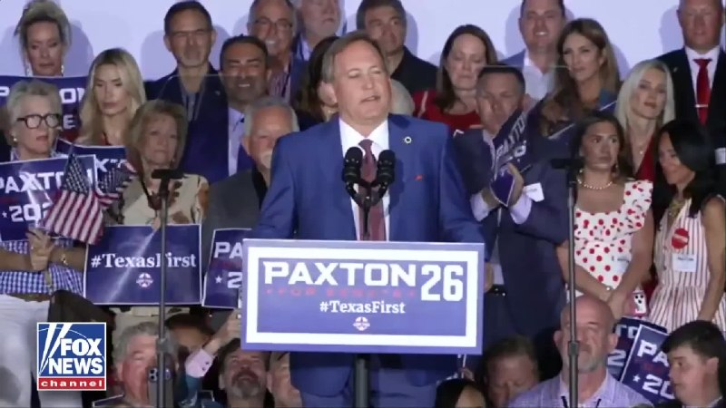

Fox News (Twitter/X)

“We just sent a Texas-sized message to Washington.”

Texas AG Ken Paxton speaks after defeating Sen. John Cornyn in Texas’ Republican Senate primary runoff, calling the victory a mandate for change inside the GOP.

Paxton now faces Democrat James Talarico in a race that is among a handful that could decide if the Republicans hold their slim 53-47 majority in the Senate.

## FoxNewsTwitter — post 342294

  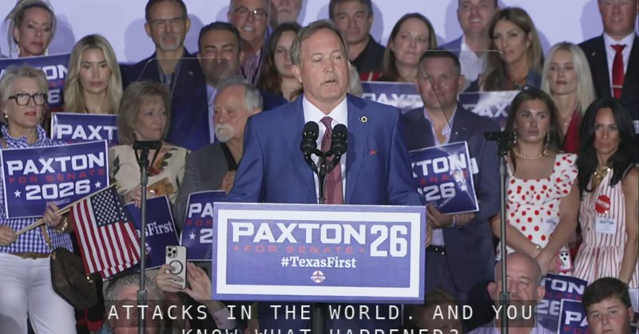

Fox News (Twitter/X)

WATCH LIVE: Trump-ally Ken Paxton speaks after defeating Senator Cornyn in GOP primary https://twitter.com/i/broadcasts/1pKdRRDwkjaJW

## pm_afshaa — post 91605

فرودگاه بین المللی تبریز فعالیت هاشو بعد 90 روز از سر گرفت

💧 Rainbet.com the #1 Non-KYC Crypto Casino & Sportsbook @rainbetcom

😁 @Pm_Afshaa

## IranIntlTV — post 339183

  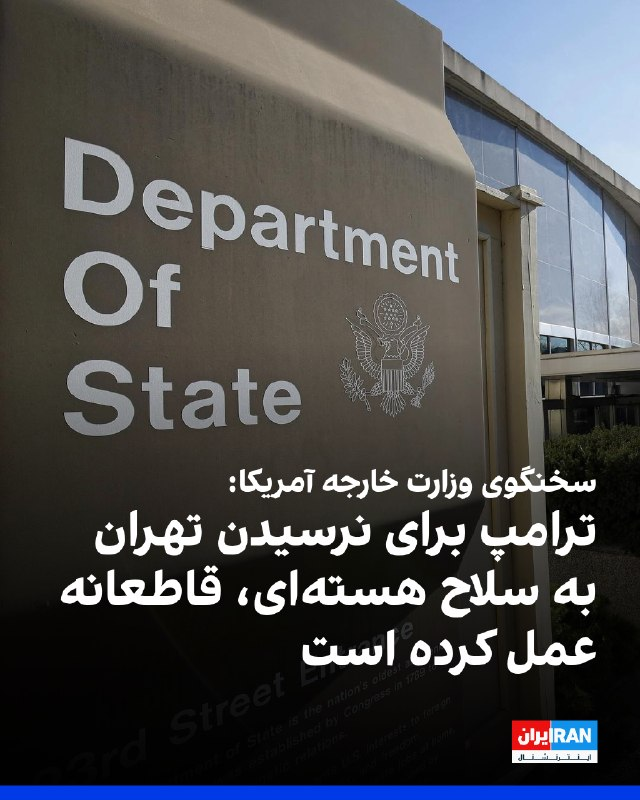

تامی پیگوت، سخنگوی وزارت خارجه آمریکا، در ایکس نوشت: «ترامپ از نخستین روز حضورش به‌روشنی اعلام کرده است که حکومت ایران نباید به سلاح هسته‌ای دست یابد. ترامپ برای اطمینان از اینکه جمهوری اسلامی هرگز به این هدف نرسد، اقدام‌های قاطعی انجام داده است.»
https://iranintl.com/202605272526

## IranIntlTV — post 339182

  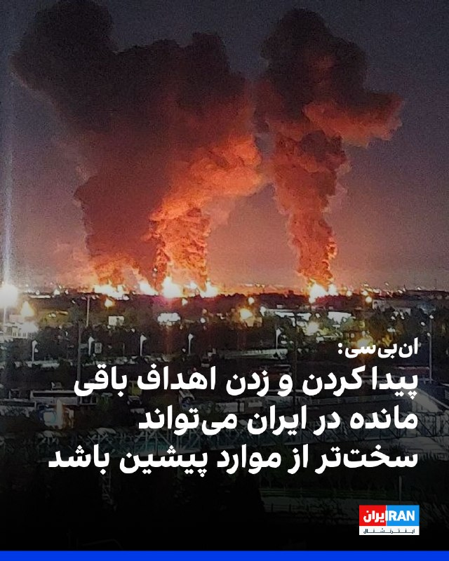

ان‌بی‌سی نیوز به نقل از مقام‌های آمریکایی و کارشناسان امنیت ملی گزارش داد در حالی که ترامپ تاکید می‌کند توافق با حکومت ایران نزدیک است و آمریکا توان نظامی جمهوری اسلامی را نابود کرده، پنتاگون فهرستی از اهداف را برای جنگ احتمالی تهیه کرده است که یافتن و زدن آنها می‌تواند بسیار دشوار باشد.
https://iranintl.com/202605271846

## IranIntlTV — post 339181

  

علی ربیعی، دستیار اجتماعی پزشکیان، گفت: «رفع محدودیت اینترنت یک بایدِ بنیادین بود. مایه تاسف است که صداوسیما در صف اول هجمه به این تصمیم ایستاده است.»
پس از ۸۸ روز تاریکی دیجیتال در ایران، دسترسی به اینترنت به تدریج برقرار شده است. نت‌بلاکس در ایکس اعلام کرد اتصال اینترنت در ایران افزایش بیشتری یافته و به ۸۶ درصد رسیده است، شبکه‌های موبایل و بخش‌های دیگری از اینترنت نیز دوباره به اینترنت جهانی متصل شده‌اند. نت‌بلاکس افزود «فیلترنت» همچنان برقرار است اما امکان دور زدن آن وجود دارد.
همچنین واتس‌اپ اکنون محدود شده و برای دسترسی به آن نیازمند فیلترشکن است. از سوی دیگر، برخی کاربران همچنان به اینترنت جهانی دسترسی ندارند.

https://iranintl.com/202605273087

## FarsiVOA — post 218775

  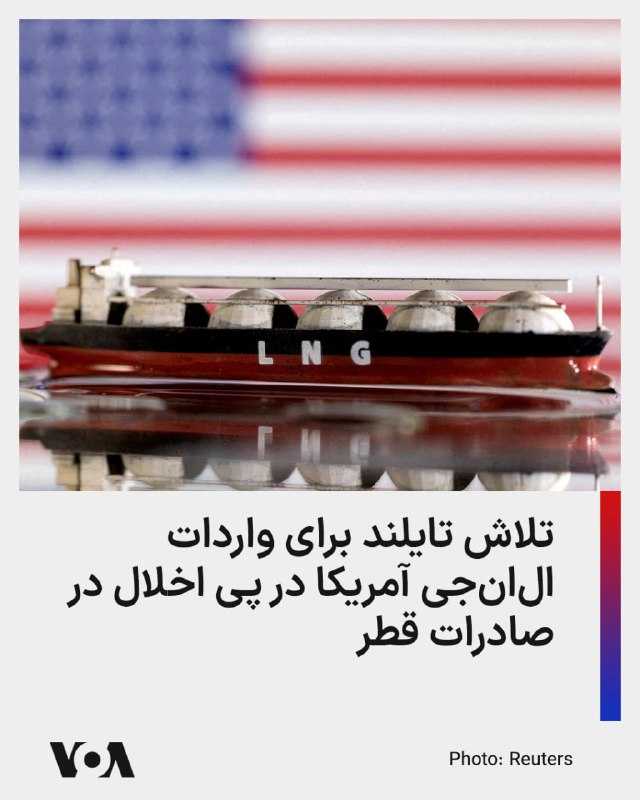

تایلند، مشتری سنتی گاز مایع قطر، در پی انسداد تنگه هرمز و آسیب حملات جمهوری اسلامی به تاسیسات گاز مایع قطر، مذاکرات برای توافق خرید بلندمدت گاز مایع (ال‌ان‌جی) آمریکا را تسریع کرده است.

خبرگزاری رویترز از قول منابع آگاه گزارش داده که مذاکرات با شرکت ونچر گلوبال آمریکا برای صادرات گاز مایع به تایلند برای ۱۵ سال یا بیشتر انجام می‌شود.

این کشور پیشتر نیز در تلاش برای تنوع بخشیدن به منابع واردات انرژی بود. اکتبر پارسال دولت آمریکا و تایلند اعلام کردند که شرکتهای تایلندی سالانه ۴.۵ میلیارد دلار انرژی، از جمله گاز مایع، از ایالات متحده خریداری خواهند کرد.

تایلند سالانه بیش از ۱۱ میلیون تن واردات ال‌ان‌جی دارد.
@FarsiVOA

## FarsiVOA — post 218774

🔺تهران ۱۰ ملوان هندی بازداشت‌شده در پرونده نفتکش «هاربر فینیکس» را آزاد کرد

▪️مقام‌های کشتیرانی هند اعلام کردند ۱۰ ملوان هندی که از ژوئیه ۲۰۲۵ پس از توقیف یک نفتکش در ایران بازداشت شده بودند، پس از «رایزنی‌های دیپلماتیک مستمر» آزاد شده‌اند.

▪️جزئیات بیشتری درباره علت بازداشت، روند قضایی یا شرایط آزادی این ملوانان اعلام نشده است.

▪️این ملوانان عضو خدمه کشتی «هاربر فینیکس» بودند؛ نفتکشی که در ژوئیه ۲۰۲۵ در نزدیکی بندر جاسک توقیف شد و خدمه کشتی پس از توقیف، در ایران «بازداشت، دستگیر و زندانی» شدند.

▪️خانواده برخی از این ملوانان پیش‌تر گفته بودند تماس محدودی با آنها داشته‌اند و درباره اتهام‌ها، روند حقوقی و زمان احتمالی آزادی‌شان اطلاعات روشنی دریافت نکرده‌اند.

⬇️ بیشتر بخوانید:
https://ir.voanews.com/a/8154426.html

## FarsiVOA — post 218773

🔺شورای امنیت حمله به نیروگاه هسته‌ای براکه امارات را محکوم کرد

▪️شورای امنیت سازمان ملل متحد در بیانیه‌ای مطبوعاتی، حمله پهپادی به نیروگاه هسته‌ای براکه در امارات متحده عربی را «به شدیدترین لحن» محکوم کرد و آن را نقض حقوق بین‌الملل دانست.

▪️اعضای شورای امنیت در این بیانیه، بدون نسبت دادن مسئولیت حمله به طرفی مشخص، تأکید کردند که این حمله خطری جدی برای جان غیرنظامیان، زیرساخت‌ها و محیط زیست ایجاد کرده است.

▪️این بیانیه پس از آن صادر شد که در هفته‌های اخیر مقام‌های امارات اعلام کردند چند پهپاد از خاک عراق به سوی این کشور پرتاب شده‌اند و یکی از آنها به یک ژنراتور برق در خارج از محدوده داخلی نیروگاه براکه برخورد کرده و باعث آتش‌سوزی شده است.

⬇️ بیشتر بخوانید:
https://ir.voanews.com/a/8154425.html

## FarsiVOA — post 218772

  

قیمت نفت روز چهارشنبه پس از جهش تند روز قبل عقب نشست؛ بازاری که هنوز میان ریسک ژئوپلیتیک و امید به پیشرفت مذاکرات آمریکا و ایران در نوسان است.

بهای نفت برنت با ۱.۴۳ درصد کاهش به ۹۸ دلار و ۱۶ سنت رسید و نفت وست تگزاس اینترمدیت هم با ۱.۷۷ درصد افت، ۹۲ دلار و ۲۳ سنت معامله شد.

این عقب‌نشینی پس از آن رخ داد که سه‌شنبه برنت، در واکنش به حملات تازه آمریکا به قایق‌های سپاه و کمرنگ شدن امید به بازگشایی کامل تنگه هرمز، حدود ۴ درصد بالا رفت و در ۹۹ دلار و ۵۸ سنت بسته شد.

در همان بازار، نفت آمریکا به‌دلیل تعدیل اثر تعطیلی دوشنبه، ۲.۸ درصد افت کرد. حالا نگاه معامله‌گران به دو متغیر اصلی است، سرنوشت مذاکرات و نشانه‌های عبور دوباره نفتکش‌ها و کشتی‌های گاز مایع از هرمز.

پیش از آغاز جنگ در ۲۸ فوریه، تصویر بازار کاملاً متفاوت بود. در نظرسنجی فوریه رویترز، میانگین قیمت برنت برای سال ۲۰۲۶ حدود ۶۳ دلار و نفت آمریکا ۶۰ دلار پیش‌بینی شده بود.
@FarsiVOA

## FarsiVOA — post 218771

⚡️کارایی پهپادهای ام‌کیو-۹ در عملیات خشم حماسی برنامه تولید نسل آینده پهپادهای پیشرفته و ارزانتر را شتاب بخشید
@FarsiVOA

## FarsiVOA — post 218770

  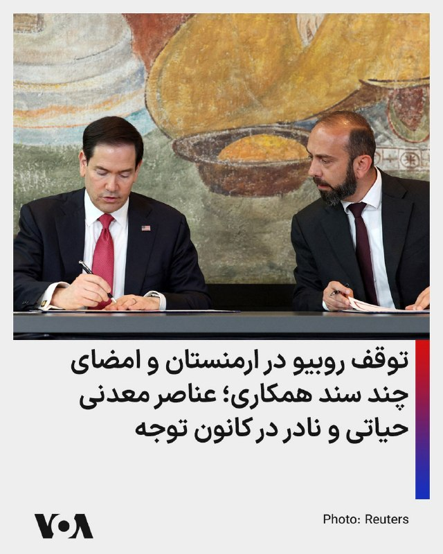

⚡️مارکو روبیو، وزیر امورخارجه آمریکا، روز سه‌شنبه در ارمنستان سند چارچوب توافق «جاده ترامپ برای صلح و رفاه بین‌المللی» را امضا کرد. آقای روبیو و همتای ارمنی او، آرارات میرزویان، همچنین سندی را در ارتباط با مواد معدنی حیاتی و نادر امضا کردند.

@FarsiVOA

## FarsiVOA — post 218769

  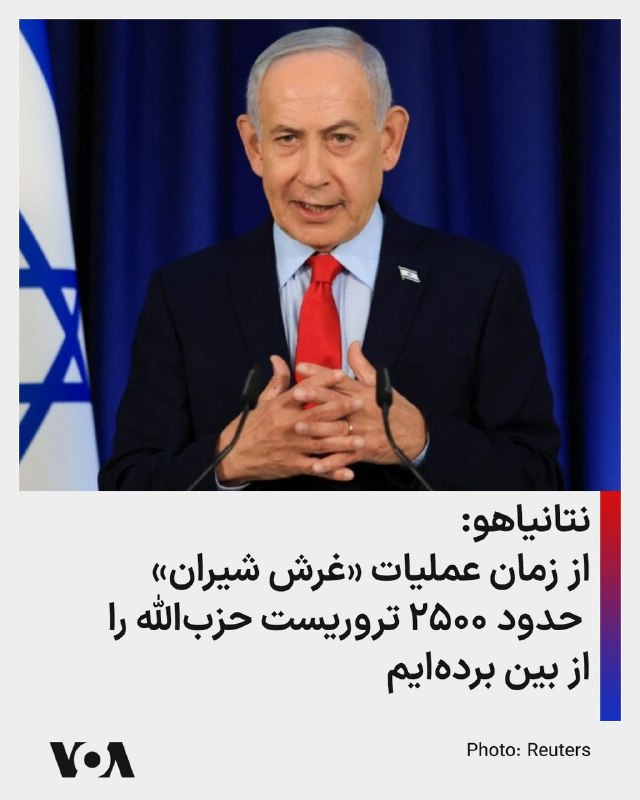

⚡️بنیامین نتانیاهو، نخست وزیر اسرائيل روز سه‌شنبه گفت از زمان عملیات «غرش شیران»، «ما تقریباً ۲۵۰۰ تروریست حزب‌الله را از بین برده‌ایم.» او افزود «تنها در طول آتش‌بس، ۷۰۰ تروریست حزب‌الله از بین رفتند، بیشتر از تعداد تروریست‌هایی که در کل جنگ دوم لبنان از بین رفتند.»
@FarsiVOA

## FarsiVOA — post 218768

⚡️ربودن افراد در خارج از کشور بخشی از رویه جمهوری اسلامی برای حذف مخالفان؛ گفت‌وگو با سعید دهقان
@FarsiVOA

## FarsiVOA — post 218767

⚡️پرزیدنت ترامپ در آستانه تصمیم‌گیری مهمی درباره ایران؛ گفت‌وگو با محمد قائدی
@FarsiVOA

## DW_Farsi — post 125176

  

🔶 شورای امنیت حمله به نیروگاه هسته‌ای امارات را محکوم کرد

شورای امنیت سازمان ملل حمله به نیروگاه هسته‌ای براکه در امارات متحده عربی را محکوم کرده و آن را نقض قوانین بین‌المللی دانست.

در بیانیه‌ای که روز سه‌شنبه ۵ خرداد ۱۴۰۵ (۲۶ مه) منتشر شد، شورای امنیت بدون اشاره مستقیم به عامل حمله اعلام کرد، هدف قرار دادن تاسیسات هسته‌ای غیرنظامی، "مغایر با حقوق بین‌الملل است".

امارات متحده عربی هفته گذشته اعلام کرده بود شش پهپاد از خاک عراق به سوی این کشور پرتاب شده‌اند که یکی از آن‌ها نیروگاه هسته‌ای براکه در خلیج فارس را هدف قرار داده است.

عراق محل فعالیت گروه‌های مسلح مورد حمایت جمهوری اسلامی است؛ گروه‌هایی که در جریان جنگ آمریکا و اسرائیل با ایران، مسئولیت حمله به آنچه "پایگاه‌های دشمن در عراق و منطقه" خوانده‌اند را برعهده گرفته بودند.

نیروگاه براکه نخستین نیروگاه هسته‌ای جهان عرب به شمار می‌رود و حمله به آن نگرانی‌هایی درباره امنیت تاسیسات هسته‌ای در بحبوحه تنش‌های منطقه‌ای را افزایش داده است.

@dw_farsi

## DW_Farsi — post 125175

  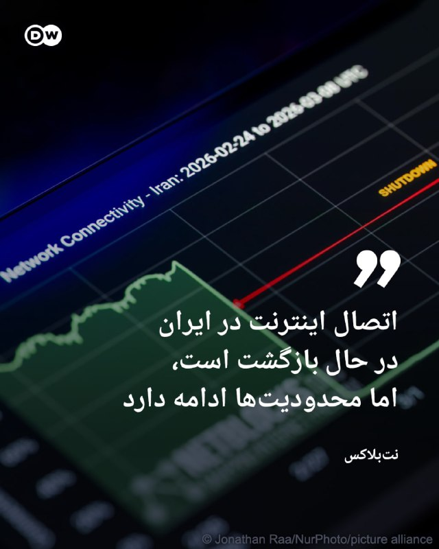

🔶نت‌بلاکس: اتصال اینترنت در ایران در حال بازگشت است، اما محدودیت‌ها ادامه دارد

نت‌بلاکس، نهاد ناظر بر اینترنت اعلام کرده است که دسترسی به اینترنت جهانی در ایران، پس از هفته‌ها محدودیت و اختلال گسترده، دوباره در حال افزایش است؛ هرچند همچنان بخشی از کاربران با محدودیت یا قطع ارتباط روبه‌رو هستند.

نت‌بلاکس در پیامی در شبکه اجتماعی ایکس (توییتر سابق) نوشت، شاخص‌های فنی نشان می‌دهد اتصال شبکه‌های موبایل و برخی بخش‌های دیگر اینترنت ایران به شبکه جهانی، بار دیگر در حال برقراری است.

با این حال، این نهاد تاکید کرده که فیلترینگ همچنان برقرار است و کاربران برای دسترسی به برخی وب‌سایت‌ها و شبکه‌های اجتماعی، ناچار به استفاده از ابزارهای دور زدن محدودیت‌ها هستند.

بر اساس این گزارش، دسترسی به واتس‌اپ نیز اکنون با محدودیت روبه‌رو شده و استفاده از این پیام‌رسان بدون ابزارهای عبور از فیلترینگ، برای بسیاری از کاربران ممکن نیست.

@dw_farsi

## DW_Farsi — post 125174

  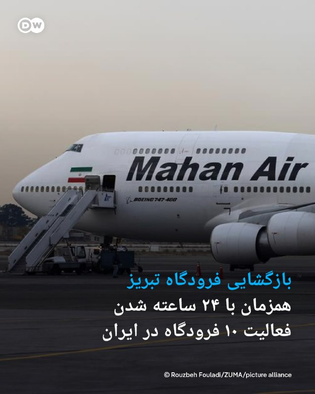

🔶بازگشایی فرودگاه تبریز همزمان با ۲۴ ساعته شدن ۱۰ فرودگاه در ایران

سازمان هواپیمایی کشوری ایران اعلام کرده فرودگاه بین‌المللی تبریز، پس از آسیب‌دیدگی در جریان جنگ ۱۲ روزه، دوباره بازگشایی شده و از چهارشنبه ۶ خرداد فعالیت خود را از سر می‌گیرد.

مجید اخوان، سخنگوی این سازمان، اعلام کرده است که بخش‌هایی از فرودگاه، از جمله باند پروازی و برج مراقبت، در جریان جنگ آسیب دیده بودند، اما عملیات بازسازی انجام شده و فرودگاه اکنون آماده پذیرش پروازهای داخلی و خارجی است.

هم‌زمان، سازمان هواپیمایی کشوری از ۲۴ ساعته شدن فعالیت ۱۰ فرودگاه کشور، از جمله "مهرآباد، امام خمینی و مشهد" خبر داده است.

فرودگاه بین‌المللی تبریز یکی از مهم‌ترین مراکز هوانوردی شمال‌غرب ایران و از فرودگاه‌های پرتردد کشور به شمار می‌رود. پیش از جنگ، این فرودگاه پروازهایی به چند مقصد داخلی و خارجی، از جمله استانبول، نجف، باکو و دبی داشت.

@dw_farsi

## DW_Farsi — post 125173

🔶 ازدواج "جان‌فداها"؛ نقاب رمانتیک حکومت بر بحران عمیق مشروعیت

🔻 گزارشی از الینا فرهادی

صدای بوق‌های ممتد و هیاهوی ساختگی، سکوت سنگین غروب میادین اصلی شهر تهران را می‌شکند. چند ده خودروی جیپ و تاکتیکی نظامی که بدنه زمخت و سبزرنگشان با تورها و روبان‌های سفید و صورتی تزیین شده، به ردیف ایستاده‌اند.

داخل خودروها زوج‌هایی که رسانه‌های رسمی آن‌ها را "جان‌فدا" می‌نامند، نشسته‌اند.

خیابان، یعنی همان فضایی که تا دیروز صحنه تقابل سنگین بر سر سبک زندگی، پوشش و اعتراض بود، حالا به یک "کلوپ بزرگ عروسی ایدئولوژیک" تبدیل شده است.

حاکمیت سفره‌های عقد را از سالن‌های خصوصی به آسفالت سرد میادین اصلی شهر آورده تا پیوند دو انسان را به یک بیانیه سیاسی تمام‌عیار بدل کند.

اما در پس این کارناوال‌های سازمان‌یافته، در کشوری که هنوز سایه جنگ و آتش‌بس شکننده بر آن سنگینی می‌کند، میانگین سن ازدواج به بالاترین حد خود در ده‌ها سال اخیر رسیده و تورم، تشکیل خانواده را برای میلیون‌ها جوان به یک رویای دست‌نیافتنی تبدیل کرده، این تئاترهای خیابانی چه پیام رسانه‌ای دارند؟

آیا جمهوری اسلامی در حال بازتعریف خانواده به‌عنوان نهادی ایدئولوژیک است؟ آیا "زوج‌های جان‌فدا" نسخه‌ای تازه از همان روایت بسیج اجتماعی دهه شصت‌اند؟

@dw_farsi

## Persian_Trend_Official — post 15105

کسانی که اینترنتشون تازه وصل شده یا قبلا سرعت اینترنت یاری نمیکرده
اگر این ویدیو رو ندیدید توضیه میکنم ببینید تا بدونید احتمالا یک سال اینده قراره جمهوری اسلامی چه چالش هایی داشته باشه

https://youtu.be/8YQ1YcLyw6E

## Persian_Trend_Official — post 15101

عکس‌های منتشرشده از سوی فرماندهی مرکزی آمریکا، سنتکام، نشان می‌دهد یک فروند جنگنده پنهانکار اف-۲۲ رپتور متعلق به بال یکم جنگنده نیروی هوایی آمریکا مستقر در پایگاه لانگلی ویرجینیا، در حال سوخت‌گیری هوایی بر فراز نقطه‌ای اعلام‌نشده در خاورمیانه است.

در این تصاویر، اف-۲۲ در کنار یک فروند هواپیمای سوخت‌رسان KC-135T Stratotanker دیده می‌شود؛ هواپیمایی که به بال ۱۷۱ سوخت‌رسانی هوایی گارد ملی هوایی پنسیلوانیا اختصاص دارد.

انتشار این تصاویر از سوی سنتکام در شرایطی انجام می‌شود که حضور جنگنده‌های نسل پنجم آمریکا در منطقه، معمولاً به‌عنوان بخشی از پیام بازدارندگی، نمایش آمادگی عملیاتی و پشتیبانی از مأموریت‌های هوایی بلندبرد تفسیر می‌شود. اف-۲۲ رپتور عمدتاً برای برتری هوایی، نفوذ در محیط‌های پرخطر و مقابله با تهدیدهای پیشرفته طراحی شده و سوخت‌گیری هوایی، امکان ماندگاری و عملیات طولانی‌تر آن در منطقه را فراهم می‌کند.

📌 @persian_trend_official
پرشین ترند | متفاوت‌ترین کانال نظامی

## Persian_Trend_Official — post 15100

  <a href="telegram/content/Persian_Trend_Official_15100_1779862009.mp4" target="_blank">🎬 Download video</a>

برنده های جنگ بلد خجالتی 😄
خب با این بنده خداها حرف بزنید
بگید چند ماه بیخودی سرکارشون گذاشتید و مثل همیشه لاف پیروزی زدید

اخرش که چی ؟
متن رو که همه میخونن ...

📌 @persian_trend_official
پرشین ترند | متفاوت‌ترین کانال نظامی

## Persian_Trend_Official — post 15099

  

حق ++

📌 @persian_trend_official
پرشین ترند | متفاوت‌ترین کانال نظامی

## Persian_Trend_Official — post 15098

  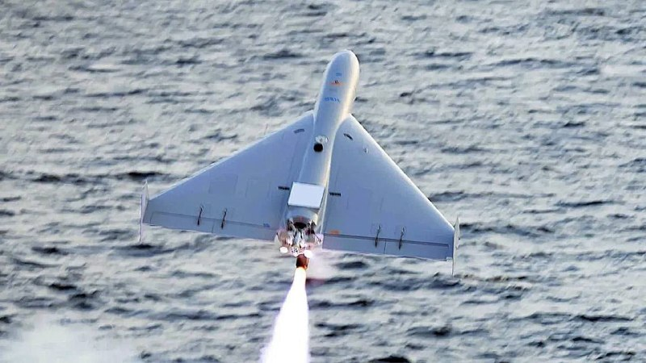

💢رویترز گزارش می‌دهد که استارلینک،هزینه استفاده استارلینک در پهپادهای تهاجمی یک‌بارمصرف LUCAS را ۵ برابر افزایش داده است.

💢پنتاگون در حال حاضر برای هر پهپاد ۵۰۰۰ دلار بابت اتصال استارلینک پرداخت می‌کرد، اما اکنون با این افزایش قیمت، با پرداخت ۲۵۰۰۰ دلار برای هر پهپاد موافقت کرده است.

💢پهپاد LUCAS به‌طور تقریبی حدود ۳۰۰۰۰ دلار برای هر واحد هزینه دارد، اما حالا که ترمینال‌های استارلینک ۲۰۰۰۰ دلار دیگر به هزینه اضافه کرده‌اند، صرفه‌اقتصادی این پهپاد به‌شدت کاهش پیدا می‌کند و ممکن است باعث شود پنتاگون طراحی یا پلتفرم آن را مورد بازنگری قرار دهد.

🫆:Tony

📌 @persian_trend_official
پرشین ترند | متفاوت‌ترین کانال نظامی

## Persian_Trend_Official — post 15097

  <a href="telegram/content/Persian_Trend_Official_15097_1779862014.mp4" target="_blank">🎬 Download video</a>

صبحتون بخیر ☕️🤍

📝 Nick
📌 @persian_trend_official
پرشین ترند | متفاوت‌ترین کانال نظامی

## RadioFarda — post 157593

🔸مارکو روبیو، وزیر خارجه آمریکا، کمتر از دو هفته مانده به انتخابات پارلمانی ارمنستان، در جریان توقفی کوتاه در فرودگاه ایروان، از نیکول پاشینیان، نخست‌وزیر ارمنستان، حمایت کرد. 🔸روبیو، روز سه‌شنبه پنجم خرداد، هنگام بازگشت از گفت‌وگوهای چندجانبه در هند، در…

## RadioFarda — post 157592

  

🔸مارکو روبیو، وزیر خارجه آمریکا، کمتر از دو هفته مانده به انتخابات پارلمانی ارمنستان، در جریان توقفی کوتاه در فرودگاه ایروان، از نیکول پاشینیان، نخست‌وزیر ارمنستان، حمایت کرد.

🔸روبیو، روز سه‌شنبه پنجم خرداد، هنگام بازگشت از گفت‌وگوهای چندجانبه در هند، در توقفی کوتاه برای سوخت‌گیری با آرارات میرزویان، وزیر خارجه ارمنستان، دیدار کرد.

🔸او در کنار آقای میرزویان گفت: «شما، نخست‌وزیر و کل تیم‌تان در ارمنستان، در حال گشودن راه به‌سوی آینده‌ای روشن‌تر و مستقل‌تر برای ارمنستان هستید.»

🔸مارکو روبیو افزود: «بسیار خوشحالم که این‌جا هستم تا حمایت خود را از شجاعت، چشم‌انداز، تعهد و آمادگی آن‌ها برای نگاه به آیندهٔ کشورشان و اقداماتی که برای رسیدن به آن لازم است، نشان دهم.»

@RadioFarda

## RadioFarda — post 157591

🔸روزنامه وال‌استریت جورنال در گزارشی به نقل از مقام‌های ایرانی و میانجی‌های عرب، نوشته جمهوری اسلامی در مذاکرات با آمریکا به‌دنبال کسب «گشایش مالی» و همزمان، جلوگیری از «اعلام پیروزی» دونالد ترامپ است. 🔸این مقام‌ها «دو هدف به‌هم‌پیوسته» ایران در جریان مذاکرات…

## RadioFarda — post 157590

  

🔸روزنامه وال‌استریت جورنال در گزارشی به نقل از مقام‌های ایرانی و میانجی‌های عرب، نوشته جمهوری اسلامی در مذاکرات با آمریکا به‌دنبال کسب «گشایش مالی» و همزمان، جلوگیری از «اعلام پیروزی» دونالد ترامپ است.

🔸این مقام‌ها «دو هدف به‌هم‌پیوسته» ایران در جریان مذاکرات را به این صورت تشریح کرده‌اند: «به‌دست آوردن گشایش مالی برای اقتصادی که تحت فشار شدید قرار دارد، بدون آنکه در برنامه هسته‌ای خود آن‌قدر عقب‌نشینی کند که ترامپ بتواند ادعای پیروزی کند.»

🔸اواخر دوشنبه، فرماندهی مرکزی آمریکا، سنتکام، به قایق‌های تندروی ایرانی که به گفته واشینگتن در حال مین‌گذاری در تنگه هرمز بودند، حمله کرد. ایران نیز با شلیک به هواپیماهای آمریکایی پاسخ داد و آمریکا در واکنش، سایت‌های پرتاب موشک در ایران را هدف قرار داد.

🔸این تبادل آتش پس از پیام‌های متناقض ترامپ در آخر هفته رخ داد. او پس از آنکه شنبه گفت توافق با تهران تا حد زیادی نهایی شده، در پی انتقاد برخی جمهوری‌خواهان سنا از چارچوب توافق، ظاهراً موضع خود را تغییر داد.

@RadioFarda

## RadioFarda — post 157589

مقام پیشین پنتاگون: آمریکا در درگیری با ایران «کم‌ضررترین» گزینه را انتخاب می‌کند  

🔸ایالات متحده و ایران ظاهراً به دستیابی به توافقی برای پایان دادن به جنگ نزدیک شده‌اند، هرچند توافق نهایی هنوز قریب‌الوقوع به نظر نمی‌رسد و برخی جزئیات کلیدی هنوز حل‌وفصل نشده‌اند.

🔸بر اساس گزارش‌ها، توافق در حال شکل‌گیری منجر به بازگشایی تنگه هرمز به‌عنوان یکی از مسیرهای حیاتی انتقال نفت جهان خواهد شد، اما مذاکرات پیرامون برنامهٔ هسته‌ای ایران را به مرحله‌ٔ بعد موکول می‌کند.

🔸جیسون اچ. کمپبل، پژوهشگر ارشد مؤسسهٔ خاورمیانه و مقام پیشین پنتاگون در دورهٔ نخست ریاست‌جمهوری دونالد ترامپ، در گفت‌وگو با رادیو اروپای آزاد/رادیو آزادی می‌گوید توافقِ گزارش‌شده «احتمالاً کم‌ضررترین گزینه‌ای است که در حال حاضر در اختیار دولت آمریکا قرار دارد.»

🔸 گزارش کامل را در وب‌سایت رادیوفردا بخوانید.

@RadioFarda

## BBCPersian — post 282159

🔻به دلیل جنگ ایران، قیمت انرژی برای خانوارها در بریتانیا افزایش خواهد یافت

🔻قیمت انرژی برای خانوارها در بریتانیا از ماه ژوئیه با افزایش قابل‌توجهی روبه‌رو خواهد شد. این نخستین تأثیر مستقیم جهش قیمت‌ها به دلیل جنگ ایران برای مصرف‌کنندگان برق و گاز در بریتانیا خواهد بود.

نهاد تنظیم‌گر بازار انرژی بریتانیا، روز چهارشنبه جزئیات سقف جدید قیمت انرژی را منتشر می‌کند که میلیون‌ها خانوار دارای تعرفه‌های متغیر در انگلستان، اسکاتلند و ولز را تحت تأثیر قرار خواهد داد.

تحلیلگران پیش‌بینی می‌کنند که سقف جدید حدود ۱۳ درصد بالاتر از نرخ فعلی باشد. در این صورت، خانوارهایی با مصرف متوسط گاز و برق سالانه حدود ۲۰۹ پوند بیشتر پرداخت خواهند کرد و هزینه سالانه انرژی آن‌ها به حدود هزار و ۸۵۰ پوند خواهد رسید.

اعلام این افزایش هم‌زمان با موج گرمای بی‌سابقه در بخش‌های وسیعی از بریتانیاست، اما کارشناسان می‌گویند خانوارها می‌توانند از هم‌اکنون برای کاهش هزینه‌های ماه‌های آینده اقدام کنند.

سقف قیمت انرژی هر سه ماه یک‌بار تعیین می‌شود. قبوض انرژی خانوارها بین آوریل تا ژوئیه، پس از اصلاح ساختار هزینه‌ها از سوی دولت، حدود ۷ درصد کاهش یافته بود. این تغییر اندکی پیش از آغاز درگیری‌ها در ایران اعلام شد. با این حال، سقف قیمت برای دوره ژوئیه تا سپتامبر، بازتاب‌دهنده افزایش ۲۵ درصدی بهای جهانی گاز در پی جنگ خواهد بود. افزایشی که به‌ویژه ناشی از اختلال جدی در تردد کشتی‌ها از تنگه هرمز است.

دولت بریتانیا اعلام کرده در حال بررسی برنامه‌هایی برای حمایت هدفمند از اقشار آسیب‌پذیر است.

https://bbc.in/4tWBPn2
@BBCPersian

## BBCPersian — post 282158

  

🔻به گفته سخنگوی سازمان هواپیمایی کشوری ایران، فرودگاه بین‌المللی تبریز که در جریان جنگ اخیر آسیب دیده بود، از امروز (چهارشنبه، ششم خرداد) فعالیت خود را از سر می‌گیرد.

مجید اخوان در گفت‌وگو با رسانه‌های داخلی ایران گفته است که نخستین پرواز این فرودگاه پس از پایان عملیات بازسازی انجام خواهد شد.

به گفته او، فرودگاه تبریز بیست‌ویکمین فرودگاهی است که پس از پایان درگیری‌ها دوباره وارد چرخه عملیاتی می‌شود.

رسانه‌های داخلی ایران در هفته‌های گذشته گزارش داده بودند که در حملات به تبریز، باند و برج مراقبت این فرودگاه آسیب دیده است.

فرودگاه تبریز در کنار فرودگاه‌های مهرآباد، مشهد و امام از مهم‌ترین فرودگاه‌های ایران محسوب می‌شود و به حدود ۹ مقصد خارجی از جمله استانبول، بغداد، دوبی، باکو و هامبورگ پرواز دارد.

📷MEHR
@bbcpersian

## BBCPersian — post 282157

  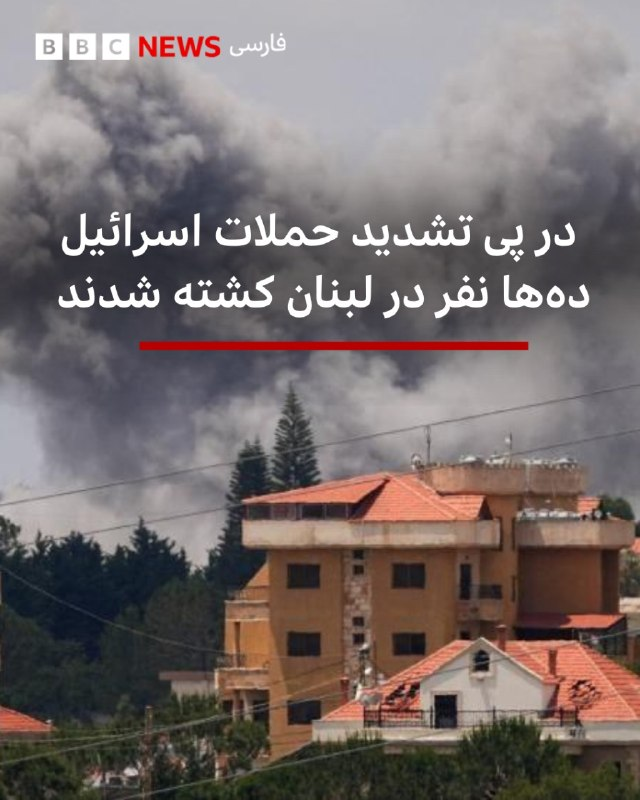

🔻در پی موج جدید حملات اسرائيل به جنوب و شرق لبنان ده‌ها نفر کشته شدند.

این حملات گسترده در نقاط مختلف لبنان پس از آن انجام شد که بنيامين نتانياهو، نخست وزير اسرائيل، دستور تشديد اقدام نظامی عليه حزب‌الله را داد.

وزارت بهداشت لبنان روز سه‌شنبه اعلام کرد که در تازه‌ترين موج حملات دست کم ۳۱ نفر، از جمله چند کودک، جان باخته‌اند.

ارتش اسرائيل گفته است بيش از ۱۰۰ زيرساخت و محل استقرار حزب‌ الله را هدف قرار داده است. حملات تازه از زمان آغاز آتش‌بس با ميانجيگری آمريکا در اواسط آوريل، از سنگين‌ترين شب‌های بمباران به شمار می‌رود.

آقای نتانیاهو روز سه‌شنبه در نشست کابينه امنيتی گفت اسرائيل «در حال گسترش عمليات خود در لبنان» است.

او افزود: «ارتش اسرائیل با نيروهای گسترده در ميدان عمل می‌کند و مناطق راهبردی را در اختيار می‌گيرند.»او همچنين گفت اسرائيل در حال «تقويت منطقه امنيتی» برای حفاظت از شهرک‌های شمالی اسرائيل در برابر حملات حزب الله است.

لینک خبر:

📷Reuters
https://bbc.in/3PMVmbE

@BBCPersian

## BBCPersian — post 282156

🔻ناسا از گام‌های بعدی برای ساخت پايگاه دائمی در ماه رونمايی کرد

ناسا جزئيات فرودگرهای رباتيک، پهپادهای جهنده و خودروهايی را منتشر کرده که قصد دارد در چارچوب برنامه آمريکا برای ساخت پايگاه در ماه، به سطح اين قمر بفرستد.

شرکت فضايی بلو اوريجين متعلق به جف بزوس، بنيانگذار آمازون، يکی از چند شرکتی است که برای ساخت اين تجهيزات انتخاب شده‌اند.

آمریکا می‌خواهد پيش از پايان دوره رياست جمهوری دونالد ترامپ در سال ۲۰۲۸، بار ديگر فضانوردان آمريکايی را به ماه بازگرداند.

اما ناسا در رقابت با چين برای بازگرداندن انسان به سطح ماه قرار دارد و همين مسئله باعث شده اين سازمان فضايی تحت فشار باشد تا نشان دهد در «رقابت جديد فضايی» پيشتاز است.

چين نيز با سرعت برنامه‌های خود را برای فرود انسان بر ماه تا سال ۲۰۳۰ پيش می‌برد.

اين کشور روز دوشنبه فضاپيمای «شنژو-۲۳» را پرتاب کرد و گروهی از فضانوردان را به ايستگاه فضايی «تيانگونگ» فرستاد.

ناسا در ماه مارس از برنامه‌ای ۲۰ ميليارد دلاری برای ساخت يک پايگاه دائمی در قطب جنوب ماه تا سال ۲۰۳۲ خبر داده بود؛ پايگاهی که با انرژی هسته‌ای و خورشيدی فعاليت خواهد کرد.

جرد آيزاکمن، رئيس ناسا، روز سه‌شنبه گفت اين اعلام‌ها به اين معناست که آمريکا «ديگر هرگز ماه را واگذار نخواهد کرد.»

https://bbc.in/3PMVmbE
@bbcpersian

## BBCPersian — post 282147

🔻انقلاب فرهنگی چین، که از آغاز آن شش دهه می‌گذرد، یکی از تاریک‌ترین دوره‌های تاریخ این کشور بود.

در سال ۱۹۶۶، مائو تسه‌تونگ، رهبر کمونیست چین، کارزاری ملی را آغاز کرد تا آنچه را در حکومت، آموزش و هنر «عناصر ضد انقلاب»، «نفوذ سرمایه‌داری» و «تفکر بورژوایی» خوانده می‌شد، پاکسازی کند.

مائو در حقیقت علیه گذشته و آنچه «اندیشه‌های کهنه» و «آداب و رسوم کهنه» نامیده می‌شد، اعلام جنگ کرده بود.

قرار نبود بار اصلی این نبرد بر دوش پلیس یا نهادهای امنیتی باشد؛ بلکه ماموریت بر عهده شهروندان عادی، به‌ویژه جوانان، گذاشته شده بود تا علیه هم‌وطنان خود وارد عمل شوند.

یافنگ شیا، تاریخ‌دان و استاد دانشگاه لانگ آیلند در آمریکا، توضیح می‌دهد: «پیام مائو این بود: علیه استاد دانشگاهتان، علیه معلمتان، علیه رهبر حزبی‌تان، علیه مافوقتان و علیه مدیران کارخانه‌ها شورش کنید. شورش موجه است.»

برای خواندن مطلب کامل:
https://bbc.in/4a6teqH
📸GettyImages/Gamma-Rapho via Getty Images/ AFP
@bbcpersian

## idfinfarsi — post 11654

  <a href="telegram/content/idfinfarsi_11654_1779862019.mp4" target="_blank">🎬 Download video</a>

مستند ویژه: تکمیل چرخه شناسایی و هدف قرار دادن یک تروریست که هواگرد بدون سرنشین را در جنوب لبنان هدایت می‌کرد

در چارچوب فعالیت نیروهای ارتش اسرائیل در جنوب لبنان، یک هواگرد از نیروی هوایی، یک هواگرد بدون سرنشین را در آسمان شناسایی کرد که تهدیدی برای نیروهای ما در منطقه محسوب می‌شد.

این هواگرد بدون سرنشین فرود آمد و یک تروریست از سازمان تروریستی حزب‌الله برای جمع‌آوری آن به محل رسید. در یک واکنش سریع، هواگرد نیروی هوایی به محل حمله کرده و این تروریست را به هلاکت رساند.

نیروی هوایی به فعالیت خود برای دفاع و پشتیبانی از نیروهای ما در جنوب لبنان ادامه خواهد داد.

## idfinfarsi — post 11650

  <a href="telegram/content/idfinfarsi_11650_1779862021.mp4" target="_blank">🎬 Download video</a>

ارتش اسرائیل و شاباک محمد عوده، رئیس شاخه نظامی سازمان تروریستی حماس که پس از به هلاکت رسیدن عزالدین حداد منصوب شده بود و همچنین رئیس ستاد اطلاعات سازمان تروریستی حماس بود را به هلاکت رساندند

⭕️ سخنگوی ارتش اسرائیل و شاباک اعلام کردند که در حمله‌ای در شمال نوار غزه، تروریست محمد عوده که به‌عنوان رئیس شاخه نظامی سازمان تروریستی حماس پس از به هلاکت رسیدن عزالدین حداد منصوب شده بود و همچنین ریاست ستاد اطلاعات این سازمان را بر عهده داشت، به هلاکت رسید.

🔻 در چارچوب عملیات مشترک ارتش اسرائیل و شاباک برای حذف این تروریست، چندین ساختمان در قلب شهر غزه که به‌عنوان محل اختفای او مورد استفاده قرار می‌گرفت، هدف قرار گرفت. این اقدام پس از ماه‌ها رصد اطلاعاتی برای شناسایی الگوهای رفت‌وآمد او و همکارانش انجام شد. همزمان، یک آپارتمان متعلق به یک تروریست حماس که در ۷ اکتبر در حمله مشارکت داشت و بخشی از حلقه پشتیبانی عوده بود، نیز هدف قرار گرفت.

⭕️ عوده در دو هفته گذشته رئیس شاخه نظامی سازمان تروریستی حماس بود و در سال‌های اخیر نیز ریاست ستاد اطلاعات این سازمان را بر عهده داشت. وی در این چارچوب مسئول برنامه‌ریزی و هماهنگی ا

## alonews — post 122969

  <a href="telegram/content/alonews_122969_1779862023.webm" target="_blank">🎬 Download video</a>

👈احتمال شنیدن صدای انفجار کنترل‌شده در اصفهان

✅ @AloNews خبر جنگ

## alonews — post 122968

  <a href="telegram/content/alonews_122968_1779862023.webm" target="_blank">🎬 Download video</a>

👈هاآرتص: عربستان سعودی و قطر نسبت به درخواست ترامپ برای پیوستن به توافق‌های ابراهیم محتاط هستند؛ این موضوع نیازمند تعهد به تشکیل دولت فلسطین است.

✅ @AloNews خبر جنگ

## alonews — post 122967

  <a href="telegram/content/alonews_122967_1779862024.webm" target="_blank">🎬 Download video</a>

👈وال‌استریت ژورنال: در مذاکرات با ایالات متحده، ایران می‌خواهد کنترل بخشی از حدود ۱۰۰ میلیارد دلار دارایی‌های مسدودشده توسط غرب را دوباره به دست بگیرد و همچنین به بازارهای جهانی نفت دسترسی پیدا کند.

✅ @AloNews خبر جنگ

## alonews — post 122966

  <a href="telegram/content/alonews_122966_1779862024.webm" target="_blank">🎬 Download video</a>

👈طی روز‌های اخیر حدود ۱۰۰ اداره و بانک به‌دلیل رعایت نکردن الگوی مصرف، مشمول محدودیت برق شده‌اند

✅ @AloNews خبر جنگ

## alonews — post 122965

  <a href="telegram/content/alonews_122965_1779862024.mp4" target="_blank">🎬 Download video</a>

👈انفجار مخزن مواد شیمیایی در ایالت واشنگتن

🔴 در پی وقوع حادثه‌ای صنعتی در ایالت واشنگتن آمریکا، دست‌کم 1 نفر جان باخت و 9 کارگر دیگر همچنان مفقود هستند.

🔴 این حادثه چهارشنبه در یک کارخانه تولید کاغذ و بسته‌بندی رخ داد و نگرانی‌هایی درباره نشت مواد خطرناک شیمیایی به وجود آورده است.

✅ @AloNews خبر جنگ

## alonews — post 122964

  <a href="telegram/content/alonews_122964_1779862025.webm" target="_blank">🎬 Download video</a>

👈پهپادهای اوکراینی پایگاه هوایی تگانرونگ در روسیه را هدف قرار دادند

✅ @AloNews خبر جنگ

## alonews — post 122963

  <a href="telegram/content/alonews_122963_1779862026.webm" target="_blank">🎬 Download video</a>

👈تصویر روز رویترز از کشتی های پهلو گرفته در نزدیکی تنگه هرمز، سمت ساحل عمان

✅ @AloNews خبر جنگ

## alonews — post 122962

  <a href="telegram/content/alonews_122962_1779862026.webm" target="_blank">🎬 Download video</a>

👈فرودگاه بین‌المللی تبریز بازگشایی شد

✅ @AloNews خبر جنگ

## alonews — post 122961

  <a href="telegram/content/alonews_122961_1779862026.webm" target="_blank">🎬 Download video</a>

👈فارس: بیش از ۲۰۰ فروند کشتی در یک هفته گذشته از تنگه هرمز عبور کرده‌اند

🔴 اولویت عبور برای کشتی‌های فله‌بر و حامل کود است، اما برخی تردد‌های مجوزدار را به‌نوعی آزادسازی عبورو مرور از این آبراه تلقی می‌کنند

✅ @AloNews خبر جنگ

## alonews — post 122960

  <a href="telegram/content/alonews_122960_1779862027.webm" target="_blank">🎬 Download video</a>

👈زنگنه، نماینده مجلس: آمریکا حق غنی‌سازی، حاکمیت ایران بر تنگه هرمز و رفع تحریم‌ها را پذیرفت

✅ @AloNews خبر جنگ

## alonews — post 122959

  <a href="telegram/content/alonews_122959_1779862027.webm" target="_blank">🎬 Download video</a>

👈مدیر عامل شرکت برق: برق 100 اداره در تهران رو به‌دلیل عدم‌رعایت الگوی مصرف قطع کردیم

✅ @AloNews خبر جنگ

<!-- MSG END -->

<!-- NAV START -->

<a href="https://github.com/drsploit/aio-DL/blob/main/telegram/content/archive_1.md" style="display:inline-block; padding:6px 12px; margin:0 4px; background-color:#2ea44f; color:white; text-decoration:none; border-radius:4px; font-weight:bold;">صفحه بعد</a>

<!-- NAV END -->
