# خواننده تلگرام

<!-- TOP_NAV START -->

<a href="https://github.com/drsploit/aio-DL/blob/main/telegram/content/archive_1.md" style="display:inline-block; padding:6px 12px; margin:0 4px; background-color:#2ea44f; color:white; text-decoration:none; border-radius:4px; font-weight:bold;">صفحه بعد</a>

<!-- TOP_NAV END -->

<!-- MSG START -->

---
📅 بروزرسانی: 1405/03/07 12:23
---

## VahidOOnLine — post 242549

  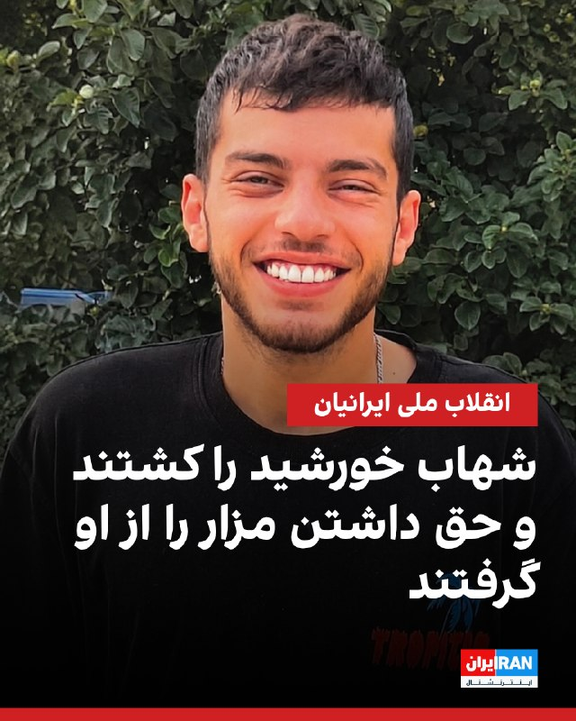

شهاب خورشید، ۲۲ ساله و دانشجوی رشته معماری، شامگاه ۱۹ دی‌ماه حوالی ساعت ۲۲ در جریان اعتراضات میدان کاج سعادت‌آباد تهران هدف شلیک گلوله ماموران امنیتی قرار گرفت و در همان محل جان باخت.

بر اساس گزارش‌های رسیده به ایران‌اینترنشنال، گلوله از پشت کتف به او اصابت کرد و دو گلوله جنگی قلب و ریه‌هایش را هدف قرار داد.

شهاب در محل حادثه جان باخت و پیکرش روز بعد در کهریزک به خانواده تحویل داده شد.

به گفته دوستانش، این جوان پیش از پیوستن به تجمعات گفته بود: «مگر خون من از دیگران رنگین‌تر است که در خانه بمانم؟ یا همه‌چیز تغییر می‌کند، یا من هم می‌میرم.»

شهاب خورشید فرزند دوم خانواده و اصالتا اهل اهواز بود. او از بدو تولد با بیماری دیابت درگیر بود و انسولین مصرف می‌کرد.

بستگانش از او به‌عنوان جوانی شجاع، شاد، خوش‌خنده، مهربان و پرانرژی یاد می‌کنند.

پیکر شهاب در قطعه ۲۱۱، ردیف ۲۳، شماره ۱۱ بهشت زهرا به خاک سپرده شده است.

بنا بر گزارش‌های رسیده به ایران‌اینترنشنال، به خانواده او اجازه داده نشد مزاری جداگانه برایش در نظر بگیرند و شهاب در قبر سه‌طبقه خانوادگی و در طبقه بالایی متعلق به پدربزرگش دفن شد.
https://iranintl.
‌🏁 🇬🇧 IranintlTV

🤖 @VahidOOnLine

## VahidOOnLine — post 242548

  <a href="telegram/content/VahidOOnLine_242548_1779958416.mp4" target="_blank">🎬 Download video</a>

♦️سپاه پاسداران روز پنجشنبه هفتم خرداد ویدیویی را از شلیک موشک به سوی «اهداف آمریکایی» در منطقه تنگه هرمز و خلیج فارس منتشر کرد.

به نظر می‌رسد این ویدیوها مربوط به حمله به «کویت» باشد؛ سپاه پیش ازاین اعلام کرده بود «مبدا حمله به نزدیکی فرودگاه بندرعباس در منطقه را هدف قرار داده است.» همزمان با این حمله، وزارت دفاع کویت اعلام کرد سامانه‌های پدافندی این کشور مشغول مقابله با موشک‌ها و پهپادهای متخاصم هستند.
‌🇸🇦 Indypersian

🤖 @VahidOOnLine

## VahidOOnLine — post 242547

  <a href="telegram/content/VahidOOnLine_242547_1779958417.mp4" target="_blank">🎬 Download video</a>

ویدیوی رسیده به ایران اینترنشنال نشان‌دهنده فعالیت پدافند بندرعباس در بامداد پنجشنبه ۷ خردادماه است.
‌🏁 🇬🇧 IranintlTV

🤖 @VahidOOnLine

## VahidOOnLine — post 242546

  

♦️اسماعیل بقایی، سخنگوی وزارت امور خارجه جمهوری اسلامی روز پنجشنبه هفتم خرداد حمله آمریکا به بندرعباس و تهدید دونالد ترامپ به نابودی عمان، در صورت همکاری با تهران در تنگه هرمز را محکوم کرد.

به گزارش رسانه‌های داخلی ایران بقایی گفت: «این اقدامات تجاوزکارانه علیه تمامیت سرزمینی و حاکمیت ملی ایران، نقض فاحش حقوق بین‌الملل و منشور ملل متحد به شمار می‌آید و شورای امنیت سازمان ملل موظف به ایفای مسئولیت قانونی خود برای پاسخگو کردن متجاوزان آمریکایی است.»

این سخنان در حالی عنوان می‌شود که سنتکام صبح پنجشنبه اعلام کرد چهار پهپاد مهاجم ایرانی را رهگیری و منهدم کرده و محل پرتاب پهپاد پنجم را پیش از شلیک، هدف قرار داده است.

رسانه‌های ایران گزارش دادند که بقایی در همین روز و در واکنش به سخنان دیروز دونالد ترامپ رئیس جمهوری آمریکا درباره عمان گفت:‌ «تهدید به «انهدام» کشور دوست و برادر یعنی عمان که همواره نقشی سازنده، موثر و مسئولانه در قبال صلح و امنیت منطقه داشته و طی سال‌های متمادی در مقام میانجی روندهای دیپلماتیک، مساعی جمیله خود را در خدمت صلح و ثبات منطقه به‌کار گرفته، نه تنها نقض اصل بنیادین منع تهدید به استفاده از زور است، بلکه نشانۀ خطرناک دیگری از عادی‌سازی قانون‌شکنی و قلدرمآبی در روابط بین‌الملل است.»

دونالد ترامپ یک روز پیش از این و در جریان دوازدهمین جلسه کابینه آمریکا در کاخ سفید با هشدار درباره گزارش‌ها از هماهنگی میان تهران و مسقط برای کنترل تنگه هرمز گفته بود: «عمان نیز همانند هر کشور دیگری رفتار خواهد کرد و در غیر این‌صورت مجبور خواهیم شد آن را منفجر کنیم.»
‌🇸🇦 Indypersian

🤖 @VahidOOnLine

## VahidOOnLine — post 242545

  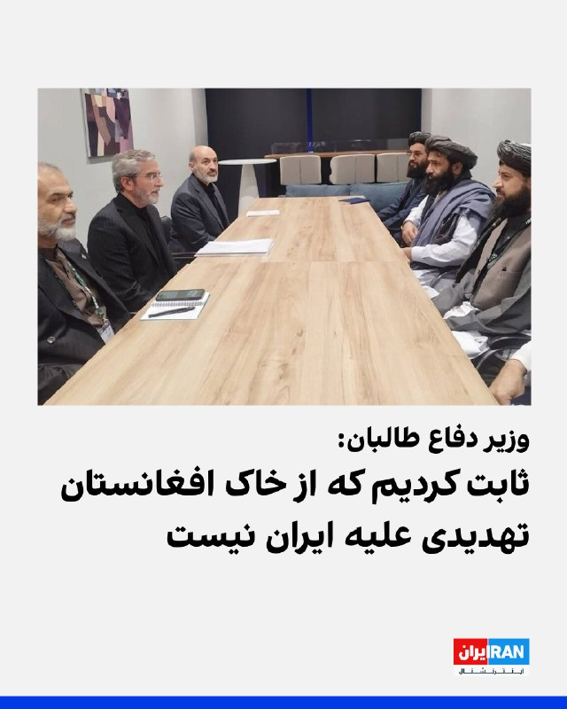

یعقوب مجاهد، وزیر دفاع طالبان، در دیدار با علی باقری کنی، معاون دبیر شورای عالی امنیت ملی جمهوری اسلامی، در مسکو گفت خاک و فضای افغانستان هیچ‌گاه منبع تهدید علیه ایران نبوده و طالبان این موضوع را در جنگ اخیر آمریکا و جمهوری اسلامی ثابت کرده است.

دو طرف روز چهارشنبه در حاشیه چهاردهمین نشست مقام‌های ارشد امنیتی جهان در مسکو دیدار کردند.

ایرنا، خبرگزاری دولت جمهوری اسلامی، نوشت باقری کنی به مجاهد گفت آمریکا و اسرائیل «دشمنان مشترک» کشورهای منطقه هستند.
‌🏁 🇬🇧 IranintlTV

🤖 @VahidOOnLine

## VahidOOnLine — post 242544

  <a href="telegram/content/VahidOOnLine_242544_1779958420.mp4" target="_blank">🎬 Download video</a>

ویدیوی ارسالی به ایران اینترنشنال نشان می‌دهد که ششم خردادماه تعدادی از ایرانیان ساکن ایالت تگزاس آمریکا برای نشان دادن خواست تغییر رژیم و اعتراض به اعدام‌ها در ایران، تجمعی در شهر هیوستون برگزار کردند.
‌🏁 🇬🇧 IranintlTV

🤖 @VahidOOnLine

## VahidOOnLine — post 242543

  

محمدباقر قالیباف، رییس مجلس، در پیامی به غلامحسین محسنی اژه‌ای، رییس قوه قضاییه جمهوری اسلامی، نوشت: «قوه قضاییه زیر بمباران و تهدید دشمنان دست از صیانت از حقوق مردم و برخورد با قاتلان داخلی و خائنین به ملت نکشید و خوش درخشید.»

پیام قالیباف در حالی منتشر شده که قوه قضاییه طی ۷۰ روز گذشته، حدود ۴۰ زندانی سیاسی را اعدام کرده است.
‌🏁 🇬🇧 IranintlTV

🤖 @VahidOOnLine

## VahidOOnLine — post 242542

  

اسماعیل بقائی، سخنگوی وزارت خارجه جمهوری اسلامی، در واکنش به حملات آمریکا به اهدافی در بندرعباس در بامداد پنج‌شنبه، گفت که این اقدام «تجاوزکارانه» علیه تمامیت سرزمینی و حاکمیت ملی، نقض فاحش حقوق بین‌الملل و منشور ملل متحد به شمار می‌آید.

بقائی افزود: «لفاظی‌های تهدیدآمیز مقامات آمریکایی علیه جمهوری اسلامی و کشور دوست و برادر ما عمان، محکوم است.»

سخنگوی وزارت خارجه جمهوری اسلامی، اقدامات آمریکا را «نقض‌ مستمر آتش‌بس» خواند.
‌🏁 🇬🇧 IranintlTV

🤖 @VahidOOnLine

## VahidOOnLine — post 242541

  

ابوالفضل ابوترابی، نماینده نجف‌آباد در مجلس، به سایت دیده‌بان ایران، گفت: «تمام خطوط قرمز رهبری از تنگه هرمز، مسئله هسته‌ای و گرفتن غرامت، در مذاکرات نقض شده است.»

ابوترابی، گفت: «دارند با آبنبات چوبی صندوق ۳۰۰ میلیاردی و بدون ضمانت اجرایی، ما را فریب می‌دهند.»

او افزود: «تنگه هرمز بدهیم تا ۱۲ میلیارد دلار پول خودمان را با خفت و خواری بگیریم؟ اگر ما تنگه هرمز را باز کردیم، چه تضمینی وجود دارد که آنها دوباره محاصره را شروع نکنند؟ هیچ تضمینی.»

این نماینده مجلس در پایان گفت: «آمریکا بعد از جام جهانی و انتخابات کنگره، دوباره به ما حمله می‌کند.»
‌🏁 🇬🇧 IranintlTV

🤖 @VahidOOnLine

## VahidOOnLine — post 242540

  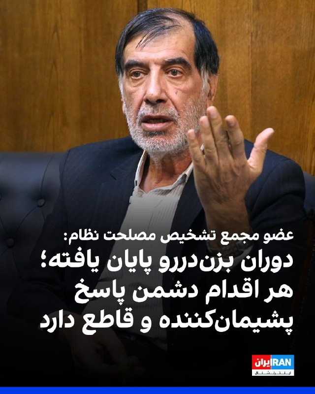

محمدرضا باهنر، عضو مجمع تشخیص مصلحت نظام، گفت «دوران بزن‌دررو» پایان یافته و هر اقدام دشمن با «پاسخی پشیمان‌کننده و قاطع» روبه‌رو خواهد شد.

باهنر در گفت‌وگو با ایرنا گفت جمهوری اسلامی به آمریکا هشدار داده اگر قصد آسیب زدن به زیرساخت‌های ایران را داشته باشد، تهران نیز «مقابله‌به‌مثل» خواهد کرد. او افزود: «اگر دستی به قصد تجاوز به سوی ایران دراز شود، قطعا آن دست را قطع خواهیم کرد.»

او گفت حتی اگر آمریکا خواهان پایان دادن به جنگ باشد، اسرائیل ممکن است با اقداماتی مانند «ترور یا تحریک‌های جدید» مانع بازگشت آرامش شود.
‌🏁 🇬🇧 IranintlTV

🤖 @VahidOOnLine

## VahidOOnLine — post 242539

  

حرمت‌الله رفیعی، رییس انجمن صنفی دفاتر خدمات مسافرتی، گفت در خوش‌بینانه‌ترین حالت، دست‌کم ۵۰۰ میلیارد تومان از پول مردم بابت لغو پروازها و هزینه‌های اقامت در اختیار ایرلاین‌ها، مراکز اقامتی و صاحبان قدرت باقی مانده است.

او افزود خسارت واردشده به صنعت گردشگری از ۲۰ هزار میلیارد تومان فراتر رفته است.

رفیعی تاکید کرد بخش قابل توجهی از منابع مالی مسافران به دلیل کنسل شدن سفرها بازنگشته و فعالان صنعت گردشگری با زیان گسترده مواجه شده‌اند.
‌🏁 🇬🇧 IranintlTV

🤖 @VahidOOnLine

## VahidOOnLine — post 242538

♦️همزمان با موج گرمای زودهنگام در فرانسه، شماری از ساکنان پاریس برای خنک‌شدن وارد روزخانه «سن‌مارتن» شدند؛ اقدامی که با وجود ممنوعیت شنا انجام شد.

یکی از ساکنان پاریس گفت پلیس در محل حضور داشت اما برخورد سخت‌گیرانه‌ای انجام نداد و تنها به تذکر اکتفا کرد.

فرانسه و بخش‌هایی از اروپا در روزهای اخیر با افزایش دما و هشدارهای مرتبط با گرمای شدید مواجه شده‌اند.
‌🇸🇦 Indypersian

🤖 @VahidOOnLine

## VahidOOnLine — post 242537

  

حسین سیمایی صراف، وزیر علوم جمهوری اسلامی، با اشاره به کشته شدن علی خامنه‌ای، دیکتاتور ایران، در حمله مشترک آمریکا و اسرائیل، گفت: «شهادت رهبر انقلاب داغی بود که هنوز سرد نشده است و لذا باید در هر مجلسی به خودمان تسلیت بگوییم.»

علی خامنه‌ای نهم اسفند ۱۴۰۴ در حمله مشترک آمریکا و اسرائیل کشته شد اما با گذشت حدود سه ماه هنوز مراسم تشییع جنازه او برگزار نشده است.
‌🏁 🇬🇧 IranintlTV

🤖 @VahidOOnLine

## VahidOOnLine — post 242536

  

بیت‌کوین در پی افزایش نگرانی‌ها درباره جنگ آمریکا و جمهوری اسلامی و همزمان با خروج سرمایه از صندوق‌های قابل معامله در بورس آمریکا، به پایین‌ترین سطح خود در بیش از شش هفته گذشته رسید.

بزرگ‌ترین ارز دیجیتال جهان پنجشنبه در سنگاپور تا ۳.۳ درصد کاهش یافت و به ۷۲ هزار و ۶۴۳ دلار رسید که ضعیف‌ترین سطح آن از ۲۳ اردیبهشت بود. اتریوم، دومین ارز دیجیتال بزرگ، نیز بیش از ۴ درصد افت کرد و به هزار و ۹۶۵ دلار رسید که پایین‌ترین سطح آن در نزدیک به دو ماه گذشته است.

همزمان سهام و اوراق قرضه کاهش یافتند و بهای نفت پس از حملات تازه در خاورمیانه افزایش پیدا کرد. این تحولات خوش‌بینی‌ها نسبت به دستیابی به توافق برای پایان جنگ را تضعیف و نگرانی‌ها درباره افزایش تورم و رشد نرخ بهره را تقویت کرد.

صندوق‌های قابل معامله در بورس مبتنی بر بیت‌کوین در آمریکا نیز از ابتدای ماه مه تاکنون حدود ۱.۵ میلیارد دلار خروج خالص سرمایه را ثبت کرده‌اند. بر اساس داده‌های کوین‌گلس، در ۲۴ ساعت گذشته حدود ۸۷۳ میلیون دلار از موقعیت‌های صعودی ارزهای دیجیتال بسته شد که ۵۱۲ میلیون دلار آن در چهار ساعت پایانی رخ داد.
‌🏁 🇬🇧 IranintlTV

🤖 @VahidOOnLine

## VahidOOnLine — post 242535

🗣روایت شما از زندگی در آتش‌بس- پنجشنبه ۷ خرداد

🔹اوضاع اقتصادی خیلی سخته اما در این شرایط خودمون باید هوای همدیگه رو داشته باشیم. مطمئنم همه‌چیز درست خواهد شد.

🔹باید تمرکز را روی اقدام مؤثر بگذاریم: اعتصاب سراسری، نپرداختن قبوض، نرفتن به محل کار و بستن مغازه‌ها. درخواست از رهبران خارجی راه‌حل نیست؛ تغییر با حرکت ما آغاز می‌شود.

🔹اینترنت رو از ما گرفتن، بعد با کلی منت اون رو بهمون دادن، اون هم کاملا ضعیف، کند و به شکل فیلترنت.

🔹آقای ترامپ با توافق و فراموش کردن مردم ایران، لطفا نگذار تبدیل به منفورترین رییس‌جمهور آمریکا بشی. یک ایران به قول شما امید بسته.

🔹از وقتی اینترنت وصل شده، به خودم می‌گم از چی خوشحالی؟ اینکه حقت رو بهت دادن؟

🔹اینترنت با اینکه ملی نیست، ولی خیلی ضعیف شده پس مردم به‌خاطر وصل شدن اینترنت که یه حقه، خوشحال نشید.

🔹کسی به فکر این مردم نیست؛ گرونی، بی‌ثباتی و بی‌تکلیفی مردم رو کلافه کرده. نه کاری هست و نه پولی. تا این رژیم عوض نشه، هیچ چیزی تغییر نمی‌کنه.

🔹تنها ۳۰ درصد وی‌پی‌ان‌های ایران کار می‌کنن. وضعیت مردم معلوم نیست و همه مشاغل خوابیده. هیچ‌کس نمی‌دونه باید چی‌کار کنه و قراره چی بشه.

🔹بالاخره بعد از چندین ماه به چیزی که حقمون بود دسترسی پیدا کردیم. ناگفته نماند هنوز هم خیلی‌ها وصل نشدن و ما که وصل هستیم هم اینترنت خیلی ضعیفه.

🔹قیمت اجاره به حدی بالاست که دیگه به‌راحتی نمی‌شه حتی کرایه خونه داد. خرید خونه هم داره به رؤیا تبدیل می‌شه.

🔹از اینکه هر چیزی حداقل یک میلیون تومان شده خسته شدیم. کی تموم می‌شه این کابوس؟

🔹خدایی این چه اینترنتیه که وصل کردین؟ چه فرقی با قطع بودنش داره؟ با این سرعت فقط اعصاب آدم خرد می‌شه.

🔹من یه نوجوان ۱۴ ساله‌ام و خواستم بگم هیچ‌وقت امیدتون رو از دست ندید. چه ترامپ ادامه بده یا نده، توافق بشه یا نشه، نسل ما اینا رو می‌کشه پایین.

🔹اکثریت مردم داخل نگران مماشات آمریکا هستن. پرزیدنت ترامپ لطفا کار رو با همراهی مردم ایران تموم کن. مذاکره با قاتلان مردم ایران بی‌معنیه.
‌🏁 🇬🇧 IranintlTV

🤖 @VahidOOnLine

## VahidOOnLine — post 242534

  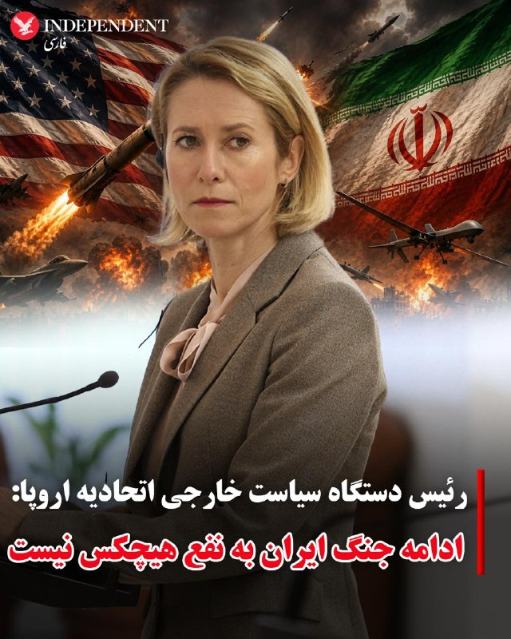

♦️در پی تبادل آتش سپاه پاسداران و نیروی‌های ارتش آمریکا در منطقه خلیج فارس، کایا کالاس، مسئول سیاست خارجی اتحادیه اروپا، روز پنج‌شنبه هفتم خرداد ماه هشدار داد ادامه جنگ میان آمریکا و ایران به سود هیچ‌کس نیست.
کالاس در نشست وزیران خارجه اتحادیه اروپا در قبرس به خبرنگاران گفت: «آن‌ها هم‌اکنون در حدفاصل بسیار خطرناکی میان جنگ و صلح به سر می‌برند و ادامه یافتن این نبرد به نفع هیچ طرفی نخواهد بود.»
این اظهارنظر در حالی مطرح می‌شود که منطقه خلیج فارس در بامداد پنجشنبه، صحنه درگیری شدید میان نیروهای مسلح جمهوری اسلامی و ارتش آمریکا بود.
تنش‌ها با تبادل آتش میان یگان‌های دریایی آغاز شد و در ادامه، جنگنده‌های آمریکایی یک ایستگاه پهپادی را در بندرعباس هدف قرار دادند که با فعال شدن پدافند منطقه همراه شد. سپاه پاسداران نیز در پاسخ، پایگاه هوایی آمریکا در کویت را هدف حملات موشکی و پهپادی قرار داد.
‌🇸🇦 Indypersian

🤖 @VahidOOnLine

## VahidOOnLine — post 242533

  <a href="telegram/content/VahidOOnLine_242533_1779958425.mp4" target="_blank">🎬 Download video</a>

♦️ارتش اسرائیل صبح پنجشنبه هفتم خرداد و ساعتی پس از صدور هشدار تخلیه برای ساکنان چند منطقه، شهر صور لبنان را بمباران کرد.

ارتش اسرائیل پیش از این اعلام کرده بود که برای مقابله با حملات حزب‌الله باید زیرساخت‌های این سازمان را در شهر صور هدف قرار دهد.

منابع محلی در لبنان می‌گویند دست‌کم دو ساختمان شهر صور در دور جدید حملات هدف قرار گرفته‌اند و بمباران یکی از آن‌ها منجر به آتش‌سوزی گسترده شده است.

با وجود اعلام آتش‌بس میان حزب‌الله و اسرائیل در پنج هفته پیش و تمدید دوباره آن در هفته گذشته، نبردها میان دو طرف حتی یک روز هم متوقف نشده است.
‌🇸🇦 Indypersian

🤖 @VahidOOnLine

## VahidOOnLine — post 242532

  

♦️علی باقری‌کنی، معاون دبیر شورای عالی امنیت ملی جمهوری اسلامی، روز پنجشنبه هفتم خردادماه بر ضرورت آزادسازی کامل دارایی‌های مسدودشده ایران توسط آمریکا تاکید کرد و آن را «حق قانونی ملت ایران» دانست.

به گزارش خبرگزاری تسنیم، وابسته به سپاه پاسداران، باقری‌کنی که به مسکو سفر کرده، گفت جمهوری اسلامی به‌دنبال بازگرداندن تمامی دارایی‌های مسدود‌شده است و این اموال باید «به‌طور کامل و بدون هیچ قید و شرطی» به ایران بازگردانده شوند.

موضوع دارایی‌های مسدود‌شده یکی از محورهای اصلی اختلاف میان تهران و واشنگتن در مذاکرات اخیر بوده است.

محمدباقر قالیباف، عباس عراقچی و عبدالناصر همتی، روز سه‌شنبه به قطر سفر کردند. رسانه‌های ایران می‌گویند مذاکرات در دوحه برای آزادی میلیاردها دلار اموال بلوکه شده، موفقیت آمیز بوده است.
‌🇸🇦 Indypersian

🤖 @VahidOOnLine

## VahidOOnLine — post 242531

  

♦️روزنامه وال‌استریت ژورنال روز پنجشنبه هفتم خردادماه به‌نقل از پژوهشگران موسسه «سرمایه اقتصادها/کاپیتال اکونومیکس» گزارش کرد که برآوردها نشان می‌دهد که ذخایر ارزی در دسترس جمهوری اسلامی بیش از سه ماه برای پرداخت هزینه واردات دوره پیش از جنگ، کفایت نمی‌کند.

وال‌استریت ژورنال در این گزارش با عنوان «ایران تا چه زمانی می‌تواند درد اقتصادی ناشی از محاصره ایالات متحده را تحمل کند؟» با استناد به تحلیل‌های کارشناسان، واکنش بازارهای بین‌المللی و سخنان مقام‌های جمهوری اسلامی و آمریکا، تاثیر محاصه دریایی ایالات متحده بر راهبرد نظامی و سیاسی حکومت ایران را بررسی کرده است.
‌🇸🇦 Indypersian

🤖 @VahidOOnLine

## VahidOOnLine — post 242530

  

محمد میرزایی، عضو کمیسیون فرهنگی مجلس جمهوری اسلامی، گفت دونالد ترامپ، رییس‌جمهوری آمریکا، هر روز مطالبی را مطرح می‌کند که به گفته او هیچ‌کدام توجیه عقلانی ندارد و به نظر می‌رسد او دچار «زوال عقل» شده است.

او با اشاره به حملات آمریکا و اسرائیل علیه جمهوری اسلامی گفت: «هر روز مطالب متفاوتی مطرح می‌شود که حتی بسیاری از تحلیلگران غربی و آمریکایی نیز آن را قابل دفاع نمی‌دانند. به‌جز شخص ترامپ، هیچ‌یک از تحلیلگران آمریکایی نگفته‌اند که آمریکا در این جنگ پیروز شده است.»

نماینده مجلس افزود: «حتی برخی نزدیکان او نیز اظهاراتی درباره وضعیت ذهنی او مطرح کرده‌اند.»
‌🏁 🇬🇧 IranintlTV

🤖 @VahidOOnLine

## WithYashar — post 12782

  

ارتش اسرائیل دقایقی پیش مجدداً دستور تخلیه فوری کل جنوب لبنان را صادر کرد!
@withyashar

## WithYashar — post 12781

مقام‌های آمریکایی گفتند جمهوری اسلامی چهار پهپاد انتحاری را به سمت کشتی‌های آمریکایی و تجاری شلیک کرد، اما جنگنده‌های آمریکا آن‌ها را سرنگون کردند. به گفته این مقام‌ها، جنگنده‌های اف-۱۸ آمریکا همچنین پیش از پرواز پنجمین پهپاد، واحد کنترل زمینی جمهوری اسلامی را در بندرعباس منهدم کردند.
@withyashar

## WithYashar — post 12780

## WithYashar — post 12779

  

حجم ترافیک اینترنت بین‌الملل، تا ساعت ۷ و نیم صبح امروز به ۵۳ درصد حجم پیش از دی‌ماه ۱۴۰۴ رسیده است
@withyashar
حرفم که گفتم اینترنت فقط با رفتن اینا به حالت قبل بر‌میگرده هنوز پا برجاست !

## WithYashar — post 12778

## WithYashar — post 12777

  

👏👏👏

## WithYashar — post 12776

  

بامداد امروز بعد از شلیک موشک از امیدیه خوزستان به سمت کویت ، صدای انفجار شنیده شده و ستون دود دیده شده که ظاهراً لانچری که موشک ازش شلیک شده بلافاصله توسط ارتش آمریکا مورد هدف قرار گرفته
@withyashar

## WithYashar — post 12775

  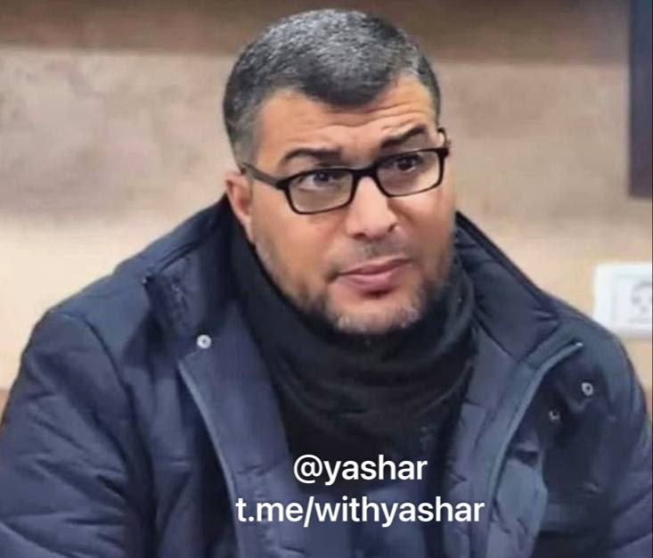

اسرائیل، عزالدین البیک، فرمانده تیپ شمال غزه را به هااکت رساند
@withyashar

## WithYashar — post 12774

  

رویترز: یک گاومیش آلبینو نادر در بنگلادش که به خاطر دسته موی بلوندش «دونالد ترامپ» لقب گرفته بود، پس از اینکه در فضای مجازی دیده شد، از قربانی شدن در عید قربان نجات یافت.
این گاومیش ۷۰۰ کیلوگرمی قبلاً فروخته شده بود، اما دولت به دلیل نگرانی‌های امنیتی و تجمع جمعیت برای دیدن آن، وارد عمل شد.

مقامات پول خریدار را بازگرداندند و حیوان را به باغ‌وحش داکا منتقل کردند.
@withyashar

## WithYashar — post 12773

آمریکا «نهاد مدیریت آبراه خلیج فارس» را تحریم کرد

وزارت خزانه‌داری آمریکا اعلام کرد سازمان تازه تأسیس ایرانی «نهاد مدیریت آبراه خلیج فارس» را به فهرست تحریم‌های خود اضافه کرده است.
@withyashar

## WithYashar — post 12772

  <a href="telegram/content/WithYashar_12772_1779958432.mp4" target="_blank">🎬 Download video</a>

◀️رد موشک های ۳پا در امیدیه خوزستان که به سمت کویت میرفت
@withyashar

## WithYashar — post 12771

اکسیوس: ایران چهارتا پهپاد انتحاری به سمت یک ناو نیروی دریایی آمریکا و یک کشتی تجاری پرتاب کرد نیروهای آمریکایی پهپادها رو رهگیری کردن و همچنین یک واحد پرتاب پهپاد ایرانی دیگه رو روی زمین قبل از اینکه بتوانه شلیک کنه، هدف قرار دادن
@withyashar

## WithYashar — post 12770

فاکس نیوز: آمریکا یه ایستگاه کنترل زمینی ایران رو تو بندرعباس زده؛ همون جایی که قرار بوده یه پهپاد تهاجمی ازش بلند شه.

به گفتهٔ مقام‌های آمریکایی، چهار تا پهپاد انتحاری دیگه هم که تو تنگه هرمز تهدید محسوب می‌شدن، زده شدن.
@withyashar

## WithYashar — post 12769

۳پا یک پایگاه هوایی آمریکایی را هدف قرار داد

روابط عمومی ۳پا طی اطلاعیه‌ای اعلام کرد:
به دنبال تعرض سحرگاه امروز آمریکا به نقطه‌ای در حاشیه فرودگاه بندر عباس با پرتابه‌های هوایی، پایگاه هوایی آمریکایی به عنوان مبدا تجاوز، در ساعت ۴/۵۰ دقیقه هدف قرار گرفت.
این پاسخ یک اخطار جدی است تا دشمن بداند، تجاوز بدون پاسخ نخواهد ماند و در صورت تکرار، پاسخ ما قاطع تر خواهد بود.
مسئولیت عواقب آن با متجاوز است.
@withyashar

## mwarmonitor — post 9845

🔴«یک آژانس کشتیرانی اعلام کرد: پهپادها به سه نفتکش در دریای سیاه، در نزدیکی سواحل ترکیه، حمله کردند.»

@mwarmonitor

## mwarmonitor — post 9844

📰 بلومبرگ:
دونالد ترامپ نسخه جدیدی از شکایت قضایی ۱۰ میلیارد دلاری خود را به اتهام افترا علیه روزنامه وال استریت ژورنال و شرکت مادر آن نیوز کورپ ثبت کرده است. این شکایت به دلیل انتشار مقاله‌ای درباره روابط نزدیک ادعایی او با جفری اپستین مطرح شده است.

@mwarmonitor

## mwarmonitor — post 9843

📰 پولیتیکو:
به گزارش پولیتیکو، نیروها و تسلیحات نظامی آمریکا برای حمله به کوبا آماده هستند و تنها چیزی که باقی مانده، دستور نهایی از سوی دونالد ترامپ است.

@mwarmonitor

## mwarmonitor — post 9842

📊 داده‌های معاملاتی:
قیمت‌های جهانی نفت صبح روز پنج‌شنبه حدود ۴ درصد افزایش یافت؛ این رشد در حالی رخ داده که انتظار می‌رود اختلالاتی در عبور نفتکش‌ها از تنگه هرمز ایجاد شود.

@mwarmonitor

## mwarmonitor — post 9841

صبح امروز به کویت حمله موشکی شد ، مثل دیشب این نقض آتش بس نبوده و فقط یک احوال پرسی دیپلماتیک بود

## pm_afshaa — post 91717

vless://478cc26d-16b3-4fdd-be64-60d5a58c1622@162.159.36.5:80?path=%2F&security=none&encryption=none&host=tt.andishehparenting.com&type=ws#PMTV%20NEWS%F0%9F%A6%81%E2%98%80%EF%B8%8F

💧 Rainbet.com the #1 Non-KYC Crypto Casino & Sportsbook @rainbetcom

😁 @Pm_Afshaa

## pm_afshaa — post 91716

vless://06b65903-406d-4a41-8463-6fd5c0ee7798@43.169.18.179:443?path=%2F&security=tls&encryption=none&insecure=0&host=sni.skylee4.cloudns.ch&fp=chrome&type=ws&allowInsecure=0&sni=sni.skylee4.cloudns.ch#PMTV%20NEWS%F0%9F%A6%81%E2%98%80%EF%B8%8F

سرعت بالا مخصوص اینستا و دانلود

💧 Rainbet.com the #1 Non-KYC Crypto Casino & Sportsbook @rainbetcom

😁 @Pm_Afshaa

## pm_afshaa — post 91715

https://t.me/proxy?server=87.248.129.13&port=15&secret=ee1603010200010001fc030386e24c3add63646e2e79656b74616e65742e636f6d

پروکسی متصل سرعت بالا

💧 Rainbet.com the #1 Non-KYC Crypto Casino & Sportsbook @rainbetcom

😁 @Pm_Afshaa

## pm_afshaa — post 91714

  

از کرمانشاه موشک بلند شد

💧 Rainbet.com the #1 Non-KYC Crypto Casino & Sportsbook @rainbetcom

😁 @Pm_Afshaa

## pm_afshaa — post 91713

🔴اسرائیل، عزالدین البیک، فرمانده تیپ شمال غزه را ترور کرد

💧 Rainbet.com the #1 Non-KYC Crypto Casino & Sportsbook @rainbetcom

😁 @Pm_Afshaa

## pm_afshaa — post 91712

  

از نهاوند موشک بلند شد

💧 Rainbet.com the #1 Non-KYC Crypto Casino & Sportsbook @rainbetcom

😁 @Pm_Afshaa

## pm_afshaa — post 91711

vless://06b65903-406d-4a41-8463-6fd5c0ee7798@43.169.18.179:443?path=%2F&security=tls&encryption=none&insecure=0&host=sni.skylee4.cloudns.ch&fp=chrome&type=ws&allowInsecure=0&sni=sni.skylee4.cloudns.ch#PMTV%20NEWS%F0%9F%A6%81%E2%98%80%EF%B8%8F

💧 Rainbet.com the #1 Non-KYC Crypto Casino & Sportsbook @rainbetcom

😁 @Pm_Afshaa

## pm_afshaa — post 91710

trojan://humanity@45.130.125.69:443?path=%2Fassignment&security=tls&alpn=http%2F1.1&insecure=1&host=www.calmloud.com&fp=chrome&type=ws&allowInsecure=1&sni=www.calmloud.com#PMTV%20NEWS%F0%9F%A6%81%E2%98%80%EF%B8%8F

سرعت بالا مخصوص اینستا و دانلود

💧 Rainbet.com the #1 Non-KYC Crypto Casino & Sportsbook @rainbetcom

😁 @Pm_Afshaa

## pm_afshaa — post 91708

🔴سپاه اعلام کرد که پایگاه هوایی آمریکا در کویت رو در پاسخ به تجاوز اخیر آمریکا هدف قرار داده‌

💧 Rainbet.com the #1 Non-KYC Crypto Casino & Sportsbook @rainbetcom

😁 @Pm_Afshaa

## pm_afshaa — post 91707

♨️
♨️
♨️
♨️

## DEJradio — post 5052

  <a href="telegram/content/DEJradio_5052_1779958434.webm" target="_blank">🎬 Download video</a>

🔺📢 "از رشت پیام می‌دم، شب‌ها تقریبا حکومت نظامی شده، سرکوبگر کم آوردن رفتن سراغ کارگرای بیچاره با زور و تهدید و تطمیع می‌ذارنشون تو ایست بازرسی

پیام دریافتی

#سرکوبگران #ایست_بازرسی
@DEJradio

## DEJradio — post 5051

  <a href="telegram/content/DEJradio_5051_1779958435.webm" target="_blank">🎬 Download video</a>

🔺📢 “از دی تا الان نزدیک پنج ماهه دنبال برادرم میگردیم نیست، هرجایی بگید سر زدیم، تو بیمارستان‌ها، سردخونه‌ها، فقط بگم خیای‌ها مثل ما از عزیزاشون خبر ندارن...

پیام دریافتی

#دی۱۴۰۴ #انقلاب_ملی
@DEJradio

## DEJradio — post 5050

  <a href="telegram/content/DEJradio_5050_1779958435.mp4" target="_blank">🎬 Download video</a>

🔺📢 پیام یک شهروند: "ساکن اهواز هستم واقع در استان خوزستان من و همسرم همیشه آرزو داشتیم که پدر و مادر بشیم ولی به دلیل مشکلات اقتصادی اقدام به سقط جنین کردیم.
شوهرم راننده کامیون بود ولی بعد از جنگ اخیر به دلیل تعدیل نیرو اخراج شد و الان هیچ منبع درآمدی نداریم. جمهوری اسلامی مدت‌هاست که حرف از جنگ یا مذاکره میزنه درحالیکه مردم توانایی برآورده کردن اساسی ترین نیازهاشون رو هم ندارن. همه این موارد نشانگر این واقعیت که چه جنگ یا مذاکره باشه یا نباشه مردم دیگه این حکومت فاسد و ناکارآمد رو نمیخوان!"

#خوزستان #جنگ
@DEJradio

## DEJradio — post 5049

  <a href="telegram/content/DEJradio_5049_1779958437.webm" target="_blank">🎬 Download video</a>

🔺📌 انجمن مرکزی شیر و خورشید با انتشار اطلاعیه‌ای نسبت به فعالیت افراد و گروه‌هایی که در اروپا و آمریکا با استفاده از نام این انجمن یا عناوینی نظیر «انجمن دانشجویی اروپا» فعالیت می‌کنند، هشدار داد و تأکید کرد که هیچ‌یک از این مجموعه‌ها مورد تأیید یا دارای ارتباط سازمانی با واحد مرکزی این انجمن نیستند.

این انجمن که مجموعه‌ای شامل تمام انجمن‌‌های شیر و خورشید دانشجویان داخل ایران است، در اطلاعیه خود تاکید کرده است که در حال حاضر هیچ شعبه، دفتر یا واحد رسمی در کشورهای اروپایی و آمریکایی ندارد و تمامی فعالیت‌های رسمی این مجموعه صرفاً از طریق کانال‌ها و مسیرهای ارتباطی معرفی‌شده توسط واحد مرکزی انجام می‌شود.

در این اطلاعیه آمده است که برخی افراد و گروه‌ها با بهره‌گیری از نام، نشان و سابقه انجمن شیر و خورشید اقدام به فعالیت کرده و از این عنوان برای کسب اعتبار و گسترش نفوذ خود استفاده کرده‌اند. انجمن شیر و خورشید ضمن رد هرگونه ارتباط با این افراد، تأکید کرده است که فعالیت این مجموعه‌ها به هیچ عنوان مورد تأیید واحد مرکزی نیست.

این انجمن همچنین گزارش‌های منتشرشده درباره گفت‌وگو یا همکاری با رسانه‌ها و شبکه‌های خبری را تکذیب کرده و اعلام کرده است که تاکنون هیچ مصاحبه یا گفت‌وگوی رسمی با هیچ شبکه خبری انجام نداده است.

در بخش دیگری از این اطلاعیه، انجمن شیر و خورشید از مخاطبان و حامیان خود خواسته است از هرگونه همکاری یا ارتباط با انجمن‌ها و گروه‌های فعال در اروپا که با نام این مجموعه فعالیت می‌کنند خودداری کنند و اخبار و اطلاعیه‌های رسمی را تنها از مجاری اعلام‌شده توسط واحد مرکزی دنبال کنند.

همچنین در این بیانیه تأکید شده است که انجمن شیر و خورشید هیچ صندوق مالی، طرح جمع‌آوری کمک‌های مردمی یا سازوکار حمایت مالی در اختیار ندارد و هرگونه ادعا در این زمینه فاقد ارتباط با این مجموعه است.

واحد مرکزی انجمن شیر و خورشید برای برقراری ارتباط امن، تنها کانال ارتباطی مورد تأیید خود را شناسه «@shir_khorshid_anjm» اعلام کرده و افزوده است که فهرست تمامی کانال‌ها و صفحات رسمی این انجمن از طریق کانال مرکزی قابل مشاهده است.

*به نقل از خبرنامه امیرکبیر

#انجمن_شیروخورشید #خبرنامه_امیرکبیر
@DEJradio

## DEJradio — post 5048

  <a href="telegram/content/DEJradio_5048_1779958438.webm" target="_blank">🎬 Download video</a>

🚨📢 در پی حملات سـ.ـپاه پاسداران به کشتی‌های تجاری در تنگه هرمز، آمریکا یک سایت نظامی در جنوب ایران را هدف حمله قرار داد. ارتش آمریکا همچنین چندین پهپاد ایرانی را رهگیری و منهدم کرد.
منابع محلی می‌گویند بامداد پنجشنبه ۱۷ خرداد، صدای سه انفجار در شرق بندرعباس شنیده شد. در پی این حملات پدافند بندرعباس فعال شد.

خبرگزاری تسنیم گزارش داد نیروی دریایی سـ.ـپاه به سمت یک نفتکش شلیک کرده است. ادعا شد نفتکش آمریکایی سیستم راداری خود را خاموش کرده بود و قصد عبور از تنگه هرمز را داشت. برخی منابع از جمله آکسیوس گزارش دادند که سه الی چهار پهپاد به سمت این کشتی پرتاب شد. همچنین سـ.ـپاه ادعا کرد یک پایگاه آمریکایی در منطقه هدف قرار گرفته است.

ارتش کویت اعلام کرد چند پهپاد و موشک را در آسمان رهگیری کرده است. بعضی از آنها به زمین اصابت کردند.
طی یک هفته گذشته این سومین بار است که درگیری‌ها در خلیج فارس بالا می‌گیرد.

#تنگه_هرمز #جنگ
@DEJradio

## DEJradio — post 5047

  <a href="telegram/content/DEJradio_5047_1779958438.webm" target="_blank">🎬 Download video</a>

🔺📢 شهرام سبزواری کارشناس نظامی توضیح می‌دهد که برخلاف ادعای مقامات در مورد عقب‌نشینی آمریکا و اسرائیل و نمایش پیروزی، نیروهای مسلح و ساختار نظامی- امنیتی جمهوری اسلامی ضربات سنگینی در جنگ ۴۰ روزه دریافت کرده است و وضعیت نیروی انسانی و پرسنل بحرانی است.

#جنگ۴۰روزه
@DEJradio

## DEJradio — post 5046

  <a href="telegram/content/DEJradio_5046_1779958439.mp4" target="_blank">🎬 Download video</a>

🚨
⭕️ حامیان حکومت در لندن، یک ایرانی به نام امیرحسین ترکان را روبه‌روی دیوار یادبود در "گولدرز گرین" با ماشین زیر گرفتند.

گفته می‌شود یک آخوند راننده ماشین بود. تحقیقات پلیس ادامه دارد.

#لندن
@DEJradio

## DEJradio — post 5045

  <a href="telegram/content/DEJradio_5045_1779958440.mp4" target="_blank">🎬 Download video</a>

🚨🎥 مخاطبان دژ روز پنجشنبه ۲۶ خرداد ویدیویی از آتش‌سوزی در پارک بانوان سه‌راه افسریه تهران ارسال کردند. علت آتش‌سوزی مشخص نیست. گزارش شد گشتی‌های امنیتی به سمت آن محل در حرکت بودند.

*محل استقرار نیروهای سرکوب بوده که اول فروردین ۱۴۰۵ هدف قرار گرفت.

#نیروهای_سرکوب #آتشسوزی
@DEJradio

## mamlekate — post 103593

📝 ارتش کویت از رهگیری حملات موشکی و پهپادی «دشمن» خبر داد

ارتش کویت اعلام کرد که پدافند هوایی این کشور در حال مقابله با «حملات موشکی و پهپادهای دشمن» است، اما به مبدأ این تهدیدها اشاره نکرد.

@mamlekate

## IranIntlTV — post 339367

  <a href="telegram/content/IranIntlTV_339367_1779958442.mp4" target="_blank">🎬 Download video</a>

یک شهروند با ارسال ویدیویی به ایران اینترنشنال نشان داد که در محله نارمک تهران، شعارهای «جاوید شاه» و «رضا شاه روحت شاد» را دیوارنویسی کرده است.

## IranIntlTV — post 339366

  <a href="telegram/content/IranIntlTV_339366_1779958443.mp4" target="_blank">🎬 Download video</a>

مقام‌های آمریکایی گفتند جمهوری اسلامی چهار پهپاد انتحاری را به سمت کشتی‌های آمریکایی و تجاری شلیک کرد، اما جنگنده‌های آمریکا آن‌ها را سرنگون کردند. به گفته این مقام‌ها، جنگنده‌های اف-۱۸ آمریکا همچنین پیش از پرواز پنجمین پهپاد، واحد کنترل زمینی جمهوری اسلامی را در بندرعباس منهدم کردند.
ارزیابی بیشتر با حسین آقایی، عضو تحریریه ایران‌اینترنشنال
@iranintltv

## IranIntlTV — post 339365

  

شهاب خورشید، ۲۲ ساله و دانشجوی رشته معماری، شامگاه ۱۹ دی‌ماه حوالی ساعت ۲۲ در جریان اعتراضات میدان کاج سعادت‌آباد تهران هدف شلیک گلوله ماموران امنیتی قرار گرفت و در همان محل جان باخت.

بر اساس گزارش‌های رسیده به ایران‌اینترنشنال، گلوله از پشت کتف به او اصابت کرد و دو گلوله جنگی قلب و ریه‌هایش را هدف قرار داد.

شهاب در محل حادثه جان باخت و پیکرش روز بعد در کهریزک به خانواده تحویل داده شد.

به گفته دوستانش، این جوان پیش از پیوستن به تجمعات گفته بود: «مگر خون من از دیگران رنگین‌تر است که در خانه بمانم؟ یا همه‌چیز تغییر می‌کند، یا من هم می‌میرم.»

شهاب خورشید فرزند دوم خانواده و اصالتا اهل اهواز بود. او از بدو تولد با بیماری دیابت درگیر بود و انسولین مصرف می‌کرد.

بستگانش از او به‌عنوان جوانی شجاع، شاد، خوش‌خنده، مهربان و پرانرژی یاد می‌کنند.

پیکر شهاب در قطعه ۲۱۱، ردیف ۲۳، شماره ۱۱ بهشت زهرا به خاک سپرده شده است.

بنا بر گزارش‌های رسیده به ایران‌اینترنشنال، به خانواده او اجازه داده نشد مزاری جداگانه برایش در نظر بگیرند و شهاب در قبر سه‌طبقه خانوادگی و در طبقه بالایی متعلق به پدربزرگش دفن شد.
https://iranintl.

## IranIntlTV — post 339364

  <a href="telegram/content/IranIntlTV_339364_1779958445.mp4" target="_blank">🎬 Download video</a>

ارتش اسرائیل اعلام کرد چهارشنبه تعدادی از ساختمان‌های نظامی، مقرهای فرماندهی و سایت‌های پرتاب مورد استفاده حزب‌الله لبنان را در منطقه البقاع و چندین منطقه دیگر در جنوب لبنان هدف قرار داده است. ارتش این کشور همچنین اعلام کرد ساختمانی در شمال نوار غزه هدف حمله قرار گرفته و در این عملیات، دو فرمانده اصلی حماس کشته شدند.

گفت‌وگو با مئیر جاودانفر، تحلیل‌گر مسائل اسرائیل
@iranintltv

## IranIntlTV — post 339363

  <a href="telegram/content/IranIntlTV_339363_1779958447.mp4" target="_blank">🎬 Download video</a>

ویدیوی رسیده به ایران اینترنشنال نشان‌دهنده فعالیت پدافند بندرعباس در بامداد پنجشنبه ۷ خردادماه است.

## IranIntlTV — post 339362

  

یعقوب مجاهد، وزیر دفاع طالبان، در دیدار با علی باقری کنی، معاون دبیر شورای عالی امنیت ملی جمهوری اسلامی، در مسکو گفت خاک و فضای افغانستان هیچ‌گاه منبع تهدید علیه ایران نبوده و طالبان این موضوع را در جنگ اخیر آمریکا و جمهوری اسلامی ثابت کرده است.

دو طرف روز چهارشنبه در حاشیه چهاردهمین نشست مقام‌های ارشد امنیتی جهان در مسکو دیدار کردند.

ایرنا، خبرگزاری دولت جمهوری اسلامی، نوشت باقری کنی به مجاهد گفت آمریکا و اسرائیل «دشمنان مشترک» کشورهای منطقه هستند.
https://iranintl.com/202605288001

## IranIntlTV — post 339361

  <a href="telegram/content/IranIntlTV_339361_1779958449.mp4" target="_blank">🎬 Download video</a>

ویدیوی ارسالی به ایران اینترنشنال نشان می‌دهد که ششم خردادماه تعدادی از ایرانیان ساکن ایالت تگزاس آمریکا برای نشان دادن خواست تغییر رژیم و اعتراض به اعدام‌ها در ایران، تجمعی در شهر هیوستون برگزار کردند.

## IranIntlTV — post 339360

  

محمدباقر قالیباف، رییس مجلس، در پیامی به غلامحسین محسنی اژه‌ای، رییس قوه قضاییه جمهوری اسلامی، نوشت: «قوه قضاییه زیر بمباران و تهدید دشمنان دست از صیانت از حقوق مردم و برخورد با قاتلان داخلی و خائنین به ملت نکشید و خوش درخشید.»

پیام قالیباف در حالی منتشر شده که قوه قضاییه طی ۷۰ روز گذشته، حدود ۴۰ زندانی سیاسی را اعدام کرده است.
https://iranintl.com/202605285024

## IranIntlTV — post 339359

  

اسماعیل بقائی، سخنگوی وزارت خارجه جمهوری اسلامی، در واکنش به حملات آمریکا به اهدافی در بندرعباس در بامداد پنج‌شنبه، گفت که این اقدام «تجاوزکارانه» علیه تمامیت سرزمینی و حاکمیت ملی، نقض فاحش حقوق بین‌الملل و منشور ملل متحد به شمار می‌آید.

بقائی افزود: «لفاظی‌های تهدیدآمیز مقامات آمریکایی علیه جمهوری اسلامی و کشور دوست و برادر ما عمان، محکوم است.»

سخنگوی وزارت خارجه جمهوری اسلامی، اقدامات آمریکا را «نقض‌ مستمر آتش‌بس» خواند.
https://iranintl.com/202605284704

## IranIntlTV — post 339358

  <a href="telegram/content/IranIntlTV_339358_1779958452.mp4" target="_blank">🎬 Download video</a>

کره‌ جنوبی اعلام کرد پس از پایان تحقیقات درباره حمله به یک کشتی تجاری این کشور در تنگه هرمز، جمهوری اسلامی مسئول شناخته شده است. دولت کره‌ جنوبی همچنین گفت سئول رویکرد سخت‌گیرانه‌تری در قبال تهران در پیش خواهد گرفت.

توماج طاهباز، خبرنگار ایران‌اینترنشنال، گزارش می‌دهد
@iranintltv

## IranIntlTV — post 339357

  

ابوالفضل ابوترابی، نماینده نجف‌آباد در مجلس، به سایت دیده‌بان ایران، گفت: «تمام خطوط قرمز رهبری از تنگه هرمز، مسئله هسته‌ای و گرفتن غرامت، در مذاکرات نقض شده است.»

ابوترابی، گفت: «دارند با آبنبات چوبی صندوق ۳۰۰ میلیاردی و بدون ضمانت اجرایی، ما را فریب می‌دهند.»

او افزود: «تنگه هرمز بدهیم تا ۱۲ میلیارد دلار پول خودمان را با خفت و خواری بگیریم؟ اگر ما تنگه هرمز را باز کردیم، چه تضمینی وجود دارد که آنها دوباره محاصره را شروع نکنند؟ هیچ تضمینی.»

این نماینده مجلس در پایان گفت: «آمریکا بعد از جام جهانی و انتخابات کنگره، دوباره به ما حمله می‌کند.»
https://iranintl.com/202605280587

## IranIntlTV — post 339356

یک شهروند با ارسال ویدیویی به ایران اینترنشنال نشان داد که به یاد یلدا آقافضلی و حمیدرضا روحی، کشته‌شدگان خیزش «زن، زندگی، آزادی»، و محسن شکاری که در جریان همین خیزش بازداشت و اعدام شد، در کنار آرامگاه‌های این جوانان ساعاتی از نوروز را سپری کرده است.

## IranIntlTV — post 339355

  

محمدرضا باهنر، عضو مجمع تشخیص مصلحت نظام، گفت «دوران بزن‌دررو» پایان یافته و هر اقدام دشمن با «پاسخی پشیمان‌کننده و قاطع» روبه‌رو خواهد شد.

باهنر در گفت‌وگو با ایرنا گفت جمهوری اسلامی به آمریکا هشدار داده اگر قصد آسیب زدن به زیرساخت‌های ایران را داشته باشد، تهران نیز «مقابله‌به‌مثل» خواهد کرد. او افزود: «اگر دستی به قصد تجاوز به سوی ایران دراز شود، قطعا آن دست را قطع خواهیم کرد.»

او گفت حتی اگر آمریکا خواهان پایان دادن به جنگ باشد، اسرائیل ممکن است با اقداماتی مانند «ترور یا تحریک‌های جدید» مانع بازگشت آرامش شود.
https://iranintl.com/202605289725

## IranIntlTV — post 339354

  <a href="telegram/content/IranIntlTV_339354_1779958454.mp4" target="_blank">🎬 Download video</a>

🔻مهدی تاج، رییس فدراسیون فوتبال درباره کمپ تیم ملی در جام جهانی در جمع خبرنگاران گفت: «ما به مکزیک می‌رویم و قرار است به صورت همزمان با فیفا، مکزیک و آمریکا این موضوع اعلام شود و مسئله‌ای برای نگرانی وجود ندارد. در حال حاضر هم در مکزیک مشکلی نیست.»

🔹تاج درباره دعوت از سردار آزمون به تیم ملی گفت: «در مورد آن هم اکنون در جریان نیستم، اما مسئله اصلی درباره تیم ملی و ویزاهاست؛ باید برای ویزاها راه‌حلی در نظر گرفته شود تا این افراد بتوانند رفت‌وآمد کنند و آمریکا باید ویزای مولتی بدهد تا بازیکنان به راحتی بروند و بیایند.»

https://t.me/iranintltvsport

## IranIntlTV — post 339353

  

حرمت‌الله رفیعی، رییس انجمن صنفی دفاتر خدمات مسافرتی، گفت در خوش‌بینانه‌ترین حالت، دست‌کم ۵۰۰ میلیارد تومان از پول مردم بابت لغو پروازها و هزینه‌های اقامت در اختیار ایرلاین‌ها، مراکز اقامتی و صاحبان قدرت باقی مانده است.

او افزود خسارت واردشده به صنعت گردشگری از ۲۰ هزار میلیارد تومان فراتر رفته است.

رفیعی تاکید کرد بخش قابل توجهی از منابع مالی مسافران به دلیل کنسل شدن سفرها بازنگشته و فعالان صنعت گردشگری با زیان گسترده مواجه شده‌اند.
https://iranintl.com/202605284520

## IranIntlTV — post 339352

  <a href="telegram/content/IranIntlTV_339352_1779958457.mp4" target="_blank">🎬 Download video</a>

یک شهروند با ارسال ویدیویی به ایران اینترنشنال، ضمن اشاره به گرانی نان بربری و پنیر، گفت که قیمت کیسه پلاستیکی برای حمل خوراکی‌ها آن‌قدر افزایش یافته است که از خرید آن صرف نظر کرد.

صدای این شهروند با هوش مصنوعی تغییر داده شده است.

## IranIntlTV — post 339351

  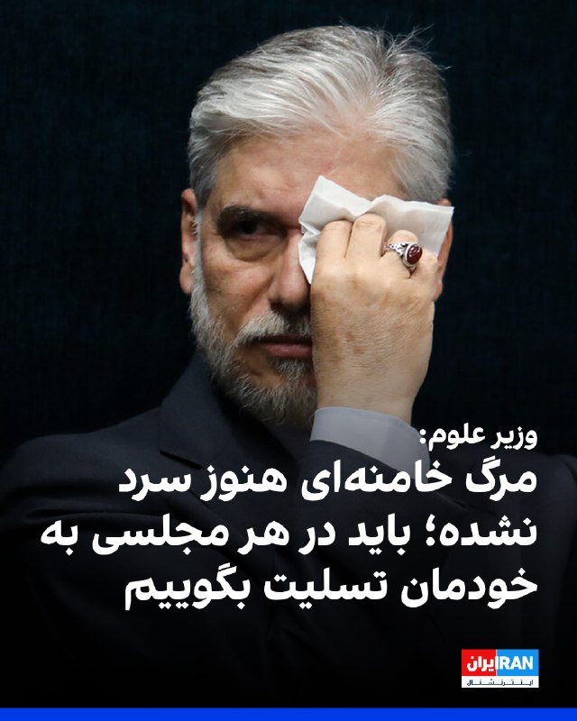

حسین سیمایی صراف، وزیر علوم جمهوری اسلامی، با اشاره به کشته شدن علی خامنه‌ای در حمله مشترک آمریکا و اسرائیل، گفت: «شهادت رهبر انقلاب داغی بود که هنوز سرد نشده است و لذا باید در هر مجلسی به خودمان تسلیت بگوییم.»

علی خامنه‌ای نهم اسفند ۱۴۰۴ در حمله مشترک آمریکا و اسرائیل کشته شد اما با گذشت حدود سه ماه هنوز مراسم تشییع جنازه او برگزار نشده است.
https://iranintl.com/202605284601

## IranIntlTV — post 339350

  

بیت‌کوین در پی افزایش نگرانی‌ها درباره جنگ آمریکا و جمهوری اسلامی و همزمان با خروج سرمایه از صندوق‌های قابل معامله در بورس آمریکا، به پایین‌ترین سطح خود در بیش از شش هفته گذشته رسید.

بزرگ‌ترین ارز دیجیتال جهان پنجشنبه در سنگاپور تا ۳.۳ درصد کاهش یافت و به ۷۲ هزار و ۶۴۳ دلار رسید که ضعیف‌ترین سطح آن از ۲۳ اردیبهشت بود. اتریوم، دومین ارز دیجیتال بزرگ، نیز بیش از ۴ درصد افت کرد و به هزار و ۹۶۵ دلار رسید که پایین‌ترین سطح آن در نزدیک به دو ماه گذشته است.

همزمان سهام و اوراق قرضه کاهش یافتند و بهای نفت پس از حملات تازه در خاورمیانه افزایش پیدا کرد. این تحولات خوش‌بینی‌ها نسبت به دستیابی به توافق برای پایان جنگ را تضعیف و نگرانی‌ها درباره افزایش تورم و رشد نرخ بهره را تقویت کرد.

صندوق‌های قابل معامله در بورس مبتنی بر بیت‌کوین در آمریکا نیز از ابتدای ماه مه تاکنون حدود ۱.۵ میلیارد دلار خروج خالص سرمایه را ثبت کرده‌اند. بر اساس داده‌های کوین‌گلس، در ۲۴ ساعت گذشته حدود ۸۷۳ میلیون دلار از موقعیت‌های صعودی ارزهای دیجیتال بسته شد که ۵۱۲ میلیون دلار آن در چهار ساعت پایانی رخ داد.
https://iranintl.com/202605286334

## IranIntlTV — post 339349

🗣روایت شما از زندگی در آتش‌بس- پنجشنبه ۷ خرداد

🔹اوضاع اقتصادی خیلی سخته اما در این شرایط خودمون باید هوای همدیگه رو داشته باشیم. مطمئنم همه‌چیز درست خواهد شد.

🔹باید تمرکز را روی اقدام مؤثر بگذاریم: اعتصاب سراسری، نپرداختن قبوض، نرفتن به محل کار و بستن مغازه‌ها. درخواست از رهبران خارجی راه‌حل نیست؛ تغییر با حرکت ما آغاز می‌شود.

🔹اینترنت رو از ما گرفتن، بعد با کلی منت اون رو بهمون دادن، اون هم کاملا ضعیف، کند و به شکل فیلترنت.

🔹آقای ترامپ با توافق و فراموش کردن مردم ایران، لطفا نگذار تبدیل به منفورترین رییس‌جمهور آمریکا بشی. یک ایران به قول شما امید بسته.

🔹از وقتی اینترنت وصل شده، به خودم می‌گم از چی خوشحالی؟ اینکه حقت رو بهت دادن؟

🔹اینترنت با اینکه ملی نیست، ولی خیلی ضعیف شده پس مردم به‌خاطر وصل شدن اینترنت که یه حقه، خوشحال نشید.

🔹کسی به فکر این مردم نیست؛ گرونی، بی‌ثباتی و بی‌تکلیفی مردم رو کلافه کرده. نه کاری هست و نه پولی. تا این رژیم عوض نشه، هیچ چیزی تغییر نمی‌کنه.

🔹تنها ۳۰ درصد وی‌پی‌ان‌های ایران کار می‌کنن. وضعیت مردم معلوم نیست و همه مشاغل خوابیده. هیچ‌کس نمی‌دونه باید چی‌کار کنه و قراره چی بشه.

🔹بالاخره بعد از چندین ماه به چیزی که حقمون بود دسترسی پیدا کردیم. ناگفته نماند هنوز هم خیلی‌ها وصل نشدن و ما که وصل هستیم هم اینترنت خیلی ضعیفه.

🔹قیمت اجاره به حدی بالاست که دیگه به‌راحتی نمی‌شه حتی کرایه خونه داد. خرید خونه هم داره به رؤیا تبدیل می‌شه.

🔹از اینکه هر چیزی حداقل یک میلیون تومان شده خسته شدیم. کی تموم می‌شه این کابوس؟

🔹خدایی این چه اینترنتیه که وصل کردین؟ چه فرقی با قطع بودنش داره؟ با این سرعت فقط اعصاب آدم خرد می‌شه.

🔹من یه نوجوان ۱۴ ساله‌ام و خواستم بگم هیچ‌وقت امیدتون رو از دست ندید. چه ترامپ ادامه بده یا نده، توافق بشه یا نشه، نسل ما اینا رو می‌کشه پایین.

🔹اکثریت مردم داخل نگران مماشات آمریکا هستن. پرزیدنت ترامپ لطفا کار رو با همراهی مردم ایران تموم کن. مذاکره با قاتلان مردم ایران بی‌معنیه.

## IranIntlTV — post 339348

  <a href="https://t.me/IranintlTV/339348" target="_blank">📎 Download file</a>

🎧نسخه صوتی اخبار بامدادی | پنجشنبه ۷ خرداد
@iranintlTV

## FarsiVOA — post 218872

  

مهلت ثبت‌نام داوطلبان آزمون سراسری سال ۱۴۰۵ دانشگاه‌ها و موسسات آموزش عالی و همچنین آزمون پذیرش دانشجو معلم، روز جمعه هشتم خرداد پایان می‌یابد.

این در حالی است که تا این لحظه زمان دقیق برگزاری امتحانات نهایی پایه‌ دوازدهم مدارس و همچنین کنکور اعلام نشده و دانش‌آموزان نمی‌دانند چه زمانی باید در جلسه امتحان حضور یابند.

سازمان سنجش آموزش کشور روز ۳۰ اردیبهشت اعلام کرد «زمان دقیق برگزاری کنکور و پذیرش دانشجو معلمان»، یک هفته قبل از آزمون اعلام می‌شود.

از سوی دیگر، علی فرهادی، سخنگوی وزارت آموزش‌وپرورش، نیز اعلام کرده که تکلیف نحوه برگزاری امتحانات نهایی دانش‌آموزان پایه یازدهم و دوازدهم، تا نیمه مرداد ماه مشخص می‌‌شود.

امتحانات نهایی پایه دوازدهم از این جهت قابل اهمیت است که نتایج آن به صورت مستقیم در نتایج کنکور تاثیر می‌گذارد.

پیشتر حمیدرضا حاجی‌بابایی، نایب رئیس مجلس اعلام کرده بود که امتحانات نهایی، ۱۵ روز و کنکور سراسری ۴۵ روز پس از پایان جنگ برگزار خواهد شد.
@FarsiVOA

## FarsiVOA — post 218871

  <a href="telegram/content/FarsiVOA_218871_1779958460.mp4" target="_blank">🎬 Download video</a>

ارتش اسرائیل اعلام کرد در جریان یک حمله هوایی خود به جنوب نوار غزه در روز سه‌شنبه گذشته یک «مقام ارشد مالی» حماس کشته شده است.

ارتش اسرائیل روز پنجشنبه اعلام کرد که این حمله در خان‌یونس انجام شد و ایهاب کریزم، مسئول یک شبکه مرکزی برای انتقال پول به حماس در جریان این حمله کشته شد.

به گفته ارتش اسرائیل، کریزم مسئول «مدیریت انتقال میلیون‌ها دلار به شاخه نظامی حماس» بوده و اخیراً نیز «به نقض توافق آتش‌بس ادامه داده است»؛ اقداماتی که به گفته ارتش اسرائیل، باعث شد حماس بتواند حملات علیه نیروها و غیرنظامیان اسرائیلی را پیش ببرد.

طبق اعلام ارتش اسرائیل، در این حمله همچنین محمد الهباش، یک فرمانده مقر تولید تسلیحات حماس، نیز کشته شد.

همزمان ارتش اسرائیل پنجشنبه گزارش داد که نیروهای واحد کماندویی این ارتش، تحت هدایت شاباک، طی دو روز گذشته در چند عملیات در کرانه باختری هفت فلسطینی مظنون به تروریسم را بازداشت کردند؛

بر اساس این گزارش، برخی متهم به برنامه‌ریزی حملات قریب‌الوقوع علیه اسرائیل بودند.

ارتش اسرائیل اعلام کرد همه بازداشت‌شدگان برای بازجویی بیشتر به نیروهای امنیتی تحویل داده شدند.
@FarsiVOA

## FarsiVOA — post 218870

🔺افزایش ۵ تا ۴۵ برابری تعرفه برق «پرمصرف‌ها»

▪️مدیرکل دفتر مدیریت انرژی و مشتریان توانیر از افزایش ۵ تا ۴۵ برابری تعرفه برق خانوارهای «پرمصرف» خبر داد.

▪️او مدعی شد مصرف برق یک چهارم مشترکین خانگی بالاتر از الگوی مصرف است و نیم درصد مشترکین هم «بسیار بدمصرف» هستند.

▪️طبق گزارش‌های توانیر، بخش خانگی تنها حدود یک سوم برق کشور را مصرف می‌کند و سرانه مصرف برق بخش خانگی ایران حدود ۱۱۰۰ کیلووات ساعت در سال است؛ رقمی که ۶۰ درصد کمتر از اتحادیه اروپا و چندین برابر کمتر از آمریکا و کشورهای عرب حوزه خلیج فارس است.

▪️جمهوری اسلامی طی یک دهه گذشته حتی نیمی از اهداف رشد تولید برق را نتوانسته محقق کند و اکنون در فصول گرم سال با ۲۰ تا ۲۵ درصد کسری برق مواجه است.

⬇️ بیشتر بخوانید:
https://ir.voanews.com/a/iran-5-to-45-times-increase-in-electricity-tariffs-for-high-consumption-consumers/8154811.html

## FarsiVOA — post 218869

  

رئیس اتحادیه صنف چاپخانه‌داران و صحاف تهران، اعلام کرد که بخش قابل توجهی افزایش قیمت کالاها و اجناس، ناشی از هزینه بسته‌بندی و افزایش ۲۰۰ تا ۴۰۰ درصدی قیمت مواد اولیه صنعت چاپ است.

بابک عابدین به خبرگزاری ایلنا گفته است که هزینه‌ بسته‌بندی و چاپ، تأثیر مستقیم بر تورم قیمت کالاهای اساسی داشته است.

او یادآور شد که بخش قابل توجهی از این افزایش قیمت، ناشی از هزینه بسته‌بندی است، زیرا برای تهیه مواد اولیه مانند پلیمرها، آلومینیوم و کاغذ مجبور به پرداخت هزینه‌های چندبرابری هستیم.

به گفته رئیس اتحادیه صنف چاپخانه‌داران، این هزینه‌ها مستقیماً به صنایع مصرفی منتقل و در نهایت به صورت تورم شدید به مصرف‌کننده تحمیل می‌شود.

عابدین یادآور شد که پس از جنگ، قیمت موادی مانند آلومینیوم و ورق‌های چاپ‌پذیری که در بسته‌بندی استفاده می‌شوند به سطح بی‌سابقه‌ای رسیده است.
@FarsiVOA

## FarsiVOA — post 218868

  

دنی دانون، سفیر اسرائیل در سازمان ملل، اعلام کرد که این سازمان اسرائیل را فهرست ناقضان مرتبط با «خشونت جنسی در مناطق درگیری» و در کنار «بی‌رحم‌ترین سازمان‌های تروریستی جهان مثل حماس و داعش» قرار داده است.

آقای دانون در سخنانی ویدیویی که روز پنجشنبه در شبکه اجتماعی ایکس منتشر شد، گفت: «این یک تصمیم سیاسی است! جدا از واقعیت‌ها و حقیقت!»

او افزود: «اسرائیل برای هر ادعا، شواهد، اسناد و پاسخ‌های مفصل ارائه کرده است. ما از نمایندگان سازمان ملل دعوت کردیم به منطقه بیایند و از نزدیک موضوع را بررسی کنند، و آن‌ها البته ترجیح دادند این کار را نکنند. وقتی واقعیت‌ها با روایت مورد نظرشان همخوانی ندارد، در سازمان ملل به‌سادگی روایت را تغییر می‌دهند.»

رسانه‌های اسرائیلی گزارش دادند که اسرائیل قصد دارد همکاری خود با دفتر آنتونیو گوترش، دبیرکل سازمان ملل، را در پی این تصمیم متوقف کند.

در گزارش پیشین که ژوئیه ۲۰۲۵ از سوی دفتر گوترش منتشر شد، حماس در فهرست «طرف‌هایی که به‌طور جدی مظنون به ارتکاب یا مسئول رفتار تجاوز یا دیگر اشکال خشونت جنسی در موقعیت‌های درگیری مسلحانه هستند» قرار گرفته بود.
@FarsiVOA

## FarsiVOA — post 218867

  

قیمت‌های جهانی نفت در پی واکنش ایالات متحده به حملات پهپادی جمهوری اسلامی به یک کشتی آمریکایی و هدف قرار دادن مواضع جمهوری اسلامی افزایش یافت.

قیمت نفت شاخص برنت روز پنج‌شنبه با رشدی بالای ۳.۵ درصدی به نزدیک ۹۸ دلار رسید.

ارزش سهام در بازارهای بورس جهانی، خصوصا آمریکا، نیز در پی افزایش تنش‌های خاورمیانه مقداری افت کرد.

سایت تسنیم، نزدیک به سپاه پاسداران، به نقل از فردی که او را یک «منبع آگاه نظامی» خواند، اوایل روز پنج‌شنبه به وقت محلی گزارش داد که نیروهای سپاه به یک «نفتکش آمریکایی» که قصد داشت از تنگه هرمز عبور کند، حمله کردند.

آمریکا می‌گوید در اقدامی تدافعی، چهار پهپاد انفجاری جمهوری اسلامی را رهگیری و منهدم کرد و یک مرکز پهپاد در ایران را پیش از پرتاب پنجمین پهپاد، هدف حمله قرار داد.
@FarsiVOA

## FarsiVOA — post 218866

  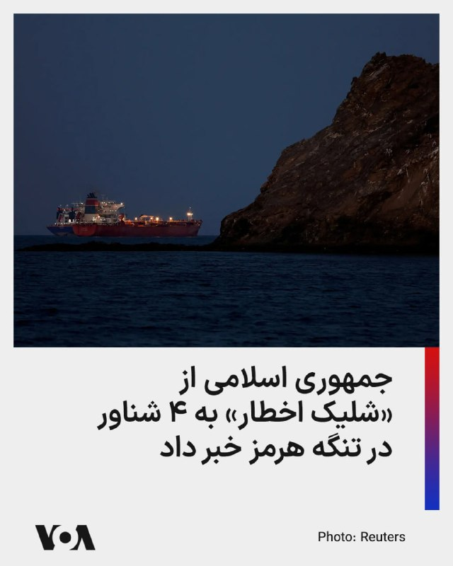

صداوسیمای جمهوری اسلامی به نقل از «یک مقام آگاه نظامی» نوشت که نیروهای رژیم ایران «ساعت ۳۵ دقیقه بامداد پنجشنبه» به سمت ۴ فروند شناور که قصد عبور از تنگه هرمز و ورود به خلیج فارس را داشتند، «شلیک اخطار» دادند.

صداوسیما ادعا کرد که این شناورها «بدون هماهنگی با نیروهای امنیتی تنگه هرمز» قصد عبور از این تنگه را داشتند و شلیک اخطار نیروهای جمهوری اسلامی «آنها را وادار به بازگشت کرد.»

پیشتر یک مقام آمریکایی به صدای آمریکا گفت که «نیروهای ستاد فرماندهی مرکزی آمریکا (سنتکام) چهار پهپاد تهاجمی یک‌طرفه ایرانی را که تهدیدی در اطراف تنگه هرمز ایجاد کرده بودند، سرنگون کردند.»
@FarsiVOA

## FarsiVOA — post 218865

  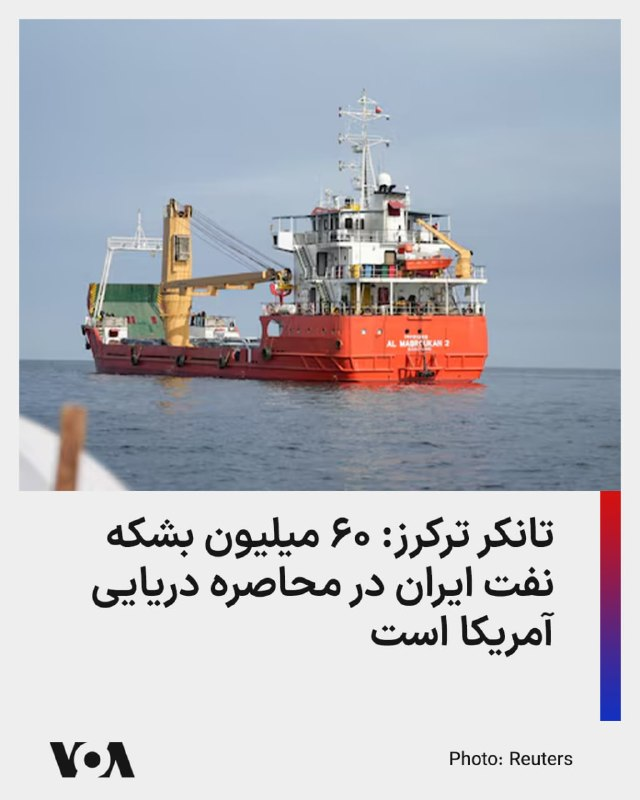

شرکت ردیابی نفتکش‌ها می‌گوید ۶۰ میلیون بشکه نفت بارگیری شده ایران در نفتکش‌ها، گرفتار محاصره دریایی آمریکا شده است.

هم‌زمان سنتکام اعلام کرد تا روز چهارشنبه ۱۰۹ کشتی مرتبط با جمهوری اسلامی را مجبور به تغییر مسیر کرده است.

در پی اجتناب جمهوری اسلامی از رفع انسداد تنگه هرمز به رغم آتش‌بس، ایالات متحده طی شش هفته گذشته محاصره دریایی ایران را آغاز کرده و طبق گزارش شرکت‌های اطلاعات دریایی، ده‌ها نفتکش ایران در آب‌های جنوب کشور گرفتار شده‌اند.

تانکر ترکرز می‌گوید ارزش نفت گرفتار شده ایران در محاصره دریایی آمریکا حدود شش میلیارد دلار است.
@FarsiVOA

## FarsiVOA — post 218864

  

سایت اطلاعات دریانوردی «مارین ترفیک» از نشت سوخت کشتی به دریا در پی حمله به یک نفتکش عظیم در آب‌های عمان خبر داد.

بر اساس این گزارش، نفتکش «المپیک لایف» با پرچم جزایر مارشال، پنج خرداد در آب‌های عمان هدف قرار گرفت و محفظه سوخت آن آسیب دید و مقداری از سوخت کشتی به دریا نشت کرد.

با این حال، خدمه‌ها آسیب ندیده، نفتکش فعال است و هم‌اکنون بدون بارگیری نفت وارد آب‌های بین‌المللی شده است.

پیشتر سازمان عملیات تجارت دریایی بریتانیا حمله به این نفتکش را تأیید کرده بود.
@FarsiVOA

## FarsiVOA — post 218863

🔺ارتش کویت از رهگیری حملات موشکی و پهپادی «دشمن» خبر داد

▪️ارتش کویت اعلام کرد که پدافند هوایی این کشور در حال مقابله با «حملات موشکی و پهپادهای دشمن» است، اما به مبدأ این تهدیدها اشاره نکرد.

▪️کویت میزبان یک پایگاه هوایی آمریکاست و کشورهای حوزه خلیج فارس، از جمله کویت، در جریان جنگ اخیر هدف حملات موشکی و پهپادی سپاه بودند.

▪️این بیانیه پس از حملات آمریکا در اولین ساعات پنج‌شنبه منتشر شد؛ حملاتی که واشنگتن گفت علیه یک عملیات پهپادی ایران انجام شده که نیروهای آمریکایی و کشتیرانی تجاری در تنگه هرمز را تهدید می‌کرده است.

▪️سپاه پاسداران در بیانیه کوتاهی حمله آمریکا را تأیید کرد و گفت یک پایگاه هوایی آمریکا را در ساعت ۴:۵۰ بامداد (به وقت محلی) هدف قرار داده است.

⬇️ بیشتر بخوانید:
https://ir.voanews.com/a/8154810.html

## DW_Farsi — post 125218

  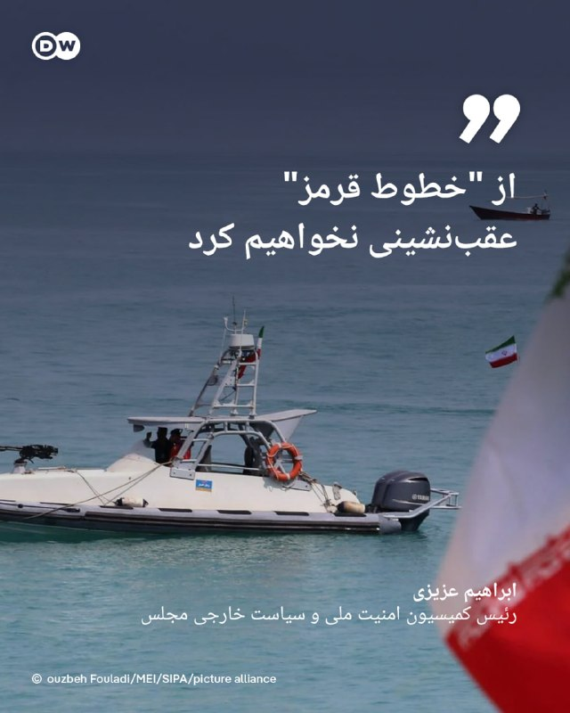

🔶 رئیس کمیسیون امنیت ملی مجلس: از "خطوط قرمز" عقب‌نشینی نخواهیم کرد

ابراهیم عزیزی، رئیس کمیسیون امنیت ملی و سیاست خارجی مجلس شورای اسلامی گفت که جمهوری اسلامی "از خطوط قرمز خود مانند حق غنی‌سازی، اورانیوم غنی‌شده، مدیریت تنگه هرمز و لغو تحریم‌ها عقب‌نشینی نخواهد کرد".

به گزارش خبرگزاری مهر، رئیس کمیسیون امنیت ملی مجلس شورای اسلامی همچنین در ادامه اظهارات خود، تهدیدات دونالد ترامپ، رئیس جمهور آمریکا را "لفاظی" خواند و مدعی شد: «دیگر همه می‌دانند ترامپ برای نجات خود از این بن‌بست راهبردی یک روز از ابزار تهدید استفاده می‌کند و روز دیگر برای توافق التماس‌ می‌کند!»

@dw_farsi

## DW_Farsi — post 125217

  

📸 کاریکاتور هفته

چند ماه از قتل‌عام دی‌ماه در ایران گذشته است؛ جنگی میان جمهوری اسلامی، آمریکا و اسرائیل درگرفت. اینترنتی که نزدیک به سه ماه قطع بود، حالا کم‌کم دارد وصل می‌شود و زمزمه‌های توافقی میان رژیم و آمریکا به گوش می‌رسد؛ توافقی که هنوز امکان تحقق و ابعادش در هاله‌ای از ابهام قرار دارد. هم‌زمان، گروه‌های مختلف اپوزیسیون سرگرم جدال، حذف معنوی و مقصر دانستن یکدیگرند. اما شاید در میان همه این آشوب‌ها، یک چیز بیش از هر چیز دیگر قطعی به نظر برسد: عادی شدن گرفتن جان شهروندان ایرانی به جرم مخالفت و خواستنِ تغییر.

این موضوع دستمایه مانا نیستانی در طراحی کاریکاتور هفته برای دویچه وله فارسی بوده است.

@dw_farsi

## DW_Farsi — post 125215

  <a href="telegram/content/DW_Farsi_125215_1779958465.mp4" target="_blank">🎬 Download video</a>

🎥 یک کانگوروی بازیگوش تحت تعقیب پلیس تگزاس

یک کانگورو به اسم بینگوس از یک مرکز حفاظت از حیات وحش در منطقه ویکو در ایالت تگزاس فرار کرد. بینگوس پس از تعقیب و گریزی کوتاه توسط مأموران پلیس، در سلامت کامل به مرکز حفاظت حیات وحش بازگردانده شد.

@dw_farsi

## DW_Farsi — post 125214

  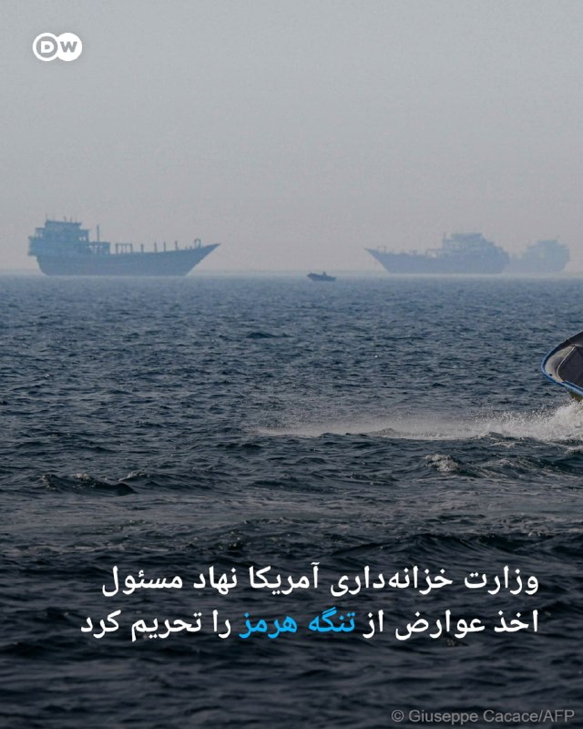

🔶 وزارت خزانه‌داری آمریکا نهاد مسئول اخذ عوارض از تنگه هرمز را تحریم کرد

ایالات متحده آمریکا نهاد موسوم به "نهاد مدیریت آبراه خلیج فارس" که جمهوری اسلامی برای کنترل تنگه هرمز تاسیس کرده بود را تحریم کرد. در همین راستا وزارت خزانه‌داری آمریکا اعلام کرد که این نهاد را در فهرست تحریم‌های خود قرار داده است.

این نهاد که حکومت ایران اخیرا از تاسیس آن خبر داده بود، مسئول "هماهنگی، صدور مجوز عبور و تعیین مقررات تردد کشتی‌ها در تنگه هرمز" اعلام شده است. جمهوری اسلامی با اعلام این خبر تلاش کرده بود، از اهرم کنترل بر عبور و مرور دریایی بر تنگه هرمز استفاده کند.

پیش از این، دفتر کنترل دارایی‌های خارجی وزارت خزانه‌داری آمریکا هشدار داده بود که هرگونه پرداخت مبلغ عوارض به حکومت ایران برای دریافت مجوز عبور از تنگه هرمز می‌تواند به تحریم افراد و شرکت‌های دخیل در آن منجر شود.

این اقدام تحریمی که نخستین بار خبرگزاری آسوشیتدپرس آن را گزارش داد، تازه‌ترین تلاش ایالات متحده آمریکا برای استفاده از اهرم اقتصادی در کنار اقدام نظامی به‌منظور وادار کردن رهبری حکومت ایران به توافق است.

به گفته برخی از ناظران سیاسی، عوارضی که این نهاد تحریم‌شده می‌تواند دریافت کند ممکن است تا ۲ میلیون دلار برای هر کشتی برسد.

فشار جمهوری اسلامی بر تنگه هرمز باعث شوک‌های انرژی در سراسر جهان شده است. قیمت نفت، گاز و محصولات مرتبط افزایش یافته و کارشناسان می‌گویند حتی پس از بازگشایی این آبراه، بازگشت وضعیت حمل‌ونقل دریایی و قیمت‌ها به شرایط عادی ممکن است چند هفته یا حتی چند ماه طول بکشد.

در مقابل، ایالات متحده آمریکا بیش از یک ماه است که بنادر ایران را محاصرهدریایی کرده و ترامپ گفته است این محاصره "تا زمانی که توافقی حاصل، تایید و امضا شود، به طور کامل برقرار خواهد ماند".

@dw_farsi

## DW_Farsi — post 125213

  

🔶 حمله سپاه به "پایگاه هوایی آمریکا" پس از درگیری در تنگه هرمز

سپاه پاسداران انقلاب اسلامی با صدور بیانیه‌ای اعلام کرد که در واکنش به حمله بامداد پنجشنبه ارتش ایالات متحده آمریکا به مناطق اطراف فرودگاه بندرعباس، یک پایگاه هوایی آمریکا را هدف حمله قرار داده است.

در بیانیه روابط عمومی سپاه پاسداران آمده است "به دنبال تعرض سحرگاه امروز ارتش متجاوز آمریکا به نقطه‌ای در حاشیه فرودگاه بندرعباس با پرتابه‌های هوایی"، پایگاه هوایی آمریکا که "مبدا تجاوز" بوده، "در ساعت ۴:۵۰ بامداد" به وقت محلی هدف قرار گرفته است.

بیانیه سپاه همچنین این حمله را "اخطاری جدی" به آمریکا خوانده و اضافه کرده که "تجاوز بدون پاسخ نخواهد ماند".

سپاه همچنین تهدید کرده است که "در صورت تکرار، پاسخ ما قاطع‌تر خواهد بود و مسئولیت عواقب آن با متجاوز است".

با این حال، در این اطلاعیه، اشاره مشخصی به محل دقیق پایگاه مذکور نشده است. این در حالی است که ساعاتی پیش از انتشار بیانیه سپاه، ستاد کل ارتش کویت با صدور اطلاعیه‌ای اعلام کرد که سامانه‌های پدافند هوایی کویت، حملات موشکی و پهپادی خصمانه را رهگیری کرده‌اند.

@dw_farsi

## Persian_Trend_Official — post 15171

  

🇮🇱
🇱🇧 اسرائیل دستور تخلیه کل جنوب لبنان را صادر کرده ، که شامل تمام مناطق جنوب رودخانه لیتانی می‌شود.

👩‍💻@PhantomDirective

🆔@persian_trend_official
پرشین ترند | متفاوت‌ترین کانال نظامی

## Persian_Trend_Official — post 15170

  

البيت سیستمز قراردادی به ارزش ۳۵۰ میلیون دلار برای ارتقاء تانک‌ها از یک مشتری بین‌المللی دریافت کرد.

، حیفا، اسرائیل، ۲۸ مه ۲۰۲۶ // — شرکت البیت سیستمز امروز اعلام کرد که قراردادی به ارزش تقریبی ۳۵۰ میلیون دلار از یک مشتری بین‌المللی برای ارتقاء تانک‌های اصلی میدان نبرد (MBT) دریافت کرده است. این برنامه شامل یکپارچه‌سازی سامانه‌های پیشرفته کنترل آتش، سامانه‌های الکتریکی هدایت توپ و برجک، راهکارهای ارتباطی و آگاهی محیطی، و همچنین بسته ارتقاء میان‌عمر (Mid Life Upgrade) است. اجرای این قرارداد طی چهار سال انجام خواهد شد.
بر اساس این قرارداد، البیت سیستمز سامانه‌های تانک‌ها را برای افزایش عمر عملیاتی و ارتقاء آمادگی رزمی آن‌ها نوسازی خواهد کرد. این برنامه ارتقاء شامل جایگزینی و بهبود سامانه‌های کلیدی روی تانک است و از جمله تجهیزاتی مانند سامانه‌های دید الکترواپتیکی سبک‌وزن و با کارایی بالا با قابلیت‌های هوش مصنوعی (AI) را در بر می‌گیرد که امکان مشاهده در روز و شب، و همچنین شناسایی و رهگیری پیشرفته اهداف را فراهم می‌کنند.
این قرارداد همچنین شامل تأمین قطعات یدکی و ارائه خدمات نگهداری و پشتیبانی فنی برای تضمین آمادگی عملیاتی بلندمدت است. افزون بر این، یک سامانه ارتباط صوتی امن و با ظرفیت بالا نیز در این پروژه یکپارچه خواهد شد.

👩‍💻@PhantomDirective

🆔@persian_trend_official
پرشین ترند | متفاوت‌ترین کانال نظامی

## Persian_Trend_Official — post 15169

  

بیانیه ارتش دفاعی اسرائیل (IDF):

در واکنشی سریع ارتش دفاعی اسرائیل سر شبکه مرکزی انتقال وجوه حماس را از بین برد.

روز سه‌شنبه، ارتش دفاعی اسرائیل در منطقه خان یونس ضربه‌ای وارد کرد و ایهاب خریزم، سر شبکه مرکزی انتقال وجوه حماس را از بین برد.

ایهاب خریزم مسئول مدیریت انتقال میلیون‌ها دلار به شاخه نظامی حماس بود. در ماه‌های اخیر، خریزم به نقض توافق آتش‌بس ادامه داد و فعالیت‌های او به سازمان تروریستی امکان داد حملات فوری علیه نیروهای ارتش دفاعی اسرائیل و غیرنظامیان اسرائیلی انجام دهد.

از بین بردن خریزم ضربه قابل توجهی به تلاش‌های بازسازی و تقویت نیروهای حماس وارد می‌کند.

علاوه بر خریزم، در جریان این حمله، ارتش دفاعی اسرائیل محمد الحباش، فرمانده واحد در ستاد تولید حماس را نیز از بین برد. در طول جنگ، الحباش در ساخت سلاح برای حماس مشارکت داشت.

قبل از حمله، اقداماتی برای کاهش آسیب به غیرنظامیان انجام شد، از جمله استفاده از مهمات دقیق و نظارت هوایی.

نیروهای ارتش دفاعی اسرائیل تحت فرماندهی جنوبی مطابق با توافق آتش‌بس مستقر باقی مانده و به عملیات برای رفع هر تهدید فوری ادامه خواهند داد.

👩‍💻@PhantomDirective

🆔@persian_trend_official
پرشین ترند | متفاوت‌ترین کانال نظامی

## Persian_Trend_Official — post 15168

  <a href="telegram/content/Persian_Trend_Official_15168_1779958470.mp4" target="_blank">🎬 Download video</a>

سپاه پاسداران تصاویری از حملات موشکی بامداد امروز خود به کویت را منتشر کرد.

طبق ویدیو منتشر شده توسط رسانه های سپاه پاسداران در این حمله از موشک‌ های بالستیک سوخت جامد کوتاه برد و میان برد خانواده فاتح استفاده شده است.

📝 Amir

📌 @persian_trend_official
پرشین ترند | متفاوت‌ترین کانال نظامی

## Persian_Trend_Official — post 15167

  <a href="telegram/content/Persian_Trend_Official_15167_1779958472.webm" target="_blank">🎬 Download video</a>

سناتور جمهوری‌خواه لیندسی گراهام: اگر ترامپ به عادی‌سازی روابط بین اسرائیل و عربستان سعودی دست یابد، باید اسم جایزه نوبل را به جایزه ترامپ تغییر دهند.

📝 Amir

📌 @persian_trend_official
پرشین ترند | متفاوت‌ترین کانال نظامی

## Persian_Trend_Official — post 15166

  <a href="telegram/content/Persian_Trend_Official_15166_1779958472.mp4" target="_blank">🎬 Download video</a>

🎥 ویدیویی از ترافیک تنگه هرمز

👩‍💻@PhantomDirective

🆔@persian_trend_official
پرشین ترند | متفاوت‌ترین کانال نظامی

## Persian_Trend_Official — post 15164

  

online:
Brent=96.71 | WTI=90.97

👩‍💻@PhantomDirective

🆔@persian_trend_official
پرشین ترند | متفاوت‌ترین کانال نظامی

## Persian_Trend_Official — post 15163

  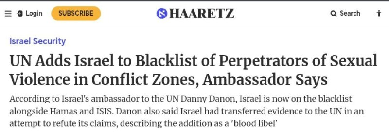

هاآرتص: سازمان ملل متحد اسرائیل را به فهرست سیاه مرتکبان خشونت جنسی در مناطق جنگی اضافه کرد!

به گزارش هاآرتص، دنی دانون سفیر اسرائیل در سازمان ملل، روز پنجشنبه اعلام کرد که سازمان ملل متحد، اسرائیل را به فهرست سیاه عاملان خشونت جنسی در مناطق جنگی اضافه کرده و آن را در کنار حماس و داعش قرار داده است.

دانون گفت که اسرائیل پیش از قرار گرفتن در فهرست سیاه، شواهدی را برای رد این ادعاها به سازمان ملل متحد منتقل کرده بود.

این اقدام پس از گزارش‌های اخیر فعالان ناوگان آزاد شده غزه مبنی بر سوءاستفاده جنسی و تجاوز در بازداشتگاه‌های اسرائیل صورت گرفته است.

📝 Amir

📌 @persian_trend_official
پرشین ترند | متفاوت‌ترین کانال نظامی

## Persian_Trend_Official — post 15162

  <a href="telegram/content/Persian_Trend_Official_15162_1779958474.webm" target="_blank">🎬 Download video</a>

به گزارش کانال 13 تلویزیون اسرائیل، فردا در ساختمان پنتاگون دور جدیدی از مذاکرات بین سفرای اسرائیل و لبنان برگزار خواهد شد.

📝 Amir

📌 @persian_trend_official
پرشین ترند | متفاوت‌ترین کانال نظامی

## Persian_Trend_Official — post 15161

  

دیدار علی باقری با معاون وزیر خارجه روسیه

علی باقری معاون دبیر شورای عالی امنیت ملی جمهوری اسلامی با گئورگی بوریسنکو معاون وزارت خارجه روسیه دیدار و گفتگو کرد.

در این دیدار که کاظم جلالی سفیر ایران در مسکو نیز حضور داشت، درباره آخرین تحولات جاری، حمله نظامی آمریکا و اسرائیل، ایجاد معادله جدید امنیتی در منطقه، پیشبرد همکاری‌ها در راستای تقویت صلح، ثبات و امنیت پیرامونی و دیگر رویدادهای مرتبط با ایران و روسیه در حوزه منطقه ای و بین المللی تبادل نظر صورت گرفت.

📝 Amir

📌 @persian_trend_official
پرشین ترند | متفاوت‌ترین کانال نظامی

## Persian_Trend_Official — post 15159

  <a href="telegram/content/Persian_Trend_Official_15159_1779958475.mp4" target="_blank">🎬 Download video</a>

تصاویر ادعایی از حمله موشکی پهپادی امروز صبح سپاه پاسداران به کویت

برخی منابع خبری ادعا کردند سپاه پاسداران در این حمله پایگاه هوایی علی السالم را هدف قرار داده است.

📝 Amir

📌 @persian_trend_official
پرشین ترند | متفاوت‌ترین کانال نظامی

## Persian_Trend_Official — post 15158

  <a href="telegram/content/Persian_Trend_Official_15158_1779958476.webm" target="_blank">🎬 Download video</a>

سپاه پاسداران: مبدأ تجاوز شب گذشته ارتش امریکا به بندر عباس را مورد حمله خود قرار دادیم.

روابط عمومی سپاه پاسداران انقلاب اسلامی اعلام کرد: به دنبال تعرض سحرگاه امروز ارتش متجاوز آمریکا به نقطه ای در حاشیه فرودگاه بندر عباس با پرتابه های هوایی، پایگاه هوایی آمریکایی مبدا تجاوز ، در ساعت 4:50 دقیقه هدف قرار گرفت.

این پاسخ یک اخطار جدی است تا دشمن بداند، تجاوز بدون پاسخ نخواهد ماند و در صورت تکرار، پاسخ ما قاطع تر خواهد بود. مسئولیت عواقب آن با متجاوز است.

📝 Amir

📌 @persian_trend_official
پرشین ترند | متفاوت‌ترین کانال نظامی

## Persian_Trend_Official — post 15157

  <a href="telegram/content/Persian_Trend_Official_15157_1779958476.webm" target="_blank">🎬 Download video</a>

ارتش کویت ساعاتی پیش اعلامیه مبنی بر مقابله پدافند هوایی این کشور با حملات موشکی و پهپادی منتشر کرد.

مشخصا این حملات توسط سپاه پاسداران در جواب به حمله بامداد امروز امریکا انجام شده است.

📝 Amir

📌 @persian_trend_official
پرشین ترند | متفاوت‌ترین کانال نظامی

## RadioFarda — post 157645

اطلاعات بریتانیا: در جنگ اوکراین، تاکنون نزدیک به ۵۰۰ هزار سرباز روسیه کشته شده‌اند

🔸یک مقام ارشد اطلاعاتی بریتانیا اعلام کرد که از زمان آغاز تهاجم گستردهٔ روسیه به اوکراین در سال ۲۰۲۲ تاکنون، نزدیک به ۵۰۰ هزار سرباز روسیه در جنگی که به وضعیتی نزدیک به بن‌بست هم رسیده، کشته شده‌اند.

🔸این عدد که رئیس سازمان ارتباطات دولتی بریتانیا روز چهارشنبه ششم خرداد اعلام کرد، با برآوردهایی که در ماه‌های اخیر از سوی دیگر دولت‌های غربی و همچنین رسانه‌های مستقل منتشر شده، همخوانی دارد.

🔸خانم کیست-باتلر همچنین هشدارهای پیشین دولت بریتانیا را تکرار کرد و گفت روسیه «بی‌وقفه زیرساخت‌های حیاتی، روندهای دموکراتیک، زنجیره‌های تأمین و اعتماد عمومی» را در بریتانیا و سراسر اروپا هدف قرار می‌دهد.

🔸سازمان ارتباطات دولتی بریتانیا نهاد اصلی اطلاعات شنود این کشور و معادل آژانس امنیت ملی آمریکا است.

🔸او گفت این سازمان بر حفاظت از کابل‌ها و خطوط لولهٔ زیردریایی متصل‌کنندهٔ بریتانیا و مقابله با «اقدامات خرابکارانه و تلاش‌ها برای ترور» تمرکز کرده است.

🔸 گزارش کامل را در وب‌سایت رادیوفردا بخوانید.

@RadioFarda

## RadioFarda — post 157643

🔸وزارت دادگستری آمریکا یک شهروند آمریکایی را به‌دلیل مشارکت در طرح «تعقیب و قتل» مسیح علی‌نژاد، فعال سیاسی ایرانی-آمریکایی، به ۱۰ سال زندان زندان محکوم کرد. 🔸در بیانیه‌ای این نهاد که روز چهارشنبه ششم خرداد منتشر کرده، آمده جاناتان لودهولت، ساکن استاتن آیلند،…

## RadioFarda — post 157642

  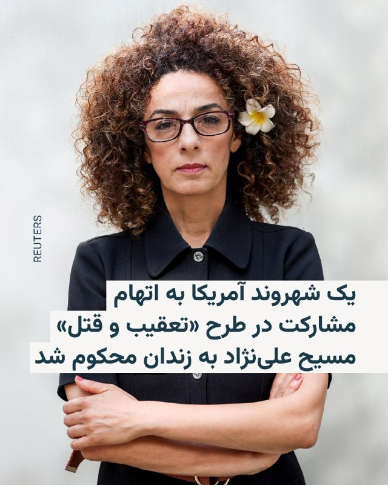

🔸وزارت دادگستری آمریکا یک شهروند آمریکایی را به‌دلیل مشارکت در طرح «تعقیب و قتل» مسیح علی‌نژاد، فعال سیاسی ایرانی-آمریکایی، به ۱۰ سال زندان زندان محکوم کرد.

🔸در بیانیه‌ای این نهاد که روز چهارشنبه ششم خرداد منتشر کرده، آمده جاناتان لودهولت، ساکن استاتن آیلند، «به‌دلیل نقش خود در توطئه تعقیب و قتل یک روزنامه‌نگار و منتقد برجسته حکومت ایران، به زندان محکوم شد.»

🔸بر اساس اعلام وزارت دادگستری آمریکا، لودهولت در یک طرح «قتل سفارشی» که به‌گفته مقامات آمریکایی از سوی حکومت ایران هدایت می‌شد، علیه مسیح علی‌نژاد فعال سیاسی ایرانی-آمریکایی که به‌طور علنی با حکومت ایران مخالفت کرده است، مشارکت داشت.

🔸این متهم علاوه بر حکم زندان، به سه سال آزادی تحت نظارت نیز محکوم شد.

🔸جی کلیتون، دادستان ایالات متحده درباره این پرونده گفته که «حکومت ایران بارها تلاش کرده است تا مسیح علی‌نژاد را همین‌جا در شهر نیویورک ردیابی و به قتل برساند.»

@RadioFarda

## RadioFarda — post 157641

پاراگراف اول؛ آیا «سینمای یواشکی» توانسته سینمای مجوزدار را عقب براند؟

🔸مثل بسیاری از دوگانه‌هایی که جنگ اسرائیل و آمریکا با ایران به آن دامن زده، سینمای ایران نیز دوپاره شده است.

🔸 از یک‌سو سینمای رسمی قرار دارد؛ سینمایی کم‌رمق و پرهزینه که حتی پیش از جنگ نیز به‌تدریج از سبد فرهنگی بسیاری از خانواده‌های ایرانی کنار گذاشته شده بود و امروز با اقتصاد فرسوده و جامعه‌ای تحت فشار بحران معیشت و ناامنی، چشم‌انداز روشنی برای آن تصور نمی‌شود.

🔸 در سوی دیگر، سینمایی شکل گرفته که ریشه‌های آن به‌طور خاص اعتراض‌های ۱۴۰۱ و جنبش «زن زندگی آزادی» بازمی‌گردد؛ سینمایی که سینماگرانش آشکارا در برابر سیاست‌های رسمی وزارت فرهنگ و ارشاد اسلامی و سازوکار سانسور ایستادند و اعلام کردند بدون مجوز هم می‌توان فیلم ساخت.

🔸 این جریان که در فضای عمومی با عنوان «سینمای زیرزمینی» شناخته می‌شود، به‌نوعی بازگشت تصویرهایی است که پس از انقلاب از پردهٔ سینما حذف شده بود. برای اولین‌بار پس از دهه‌ها، تماشاگر ایرانی می‌تواند زنان هنرپیشه را بی‌حجاب بر پردهٔ سینما ببیند.

🔸 اما تفاوت این سینما تنها در ظاهر نیست. به‌تدریج زبان و دستور سیاسی مستقل خود را نیز شکل داده است؛ زبانی صریح، انتقادی و گاه تند که می‌کوشد مرز روشنی میان خود و سینمای مجوزدار ترسیم کند.

🔸 با این حال پرسش اصلی همچنان باقی است: آیا این «سینمای زیرزمینی» توانسته همان تأثیری را بر سینما بگذارد که موسیقی زیرزمینی پیش‌تر بر موسیقی رسمی گذاشت؟ آیا توانسته ذائقهٔ مخاطب را تغییر دهد، سانسور را به عقب براند و به یک جریان اثرگذار تبدیل شود، یا هنوز بیشتر در حد یک کنش اعتراضی باقی مانده است تا یک بدیل واقعی؟

🔸 در برنامهٔ رادیویی «پاراگراف اول»، کاوه فرنام، تهیه‌کنندهٔ سینمای مستقل از پراگ، به همراه عبدالرضا کاهانی، فیلمساز از تورنتو، دربارهٔ شکاف‌های سیاسی و اجتماعی، بازتاب آن بر سینمای رسمی و غیررسمی به بحث پرداختند.

🔸 گزارش کامل را در وب‌سایت رادیوفردا بخوانید.

@RadioFarda

## RadioFarda — post 157638

🔸علی باقری کنی معاون دبیر شورای عالی امنیت ملی ایران می‌گوید جمهوری اسلامی به‌دنبال «آزادسازی تمام دارایی‌‎های مسدودشده ایران» توسط آمریکا است. 🔸او این موضوع را «حق قانونی ملت ایران» عنوان کرده و گفته دارایی‌های ایران «باید تماماً و بدون قید و شرط بازگردانده…

## RadioFarda — post 157637

  

🔸علی باقری کنی معاون دبیر شورای عالی امنیت ملی ایران می‌گوید جمهوری اسلامی به‌دنبال «آزادسازی تمام دارایی‌‎های مسدودشده ایران» توسط آمریکا است.

🔸او این موضوع را «حق قانونی ملت ایران» عنوان کرده و گفته دارایی‌های ایران «باید تماماً و بدون قید و شرط بازگردانده شود».

🔸این اظهارات در شرایطی بیان می‌شود که دونالد ترامپ، رئیس‌جمهور آمریکا، روز چهارشنبه در نشست کابینه خود تأکید کرد که در مذاکرات برای رسیدن به توافق پایان دادن به جنگ، درباره کاهش تحریم‌ها یا انتقال پول به تهران گفت‌وگو نمی‌شود.

🔸او در پاسخ به پرسش یکی از خبرنگاران درباره احتمال کاهش تحریم‌های آمریکا علیه ایران گفت: «ما اصلاً درباره کاهش تحریم‌ها یا دادن پول صحبت نمی‌کنیم. ما کنترل پول‌هایی را در اختیار داریم که آن‌ها ادعا می‌کنند متعلق به خودشان است. ما کنترل آن پول را حفظ خواهیم کرد.»

🔸ترامپ افزود: «هر وقت آن‌ها (ایران) رفتار درستی داشته باشند و کار درست را انجام دهند، اجازه خواهیم داد به پول‌شان دسترسی پیدا کنند.»

@RadioFarda

## RadioFarda — post 157636

گفت‌وگو با دیپلمات آمریکایی؛ بازشدن اینترنت نشانه چرخش از میدان جنگ به میز مذاکره است

🔸پس از ۸۸ روز خاموشی دیجتیال، که نت‌بلاکس آن را «طولانی‌ترین قطع سراسری اینترنت در تاریخ معاصر» خوانده است، و در حالی که گفت‌وگوها با واشینگتن زیر سایۀ فشارهای نظامیِ تازه در خلیج فارس ادامه دارد، ایران دسترسی مردم به اینترنت را هرچند به‌طور محدود برقرار کرده است.

🔸رادیو اروپای آزاد/رادیو آزادی برای موشکافی این موضوع که گشایش محدود دیجیتال از سوی تهران چه معنایی دارد و آیا گفت‌وگوهای کنونی می‌تواند به یک آتش‌بس پایدار بینجامد، با چارلز دان گفت‌وگو کرده است.

🔸او دیپلمات ارشد پیشین آمریکا و مقام امنیت ملی است که بیش از ۲۴ سال پیشینۀ کار دولتی دارد و در دوران ریاست‌جمهوریِ جرج دبلیو بوش، مدیر بخش عراق در شورای امنیت ملی بوده است.

🔸 گزارش کامل را در وب‌سایت رادیوفردا بخوانید.

@RadioFarda

## RadioFarda — post 157635

آوارگان افغان، نگران آغاز مجدد درگیری‌ها با پاکستان، از بازگشت به خانه می‌ترسند

🔸اسدالله، همسرش و شش فرزندشان در چادری در حاشیۀ اسدآباد، مرکز ولایت کُنّر در شرق افغانستان زندگی می‌کنند.
این مرد ۴۲ ساله و خانواده‌اش از جمله ده‌ها هزار شهروند افغانستان هستند که در اثر درگیری‌های مرگبار مرزی پاکستان و کشورشان در ماه‌های اخیر، آواره شده‌اند.

🔸پاکستان حکومت طالبان را به پناه‌دادن به اعضای گروه «تحریک طالبان پاکستان، یا TTP» متهم کرده و حملات هوایی مرگباری را علیه اهدافی در افغانستان، که می‌گوید به این گروه افراطی مربوط بوده‌اند، انجام داده است.

🔸این حملات، پاسخ تلافی‌جویانۀ طالبان افغانستان را به‌دنبال داشت و دو کشور همسایه را به مرز جنگ تمام‌عیار کشاند.

🔸این خشونت‌ها و درگیری‌ها، غیر نظامیان هر دو سوی مرز ۲۶۰۰ کیلومتری دو کشور را هم تحت تأثیر قرار داده است. به گفتۀ سازمان ملل متحد، در افغانستان نزدیک به یکصد هزار تن آواره شده‌اند. بخشی از این گروه به خانه‌های خود بازگشته‌اند؛ اما عده‌ای همچنان بی‌خانمان هستند.

🔸اسدالله در شهر اسدآباد خانه و یک مغازه داشت. درگیری‌های مرزی منجر به ویرانی هر دو شد و حالا او برای گذران زندگی، به کمک‌های بشردوستانه و اعانه‌های مردم محلی وابسته است.

🔸او به رادیو اروپای آزاد/ رادیو آزادی می‌گوید فرزندانش نه می‌توانند به مدرسه بروند و نه به خدمات بهداشتی و درمانی دسترسی دارند. می‌گوید «فعلاً آتش‌بس شده، اما هیچ‌کس نمی‌داند بعد چه اتفاقی خواهد افتاد».

🔸 گزارش کامل را در وب‌سایت رادیوفردا بخوانید.

@RadioFarda

## RadioFarda — post 157634

🔸ارتش کویت بامداد پنجشنبه هفتم خرداد اعلام کرد سامانه‌های پدافند هوایی این کشور در حال رهگیری تهدیدهای موشکی و پهپادی «خصمانه» هستند، اما مشخص نکرد این تهدیدها از کجا منشأ گرفته‌اند. 🔸ارتش این کشور اعلام کرد صداهای انفجاری که در کشور شنیده شده، ناشی از رهگیری…

## RadioFarda — post 157633

  

🔸ارتش کویت بامداد پنجشنبه هفتم خرداد اعلام کرد سامانه‌های پدافند هوایی این کشور در حال رهگیری تهدیدهای موشکی و پهپادی «خصمانه» هستند، اما مشخص نکرد این تهدیدها از کجا منشأ گرفته‌اند.

🔸ارتش این کشور اعلام کرد صداهای انفجاری که در کشور شنیده شده، ناشی از رهگیری این تهدیدها توسط سامانه‌های پدافندی بوده است و از مردم خواست دستورالعمل‌های امنیتی و ایمنی صادرشده از سوی مقامات را رعایت کنند.

🔸این بیانیه پس از حملات آمریکا در اوایل روز پنج‌شنبه منتشر شد؛ حملاتی که واشینگتن می‌گوید علیه یک عملیات پهپادی جمهوری اسلامی انجام شده که نیروهای آمریکایی و کشتیرانی تجاری در تنگه هرمز را «تهدید» می‌کردند.

🔸ایران حمله آمریکا را تأیید و اعلام کرد به‌دلیل حمله آمریکا به منطقه‌ای در نزدیکی فرودگاه بندرعباس، یک پایگاه هوایی آمریکا را در ساعت ۴:۵۰ بامداد هدف قرار داده است، اما به محل این پایگاه را اعلام نکرد.

@RadioFarda

## RadioFarda — post 157632

🔸دفتر کنترل دارایی‌های خارجی وزارت خزانه‌داری آمریکا نهاد تازه‌تأسیس «مدیریت آبراه خلیج فارس» را که جمهوری اسلامی می‌گوید برای «مدیریت» عبور کشتی‌ها از تنگه هرمز ایجاد کرده، در فهرست تحریم‌های خود قرار داده است. 🔸در بیانیه این وزارتخانه که پنج‌شنبه، هفتم…

## RadioFarda — post 157631

  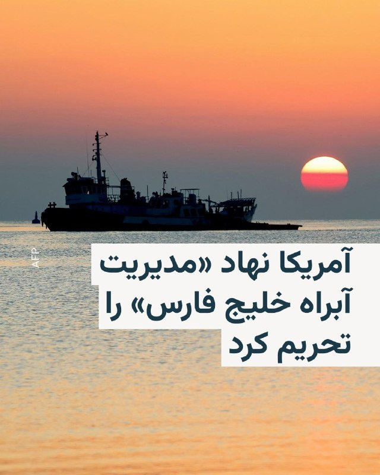

🔸دفتر کنترل دارایی‌های خارجی وزارت خزانه‌داری آمریکا نهاد تازه‌تأسیس «مدیریت آبراه خلیج فارس» را که جمهوری اسلامی می‌گوید برای «مدیریت» عبور کشتی‌ها از تنگه هرمز ایجاد کرده، در فهرست تحریم‌های خود قرار داده است.

🔸در بیانیه این وزارتخانه که پنج‌شنبه، هفتم خرداد، منتشر شده، آمده تأسیس این نهاد، «تلاشی جدید» از سوی سپاه پاسداران انقلاب اسلامی است «برای کسب درآمد از کارزار تروریسم دولتی خود از طریق اخاذی از کشتی‌هایی که از تنگه هرمز عبور می‌کنند».

🔸آمریکا افزوده که این نهاد، «آشکارا قوانین بین‌المللی و تحریم‌های آمریکا را نقض می‌کند».

🔸در این بیانیه تأکید شده است: «هر شخص یا نهادی که با این سازمان به‌اصطلاح تنگه همکاری کند، ممکن است در حال ارائه حمایت و دریافت خدمات از سپاه پاسداران باشد که در نهایت از این اخاذی منتفع می‌شود و بنابراین ممکن است در معرض خطر تحریم قرار گیرد.»

@RadioFarda

## RadioFarda — post 157630

🔸ساعاتی پس از آن‌که یک مقام ارتش آمریکا از حمله علیه «عملیات پهپادی ایران» در نزدیکی تنگه هرمز خبر داد، سپاه پاسداران انقلاب اسلامی اعلام کرد «یک پایگاه هوایی آمریکا» را هدف قرار داده است. 🔸 پنجشنبه هفتم خرداد خبرگزاری‌های بین‌المللی به‌نقل از فرماندهی مرکزی…

## RadioFarda — post 157629

  

🔸ساعاتی پس از آن‌که یک مقام ارتش آمریکا از حمله علیه «عملیات پهپادی ایران» در نزدیکی تنگه هرمز خبر داد، سپاه پاسداران انقلاب اسلامی اعلام کرد «یک پایگاه هوایی آمریکا» را هدف قرار داده است.

🔸 پنجشنبه هفتم خرداد خبرگزاری‌های بین‌المللی به‌نقل از فرماندهی مرکزی ارتش آمریکا، سنتکام، خبر دادند که نيروهای آمریکایی «چهار پهپاد انتحاری ايرانی» را که در اطراف تنگه هرمز «تهديد ايجاد کرده بودند»، ساقط کردند.

🔸سنتکام اعلام کرده که نيروهای آمريکايی همچنين «يک ايستگاه کنترل زمينی ايران در بندرعباس را که در آستانهٔ پرتاب پنجمين پهپاد بود، هدف قرار دادند.»

🔸فرماندهی مرکزی ارتش آمریکا تأکید کرده که اين اقدامات «سنجيده، صرفاً دفاعی و با هدف حفظ آتش‌بس» انجام شد.
این دومین بار در سه روز گذشته است که آمریکا اهدافی را در ایران هدف حمله قرار می‌دهد؛ واشینگتن می‌گوید این حملات در چارچوب دفاع از خود انجام شده‌اند.

🔸 راوید، خبرنگار وب‌سایت اکسیوس، نیز از قول یک مقام ارشد آمریکایی نوشت که جمهوری اسلامی چهار پهپاد انتحاری را به سوی یک کشتی تجاری ایالات متحده «پرتاب کرد»، اما ارتش آمریکا این پهپادها را سرنگون کرد.

@RadioFarda

## IranianMinds — post 20926

  <a href="telegram/content/IranianMinds_20926_1779958479.mp4" target="_blank">🎬 Download video</a>

🔴 جمهوری اسلامی یک پایگاه هوایی آمریکا در کویت را هدف قرار داد که رسانه‌ها ادعا می‌کنند از آن برای حمله به بندرعباس در جنوب ایران استفاده شده است.

@IranianMinds

## IranianMinds — post 20925

  

🔴 یک مقام وزارت بهداشت :

بمولا رهبرمون هیچیش نشد ی چن تا خراش بود فقط اخبارای کذبو‌ اصلا باور نکنید ، آقا موشتبی حتی روزه هم میگرفت تو ماه رمضان.

@IranianMinds

## IranianMinds — post 20924

  

🔴 سازمان ملل اسرائیل را به فهرست سیاه مربوط به خشونت جنسی مرتبط با درگیری‌ ها اضافه کرد.

@IranianMinds

## BBCPersian — post 282252

🔻افزایش قیمت نفت در پی حملات تازه ایران و آمریکا

قیمت نفت در معاملات روز پنج‌شنبه بار دیگر صعود کرد، در حالی که اغلب بورس‌های آسیایی با افت مواجه شدند. این تحولات در پی حملات تازه آمریکا به ایران و افزایش نگرانی‌ها درباره شکننده بودن آتش‌بس رخ داده است.

افزایش قیمت نفت بخش زیادی از کاهش روز چهارشنبه را جبران کرد، کاهشی که به امید دستیابی قریب‌الوقوع به توافقی برای پایان دادن به درگیری‌ها شاهد آن بودیم.

نفت برنت دریای شمال، شاخص اصلی بین‌المللی، در معاملات صبح پنج‌شنبه ۱/۸ درصد افزایش یافت و به ۹۵/۹۵ دلار در هر بشکه رسید. همچنین نفت خام وست تگزاس اینترمدیت آمریکا هم با رشد ۱/۷درصدی به ۹۰/۱۷ دلار رسید.

بازارهای سهام آسیا عمدتاً نزولی بودند؛ شاخص هنگ‌کنگ بیش از ۱/۵ درصد افت کرد.

بورس سئول هم نزدیک به یک درصد کاهش یافت و شاخص شانگهای نیز ۰/۳ درصد پایین آمد.

این کاهش‌ها پس از عملکرد قابل توجه بازارهای جهانی سهام در روز چهارشنبه رخ داد.

اقتصاددانان هشدار داده‌اند اگر تورم در نتیجه جنگ تشدید شود، بانک‌های مرکزی ممکن است ناچار به افزایش نرخ بهره شوند؛ اقدامی که هزینه استقراض را بالا می‌برد و می‌تواند رشد اقتصادی را تحت فشار قرار دهد.

@BBCPersian

## BBCPersian — post 282251

  

🔻ترافیک اینترنت ایران به ۵۳ درصد سطح پیش از اعتراضات دی‌ماه رسید

در پی بازگشت تدریجی دسترسی به اینترنت جهانی در ایران، داده‌های شرکت کنتیک نشان می‌دهد که حجم ترافیک اینترنت بین‌الملل پس از هفته‌ها محدودیت شدید، تا ساعت ۷ و نیم صبح امروز به ۵۳ درصد حجم پیش از اعتراضات دی‌ماه ۱۴۰۴ رسیده است.

این روند تا حدی شبیه به وضعیت وصل شدن نسبی اینترنت بعد از اعتراضات است. در آن زمان به‌رغم اتصال برخی خدمات به اینترنت جهانی، این اتصال بسیار ناپایدار و با اختلالات متناوب همراه بود.

مشخص نیست آیا دسترسی به حالت قبل بر‌خواهد گشت یا به همان شکل ناپایدار باقی خواهد ماند.

گزارش‌های رسیده و تجربیات کاربران حاکی است که دسترسی به برخی خدمات امکان‌پذیر شده است هرچند ارتباط با ثبات نیست و از جمله، تماس‌های صوتی- تصویری، کیفیت بالایی ندارند.

@BBCPersian

## BBCPersian — post 282250

🔻رئیس انجمن صنفی دفاتر مسافرتی ایران: خسارت وارده به صنعت گردشگری در جنگ از ۲۰ هزار میلیارد تومان فراتر رفته است

رئیس انجمن صنفی دفاتر خدمات مسافرتی ایران گفته است که در جریان جنگ اخیر، «حدود پنج همت (۵ هزار میلیارد تومان) خسارت به دفاتر خدمات مسافرتی وارد شده و مجموع خسارت صنعت گردشگری می‌تواند از ۲۰ همت (۲۰ هزار میلیارد تومان) فراتر برود.»

حرمت‌الله رفیعی با انتقاد از فشارهای مالیاتی و بیمه‌ای بر فعالان این صنف، گفت که دفاتر مسافرتی در شرایط دشوار ناشی از محدودیت‌های ناوگان هوایی و کاهش قدرت خرید مردم با مشکلات جدی مواجه هستند و حمایت موثری از سوی دستگاه‌های اجرایی دریافت نکرده‌اند.

او با اشاره به اینکه تاکنون ایرلاین‌ها و برخی مراکز اقامتی اقدامی برای بازگرداندن هزینه‌های پروازها و هتل‌های لغوشده به مردم انجام نداده‌اند، گفت: «به دلیل نبود مرجع واحد برای رسیدگی به شکایات، آمار دقیقی از مطالبات وجود ندارد، اما در خوش‌بینانه‌ترین حالت دست‌کم ۵۰۰ میلیارد تومان از پول مردم بابت خدمات لغوشده نزد ایرلاین‌ها، مراکز اقامتی و صاحبان قدرت باقی مانده و باید هرچه سریع‌تر بازگردانده شود.»

@BBCPersian

## BBCPersian — post 282245

🔻فیلیپه فان دورسن، بی‌بی‌سی برزیل

اسرائیل به دنبال مرگ حییم وایزمن به رئیس‌جمهور جدیدی نیاز داشت. بنابراین وزارت خارجه نام یهودیان سرشناس را مطرح کرد که می‌توانستند این نقش را ایفا کنند و مهاجرت به کشور تازه‌ تاسیس را تشویق کنند.

به این ترتیب، دولت داوید بن‌ گوریون نخست‌وزیر تصمیم گرفت بار دیگر یک دانشمند را برای این مقام دعوت کند و اصلی‌ترین گزینه، مشهورترین دانشمند جهان بود.

آبا ابن به نمایندگی از بن‌گوریون نامه‌ای به اینشتین نوشت.

او نوشت: «اسرائیل کشوری کوچک از نظر ابعاد فیزیکی است، اما می‌تواند به بزرگی دست یابد، زیرا عالی‌ترین سنت‌های معنوی و فکری مردم یهود را چه در دوران باستان و دوران مدرن به نمایش می‌گذارد.»

@BBCPersian
📷 Getty Images

## BBCPersian — post 282244

🔻مقام ارشد اتحادیه اروپا: ادامه جنگ آمریکا با ایران به نفع هیچ کس نیست

کایا کالاس، مسئول سیاست خارجی اتحادیه اروپا، هشدار داد که ادامه جنگ آمریکا با ایران به نفع هیچ‌کس نیست. این در حالی که دو طرف برغم آتش‌بس همچنان به تبادل آتش ادامه می‌دهند.

خانم کالاس در نشست وزرای خارجه اتحادیه اروپا در قبرس به خبرنگاران گفت: «آن‌ها اکنون در منطقه‌ای بسیار خطرناک میان جنگ و صلح قرار دارند و ادامه این جنگ به نفع هیچ‌کس نیست.»

@BBCPersian

## BBCPersian — post 282243

🔻آژانس بین‌المللی انرژی روز پنج‌شنبه اعلام کرد جنگ خاورمیانه کشورها را وادار کرده است برای عبور از بزرگ‌ترین بحران انرژی جهان، به مسیرهای جدید تامین و همچنین منابع داخلی روی بیاورند.

فاتح بیرول، مدیر اجرایی آژانس بین‌المللی انرژی گفت: «ما در بحبوحه بزرگ‌ترین بحران امنیت انرژی هستیم که جهان تاکنون تجربه کرده است.
معتقدم شرایط فعلی استراتژی‌های سرمایه‌گذاری‌ را در سطح جهانی تغییر خواهد داد، مشابه تغییرات بزرگی که پس از شوک‌های نفتی دهه ۱۹۷۰ در جهان انرژی اتفاق افتاد.»

آقای بیرول در گزارش «سرمایه‌گذاری جهانی انرژی» که توسط آژانس بین المللی انرژی منتشر شده، ‌گفته است که در حال حاضر هم کشورهای تولیدکننده انرژی و هم کشورهای مصرف‌کننده، تلاش‌های خود را برای متنوع کردن مسیرهای تجارت و منابع انرژی بیشتر کرده‌اند.

بر اساس برآورد این سازمان ، سرمایه‌گذاری جهانی انرژی در سال ۲۰۲۶ به ۳/۴ تریلیون دلار خواهد رسید که کمی بالاتر از سال قبل است.

از این میزان، حدود ۲/۲ تریلیون دلار به شبکه‌های برق، ذخیره‌سازی، سوخت‌های کم‌انتشار، انرژی هسته‌ای، انرژی‌های تجدیدپذیر، بهره‌وری انرژی و برق‌رسانی اختصاص خواهد یافت.

در کنار آن، حدود ۱/۲ تریلیون دلار نیز در نفت، گاز طبیعی و زغال‌سنگ سرمایه‌گذاری می‌شود.

با این حال، پیش‌بینی می‌شود سرمایه‌گذاری در بخش نفت برای سومین سال پیاپی در سال ۲۰۲۶ کاهش یابد و با وجود افزایش قیمت نفت خام، به زیر ۵۰۰ میلیارد دلار برسد.

@BBCPersian

## BBCPersian — post 282242

🔻ارتش اسرائیل پس از هشدار تخلیه، حملات به زیرساخت‌های حزب‌الله در شهر صور را آغاز کرد

ارتش اسرائیل روز پنج‌شنبه اعلام کرد پس از صدور هشدار تخلیه برای ساکنان شهر صور در جنوب لبنان، حملات به زیرساخت‌های حزب‌الله در اطراف این شهر را آغاز کرده است.

ارتش اسرائیل در بیانیه‌ای گفته است که ناچار به انجام اقدامات قاطع علیه حزب‌الله هستیم.

ارتش اسرائیل همچنین گفت که ساکنان محدوده اطراف برخی ساختمان‌ها باید این منطقه را ترک کرده و به شمال رودخانه زهرانی بروند و هشدار داد که ماندن در این منطقه «جان آن‌ها را در معرض خطر قرار می‌دهد.»

خبرگزاری دولتی لبنان هم گزارش داد صبح پنج‌شنبه دو موج حمله هوایی اسرائیل شهر صور و منطقه‌ای در شرق آن را هدف قرار داده که به اصابت به یک ساختمان و وقوع آتش‌سوزی در این شهر منجر شده است.

@BBCPersian

## BBCPersian — post 282234

🔻روزبه حمیدیان، روزنامه‌نگار

با افزایش تعطیلی و غیرحضوری شدن مدارس ایران، این نگرانی بین خانواده‌ها و معلمان ایجاد شده که دانش‌آموزان با افت تحصیلی جدی رو‌به‌رو شوند. مرکز پژوهش‌های مجلس هم هشدار داده که اگر سیاست‌های متناسب با این شرایط جنگی و آتش‌بس مهیا نشود، «آثار جبران ناپذیری برای نظام آموزشی کشور به دنبال خواهد داشت.»

بنابر قانون بازگشایی مدارس مصوب سال ۱۳۷۶، سال تحصیلی از مهر شروع و در اردیبهشت تمام می‌شود و خرداد، ماه زمان برگزاری امتحان است اما امسال دانش‌آموزان ایرانی حدود نصف زمان تحصیل را دور از مدرسه سپری کرده‌اند.

بر اساس سند برنامه درسی ملی که در سال ۱۳۹۱ از سوی شورای عالی آموزش و پرورش تصویب شده، دانش‌آموزان ابتدایی در هر سال باید ۹۲۵ ساعت در سال تحصیلی در کلاس حاضر باشند. دانش‌آموزان برای گذراندن هر سال تحصیلی متوسطه اول ۱۱۱۰ ساعت و متوسطه دوم ۱۲۹۵ ساعت باید در مدرسه باشند.

این در حالی است که امسال تقریبا تا پیش از نهم اسفند که جنگ شروع شد، اکثر دانش‌آموزان به‌خصوص در شهر تهران بیشتر از یک ماه از مدرسه دور بوده‌اند.

@BBCPersian
📷Getty Images / Eghtesadonline/ IRNA

## BBCPersian — post 282233

  

🔻آمریکا نهاد مدیریت آبراه خلیج فارس را تحریم کرده است.

وزارت دارایی این کشور در بیانیه‌اش تاسیس این نهاد را تلاش سپاه پاسداران برای «کسب درآمد از عبور شناورها از تنگه هرمز» خواند و این نهاد و «تمام کسانی را که با آن همکاری می‌کنند» را در فهرست تحریم خود قرار داد.

ایران پس از بستن تنگه هرمز و محاصره بنادر ایران توسط آمریکا، این نهاد را برای نظارت و هماهنگی عبور شناورها با این کشور تاسیس کرده است.

حساب رسمی این نهاد در ایکس پیشتر با انتشار نقشه «محدوده نظارتی» در تنگه هرمز، گفته بود که تردد در این محدوده «نیازمند هماهنگی» با این نهاد است.

طبق این اعلام، این محدوده از «خط اتصال کوه مبارک در ایران و جنوب فجیره در امارات در شرق تنگه» تا «خط اتصال انتهای جزیره قشم در ایران و ام‌القیوین در امارات در غرب تنگه» تعریف شده است.به گفته این نهاد تردد شناورها برای عبور از تنگه هرمز در این محدوده، نیازمند هماهنگی با «مدیریت آبراه خلیج‌فارس» و دریافت مجوز از این نهاد است.

در روزهای اخیر هم گزارش‌هایی از همراهی و یا توقف شناورهای عبوری از این منطقه توسط ایران منتشر شده بود.

@BBCPersian
📷 REUTERS

## Dirty_Kids — post 390374

  

بچه‌های نیرو مسلح‌شون انقد بی‌خایه هستن که حتی میترسن از پشت شناسایی بشن، محو میکنن پس‌کله‌رو 😂

@Dirty_Kids 👻

## Dirty_Kids — post 390373

  <a href="telegram/content/Dirty_Kids_390373_1779958483.mp4" target="_blank">🎬 Download video</a>

مردم تو لندن هم از دست اینا آرامش ندارن

یکی از مزدورای جمهوری اسلامی رفته یکی از معترضا روبا ماشین زیر گرفته :/

@Dirty_Kids 👻

## Dirty_Kids — post 390372

  

اگه توی جنگ با اسراییل کار با سلاح به دردتون میخورد، حاجی‌زاده اون پشت تبدیل به مقوا نمیشد.

@Dirty_Kids 👻

## Dirty_Kids — post 390371

  <a href="telegram/content/Dirty_Kids_390371_1779958485.mp4" target="_blank">🎬 Download video</a>

پزشکیان وقتی بهش میگن با دستور تو اینترنت آزاد شد:

@Dirty_Kids 👻

## Dirty_Kids — post 390370

‏واقعا جالبه که عرزشیا برامون مینویسن "بسوزید چون ما پیروزیم".
حقیقتا موجوداتی به دنده‌پهنی و بی‌رگی اینها ندیدم. رهبرشون رو یجوری نفله کردن که حتی قبر هم نداره و اینها مجبورند با قاتلش مذاکره هم بکنن. بعد اینها به دیگران میگن بسوز!
لامصبا جرواجر شدید. چطور روتون میشه کری بخونید؟!

@Dirty_Kids 👻

## Dirty_Kids — post 390369

  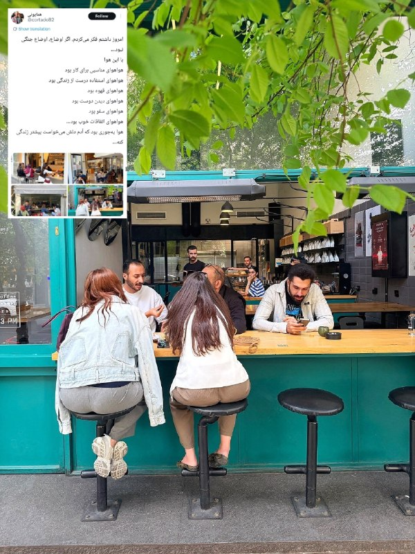

بچه‌ها شما که نبودید، ینفر به اسم همایون راه افتاده بود تو سطح شهر از کون ملت عکس میگرفت پخش میکرد و میگفت؛ اگه جنگ نشده بود الان خیلی حال میاد با این کون‌ها زندگی کردن

@Dirty_Kids 👻

## Dirty_Kids — post 390368

  <a href="telegram/content/Dirty_Kids_390368_1779958486.mp4" target="_blank">🎬 Download video</a>

از ریش سفیدت خجالت بکش
عرزشی رو سگ بگیره، جو نگیره

@Dirty_Kids 👻

## Hranews — post 113204

عمر عزیزی با تودیع وثیقه از زندان زاهدان آزاد شد

❗️
❗️
❗️
❗️
❗️– عمر عزیزی، شهروند اهل شهرستان قصرقند، روز دوشنبه با تودیع وثیقه از زندان زاهدان آزاد شد. وی در آبان ماه سال گذشته بازداشت شده بود.

ادامه مطلب

#عمر_عزیزی

↘️
@hranews_bot تماس ✉️ - @Hranews کانال هرانا 🆑

## Hranews — post 113203

  

مدیر کمپین معلولان در گفتگو با ایرنا نسبت به پیامدهای کمبود بودجه در تأمین لوازم بهداشتی افراد دارای معلولیت هشدار داد و گفت: به دلیل ناکافی بودن کمک‌هزینه‌ها، بسیاری از افراد ناچارند اقلام یک‌بارمصرفی مانند پوشک، سوند و نلاتون را چندبار استفاده کنند؛ اقدامی که می‌تواند به بروز عفونت‌های شدید و حتی مرگ منجر شود. او تأکید کرد که در شرایط تورمی فعلی، عدم افزایش حق پرستاری و کمک‌هزینه‌های بهداشتی فشار مضاعفی بر زندگی افراد دارای معلولیت وارد کرده است.

در ادامه این گزارش، مادر دو فرزند دارای معلولیت "شدید"، از وضعیت معیشتی و درمانی خانواده‌اش گفت و توضیح داد که با وجود افزایش شدید قیمت پوشینه و سایر اقلام بهداشتی، مستمری و حمایت‌های بهزیستی پاسخگوی نیازهای اولیه نیست. به گفته او، تأخیر در پرداخت کمک‌هزینه‌ها و ناکافی بودن درآمد خانوار، در کنار مشکلات مسکن و نبود حمایت‌های پایدار، شرایط زندگی این خانواده را به وضعیت بحرانی رسانده است.
#افراد_دارای_معلولیت #معلولان

↘️
@hranews_bot تماس ✉️ - @Hranews کانال هرانا 🆑

## Hranews — post 113202

  

علی خسروی، زندانی سیاسی از زندان بیرجند آزاد شد

❗️
❗️
❗️
❗️
❗️– علی خسروی، زندانی سیاسی اهل بیرجند که در زندان این شهرستان محبوس بود، به صورت مشروط آزاد شد.

به گزارش خبرگزاری هرانا، ارگان خبری مجموعه فعالان حقوق بشر در ایران، علی خسروی آزاد شد.

بر اساس اطلاعات دریافتی هرانا، آزادی آقای خسروی به صورت مشروط از زندان بیرجند صورت گرفته است.

ادامه مطلب

#علی_خسروی

↘️
@hranews_bot تماس ✉️ - @Hranews کانال هرانا 🆑

## alonews — post 123239

  <a href="telegram/content/alonews_123239_1779958488.webm" target="_blank">🎬 Download video</a>

👈ان‌بی‌سی: پنتاگون فهرست جدیدی از اهداف نظامی ایران تهیه کرده است

✅ @AloNews خبر جنگ

## alonews — post 123238

  <a href="telegram/content/alonews_123238_1779958489.mp4" target="_blank">🎬 Download video</a>

👈 تصاویری از شدت خسارات وارده بر تاسیسات فولاد در اصفهان

✅ @AloNews خبر جنگ

## alonews — post 123237

  <a href="telegram/content/alonews_123237_1779958490.webm" target="_blank">🎬 Download video</a>

👈کره شمالی درخواست آمریکا برای خلع سلاح‌ هسته‌ای را رد کرد

✅ @AloNews خبر جنگ

## alonews — post 123236

  <a href="telegram/content/alonews_123236_1779958490.webm" target="_blank">🎬 Download video</a>

👈وزیر دفاع طالبان : ما ثابت کردیم که خاک ما تهدیدی برای ایران نیست

✅ @AloNews خبر جنگ

## alonews — post 123235

  <a href="telegram/content/alonews_123235_1779958490.webm" target="_blank">🎬 Download video</a>

👈اسرائیل بار دیگر دستور تخلیه کل جنوب لبنان، شامل تمام مناطق جنوب رودخانه زهرانی، را صادر کرده است.

🔴(نقشه پیوست توسط ارتش اسرائیل طی دستور قبلی در گذشته ارائه شده است)

✅ @AloNews خبر جنگ

## alonews — post 123234

  <a href="telegram/content/alonews_123234_1779958490.mp4" target="_blank">🎬 Download video</a>

👈فیلمی از شهر صور پس از حملات هوایی اسرائیل در طول شب

✅ @AloNews خبر جنگ

## alonews — post 123233

  <a href="telegram/content/alonews_123233_1779958492.webm" target="_blank">🎬 Download video</a>

👈ابوترابی، نماینده مجلس: دارند با آبنبات چوبی صندوق ۳۰۰ میلیارد دلاری فریبمان می‌دهند، آمریکا بعد از جام جهانی و انتخابات میان‌دوره‌ای به ما حمله می‌کند
‌

🔴 باز کردن تنگه هرمز با ۱۲ میلیارد دلار پول خفت و خواری است.

✅ @AloNews خبر جنگ

## alonews — post 123232

  <a href="telegram/content/alonews_123232_1779958492.mp4" target="_blank">🎬 Download video</a>

👈سناتور گراهام : به متحدان عرب ما می‌گم، باید به ترامپ کمک کنید

🔴اگر هم بهش نه بگید، مسئولیت و خطرش با خودتونه

✅ @AloNews خبر جنگ

## alonews — post 123231

  <a href="telegram/content/alonews_123231_1779958494.webm" target="_blank">🎬 Download video</a>

👈خبرگزاری روسی اینترفاکس روز چهارشنبه مدعی شد که روسیه و طالبان در جریان نشست بین‌المللی امنیتی در مسکو توافقنامه‌ای برای همکاری‌های نظامی و فنی امضا کردند!

✅ @AloNews خبر جنگ

## alonews — post 123230

  <a href="telegram/content/alonews_123230_1779958494.webm" target="_blank">🎬 Download video</a>

👈وزارت دفاع چین درباره وضعیت خاورمیانه: گفتگو و مذاکره تنها راه حل بحران است

✅ @AloNews خبر جنگ

## alonews — post 123229

  <a href="telegram/content/alonews_123229_1779958494.webm" target="_blank">🎬 Download video</a>

👈کایا کالاس، مسئول سیاست خارجی اتحادیه اروپا: بازگشت به جنگ به نفع هیچکس نیست!

🔴«آنها [آمریکا و ایران] در حال حاضر در این منطقه بسیار خطرناک بین جنگ و صلح قرار دارند، و ادامه این جنگ به نفع هیچکس نیست.»

✅ @AloNews خبر جنگ

## alonews — post 123228

  <a href="telegram/content/alonews_123228_1779958494.webm" target="_blank">🎬 Download video</a>

👈آکسیوس به نقل از مقام ارشد امریکایی مدعی شد: ایران چهار پهپاد حمله‌ای یک‌طرفه را به سمت یک ناو نیروی دریایی آمریکا و یک کشتی تجاری پرتاب کرد

🔴 نیروهای آمریکایی این پهپادها را رهگیری کردند و همچنین یک واحد پرتاب پهپاد ایرانی دیگر را روی زمین قبل از اینکه بتواند شلیک کند، هدف قرار دادند.

✅ @AloNews خبر جنگ

## alonews — post 123227

  <a href="telegram/content/alonews_123227_1779958495.webm" target="_blank">🎬 Download video</a>

👈 املت هم لاکچری شد!

🔴قیمت یه «املت» به ۵۰۰ هزار تومن رسیده است.

✅ @AloNews خبر جنگ

## alonews — post 123226

  <a href="telegram/content/alonews_123226_1779958495.webm" target="_blank">🎬 Download video</a>

👈قیمت بیت‌کوین امروز با کاهش ۳.۵۳ درصدی به ۷۳,۳۰۸ دلار و اتریوم با کاهش ۴.۴۴ درصدی به ۱,۹۹۱ دلار رسید

✅ @AloNews خبر جنگ

## alonews — post 123225

  <a href="telegram/content/alonews_123225_1779958495.webm" target="_blank">🎬 Download video</a>

👈قیمت دلار آزاد امروز با کاهش، به ۱۷۲ هزار و ۵۰۰ تومان رسید.

✅ @AloNews خبر جنگ

## alonews — post 123224

  <a href="telegram/content/alonews_123224_1779958495.webm" target="_blank">🎬 Download video</a>

👈سناتور جمهوری‌خواه لیندسی گراهام:
اگر ترامپ به عادی‌سازی روابط بین اسرائیل و عربستان سعودی دست یابد، باید جایزه نوبل را به جایزه ترامپ تغییر دهند.

✅ @AloNews خبر جنگ

## alonews — post 123223

  <a href="telegram/content/alonews_123223_1779958495.webm" target="_blank">🎬 Download video</a>

👈پوتین در جریان وضعیت نیروگاه هسته‌ای بوشهر قرار گرفت

✅ @AloNews خبر جنگ

## alonews — post 123222

  <a href="telegram/content/alonews_123222_1779958495.webm" target="_blank">🎬 Download video</a>

👈علی باقری کنی، معاون دبیر شورای عالی امنیت ملی: پیگیر آزادسازی تمام دارایی‌های مسدودشده ایران در آمریکا هستیم؛ این دارایی‌ها باید بدون قید و شرط به کشور بازگردانده شود.

✅ @AloNews خبر جنگ

## alonews — post 123221

  <a href="telegram/content/alonews_123221_1779958496.webm" target="_blank">🎬 Download video</a>

👈 بازار عجیب معاوضه گوسفند و سیم کارت با خودرو در ایران / مبادله کالا با کالا راه افتاد!

🔴 بازار خودرو ایران حالا وارد فاز عجیب و جدیدی شده است

🔴اگر سری به فضای مجازی بزنید با تبلیغات مختلف معاوضه سیم کارت و یا حتی گوسفند با خودرو مواجه می‌شوید.

🔴به عنوان مثال فردی یک سیم کارت ۹۱۲ کد یک را با خودرویی تا ۱.۵ میلیارد تومان برای معاوضه آگهی کرده است.

🔴از طرفی معاوضه گوسفند با خودرو هم به شدت مشاهده می‌شود و به عنوان نمونه فردی ۱۰ تا ۱۵ گوسفند را برای معاوضه با خودرو گذاشته است.

🔴آنطور که به نظر می‌رسد حالا با افزایش قیمت‌ها شاهد مبادله‌های کالا با کالا به خصوص در زمینه خودرو هستیم

✅ @AloNews خبر جنگ

## alonews — post 123220

  <a href="telegram/content/alonews_123220_1779958496.webm" target="_blank">🎬 Download video</a>

👈 آژانس بین‌المللی انرژی: جنگ خاورمیانه، استراتژی‌های ملی انرژی را تغییر داده است

🔴آژانس بین‌المللی انرژی اعلام کرد: جنگ خاورمیانه، کشورها را به سمت باز کردن مسیرهای جدید تأمین و روی آوردن به منابع داخلی برای غلبه بر بزرگترین بحران انرژی جهان سوق می‌دهد.

🔴فاتح بیرول، مدیر اجرایی آژانس بین‌المللی انرژی، گفت: «ما در بحبوحه بزرگترین بحران امنیت انرژی هستیم که جهان تاکنون با آن روبرو بوده است – و من معتقدم که این امر، استراتژی‌های سرمایه‌گذاری در سطح جهان را تغییر خواهد داد، که مشابه تغییرات عمده‌ای است که جهان انرژی پس از شوک‌های نفتی دهه ۱۹۷۰ شاهد آن بود.»

✅ @AloNews خبر جنگ

<!-- MSG END -->

<!-- NAV START -->

<a href="https://github.com/drsploit/aio-DL/blob/main/telegram/content/archive_1.md" style="display:inline-block; padding:6px 12px; margin:0 4px; background-color:#2ea44f; color:white; text-decoration:none; border-radius:4px; font-weight:bold;">صفحه بعد</a>

<!-- NAV END -->
